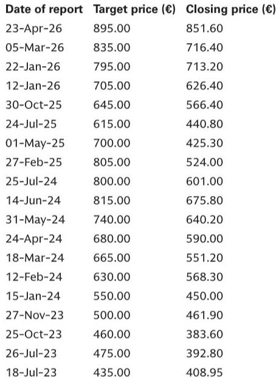
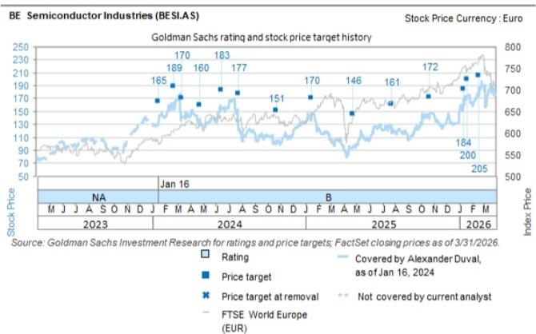

# Europe's AI Hardware Enablers Are Entering a New Growth Phase That Many Investors Are Underestimating

The semiconductor equipment and AI infrastructure cycle is not approaching a peak. It is shifting into a more durable, multi-year expansion driven by forces that extend well beyond the hyperscaler procurement patterns that dominated the narrative over the past two years. Recent datapoints across memory, AI infrastructure, and sovereign AI spending indicate that demand for European enablers is broadening rather than narrowing. For investors who have been conditioned to expect cyclical peaks in semiconductor capital equipment, the current setup demands a fundamental reassessment of both the duration and the magnitude of this cycle.

A global investment bank report has updated estimates and price targets for ASML, ASMI, BESI, and Nebius, reflecting a more constructive view on demand. The key driver is not a single catalyst but a convergence of structural trends: memory manufacturers are planning aggressive capacity expansions, AI infrastructure spending is accelerating beyond prior expectations, and sovereign AI initiatives are creating a new and potentially sticky source of demand. These forces are reinforcing each other in ways that make the current cycle look less like a typical upswing and more like a structural repricing of the entire ecosystem.

The implications for portfolio construction are significant. European technology hardware has often been treated as a tactical exposure within broader tech portfolios, but the evidence now suggests it deserves a more strategic allocation. The companies at the center of this analysis are not merely riding a wave; they are positioned at the intersection of multiple secular trends that are likely to persist even if macroeconomic conditions soften. The question is not whether the cycle will continue, but which companies are best positioned to capture the upside and what risks remain unaccounted for.

## Memory manufacturers are signalling a multi-year investment cycle that changes the demand calculus for equipment suppliers

The most underappreciated development in the current environment is the scale of memory investment that is now being telegraphed. A major memory manufacturer has announced plans to double wafer capacity over the next five years. This is not a marginal increase. It represents a fundamental commitment to expanding supply in anticipation of higher memory requirements driven by AI workloads, particularly high-bandwidth memory (HBM) which is essential for training and inference in large language models.

For European semiconductor equipment companies, this is a critical demand driver. Memory manufacturers are among the largest consumers of lithography, deposition, and packaging equipment. When a single memory player commits to doubling capacity, the ripple effects across the supply chain are substantial. ASML's extreme ultraviolet (EUV) and deep ultraviolet (DUV) tools are essential for advanced memory production. ASMI's deposition equipment is used in the fabrication of memory cells. BESI's packaging solutions are needed for the assembly of HBM stacks.

The significance of this announcement extends beyond the direct revenue impact. It signals that memory manufacturers see AI-driven demand as structural rather than cyclical. If they are willing to commit to five-year capacity plans, they must have confidence that the demand will materialize. This reduces the risk of a sudden capex pullback that has historically characterized memory cycles. The equipment companies benefit from both the volume and the visibility that such long-term planning provides.

## AI infrastructure spending is accelerating beyond prior expectations, creating a durable demand floor for European enablers

The narrative around AI infrastructure has been dominated by hyperscaler spending, but the latest datapoints suggest that the total addressable market is expanding in ways that benefit a broader set of players. A major networking and semiconductor company has reiterated its expectation of over $100 billion in AI semiconductor revenue by fiscal year 2027, supported by 10 gigawatts of data center capacity additions. Importantly, it expects strong growth to continue into fiscal year 2028 off this elevated base.

This is a crucial signal for European AI infrastructure plays like Nebius, which is building GPU-as-a-service capacity. The company recently announced plans to invest approximately 1.7 billion pounds to deploy three new Nvidia-powered facilities in the UK, with combined capacity reaching 65 megawatts by 2027. This is not a speculative build. It is a response to confirmed demand from customers who need access to GPU compute but cannot or will not build their own infrastructure.

The pricing environment is also supportive. GPU pricing for previous-generation hardware has increased year-to-date, with H100 pricing up 20% and A100 pricing up 15%. This indicates that demand continues to outstrip supply even for older nodes, which is unusual in technology markets where pricing typically declines over time. For Nebius and other infrastructure providers, this pricing power translates directly into revenue growth and margin expansion.

The implication for investors is that the AI infrastructure buildout is not a one-time event. It is a multi-year process that will require continuous investment in compute capacity, networking, and power. European companies that provide the equipment and infrastructure for this buildout are positioned to benefit from a demand cycle that has a longer duration and higher visibility than many market participants assume.

## Sovereign AI is creating a new demand vector that is less correlated with hyperscaler spending cycles

One of the most interesting developments in the current environment is the emergence of sovereign AI as a meaningful demand driver. A leading GPU manufacturer has stated that its sovereign AI revenue increased by over 80% year-over-year in the first quarter of its fiscal year. This is a striking figure that underscores the scale of government-led AI infrastructure investment.

Sovereign AI refers to the efforts by national governments to build their own AI computing capabilities, often for reasons of national security, economic competitiveness, or technological sovereignty. These projects are less sensitive to corporate budget cycles and are often funded through multi-year appropriations. For European equipment and infrastructure companies, sovereign AI represents a diversifying demand source that can help smooth out the cyclicality inherent in the semiconductor industry.

The implications are particularly relevant for companies like ASML and ASMI, which provide the advanced manufacturing equipment needed to produce the chips that go into sovereign AI infrastructure. Governments investing in AI capabilities will need to procure chips, and those chips require European equipment to manufacture. The sovereign AI trend also benefits Nebius, as governments may prefer to contract with European infrastructure providers rather than relying on hyperscalers based outside the region.

This demand vector is still in its early stages, but the growth rates are compelling. If sovereign AI continues to expand at this pace, it could become a material revenue contributor for European enablers over the next three to five years. The key question is whether this spending is sustainable or whether it represents a one-time catch-up investment. The early evidence suggests it is structural, driven by long-term strategic considerations rather than short-term budget cycles.

## The report leaves several meaningful open questions about the sustainability of China demand and the pace of hybrid bonding adoption

While the overall thesis is constructive, there are areas where the analysis raises more questions than it answers. The report notes that China wafer fab equipment spending is expected to remain broadly flat to slightly up in calendar year 2026, which is more resilient than previously expected. This is a positive datapoint, but it also introduces uncertainty about the medium-term trajectory.

China demand has been a significant driver for European semiconductor equipment companies, particularly ASML and ASMI. The resilience of this demand is partly driven by local players seeking to benefit from a strong semiconductor demand environment. However, the geopolitical landscape remains fluid, and export controls could shift the demand picture rapidly. The report does not fully address what happens to the bull case if China demand normalizes or declines, which is a risk that investors need to consider.

Another open question relates to the adoption timeline for hybrid bonding technology. BESI has exposure to hybrid bonding, which is a critical packaging technology for advanced logic chips. The report raises estimates for BESI's hybrid bonding business based on strong demand for leading-edge logic. However, the adoption of hybrid bonding has been slower than initially expected, and the technology faces competition from alternative packaging approaches. The report does not provide a detailed framework for assessing the probability of widespread hybrid bonding adoption or the implications if adoption is delayed further.

These open questions do not invalidate the bull thesis, but they highlight the areas where investors need to do their own work. The report provides a directional view, but the magnitude of the upside depends on assumptions that are inherently uncertain.

## A decision framework for investors: focus on exposure to structural demand drivers and the ability to maintain pricing power

For investors looking to translate the report's analysis into actionable decisions, three factors should guide the evaluation of European AI hardware enablers.

First, assess the degree of exposure to structural rather than cyclical demand drivers. Companies with significant exposure to memory investment, AI infrastructure, and sovereign AI are better positioned than those that rely primarily on general-purpose semiconductor demand. ASML and ASMI have broad exposure across these categories, while Nebius is a pure play on AI infrastructure. BESI's exposure is more concentrated in packaging, which benefits from leading-edge logic demand but is also more sensitive to the pace of technology adoption.

Second, evaluate pricing power. The ability to maintain or increase pricing in a competitive environment is a key differentiator. ASML's monopoly position in EUV lithography gives it significant pricing power. ASMI benefits from its specialized deposition technology. Nebius is currently benefiting from GPU scarcity, but this advantage may erode as capacity expands. BESI's pricing power depends on the adoption of its hybrid bonding technology, which is still uncertain.

Third, consider the risk of disruption. The European hardware ecosystem is not immune to competition. ASML faces the risk of EUV delays and market share shifts. ASMI has high customer concentration. BESI faces competition from alternative packaging technologies. Nebius competes with hyperscalers that have deeper pockets. The report acknowledges these risks, but investors need to assess whether the potential upside justifies the specific risk profile of each company.

Join the community to read the full report and review the original charts.

*This article is for learning and discussion only and does not constitute investment advice.*

Personal reading notes and learning share only. Not investment advice.

