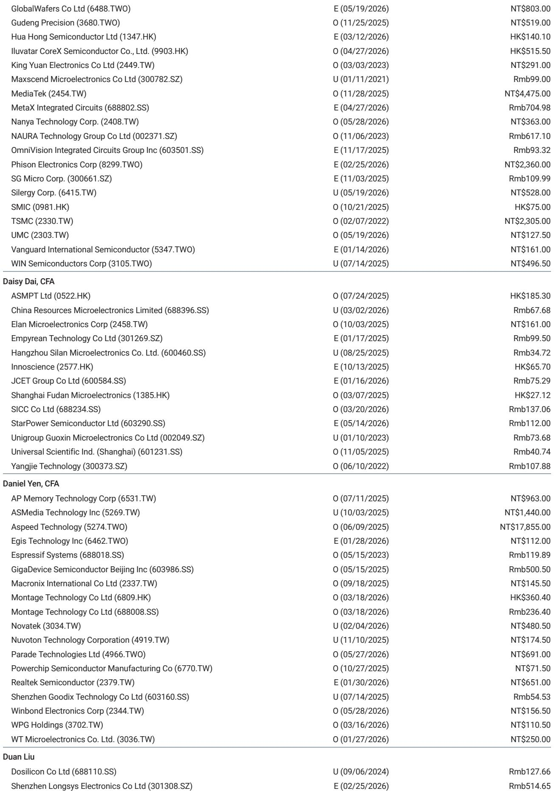
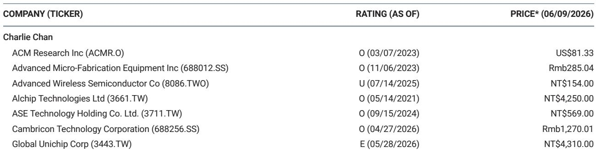
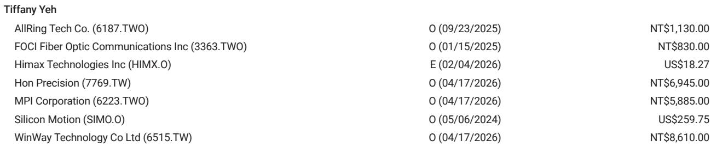

# The CPO Inflection Is Real, But It Arrives Later Than the Market Thinks

The market is pricing coherent optical packaging as a near-term catalyst. The reality is that 2027 will be a year of production teething, not volume inflection. A recent deep-dive analysis from a leading Asia-Pacific technology research team models 2027 optical engine shipments at 6 to 7 million units. This figure stands in stark contrast to the 20 to 30 million units that many investors have embedded in their expectations. The gap is not trivial. It is a chasm that will force a significant reset in sentiment for CPO-related stocks over the next twelve to eighteen months.

This is not a call against the CPO thesis. The long-term trajectory remains intact. The argument here is about timing, magnitude, and the specific bottlenecks that will govern the actual ramp. The market is conflating technological readiness with production readiness. These are two very different states. The technology works. The manufacturing ecosystem does not yet work at scale. Understanding the difference between these two realities is the single most important analytical task for anyone invested in the optical interconnect value chain.

The analysis points to a cadence where transceivers, optics, and copper will coexist through 2026 to 2028. The mainstream solution will remain at 1.6 and 3.2 terabit speeds. CPO will begin its true boom phase only from 2028 onward. For investors, this means the near-term path is one of expectation resets, not disappointment in the technology itself. The stocks that have run on CPO enthusiasm will face pressure as the market recalibrates. But the same stocks will benefit from a longer-dated catalyst path that begins to materialize in earnest two years from now.

The question is not whether CPO will happen. It will. The question is whether the market can tolerate the gap between current expectations and the actual production curve.

## Optical Engine Shipments in 2027 Will Fall Far Short of Investor Expectations, Creating a Near-Term Sentiment Reset

The most immediate disconnect between the research and market consensus lies in the 2027 optical engine shipment forecast. The analysis models 6 to 7 million units for that year, including both scale-up and scale-out solutions. Investor expectations sit at 20 to 30 million units. That is a gap of roughly four to five times.

This is not a trivial forecasting error. It reflects a fundamental misunderstanding of the production ramp dynamics. The industry is not simply scaling up a known process. It is trying to commercialize a new packaging paradigm that requires simultaneous advances in photonic integrated circuit manufacturing, silicon photonics yield, and downstream assembly. Each of these stages has its own yield curve, and none of them are mature.

The implication is clear. The stocks that have been re-rated on CPO enthusiasm will face a period of sentiment adjustment. This does not mean the thesis is broken. It means the market has front-loaded expectations that the production system cannot yet deliver. The reset will be uncomfortable, but it will also create entry points for investors who understand the longer arc of the technology.

## Two Manufacturing Bottlenecks Will Determine the Actual Ramp, and Both Are More Severe Than the Market Assumes

The analysis identifies two critical swing factors that will govern final CPO-related shipments. The first is silicon photonic integrated circuit yield. TSMC has committed to expanding PIC capacity to 10,000 wafers per month by the first quarter of 2027. That is a significant capacity addition. But capacity is not output. The yield on silicon photonics at scale remains between 50 and 60 percent. That is the first major bottleneck.

The second bottleneck is even more severe. Downstream assembly yield currently sits at 20 to 50 percent. This is the stage where optical engines are integrated into final modules. The process is delicate, the alignment tolerances are extreme, and the manufacturing learning curve is still in its early innings. An assembly yield of 20 percent means that four out of five units are lost in the final stage of production. Even at 50 percent, half the units are scrapped.

These two bottlenecks compound each other. A 50 percent PIC yield combined with a 30 percent assembly yield means that for every 100 wafers started, only 15 end up as shippable optical engines. That is a brutal efficiency curve. It explains why the 2027 shipment forecast is so far below market expectations. The industry needs multiple years of yield learning before volume can ramp.

The strategic implication is that the companies best positioned to benefit from CPO are not necessarily the ones with the most advanced technology. They are the ones that control the yield improvement levers: the equipment suppliers, the testing and measurement firms, and the packaging specialists who can drive assembly yield higher.

## The Coexistence Period from 2026 to 2028 Means That Pluggable Transceivers Remain the Dominant Solution, Not CPO

One of the most important structural insights from the analysis is that the market will not switch to CPO in a binary fashion. The period from 2026 through 2028 will see transceivers, optics, and copper coexist as interconnect solutions. The mainstream data center interconnect speed will remain at 1.6 and 3.2 terabit rates, which can still be served by advanced pluggable modules.

This coexistence period has a profound implication for the competitive landscape. Companies that have bet entirely on CPO will face a revenue gap during these years. Companies that maintain exposure to pluggable transceiver components will have a bridge to the CPO era. The analysis highlights one specific company that has material exposure to pluggable transceiver components but trades at a significant valuation premium to its A-share industry peers. That premium is difficult to justify if the pluggable business remains dominant for longer than the market expects.

The coexistence period also means that copper-based solutions will not disappear overnight. For shorter-reach interconnects within the data center, copper remains cost-effective and power-efficient. The CPO thesis relies on the assumption that optical interconnect becomes necessary at higher speeds and longer distances. That is true. But it is not true for every link in the data center. The migration will be gradual, and the legacy solutions will continue to generate revenue and cash flow for companies that have been written off as obsolete.

## The Report Leaves a Critical Question Unanswered: Which Part of the Value Chain Captures the Most Value at Scale?

The analysis provides detailed modeling of shipments and yields, but it does not fully resolve the question of value capture. When CPO does reach volume production in 2028 and beyond, which layer of the value chain will earn the highest returns?

In traditional optical component markets, the value has been concentrated in the laser and modulator suppliers, not in the assembly or packaging firms. CPO changes this dynamic because the packaging and alignment processes become the critical differentiators. The companies that can achieve high assembly yields will have a structural cost advantage that is difficult to replicate.

But there is also a scenario where the foundry captures most of the value. TSMC's investment in PIC capacity signals that the company sees photonics as an extension of its advanced packaging franchise. If the foundry can integrate the photonic and electronic functions on a single substrate, it may commoditize the optical component suppliers and capture the margin itself.

The analysis does not take a definitive position on this question. It is an open analytical problem that will only be resolved as the production data emerges over the next two years. Investors should watch the yield improvement trajectories at each layer of the value chain as the primary signal of where value will concentrate.

## A Decision Framework for Navigating the CPO Investment Cycle

The analysis can be translated into a structured decision framework for investors. The framework has three dimensions: time horizon, yield sensitivity, and value chain position.

For time horizon, the distinction is between 2027 and 2028. In 2027, the market will reset expectations downward. Stocks that have run on CPO enthusiasm will likely underperform. In 2028, the volume inflection begins. The stocks that survive the reset will have a multiyear catalyst path ahead of them. The optimal strategy is to reduce exposure to pure CPO plays in the near term and build positions as the yield data improves.

For yield sensitivity, the critical metric is not revenue growth or market share. It is the yield improvement rate at the PIC and assembly stages. Companies that demonstrate quarter-over-quarter yield improvement will be the ones that can deliver the 2028 ramp. Companies that show stagnant yields will be priced as options, not as operating businesses. Investors should demand transparency on yield data and penalize companies that obscure it.

For value chain position, the framework favors companies that are indispensable to the yield improvement process. Equipment suppliers that enable finer alignment tolerances. Testing firms that provide the data needed to optimize the assembly process. Packaging specialists that control the final integration step. These companies have pricing power regardless of which optical component vendor wins the technology race.

## Join the Community to Read the Full Report and Review the Original Charts

The analysis presented here is a synthesis of a detailed research report that includes shipment models, yield assumptions, and stock-specific implications. The original charts provide a visual representation of the gap between market expectations and the modeled production curve. They also show the yield learning trajectories that will determine the timing of the CPO inflection.

The full report contains additional analysis on the specific companies that are best positioned to benefit from each phase of the CPO cycle. It also includes a more detailed discussion of the coexistence period and the implications for pluggable transceiver suppliers. For investors who want to build a precise position-sizing framework based on the yield improvement curves, the original data is essential.

Join the community to read the full report and review the original charts.

*This article is for learning and discussion only and does not constitute investment advice.*

Personal reading notes and learning share only. Not investment advice.

