## Hong Kong/China Insurance | Asia Pacific

# 2026 Industry Observation: Driven by Leading Players

Greater disclosure in solvency reports improves industry visibility. We expect diversified product strategies, optimized investment allocation, and continued industry de-risking, with limited system-wide risks. Leading insurers should sustain their competitive edge.

China insurers must deliver solvency reports with more detailed operating metrics from 1Q26, improving our ability to assess and track listed insurers' performance and the broader industry.

Large insurers leading par product transition towards more diversified product strategy. Over the past two years, listed insurers have largely completed the transition, with $>80\%$ of new premiums in par products in 1Q26. Many small and medium-sized (SME) insurers have shown similar trends across channels. However, many SMEs are now revisiting product strategies, with some reinvigorating traditional product sales since 2Q26. We expect the pricing interest rate for current par products to continue declining (from 1.75% to $\sim1.25\%$ ) over the next few quarters, alongside the illustration rate. Large insurers may continue to focus on par products, while SMEs adopt a more balanced mix between par and non-par. By channel, large insurers could maintain their banca edge despite tighter regulation and further optimize payment-period structures, while SMEs need to rethink channel partnerships and cash flow management. The agency channel will remain core for large insurers, with quality improving over time.

Ongoing optimization of investment strategies across accounts amid low-rate, volatile market. Interest rates have stabilized over the past year, and a steeper yield curve could offer some support to insurers. However, bond-trading demand remains strong. Listed insurers have increased equity allocations, taking a more proactive approach in par reserve accounts while maintaining a more prudent strategy in non-par accounts. Large insurers should continue to benefit from an edge in alternative asset investments.

## Solvency remains a key constraint, and insurers are improving operations.

Despite some deregulation, solvency pressure could continue to weigh on certain insurers' asset allocation and liability growth, and we see limited scope for solvency rule revisions in 2026. At the industry level, insurers are taking effective measures to mitigate risks and enhance long-term competitiveness, while duration mismatch is unlikely to rank as a near-term priority under the current backdrop. Risks remain concentrated in select pockets, and large insurers should maintain their advantages. We continue to favor high-quality names including Ping An, China Life, and AIA despite short-term headwinds, which should have limited structural impact.

MS ASIA LIMITED+

## Rick Zhao

Equity Analyst

Rick.Zhao@morganstanley.com +852 2239-7033

## Richard Xu, CFA

Equity Analyst

Richard.Xu@morganstanley.com +852 2848-6729

## Chenqian Liu

Research Associate

Chenqian.Liu@morganstanley.com +852 3963-0359

## Asia Summer School 2026

## HONG KONG/CHINA INSURANCE

Asia Pacific

Industry View

Attractive

MS does and seeks to do business with companies covered in MS. As a result, investors should be aware that the firm may have a conflict of interest that could affect the objectivity of MS. Investors should consider MS as only a single factor in making their investment decision.

## For analyst certification and other important disclosures, refer to the Disclosure Section, located at the end of this report.

+= Analysts employed by non-U.S. affiliates are not registered with FINRA, may not be associated persons of the member and may not be subject to FINRA restrictions on communications with a subject company, public appearances and trading securities held by a research analyst account.

## Large insurers leading industry-wide liability-side transition

## Insurers have largely completed shift to par products over past two years at industry level

Par products now account for $>80\%$ of listed insurers' new business in 2026. Declining long-term interest rates in recent years, together with regulatory guidance, have driven China insurers' product strategy shift from traditional to participating products. While long-term rates remain relatively low this year despite some recovery in 2H25, demand for savings-related insurance remains resilient, as both duration and potential returns exceed bank deposits. As a result, listed insurers have accelerated par product roll-outs since 2H24 and largely completed the transition from traditional to participating products across both agency and banca channels in 2026. In 1Q26, most listed insurers recorded a $\sim90\%$ par product mix in regular FYP (first-year premiums), up from $<50\%$ in 1H25.

Exhibit 1: Insurers' pricing interest rate caps have been declining over the past three years in China  
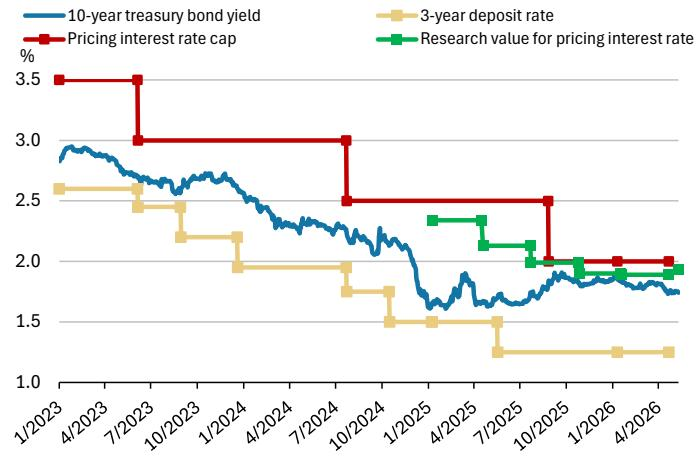

line chart

| Date     | 10-year treasury bond yield | Pricing interest rate cap | 3-year deposit rate | Research value for pricing interest rate |
|----------|------------------------------|----------------------------|---------------------|------------------------------------------|
| 1/2023   | ~2.9                         | 3.5                        | ~2.6                | -                                        |
| 4/2023   | ~2.8                         | 3.5                        | ~2.6                | -                                        |
| 7/2023   | ~2.7                         | 3.0                        | ~2.5                | -                                        |
| 10/2023  | ~2.6                         | 3.0                        | ~2.4                | -                                        |
| 1/2024   | ~2.5                         | 3.0                        | ~2.3                | -                                        |
| 4/2024   | ~2.4                         | 3.0                        | ~2.2                | -                                        |
| 7/2024   | ~2.3                         | 3.0                        | ~2.1                | -                                        |
| 10/2024  | ~2.2                         | 3.0                        | ~2.0                | -                                        |
| 1/2025   | ~2.1                         | 3.0                        | ~1.9                | -                                        |
| 4/2025   | ~1.9                         | 3.0                        | ~1.8                | -                                        |
| 7/2025   | ~1.8                         | 3.0                        | ~1.7                | -                                        |
| 10/2025  | ~1.7                         | 3.0                        | ~1.6                | -                                        |
| 1/2026   | ~1.6                         | 3.0                        | ~1.5                | -                                        |
| 4/2026   | ~1.5                         | 3.0                        | ~1.4                | -                                        |

Source: IAC, PBOC, CFETS, Company data, MS

Exhibit 2: Par account cash flows as a % of operating cash flows increased across most peers in 1Q26 vs. 1Q25  
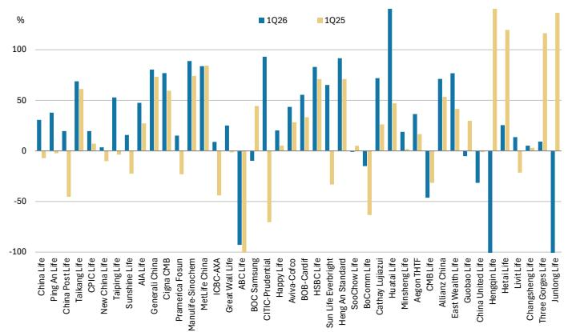

bar chart

| Company | 1Q26 (%) | 1Q25 (%) |
| :--- | :--- | :--- |
| China Life | 30 | -10 |
| Ping An Life | 38 | -45 |
| China Post Life | 20 | -70 |
| Taiang Life | 68 | 60 |
| CPIC Life | 20 | 5 |
| New China Life | 50 | -10 |
| Taiping Life | 15 | -15 |
| Sunshine Life | 45 | -25 |
| AIA Life | 75 | 25 |
| Generali China | 78 | 55 |
| Cigna CMB | 75 | 55 |
| Pramerica Fosun | 15 | -25 |
| Manulife Sinochem | 85 | -15 |
| MetLife China | 80 | 80 |
| ICBC AXA | 10 | -40 |
| Great Wall Life | 25 | -90 |
| ABC Life | -90 | -80 |
| BOC Samsung | -10 | 45 |
| CITIC Prudential | 90 | -35 |
| Happy Life | 20 | 5 |
| Aviva-Cotco | 40 | 30 |
| BOB-Caribf | 55 | 30 |
| HSBCI Life | 80 | -30 |
| Sun Life Everbright | 60 | -35 |
| Heng An Standard | 90 | 70 |
| SooChow Life | -10 | 5 |
| BoComm Life | -20 | -40 |
| Cathay Lujiazui | 65 | 25 |
| Huatai Life | 120 | 45 |
| Minsheng Life | 15 | 10 |
| Aegon THF | 35 | -15 |
| CMB Life | -45 | -35 |
| Allianz China | 70 | 50 |
| East Wealth Life | -5 | 40 |
| Guobao Life | -30 | 30 |
| China United Life | -90 | -10 |
| Hengqin Life | 25 | 120 |
| Hetai Life | 15 | -20 |
| Livit Life | 10 | -15 |
| Changsheng Life | 5 | 120 |
| Three Gorges Life | 10 | 120 |
| Junlong Life | -90 | 120 |

Source: Company data, MS

From an industry-wide perspective, most unlisted insurers have delivered similar trends. 1) Most insurers posted positive YoY operating cash flow growth in 1Q26 (Exhibit 2), with a \~11% median. We see a material increase in participating products' contribution to operating cash flow in 1Q26 vs. 1Q25 across most names, making par products a key driver of liability-side growth and near-term cash flow improvement. 2) In the banca channel, on which most unlisted insurers rely, par products contributed \~90% of foreign insurers' new premiums and \~70% of unlisted domestic insurers' new premiums (Exhibit 11).

However, we expect a more diversified product strategy to emerge between large insurers and the rest. We view this round of product transition as more regulator-led, especially as the pricing interest rate gap between traditional and par products narrowed from 50bps to 25bps since 3Q25. SME insurers may shift back to a more balanced par/non-par mix, considering:

\- Higher actual cost: although par products carry lower guaranteed liability costs vs. traditional products, actual liability costs (including non-guaranteed components)

are higher, and cutting the fulfillment ratio could undermine competitiveness.

- Customer profit-sharing mechanisms: par products feature profit sharing, which can reduce retained shareholder profits, especially when insurers generate excess investment returns, potentially slowing the de-risking process.  
- Potential higher capital requirements: par products can be more capital-intensive than traditional products, especially with more proactive asset allocation.  
- Cash flow management challenges: par products are more complex to manage vs. traditional products, particularly for small insurers handling participating fund reserves and surrender risk.

As a result, we expect listed insurers to continue focusing on par products over the longer term, supported by agent channel inertia that ensures product continuity. However, the pricing interest rate could decline to \~1.25% over the next few quarters, likely through regulatory window guidance and product filing management, with some insurers already rolling out such products in 2026. In March 2026, the illustration rate was guided down from 3.9% to 3.5%, and actual dividend payout was \~3.2% for 2025. We expect the illustration rate to decline further to \~3.2% over the next few quarters. For most SME insurers, we expect a more balanced approach between traditional and par products, with some potentially fully shifting back to traditional products in response to shareholder demands.

## Clear opportunities in the banca channel, with large insurers maintaining their edge

Continued strong banca channel growth at the industry level... Bancassurance rebounded with $>15\%$ new premium growth in 2025 after a brief adjustment due to tighter expense regulation (“Bao Xing He Yi”) in late 2023 and early 2024. Momentum carried into 1Q26, with $\sim17\%$ FYP growth and $\sim19\%$ RP FYP growth YoY. Higher channel margins and a maturing term deposit base (Exhibit 5 – a large 2023 term deposit cohort matures around 2026) have supported growth.

Exhibit 3: Industry-wide banca channel premiums  
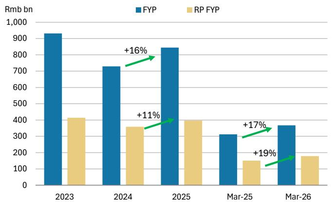

bar chart

| Year | FYP (Rmb bn) | RP FYP (Rmb bn) | Growth (%) |
| :--- | :--- | :--- | :--- |
| 2023 | 930 | 415 | |
| 2024 | 730 | 360 | +16 |
| 2025 | 845 | 400 | +11 |
| Mar-25 | 310 | 150 | +17 |
| Mar-26 | 370 | 180 | +19 |

Source: NAFR, MS

Exhibit 4: More term deposits in China in 2023, with potentially higher demand to reinvest at maturity  
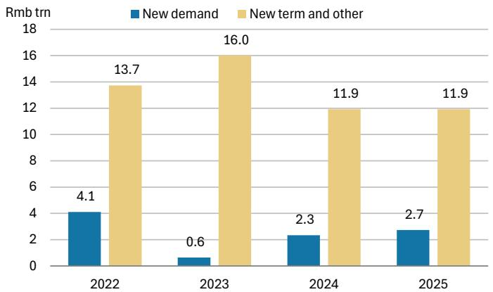

bar chart

| Year | New demand (Rmb trn) | New term and other (Rmb trn) |
| :--- | :--- | :--- |
| 2022 | 4.1 | 13.7 |
| 2023 | 0.6 | 16.0 |
| 2024 | 2.3 | 11.9 |
| 2025 | 2.7 | 11.9 |

Source: NAFR, PBOC, NBS, AMAC, MS

...and SME insurers rely heavily on the banca channel. Channel structures have diverged between large insurers and mid-to-small players. Most insurers with assets between Rmb10bn and Rmb1tn derive 50–100% of gross premiums from banca (Exhibit 6), while insurers with assets above Rmb1tn, including most listed players, maintain a more balanced mix – with the agency channel contributing \~60–80% of total premiums – supporting stronger margins and more sustainable value creation through better control of proprietary channels and tied agents.

Exhibit 5: 1Q26 par product mix in banca channel  
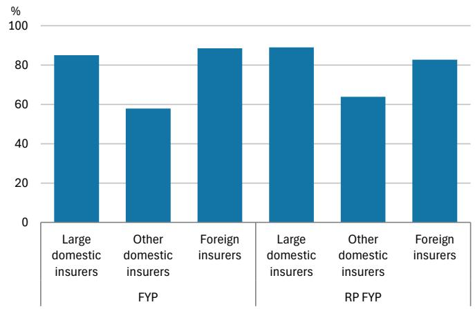

bar chart

| Category | Large domestic insurers (%) | Other domestic insurers (%) | Foreign insurers (%) |
| :--- | :---: | :---: | :---: |
| FYP | 85 | 58 | 89 |
| RP FYP | 89 | 64 | 83 |

Source: Company data, MS

Exhibit 6: 1Q26 banca channel mix as a % of total premium vs. total asset  
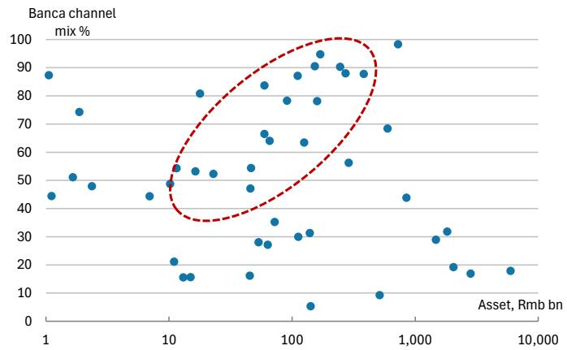

scatter plot

| Asset, Rmb bn | Banca channel mix % |
| ------------- | ------------------- |
| 1             | 85                  |
| 2             | 75                  |
| 3             | 50                  |
| 4             | 45                  |
| 5             | 40                  |
| 6             | 45                  |
| 7             | 50                  |
| 8             | 55                  |
| 9             | 60                  |
| 10            | 65                  |
| 11            | 70                  |
| 12            | 75                  |
| 13            | 80                  |
| 14            | 85                  |
| 15            | 90                  |
| 16            | 95                  |
| 17            | 90                  |
| 18            | 85                  |
| 19            | 80                  |
| 20            | 75                  |
| 21            | 70                  |
| 22            | 65                  |
| 23            | 60                  |
| 24            | 55                  |
| 25            | 50                  |
| 26            | 45                  |
| 27            | 40                  |
| 28            | 35                  |
| 29            | 30                  |
| 30            | 25                  |
| 31            | 20                  |
| 32            | 15                  |
| 33            | 10                  |
| 34            | 5                   |
| 35            | 0                   |
| 36            | 5                   |
| 37            | 10                  |
| 38            | 15                  |
| 39            | 20                  |
| 40            | 25                  |
| 41            | 30                  |
| 42            | 35                  |
| 43            | 40                  |
| 44            | 45                  |
| 45            | 50                  |
| 46            | 55                  |
| 47            | 60                  |
| 48            | 65                  |
| 49            | 70                  |
| 50            | 75                  |
| 51            | 80                  |
| 52            | 85                  |
| 53            | 90                  |
| 54            | 95                  |
| 55            | 90                  |
| 56            | 85                  |
| 57            | 80                  |
| 58            | 75                  |
| 59            | 70                  |
| 60            | 65                  |
| 61            | 60                  |
| 62            | 55                  |
| 63            | 50                  |
| 64            | 45                  |
| 65            | 40                  |
| 66            | 35                  |
| 67            | 30                  |
| 68            | 25                  |
| 69            | 20                  |
| 70            | 15                  |
| 71            | 10                  |
| 72            | 5                   |
| 73            | 0                   |
| 74            | 5                   |
| 75            | 10                  |
| 76            | 15                  |
| 77            | 20                  |
| 78            | 25                  |
| 79            | 30                  |
| 80            | 35                  |
| 81            | 40                  |
| 82            | 45                  |
| 83            | 50                  |
| 84            | 55                  |
| 85            | 60                  |
| 86            | 65                  |
| 87            | 70                  |
| 88            | 75                  |
| 89            | 80                  |
| 90            | 85                  |
| 91            | 90                  |
| 92            | 95                  |
| 93            | 90                  |
| 94            | 85                  |
| 95            | 80                  |
| 96            | 75                  |
| 97            | 70                  |
| 98            | 65                  |
| 99            | 60                  |
| 100           | 55                  |
| 101           | 50                  |
| 102           | 45                  |
| 103           | 40                  |
| 104           | 35                  |
| 105           | 30                  |
| 106           | 25                  |
| 107           | 20                  |
| 108           | 15                  |
| 109           | 10                  |
| 110           | 5                   |
| Note: The actual values may vary due to the random nature of the data generation. The provided values are just an example. The actual values may be different based on the number of variables such as 'Rmb bn'.

Source: Company data, MS

Exhibit 7:
1Q26 channel structure across insurers – gross premium basis  
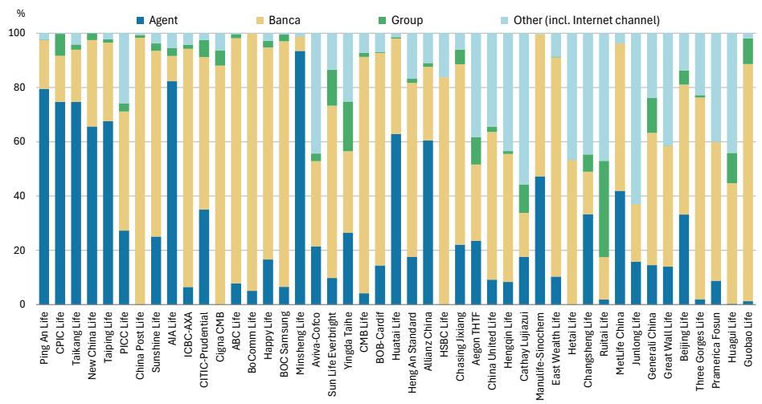

stacked bar chart

| Company | Agent (%) | Banca (%) | Group (%) | Other (incl. Internet channel) (%) |
| :--- | :--- | :--- | :--- | :--- |
| Ping An Life | 80 | 25 | 10 | 5 |
| CPIC Life | 75 | 20 | 10 | 5 |
| Taikang Life | 75 | 20 | 5 | 5 |
| New China Life | 65 | 30 | 5 | 5 |
| Taiping Life | 68 | 30 | 5 | 5 |
| PICC Life | 27 | 60 | 5 | 10 |
| China Post Life | 25 | 70 | 5 | 5 |
| Sunshine Life | 82 | 20 | 5 | 5 |
| AIA Life | 6 | 80 | 5 | 5 |
| ICBC-AXA | 6 | 80 | 5 | 5 |
| CITIC-Prudential | 34 | 40 | 10 | 10 |
| Cigna CMB | 7 | 60 | 5 | 10 |
| ABC Life | 7 | 90 | 5 | 5 |
| BoComm Life | 5 | 90 | 5 | 5 |
| Happy Life | 16 | 80 | 5 | 5 |
| BOC Samsung | 6 | 70 | 5 | 5 |
| Minsheng Life | 93 | 10 | 5 | 5 |
| Aviva-Cofco | 21 | 30 | 5 | 10 |
| Sun Life Everbright | 10 | 60 | 10 | 10 |
| Yingda Taihe | 26 | 40 | 10 | 10 |
| CMB Life | 4 | 80 | 5 | 10 |
| BOB-Cardif | 14 | 70 | 5 | 10 |
| Huatai Life | 62 | 30 | 10 | 10 |
| Heng An Standard | 17 | 50 | 5 | 10 |
| Allianz China | 60 | 20 | 5 | 10 |
| HSBC Life | 4 | 80 | 5 | 10 |
| Chasing Jixiang | 22 | 60 | 5 | 10 |
| Aegon THTF | 23 | 40 | 10 | 10 |
| China United Life | 9 | 60 | 5 | 10 |
| Hengqin Life | 8 | 60 | 5 | 10 |
| Cathay Lujiazui | 17 | 20 | 10 | 10 |
| Manulife-Sinochem | 47 | 20 | 5 | 10 |
| East Wealth Life | 10 | 60 | 5 | 10 |
| Hetai Life | -2 | 40 | 10 | 10 |
| ChangSheng Life | 33 | 20 | 10 | 10 |
| Ruitai Life | 2 | 18 | 20 | 10 |
| MetLife China | 42 | 35 | 10 | 10 |
| Junlong Life | 15 | 30 | 10 | 10 |
| General China | 14 | 60 | 15 | 10 |
| Great Wall Life | 13 | 60 | 15 | 10 |
| Beijing Life | 33 | 30 | 10 | 10 |
| Three Gorges Life | -2 | 60 | -5 | -5 |
| Pramerica Fosun | -8 | -40 | -15 | -15 |
| Huagui Life | -8 | -40 | -15 | -15 |
| Guobao Life | -2 | -40 | -15 | -15 |
The chart displays the percentage distribution of four categories: Agent, Banca, Group, and Other (incl. Internet channel). The values for 'Other' are estimated based on the legend. The data is presented in a horizontal bar format with each bar representing a single company's share of the total. The percentages for 'Agent' and 'Group' are labeled on top of each bar. The 'Other' category is also labeled on the right side but not explicitly shown in the chart.

Note: Ranking by total asset volume as of 1Q26. Source: Company data, MS

Big insurers are focusing on payment structure optimization, while small insurers are pushing SP sales. The “Big Seven” life insurers (incl. China Life, Ping An Life, CPIC Life, Taikang Life, New China Life, Taiping Life, and PICC Life) have increased their regular-pay FYP mix since 2023, with momentum more pronounced in 1Q26 (from <40% in 1Q25 to >60% in 1Q26, Exhibit 11). Both CPIC and NCI cut banca SP FYP by two-thirds in 1Q26 (Exhibit 12), while other insurers saw declining regular FYP mix in 2025 and 1Q26. Domestic insurers (excl. Big Seven) saw strong FYP growth in 1Q26 while RP FYP was flattish (Exhibit 9), while foreign insurers sought a balance between SP and RP growth.

Only a few SME insurers are pushing to improve their share of regular-premium products, while most unlisted insurers still rely heavily on single-premium products with limited contribution from regular premium and long-tenor products (Exhibit 13).

Some moderate slowdown over the rest of 2026, while large insurers maintain competitiveness. As the base rises from 2Q26, we expect some slowdown in banca growth, alongside regulatory actions to curb excessively high growth at certain insurers. The regulator's Notice No. 65 on strengthening banca fee management further restricts expense allocation across channel commissions, banca specialist compensation, training and client service fees, and allocated fixed costs, while prohibiting improper expense reallocation – shifting insurers from an “expense-driven” to a “service-driven” model. This should continue to favor large insurers, given their advantages in fixed-cost allocation and brand premium.

# Steepened Yield Curve and Increased Equity Fluctuation Impact

Stabilized long-term interest rates and a steeper yield curve in 2026: China's 10-year government bond yield rebounded to $\sim 1.8\%$ in 2H25 after bottoming at $\sim 1.6\%$ in early 2025 and has remained broadly stable at this level in 2026 YTD. The yield curve has steepened, with long-end rates (30-year) rising more notably over the past year (Exhibit 9) – the 30-year/10-year treasury spread widened to 53bps in May 2026 from 22bps in May 2025, which should prove more supportive for insurers over the longer term.

Demand for bond trading remains robust: Over the past few years, insurers have sold a large volume of long-duration products (e.g., higher sum assured whole life and par products), extending back-book liability duration. At the same time, they have not meaningfully increased bond allocations due to relatively low rates. As a result, China's life insurance sector recorded an average duration gap of 9.1 years in 3Q24, a five-year high vs. 6.6 years in 2021, according to the NAFR (National Administration of Financial Regulation). A steeper yield curve could marginally strengthen insurers' incentive to add long- and ultra-long-duration bonds vs. 2025. However, bond trading demand remains strong under this backdrop.

Exhibit 8: 10-year treasury bond yield slightly rebounded after bottoming in 1H25  
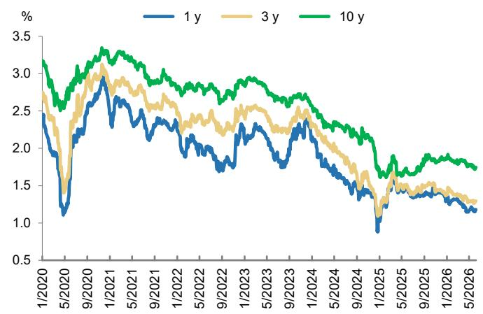

line chart

| Date     | 1 y   | 3 y   | 10 y  |
|----------|-------|-------|-------|
| 1/2020   | 2.5   | 2.7   | 3.2   |
| 5/2020   | 1.2   | 1.5   | 2.5   |
| 9/2020   | 2.8   | 3.0   | 3.3   |
| 1/2021   | 2.6   | 2.9   | 3.4   |
| 5/2021   | 2.4   | 2.7   | 3.2   |
| 9/2021   | 2.3   | 2.6   | 3.1   |
| 1/2022   | 2.1   | 2.5   | 3.0   |
| 5/2022   | 1.9   | 2.4   | 2.9   |
| 9/2022   | 1.8   | 2.3   | 2.8   |
| 1/2023   | 2.0   | 2.5   | 2.9   |
| 5/2023   | 2.2   | 2.6   | 3.0   |
| 9/2023   | 2.4   | 2.7   | 3.1   |
| 1/2024   | 2.3   | 2.6   | 3.0   |
| 5/2024   | 1.8   | 2.4   | 2.8   |
| 9/2024   | 1.5   | 2.1   | 2.6   |
| 1/2025   | 0.9   | 1.6   | 1.8   |
| 5/2025   | 1.4   | 1.7   | 1.9   |
| 9/2025   | 1.3   | 1.6   | 1.8   |
| 1/2026   | 1.2   | 1.5   | 1.7   |
| 5/2026   | 1.1   | 1.4   | 1.6   |

Source: PBOC, CFETS, CEIC, MS

Exhibit 9: Long-duration allocation becoming more attractive as long-end yield continues to widen  
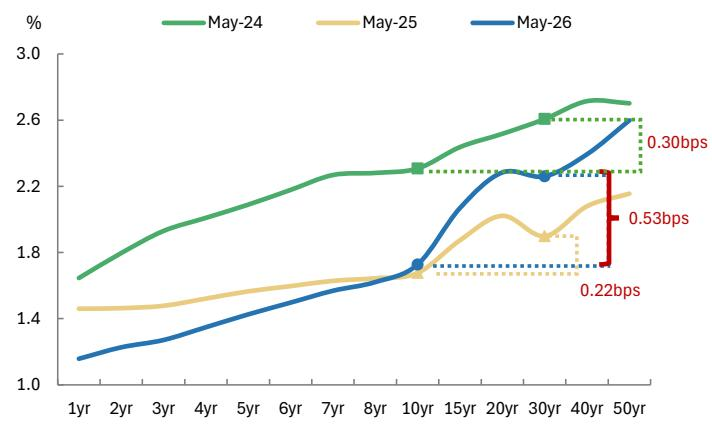

line chart

| Maturity | May-24 | May-25 | May-26 |
| -------- | ------ | ------ | ------ |
| 50yr     | 2.6    | 2.2    | 2.6    |
| 40yr     | 2.6    | 2.2    | 2.6    |
| 30yr     | 2.6    | 2.2    | 2.6    |
| 20yr     | 2.6    | 2.2    | 2.6    |
| 15yr     | 2.6    | 2.2    | 2.6    |
| 10yr     | 2.6    | 2.2    | 2.6    |
| 8yr      | 2.6    | 2.2    | 2.6    |
| 7yr      | 2.6    | 2.2    | 2.6    |
| 6yr      | 2.6    | 2.2    | 2.6    |
| 5yr      | 2.6    | 2.2    | 2.6    |
| 4yr      | 2.6    | 2.2    | 2.6    |
| 3yr      | 2.6    | 2.2    | 2.6    |
| 2yr      | 2.6    | 2.2    | 2.6    |
| 1yr      | 2.6    | 2.2    | 2.6    |

Source: PBOC, CFETS, CEIC, MS

Notably higher impact from equity volatility under IFRS 9: As most non-listed insurers adopted IFRS 9 from early 2026, equity asset classification and its impact on reported earnings have increased significantly. Leading insurers have materially raised equity allocations over the past two years, reaching \~15%–20% of total invested assets (including equities and funds), with limited room for further increases, in our view. However, equity investments can continue to grow alongside the expansion of overall insurance funds. Equity strategies vary across insurers, including high-dividend, growth-oriented, and blended approaches. While FVOCI equity exposure differs meaningfully, insurers with lower FVOCI allocations still show an incentive to gradually increase exposure to high-dividend stocks over time.

For non-listed insurers, we believe most have largely completed asset reclassification, and we do not expect further significant rebalancing following the adoption of the new accounting standards.

Exhibit 10: Listed insurers' overall bond allocation slightly declined in 2025 while government bond allocation increased  
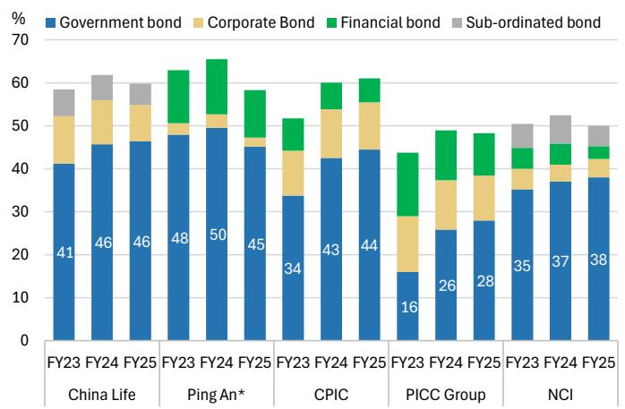

stacked bar chart

| Company | Year | Government bond (%) | Corporate Bond (%) | Financial bond (%) | Sub-ordinated bond (%) |
| :--- | :--- | :--- | :--- | :--- | :--- |
| China Life | FY23 | 41 | 16 | 0 | 8 |
| China Life | FY24 | 46 | 12 | 0 | 7 |
| China Life | FY25 | 46 | 10 | 0 | 7 |
| Ping An* | FY23 | 48 | 4 | 10 | 0 |
| Ping An* | FY24 | 50 | 4 | 10 | 0 |
| Ping An* | FY25 | 45 | 3 | 10 | 0 |
| CPIC | FY23 | 34 | 10 | 9 | 0 |
| CPIC | FY24 | 43 | 12 | 6 | 0 |
| CPIC | FY25 | 44 | 12 | 6 | 0 |
| PICC Group | FY23 | 16 | 18 | 17 | 0 |
| PICC Group | FY24 | 26 | 12 | 13 | 0 |
| PICC Group | FY25 | 28 | 10 | 11 | 0 |
| NCI | FY23 | 35 | 6 | 6 | 6 |
| NCI | FY24 | 37 | 5 | 5 | 6 |
| NCI | FY25 | 38 | 5 | 5 | 6 |

Source: Company data, MS;\*Bond allocations of Ping An Bank are excluded for Ping An

Exhibit 11: Divergent FVOCI stocks allocation across listed insurers  
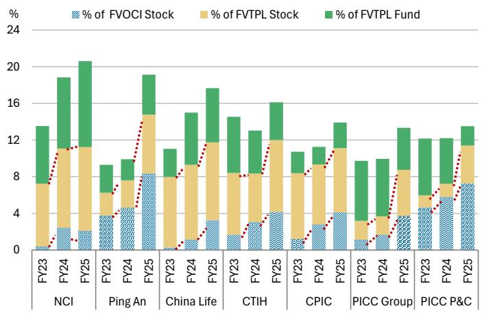

stacked bar chart

| Category | FY23 (%) | FY24 (%) | FY25 (%) |
| :--- | :--- | :--- | :--- |
| NCI | 0.1 | 1.8 | 19.6 |
| Ping An | 2.7 | 1.0 | 20.8 |
| China Life | 0.1 | 8.4 | 14.5 |
| CTIH | 0.1 | 1.0 | 17.0 |
| CPIC | 0.5 | 3.3 | 12.0 |
| PICC Group | 0.5 | 1.0 | 10.0 |
| PICC P&C | 4.3 | 2.4 | 12.3 |
| Total | 7.6 | 10.0 | 13.0 |

Source: Company data, MS

## Listed insurers have increased equity allocations, especially in par accounts under IFRS

9: Benefiting from risk-sharing with policyholders, participating accounts give insurers greater flexibility to invest more proactively. Over the past three years, we have seen higher FVTPL allocations in par accounts (i.e., more assets held for trading gains, including equities, bonds, and others), while overall FVTPL allocations have remained relatively stable (Exhibit 12).

Meanwhile, although almost all listed insurers have increased FVOCI equity allocations (mainly high and stable dividend stocks), trends in par accounts diverge from non-par accounts. Ping An has maintained a broadly stable FVOCI equity mix in par accounts, while CPIC Life and China Life have continued to reduce this mix (indicating higher FVOCI equity allocations in non-par accounts). NCI has almost no FVOCI exposure in par accounts (Exhibit 13).

Exhibit 12: FVTPL mix in par accounts continues to rise  
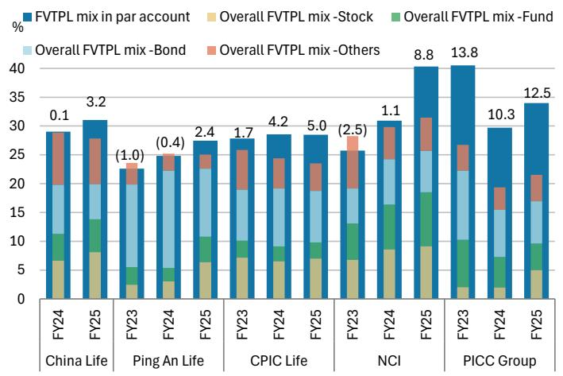

stacked bar chart

| Category | Period | Overall FVTPL mix - Stock (%) | Overall FVTPL mix - Fund (%) | Overall FVTPL mix - Bond (%) | Overall FVTPL mix - Others (%) |
| :--- | :--- | :--- | :--- | :--- | :--- |
| China Life | FY24 | 7.0 | 11.0 | 19.0 | 8.0 |
| China Life | FY25 | 8.0 | 13.0 | 16.0 | 8.0 |
| Ping An Life | FY23 | 2.5 | 3.0 | 19.0 | 3.0 |
| Ping An Life | FY24 | 3.0 | 3.0 | 21.0 | 3.0 |
| Ping An Life | FY25 | 6.0 | 6.0 | 19.0 | 3.0 |
| CPIC Life | FY23 | 7.0 | 4.0 | 17.0 | 8.0 |
| CPIC Life | FY24 | 6.0 | 4.0 | 18.0 | 7.0 |
| CPIC Life | FY25 | 7.0 | 4.0 | 18.0 | 6.0 |
| NCI | FY23 | 6.0 | 12.0 | 13.0 | 8.0 |
| NCI | FY24 | 8.0 | 16.0 | 15.0 | 8.0 |
| NCI | FY25 | 9.0 | 18.0 | 13.0 | 7.0 |
| PICC Group | FY23 | 2.5 | 10.0 | 21.0 | 5.0 |
| PICC Group | FY24 | 2.5 | 6.0 | 14.0 | 5.0 |
| PICC Group | FY25 | 5.0 | 6.0 | 16.0 | 6.0 |
| PICC Group (Total) | FY23 (Total) | 13.8 | 26.0 | 22.0 | 4.0 |
| PICC Group (Total) | FY24 (Total) | 10.3 | 5.0 | 13.0 | 4.0 |
| PICC Group (Total) | FY25 (Total) | 12.5 | 6.0 | 14.0 | 5.0 |
The chart displays stacked bars representing the percentage composition of FVTPL mix in par account, overall FVTPL mix - Stock, overall FVTPL mix - Fund, overall FVTPL mix - Bond, and overall FVTPL mix - Others for each year from FY23 to FY25. The total percentage is labeled above each bar.

Source: Company data, MS

Exhibit 13: FVOCI equity mix in par accounts vs. overall FVOCI stock mix  
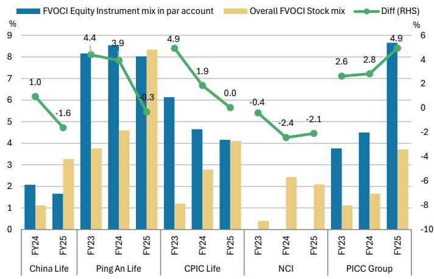

bar-line hybrid

| Company | Fiscal Year | FVOCI Equity Instrument mix in par account (%) | Overall FVOCI Stock mix (%) | Diff (RHS) (%) |
| :--- | :--- | :--- | :--- | :--- |
| China Life | FY24 | 2.0 | 1.1 | 1.0 |
| China Life | FY25 | 1.6 | 3.3 | -1.6 |
| Ping An Life | FY23 | 8.1 | 3.7 | 4.4 |
| Ping An Life | FY24 | 8.5 | 4.6 | 3.9 |
| Ping An Life | FY25 | 8.0 | 8.3 | -0.3 |
| CPIC Life | FY23 | 6.1 | 1.2 | 4.9 |
| CPIC Life | FY24 | 4.6 | 2.8 | 1.9 |
| CPIC Life | FY25 | 4.1 | 4.0 | 0.0 |
| NCI | FY23 | -0.4 | 0.4 | -0.4 |
| NCI | FY24 | -0.4 | 2.4 | -2.4 |
| NCI | FY25 | -0.4 | 2.0 | -2.1 |
| PICC Group | FY23 | 3.7 | 1.0 | 2.6 |
| PICC Group | FY24 | 4.5 | 1.6 | 2.8 |
| PICC Group | FY25 | 8.7 | 3.6 | 4.9 |

Source: Company data, MS

Large insurers also have advantages in alternative assets investment. Leading insurers are adopting more diversified allocation strategies and have expanded into a broader range of asset classes, including ABS, public and private REITs, and private equity funds. They are also increasing exposure to overseas assets and gold, driven by low interest rates, volatile equity markets, and diversification needs. The industry-wide median net investment yield was \~0.65% in 1Q26 (Exhibit 15), a low level that will likely continue to put pressure on insurers.

However, small and mid-sized insurers face greater constraints in allocating to alternative assets. These investments typically involve lower liquidity, longer duration, higher capital consumption, and tighter solvency and cash flow constraints, limiting SME participation. Large insurers remain better positioned given their scale, stronger pricing power, and superior liquidity.

As a result, asset allocation continues to diverge across insurers. SME insurers tend to favor more standardized, transparent, and tradable assets with controlled single-asset exposure, such as publicly listed REITs. In contrast, large insurers, supported by stronger capital bases and higher risk tolerance, are better placed to explore a broader range of alternative assets.

Exhibit 14: Listed insurers' net investment yields have continuously declined over the past few years  
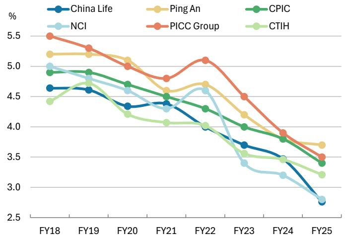

line chart

| Fiscal Year | China Life | Ping An | CPIC | NCI | PICC Group | CTIH |
|-------------|------------|---------|------|-----|------------|------|
| FY18        | 4.6        | 5.2     | 4.9  | 5.0 | 5.5        | 4.4  |
| FY19        | 4.6        | 5.2     | 4.9  | 4.9 | 5.3        | 4.8  |
| FY20        | 4.3        | 5.1     | 4.7  | 4.6 | 5.0        | 4.2  |
| FY21        | 4.4        | 4.6     | 4.5  | 4.3 | 4.8        | 4.1  |
| FY22        | 4.0        | 4.7     | 4.3  | 4.6 | 5.1        | 4.0  |
| FY23        | 3.7        | 4.2     | 4.0  | 3.4 | 4.5        | 3.6  |
| FY24        | 3.5        | 3.8     | 3.8  | 3.2 | 3.9        | 3.4  |
| FY25        | 2.8        | 3.7     | 3.4  | 2.8 | 3.5        | 3.2  |

Source: Company data, MS

Exhibit 15: In 1Q26, industry median investment yield was around 0.65%, while median comprehensive investment yield was only about 0.31%  
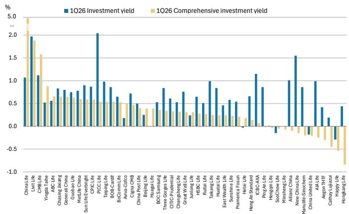

bar chart

| Company | 1Q26 Investment yield (%) | 1Q26 Comprehensive investment yield (%) |
| :--- | :--- | :--- |
| ChinaLife | 1.05 | 1.95 |
| Lixit Life | 1.95 | 1.6 |
| CXKLife | 1.15 | 0.85 |
| Yirigta Taihe | 0.55 | 0.75 |
| ABC Life | 0.85 | 0.65 |
| Chasing Jixiang | 0.85 | 0.65 |
| General China | 0.85 | 0.65 |
| GuoZhu Life | 0.85 | 0.65 |
| MetLife China | 0.95 | 0.65 |
| Sun Life Everbright | 0.95 | 0.65 |
| CPC Life | 2.05 | 0.55 |
| PICC Life | 1.0 | 0.55 |
| Tianqing Life | 0.95 | 0.65 |
| BOCOMLife | 0.85 | 0.65 |
| BioCommLife | 0.65 | 0.55 |
| Aviva-Corico | 0.75 | 0.45 |
| Cigna CXB | 0.75 | 0.35 |
| China Post Ute | 0.45 | 0.35 |
| Beijing Life | 0.25 | 0.35 |
| Huagai Life | 0.35 | 0.35 |
| BDC Samsung | 0.45 | 0.35 |
| Three Gores Life | 0.85 | 0.35 |
| QTIC Prudential | 0.65 | 0.35 |
| Changcheng Life | 0.75 | 0.35 |
| Great Wall Life | 0.75 | 0.35 |
| Junlong Life | 0.65 | 0.35 |
| HSBC Life | 0.45 | 0.35 |
| Rui'an Life | 1.0 | 0.35 |
| Talkang Life | 0.85 | 0.35 |
| Huatai Life | 0.45 | 0.35 |
| East Wealth Life | 0.6 | 0.35 |
| SinoMarine Life | 0.6 | 0.35 |
| Promotion Finance | -0.1 | 0.2 |
| Heng An Standard | 0.7 | 0.2 |
| ICBC-AXA | 1.15 | 0.15 |
| PiuAn Life | 0.85 | -0.1 |
| Hengan Life | -0.1 | -0.1 |
| SooChow Life | -0.1 | -0.1 |
| Minsheng Life | -0.1 | -0.1 |
| Allianz China | 1.0 | -0.1 |
| New ChinaLife | 1.6 | -0.1 |
| Manulife-Sinochem | 0.85 | -0.1 |
| China United Life | -0.1 | -0.1 |
| AIA Life | 1.0 | -0.1 |
| Aegon THF | 0.45 | -0.2 |
| Cathay Luizhou | -0.25 | -0.4 |
| Happy Life | -0.35 | -0.4 |
| Hongkang Life | -0.45 | -0.45 |
The chart displays two sets of bars: the top section shows the percentage yield for each company, while the bottom section shows the percentage yield for each company's total (e.g., China Life + China Life + Hongkang Life). The y-axis represents yield percentage, and the x-axis lists company names in descending order of yield from left to right.

Source: Company solvency reports, MS

## Solvency remains key constraint on asset and liability management

Solvency ratio pressure could continue to weigh on some insurers' asset allocation and liability growth. The full rollout of the C-ROSS Phase II framework has tightened capital requirements. In the current low-rate environment, combined with equity market volatility and business growth opportunities, life insurers' core solvency ratios could remain under pressure. In particular, the 750-day average of China's 10-year treasury yield could continue to decline in 2026, following a notable drop in 2025.

- Based on our analysis of around 50 life insurers, the median core solvency ratio declined from \~130% in 4Q25 to \~120% in 1Q26 as the transition period expired.  
- Overall, we expect core solvency ratios to moderate further to \~111% by 2Q26 under current assumptions (Exhibit 19), with nearly all insurers facing declines.  
• Capital replenishment remains challenging for SME insurers.

## We see considerable hurdles to solvency rule revisions within the year. While

regulators continue to refine the framework and have conducted industry-wide testing, results have been unsatisfactory and several technical aspects require further work. We see limited likelihood of launching C-ROSS Phase III in 2026, with implementation more likely in 2027. Capital constraints could drive further divergence across insurers in product structure, channel expansion, and asset allocation. However, we do not see systemic risk. Large insurers should maintain a capital advantage, regulators have continued to ease solvency rules and risk factors in recent years, and business quality continues to improve alongside a supportive regulatory backdrop.

Exhibit 16: Life insurers' 1Q26 solvency ratio versus total assets  
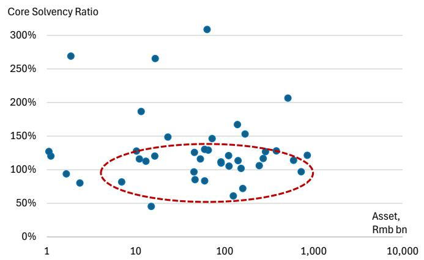

scatter plot

| Asset, Rmb bn | Core Solvency Ratio |
| --- | --- |
| 1 | 120% |
| 1 | 130% |
| 1 | 140% |
| 1 | 150% |
| 1 | 160% |
| 1 | 170% |
| 1 | 180% |
| 1 | 190% |
| 1 | 200% |
| 1 | 210% |
| 1 | 220% |
| 1 | 230% |
| 1 | 240% |
| 1 | 250% |
| 1 | 260% |
| 1 | 270% |
| 1 | 280% |
| 1 | 290% |
| 1 | 300% |
| 10 | 80% |
| 10 | 90% |
| 10 | 100% |
| 10 | 110% |
| 10 | 120% |
| 10 | 130% |
| 10 | 140% |
| 10 | 150% |
| 10 | 160% |
| 10 | 170% |
| 10 | 180% |
| 10 | 190% |
| 10 | 200% |
| 10 | 210% |
| 10 | 220% |
| 10 | 230% |
| 10 | 240% |
| 10 | 250% |
| 10 | 260% |
| 10 | 270% |
| 10 | 280% |
| 10 | 290% |
| 10 | 300% |
| 50 | 45% |
| 50 | 55% |
| 50 | 65% |
| 50 | 75% |
| 50 | 85% |
| 50 | 95% |
| 50 | 105% |
| 50 | 115% |
| 50 | 125% |
| 50 | 135% |
| 50 | 145% |
| 50 | 155% |
| 50 | 165% |
| 50 | 175% |
| 50 | 185% |
| 50 | 195% |
| 50 | 205% |
| 50 | 215% |
| 50 | 225% |
| 50 | 235% |
| 50 | 245% |
| 50 | 255% |
| 50 | 265% |
| 50 | 275% |
| 50 | 285% |
| 50 | 295% |
| 50 | 305% |
| 100 | 65% |
| 100 | 75% |
| 100 | 85% |
| 100 | 95% |
| 100 | 105% |
| 100 | 115% |
| 100 | 125% |
| 100 | 135% |
| 100 | 145% |
| 100 | 155% |
| 100 | 165% |
| 100 | 175% |
| 100 | 185% |
| 100 | 195% |
| 100 | 205% |
| 100 | 215% |
| 100 | 225% |
| 100 | 235% |
| 100 | 245% |
| 100 | 255% |
| 100 | 265% |
| 100 | 275% |
| 100 | 285% |
| 100 | 295% |
| 100 | 305% |
| 2,5x | - |
| - | - |
| - | - |
| - | - |
| - | - |
| - | - |
| - | - |
| - | - |
| - | - |
| - | - |
| - | - |
| - | - |
| - | - |
| - | - |
| - | - |
| - | ~65% |
| - | ~75% |
| - | ~85% |
| - | ~95% |
| - | ~105% |
| - | ~115% |
| - | ~125% |
| - | ~135% |
| - | ~145% |
| - | ~155% |
| - | ~165% |
| - | ~175% |
| - | ~185% |
| - | ~195% |
| - | ~205% |
| - | ~215% |
| - | ~225% |
| - | ~235% |
| - | ~245% |
| - | ~255% |
| - | ~265% |
| - | ~275% |
| - | ~285% |
| - | ~295% |
| - | ~305% |
| - | ~315% |
| - | ~325% |
| - | ~335% |
| - | ~345% |
| - | ~355% |
| - | ~365% |
| - | ~375% |
| - | ~385% |
| - | ~395% |
| - | ~405% |
| - | ~415% |
| - | ~425% |
| - | ~435% |
| - | ~445% |
| - | ~455% |
| - | ~465% |
| - | ~475% |
| - | ~485% |
| - | ~495% |
| - | ~505% |
| - | ~515% |
| - | ~525% |
| - | ~535% |
| - | ~545% |
| - | ~555% |
| - | ~565% |
| - | ~575% |
| - | ~585% |
| - | ~595% |
| - | ~605% |
| - | ~615% |
| - | ~625% |
| - | ~635% |
| - | ~645% |
| - | ~655% |
| - | ~665% |
| - | ~675% |
| - | ~685% |
| - | ~695% |
| - | ~705% |
| - | ~715% |
| - | ~725% |
| - | ~735% |
| - | ~745% |
| - | ~755% |
| - | ~765% |
| - | ~775% |
| - | ~785% |
| - | ~795% |
| - | ~805% |
| - | ~815% |
| - | ~825% |
| - | ~835% |
| - | ~845% |
| - | ~855% |
| - | ~865% |
| - | ~875% |
| - | ~885% |
| - | ~895% |
| - | ~905% |
| - | ~915% |
| - | ~925% |
| - | ~935% |
| - | ~945% |
| - | ~955% |
| - | ~965% |
| - | ~975% |
| - | ~985% |
| - | ~995% |
| - | ~1,0,0,3,4,6,8,9,1,2,3,4,6,8,9,12,34,6,8,9,12,34,6,8,9,12,34,6,8,9,34,6,8,9,34,6,8,9,34,6,8,9,34,6,8,9,34,6,8,9,34,6,8,9,34,6,8,9,34,6,8,9,34,6,8,9,34,6,8,9,34,6,8,9<fcel>-<nl> |

Source: Company data, MS

Exhibit 17: Listed insurers' solvency ratios were maintained relatively higher  
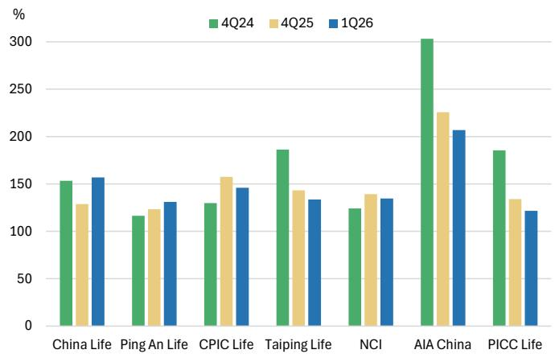

bar chart

| Company | 4Q24 (%) | 4Q25 (%) | 1Q26 (%) |
| :--- | :--- | :--- | :--- |
| China Life | 153 | 128 | 157 |
| Ping An Life | 117 | 124 | 131 |
| CPIC Life | 129 | 157 | 146 |
| Taiping Life | 187 | 143 | 134 |
| NCI | 124 | 140 | 135 |
| AIA China | 305 | 226 | 207 |
| PICC Life | 186 | 134 | 122 |

Source: Company data, MS

Exhibit 18:  
China life insurers saw sequential decline in core solvency ratio in 1Q26.  

bar chart

| Company | 1Q26 (%) | 4Q25 (%) |
| :--- | :--- | :--- |
| Allianz China | 308 | 307 |
| Three Gorges Life | 268 | 325 |
| Livit Life | 264 | 267 |
| AIA Life | 206 | 226 |
| MetLife China | 186 | 191 |
| Aviva-Cofco | 165 | 193 |
| Taikang Life | 159 | 167 |
| China Life | 156 | 128 |
| BoComm Life | 149 | 163 |
| Manulife-Sino | 149 | 147 |
| Huatai Life | 147 | 155 |
| CPIC Life | 147 | 157 |
| Taiping Life | 130 | 133 |
| Ping An Life | 130 | 128 |
| New China Life | 130 | 133 |
| HSBC Life | 128 | 150 |
| Heng An Standard | 128 | 147 |
| ICBC-AXA | 128 | 157 |
| Generali China | 128 | 133 |
| Guobao Life | 128 | 157 |
| CITIC-Prudential | 128 | 133 |
| Hengqin Life | 128 | 160 |
| PICC Life | 122 | 128 |
| CMB Life | 122 | 95 |
| Hetai Life | 122 | 186 |
| Huagui Life | 122 | 144 |
| Cigna CMB | 120 | 133 |
| Junlong Life | 118 | 118 |
| Aegon THTF | 118 | 118 |
| Sunshine Life | 116 | 118 |
| Minsheng Life | 116 | 137 |
| Ruitai Life | 114 | 128 |
| BOB-Cardif | 114 | 130 |
| Hongkang Life | 109 | 109 |
| ABC Life | 109 | 80 |
| Yingda Taihe | 106 | 120 |
| BOC Samsung | 104 | 114 |
| China Post Life | 95 | 93 |
| Cathay Lujiazui | 95 | 120 |
| Pramerica Fosun | 93 | 123 |
| China United Life | 87 | 95 |
| SooChow Life | 87 | 106 |
| East Wealth Life | 85 | 95 |
| Chasing Jixiang | 83 | 87 |
| Great Wall Life | 80 | 107 |
| Beijing Life | 79 | 80 |
| Happy Life | 70 | 75 |
| Sun Life Everbright | 60 | 73 |
| Changsheng Life | 45 | 65 |
4Q25 Average: 141%
1Q26 Average: 128%

Source: Company data, MS

Exhibit 19: 2Q26 core solvency ratios expected to decline from insurers' disclosure  
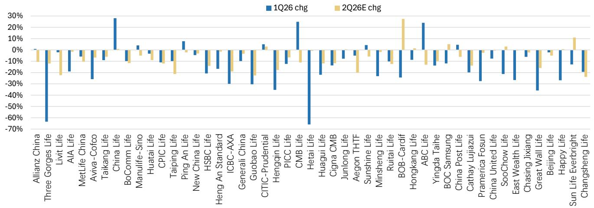

bar chart

| Company | 1Q26 chg (%) | 2Q26E chg (%) |
| :--- | :--- | :--- |
| Allianz China | -1.5 | -10.0 |
| Three Gorges Life | -65.0 | -10.0 |
| Livit Life | -1.0 | -20.0 |
| AIA Life | -18.0 | -10.0 |
| MetLife China | -1.0 | -10.0 |
| Aviva-Cofco | -25.0 | -5.0 |
| Taikang Life | -8.0 | -5.0 |
| China Life | 27.0 | -2.0 |
| BoComm Life | -10.0 | -10.0 |
| Manulife-Sino | 4.0 | -5.0 |
| Huatai Life | -3.0 | -10.0 |
| CPIC Life | -5.0 | -10.0 |
| Taiping Life | -5.0 | -20.0 |
| Ping An Life | 7.0 | -2.0 |
| New China Life | -3.0 | -5.0 |
| HSBC Life | -18.0 | -10.0 |
| Heng An Standard | -30.0 | -20.0 |
| ICBC-AXA | -8.0 | -5.0 |
| Generali China | -12.0 | -5.0 |
| Guobao Life | -30.0 | -20.0 |
| CITIC-Prudential | 4.0 | -5.0 |
| Hengqin Life | -35.0 | -15.0 |
| PICC Life | -12.0 | -5.0 |
| CMB Life | 24.0 | -10.0 |
| Hetai Life | -68.0 | -5.0 |
| Huagui Life | -22.0 | -10.0 |
| Cigna CMB | -12.0 | -5.0 |
| Junlong Life | -8.0 | -5.0 |
| Aegon THTF | -3.0 | -20.0 |
| Sunshine Life | 4.0 | -5.0 |
| Minsheng Life | -22.0 | -5.0 |
| Ruitai Life | -12.0 | -15.0 |
| BOB-Cardif | -25.0 | 27.0 |
| Hongkang Life | -8.0 | 2.0 |
| ABC Life | 23.0 | -15.0 |
| Yingda Taihe | -15.0 | -5.0 |
| BOC Samsung | -12.0 | 4.0 |
| China Post Life | 4.0 | -5.0 |
| Cathay Lujiazui | -22.0 | -15.0 |
| Pramerica Fosun | -30.0 | -5.0 |
| China United Life | -8.0 | -5.0 |
| SooChow Life | -22.0 | 3.0 |
| East Wealth Life | -28.0 | -5.0 |
| Chasing Jixiang | -8.0 | 5.0 |
| Great Wall Life | -38.0 | -15.0 |
| Beijing Life | -3.0 | 3.0 |
| Happy Life | -28.0 | 3.0 |
| Sun Life Everbright | -12.0 | 11.0 |
| Changsheng Life | -22.0 | -25.0 |

Source: Company data, MS

# Optimization measures continue under current operating environment

We see a broadly positive industry trajectory, with risks concentrated in select pockets, while large insurers maintain their advantages. Overall, large life insurers deliver stable operations and solid capital positions, although some SME insurers in China's life sector may face pressure. Regulatory tailwinds over the past 2–3 years (lower pricing interest rates, tighter channel expense controls, relaxed capital rules) have delivered tangible results, and large insurers should continue to benefit. Both large and small insurers still need to implement effective measures to address operating pressure, strengthen balance sheets, mitigate risks, and enhance long-term competitiveness, including:

1) Differentiated investment strategies across accounts: Insurers are likely to focus more on risk mitigation in traditional accounts, while optimizing cash flows and stabilizing asset allocation in participating accounts. For universal accounts, we expect insurers to target long-term returns while adhering to guaranteed return constraints.  
2) Tailored product development and sales strategy: Insurers can enhance liability quality and stabilize cash flow structures through product design and sales strategies tailored to their specific conditions. This should also create greater flexibility for long-term asset allocation and duration management.  
3) Varied priorities to address near-term risks and long-term competitiveness, reflecting differences in size and risk profiles across China's life insurers.

For small and mid-sized insurers, key priorities include managing interest spreads and cash flows by lowering liability costs, optimizing pricing, reducing expenses, and stabilizing product cash flows. Sustainable operations and differentiated growth driven by pricing discipline, improved cost efficiency, optimized channel structures, and more stable liability profiles should support long-term competitiveness.

For large insurers that have adopted IFRS 9 and IFRS 17, focus areas include ALM (asset–liability management), account tiering, duration matching, and interest rate risk hedging. Industry debate continues on whether duration matching can fully immunize interest rate movements under the IFRS 9/17 framework. Given the current low-rate environment, we view duration matching as a lower near-term priority. Over the long term, leading insurers should build competitive advantages through service ecosystems, distribution capabilities, long-term investment expertise, and strong management of participating and universal accounts.

Among our coverage, Ping An (2318.HK) and China Life (2628.HK) should continue to strengthen their balance sheets and business advantages, despite differences in investment strategies. AIA China also continues to demonstrate a focused, high-quality model. While AIA (1299.HK) has faced temporary pressure from concerns over potential regulatory tightening on MCV (mainland China visitor) business, we believe the impact should remain limited and investor reaction appears overdone (see our recent report Hong Kong/China Insurance: Cross-border Insurance Sales: Why We Think Regulatory Impact Could Be Limited (3 Jun 2026)).

Exhibit 20: We think some key measures could help insurers to mitigate risks and improve long-term competitiveness but could have differentiated effects on large and SME insurers

<table><tr><td rowspan="2">Key Measures</td><td colspan="2">Risk Mitigation</td><td colspan="2">Long-term Competitiveness</td><td rowspan="2">Core Differentiation</td></tr><tr><td>Large Insurers</td><td>Small/Mid Insurers</td><td>Large Insurers</td><td>Small/Mid Insurers</td></tr><tr><td>Diversified asset allocation (high-dividend / innovative fixed-income)</td><td>☆☆☆☆</td><td>☆☆☆</td><td>☆☆☆☆☆</td><td>☆☆☆</td><td>For large insurers: enhances long-term returns and spread resilience with stronger allocation and risk control capabilities;For small/mid insurers: steadily improves NIY with constraints in capital, volatility, and governance</td></tr><tr><td>Extending asset duration (ultra-long gov&#x27;t bonds / infrastructure)</td><td>☆☆☆☆</td><td>☆☆</td><td>☆☆☆</td><td>☆☆</td><td>For large insurers: structurally repairs duration mismatch, enabling steady-state allocation;For small/mid insurers: more constrained by low-rate cost-effectiveness and capital/liquidity limits</td></tr><tr><td>Interest rate risk hedging (derivatives + hedging)</td><td>☆☆☆☆</td><td>☆☆</td><td>☆☆</td><td>☆</td><td>High barriers in technology, systems, and governance; primarily a defensive tool for large insurers, limited contribution to long-term competitiveness</td></tr><tr><td>Duration gap management (ALM)</td><td>☆☆☆☆☆</td><td>☆☆</td><td>☆☆☆</td><td>☆☆☆</td><td>Large insurers have longer duration, larger duration gaps, and higher volatility under IFRS 17;Duration issues are relatively less important for small/mid insurers</td></tr><tr><td>Lowering guaranteed rates / pricing control</td><td>☆☆☆</td><td>☆☆☆☆</td><td>☆☆☆</td><td>☆☆☆☆☆</td><td>Small/mid insurers rely more on rapid reduction in new business liability costs to stabilize spreads, which is the key competitiveness.Large insurers have large in-force books with long duration, making legacy risk management more important, while coordination with product mix and value-oriented operations are also necessary</td></tr><tr><td>Increasing par/universal product proportion</td><td>☆☆☆</td><td>☆☆☆</td><td>☆☆☆☆</td><td>☆☆☆</td><td>Both large and small/mid insurers can reduce liability costs and enhance liability flexibility to help better cope with external uncertainty;Leading insurers can better leverage ALM capabilities to support par product competitiveness.</td></tr><tr><td>Health insurance &amp; protection transformation (services / customers / ecosystem)</td><td>☆☆</td><td>☆☆</td><td>☆☆☆☆☆</td><td>☆☆☆☆</td><td>Limited effect for short-term risk mitigation; but could stem long-term competitiveness from the &#x27;services + ecosystem + customer stickiness&#x27; moat;Leading insurers have greater advantages in investment and execution.</td></tr><tr><td>Product duration structure adjustment (balancing long and short duration liabilities)</td><td>☆☆</td><td>☆☆</td><td>☆☆</td><td>☆☆☆</td><td>In a low-rate environment, extending liability duration through high-quality and low-cost policies is meaningful for both large and small/mid insurers:Small/mid insurers can improve cash flow flexibility; A tactical tool for large insurers</td></tr><tr><td>Reduce expense ratio (commission fee control / channel optimization)</td><td>☆☆☆</td><td>☆☆☆☆☆</td><td>☆☆☆</td><td>☆☆☆☆☆</td><td>Expense control and cost efficiency improvement are key capabilities for small/mid insurers&#x27; long-term survival and expansion; commission fee control and expense reduction are a reliable improvement lever and the fastest-acting variable</td></tr><tr><td>Cash flow and liquidity stress management</td><td>☆☆☆</td><td>☆☆☆☆</td><td>☆☆☆</td><td>☆☆☆</td><td>No direct excess returns in the long-term competitiveness dimension, but determines whether a company—especially small/mid insurers—can survive a downturn cycle and maintain strategic resolve</td></tr></table>

Source: MS

## Valuation Methodology and Risks

## AIA Group Ltd (1299.HK)

Appraisal value, probability-weighted 50% base, 30% bull, 20% bear. Balance reflects increased market debate about AIA&#39;s long-term growth trends vs. healthy shareholder return. We use solid 1x embedded value plus new business multiples for VNB to get our base case valuation. Our NBM assumptions are derived from our expectations for each market, with terminal growth rates of 1-2% and risk discount rates of 11-15%.

## Risks to Upside

■ Strong VNB growth esp. in China & HK, along with improved margin  
■ Higher interest rates in CN, or lower rates in the US  
■ Key financial metrics back to healthy growth trajectory  
■ More policy support on MCV business  
■ Increased shareholder return

## Risks to Downside

■ Slowdown in VNB growth and declining margins  
■ Key financial metrics decline  
■ Slowdown in regional economic growth  
■ Regulatory restriction on MCV business

## Ping An Insurance Group Co of China Ltd (2318.HK)

Base case. We value Ping An's business using a three-stage DDM model, assuming 33%, 50%, and 68% dividend payouts in the three stages of 2026-28, 2029-34, and >2034, respectively, and corresponding dividend growth rates of 6%, 26%, and 2%. We assume a base-case cost of capital at 12%.

## Risks to Upside

■ Recovered OPAT growth, especially on AM segment  
■ Faster-than-expected Life VNB growth with improved margin  
■ Stable increased DPS  
■ A-share rally  
■ Stable agent force with increased productivity  
■ More value creation from its ecosystems and integrated finance.

## Risks to Downside

■ Volatile equity market and interest rate in China  
■ Persistently low rate or elevated assets and property risks  
■ Lower capital level and DPS

## China Life Insurance Co Ltd (2628.HK)

Our price target is our base case scenario value, derived from a three-stage dividend discount model assuming 27%, 58% and 80% dividend payouts in the three stages (2026-28, 2029-34, and >2034), respectively, and corresponding dividend growth rates of 9%, 30% and 2%. We apply a 12% cost of capital. The implied 2026E P/B ratio for China Life is 1.41x.

## Risks to Upside

■ Equity market rally that increases profitability  
- Interest rate rise  
■ Continued strong progress in productivity gains and stronger-than-expected VNB growth  
■ More southbound inflows  
■ More marketization reform outcomes  
■ Increased payout ratio

## Risks to Downside

■ Declines in A-share market and interest environment  
■ Deterioration in VNB growth and lukewarm demand

## Ping An Insurance Group Co of China Ltd (601318.SS)

Base case. We apply a 10% cost of capital and 2% terminal growth rate, and value Ping An Life at 1.2x EV based on its 2026-28E \~12% average ROEV. We value Ping An Bank at 0.55x BV and Ping An P&C at 1.1x BV. AM segment could continue to be a small drag in the near term.

## Risks to Upside

■ Recovered OPAT growth, especially on AM segment  
■ Faster-than-expected Life VNB growth with improved margin  
■ Stable increased DPS  
■ A-share rally  
■ Stable agent force with increased productivity  
■ More value creation from its ecosystems and integrated finance.

## Risks to Downside

■ Volatile equity market and interest rate in China  
■ Persistently low rate or elevated assets and property risks  
■ Lower capital levels and DPS

## China Life Insurance Co Ltd (601628.SS)

Base case. We use a P/EV approach and derive our valuation multiple from a Gordon Growth model. We value China Life at 0.79x 2026E P/EV based on its 9% base case ROEV profile, 11% cost of capital, and 2% terminal growth.

## Risks to Upside

■ Equity market rally that increases profitability  
- Interest rate rise  
■ Continued strong progress in productivity gains and stronger-than-expected VNB growth  
■ More southbound inflows  
■ More marketization reform outcomes  
■ Increased payout ratio

## Risks to Downside

■ Declines in A-share market and interest environment  
■ Deterioration in VNB growth and lukewarm demand

## Disclosure Section

The information and opinions in MS were prepared or are disseminated by MS Asia Limited (which accepts the responsibility for its contents) and/or MS Asia (Singapore) Pte. (Registration number 199206298Z) and/or MS Asia (Singapore) Securities Pte Ltd (Registration number 200008434H), regulated by the Monetary Authority of Singapore (which accepts legal responsibility for its contents and should be contacted with respect to any matters arising from, or in connection with, MS), and/or MS Taiwan Limited and/or MS & Co International plc, Seoul Branch, and/or MS Australia Limited (A.B.N. 67 003 734 576, holder of Australian financial services license No. 233742, which accepts responsibility for its contents), and/or MS Wealth Management Australia Pty Ltd (A.B.N. 19 009 145 555, holder of Australian financial services license No. 240813, which accepts responsibility for its contents), and/or MS India Company Private Limited having Corporate Identification No (CIN) U22990MH1998PTC115305, regulated by the Securities and Exchange Board of India ("SEBI") and holder of licenses as a Research Analyst (SEBI Registration No. INH000001105); Stock Broker (SEBI Stock Broker Registration No. INZ000244438), Merchant Banker (SEBI Registration No. INM000011203), and depository participant with National Securities Depository Limited (SEBI Registration No. IN-DP-NSDL-567-2021) having registered office at Altimus, Level 39 & 40, Pandurang Budhkar Marg, Worli, Mumbai 400018, India; Telephone no. +91-22-61181000; Compliance Officer Details: Mr. Tejarshi Hardas, Tel. No.: +91-22-61181000 or Email: tejarshi.hardas@morganstanley.com; Grievance officer details: Mr. Tejarshi Hardas, Tel. No.: +91-22-61181000 or Email: msic-compliance@morganstanley.com which accepts the responsibility for its contents and should be contacted with respect to any matters arising from, or in connection with, MS, and their affiliates (collectively, "MS"). MS India Company Private Limited (MSICPL) may use AI tools in providing research services. All recommendations contained herein are made by the duly qualified research analysts.

For important disclosures, stock price charts and equity rating histories regarding companies that are the subject of this report, please see the MS Disclosure Website at www.morganstanley.com/eqr/disclosures/webapp/generalresearch, or contact your investment representative or MS at 1585 Broadway, (Attention: Research Management), New York, NY, 10036 USA.

For valuation methodology and risks associated with any recommendation, rating or price target referenced in this research report, please contact the Client Support Team as follows: US/Canada +1 800 303-2495; Hong Kong +852 2848-5999; Latin America +1 718 754-5444 (U.S.); London +44 (0)20-7425-8169; Singapore +65 6834-6860; Sydney +61 (0)2-9770-1505; Tokyo +81 (0)3-6836-9000. Alternatively you may contact your investment representative or MS at 1585 Broadway, (Attention: Research Management), New York, NY 10036 USA.

## Analyst Certification

The following analysts hereby certify that their views about the companies and their securities discussed in this report are accurately expressed and that they have not received and will not receive direct or indirect compensation in exchange for expressing specific recommendations or views in this report: Richard Xu, CFA; Rick Zhao.

## Global Research Conflict Management Policy

MS has been published in accordance with our conflict management policy, which is available at www.morganstanley.com/institutional/research/conflictpolicies. A Portuguese version of the policy can be found at www.morganstanley.com.br

## Important Regulatory Disclosures on Subject Companies

As of May 29, 2026, MS beneficially owned 1% or more of a class of common equity securities of the following companies covered in MS: AIA Group Ltd, China Life Insurance Co Ltd, China Pacific Insurance Group Co Ltd, Ping An Insurance Group Co of China Ltd.

Within the last 12 months, MS managed or co-managed a public offering (or 144A offering) of securities of AIA Group Ltd, China Pacific Insurance Group Co Ltd, FWD Group Holdings Ltd, Ping An Insurance Group Co of China Ltd, ZhongAn Online P & C Insurance Co Ltd.

Within the last 12 months, MS has received compensation for investment banking services from China Pacific Insurance Group Co Ltd, FWD Group Holdings Ltd, Ping An Insurance Group Co of China Ltd, ZhongAn Online P & C Insurance Co Ltd.

In the next 3 months, MS expects to receive or intends to seek compensation for investment banking services from AIA Group Ltd, China Life Insurance Co Ltd, China Pacific Insurance Group Co Ltd, China Taiping Insurance Holdings Co Ltd, FWD Group Holdings Ltd, New China Life Insurance Company Ltd, PICC Group, Ping An Insurance Group Co of China Ltd, ZhongAn Online P & C Insurance Co Ltd.

Within the last 12 months, MS has received compensation for products and services other than investment banking services from AIA Group Ltd, China Life Insurance Co Ltd, China Taiping Insurance Holdings Co Ltd, FWD Group Holdings Ltd, PICC Group, Ping An Insurance Group Co of China Ltd, ZhongAn Online P & C Insurance Co Ltd.

Within the last 12 months, MS has provided or is providing investment banking services to, or has an investment banking client relationship with, the following company: AIA Group Ltd, China Life Insurance Co Ltd, China Pacific Insurance Group Co Ltd, China Taiping Insurance Holdings Co Ltd, FWD Group Holdings Ltd, New China Life Insurance Company Ltd, PICC Group, Ping An Insurance Group Co of China Ltd, ZhongAn Online P & C Insurance Co Ltd.

Within the last 12 months, MS has either provided or is providing non-investment banking, securities-related services to and/or in the past has entered into an agreement to provide services or has a client relationship with the following company: AIA Group Ltd, China Life Insurance Co Ltd, China Pacific Insurance Group Co Ltd, China Taiping Insurance Holdings Co Ltd, FWD Group Holdings Ltd, New China Life Insurance Company Ltd, PICC Group, PICC P&C Company Ltd, Ping An Insurance Group Co of China Ltd, ZhongAn Online P & C Insurance Co Ltd.

The equity research analysts or strategists principally responsible for the preparation of MS have received compensation based upon various factors, including quality of research, investor client feedback, stock picking, competitive factors, firm revenues and overall investment banking revenues. Equity Research analysts' or strategists' compensation is not linked to investment banking or capital markets transactions performed by MS or the profitability or revenues of particular trading desks.

MS and its affiliates do business that relates to companies/instruments covered in MS, including market making, providing liquidity, fund management, commercial banking, extension of credit, investment services and investment banking. MS sells to and buys from customers the securities/instruments of companies covered in MS on a principal basis. MS may have a position in the debt of the Company or instruments discussed in this report. MS trades or may trade as principal in the debt securities (or in related derivatives) that are the subject of the debt research report.

Certain disclosures listed above are also for compliance with applicable regulations in non-US jurisdictions.

## STOCK RATINGS

MS uses a relative rating system using terms such as Overweight, Equal-weight, Not-Rated or Underweight (see definitions below). MS does not assign ratings of Buy, Hold or Sell to the stocks we cover. Overweight, Equal-weight, Not-Rated and Underweight are not the equivalent of buy, hold and sell. Investors should carefully read the definitions of all ratings used in MS. In addition, since MS contains more complete information concerning the analyst's views, investors should carefully read MS, in its entirety, and not infer the contents from the rating alone. In any case, ratings (or research) should not be used or relied upon as investment advice. An investor's decision to buy or sell a stock should depend on individual circumstances (such as the investor's existing holdings) and other considerations.

## Global Stock Ratings Distribution

(as of May 31, 2026)

The Stock Ratings described below apply to MS's Fundamental Equity Research and do not apply to Debt Research produced by the Firm.

For disclosure purposes only (in accordance with FINRA requirements), we include the category headings of Buy, Hold, and Sell alongside our ratings of Overweight, Equal-weight, Not-Rated and Underweight. MS does not assign ratings of Buy, Hold or Sell to the stocks we cover. Overweight, Equal-weight, Not-Rated and Underweight are not the equivalent of buy, hold, and sell but represent recommended relative weightings (see definitions below). To satisfy regulatory requirements, we correspond Overweight, our most positive stock rating, with a buy recommendation; we correspond Equal-weight and Not-Rated to hold and Underweight to sell recommendations, respectively.

<table><tr><td></td><td colspan="2">Coverage Universe</td><td colspan="3">Investment Banking Clients (IBC)</td><td colspan="2">Other Material Investment ServicesClients (MISC)</td></tr><tr><td>Stock RatingCategory</td><td>Count</td><td>% of Total</td><td>Count</td><td>% of Total IBC</td><td>% of RatingCategory</td><td>Count</td><td>% of Total OtherMISC</td></tr><tr><td>Overweight/Buy</td><td>1542</td><td>42%</td><td>465</td><td>51%</td><td>30%</td><td>707</td><td>43%</td></tr><tr><td>Equal-weight/Hold</td><td>1571</td><td>43%</td><td>369</td><td>40%</td><td>23%</td><td>723</td><td>44%</td></tr><tr><td>Not-Rated/Hold</td><td>3</td><td>0%</td><td>0</td><td>0%</td><td>0%</td><td>1</td><td>0%</td></tr><tr><td>Underweight/Sell</td><td>551</td><td>15%</td><td>86</td><td>9%</td><td>16%</td><td>201</td><td>12%</td></tr><tr><td>Total</td><td>3,667</td><td></td><td>920</td><td></td><td></td><td>1632</td><td></td></tr></table>

Data include common stock and ADRs currently assigned ratings. Investment Banking Clients are companies from whom MS received investment banking compensation in the last 12 months. Due to rounding off of decimals, the percentages provided in the "% of total" column may not add up to exactly 100 percent.

## Analyst Stock Ratings

Overweight (O). The stock's total return is expected to exceed the average total return of the analyst's industry (or industry team's) coverage universe, on a risk-adjusted basis, over the next 12-18 months.

Equal-weight (E). The stock's total return is expected to be in line with the average total return of the analyst's industry (or industry team's) coverage universe, on a risk-adjusted basis, over the next 12-18 months.

Not-Rated (NR). Currently the analyst does not have adequate conviction about the stock's total return relative to the average total return of the analyst's industry (or industry team's) coverage universe, on a risk-adjusted basis, over the next 12-18 months.

Underweight (U). The stock's total return is expected to be below the average total return of the analyst's industry (or industry team's) coverage universe, on a risk-adjusted basis, over the next 12-18 months.

Unless otherwise specified, the time frame for price targets included in MS is 12 to 18 months.

## Analyst Industry Views

Attractive (A): The analyst expects the performance of his or her industry coverage universe over the next 12-18 months to be attractive vs. the relevant broad market benchmark, as indicated below.

In-Line (I): The analyst expects the performance of his or her industry coverage universe over the next 12-18 months to be in line with the relevant broad market benchmark, as indicated below. Cautious (C): The analyst views the performance of his or her industry coverage universe over the next 12-18 months with caution vs. the relevant broad market benchmark, as indicated below. Benchmarks for each region are as follows: North America - S&P 500; Latin America - relevant MSCI country index or MSCI Latin America Index; Europe - MSCI Europe; Japan - TOPIX; Asia - relevant MSCI country index or MSCI sub-regional index or MSCI AC Asia Pacific ex Japan Index.

## Stock Price, Price Target and Rating History (See Rating Definitions)

AIA Group Ltd (1299.HK) - As of 06/09/26 GMT in HKD
Industry : Hong Kong/China Insurance  
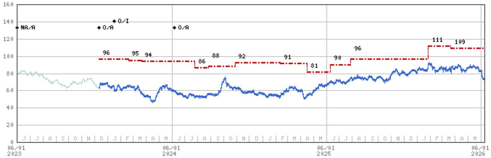

line chart

| Date       | Value |
| ---------- | ----- |
| 06/01 2023 | NA/R  |
|            | 96    |
|            | 95    |
|            | 94    |
|            | 86    |
|            | 88    |
|            | 92    |
|            | 91    |
|            | 81    |
|            | 90    |
|            | 96    |
|            | 111   |
|            | 109   |

Stock Rating History: 6/1/21 : 0/A; 9/9/21 : 0/I; 1/6/23 : 0/A; 3/19/23 : NA/A; 5/11/23 : NA/NR; 5/30/23 : NA/A; 12/12/23 : 0/A; 1/17/24 : 0/I; 6/7/24 : 0/A  
Price Target History: 4/7/21 : 130; 2/23/22 : 124; 7/20/22 : 111; 8/26/22 : 112; 2/27/23 : 108; 3/10/23 : 113; 3/19/23 : NA;
12/12/23 : 96; 2/19/24 : 95; 3/21/24 : 94; 7/25/24 : 86; 8/26/24 : 88; 10/28/24 : 92; 2/12/25 : 91; 4/16/25 : 81; 6/10/25 : 90;
7/28/25 : 96; 1/28/26 : 111; 3/22/26 : 109  
Source: MS Date Format : MM/DD/YY Price Target = No Price Target Assigned (NA)  
Stock Price (Not Covered by Current Analyst) — Stock Price (Covered by Current Analyst)  
Stock and Industry Ratings (abbreviations below) appear as ♦ Stock Rating/Industry View  
Stock Ratings: Overweight (O) Equal-weight (E) Underweight (U) Not-Rated (NR) No Rating Available (NA)  
Industry View: Attractive (A) In-line (I) Cautious (C) No Rating (NR)  
Effective January 13, 2014, the stocks covered by MS Asia Pacific will be rated relative to the analyst's industry (or industry team's) coverage.  
Effective January 13, 2014, the industry view benchmarks for MS Asia Pacific are as follows: relevant MSCI country index or MSCI sub-regional index or MSCI AC Asia Pacific ex Japan Index.

China Life Insurance Co Ltd (2628.HK) - As of 06/09/26 GMT in HKD
Industry : Hong Kong/China Insurance  
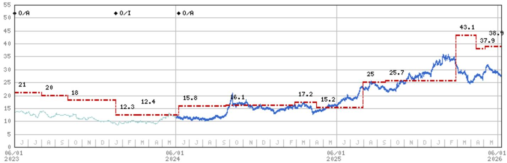

line chart

| Date       | Value |
| ---------- | ----- |
| 06/01 2023 | 21    |
|            | 20    |
|            | 18    |
|            | 12.3  |
|            | 12.4  |
|            | 15.8  |
|            | 16.1  |
|            | 17.2  |
|            | 15.2  |
|            | 25    |
|            | 25.7  |
|            | 43.1  |
|            | 37.9  |
|            | 38.9  |

Stock Rating History: 6/1/21 : E/A; 9/9/21 : E/I; 1/6/23 : E/A; 3/17/23 : NA/A; 5/11/23 : NA/NR; 5/30/23 : O/A; 1/17/24 : O/I; 6/7/24 : O/A  
Price Target History: 12/3/20 : 20; 9/9/21 : 14; 3/30/22 : 13.3; 7/27/22 : 12; 11/11/22 : 11; 1/6/23 : 14; 2/23/23 : 15;  
3/17/23 : NA; 5/30/23 : 21; 8/2/23 : 20; 9/29/23 : 18; 1/17/24 : 12.3; 3/5/24 : 12.4; 6/7/24 : 15.8; 9/23/24 : 16.1; 2/25/25 : 17.2;  
4/16/25 : 15.2; 7/31/25 : 25; 9/19/25 : 25.7; 2/26/26 : 43.1; 4/13/26 : 37.9; 5/4/26 : 38.9  
Source: MS Date Format : MM/DD/YY Price Target = No Price Target Assigned (NA)  
Stock Price (Not Covered by Current Analyst) — Stock Price (Covered by Current Analyst)  
Stock and Industry Ratings (abbreviations below) appear as ♦ Stock Rating/Industry View  
Stock Ratings: Overweight (O) Equal-weight (E) Underweight (U) Not-Rated (NR) No Rating Available (NA)  
Industry View: Attractive (A) In-line (I) Cautious (C) No Rating (NR)  
Effective January 13, 2014, the stocks covered by MS Asia Pacific will be rated relative to the analyst's industry (or industry team's) coverage.  
Effective January 13, 2014, the industry view benchmarks for MS Asia Pacific are as follows: relevant MSCI country index or MSCI sub-regional index or MSCI AC Asia Pacific ex Japan Index.

China Life Insurance Co Ltd (601628.SS) - As of 06/09/26 GMT in CNY Industry : Hong Kong/China Insurance  
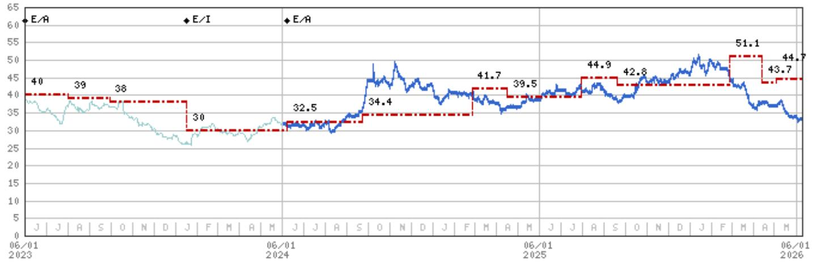

line chart

| Date       | Value |
| ---------- | ----- |
| 06/01 2023 | 40    |
|            | 39    |
|            | 38    |
|            | 30    |
|            | 32.5  |
|            | 34.4  |
|            | 41.7  |
|            | 39.5  |
|            | 44.9  |
|            | 42.8  |
|            | 51.1  |
|            | 43.7  |
|            | 44.7  |

Stock Rating History: 6/1/21 : U/A; 9/9/21 : U/I; 1/6/23 : E/A; 3/17/23 : NA/A; 5/11/23 : NA/NR; 5/30/23 : E/A; 1/17/24 : E/I; 6/7/24 : E/A  
Price Target History: 12/3/20 : 17; 9/9/21 : 11; 7/27/22 : 10; 1/6/23 : 37; 2/23/23 : 36; 3/17/23 : NA; 5/30/23 : 40; 8/2/23 : 39; 9/29/23 : 38; 1/17/24 : 30; 6/7/24 : 32.5; 9/23/24 : 34.4; 2/25/25 : 41.7; 4/16/25 : 39.5; 7/31/25 : 44.9; 9/19/25 : 42.8; 2/26/26 : 51.1; 4/13/26 : 43.7; 5/4/26 : 44.7  
Source: MS Date Format : MM/DD/YY Price Target = No Price Target Assigned (NA)  
Stock Price (Not Covered by Current Analyst) — Stock Price (Covered by Current Analyst)  
Stock and Industry Ratings (abbreviations below) appear as ♦ Stock Rating/Industry View  
Stock Ratings: Overweight (O) Equal-weight (E) Underweight (U) Not-Rated (NR) No Rating Available (NA)  
Industry View: Attractive (A) In-line (I) Cautious (C) No Rating (NR)  
Effective January 13, 2014, the stocks covered by MS Asia Pacific will be rated relative to the analyst's industry (or industry team's) coverage.  
Effective January 13, 2014, the industry view benchmarks for MS Asia Pacific are as follows: relevant MSCI country index or MSCI sub-regional index or MSCI AC Asia Pacific ex Japan Index.

Ping An Insurance Group Co of China Ltd (2318.HK) - As of 06/09/26 GMT in HKD Industry : Hong Kong/China Insurance  
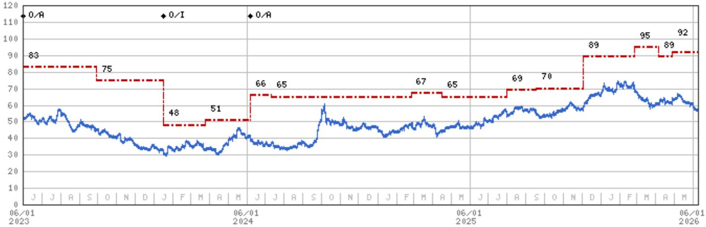

line chart

| Date       | Blue Line Value | Red Dashed Line Value |
|------------|-----------------|------------------------|
| 06/01 2023 | 55              | 83                     |
|            |                 | 75                     |
|            |                 | 48                     |
|            |                 | 51                     |
|            |                 | 66                     |
|            |                 | 65                     |
|            |                 | 67                     |
|            |                 | 65                     |
|            |                 | 69                     |
|            |                 | 70                     |
|            |                 | 89                     |
|            |                 | 95                     |
|            |                 | 89                     |
|            |                 | 92                     |

Stock Rating History: 6/1/21 : 0/A; 9/9/21 : 0/I; 1/6/23 : 0/A; 3/17/23 : NA/A; 5/11/23 : NA/NR; 5/30/23 : 0/A; 1/17/24 : 0/I; 6/7/24 : 0/A  
Price Target History: 2/9/21 : 118; 9/9/21 : 82; 2/25/22 : 73; 7/27/22 : 74; 8/25/22 : 69; 11/3/22 : 61; 1/6/23 : 81; 2/23/23 : 83;
3/17/23 : NA; 5/30/23 : 83; 9/29/23 : 75; 1/17/24 : 48; 3/25/24 : 51; 6/7/24 : 66; 7/11/24 : 65; 2/25/25 : 67; 4/16/25 : 65;
7/31/25 : 69; 9/18/25 : 70; 12/4/25 : 89; 2/26/26 : 95; 4/6/26 : 89; 4/29/26 : 92  
Source: MS Date Format : MM/DD/YY Price Target No Price Target Assigned (NA)  
Stock Price (Not Covered by Current Analyst) — Stock Price (Covered by Current Analyst)  
Stock and Industry Ratings (abbreviations below) appear as ♦ Stock Rating/Industry View  
Stock Ratings: Overweight (O) Equal-weight (E) Underweight (U) Not-Rated (NR) No Rating Available (NA)  
Industry View: Attractive (A) In-line (I) Cautious (C) No Rating (NR)  
Effective January 13, 2014, the stocks covered by MS Asia Pacific will be rated relative to the analyst's industry (or industry team's) coverage.  
Effective January 13, 2014, the industry view benchmarks for MS Asia Pacific are as follows: relevant MSCI country index or MSCI sub-regional index or MSCI AC Asia Pacific ex Japan Index.

Ping An Insurance Group Co of China Ltd (601318.SS) - As of 06/09/26 GMT in CNY Industry : Hong Kong/China Insurance  
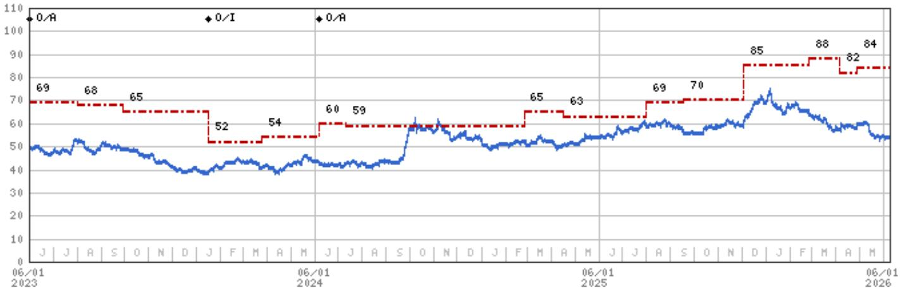

line chart

| Date | Blue Line | Red Dashed Line |
| --- | --- | --- |
| 06/01 2023 | 50 | 69 |
|  |  |  |
|  |  | 68 |
|  |  |  |
|  |  | 65 |
|  |  |  |
|  |  | 52 |
|  |  |  |
|  |  | 54 |
|  |  |  |
|  |  | 60 |
|  |  | 59 |
|  |  |  |
|  |  | 65 |
|  |  | 63 |
|  |  |  |
|  |  | 69 |
|  |  | 70 |
|  |  |  |
|  |  | 85 |
|  |  |  |
|  |  | 88 |
|  |  |  |
|  |  | 82 |
|  |  |  |
|  |  | 84 |

Stock Rating History: 6/1/21 : 0/A; 9/9/21 : 0/I; 1/6/23 : 0/A; 3/17/23 : NA/A; 5/11/23 : NA/NR; 5/30/23 : 0/A; 1/17/24 : 0/I; 6/7/24 : 0/A  
Price Target History: 2/9/21 : 99; 9/9/21 : 69; 2/25/22 : 61; 8/25/22 : 60; 11/3/22 : 56; 1/6/23 : 67; 3/17/23 : NA; 5/30/23 : 69; 8/2/23 : 68; 9/29/23 : 65; 1/17/24 : 52; 3/25/24 : 54; 6/7/24 : 60; 7/11/24 : 59; 2/25/25 : 65; 4/16/25 : 63; 7/31/25 : 69; 9/18/25 : 70; 12/4/25 : 85; 2/26/26 : 88; 4/6/26 : 82; 4/29/26 : 84  
Source: MS Date Format : MM/DD/YY Price Target = No Price Target Assigned (NA)  
Stock Price (Not Covered by Current Analyst) — Stock Price (Covered by Current Analyst)  
Stock and Industry Ratings (abbreviations below) appear as ♦ Stock Rating/Industry View  
Stock Ratings: Overweight (O) Equal-weight (E) Underweight (U) Not-Rated (NR) No Rating Available (NA)  
Industry View: Attractive (A) In-line (I) Cautious (C) No Rating (NR)  
Effective January 13, 2014, the stocks covered by MS Asia Pacific will be rated relative to the analyst's industry (or industry team's) coverage.  
Effective January 13, 2014, the industry view benchmarks for MS Asia Pacific are as follows: relevant MSCI country index or MSCI sub-regional index or MSCI AC Asia Pacific ex Japan Index.

## Important Disclosures for MS Smith Barney LLC Customers

Important disclosures regarding any material conflict of interest that can reasonably be expected to have influenced MS Smith Barney LLC's choice of a third-party research provider or the subject company of a third-party research report, are available on the MS Wealth Management disclosure website at www.morganstanley.com/online/researchdisclosures. For MS specific disclosures, you may refer to https://www.morganstanley.com/eqr/disclosures/webapp/generalresearch.

Each MS report is reviewed and approved on behalf of MS Smith Barney LLC. This review and approval is conducted by the same person who reviews the research report on behalf of MS. This could create a conflict of interest.

## Other Important Disclosures

MS policy is to update research reports as and when the Research Analyst and Research Management deem appropriate, based on developments with the issuer, the sector, or the market that may have a material impact on the research views or opinions stated therein. In addition, certain Research publications are intended to be updated on a regular periodic basis (weekly/monthly/quarterly/annual) and will ordinarily be updated with that frequency, unless the Research Analyst and Research Management determine that a different publication schedule is appropriate based on current conditions.

MS is not acting as a municipal advisor and the opinions or views contained herein are not intended to be, and do not constitute, advice within the meaning of Section 975 of the Dodd-Frank Wall Street Reform and Consumer Protection Act.

MS produces an equity research product called a "Tactical Idea." Views contained in a "Tactical Idea" on a particular stock may be contrary to the recommendations or views expressed in research on the same stock. This may be the result of differing time horizons, methodologies, market events, or other factors. For all research available on a particular stock, please contact your sales representative or go to Matrix at http://www.morganstanley.com/matrix.

MS is provided to our clients through our proprietary research portal on Matrix and also distributed electronically by MS to clients. Certain, but not all, MS products are also made available to clients through third-party vendors or redistributed to clients through alternate electronic means as a convenience. For access to all available MS, please contact your sales representative or go to Matrix at http://www.morganstanley.com/matrix.

Any access and/or use of MS is subject to MS's Terms of Use (http://www.morganstanley.com/terms.html). By accessing and/or using MS, you are indicating that you have read and agree to be bound by our Terms of Use (http://www.morganstanley.com/terms.html). In addition you consent to MS processing your personal data and using cookies in accordance with our Privacy Policy and our Global Cookies Policy (http://www.morganstanley.com/privacy\_pledge.html), including for the purposes of setting your preferences and to collect readership data so that we can deliver better and more personalized service and products to you. To find out more information about how MS processes personal data, how we use cookies and how to reject cookies see our Privacy Policy and our Global Cookies Policy (http://www.morganstanley.com/privacy\_pledge.html). Please use the provided link to review the Terms and Conditions and Most Important Terms and Conditions for MS India Company Private Limited (https://www.morganstanley.com/assets/pdfs/about-us-global-offices/india/Terms\_and\_conditions.pdf) and the following link to review the audit report (https://ny.matrix.ms.com/eqr/research/webapp/researchdocs/MSICPL\_Morgan\_Stanley\_Research\_Audit\_Report.pdf).

If you do not agree to our Terms of Use and/or if you do not wish to provide your consent to MS processing your personal data or using cookies please do not access our research.

MS does not provide individually tailored investment advice. MS has been prepared without regard to the circumstances and objectives of those who receive it. MS recommends that investors independently evaluate particular investments and strategies, and encourages investors to seek the advice of a financial adviser. The appropriateness of an investment or strategy will depend on an investor's circumstances and objectives. The securities, instruments, or strategies discussed in MS may not be suitable for all investors, and certain investors may not be eligible to purchase or participate in some or all of them. MS is not an offer to buy or sell or the solicitation of an offer to buy or sell any security/instrument or to participate in any particular trading strategy. The value of and income from your investments may vary because of changes in interest rates, foreign exchange rates, default rates, prepayment rates, securities/instruments prices, market indexes, operational or financial conditions of companies or other factors. There may be time limitations on the exercise of options or other rights in securities/instruments transactions. Past performance is not necessarily a guide to future performance. Estimates of future performance are based on assumptions that may not be realized. If provided, and unless otherwise stated, the closing price on the cover page is that of the primary exchange for the subject company's securities/instruments.

The fixed income research analysts, strategists or economists principally responsible for the preparation of MS have received compensation based upon various factors, including quality, accuracy and value of research, firm profitability or revenues (which include fixed income trading and capital markets profitability or revenues), client feedback and competitive factors. Fixed Income Research analysts', strategists' or economists' compensation is not linked to investment banking or capital markets transactions performed by MS or the profitability or revenues of particular trading desks.

The "Important Regulatory Disclosures on Subject Companies" section in MS lists all companies mentioned where MS owns 1% or more of a class of common equity securities of the companies. For all other companies mentioned in MS, MS may have an investment of less than 1% in securities/instruments or derivatives of securities/instruments of companies and may trade them in ways different from those discussed in MS. Employees of MS not involved in the preparation of MS may have investments in securities/instruments or derivatives of securities/instruments of companies mentioned and may trade them in ways different from those discussed in MS. Derivatives may be issued by MS or associated persons.

With the exception of information regarding MS, MS is based on public information. MS makes every effort to use reliable, comprehensive information, but we make no representation that it is accurate or complete. We have no obligation to tell you when opinions or information in MS change apart from when we intend to discontinue equity research coverage of a subject company. Facts and views presented in MS have not been reviewed by, and may not reflect information known to, professionals in other MS business areas, including investment banking personnel.

MS personnel may participate in company events such as site visits and are generally prohibited from accepting payment by the company of associated expenses unless pre-approved by authorized members of Research management.

MS may make investment decisions that are inconsistent with the recommendations or views in this report.

To our readers based in Taiwan or trading in Taiwan securities/instruments: Information on securities/instruments that trade in Taiwan is distributed by MS Taiwan Limited ("MSTL"). Such information is for your reference only. The reader should independently evaluate the investment risks and is solely responsible for their investment decisions. MS may not be distributed to the public media or quoted or used by the public media without the express written consent of MS. Any non-customer reader within the scope of Article 7-1 of the Taiwan Stock Exchange Recommendation Regulations accessing and/or receiving MS is not permitted to provide MS to any third party (including but not limited to related parties, affiliated companies and any other third parties) or engage in any activities regarding MS which may create or give the appearance of creating a conflict of interest. Information on securities/instruments that do not trade in Taiwan is for informational purposes only and is not to be construed as a recommendation or a solicitation to trade in such securities/instruments. MSTL may not execute transactions for clients in these securities/instruments.

Certain information in MS was sourced by employees of the Shanghai Representative Office of MS Asia Limited for the use of MS Asia Limited. MS is not incorporated under PRC law and the research in relation to this report is conducted outside the PRC. MS does not constitute an offer to sell or the solicitation of an offer to buy any securities in the PRC. PRC investors shall have the relevant qualifications to invest in such securities and shall be responsible for obtaining all relevant approvals, licenses, verifications and/or registrations from the relevant governmental authorities themselves. Neither this report nor any part of it is intended as, or shall constitute, provision of any consultancy or advisory service of securities investment as defined under PRC law. Such information is provided for your reference only.

MS is disseminated in Brazil by MS C.T.V.M. S.A. located at Av. Brigadeiro Faria Lima, 3600, 6th floor, São Paulo - SP, Brazil; and is regulated by the Comissão de Valores Mobiliários; in Mexico by MS México, Casa de Bolsa, S.A. de C.V which is regulated by Comision Nacional Bancaria y de Valores. Paseo de los Tamarindos 90, Torre 1, Col. Bosques de las Lomas Floor 29, 05120 Mexico City; in Japan by MS MUFG Securities Co., Ltd. and, for Commodities related research reports only, MS Capital Group Japan Co., Ltd; in Hong Kong by MS Asia Limited (which accepts responsibility for its contents) and by MS Bank Asia Limited; in Singapore by MS Asia (Singapore) Pte. (Registration number 199206298Z) and/or MS Asia (Singapore) Securities Pte Ltd (Registration number 200008434H), regulated by the Monetary Authority of Singapore (which accepts legal responsibility for its contents and should be contacted with respect to any matters arising from, or in connection with, MS) and by MS Bank Asia Limited, Singapore Branch (Registration number T14FC0118J); in Australia to "wholesale clients" within the meaning of the Australian Corporations Act by MS Australia Limited A.B.N. 67 003 734 576, holder of Australian financial services license No. 233742, which accepts responsibility for its contents; in Australia to "wholesale clients" and "retail clients" within the meaning of the Australian Corporations Act by MS Wealth Management Australia Pty Ltd (A.B.N. 19 009 145 555, holder of Australian financial services license No. 240813, which accepts responsibility for its contents; in Korea by MS & Co International plc, Seoul Branch; in India by MS India Company Private Limited having Corporate Identification No (CIN) U22990MH1998PTC115305, regulated by the Securities and Exchange Board of India ("SEBI") and holder of licenses as a Research Analyst (SEBI Registration No. INH000001105); Stock Broker (SEBI Stock Broker Registration No. INZ000244438), Merchant Banker (SEBI Registration No. INM000011203), and depository participant with National Securities Depository Limited (SEBI Registration No. IN-DP-NSDL-567-2021) having registered office at Altimus, Level 39 & 40, Pandurang Budhkar Marg, Worli, Mumbai 400018, India; Telephone no. +91-22-61181000; Compliance Officer Details: Mr. Tejarshi Hardas, Tel. No.: +91-22-61181000 or Email: tejarshi.hardas@morganstanley.com; Grievance officer details: Mr. Tejarshi Hardas, Tel. No.: +91-22-61181000 or Email: msic-compliance@morganstanley.com. MS India Company Private Limited (MSICPL) may use AI tools in providing research services. All recommendations contained herein are made by the duly qualified research analysts; in Canada by MS Canada Limited; in Germany and the European Economic Area where required by MS Europe S.E., authorised and regulated by Bundesanstalt fuer Finanzdienstleistungsaufsicht (BaFin) under the reference number 149169; in the US by MS & Co. LLC, which accepts responsibility for its contents. MS & Co. International plc, authorized by the Prudential Regulation Authority and regulated by the Financial Conduct Authority and the Prudential Regulation Authority, disseminates in the UK research that it has prepared, and research which has been prepared by any of its affiliates, only to persons who (i) are investment professionals falling within Article 19(5) of the Financial Services and Markets Act 2000 (Financial Promotion) Order 2005 (as amended, the "Order"); (ii) are persons who are high net worth entities falling within Article 49(2)(a) to (d) of the Order; or (iii) are persons to whom an invitation or inducement to engage in investment activity (within the meaning of section 21 of the Financial Services and Markets Act 2000, as amended) may otherwise lawfully be communicated or caused to be communicated. RMB MS Proprietary Limited is a member of the JSE Limited and A2X (Pty) Ltd. RMB MS Proprietary Limited is a joint venture owned equally by MS International Holdings Inc. and RMB Investment Advisory (Proprietary) Limited, which is wholly owned by FirstRand Limited. The information in MS is being disseminated by MS Saudi Arabia, regulated by the Capital

Market Authority in the Kingdom of Saudi Arabia, and is directed at Sophisticated investors only.

MS Hong Kong Securities Limited is the liquidity provider/market maker for securities of AIA Group Ltd, China Life Insurance Co Ltd, China Pacific Insurance Group Co Ltd, New China Life Insurance Company Ltd, PICC Group, PICC P&C Company Ltd, Ping An Insurance Group Co of China Ltd, ZhongAn Online P & C Insurance Co Ltd listed on the Stock Exchange of Hong Kong Limited. An updated list can be found on HKEx website: http://www.hkex.com.hk.

The information in MS is being communicated by MS & Co. International plc (DIFC Branch), regulated by the Dubai Financial Services Authority (the DFSA) or by MS & Co. International plc (ADGM Branch), regulated by the Financial Services Regulatory Authority Abu Dhabi (the FSRA), and is directed at Professional Clients only, as defined by the DFSA or the FSRA, respectively. The financial products or financial services to which this research relates will only be made available to a customer who we are satisfied meets the regulatory criteria of a Professional Client. A distribution of the different MS Research ratings or recommendations, in percentage terms for Investments in each sector covered, is available upon request from your sales representative.

The information in MS is being communicated by MS & Co. International plc (QFC Branch), regulated by the Qatar Financial Centre Regulatory Authority (the QFCRA), and is directed at business customers and market counterparties only and is not intended for Retail Customers as defined by the QFCRA.

As required by the Capital Markets Board of Turkey, investment information, comments and recommendations stated here, are not within the scope of investment advisory activity. Investment advisory service is provided exclusively to persons based on their risk and income preferences by the authorized firms. Comments and recommendations stated here are general in nature. These opinions may not fit to your financial status, risk and return preferences. For this reason, to make an investment decision by relying solely to this information stated here may not bring about outcomes that fit your expectations.

The trademarks and service marks contained in MS are the property of their respective owners. Third-party data providers make no warranties or representations relating to the accuracy, completeness, or timeliness of the data they provide and shall not have liability for any damages relating to such data. The Global Industry Classification Standard (GICS) was developed by and is the exclusive property of MSCI and S&P.

MS, or any portion thereof may not be reprinted, sold or redistributed without the written consent of MS.

Indicators and trackers referenced in MS may not be used as, or treated as, a benchmark under Regulation EU 2016/1011, or any other similar framework.

The issuers and/or fixed income products recommended or discussed in certain fixed income research reports may not be continuously followed. Accordingly, investors should regard those fixed income research reports as providing stand-alone analysis and should not expect continuing analysis or additional reports relating to such issuers and/or individual fixed income products. MS may hold, from time to time, material financial and commercial interests regarding the company subject to the Research report.

Registration granted by SEBI and certification from the National Institute of Securities Markets (NISM) in no way guarantee performance of the intermediary or provide any assurance of returns to investors. Investment in securities market are subject to market risks. Read all the related documents carefully before investing.

INDUSTRY COVERAGE: Hong Kong/China Insurance

<table><tr><td>COMPANY (TICKER)</td><td>RATING (AS OF)</td><td>PRICE* (06/09/2026)</td></tr><tr><td colspan="3">Richard Xu, CFA</td></tr><tr><td>AIA Group Ltd (1299.HK)</td><td>O (12/12/2023)</td><td>HK$71.00</td></tr><tr><td>FWD Group Holdings Ltd (1828.HK)</td><td>O (08/13/2025)</td><td>HK$29.90</td></tr><tr><td>Ping An Insurance Group Co of China Ltd (2318.HK)</td><td>O (05/30/2023)</td><td>HK$56.90</td></tr><tr><td>Ping An Insurance Group Co of China Ltd (601318.SS)</td><td>O (05/30/2023)</td><td>Rmb53.93</td></tr><tr><td colspan="3">Rick Zhao</td></tr><tr><td>China Life Insurance Co Ltd (601628.SS)</td><td>E (05/30/2023)</td><td>Rmb33.14</td></tr><tr><td>China Life Insurance Co Ltd (2628.HK)</td><td>O (05/30/2023)</td><td>HK$27.38</td></tr><tr><td>China Pacific Insurance Group Co Ltd (601601.SS)</td><td>O (06/07/2024)</td><td>Rmb31.55</td></tr><tr><td>China Pacific Insurance Group Co Ltd (2601.HK)</td><td>O (05/30/2023)</td><td>HK$31.68</td></tr><tr><td>China Taiping Insurance Holdings Co Ltd (0966.HK)</td><td>E (05/30/2023)</td><td>HK$19.77</td></tr><tr><td>New China Life Insurance Company Ltd (601336.SS)</td><td>U (05/30/2023)</td><td>Rmb55.87</td></tr><tr><td>New China Life Insurance Company Ltd (1336.HK)</td><td>U (07/31/2025)</td><td>HK$47.28</td></tr><tr><td>PICC Group (1339.HK)</td><td>O (09/23/2024)</td><td>HK$5.06</td></tr><tr><td>PICC Group (601319.SS)</td><td>E (07/31/2025)</td><td>Rmb6.61</td></tr><tr><td>PICC P&amp;C Company Ltd (2328.HK)</td><td>O (05/30/2023)</td><td>HK$14.83</td></tr><tr><td>ZhongAn Online P &amp; C Insurance Co Ltd (6060.HK)</td><td>O (05/30/2023)</td><td>HK$10.55</td></tr></table>

Stock Ratings are subject to change. Please see latest research for each company.  
\* Historical prices are not split adjusted.