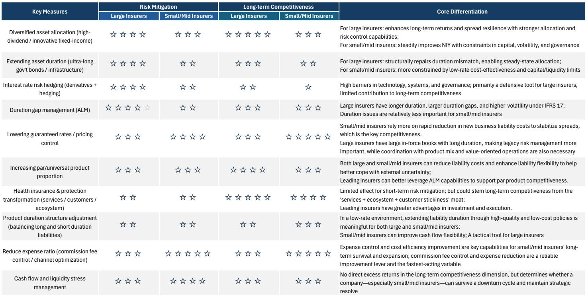
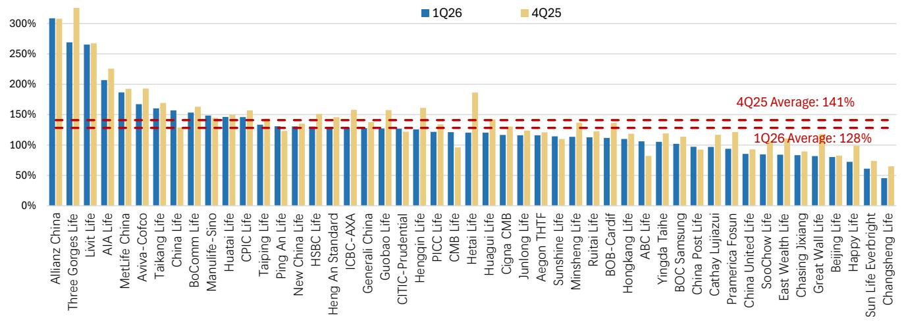
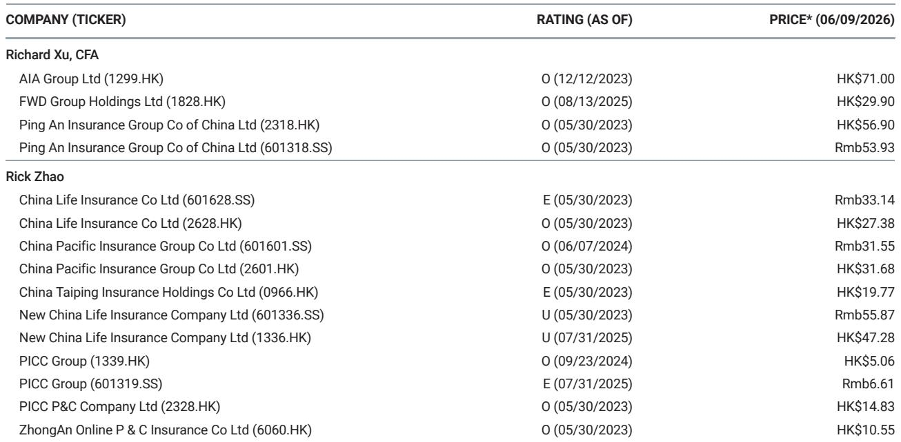

# China's Insurance Industry Is Entering a Two-Track Market Where Large Insurers Will Solidify Their Dominance While Smaller Players Face a Strategic Crossroads

The narrative that China's insurance industry is undergoing a uniform transformation is misleading. What is actually unfolding is a structural divergence between two distinct groups of players, and this split will define competitive outcomes for years to come. A global investment bank report on the Hong Kong and China insurance sector reveals that the industry's product transition from traditional to participating policies has largely been completed at the aggregate level, with par products now accounting for over 80 percent of listed insurers' new business in the first quarter of 2026. But beneath this surface-level uniformity lies a far more interesting story. Large, listed insurers are using this transition to entrench their competitive advantages through scale, distribution control, and investment sophistication. Meanwhile, small and medium-sized insurers are beginning to reverse course, revisiting traditional product strategies as they confront the hidden costs and capital intensity of the par product model.

This matters now because the window for strategic repositioning is narrowing. The pricing interest rate for current par products is expected to decline from 1.75 percent to approximately 1.25 percent over the next few quarters, compressing margins across the board. At the same time, new solvency disclosure requirements beginning in the first quarter of 2026 will increase transparency, making it easier for investors to distinguish between insurers that are genuinely de-risking and those that are merely following the regulatory script. The result is a market where the gap between winners and laggards will become not just visible but quantifiable. For investors, the key question is no longer whether the industry is healthy, but rather which insurers have the structural capacity to thrive in a low-rate, high-transparency environment, and which ones are simply surviving on borrowed time.

## The Par Product Transition Has Been a Tale of Two Industries, Not One

The headline numbers suggest a clean, industry-wide shift. Listed insurers have moved from a traditional product mix of less than 50 percent par products in the first half of 2025 to roughly 90 percent by the first quarter of 2026. Unlisted insurers have followed a similar trajectory, with par products contributing approximately 70 percent of new premiums for domestic small and medium-sized insurers in the banca channel. But the uniformity ends there. The motivations and sustainability of this transition differ dramatically between large and small players, and the divergence is accelerating.

For large insurers, the par product strategy is a long-term commitment supported by proprietary distribution. Their agency channels, which contribute 60 to 80 percent of total premiums, provide product continuity and margin stability that smaller players cannot replicate. Large insurers can absorb the higher actual liability costs of par products because they have the scale to manage participating fund reserves, the actuarial sophistication to set appropriate fulfillment ratios, and the investment capabilities to generate the excess returns needed to make profit-sharing mechanisms work in their favor. For them, the par transition is a strategic choice that aligns with regulatory direction and enhances franchise value.

For small and medium-sized insurers, the calculus is fundamentally different. Many of these firms relied on the banca channel for 50 to 100 percent of their gross premiums, leaving them exposed to channel partner pressures and margin compression. The par product transition for these players was less a strategic choice and more a regulatory necessity. Now, with the pricing interest rate gap between traditional and par products narrowing from 50 basis points to just 25 basis points since the third quarter of 2025, the economic rationale for maintaining a heavy par product focus is weakening. Some small and medium-sized insurers are already reinvigorating traditional product sales since the second quarter of 2026, and the report expects a more balanced mix between par and non-par products to emerge among this group.

The implication is clear. The industry-level data showing high par product penetration masks a strategic bifurcation. Large insurers are doubling down on par products, while smaller players are beginning to hedge their bets. This divergence will become more pronounced as pricing rates continue to decline, and it will be one of the most important factors separating long-term winners from those that will struggle to maintain market share.

## Banca Channel Dynamics Are Creating a Structural Advantage for Large Insurers That Will Be Difficult to Dislodge

The bancassurance channel has experienced a strong rebound, with new premium growth exceeding 15 percent in 2025 and momentum continuing into the first quarter of 2026 with approximately 17 percent year-over-year growth in first-year premiums. A large cohort of term deposits maturing around 2026 is creating a natural pool of reinvestment demand that insurers are well positioned to capture. But the benefits of this channel recovery are not evenly distributed, and the structural dynamics favor large insurers in ways that will compound over time.

Large insurers maintain a diversified distribution mix that reduces their dependence on any single channel. Their agency networks provide a proprietary source of premium flow that allows them to negotiate better terms with bank partners and to shift product emphasis without being captive to channel preferences. When regulatory tightening occurs, as it did with the "Bao Xing He Yi" expense regulations in late 2023 and early 2024, large insurers have the flexibility to adjust their channel mix without suffering catastrophic volume declines.

Small and medium-sized insurers, by contrast, are structurally dependent on the banca channel. This dependence creates several vulnerabilities. First, it limits their ability to control product mix, as bank partners increasingly prefer par products that generate higher fee income. Second, it exposes them to cash flow management challenges, as banca channel premiums tend to be more volatile and surrender risk is higher for par products sold through third-party channels. Third, it constrains their ability to optimize payment-period structures, which large insurers are actively using to improve liability duration matching.

The report notes that large insurers are maintaining their banca edge despite tighter regulation, and they are further optimizing payment-period structures. This suggests that the distribution advantage is not static but is being actively managed and improved. For small and medium-sized insurers, the path forward requires a fundamental rethinking of channel partnerships and cash flow management. Those that fail to diversify their distribution will find themselves increasingly squeezed between regulatory pressure and bank partner demands, with limited room to maneuver.

## Investment Strategy Divergence Is Creating a Self-Reinforcing Cycle That Favors Incumbents

The investment side of the balance sheet tells a similar story of structural advantage. In a low-rate environment with volatile markets, insurers are actively optimizing their investment allocation strategies, but the approaches differ markedly between large and small players. Listed insurers have increased equity allocations and are taking a more proactive approach in par reserve accounts while maintaining a more prudent strategy in non-par accounts. This differentiated approach requires sophisticated asset-liability management capabilities that are not easily replicated.

Large insurers benefit from an edge in alternative asset investments, which provide yield enhancement in an environment where traditional fixed-income returns are compressed. The ability to access and underwrite alternative assets is not just a matter of capital but also of expertise, relationships, and operational infrastructure. These capabilities take years to build and cannot be acquired quickly, meaning that the investment advantage of large insurers is likely to persist and even widen over time.

For smaller insurers, the investment challenge is more acute. The report indicates that solvency pressure continues to weigh on certain insurers' asset allocation and liability growth, and the scope for solvency rule revisions in 2026 is limited. This means that smaller players face a binding constraint on their investment flexibility. They cannot take on the same level of equity or alternative asset exposure without triggering solvency concerns, which in turn limits their ability to generate the investment returns needed to support par product guarantees.

This creates a self-reinforcing cycle. Large insurers can offer competitive par products because their investment capabilities generate sufficient returns to cover profit-sharing obligations. Their par product sales then generate additional premium flow, which provides more capital for investment, which further enhances their investment capabilities. Smaller insurers, constrained by solvency and lacking investment sophistication, struggle to make the par product model work economically, which pushes them back toward traditional products, which may offer lower margins but require less investment expertise. The cycle reinforces the market position of incumbents and makes it increasingly difficult for smaller players to compete on equal terms.

## What the Report Does Not Fully Answer: The Sustainability of Profit-Sharing Models and the Risk of Customer Disappointment

For all its analytical depth, the report leaves several critical questions unresolved. The most important of these concerns the sustainability of the par product profit-sharing model over a full market cycle. The report acknowledges that par products feature profit sharing, which can reduce retained shareholder profits, especially when insurers generate excess investment returns. But it does not address the opposite scenario. What happens when investment returns fall short of expectations, and insurers are forced to reduce dividend payouts or fulfillment ratios?

The current environment of declining pricing interest rates and illustration rates suggests that the trend is toward lower rather than higher returns for policyholders. The illustration rate has already been guided down from 3.9 percent to 3.5 percent, and the report expects further declines to approximately 3.2 percent over the next few quarters. Actual dividend payout was approximately 3.2 percent for 2025, which is already below the current illustration rate. If investment returns continue to decline, insurers may face the uncomfortable choice of either reducing policyholder payouts, which could trigger lapses and reputational damage, or absorbing the shortfall themselves, which would pressure shareholder returns.

The report also does not fully explore the potential for regulatory intervention if the par product model begins to generate systemic risk. The regulatory guidance that drove the transition from traditional to par products was based on the view that par products are safer because they share investment risk with policyholders. But if a large number of insurers simultaneously reduce fulfillment ratios, the resulting customer dissatisfaction could trigger a regulatory backlash that reshapes the product landscape once again. The history of China's insurance regulation suggests that the pendulum can swing quickly, and today's favored product structure could become tomorrow's regulatory concern.

These open questions do not invalidate the report's analysis, but they do suggest that investors should maintain a healthy skepticism about the durability of the current product mix. The par product transition may prove to be a multi-year equilibrium, or it may be another step in an ongoing evolution that will continue to surprise market participants. The report's framework provides the tools to analyze the current state, but the future direction remains uncertain.

## A Decision Framework for Investors: Three Questions to Distinguish Between Structural Winners and Cyclical Survivors

For investors trying to navigate this increasingly complex landscape, the report provides the raw material for a practical decision framework. Three questions can help distinguish between insurers that are building sustainable competitive advantages and those that are merely benefiting from favorable industry tailwinds.

First, how diversified is the insurer's distribution model? The evidence in the report is clear that insurers with proprietary agency channels have more control over product mix, margins, and customer relationships than those dependent on the banca channel. An insurer that derives more than 60 percent of premiums from a single channel faces structural vulnerability that no amount of product innovation can fully compensate for. The ideal profile is an insurer with a balanced mix of agency and banca channels, where each channel serves a distinct customer segment and product type.

Second, does the insurer have the investment capabilities to generate excess returns in a low-rate environment? The report's analysis of investment strategy divergence shows that large insurers are using alternative assets and proactive equity allocation to enhance returns. But not all large insurers are equally capable. Investors should examine the track record of alternative asset performance, the sophistication of asset-liability management, and the ability to generate consistent excess returns without taking excessive risk. An insurer that relies primarily on fixed-income investments in a declining rate environment will struggle to support par product guarantees over time.

Third, what is the insurer's solvency buffer and how does it constrain strategic flexibility? The report notes that solvency pressure continues to weigh on certain insurers' asset allocation and liability growth, and there is limited scope for rule revisions. An insurer with a thin solvency buffer has limited room to adjust its investment strategy, shift its product mix, or absorb shocks. The most resilient insurers are those with solvency ratios well above regulatory minimums, giving them the flexibility to pursue opportunistic strategies without being forced into reactive decisions.

Applying this framework suggests that the market is likely to continue favoring high-quality names with strong distribution, sophisticated investment capabilities, and robust solvency positions. The report explicitly favors names including Ping An, China Life, and AIA, and the analytical framework supports this conclusion. But the framework also suggests that investors should be cautious about insurers that have high par product penetration but lack the underlying capabilities to make the model work sustainably. These insurers may appear to be keeping pace with industry leaders today, but the divergence in strategic position will become increasingly visible as the pricing rate cycle continues to turn.

Join the community to read the full report and review the original charts.

*This article is for learning and discussion only and does not constitute investment advice.*

Personal reading notes and learning share only. Not investment advice.

