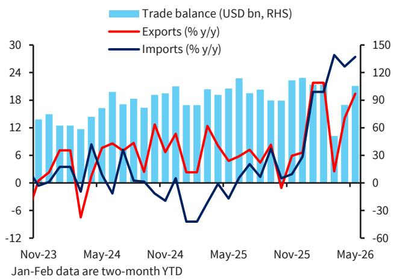
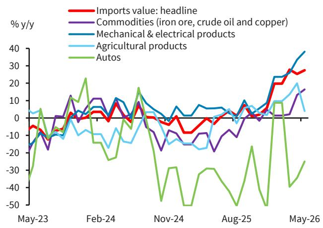
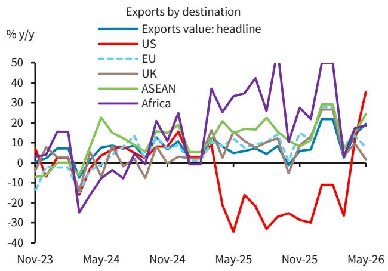

# China’s Export Engine Is No Longer Cyclical: AI and Green-Tech Exports Are Rewriting the Growth Story

China’s export growth accelerated to 19.4% year-on-year in May, far exceeding the 15% consensus estimate, and the composition of that growth reveals a structural shift that investors cannot afford to treat as a cyclical rebound. The headline number alone is striking, but the real story lies beneath the surface: high-tech exports, led by semiconductors and AI-related components, surged 51% year-on-year and now account for nearly 30% of total export value. This is not a temporary trade boost from a weak renminbi or inventory restocking. It is the maturation of China’s industrial strategy, where the global AI investment cycle and the energy transition are creating durable demand for Chinese manufactured goods that the rest of the world cannot easily replace.

The conventional narrative about China’s exports has long been one of low-cost assembly lines and vulnerability to Western demand shocks. That narrative is becoming obsolete. The May data shows that China’s export strength is broad-based across regions and product categories, but the most important driver is the convergence of two secular trends: the AI capex boom and the energy shock-driven green transition. These forces are not only sustaining China’s export momentum but are also reshaping the competitive landscape in ways that have second-order implications for global supply chains, trade policy, and investment strategy.

This article unpacks the May trade data to identify what is structurally new, what remains fragile, and what questions investors should be asking now. The argument is straightforward: China’s export machine is undergoing a qualitative upgrade, and the implications for portfolio positioning, sector allocation, and geopolitical risk assessment are profound.

## The AI Capex Cycle Is Creating a Self-Reinforcing Export Flywheel for China’s Semiconductor Supply Chain

The most striking data point in the May report is the 111% year-on-year growth in semiconductor exports, following a 99.6% increase in April. This is not a one-off surge. It reflects the fact that China has become a critical node in the global AI hardware supply chain, supplying manufactured components and intermediate goods that feed into the data center buildout happening across the United States, Europe, and Asia. The global AI capex cycle, driven by hyperscalers and enterprise adoption, is generating demand for a range of products—from advanced packaging to memory modules to power management chips—and Chinese manufacturers are capturing a growing share of that demand.

The implications are twofold. First, China’s semiconductor export growth is structurally supported by an investment cycle that is still in its early innings. The global AI infrastructure buildout is expected to continue for several years, and China’s role as a supplier of mid- and high-end components is likely to deepen, especially as domestic fabrication capacity expands. Second, this creates a self-reinforcing dynamic: stronger export revenues fund further R&D and capacity expansion in China’s semiconductor ecosystem, which in turn improves its competitiveness and reduces reliance on imported equipment. The May data also showed semiconductor imports surging in value terms, indicating that China is simultaneously importing advanced chips and equipment while exporting a growing volume of finished and semi-finished components. This two-way flow is characteristic of a supply chain that is becoming more vertically integrated within China’s borders.

The strategic question for investors is whether this export flywheel is vulnerable to policy disruptions. The report notes that shipments to the US surged 35.4% year-on-year in May, partly due to a low base following the Liberation Day tariffs, but the sequential momentum also improved. This suggests that despite ongoing trade tensions, the underlying demand for Chinese AI-related goods remains strong. The market is effectively voting with its orders: the cost, quality, and reliability of Chinese components are hard to replace at scale, and the AI boom is creating a window of opportunity that both sides are reluctant to close entirely.

## The Energy Shock Is Accelerating the Green Transition, and China Is the Dominant Supplier of the Required Hardware

The second structural driver of China’s export strength is the global energy shock, which has permanently altered the economics of renewable energy adoption. The report shows sustained double-digit growth in exports of EVs, lithium batteries, wind turbines, and solar cells through the year-to-date period. This is not merely a continuation of the pre-existing green export trend; it is an acceleration driven by the realization that energy security and energy transition are now inseparable.

The Middle East energy shock has forced governments and corporations to hedge against supply disruptions by diversifying their energy sources. Solar and wind installations are the fastest way to reduce exposure to fossil fuel price volatility, and China is the world’s lowest-cost, highest-volume producer of the necessary equipment. The May data confirms that demand for Chinese green-tech goods is broad-based across regions, with exports to ASEAN and Africa continuing to expand at double-digit rates. These are markets where the price sensitivity is highest and where Chinese products have a clear competitive advantage over Western alternatives.

The second-order implication is that the green transition is becoming less dependent on policy subsidies and more driven by market forces. As the cost of renewable energy continues to fall relative to fossil fuels, the demand for Chinese green-tech exports is likely to remain robust even if Western governments impose tariffs or local-content requirements. The report’s observation that geopolitical tensions could further accelerate the global green transition is a critical insight: if trade frictions intensify, the incentive for importing countries to secure reliable, low-cost renewable equipment from China will only increase. China is not just a supplier of green-tech goods; it is the supplier of the enabling infrastructure for the world’s energy transition.

## The Regional Diversification of China’s Export Base Is Reducing Its Vulnerability to Any Single Market

One of the most underappreciated aspects of the May data is the extent to which China’s export destinations are diversifying. Shipments to ASEAN grew 24.3% year-on-year, exports to Japan, Korea, and Taiwan rose 27.5%, and shipments to Africa continued at an 18.6% pace. Meanwhile, export growth to the EU slowed to 7.6% and to the UK to 1.7%. This pattern suggests that China is successfully reorienting its trade flows toward faster-growing regions, particularly in Asia and the Global South, while its dependence on Western European markets is gradually diminishing.

This diversification has important strategic implications. It reduces the leverage that any single trading partner can exert over China’s export machine. If the EU or the UK were to impose significant trade restrictions, the impact on China’s overall export growth would be muted because those markets now account for a smaller share of the total. Conversely, China’s deepening trade ties with ASEAN and Africa create a virtuous cycle: these regions import Chinese manufactured goods, which supports their own industrial development, which in turn generates demand for more Chinese exports.

The report also notes that exports to Latin America softened in May, which raises a question about whether the diversification trend is sustainable across all emerging markets. Some regions may face their own macroeconomic headwinds—currency weakness, fiscal constraints, or political instability—that could dampen demand for Chinese goods. The durability of China’s export diversification will depend on whether it can maintain its cost advantage and product quality across a wide range of markets, even as local competitors in some of those markets try to build their own manufacturing capacity.

## What the Report Does Not Fully Answer: The Sustainability of Import-Driven Growth and the Hidden Risks in Commodity Demand

The May trade data also reveals a significant divergence between export and import dynamics that deserves deeper scrutiny. Imports grew 27.4% year-on-year, driven by surging prices for energy and semiconductors, but the volume data tells a more nuanced story. Crude oil imports fell 29% year-on-year, coal imports continued to decline, and iron ore import volumes reversed to contraction. The strong import headline is largely a price effect, not a sign of robust domestic demand.

This raises a critical question: if China’s import growth is being driven by higher prices rather than higher volumes, what happens when commodity prices eventually normalize? The report does not fully address the vulnerability of China’s trade surplus to a correction in energy and raw material prices. A sharp decline in oil or semiconductor prices could compress import values and artificially inflate the trade surplus, creating a misleading picture of China’s external competitiveness. Conversely, if domestic demand recovers more strongly than expected, import volumes could surge, narrowing the trade surplus and altering the narrative around China’s export-led growth.

Another unanswered question is the sustainability of the semiconductor import surge. China is importing a growing value of semiconductors even as its own export capacity expands. This suggests that the domestic semiconductor ecosystem is still heavily reliant on imported advanced chips and equipment, particularly from suppliers in Japan, Korea, and Taiwan. If geopolitical tensions disrupt those supply chains, China’s export flywheel could stall. The report’s data on semiconductor imports shows a sharp divergence between volume and value, indicating that price increases are masking underlying supply constraints. Investors need to monitor whether China is building sufficient domestic capacity to close this gap, or whether it remains structurally dependent on foreign inputs for its high-tech export machine.

## A Decision Framework for Investors: How to Position for the Structural Shift in China’s Export Profile

The May trade data provides a clear set of signals for investors who are willing to look beyond the headline numbers. The following framework can help translate the report’s insights into actionable investment decisions.

First, assess exposure to the AI supply chain. The semiconductor export data suggests that companies supplying components, packaging, and testing services to the global AI buildout are likely to see sustained revenue growth. This includes not only Chinese manufacturers but also suppliers of equipment and materials that feed into China’s domestic semiconductor ecosystem. The key risk to monitor is whether Western export controls tighten further, which could disrupt the flow of advanced equipment into China and constrain its ability to expand capacity.

Second, overweight green-tech exposure with a regional lens. The energy shock is creating durable demand for Chinese solar, wind, battery, and EV products, but the growth is not uniform across all markets. ASEAN and Africa are showing the strongest momentum, while European demand may face headwinds from local-content requirements and subsidy phase-outs. Investors should favor companies with diversified geographic exposure and a track record of cost leadership.

Third, watch the commodity price trajectory for signals about import sustainability. If energy and semiconductor prices begin to decline, China’s import growth will slow, and the trade surplus will widen. This could strengthen the renminbi and improve the relative attractiveness of Chinese equities. Conversely, a sustained rise in commodity prices would compress China’s terms of trade and increase inflationary pressure, which would be negative for domestic consumption and corporate margins.

Fourth, monitor the US-China trade normalization trajectory. The May data showed a sharp recovery in exports to the US, partly due to a low base, but the sequential improvement suggests that the bilateral trade relationship is stabilizing. If the trend continues, it would reduce one of the key risks hanging over Chinese equities. However, the report does not provide enough data to determine whether this is a sustainable recovery or a temporary bounce before the next round of tariff escalation.

## The Full Report Contains the Charts That Make These Trends Visible

The analysis above is based on the May trade data, but the full report includes the original charts that show the trajectory of these trends over time. The bar-line hybrid chart of trade balance and export-import growth reveals how the current acceleration compares with previous cycles. The regional breakdown chart shows the shifting composition of China’s export destinations in a way that a table of numbers cannot capture. And the product-level charts for semiconductors, green-tech goods, and commodities provide the granularity needed to distinguish between cyclical noise and structural change.

These charts are not decorative. They are the analytical foundation for the argument that China’s export engine is undergoing a qualitative upgrade. Without them, it is easy to dismiss the May data as another cyclical beat in a volatile macro environment. With them, the pattern becomes unmistakable: the combination of AI and green-tech demand is creating a new growth dynamic that is more resilient, more diversified, and more strategic than anything China has exported before.

Join the community to read the full report and review the original charts.

*This article is for learning and discussion only and does not constitute investment advice.*

Personal reading notes and learning share only. Not investment advice.

