US EQUITY VIEWS

More AI capex, more volatility

Consensus 2027 hyperscaler capex estimates are too conservative. Analyst estimates imply hyperscaler capex will equal \$920 billion in 2027, representing a sharp deceleration in growth from 84% in 2026 to 22% in 2027. We estimate that if incremental investment reaches 2-3% of GDP, similar to the build-out of railroads and autos, hyperscaler capex would reach roughly \$1.1 trillion in 2027 (45% growth). In a more extreme upside scenario, hyperscaler cash flow generation and investment grade credit market capacity would imply potentially \$1.4 trillion in capex (89% growth).  
Upside to AI capex implies upside to earnings and share prices of AI infrastructure beneficiaries in the near term. Most of the price gains in the AI infrastructure complex have been driven by earnings. However, recent valuation expansion and positioning dynamics suggest additional volatility ahead. The P/E of the median AI infrastructure stock has expanded to 26x, the highest multiple since the launch of ChatGPT. The median P/E has increased YTD within Semiconductors and power ex-Utilities but not among the hyperscalers nor memory stocks.  
In the medium term, investors must balance stronger-than-expected capex spending with the risks from a potential deceleration in that spending and uncertainty surrounding the persistence of recent earnings power. Investor expectations that earnings will persist appear less demanding among the hyperscalers relative to Semiconductors ex-Memory. However, recent hyperscaler equity issuance underscores the importance of positive revenue revisions.  
Corporate commentary during Q1 earnings season painted a similar picture to economy-wide surveys that suggest enterprise adoption is nascent. Roughly 54% of companies discussed AI in the context of productivity on their earnings call. However, just 11% of companies quantified the AI productivity gains on a specific use case and only 2% of companies quantified the impact of AI productivity on earnings (vs. 10% and 1%, respectively, last quarter). There was little differentiation in company margins and share price reactions between companies that discussed using AI and those that did not.  
The AI enabled versus AI disrupted debate will persist and drive return dispersion. Investors are debating the “terminal value” of equities as lower-cost competition potentially places downward pressure on incumbent revenue

## Ryan Hammond

+1(212)902-5625

ryan.hammond@gs.com

GS & Co. LLC

## Ben Snider

+1(212)357-1744 | ben.snider@gs.com

GS & Co. LLC

## Jenny Ma

+1(212)357-5775 | jenny.ma@gs.com

GS & Co. LLC

## Daniel Chavez

+1(212)357-7657

daniel.chavez@gs.com

GS & Co. LLC

## Kartik Jayachandran

+1(212)855-7744

kartik.jayachandran@gs.com

GS & Co. LLC

## Christophe Sung

+1(212)902-3841

christophe.sung@gs.com

GS & Co. LLC

growth and profit margins. Software P/E valuations peaked at 39x last year, troughed at 21x in March, and currently stand at 25x, with wide dispersion between data infrastructure and services-oriented stocks. In an illustrative discounted cash flow model, we estimate that 85% of the present value of Software was in the terminal value at the start of the year. The YTD decline in Software valuations can be explained by only modest changes to long-term growth and margin assumptions.

AI-exposed equities, and the infrastructure complex in particular, have powered the US equity market to new highs. “Phase 2” AI infrastructure stocks have rallied by 40% since the start of Q2, driven primarily by strong capex spending. Notably, the mega-cap hyperscalers have recently participated in the rally as evidence of return on investment has strengthened. “Phase 3” stocks with potentially AI-enabled revenues, such as Software, have rebounded from their lows while “Phase 4” stocks with the largest potential productivity gains from AI have continued to trade sideways.

Exhibit 1: Performance of AI-related stocks  
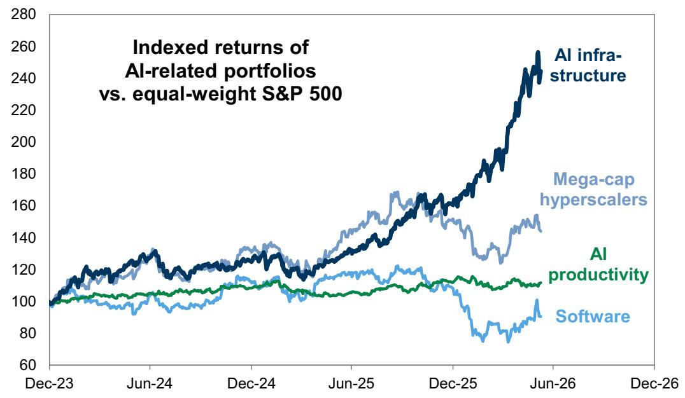

line chart

| Date    | AI infrastructure | Mega-cap hyperscalers | AI productivity | Software |
|---------|------------------|------------------------|-----------------|----------|
| Dec-23  | ~100             | ~100                   | ~100            | ~100     |
| Jun-24  | ~130             | ~125                   | ~105            | ~100     |
| Dec-24  | ~125             | ~135                   | ~110            | ~110     |
| Jun-25  | ~140             | ~150                   | ~115            | ~120     |
| Dec-25  | ~160             | ~140                   | ~115            | ~110     |
| Jun-26  | ~260             | ~150                   | ~115            | ~90      |
| Dec-26  | ~270             | ~155                   | ~115            | ~100     |

AI infrastructure = GSCBAIP2, Software = IGV, AI productivity = GSXUPROD  
Source: GS Global Investment Research

At the same time, the return dispersion within AI-exposed equities has reached a new high in Q2. Last week injected volatility to the AI trade, driven in part by disappointing AVGO earnings and headlines about hyperscaler equity issuance and amplified by investor positioning. The standard deviation of returns of a basket of AI-exposed equities has surged to 53 pp in Q2, marking the widest dispersion of returns since the launch of ChatGPT. That return dispersion has generally been created by varying degrees of positive returns within the infrastructure phase in contrast with positive and negative returns within the application complex.

Exhibit 2: Return dispersion of AI-exposed equities standard deviation of returns of GSTMTAIP basket constituents  
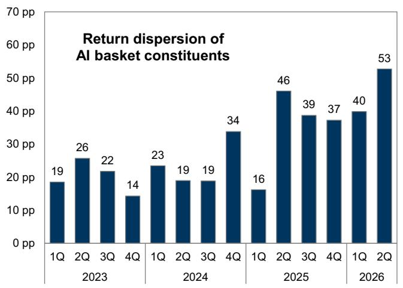

bar chart

| Quarter | Return dispersion (pp) |
| ------- | ---------------------- |
| 1Q 2023 | 19                     |
| 2Q 2023 | 26                     |
| 3Q 2023 | 22                     |
| 4Q 2023 | 14                     |
| 1Q 2024 | 23                     |
| 2Q 2024 | 19                     |
| 3Q 2024 | 19                     |
| 4Q 2024 | 34                     |
| 1Q 2025 | 16                     |
| 2Q 2025 | 46                     |
| 3Q 2025 | 39                     |
| 4Q 2025 | 37                     |
| 1Q 2026 | 40                     |
| 2Q 2026 | 53                     |

Source: FactSet, GS Global Investment Research

Exhibit 3: Distribution of AI-exposed equities' YTD returns  
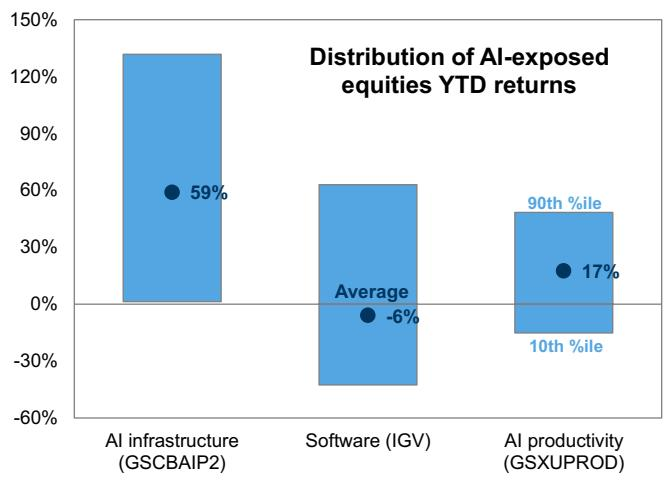

bar chart

| Category | Value |
| -------- | ----- |
| AI infrastructure (GSCBAIP2) | 59% |
| Software (IGV) | -6% |
| AI productivity (GSXUPROD) | 17% |

Source: FactSet, GS Global Investment Research

The latest leg of the infrastructure complex has primarily been driven by another wave of hyperscaler capex upgrades. Consensus 2026 estimates for hyperscaler capex have increased by \$200 billion since the start of the year. Analysts now expect the group to spend \$757 billion on capex in 2026, representing year/year growth of 84%.

Exhibit 4: Consensus expects the hyperscalers will spend \$757 billion in 2026 and \$920 billion in 2027  
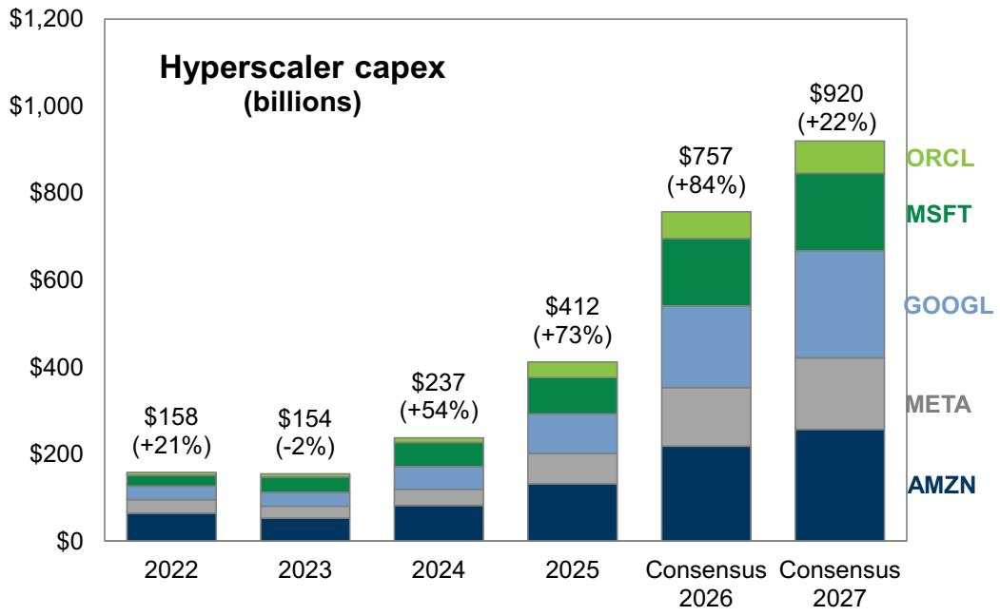

stacked bar chart

| Year       | AMZN  | META  | GOOGL | MSFT  | ORCL  | Total |
| ---------- | ----- | ----- | ----- | ----- | ----- | ----- |
| 2022       | $158  | $154  | $158  | $154  | $158  | $158  |
| 2023       | $154  | $154  | $158  | $154  | $158  | $158  |
| 2024       | $237  | $237  | $237  | $237  | $237  | $237  |
| 2025       | $412  | $412  | $412  | $412  | $412  | $412  |
| Consensus 2026 | $757  | $757  | $757  | $757  | $757  | $757  |
| Consensus 2027 | $920  | $920  | $920  | $920  | $920  | $920  |

Source: FactSet, GS Global Investment Research

The hyperscalers are on track to allocate all of their cash flows from operations to capex this year. Alongside strong capex spending, the group has sharply reduced share repurchases.

Exhibit 5: Hyperscalers expected to allocate 100% of cash flows from operations to capex  
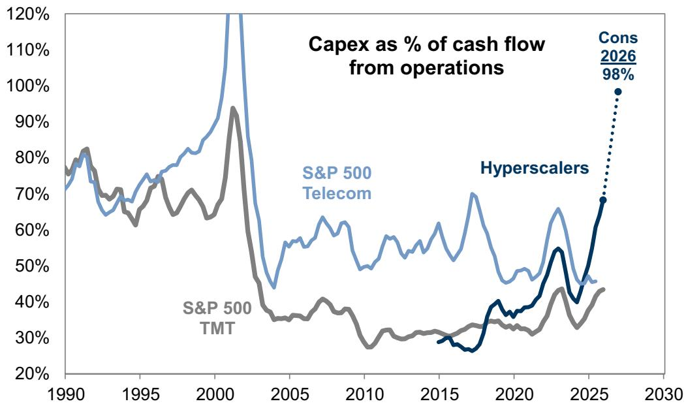

line chart

| Year | S&P 500 Telecom | S&P 500 TMT | Hyperscalers |
|------|-----------------|-------------|--------------|
| 2026 | 98%             | -           | -            |

Source: Compustat, FactSet, GS Global Investment Research

## We believe consensus 2027 capex estimates are once again too conservative.

Consensus estimates imply hyperscaler capex will equal \$920 billion in 2027, representing a sharp deceleration in growth from 84% to 22%. Analyst estimates have been too conservative during each of the past three years by an average of 45 pp.

Exhibit 6: Consensus hyperscaler capex estimates versus realized capex  
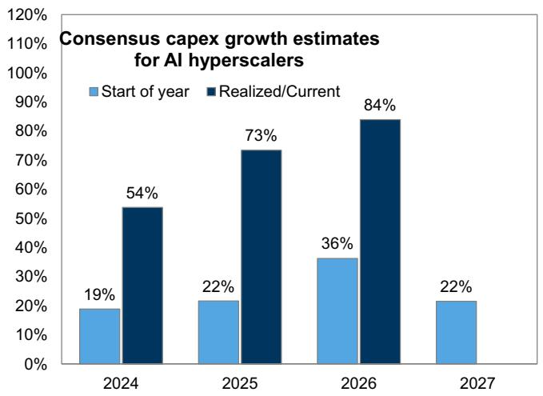

bar chart

Consensus capex growth estimates for AI hyperscalers
| Year | Start of year (%) | Realized/Current (%) |
| :--- | :--- | :--- |
| 2024 | 19 | 54 |
| 2025 | 22 | 73 |
| 2026 | 36 | 84 |
| 2027 | 22 | - |

Source: FactSet, GS Global Investment Research

Exhibit 7: Recent consensus hyperscaler capex estimate revisions  
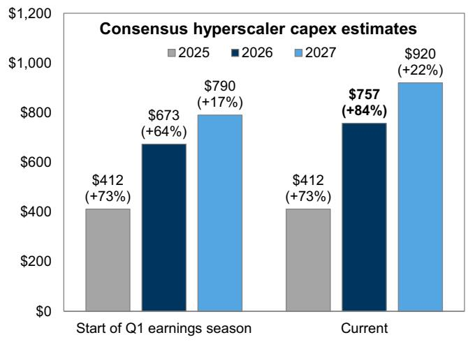

bar chart

Consensus hyperscaler capex estimates
| Period | Year | Capex ($) | Growth (%) |
| :--- | :--- | :--- | :--- |
| Start of Q1 earnings season | 2025 | 412 | +73 |
| Start of Q1 earnings season | 2026 | 673 | +64 |
| Start of Q1 earnings season | 2027 | 790 | +17 |
| Current | 2025 | 412 | +73 |
| Current | 2026 | 757 | +84 |
| Current | 2027 | 920 | +22 |

Source: FactSet, GS Global Investment Research

The latest earnings season and recent corporate issuance point to upside risk to consensus capex estimates in 2027. The larger-than-expected revenue backlog for the group highlights the persistent imbalance between AI supply and demand. Google Cloud and Amazon's AWS combined backlog equaled \$832 billion as of Q1 compared with \$358 billion six months ago. Our equity analysts do not expect a supply/demand balance will be reached until 2H 2027 at the earliest. GOOGL stated it expects to “significantly

increase” 2027 capex compared to 2026 and recently raised \$86 billion in equity, in part to fund AI spending. There are press reports that META is also considering raising equity.

Exhibit 8: AI hyperscaler 2027 capex scenarios  
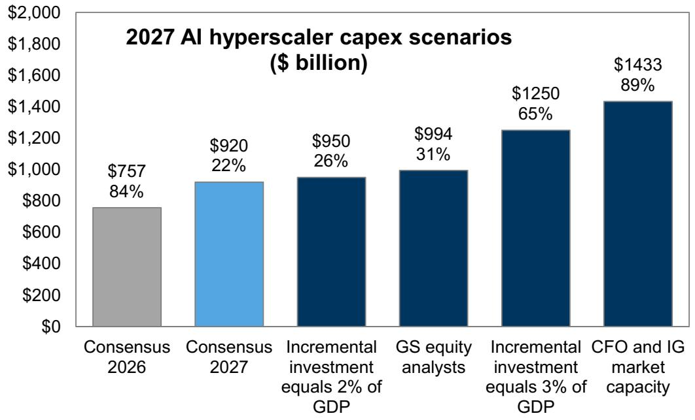

bar chart

2027 AI hyperscaler capex scenarios ($ billion)
| Scenario | Capex ($ billion) | Percentage (%) |
| :--- | :--- | :--- |
| Consensus 2026 | 757 | 84 |
| Consensus 2027 | 920 | 22 |
| Incremental investment equals 2% of GDP | 950 | 26 |
| GS equity analysts | 994 | 31 |
| Incremental investment equals 3% of GDP | 1250 | 65 |
| CFO and IG market capacity | 1433 | 89 |

Source: GS Global Investment Research

Our equity analysts believe that token consumption will increase by 24x through 2030, led by enterprise agents. The hyperscalers have messaged that their capex spending plans are driven by strong demand signals. Hyperscaler capex will depend on token demand, energy intensity, and input costs. Higher input costs also puts upward pressure on the nominal dollars of capex required to support a given amount of token consumption.

Historical technology cycles provide precedent for more than \$1 trillion in capex in 2027. Incremental AI spending equated to 0.9% of GDP in 2025 and is estimated to reach 1.5% of GDP in 2026. This impulse is similar to the peak impulse during the 1990s, but below the peak of 2-3% during the railroads and electric motor build-outs. We estimate that 2027 hyperscaler capex would equal \$950 billion if the incremental investment impulse reaches 2% of GDP and \$1,250 billion if it reaches 3% of GDP.

Exhibit 9: GS equity analysts forecast a 24x increase in token consumption by 2030  
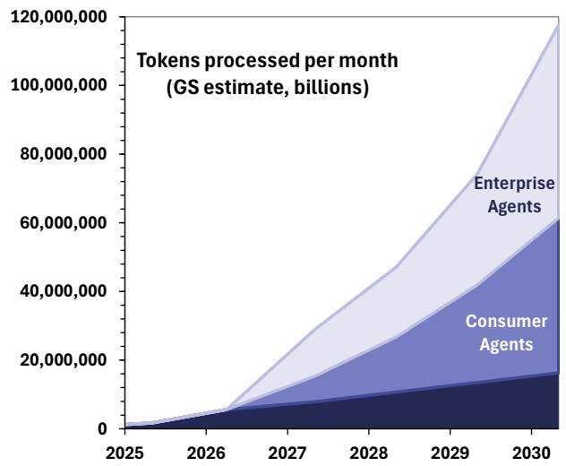

area chart

| Year | Enterprise Agents | Consumer Agents |
| ---- | ----------------- | --------------- |
| 2025 | ~0                | ~0              |
| 2026 | ~0                | ~0              |
| 2027 | ~10,000,000       | ~5,000,000      |
| 2028 | ~25,000,000       | ~10,000,000     |
| 2029 | ~45,000,000       | ~15,000,000     |
| 2030 | ~75,000,000       | ~25,000,000     |

Source: GS Global Investment Research

Exhibit 10: Incremental investment in emerging technologies as a share of GDP  
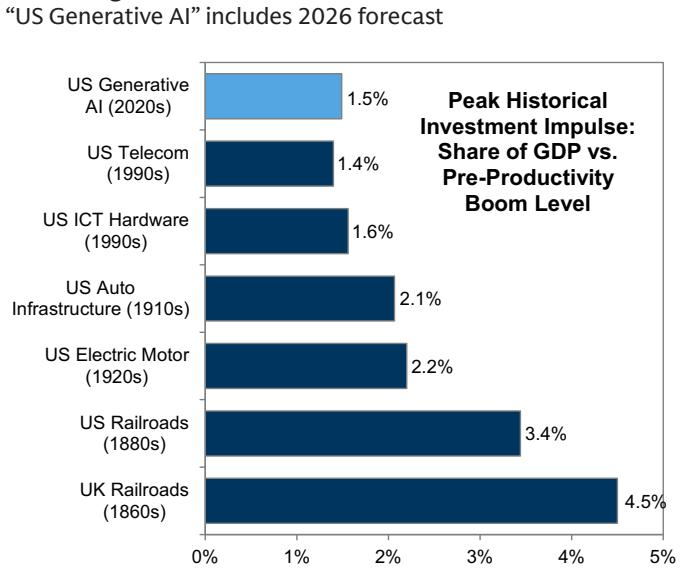

bar chart

"US Generative AI" includes 2026 forecast
| Sector | Share of GDP (%) |
| :--- | :--- |
| US Generative AI (2020s) | 1.5 |
| US Telecom (1990s) | 1.4 |
| US ICT Hardware (1990s) | 1.6 |
| US Auto Infrastructure (1910s) | 2.1 |
| US Electric Motor (1920s) | 2.2 |
| US Railroads (1880s) | 3.4 |
| UK Railroads (1860s) | 4.5 |

Source: GS Global Investment Research

Availability of capital is unlikely to prevent another year of strong capex growth in 2027. Since the start of 2025, hyperscaler net debt has increased by \$170 billion, but their collective net debt to EBITDA remains extremely low at 0.4x. The hyperscalers could increase their net debt by up to \$950 billion and still carry a net leverage ratio below 1x, consistent with the upper end of the range of companies with AA ratings or better. However, our credit strategists estimate the near-term USD investment grade (IG) market capacity is likely smaller than that, based on the current composition of single-issuer weightings and potential market saturation constraints, though the extent of how “binding” these will be is still a subject of investor debate. Using the USD IG index-eligible debt weightings of money center banks as a guide, they estimate an incremental \$450 billion of issuance for the four largest hyperscalers before reaching the sizing of the index’s current largest issuers. As a result, our credit strategy team expects other syndicated debt financing markets, such as ex-USD corporate bond issuance and new JV “project finance style” structures to play a larger role in the years ahead. They also see significant scope for the private infrastructure market to fill some of the financing need. The hyperscalers could also tap into existing cash balances or use alternative financing sources, such as equity issuance.

Physical capacity could limit hyperscaler capex surprises. There are numerous delayed data center projects in the pipeline and memory, power, and labor have been flagged as constraints to the capex build-out. We believe the recent rise in interest rates could make debt financing more expensive but is unlikely to meaningfully derail large AI hyperscaler capex spending. The AI hyperscalers appear to be taking a long-term approach to their capex spending plans and the strong balance sheets of large AI hyperscalers means that their cost of financing remains historically low even after the backup in yields. The increase in interest rates could pose more of a headwind to the smaller AI hyperscalers that carry more leverage.

Exhibit 11: Hyperscaler net debt to EBITDA has risen but is close to zero  
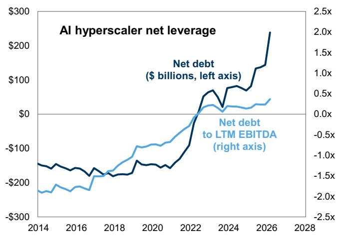

line chart

| Year | Net debt ($ billions, left axis) | Net debt to LTM EBITDA (right axis) |
|------|----------------------------------|-------------------------------------|
| 2014 | -150                             | -2.0                                |
| 2016 | -180                             | -1.5                                |
| 2018 | -170                             | -1.0                                |
| 2020 | -160                             | -0.5                                |
| 2022 | -50                              | 0.0                                 |
| 2024 | 50                               | 0.5                                 |
| 2026 | 250                              | 1.0                                 |
| 2028 | 300                              | 1.5                                 |

Source: Compustat, GS Global Investment Research

Exhibit 12: Sizing potential IG market issuance capacity  
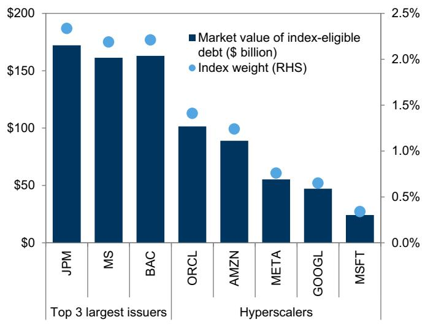

bar-line hybrid chart

| Issuers | Market value of index-eligible debt ($ billion) | Index weight (RHS) |
| :--- | :--- | :--- |
| JPM | 175 | 2.4 |
| MS | 165 | 2.2 |
| BAC | 165 | 2.2 |
| ORCL | 105 | 1.3 |
| AMZN | 90 | 1.2 |
| META | 58 | 0.7 |
| GOOGL | 48 | 0.6 |
| MSFT | 25 | 0.4 |

Source: GS Global Investment Research

Upside to AI capex should drive further upside to earnings and share prices of AI infrastructure stocks in the near term. Most of the rally in the beneficiaries of AI infrastructure spending during the past few years has been driven by earnings.

However, rapid price appreciation, elevated valuations, and crowded positioning in some slices of the infrastructure complex increase the risk of volatility. The rally in some AI infrastructure stocks has accelerated in recent weeks, outpacing consensus earnings estimates and delivering risk-adjusted returns unlikely to be sustained. One of the most consistent signals from similar narrow breadth markets in the past is Momentum factor volatility. Our TMT Trading Desk highlighted the use of leverage and options in recent weeks, which could amplify these reversals, as has been apparent in recent days.

Exhibit 13: Rapid price appreciation with low volatility in many pockets of AI infrastructure  
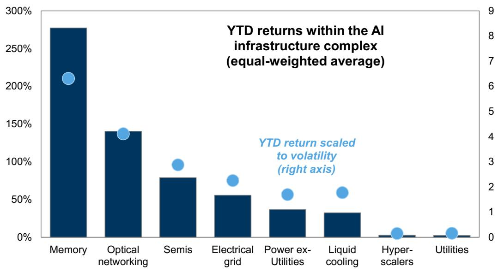

bar chart

| Category           | Value  |
| ------------------ | ------ |
| Memory             | 275%   |
| Optical networking | 140%   |
| Semis              | 80%    |
| Electrical grid    | 55%    |
| Power ex-Utilities  | 35%    |
| Liquid cooling     | 30%    |
| Hyper-scalers      | 5%     |
| Utilities          | 5%     |

Memory = Micron, Sandisk, SK hynix, Samsung, Optical networking = GSXUOPTI, Semis = GSCBSMHX, Electrical grid = GSXUGRID, Power ex-Utilities = GSENEPOW excluding GICS Utilities, Liquid cooling = GSXUCOOL, Hyperscalers = AMZN, GOOGL, META, MSFT, ORCL, Utilities = GICS Utilities in GSENEPOW.

Source: FactSet, GS Global Investment Research

The valuations of many pockets of the AI infrastructure complex have recently expanded. On a dollar-weighted basis, AI infrastructure stock valuations have not expanded. However, the forward P/E of the median stock in the GS TMT Data Center basket has broken out of its range during the past two years (Exhibit 14). For the median stock year to date, returns within every segment of AI infrastructure have outpaced positive earnings revisions except the hyperscalers and memory stocks.

Exhibit 14: P/E of the median AI infrastructure stock had been range-bound until recently  
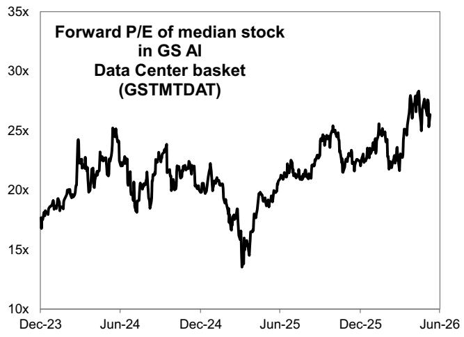

line chart

| Date    | Forward P/E |
|---------|-------------|
| Dec-23  | ~17x        |
| Jun-24  | ~25x        |
| Dec-24  | ~14x        |
| Jun-25  | ~20x        |
| Dec-25  | ~25x        |
| Jun-26  | ~28x        |

GSTMTDAT developed by GBM.  
Source: FactSet, GS Global Investment Research

Exhibit 15: YTD change in earnings vs. price among AI infrastructure complex  
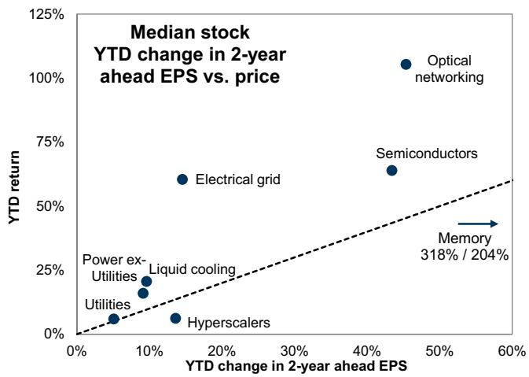

scatterplot

Median stock YTD change in 2-year ahead EPS vs. price
| Sector | YTD change in 2-year ahead EPS (%) | YTD return (%) |
| :--- | :--- | :--- |
| Power ex- Utilities | 10 | 20 |
| Utilities | 5 | 5 |
| Hyperscalers | 13 | 7 |
| Electrical grid | 14 | 60 |
| Semiconductors | 44 | 65 |
| Optical networking | 46 | 105 |
| Memory | 58 | 318 / 204 |

Memory = Micron, Sandisk, SK hynix, Samsung, Optical networking = GSXUOPTI, Semis = GSCBSMHX, Electrical grid = GSXUGRID, Power ex-Utilities = GSENEPOW excluding GICS Utilities, Liquid cooling = GSXUCOOL, Hyperscalers = AMZN, GOOGL, META, MSFT, ORCL, Utilities = GICS Utilities in GSENEPOW.  
Source: FactSet, GS Global Investment Research

Exhibit 16: Semiconductors returns outpaced earnings starting in late April  
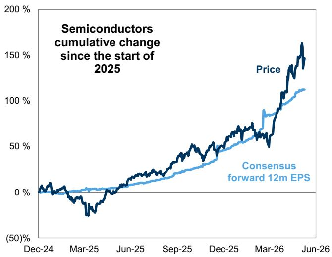

line chart

| Date    | Price | Consensus forward 12m EPS |
|---------|-------|--------------------------|
| Jun-26  | ~170% | ~110%                    |

Represents constituents and weights of the SMH ETF.

Exhibit 17: Hyperscaler earnings have recently outpaced share price returns  
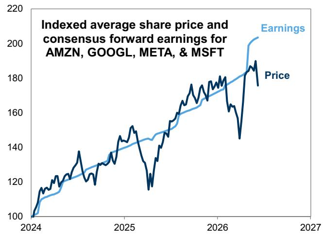

line chart

| Year | Earnings | Price |
|------|----------|-------|
| 2024 | 100      | 100   |
| 2025 | 140      | 130   |
| 2026 | 180      | 170   |
| 2027 | 200      | 190   |

Source: FactSet, GS Global Investment Research  
Source: FactSet, GS Global Investment Research

Investor expectations that recent earnings strength will persist appear most conservative within Memory and the hyperscalers. We compare the change in market cap and forward earnings of various AI infrastructure baskets since 2023 as a proxy for how long the market expects those earnings to persist. That ratio is most extreme among optical networking stocks. The incremental market cap among Semiconductors, where most of the value in the chain has accrued thus far, is 14x the change in forward earnings. In contrast, expectations are more conservative among the hyperscalers, which should be less sensitive to an eventual tapering in capex spending. Incremental

market cap vs. earnings is lowest within Memory, but there is ongoing debate about whether the industry will revert to its historically cyclical properties.

Exhibit 18: Change in market cap vs. earnings across AI infrastructure complex

<table><tr><td rowspan="2">Infrastructure bucket</td><td colspan="3">2y fwd EV/EBITDA</td><td colspan="3">P/E to EPS growth</td><td colspan="2">Change since 2023 (bn)</td><td rowspan="2">Incremental market cap / EBITDA</td></tr><tr><td>Current</td><td>5y median</td><td>% prem to 5y median</td><td>2y fwd P/E</td><td>3y fwd EPS growth</td><td>PEG ratio</td><td>Market cap</td><td>2y fwd EBITDA</td></tr><tr><td>Memory</td><td>5</td><td>4</td><td>12</td><td>7</td><td>4</td><td>0.8</td><td>2,813</td><td>647</td><td>4</td></tr><tr><td>Utilities</td><td>11</td><td>10</td><td>(2)</td><td>17</td><td>10</td><td>1.8</td><td>246</td><td>44</td><td>6</td></tr><tr><td>Hyperscalers</td><td>11</td><td>12</td><td>(19)</td><td>19</td><td>18</td><td>1.0</td><td>7,879</td><td>699</td><td>11</td></tr><tr><td>Semiconductors</td><td>23</td><td>16</td><td>27</td><td>27</td><td>20</td><td>1.3</td><td>11,725</td><td>812</td><td>14</td></tr><tr><td>Liquid cooling</td><td>13</td><td>12</td><td>13</td><td>21</td><td>14</td><td>1.5</td><td>537</td><td>23</td><td>23</td></tr><tr><td>Power ex-Utilities</td><td>17</td><td>12</td><td>44</td><td>28</td><td>20</td><td>1.2</td><td>585</td><td>24</td><td>24</td></tr><tr><td>Electrical grid</td><td>17</td><td>10</td><td>62</td><td>28</td><td>20</td><td>1.4</td><td>682</td><td>25</td><td>27</td></tr><tr><td>Optical networking</td><td>22</td><td>10</td><td>105</td><td>28</td><td>23</td><td>1.1</td><td>1,309</td><td>32</td><td>41</td></tr></table>

Memory = Micron, Sandisk, SK hynix, Samsung, Optical networking = GSXUOPTI, Semis = GSCBSMHX, Electrical grid = GSXUGRID, Power ex-Utilities = GSENEPOW excluding GICS Utilities, Liquid cooling = GSXUCOOL, Hyperscalers = AMZN, GOOGL, META, MSFT, ORCL, Utilities = GICS Utilities in GSENEPOW.  
Source: FactSet, GS Global Investment Research

While we believe the trajectory of AI infrastructure stocks is higher, both the micro and the macro pose risks to that view. From a macro perspective, a resolution of the US-Iran war is the clearest near-term catalyst. We expect this would lead to a tactical broadening in the equity market, especially among oil-sensitive industries such as Consumer Discretionary. However, our baseline macro forecasts assume that growth will be close to trend and the Fed will be on hold through year-end, ultimately paving the way for AI to regain leadership. We expect a more severe economic downturn would weigh on equities broadly, including AI-exposed stocks.

From a micro perspective, enterprise adoption and the persistence of bottlenecks represent the clearest risks. The willingness of the hyperscalers to spend and investors to reward increased capex has been largely predicated on strong demand signals. This dynamic would change if that demand weakens, for instance because the estimated productivity gains do not justify the cost of tokens. Weakening demand would threaten the entire AI complex, but especially companies in the infrastructure layer, where most of the value has accrued thus far. AI infrastructure stocks with strong pricing power due to bottlenecks, such as memory or power, are also at risk of easing bottlenecks or improving efficiency.

Strengthening evidence of AI monetization should support the AI hyperscalers, but equity issuance poses a risk. Earlier this year, we laid three out catalysts that would help hyperscalers regain market leadership: (1) An acceleration in AI-related revenues; (2) Decelerating capex growth; (3) A shift in the macroeconomic backdrop from accelerating growth to decelerating growth. While capex growth has not slowed yet, Q1 earnings season showed further reacceleration in cloud revenues and sizable backlogs. In addition, the profitability of those cloud workloads far exceeded consensus expectations. However, growing interest in equity issuance among the group suggests investors will remain focused on return on investment, given the dilutive impact and limited signs of a deceleration in capex growth. From a macro perspective, both our economists and investors have lowered their growth expectations following the US-Iran war, which has weakened the case for a broadening within the equity market.

Exhibit 19: Cloud business revenues and margins

<table><tr><td rowspan="4"></td><td colspan="4">Cloud business</td></tr><tr><td colspan="3">Revenues</td><td rowspan="3">Q1 2026 Operating profit margin</td></tr><tr><td rowspan="2">LTM $ billion</td><td colspan="2">Growth (year/year)</td></tr><tr><td>Q1 2025</td><td>Q1 2026</td></tr><tr><td>Microsoft Azure</td><td>97</td><td>33%</td><td>40%</td><td>NA</td></tr><tr><td>Amazon Web Services</td><td>137</td><td>17</td><td>28</td><td>38%</td></tr><tr><td>Google Cloud</td><td>66</td><td>28</td><td>63</td><td>33</td></tr></table>

Source: GS Global Investment Research

Exhibit 20: Cloud companies' revenue expectations have been improving  
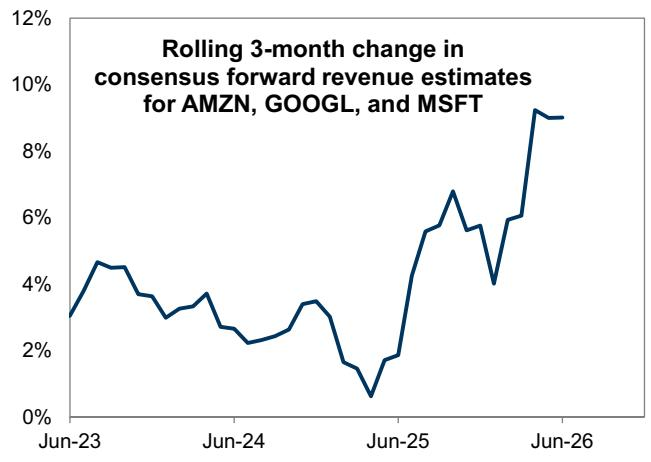

line chart

| Date   | Rolling 3-month Change |
|--------|------------------------|
| Jun-23 | ~3%                    |
| Jun-24 | ~2%                    |
| Jun-25 | ~1%                    |
| Jun-26 | ~9%                    |

Source: FactSet, GS Global Investment Research

Progress on AI application roll-out has benefited a handful of software companies but also increased perceived disruption risk from AI. For much of the past few months, investors appeared to believe that private AI companies would be more effective than public companies in capturing AI-related revenues. A group of public software companies saw valuations contract from 36x in late 2025 to 21x in March. In contrast, the largest private frontier AI labs have announced sharp increases in annualized revenue run rates and, in turn, private market valuations. However, software stocks have rebounded in recent weeks and their P/E currently stands at 25x.

We continue to expect AI disruption uncertainty will persist and drive wide return dispersion. The threat of disruption will likely represent a persistent overhang until the later stages of AI adoption, which could take years. As we previously discussed, this phase of the AI technology cycle is likely to lead to “winners” and “losers”, in contrast with the infrastructure phase.

Exhibit 21: Public software companies remain well below their valuations from late 2025
Software = IGV  
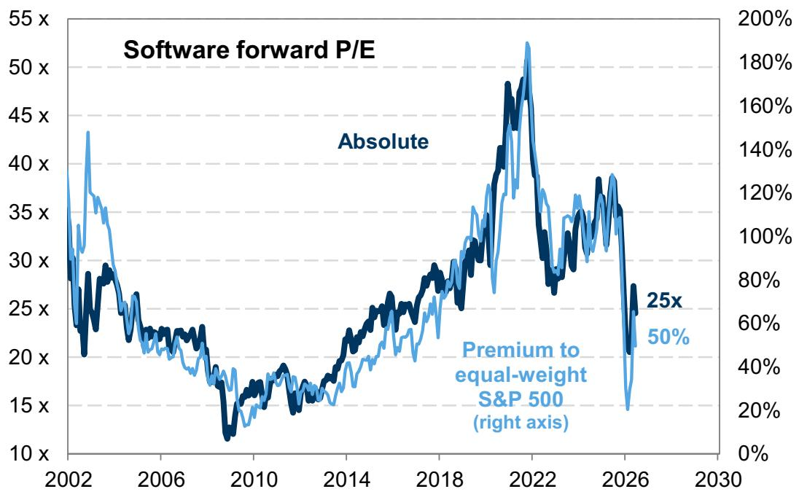

line chart

| Year | Absolute (x) | Premium to equal-weight S&P 500 (%) |
|------|--------------|-------------------------------------|
| 2026 | 25x          | 50%                                 |

Source: FactSet, GS Global Investment Research

That dispersion has been apparent during the recent Software rebound. Some software companies demonstrated strong and accelerating revenue growth that was enabled by AI during the latest Q1 earnings season. Within a group of software stocks, investors have been rewarding data infrastructure stocks but avoiding industry-specific software and services stocks. Our equity analysts highlight signs of green shoots at incumbent application software vendors, but more consistent AI-driven outperformance will take at least another couple quarters.

Exhibit 22: Wide dispersion in Software returns YTD  
based on RBICS classifications within IGV, excludes industries with only two stocks  
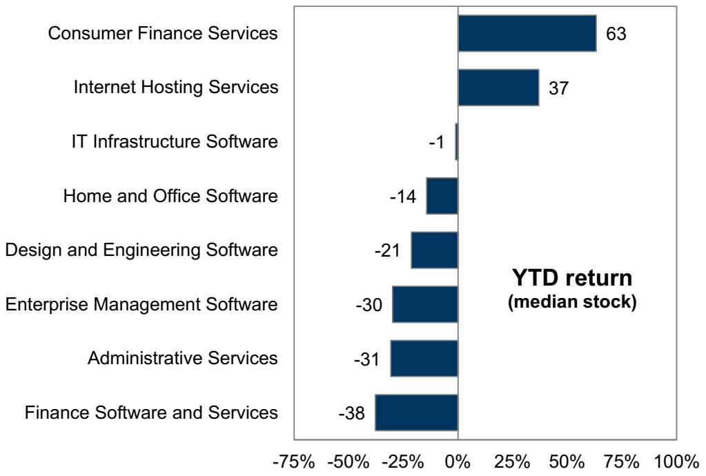

bar chart

| Category | YTD return (median stock) |
| :--- | :--- |
| Consumer Finance Services | 63 |
| Internet Hosting Services | 37 |
| IT Infrastructure Software | -1 |
| Home and Office Software | -14 |
| Design and Engineering Software | -21 |
| Enterprise Management Software | -30 |
| Administrative Services | -31 |
| Finance Software and Services | -38 |

Source: FactSet, GS Global Investment Research

The risk from AI disruption has intensified debate about the “terminal value” of equities, as low-cost competition potentially places downward pressure on incumbent revenue growth and profit margins. Based on a 10-year dividend discount model, we estimate that the terminal value of the S&P 500 represents roughly 75% of its equity value today, near the highest level in 25 years.

Exhibit 23: Estimated share of S&P 500 value in the “terminal value”  
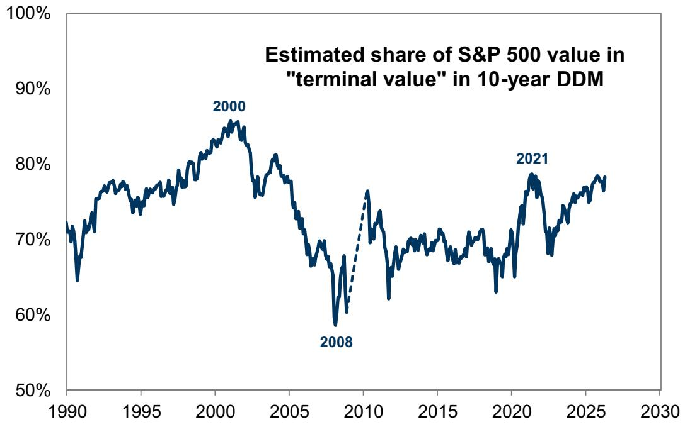

line chart

| Year | Estimated Share of S&P 500 value in "terminal value" |
| ---- | ---------------------------------------------------- |
| 2000 | 85%                                                  |
| 2008 | 60%                                                  |
| 2021 | 78%                                                  |

Source: GS Global Investment Research

For industries perceived to be most at risk from disruption, such as Software, their value is especially sensitive changes in its long-term outlook. Based on an illustrative discounted cash flow model for large-cap Software, we estimated that 85% of its value was in the terminal value of Software at the start of the year. This DCF demonstrates that only modest changes to the long-term growth and margin assumptions would be consistent with the decline in Software valuations and price experienced YTD.

Exhibit 24: Growth vs. margins by sector

sales growth = 30-year average, net profit margin = 5-year average

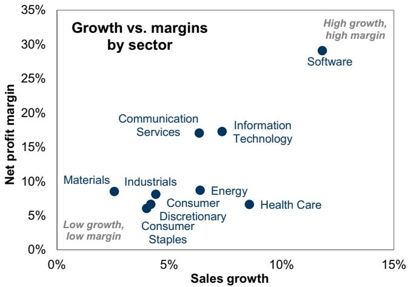

scatter plot

| Sector | Sales growth | Net profit margin |
| --- | --- | --- |
| Software | ~12% | ~29% |
| Information Technology | ~7% | ~17% |
| Communication Services | ~6% | ~17% |
| Energy | ~6% | ~9% |
| Health Care | ~8% | ~6% |
| Industrials | ~4% | ~8% |
| Materials | ~2% | ~8% |
| Consumer Staples | ~4% | ~6% |
| Discretionary | ~4% | ~6% |
| Consumer | ~4% | ~6% |

Source: GS Global Investment Research  
Exhibit 25: Sensitivity of Software to DCF assumptions  
illustrative DCF assuming no change in other variables

Implied Software P/E in late 2025

<table><tr><td rowspan="2" colspan="2"></td><td colspan="4">Terminal growth rate</td></tr><tr><td>6%</td><td>7%</td><td>8%</td><td>9%</td></tr><tr><td rowspan="4">Terminal net margin</td><td>10%</td><td>14 x</td><td>16 x</td><td>19 x</td><td>25 x</td></tr><tr><td>15%</td><td>17 x</td><td>20 x</td><td>24 x</td><td>32 x</td></tr><tr><td>20%</td><td>20 x</td><td>23 x</td><td>29 x</td><td>39 x</td></tr><tr><td>25%</td><td>22 x</td><td>27 x</td><td>33 x</td><td>46 x</td></tr></table>

Source: GS Global Investment Research

We remain in the early stages of enterprise AI adoption that we expect will eventually lead to widespread productivity gains. According to the Census Bureau's Business Trends and Outlook Survey, AI adoption by firms equaled $19.5\%$ among US establishments with adoption expected to rise to 22.7% in the next 6 months. Based on the survey, sales and marketing, strategy and business development, and R&D are the most common AI use cases among adopters today. In addition, most firms are using AI to supplement a small number of employee work tasks and AI adoption has had a minimal impact on total business employment in most sectors.

Corporate commentary during Q1 earnings season painted a similar picture to economy-wide surveys. Roughly 54% of companies discussed AI in the context of productivity on their earnings call. However, just 11% of companies quantified the AI productivity gains on a specific use case and only 2% of companies quantified the impact of AI productivity on earnings (see list of companies and quotes below). These shares slightly increased relative to Q4 2025 but demonstrate the gradual adoption process within enterprises. The most frequent use cases remained coding and engineering, call centers and customer support, and marketing, but the largest increase was in human resources and expense management.

Exhibit 26: Company commentary on AI productivity during earnings season  
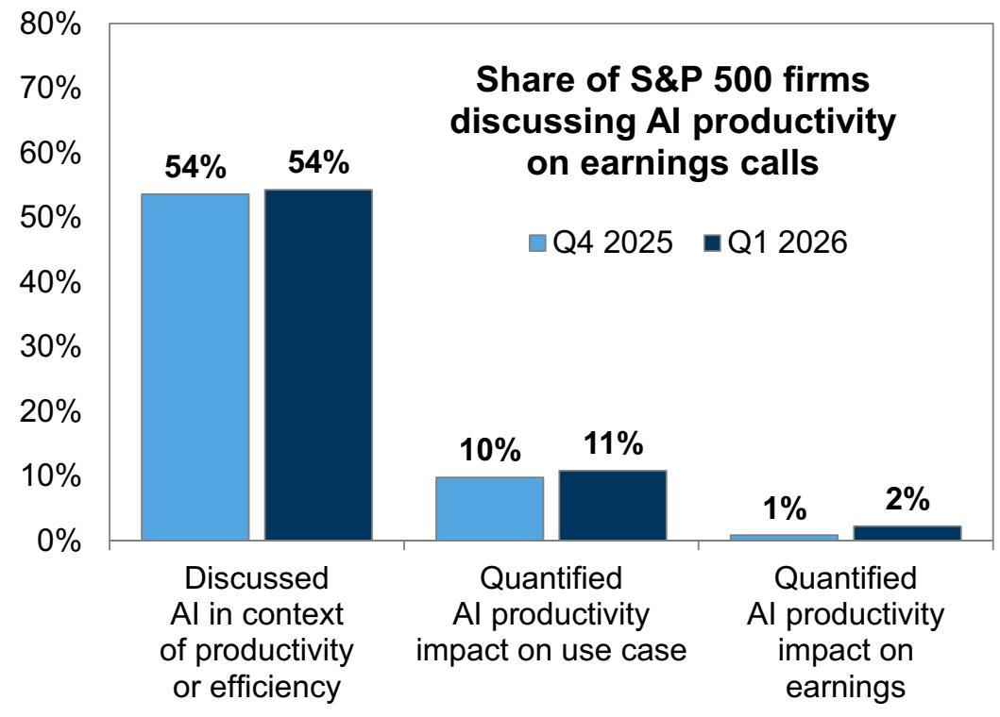

bar chart

Share of S&P 500 firms discussing AI productivity on earnings calls
| Category | Q4 2025 (%) | Q1 2026 (%) |
| :--- | :--- | :--- |
| Discussed AI in context of productivity or efficiency | 54 | 54 |
| Quantified AI productivity impact on use case | 10 | 11 |
| Quantified AI productivity impact on earnings | 1 | 2 |

Source: GS Global Investment Research

Neither margin profiles nor share price performance were meaningfully different between companies that did versus did not discuss AI. While many factors will drive variation in company fundamentals, consensus net margin growth forecasts during the next four quarters were roughly similar between companies that did versus did not discuss AI on recent earnings calls. Similarly, companies that discussed AI did not consistently outperform following earnings results, consistent with basket performance that investors are not pricing AI-related productivity gains yet.

Importantly, several companies have also flagged the token cost associated with AI. Demand for AI tools is associated with up front costs that could limit the potential

earnings uplift from increased productivity. Several companies flagged the cost associated with token usage in recent earnings calls and press releases (e.g., EXPE, UBER, CHRW).

Exhibit 27: Net margin forecasts and share price reaction of companies discussing AI  
excludes Financials, Utilities, and Real Estate

<table><tr><td rowspan="2"></td><td colspan="2">Discussed AI in context of productivity</td><td colspan="2">Quantified AI productivity impact on use case</td><td colspan="2">Quantified AI productivity impact on earnings</td></tr><tr><td>Yes</td><td>No</td><td>Yes</td><td>No</td><td>Yes</td><td>No</td></tr><tr><td>Consensus forward 4Q net margin growth</td><td>0.4 pp</td><td>0.5 pp</td><td>0.6 pp</td><td>0.4 pp</td><td>0.4 pp</td><td>0.4 pp</td></tr><tr><td>Excess 1-day return post-EPS report</td><td>12 bp</td><td>(20)bp</td><td>(29)bp</td><td>12 bp</td><td>(230)bp</td><td>0 bp</td></tr></table>

Source: FactSet, GS Global Investment Research

We highlight quotes from the 11 companies that quantified the impact of AI-related productivity on earnings. The majority of companies focused on cost savings and efficiencies related to AI productivity, rather than increased output.

Workday (WDAY, May 21): And on top of that, we’re recognizing the benefits on AI ourselves. So, within Gerrit’s team in R&D, we’re seeing tremendous productivity improvements. Whether it’s our customer success business, we’re seeing productivity improvements there. A lot of Rob’s team on go-to-market as well. And we’re using our own products, as you would expect us to. So, very pleased with the progress we’re seeing. Enabled us to move up the guide 50 bps over the course of the year, and we look forward to continuing to increase our margins over time.  
■ Republic Services (RSG, May 7): Activation of digital tools in our call centers are enhancing the customer experience and unlocking value in our business by optimizing the 11 million inbound calls we receive each year. We believe that these investments in digital will deliver at least \$100 million of annual benefit by 2028.  
CDW (CDW, May 6): The AI-powered modernization investments we’ve been making under Geared for Growth are focused on transforming how we operate and particularly as it supports our long-term, durable, and scalable growth. The program is a disciplined multi-year effort to simplify and rewire our operating model, reducing complexity, modernizing quote to cash and supporting processes, and embedding AI to enable faster, better decisions across the enterprise. In addition to improving the end-to-end experience for our customers, partners, and co-workers, Geared for Growth investments are beginning to translate into real productivity improvements across our operations and will support our commitment to return to our targeted SG&A efficiency ratio and enable greater value creation. To that end, we have already identified substantial opportunities that will enhance our cost structure and will begin to accrue benefits in the second half of this year. As we look forward into 2027 and 2028, we would anticipate run rate improvements in the range of \$100 million to \$200 million. These savings will be balanced with some reinvestment back into the business to fuel our broader growth strategy. We will provide you with further updates on the timing of these efforts and the financial impacts as we move forward.  
- Edison International (EIX, April 28): Through SCE’s internal innovation program,

and in only a handful of development hours, frontline teams developed an initial proof of concept of an AI-driven approach that continuously monitors for these situations and brings them to the surface earlier, with clearer and more actionable insights. Once implemented, we anticipate this approach could yield roughly \$25 million in potential unbilled revenue savings over a three to six-month period. It’s a good illustration of how smarter systems and disciplined execution translate directly into stronger financial controls and support long-term affordability.

Verizon (VZ, April 27): We have begun to embed AI and automation into our operations and customer interactions, which is already significantly improving customer experiences and lowering costs. We will encourage more volume into digital sales and service channels, which lowers costs, increases engagement, and leads to higher customer satisfaction. And we have begun to see meaningful cost benefits from our transformation efforts as we take out legacy structural costs from the business. Consequently, we are well on our way towards our OpEx savings target of \$5 billion in 2026... 85% of all of our issues right now are autonomously resolved. That means we are resolving issues before our customers even see them. We used to have in our network like a bill of material. It was over like 1 million different combinations. Think about the costs and the complexity around that. Using AI, we’ve driven that down now to about 20 kits. And so, our ability to deploy safe costs because of this is radically improved. We already have over \$200 million of energy savings as a result of deploying AI into the network and looking at how we can optimize on energy, and we are doing things now at industrial scale.

Nasdaq (NDAQ, April 23): So, as we mentioned in Investor Day, we do have an internal program to drive AI adoption within the operations of Nasdaq, and we say that's AI on the business. And we are focused in some key areas, and we have a program in place where we are striving to achieve \$100 million of expense efficiencies by the end of 2027. And we also did mention that, the majority of that will show up in 2027, because we also are making investments in AI to make sure that we can achieve those efficiencies... And then also we have other areas across our expert teams too. We have automation in finance, in marketing, legal, HR, all of those areas have benefits that are coming in from the GenAI capabilities that we see across the business.

International Business Machines (IBM, April 22): Several years ago, we set an ambitious objective to reinvent our enterprise operations for greater speed, lower friction, and structurally lower costs. Through disciplined execution, eliminating manual touch points, simplifying processes, and applying data automation and AI at scale, we have built a proven, repeatable, AI-enabled transformation engine that is accelerating. Since 2023, this has driven \$4.5 billion of productivity savings, with an additional \$1 billion expected in 2026.

■ ServiceNow (NOW, April 22): Turning to profitability. Non-GAAP operating margin was 32%, 50 basis points above our guidance driven by AI OpEx efficiencies.

\- Otis Worldwide (OTIS, April 22): One is the micro pricing that we started last year in Q4. And this is essentially thanks to our AI algorithm, thanks to a much more granular approach to pricing, we are able to adapt our price to customer perception, to customer SLAs, so we don't follow the same approach for all. And this is the \$50 million improvement sequentially that I mentioned before, one year versus the other, because this comes on top of the regular inflationary clauses we have in our contracts.

C.H. Robinson Worldwide (CHRW, April 29): Our average head count was down 12.3% year-over-year in Q1 and was down 3.1% sequentially, illustrating how we continue to decouple head count growth from volume growth and optimize our organizational structure. We continue to expect that our 2026 personnel expenses will be in the range of \$1.25 billion to 1.35 billion. This includes an expectation that we will generate double-digit productivity improvements in both NAST and Global Forwarding in 2026, as we continue to implement agentic AI solutions across our quote-to-cash lifecycle of an order... And despite the significant increase to spot market cost in the truckload market, NAST expanded its operating margin, excluding restructuring costs by 310 basis points year-over-year. This is the Lean AI strategy at work and we reaffirm our 2026 operating income target that we raised in October of last year.

Ecolab (ECL, April 28): So as you said, really good productivity on SG&A in Q1, up 130 basis points. We are getting the benefit of what we're doing for One Ecolab program as we're launching digital and AI programs. As you noted, there is some shift, and I mentioned before, between gross margins and SG&A from M&A, primarily Ovivo. So in the first quarter, that accounted for 20 to 30 basis points, but still driving 100 basis points underlying, which is above our long-term target. We talked about leverage being 25 to 50 basis points. So on a full-year basis, I expect that SG&A leverage to be around 100 basis points, again, including some benefit from Ovivo because of the geography between gross margin and SG&A, but still the underlying is above our long-term 25 to 50 basis points target because of in part the faster sales growth, but also because of the great productivity we're driving.

## Disclosure Appendix

## Reg AC

We, Ryan Hammond, Ben Snider, Jenny Ma, Daniel Chavez, Kartik Jayachandran and Christophe Sung, hereby certify that all of the views expressed in this report accurately reflect our personal views, which have not been influenced by considerations of the firm's business or client relationships.

Unless otherwise stated, the individuals listed on the cover page of this report are analysts in GS' Global Investment Research division.

Contributing Authors: Ryan Hammond GS & Co. LLC, Ben Snider GS & Co. LLC, Jenny Ma GS & Co. LLC, Daniel Chavez GS & Co. LLC, Kartik Jayachandran GS & Co. LLC, Christophe Sung GS & Co. LLC.

Unless otherwise stated, the individuals listed in the Contributing Authors disclosure of this report are analysts in GS' Global Investment Research division.

## Disclosures

## Regulatory disclosures

## Disclosures required by United States laws and regulations

See company-specific regulatory disclosures above for any of the following disclosures required as to companies referred to in this report: manager or co-manager in a pending transaction; 1% or other ownership; compensation for certain services; types of client relationships; managed/co-managed public offerings in prior periods; directorships; for equity securities, market making and/or specialist role. GS trades or may trade as a principal in debt securities (or in related derivatives) of issuers discussed in this report.

The following are additional required disclosures: Ownership and material conflicts of interest: GS policy prohibits its analysts, professionals reporting to analysts and members of their households from owning securities of any company in the analyst's area of coverage. Analyst compensation: Analysts are paid in part based on the profitability of GS, which includes investment banking revenues. Analyst as officer or director: GS policy generally prohibits its analysts, persons reporting to analysts or members of their households from serving as an officer, director or advisor of any company in the analyst's area of coverage. Non-U.S. Analysts: Non-U.S. analysts may not be associated persons of GS & Co. LLC and therefore may not be subject to FINRA Rule 2241 or FINRA Rule 2242 restrictions on communications with a subject company, public appearances and trading in securities covered by the analysts.

## Additional disclosures required under the laws and regulations of jurisdictions other than the United States

The following disclosures are those required by the jurisdiction indicated, except to the extent already made above pursuant to United States laws and regulations. Australia: GS Australia Pty Ltd and its affiliates are not authorised deposit-taking institutions (as that term is defined in the Banking Act 1959 (Cth)) in Australia and do not provide banking services, nor carry on a banking business, in Australia. This research, and any access to it, is intended only for “wholesale clients” within the meaning of the Australian Corporations Act, unless otherwise agreed by GS. In producing research reports, members of Global Investment Research of GS Australia may attend site visits and other meetings hosted by the companies and other entities which are the subject of its research reports. In some instances the costs of such site visits or meetings may be met in part or in whole by the issuers concerned if GS Australia considers it is appropriate and reasonable in the specific circumstances relating to the site visit or meeting. To the extent that the contents of this document contains any financial product advice, it is general advice only and has been prepared by GS without taking into account a client’s objectives, financial situation or needs. A client should, before acting on any such advice, consider the appropriateness of the advice having regard to the client’s own objectives, financial situation and needs. A copy of certain GS Australia and New Zealand disclosure of interests and a copy of GS’ Australian Sell-Side Research Independence Policy Statement are available at: https://www.goldmansachs.com/disclosures/australia-new-zealand/index.html. Brazil: Disclosure information in relation to CVM Resolution n. 20 is available at https://www.gs.com/worldwide/brazil/area/gir/index.html. Where applicable, the Brazil-registered analyst primarily responsible for the content of this research report, as defined in Article 20 of CVM Resolution n. 20, is the first author named at the beginning of this report, unless indicated otherwise at the end of the text. Canada: This information is being provided to you for information purposes only and is not, and under no circumstances should be construed as, an advertisement, offering or solicitation by GS & Co. LLC for purchasers of securities in Canada to trade in any Canadian security. GS & Co. LLC is not registered as a dealer in any jurisdiction in Canada under applicable Canadian securities laws and generally is not permitted to trade in Canadian securities and may be prohibited from selling certain securities and products in certain jurisdictions in Canada. If you wish to trade in any Canadian securities or other products in Canada please contact GS Canada Inc., an affiliate of The GS Group Inc., or another registered Canadian dealer. Hong Kong: Further information on the securities of covered companies referred to in this research may be obtained on request from GS (Asia) L.L.C. India: Further information on the subject company or companies referred to in this research may be obtained from GS (India) Securities Private Limited, Research Analyst - SEBI Registration Number INH000001493, 10th Floor, Ascent-Worli, Sudam Kalu Ahire Marg, Worli, Mumbai-400 025, India, Corporate Identity Number U74140MH2006FTC160634, Phone +91 22 6616 9000, Fax +91 22 6616 9001. GS may beneficially own 1% or more of the securities (as such term is defined in clause 2 (h) the Indian Securities Contracts (Regulation) Act, 1956) of the subject company or companies referred to in this research report. Investment in securities market are subject to market risks. Read all the related documents carefully before investing. Registration granted by SEBI and certification from NISM in no way guarantee performance of the intermediary or provide any assurance of returns to investors. GS (India) Securities Private Limited compliance officer and investor grievance contact details can be found at: https://www.goldmansachs.com/worldwide/india/documents/Grievance-Redressal-and-Escalation-Matrix.pdf, and a copy of the annual audit compliance report can be found at this link: https://publishing.gs.com/content/site/india-annual-compliance-report.html. Japan: See below. Korea: This research, and any access to it, is intended only for “professional investors” within the meaning of the Financial Services and Capital Markets Act, unless otherwise agreed by GS. Further information on the subject company or companies referred to in this research may be obtained from GS (Asia) L.L.C., Seoul Branch. New Zealand: GS New Zealand Limited and its affiliates are neither “registered banks” nor “deposit takers” (as defined in the Reserve Bank of New Zealand Act 1989) in New Zealand. This research, and any access to it, is intended for “wholesale clients” (as defined in the Financial Advisers Act 2008) unless otherwise agreed by GS. A copy of certain GS Australia and New Zealand disclosure of interests is available at: https://www.goldmansachs.com/disclosures/australia-new-zealand/index.html. Russia: Research reports distributed in the Russian Federation are not advertising as defined in the Russian legislation, but are information and analysis not having product promotion as their main purpose and do not provide appraisal within the meaning of the Russian legislation on appraisal activity. Research reports do not constitute a personalized investment recommendation as defined in Russian laws and regulations, are not addressed to a specific client, and are prepared without analyzing the financial circumstances, investment profiles or risk profiles of clients. GS assumes no responsibility for any investment decisions that may be taken by a client or any other person based on this research report. Singapore: GS (Singapore) Pte. (Company Number: 198602165W), which is regulated by the Monetary Authority of Singapore, accepts legal responsibility for this research, and should be contacted with respect to any matters arising from, or in connection with, this research. Taiwan: This material is for reference only and must not be reprinted without permission. Investors should carefully consider their own investment risk. Investment results are the responsibility of the individual investor. United Kingdom: Persons who would be categorized as retail clients in the United Kingdom, as such term is

defined in the rules of the Financial Conduct Authority, should read this research in conjunction with prior GS on the covered companies referred to herein and should refer to the risk warnings that have been sent to them by GS International. A copy of these risks warnings, and a glossary of certain financial terms used in this report, are available from GS International on request.

European Union and United Kingdom: Disclosure information in relation to Article 6 (2) of the European Commission Delegated Regulation (EU) (2016/958) supplementing Regulation (EU) No 596/2014 of the European Parliament and of the Council (including as that Delegated Regulation is implemented into United Kingdom domestic law and regulation following the United Kingdom's departure from the European Union and the European Economic Area) with regard to regulatory technical standards for the technical arrangements for objective presentation of investment recommendations or other information recommending or suggesting an investment strategy and for disclosure of particular interests or indications of conflicts of interest is available at https://www.gs.com/disclosures/europeanpolicy.html which states the European Policy for Managing Conflicts of Interest in Connection with Investment Research.

Japan: GS Japan Co., Ltd. is a Financial Instrument Dealer registered with the Kanto Financial Bureau under registration number Kinsho 69, and a member of Japan Securities Dealers Association, Financial Futures Association of Japan Type II Financial Instruments Firms Association, and Investment Management Association of Japan. Sales and purchase of equities are subject to commission pre-determined with clients plus consumption tax. See company-specific disclosures as to any applicable disclosures required by Japanese stock exchanges, the Japanese Securities Dealers Association or the Japanese Securities Finance Company.

## Global product; distributing entities

GS Global Investment Research produces and distributes research products for clients of GS on a global basis. Analysts based in GS offices around the world produce research on industries and companies, and research on macroeconomics, currencies, commodities and portfolio strategy. This research is disseminated in Australia by GS Australia Pty Ltd (ABN 21 006 797 897); in Brazil by GS do Brasil Corretora de Títulos e Valores Mobiliários S.A.; Public Communication Channel GS Brazil: 0800 727 5764 and / or contatogoldmanbrasil@gs.com. Available Weekdays (except holidays), from 9am to 6pm. Canal de Comunicação com o Público GS Brasil: 0800 727 5764 e/ou contatogoldmanbrasil@gs.com. Horário de funcionamento: segunda-feira à sexta-feira (exceto feriados), das 9h às 18h; in Canada by GS & Co. LLC; in Hong Kong by GS (Asia) L.L.C.; in India by GS (India) Securities Private Ltd.; in Japan by GS Japan Co., Ltd.; in the Republic of Korea by GS (Asia) L.L.C., Seoul Branch; in New Zealand by GS New Zealand Limited; in Russia by OOO GS; in Singapore by GS (Singapore) Pte. (Company Number: 198602165W); and in the United States of America by GS & Co. LLC. GS International has approved this research in connection with its distribution in the United Kingdom.

GS International (“GSI”), authorised by the Prudential Regulation Authority (“PRA”) and regulated by the Financial Conduct Authority (“FCA”) and the PRA, has approved this research in connection with its distribution in the United Kingdom.

European Economic Area: GS Bank Europe SE (“GSBE”) is a credit institution incorporated in Germany and, within the Single Supervisory Mechanism, subject to direct prudential supervision by the European Central Bank and in other respects supervised by German Federal Financial Supervisory Authority (Bundesanstalt für Finanzdienstleistungsaufsicht, BaFin) and Deutsche Bundesbank and disseminates research within the European Economic Area.

## General disclosures

This research is for our clients only. Other than disclosures relating to GS, this research is based on current public information that we consider reliable, but we do not represent it is accurate or complete, and it should not be relied on as such. The information, opinions, estimates and forecasts contained herein are as of the date hereof and are subject to change without prior notification. We seek to update our research as appropriate, but various regulations may prevent us from doing so. Other than certain industry reports published on a periodic basis, the large majority of reports are published at irregular intervals as appropriate in the analyst's judgment.

GS conducts a global full-service, integrated investment banking, investment management, and brokerage business. We have investment banking and other business relationships with a substantial percentage of the companies covered by Global Investment Research. GS & Co. LLC, the United States broker dealer, is a member of SIPC (https://www.sipc.org).

Our salespeople, traders, and other professionals may provide oral or written market commentary or trading strategies to our clients and principal trading desks that reflect opinions that are contrary to the opinions expressed in this research. Our asset management area, principal trading desks and investing businesses may make investment decisions that are inconsistent with the recommendations or views expressed in this research.

We and our affiliates, officers, directors, and employees will from time to time have long or short positions in, act as principal in, and buy or sell, the securities or derivatives, if any, referred to in this research, unless otherwise prohibited by regulation or GS policy.

The views attributed to third party presenters at GS arranged conferences, including individuals from other parts of GS, do not necessarily reflect those of Global Investment Research and are not an official view of GS.

Any third party referenced herein, including any salespeople, traders and other professionals or members of their household, may have positions in the products mentioned that are inconsistent with the views expressed by analysts named in this report.

This research is focused on investment themes across markets, industries and sectors. It does not attempt to distinguish between the prospects or performance of, or provide analysis of, individual companies within any industry or sector we describe.

Any trading recommendation in this research relating to an equity or credit security or securities within an industry or sector is reflective of the investment theme being discussed and is not a recommendation of any such security in isolation.

This research is not an offer to sell or the solicitation of an offer to buy any security in any jurisdiction where such an offer or solicitation would be illegal. It does not constitute a personal recommendation or take into account the particular investment objectives, financial situations, or needs of individual clients. Clients should consider whether any advice or recommendation in this research is suitable for their particular circumstances and, if appropriate, seek professional advice, including tax advice. The price and value of investments referred to in this research and the income from them may fluctuate. Past performance is not a guide to future performance, future returns are not guaranteed, and a loss of original capital may occur. Fluctuations in exchange rates could have adverse effects on the value or price of, or income derived from, certain investments.

Certain transactions, including those involving futures, options, and other derivatives, give rise to substantial risk and are not suitable for all investors. Investors should review current options and futures disclosure documents which are available from GS sales representatives or at https://www.theocc.com/about/publications/character-risks.jsp and https://www.goldmansachs.com/disclosures/cftc\_fcm\_disclosures. Transaction costs may be significant in option strategies calling for multiple purchase and sales of options such as spreads. Supporting documentation will be supplied upon request.

Differing Levels of Service provided by Global Investment Research: The level and types of services provided to you by GS Global Investment Research may vary as compared to that provided to internal and other external clients of GS, depending on various factors including your individual preferences as to the frequency and manner of receiving communication, your risk profile and investment focus and perspective (e.g., marketwide, sector specific, long term, short term), the size and scope of your overall client relationship with GS, and legal and regulatory constraints. As an example, certain clients may request to receive notifications when research on specific securities is published, and certain clients may request that specific data underlying analysts' fundamental analysis available on our internal client websites be delivered to them electronically through data feeds or otherwise. No change to an analyst's fundamental research views (e.g., ratings, price targets, or material changes to earnings estimates for equity securities), will be communicated to any client prior to inclusion of such information in a research report broadly disseminated through electronic publication to our internal client websites or through other means, as necessary, to all clients who are entitled to receive such reports.

All research reports are disseminated and available to all clients simultaneously through electronic publication to our internal client websites. Not all research content is redistributed to our clients or available to third-party aggregators, nor is GS responsible for the redistribution of our research by third party aggregators. For research, models or other data related to one or more securities, markets or asset classes (including related services) that may be available to you, please contact your GS representative or go to https://research.gs.com.

Disclosure information is also available at https://www.gs.com/research/hedge.html or from Research Compliance, 200 West Street, New York, NY 10282.

## © 2026 GS.

You are permitted to store, display, analyze, modify, reformat, and print the information made available to you via this service only for your own use. You may not resell or reverse engineer this information to calculate or develop any index for disclosure and/or marketing or create any other derivative works or commercial product(s), data or offering(s) without the express written consent of GS. You are not permitted to publish, transmit, or otherwise reproduce this information, in whole or in part, in any format to any third party without the express written consent of GS. This foregoing restriction includes, without limitation, using, extracting, downloading or retrieving this information, in whole or in part, to train or finetune a machine learning or artificial intelligence system, or to provide or reproduce this information, in whole or in part, as a prompt or input to any such system.