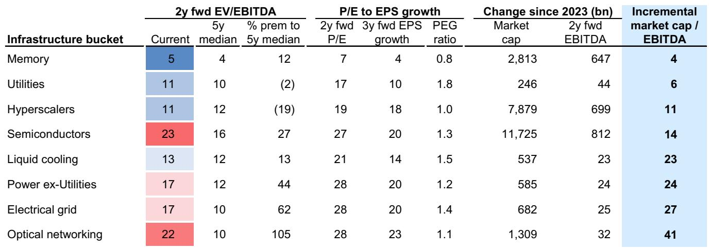

# Consensus Underestimates AI Capex Again: The $1 Trillion Question for 2027 and Why Volatility Is the New Normal

The most important number in equity markets right now is not a price or a valuation multiple. It is the $920 billion consensus estimate for hyperscaler capital expenditure in 2027. That number is almost certainly too low. If the current cycle follows the pattern of previous transformative infrastructure build-outs, hyperscaler capex could reach $1.1 trillion or more by 2027, representing a 45% growth rate that shatters the consensus view of a sharp deceleration to 22%. For investors positioned in AI infrastructure beneficiaries, this gap between consensus and reality represents both a near-term opportunity and a medium-term risk that demands careful navigation.

The stakes could not be higher. AI-exposed equities, particularly the infrastructure complex, have powered US equity markets to new highs. Phase 2 infrastructure stocks have rallied 40% since the start of the second quarter, driven overwhelmingly by strong capex spending. Yet this rally has occurred alongside the widest dispersion of returns among AI-exposed equities since the launch of ChatGPT, with the standard deviation of returns surging to 53 percentage points in Q2. This is not a market that rewards passive exposure. It is a market that punishes those who misjudge the trajectory of capital spending.

The argument of this article is straightforward: consensus estimates for hyperscaler capex have been systematically too conservative for three consecutive years, and the pattern is repeating for 2027. The implications extend beyond mere earnings forecasts. They affect the sustainability of current valuations, the risk of volatility spikes, the financing capacity of the largest technology companies, and the long-term investment thesis for every phase of the AI ecosystem. Understanding why the consensus is wrong, and what it means for portfolio construction, is the single most important analytical task for equity investors today.

## Consensus Estimates Have Been Wrong by an Average of 45 Percentage Points for Three Years, and the 2027 Forecast Is Repeating the Same Error

The pattern is now established and unmistakable. At the start of each of the past three years, analyst consensus for hyperscaler capex growth has been dramatically lower than what ultimately materialized. In 2024, the initial estimate was 19% growth; realized growth was 54%. In 2025, the initial estimate was 22%; realized growth reached 73%. For 2026, the initial estimate was 36%; current estimates now project 84% growth. The average error across these three years is 45 percentage points. Yet for 2027, consensus still assumes a sharp deceleration to just 22% growth, implying that the hyperscalers will abruptly curb their investment appetite.

Why does this matter? Because the gap between consensus and reality is not random forecasting error. It reflects a structural underestimation of the demand dynamics driving AI infrastructure spending. The larger-than-expected revenue backlog for the hyperscaler group highlights the persistent imbalance between AI supply and demand. Google Cloud and Amazon Web Services combined backlog has surged to $832 billion as of Q1, more than doubling from $358 billion just six months ago. The equity analysts covering these companies do not expect a supply-demand balance until the second half of 2027 at the earliest. When companies with this level of demand visibility signal that they expect to "significantly increase" capex, as one major hyperscaler has stated, the burden of proof shifts to those who argue for deceleration.

The analytical implication is clear: investors who base their positioning on consensus estimates are implicitly betting that the hyperscalers will ignore their own demand signals. That is a bet with poor historical odds.

## The Historical Precedent for $1 Trillion in Hyperscaler Capex Is Stronger Than Most Investors Realize

The argument for higher capex is not merely extrapolation from recent trends. It is grounded in the historical pattern of transformative technology infrastructure build-outs. Incremental AI spending equated to 0.9% of GDP in 2025 and is estimated to reach 1.5% of GDP in 2026. This impulse is similar to the peak during the 1990s telecom and ICT hardware build-out, but it remains below the peak of 2-3% of GDP observed during the railroads and electric motor construction eras.

If the incremental investment impulse reaches 2% of GDP, hyperscaler capex would reach approximately $950 billion in 2027. At 3% of GDP, the figure rises to $1.25 trillion. These are not extreme assumptions. They are consistent with the scale of investment required to build infrastructure that supports a 24x increase in token consumption by 2030, driven primarily by enterprise agents. The hyperscalers have consistently messaged that their capex plans are demand-driven, not speculative. Token demand, energy intensity, and input costs will determine the final figure, but higher input costs also put upward pressure on the nominal dollars required to support a given level of consumption.

The so-what for investors is that the consensus view of deceleration represents a specific bet about the trajectory of technological adoption. It assumes that the current pace of token consumption growth will moderate, that enterprise adoption will plateau, or that efficiency gains will reduce capital requirements. Each of these assumptions is contestable, and the historical record of technology cycles suggests they are likely to prove too conservative.

## Financing Constraints Are Less Binding Than the Market Assumes, but the Structure of Funding Is Shifting

A common counterargument to the higher capex thesis is that the hyperscalers will eventually hit financing constraints. The data suggests otherwise. Since the start of 2025, hyperscaler net debt has increased by $170 billion, but their collective net debt to EBITDA remains extremely low at 0.4x. These companies could increase their net debt by up to $950 billion and still carry a net leverage ratio below 1x, consistent with the upper end of the range for companies with AA credit ratings or better.

The more relevant constraint is not balance sheet capacity but market capacity. The near-term USD investment-grade market has limits based on single-issuer weightings and potential saturation. Using the weightings of the largest money center banks as a guide, the incremental issuance capacity for the four largest hyperscalers is approximately $450 billion before reaching the index weight of the current largest issuers. This is a meaningful constraint, but it is not a hard ceiling.

The implication is that the structure of financing will evolve. Ex-USD corporate bond issuance, joint venture project finance structures, and the private infrastructure market will play larger roles. The hyperscalers can also tap existing cash balances or issue equity, as recent activity has demonstrated. The key insight is that financing is a variable to be managed, not a fixed constraint that limits capex. Investors should expect continued innovation in funding structures rather than a cap on spending.

## The Dispersion of Returns Within AI-Exposed Equities Signals That the Easy Money Has Been Made, and Active Selection Is Now Critical

The widening dispersion of returns within AI-exposed equities is the most important market structure signal for investors. The standard deviation of returns across the AI-exposed equity basket has surged to 53 percentage points in Q2, the widest since ChatGPT launched. This dispersion is not random. It is driven by varying degrees of positive returns within the infrastructure phase, contrasted with both positive and negative returns within the application complex.

The median AI infrastructure stock now trades at 26x earnings, the highest multiple since the launch of ChatGPT. Valuation expansion has occurred within semiconductors and power-ex-utilities, but not among the hyperscalers or memory stocks. This pattern suggests that the market is pricing in sustained earnings power for certain segments while remaining skeptical about others. The risk is that rapid price appreciation, elevated valuations, and crowded positioning in some infrastructure slices increase the probability of sharp reversals.

The so-what is that the next phase of the AI trade will not be driven by beta. It will be driven by the ability to distinguish between companies whose earnings can sustain current multiples and those whose valuations reflect temporary euphoria. The recent volatility, driven by disappointing earnings from a major semiconductor company and headlines about hyperscaler equity issuance, is a preview of what investors should expect more of. Momentum factor volatility has historically been one of the most consistent signals in narrow breadth markets, and current conditions are consistent with that pattern.

## The Report Does Not Fully Answer Whether Enterprise AI Adoption Will Translate into Measurable Earnings Growth

The most significant open question in the AI investment narrative is whether enterprise adoption will translate into measurable earnings growth. Corporate commentary during the most recent earnings season paints a picture of nascent adoption. Roughly 54% of companies discussed AI in the context of productivity on their earnings calls, but only 11% quantified the productivity gains for a specific use case, and just 2% quantified the impact on earnings. These figures are essentially unchanged from the previous quarter.

The absence of measurable earnings impact is not necessarily a negative signal. It may simply reflect the early stage of adoption. However, it creates a vulnerability for the investment thesis. If AI infrastructure spending continues to grow at 45-89% while enterprise adoption remains at the discussion stage, the gap between investment and returns will widen. The hyperscalers' equity issuance underscores the importance of positive revenue revisions to justify continued spending.

The report leaves open the question of whether the terminal value assumptions embedded in software valuations are realistic. An illustrative discounted cash flow model suggests that 85% of the present value of software was in the terminal value at the start of the year. The year-to-date decline in software valuations can be explained by only modest changes to long-term growth and margin assumptions. This means that small changes in the narrative about AI disruption versus enablement can produce large swings in valuations. The debate about whether AI enables incumbents or disrupts them will persist and drive continued return dispersion.

## A Decision Framework for Investors Navigating the Capex-Valuation-Volatility Triangle

For investors seeking to translate this analysis into actionable positioning, a three-dimensional decision framework is useful. The first dimension is the capex trajectory. Investors must form a view on whether 2027 hyperscaler capex will be closer to the consensus estimate of $920 billion, the base case of $1.1 trillion, or the upside scenario of $1.4 trillion. This view determines exposure to AI infrastructure beneficiaries. The second dimension is valuation sustainability. The median AI infrastructure stock at 26x earnings is priced for continued earnings growth. Investors must assess whether current multiples can be sustained if capex growth decelerates, even if it decelerates from a higher base than consensus expects. The third dimension is financing structure. The shift toward alternative funding sources, including equity issuance and project finance, introduces new variables that affect both the cost of capital and the risk profile of individual companies.

The interaction of these three dimensions creates distinct risk profiles. For investors who believe in the higher capex scenario, infrastructure exposure remains attractive but requires active management of valuation risk. For those who are more cautious about the sustainability of current spending levels, the risk-reward in infrastructure is deteriorating. The dispersion of returns within the complex suggests that differentiation is now essential.

The most important unresolved question for portfolio construction is whether the current phase of infrastructure spending will create sufficient downstream demand to justify the investment. If enterprise adoption accelerates and earnings materialize, the current valuations will prove justified. If adoption remains nascent, the gap between investment and returns will eventually force a reassessment. The next two earnings seasons will be critical in providing evidence one way or the other.

---

The full report contains detailed charts on capex scenarios, token consumption forecasts, historical technology cycle comparisons, and the financing capacity analysis that underpin these arguments. It also includes the specific data on valuation dispersion and positioning that cannot be fully captured in a summary.

Join the community to read the full report and review the original charts.

*This article is for learning and discussion only and does not constitute investment advice.*

Personal reading notes and learning share only. Not investment advice.

