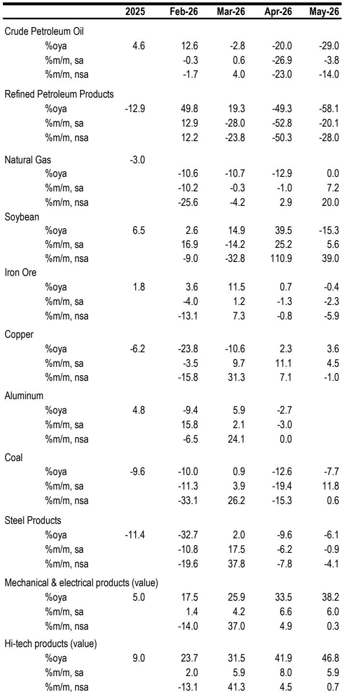
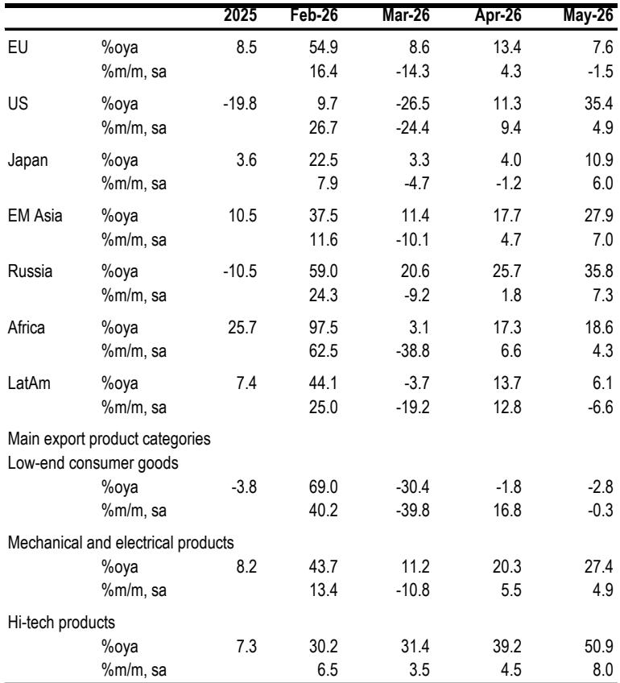
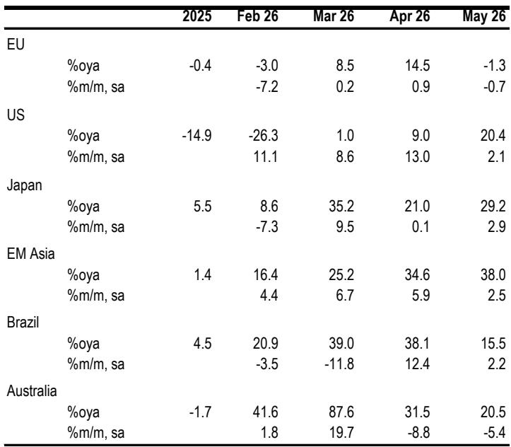

# JPM：市场低估的不是出口增速，而是贸易结构对增长含义的根本改变

五月出口数据再次超预期，年增长率达到19.4%，远超市场共识的15%和JPM自己预测的12.1%。但这份JPM研报的核心判断，并非出口有多强劲，而是出口的增长模式正在发生一次被市场低估的质变——增长越来越窄、越来越依赖价格驱动、越来越与国内生产和就业脱钩。这意味着，仅仅盯着出口增速来判断经济走向，已经不够了。

过去几年，市场习惯将出口增长等同于制造业景气，将贸易顺差扩大等同于对GDP的净贡献增加。但这份报告揭示了一个不那么直观的现实：出口增长的主要驱动力，已经从“量”转向了“价”，而且集中在极少数产品类别。当增长主要来自价格效应而非产量扩张时，它对上游生产、就业和资本开支的拉动效应，会显著弱化。

更值得关注的是，这种结构变化发生在全球贸易政策环境高度不确定的背景下。美国正在将关税工具从IEEPA转向301和232条款，欧盟对华贸易立场也在持续硬化。这意味着，中国出口面临的风险已经从“需求端波动”转向了“政策端冲击”。对于产业决策者和投资者而言，理解这种变化，远比预测下个月出口数字更重要。

## 1. 五月出口超预期的真正推手不是需求，而是价格和产品组合

五月出口环比增长3.1%，延续了四月6.7%的强劲势头。但更值得拆解的是增长来源。这份研报明确指出，出口增长主要集中在三个领域：存储芯片与模块、AI数据中心建设设备、以及新能源产品（电动汽车、太阳能、电池）。这三类产品合计贡献了约60%的出口增量。

关键变化在于，半导体出口价格已经大幅上涨。存储芯片从2025年的“量增驱动”转变为了近几个月的“价增驱动”。“新三样”的价格也在企稳，同时伴随可观的量增。而其他出口产品的平均价格，在四月已经转为小幅正增长，且可能因能源成本上升而面临进一步上行压力。

这意味着什么？出口增长的名义数字虽然好看，但剔除价格因素后的实际量增可能远低于表面水平。对于依赖出口量的制造业企业来说，这意味着收入增长并不一定转化为产量增长和产能利用率提升。对于投资者而言，这意味着需要重新审视出口相关板块的盈利预期——价格上涨带来的收入增长，其可持续性和传导效应与产量增长完全不同。

## 2. 进口结构揭示了一个更重要的信号：AI供应链拉动和商品囤货，而非内需复苏

进口连续第六个月扩张，五月环比增长2.9%，年增长率维持在27.5%的高位。但这份报告做出了一个关键区分：进口增长更多来自AI相关高科技进口和商品囤货，而非广泛的国内需求复苏。

从来源地看，五月进口增长主要由亚洲拉动，韩国环比增长10.2%，日本增长2.9%。从产品看，高科技进口环比增长5.9%，同样受到价格效应推动，尤其是从韩国进口的存储产品。大宗商品进口则出现分化：煤炭、天然气、大豆、铜的进口量增加，而原油和成品油继续下滑。

原油进口下降的部分原因是去年的储备积累以及企业倾向于消耗库存。但报告提出一个值得关注的判断：随着中东冲突持续，如果进口恢复至更“正常”的水平，可能会收紧区域石油市场。

对于投资者而言，进口结构的变化意味着：不能将进口增长简单解读为内需回暖的信号。AI供应链的资本开支和商品囤货行为，与消费驱动的进口增长，对经济和市场的含义截然不同。前者更多反映特定产业的资本密集度提升，后者才意味着广泛的消费复苏。

## 3. 贸易增长对GDP的净贡献比表面数字更小、更不稳定

这是整份报告最核心的洞察。当出口增长越来越窄、越来越依赖价格驱动时，贸易顺差对GDP的净出口贡献，其计算方式和实际含义都变得复杂。

报告指出，出口增长集中在存储芯片、AI存储模块、电动车、太阳能和电池这几类产品，同时半导体出口价格大幅上涨。进口方面，高科技进口同样受价格效应推动。这种“价格对价格”的结构，使得贸易顺差的名义扩大并不一定对应实际产出和就业的增加。

更关键的是，净出口贡献对相对价格变动（芯片价格、大宗商品价格、汇率）和产品组合变得高度敏感。当价格成为主要驱动因素时，贸易条件的变化会直接侵蚀顺差的实际价值。对于GDP核算而言，名义净出口的增长可能被价格效应所稀释，实际净出口贡献可能远低于表面数字。

这意味着，依赖贸易顺差来支撑GDP增长的分析框架需要调整。对于宏观决策者而言，政策重心可能需要从“保出口”转向“保出口的实际价值创造”。对于投资者而言，需要警惕那些表面看出口增长强劲、但实际量增有限、且高度依赖价格波动的行业。

## 4. 美国关税政策正在转向，风险来源从需求端转向政策端

报告对贸易政策风险的分析，提供了比市场共识更细致的视角。美国法院否决了基于IEEPA和Section 122的关税后，特朗普政府正在转向301和232条款。新的调查涵盖16个经济体的产能过剩问题，以及60个经济体的强迫劳动执法。这些措施的覆盖范围和推进速度，比2017-18年的对华关税周期更广、更快。

虽然特朗普访华带来了短暂的稳定——建立了贸易委员会和投资委员会渠道，并在关键矿产、波音和农业领域达成了初步承诺——但报告指出，这些协议缺乏实质性内容。中国方面将协议称为“初步的”，法院也在审查关税权力。除非新的委员会能在9月习近平主席访美前将对话转化为正式协议，否则贸易风险仍将是长期的不确定性来源。

对于企业而言，这意味着供应链规划面临的不只是关税本身，更是政策路径的不确定性。2017-18年的关税周期有相对清晰的升级路径，而当前的政策工具切换和法院裁决，使得风险变得难以预测。企业需要为多种政策情景做好准备，而非仅盯着关税税率。

## 5. 欧盟风险正在上升，对华贸易冲突可能从汽车蔓延至更广领域

报告指出，欧盟对华贸易冲突的风险正在上升。欧洲政治基调持续硬化，政策制定者正在寻找更强有力的工具来抑制来自中国的进口激增，尤其是在中国日益占主导地位的领域——电动车和其他战略产业。

进一步的升级可能通过贸易防御行动和产业政策（如补贴设计和资格规则）来收紧市场准入，实际上排除中国企业。这可能导致中国对欧盟出口增长放缓、更多目的地转口、以及由政策而非需求驱动的更大波动。

报告特别强调，报复风险也不容忽视。中国已表示愿意对保护主义措施做出回应，而欧洲对供应链杠杆（如稀土相关中断）也很敏感。这意味着，中欧贸易冲突的升级路径可能比预期更复杂，涉及多个领域的相互制衡。

对于涉及出口欧洲的企业，尤其是汽车、绿色能源和部分高科技领域，需要将“政策冲击”纳入核心情景分析，而非仅仅作为尾部风险。对于投资者而言，中欧贸易关系的恶化将对相关板块的估值产生系统性影响。

## 6. 全球需求仍是一个上行支撑，但驱动力正在从AI基础设施转向更广泛的资本开支

尽管贸易政策风险上升，但报告也指出了出口的一个上行支撑：外部需求韧性。全球经济在能源冲击下仍保持增长，得益于政策缓冲、仍然稳健的消费、以及贸易战拖累消退后企业信心的改善。

关键变化在于，资本开支的强势正在从AI基础设施扩展到非科技领域——包括AI在各行业的应用、制造业、以及潜在库存重建，这得益于强劲的企业利润和较低的库存水平。对于中国而言，更强劲的全球商品和资本开支周期，应能支撑出口动能和中国相关供应链，部分抵消国内需求的不均衡。

报告预计，除非出现大幅回落，今年名义出口增长可能落在高个位数，甚至可能超过10%。同时，进口也在走强，部分源于新一轮囤货和AI供应链投入，这提高了全年名义进口增长自2021年以来首次超过出口增长的可能性。

这意味着，出口的基本面并非一片黯淡。但增长的结构性变化和贸易政策风险，使得“出口增长”这个宏观指标对微观主体的含义变得更加模糊。对于企业而言，关键在于判断自己所在的细分领域，是受益于全球资本开支扩张，还是暴露于贸易政策冲击。

## 报告尚未完全回答的关键问题：价格驱动的增长能持续多久？

这份报告揭示了出口增长从“量增”向“价增”的转变，但有一个关键问题尚未充分展开：这种价格驱动的增长可持续吗？

存储芯片的价格上涨，很大程度上源于供给紧张。但供给端的约束能持续多久？当产能扩张到位或需求出现边际放缓时，价格能否维持高位？新能源产品的价格企稳，是源于成本下降触底，还是需求支撑？这些问题对判断出口增长的质量和持续性至关重要。

另一个未充分展开的问题是：当进口增长超过出口增长时，贸易顺差的收缩对人民币汇率和资本流动意味着什么？报告提到了这个可能性，但没有深入分析其宏观影响。

这些未解问题，恰恰是深入理解中国贸易格局变化的关键。欢迎来到我们的知识星球和微信群，与更多产业决策者和投资者一起，持续追踪这些关键变量的演变，共同拆解贸易数据的真实含义。

Personal reading notes and learning share only. Not investment advice.

