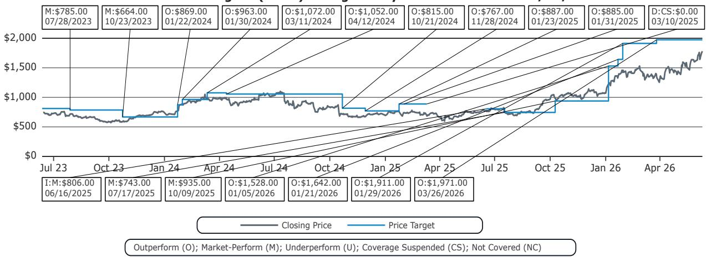

# Taiwan's Semiconductor Equipment Import Data Reveals a Diverging Recovery That Investors Should Not Treat as Uniform

The narrative that semiconductor capital equipment demand is experiencing a broad-based recovery is dangerously simplistic. Taiwan's May 2026 import data tells a more nuanced story: overall semiconductor equipment imports rose 23% year-over-year, but the month-over-month decline of 8% globally and 17% from Japan signals that the recovery is both real and uneven. For investors tracking Japan and EU semiconductor equipment companies, the critical insight is not that the cycle is turning, but that it is turning at different speeds for different equipment segments, with implications that extend well beyond the next quarter's earnings.

This matters now because the market is pricing in a synchronized recovery narrative across the equipment complex. When the actual data reveals divergence, the risk of consensus-driven positioning being wrong increases substantially. The Taiwan import data, released by the Ministry of Finance on June 10, offers a high-frequency, hard-data lens into the demand patterns that will determine which companies outperform and which disappoint. The patterns embedded in this data should cause investors to reconsider their allocation strategies across the Japan and EU semiconductor equipment universe.

The data is particularly relevant because Taiwan remains the single most important demand node for advanced semiconductor manufacturing equipment. As the epicenter of leading-edge foundry capacity expansion, Taiwan's import patterns serve as a leading indicator for the equipment companies that supply the global semiconductor industry. What the May data reveals is a market where lithography demand is surging, tester demand is recovering, but key process equipment from Tokyo Electron is showing sequential weakness.

## The Lithography Demand Surge Is Real and Concentrated, Creating a Two-Tier Market for Equipment Suppliers

The most striking data point in the May release is the lithography import figure: EUR 543 million in May, down 38% month-over-month but up 21% year-over-year. On its surface, a 38% monthly decline appears concerning. The context, however, transforms this narrative entirely. April imports were the third-highest monthly level on record, and the first two months of the current quarter collectively show imports up approximately 80% quarter-over-quarter. This is not weakness; it is the natural volatility of large-ticket equipment shipments following an extraordinary month.

The second-order implication here is structural, not cyclical. Taiwan's lithography demand is gaining momentum because TSMC's capacity expansion program is progressing at a pace that is surprising even the most optimistic industry observers. The regression analysis based on two-month import data suggests quarterly system sales for ASML from Taiwan of EUR 2.33 billion, representing a 61% quarter-over-quarter increase and a 19% year-over-year gain. At this level, Taiwan would account for 37% of ASML's overall system sales.

This concentration creates a strategic question for investors: is ASML's exposure to Taiwan a source of strength or vulnerability? The bullish case is that TSMC's commitment to leading-edge capacity expansion is multi-year and non-discretionary. The bearish case is that such concentration in a single geographic demand node creates earnings vulnerability to any disruption in Taiwan's political or operational environment. The data does not resolve this debate, but it does confirm that the near-term momentum is overwhelmingly positive.

## Tester Demand Is Recovering Faster Than Consensus Expects, But the Recovery Is Still in Its Early Innings

Advantest's SoC tester revenue shows a high correlation with Taiwan's tester import data, making this one of the most actionable leading indicators in the equipment space. May tester imports from Japan and Malaysia collectively reached USD 613 million, up 7% month-over-month and 34% year-over-year. The three-month moving average is up 4% sequentially, suggesting the recovery has durability.

The regression analysis points to Advantest's Taiwan sales growing 6% quarter-over-quarter in the June quarter, which represents upside versus consensus expectations of 3% quarter-over-quarter growth. This 300-basis-point differential may seem modest, but in the context of semiconductor equipment stocks trading at elevated multiples, even small revenue beats can drive significant multiple expansion.

The more important strategic observation is that tester demand is recovering from a deeply depressed base. The memory test market has been particularly weak, and the SoC tester recovery is still in its early stages relative to the overall cycle. This suggests that Advantest's earnings trajectory may have more upside than the current consensus embeds, but only if the recovery broadens beyond the current Taiwan-led demand.

The open question that the data cannot answer is whether this tester recovery is sustainable or whether it represents a restocking cycle. The distinction matters enormously for valuation. If the recovery is demand-driven by the proliferation of AI and high-performance computing chips, the cycle has years of runway. If it is merely inventory replenishment, the current import levels may prove to be a peak rather than a base.

## Tokyo Electron's Sequential Weakness Raises Questions About the Breadth of the Equipment Cycle

The most concerning data point in the May release is the continued month-over-month decline for Tokyo Electron. The Taiwan import data for the categories most relevant to TEL, including CVD, dry etching, cleaning, coater and developer, and RTP equipment, shows a 19% month-over-month decline in May. While year-over-year growth remains positive at 7%, the sequential trajectory is deteriorating.

The regression analysis suggests Tokyo Electron's Taiwan revenue could decline 24% quarter-over-quarter in the June quarter, which represents significant downside to consensus expectations of flat quarter-over-quarter performance. This divergence between TEL's trajectory and the overall equipment market creates an important analytical puzzle.

One possible explanation is that TEL's product mix is more exposed to mature-node capacity additions, which are experiencing a different cycle than the leading-edge lithography and tester demand. Another possibility is that TEL's customers are reallocating their capital expenditure budgets toward lithography and test equipment, squeezing out spending on process equipment in the near term. Neither explanation is comforting for TEL investors.

The strategic implication is that the semiconductor equipment recovery is not a rising tide that lifts all boats equally. Companies with exposure to the most advanced nodes and to the specific equipment categories that are in highest demand for AI and high-performance computing capacity expansion will outperform. Companies with broader exposure to the mature-node and memory markets may face continued headwinds even as the aggregate data looks positive.

## The Data Raises Unresolved Questions About the Sustainability of the Current Trajectory

While the Taiwan import data provides valuable high-frequency visibility into equipment demand, it also raises several questions that the data alone cannot answer. These unresolved questions are the most valuable analytical territory for investors seeking to develop differentiated views.

First, the data cannot distinguish between demand driven by genuine capacity expansion and demand driven by equipment procurement timing. The extraordinary April lithography import number could reflect TSMC pulling forward shipments to manage its installation schedule, which would imply lower shipments in subsequent months. The data cannot confirm whether the current trajectory is sustainable or whether it represents a temporal concentration of shipments.

Second, the data provides no visibility into the end-demand environment for the chips that will be manufactured using this equipment. The AI-driven demand for advanced logic and HBM memory is well-documented, but the recovery in other end markets remains uncertain. If the broader semiconductor end-market recovery stalls, the equipment spending cycle could peak earlier than current expectations suggest.

Third, the data is specific to Taiwan and may not be representative of global equipment demand patterns. While Taiwan is the most important single market for advanced equipment, the recovery in other regions, particularly the United States and Europe, may follow different trajectories. Investors who extrapolate the Taiwan data to the global equipment market may be making a significant analytical error.

## A Decision Framework for Investors Navigating the Diverging Equipment Recovery

The Taiwan import data supports a framework for making equipment investment decisions based on three dimensions: node exposure, product category exposure, and geographic diversification.

Node exposure is the most important dimension. Companies with dominant positions in leading-edge lithography and test equipment, such as ASML and Advantest, are benefiting from the structural demand driven by AI and high-performance computing. Companies with significant exposure to mature-node capacity additions face a more cyclical demand environment that may not recover as strongly.

Product category exposure is the second dimension. The data shows that lithography and test equipment are experiencing the strongest demand, while process equipment from companies like Tokyo Electron is showing sequential weakness. This suggests that equipment companies with unique, hard-to-replicate product positions will outperform those in more commoditized categories.

Geographic diversification is the third dimension. The concentration of demand in Taiwan creates both opportunity and risk. Companies with balanced geographic exposure may offer more resilient earnings profiles, while companies with heavy Taiwan concentration offer higher upside but also higher event risk.

This framework suggests that the current market may be underappreciating the divergence within the equipment complex. The consensus view of a synchronized recovery may be masking significant differences in company-level trajectories that will become apparent as earnings are reported.

## The Full Report Contains the Charts and Data That Enable Proprietary Analysis

The analysis above is based on the May import data, but the full report contains the historical charts, regression models, and detailed category breakdowns that enable investors to build their own analytical frameworks. The exhibits showing the correlation between import data and company-level revenue, the regression outputs that quantify the relationship, and the detailed category-level data are essential tools for any investor seeking to develop an independent view on the equipment cycle.

Join the community to read the full report and review the original charts.

*This article is for learning and discussion only and does not constitute investment advice.*

Personal reading notes and learning share only. Not investment advice.

