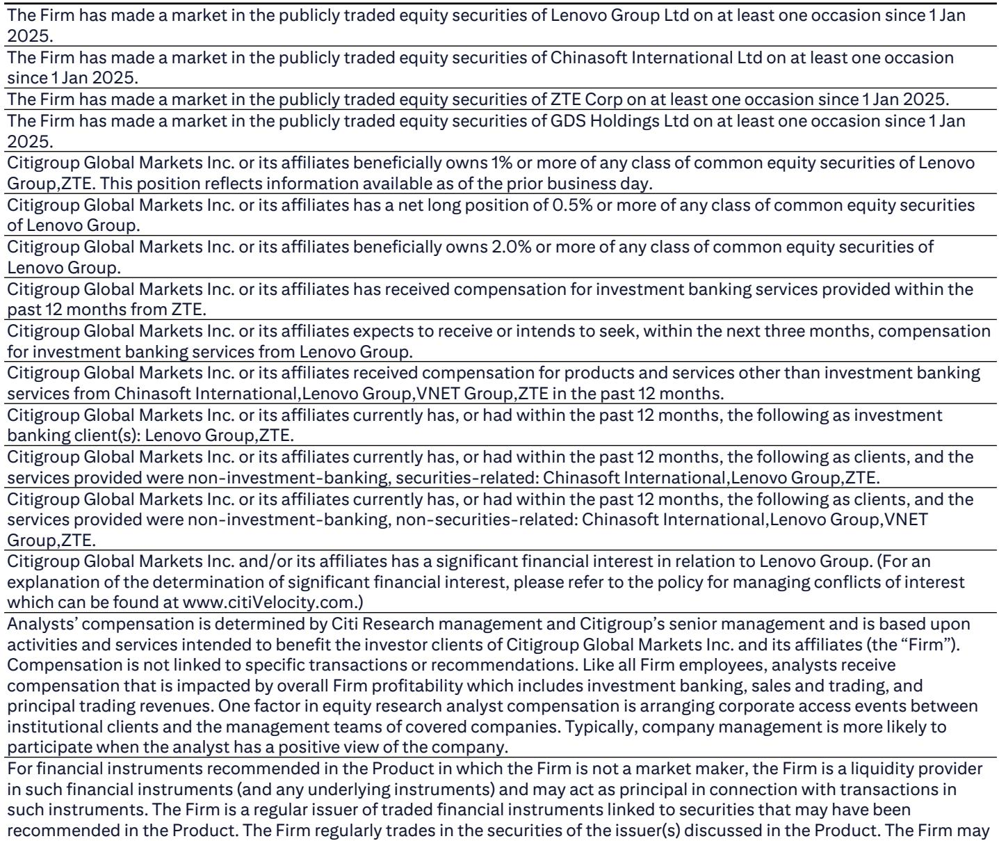
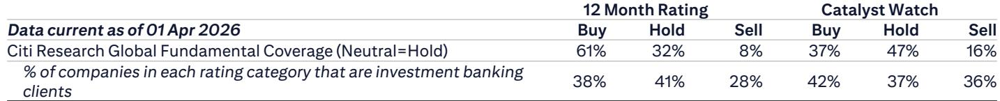

# Citi：中国2万亿AI基建计划真正重塑的不是需求，而是国内供应链的定价权

市场正在讨论一个巨大的数字：2万亿元人民币，五年，国家级数据中心网络。但这份Citi研报的核心判断，并非只是“需求会爆发”这么简单。它真正揭示的信号是：中国AI基础设施的竞争逻辑正在发生一次底层切换——从谁建得最快，转向谁能把国产化率80%的硬约束转化为结构性优势。

国家发改委牵头的这一计划，要求至少80%的关键技术依赖国内供应商。这意味着，过去市场对AI产业链的估值模型，很大程度上基于全球供应链的假设，如今需要重写。Citi研报在6月9日发布后迅速引发关注，因为它提供了一个量化锚点：以每兆瓦约2亿元的综合成本计算，2万亿投资相当于新增约10GW的AI数据中心容量，年均2GW。而中国目前全部IDC装机容量估计约为20GW。换句话说，仅这一计划就将使AI级数据中心容量在现有基础上扩张约50%。

这个数字本身已经足够震撼，但真正值得深入推敲的，是它如何重塑产业链上每一家公司的竞争地位。以下是我们从这份研报中提炼出的四个关键层次，以及一个尚未被充分讨论的问题。

## 1. 运营商从“管道工”升级为AI经济的基础设施运营商，其估值逻辑需要重构

报告明确指出，根据媒体报道，国有电信运营商将运营这批互联数据中心的主体。这并非简单的“接单干活”，而是一次角色跃迁。

过去十年，三大运营商在资本市场上的定位长期被简化为“流量管道”，估值受制于ARPU值增长乏力、资本开支周期和竞争性降价。但Citi研报暗示，当运营商成为国家级AI算力网络的核心运营方，他们的收入结构将从“卖连接”转向“卖算力+连接”。这不仅意味着单位收入的提升，更意味着商业模式的本质变化——从流量批发商升级为平台型基础设施服务商。

这一转变的财务含义尚未被市场充分定价。如果运营商能够基于国产算力集群提供高附加值的算力调度、运维和安全服务，其利润率中枢可能显著上移。而当前市场对运营商的估值，仍然停留在传统的EV/EBITDA框架中，并未计入这一结构性溢价。

## 2. 中立IDC运营商正在经历一轮“订单质量”的跃迁，而非仅仅是订单数量

一个容易被忽视的细节是，Citi研报特别提到了GDS和VNET在2026年第一季度的创纪录批发订单：GDS约200MW，VNET超过500MW。但关键不在于订单规模本身，而在于这些订单的“质量”——它们来自国家级AI基建计划的前期需求。

传统上，IDC运营商面临的最大风险是客户集中度和需求波动性。但当需求方变为国家级战略项目，且建设周期明确、资金有保障时，订单的确定性和长期性大幅提升。这意味着，对于GDS和VNET这类公司，其收入可见性将从12-18个月延长至3-5年，这直接支撑其融资能力和扩张节奏。

不过，这里仍需注意一个关键假设：这些订单是否真正来自AI基建计划，还是来自其他商业客户？报告没有完全展开。但VNET超过500MW的单季订单量，放在历史数据中看，已经远超常规水平，这本身就是一个需要投资者密切跟踪的信号。

## 3. 国产AI服务器厂商的真正受益点，在于“供应约束”变成了“需求保障”

报告点名了IEIT、联想和中兴通讯作为AI服务器需求受益者。但更值得思考的是，国产化率80%的硬约束，对这些厂商意味着什么。

过去，国内AI服务器厂商面临的最大困境是：需求存在，但高端芯片供应受限，导致产能无法充分释放，毛利率承压。而这份计划的核心变革在于，它通过政策手段创造了一个“确定性需求池”，并且这个需求池明确指向国产芯片方案。换句话说，原本的“供应约束”现在变成了“需求保障”——因为客户只能从国产方案中选择，而国产方案的主要供应商就是这几家。

这意味着，这些厂商的AI服务器业务，将从“努力争取订单”转向“分配产能”，其议价能力和盈利稳定性都将提升。Citi研报对此的判断是“受益于本地化AI服务器生态系统”，但更深层的含义是：这些公司正在从“代工组装”向“系统集成+生态绑定”转型，其估值倍数有望向软件和服务类公司靠拢。

## 4. 光模块和软件服务商将受益于“网络密度”和“算力运营”的双重扩张

报告提到Accelink（光迅科技）和中软国际作为受益标的。但我们需要理解其受益机制的差异性。

对于Accelink，受益逻辑相对直接：AI数据中心网络对光模块的需求是量价齐升。但Citi研报特别强调了“互联数据中心网络”这一概念。这意味着，国家级算力网络不仅仅是单个数据中心的建设，更是数据中心之间的高速互联。这将对高速光模块（如400G/800G）产生额外的需求增量，而不仅仅是传统的数据中心内部连接。Accelink作为国内领先的光模块厂商，在这一轮互联需求爆发中，其产品组合和价值量都将显著提升。

对于中软国际，受益逻辑更为间接但可能更具持续性。报告将其定位为“华为的IT服务和ISV合作伙伴”，提供算力服务和基于Token的AI服务。这实际上指向了一个更宏大的趋势：当硬件基础设施建成后，算力的“运营”和“调度”将成为新的价值高地。中软国际的角色类似于算力时代的“系统集成商+运维服务商”，其收入模式将从一次性项目制转向持续性的服务订阅。如果这一模式能够跑通，其估值逻辑将发生根本性变化。

## 报告尚未完全回答的关键问题：国产芯片的性能瓶颈何时会变成政策执行的障碍？

这是整份研报逻辑链条中最脆弱的一环，也是投资者必须自己判断的风险点。

报告假设国产AI芯片（主要是华为的昇腾系列）能够满足国家级算力网络的需求。但现实是，国产芯片在单卡算力、互联带宽和软件生态方面，与全球领先水平仍存在差距。当2万亿投资落地、大规模集群开始实际部署时，如果国产芯片的性能无法支撑预期的AI训练和推理负载，项目进度可能会延迟，或者被迫降低性能标准。

Citi研报没有深入讨论这一风险，但它在逻辑上是存在的。80%的国产化率是一个政策目标，但执行层面的技术可行性，需要持续跟踪华为等芯片厂商的产品迭代进度。如果性能差距过大，可能导致部分项目从“AI级数据中心”降级为“通用数据中心”，从而改变整个投资回报率。

这一不确定性，恰恰是投资者需要深入研究的核心议题。它决定了这一轮基建周期的“天花板”在哪里。

## 顺着这个未解问题，我们可以在社群中继续探讨

以上分析是基于Citi这份研报的公开信息进行的逻辑推演。但正如我们刚才指出的，国产芯片的实际性能、政策执行节奏、以及运营商盈利模式转变的财务验证，都是需要更深入讨论的课题。

这些内容，在完整的研报原文中，有更详细的图表、历史数据对比和估值模型。我们已经在知识星球上传了这份报告的完整原文和我们的详细解读笔记。如果你希望进一步探讨国产芯片性能瓶颈的量化评估、运营商估值模型的重构方法，或者想和其他投资者一起跟踪这些公司的订单动态，欢迎来我们的微信群里继续讨论。

Personal reading notes and learning share only. Not investment advice.

