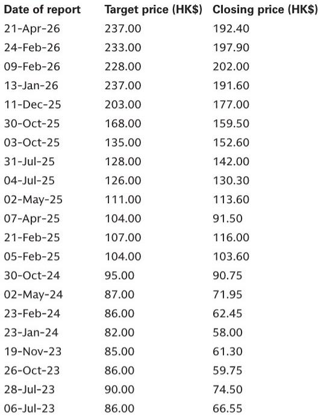
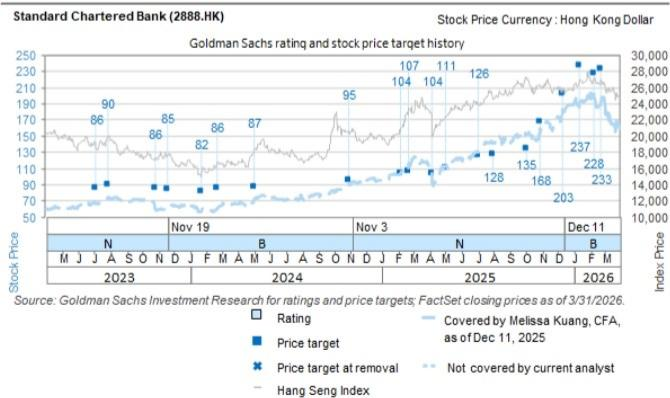
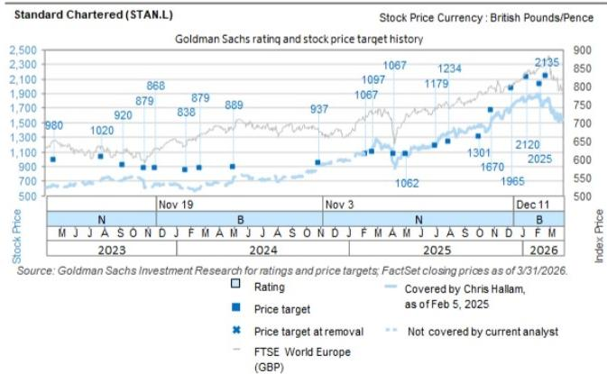

# GS：市场对香港银行跨境监管风险的担忧，可能被放大了十倍

自5月21日以来，HSBC控股和渣打银行的股价分别跑输欧洲银行板块指数5%和7%。在一个充斥着政策信号的月份里，这种下跌看起来顺理成章——中国证监会宣布对线上券商加强监管，香港金管局收紧开户流程，国务院发布了关于跨境投资的新规。投资者的直觉反应是：内地资金流入香港的通道正在收窄，依赖这些流量的银行将面临盈利压力。

但GS最新发布的这份报告提出了一个反直觉的判断：**市场担忧的方向是对的，但对程度的估计可能错了。** 即便在最极端的假设下——来自中国内地的净新资金完全归零——对HSBC和渣打税前利润的影响也仅为约1%和2%。这个数字与股价5%至7%的跌幅之间，存在一个明显的缺口。

这个缺口意味着什么？是市场过度反应，还是报告遗漏了某些更隐蔽的风险？GS的分析框架值得仔细拆解。

## 1. 政策组合拳的真正落点不在银行，而在技术跨境流动

5月22日，中国证监会宣布了对线上券商的监管措施及相关罚款。同日，香港金管局发布通函，旨在加强开户程序和合规要求。6月1日，中国国务院发布了一项关于规范跨境投资的条例。

这组政策在时间上的密集出台，很容易被解读为对跨境资本流动的系统性收紧。但GS的经济学家提供了一个不同的视角：**这些政策的核心关切是技术跨境转移的管理，而非限制资本外流。**

具体而言，国务院的条例重点在于建立规范跨境技术转让的框架，支持中国企业走出去，并管理与海外业务和资产相关的地缘政治风险。条例中唯一与银行直接相关的条款是第33条，该条款规定“境外金融市场投资应遵守本条例，具体规则另行制定”。

关键短语是“另行制定”。这意味着，截至目前，针对银行跨境业务的实质性新规则尚未出台。GS坦承，他们尚无法预判这些规则的具体形式。但报告同时指出，对于HSBC和渣打来说，直接来自内地境内的净新资金占比“绝对是小部分”。

这里的逻辑链条是：如果政策的首要目标不是限制资本流动，且银行来自内地的直接资金敞口有限，那么市场对银行业务冲击的担忧可能被前置了。

## 2. 量化测算：极端假设下的盈利影响仅为1%至2%

GS的量化分析是这份报告最值得关注的部分。它提供了一个清晰的敏感性框架。

首先，报告拆解了香港银行内地客户存款的资金来源结构。根据HSBC和渣打的管理层指引，一个典型的持有香港账户的内地居民，其存款流中约90%来自“离岸”来源（例如新加坡或香港本地），只有约10%来自内地银行账户。

2025年，HSBC的集团净新资金约为860亿美元，渣打约为520亿美元。在近期的投资者会议上，渣打CFO指出，其净新资金中约30%来自“全球华人”，而其中绝大部分资金已经存放在离岸。

基于这些数据，GS进行了压力测试：假设集团净新资金中约10%来自内地境内来源，如果这部分未来净新资金完全停止流入，对HSBC和渣打分别意味着约90亿和50亿美元的资金缺口。

进一步，假设在这部分净新资金上赚取100个基点的利差，对税前利润的影响仅为HSBC的0.3%和渣打的0.7%。即便以300个基点的利差计算——当前HIBOR为2.7%——对税前利润的影响也仅为每年约1%和2%。

**这个测算的隐含含义是：即便最坏情景发生，对银行基本面的冲击也远小于股价已经反映的幅度。** 市场可能混淆了“风险方向”和“风险程度”。

## 3. 保险与投资产品：被忽略的缓冲地带

报告还指出了另一个市场可能过度解读的领域：保险和投资产品。

GS认为，这些产品目前要么不在新规的管辖范围内，要么已经符合现有规则。更重要的是，对这些产品采取更严格的限制，与政策制定者的几个核心目标并不一致：a）监管技术跨境转移的重点，b）支持人民币国际化的意愿，c）继续发展香港作为双向投资枢纽的定位。

这是一个被市场情绪忽略的结构性判断。如果政策制定者确实希望维持香港作为离岸人民币中心和财富管理枢纽的地位，那么对保险和投资产品的过度限制将与这一目标自相矛盾。

当然，报告没有完全展开的是：政策的不确定性本身就有价值。即便最终影响有限，在规则明确之前，银行的新客户获取成本和合规成本可能会上升。这部分“摩擦成本”尚未被量化。

## 4. 报告没有完全回答的关键问题：财富收入的区域敞口到底有多集中？

GS在报告中承认，财富收入对HSBC和渣打的重要性不容忽视。财富收入约占两家银行营业收入的**三分之一**。对于HSBC，来自香港分部的财富费用（可能不包括保险）约占集团财富总费用的五分之一，约占集团营业收入的2%至3%。对于渣打，香港财富收入约占其财富总收入的比例高达**40%**。

这里存在一个报告尚未完全展开的问题：**如果政策变化不是直接限制资金流入，而是间接改变了内地客户对香港财富管理产品的偏好或信任度，那么财富收入的波动可能比存款利差的影响更大。**

GS的测算仅聚焦于净新资金减少对利差收入的影响，但没有对财富管理手续费收入进行同样的压力测试。原因可能是报告所说“这些产品目前不在范围内”，但投资者需要追问的是：如果客户情绪变化导致财富管理产品的销售周期延长或转化率下降，对营收的冲击会是多少？

这是一个值得在完整报告中进一步探究的维度。

## 5. 一个更值得关注的观察框架：净新资金的质量重于数量

对于关注这两只股票的投资者，GS的分析提供了一个更精细的观察框架：不要只盯着净新资金的绝对规模变化，而要关注**资金来源的结构**。

报告的核心洞见之一是，HSBC和渣打的净新资金中，来自内地境内的直接流入占比很小。这意味着，即便未来跨境监管收紧，对银行整体资金池的冲击也是有限的。真正需要跟踪的指标应该是：

- 离岸华人客户的净新资金增速是否出现放缓
- 新开户客户中非香港居民的比例变化
- 合规成本上升是否影响了新客户的获取效率

如果这些指标保持稳定，那么股价的下跌可能提供了更好的入场窗口。反之，如果离岸华人客户的资金增速也出现系统性放缓，那才意味着更根本性的变化。

## 6. 估值已经反映了多少悲观预期？

GS对HSBC和渣打均维持买入评级。HSBC的目标价为1700便士（伦敦）和165港元（香港），渣打的目标价为2260便士（伦敦）和242港元（香港）。HSBC被列入GS的“确信买入”名单。

这些目标价意味着当前股价仍有可观的上涨空间。但更重要的是，GS使用的估值方法暗示了他们对风险定价的判断：HSBC和渣打当前12倍和10.25倍的远期市盈率，并没有完全反映市场的悲观预期。

当然，风险依然存在。GS列出的下行风险包括：银行净利息收入弱于预期（包括美联储降息速度快于预期、HIBOR与联邦基金利率差距扩大）、非净利息收入增长慢于预期（包括全球贸易放缓或同行竞争加剧）、以及成本效率改善进程受阻。

但就当前这轮监管担忧而言，GS的结论是清晰的：**市场可能正在为一个小概率的大事件支付过高的保险溢价。**

---

这份报告中还有一个值得深挖的细节：渣打CFO提到，他们约30%的净新资金来自“全球华人”，但绝大多数资金已经存放在离岸。这意味着什么？“全球华人”的定义是什么？这些资金最初是如何从内地转移到离岸的？如果未来监管进一步细化，这部分“已经在离岸”的资金是否也会受到影响？

这些问题的答案，在报告的完整版本中有更详细的讨论。我们会在星球微信群里继续展开，欢迎来一起拆解这份报告的完整逻辑链和隐含假设。

Personal reading notes and learning share only. Not investment advice.

