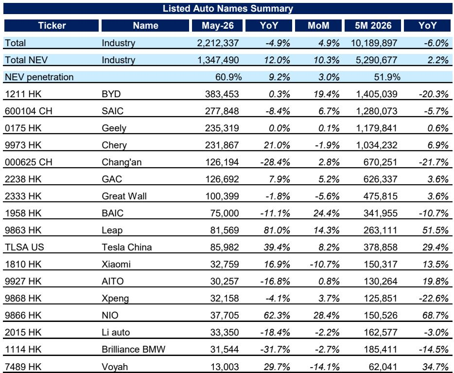
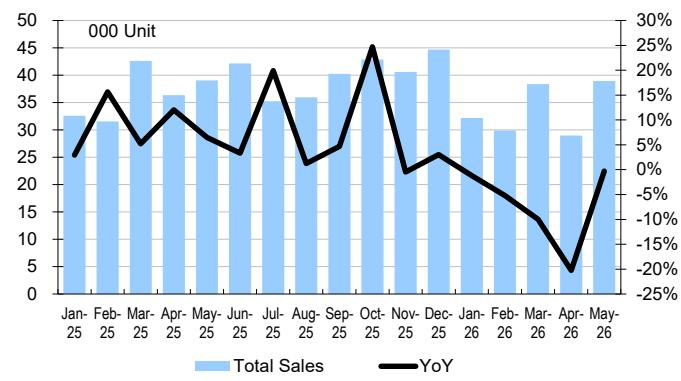

# DB：中国车市正在经历的，不是周期波动，而是竞争结构的根本性重构

五月的数据看起来有些矛盾。乘用车批发总量同比下降4.9%，但新能源车（NEV）批发量却逆势增长12%，渗透率首次突破60%大关。市场似乎同时在经历“总量收缩”和“结构加速”两个方向。

DB最新发布的这份月度批发量图册，提供了理解这一矛盾最直接的切口。它没有长篇大论地分析宏观政策或消费者信心，而是用一组清晰的数据，揭示了一个正在发生的底层变化：中国乘用车市场的竞争，已经从“谁能造出电动车”进入了“谁能把规模优势转化为定价权和成本护城河”的阶段。

这份报告最值得关注的判断，不是五月销量好坏，而是渗透率突破60%这个数字背后所代表的竞争格局质变。当新能源车成为绝对主流，市场的游戏规则正在被重新定义——赢家通吃的逻辑更加明显，而落后者的生存空间正在被快速压缩。

## 1. 新能源渗透率突破60%不是终点，而是竞争烈度升级的起点

五月新能源渗透率达到60.9%，环比提升3个百分点，同比提升超过9个百分点。这个数字的意义，远不止于市场份额的里程碑。它意味着，在当前的月度销售中，传统燃油车已经退居次位，新能源车正式成为市场的主流选择。

从更长的时间线来看，这一趋势的斜率值得重视。2025年初，渗透率还在42%左右，到年中攀升至50%以上，并在2025年下半年稳定在52%-56%的区间。进入2026年，渗透率在经历了一季度季节性回落后，在四月和五月快速拉升，从48%跳升至61%。这种加速态势，通常不是由单一产品周期驱动的，而是反映了消费者认知、基础设施、以及产品性价比三者之间的正向循环已经形成。

对于产业决策者而言，这个数字的含义是清晰的：市场不再需要讨论“是否要电动化”，而是必须回答“在电动化已成定局的竞争环境下，我的规模、成本和品牌护城河在哪里”。那些仍然依赖燃油车利润输血的企业，时间窗口正在关闭。

## 2. 总量下滑掩盖了头部企业的结构性优势，比亚迪的份额反弹是信号

五月行业总量同比下降4.9%，前五个月累计同比下降6.0%。但在这个收缩的总量中，头部企业的表现出现了明显的分化。

比亚迪在经历了年初几个月的低迷后，五月批发量恢复至38.3万辆，同比增长0.3%，环比增长19.4%，市场份额从四月的14.0%回升至17.0%。这个数字尤其值得关注，因为比亚迪年初至今累计销量仍同比下降20.3%，但五月的强势反弹表明，其产品更新周期和价格策略正在重新生效。

与此同时，特斯拉中国的表现同样稳健。五月批发量8.6万辆，同比增长39.4%，市场份额稳定在3.9%左右，接近历史高位。特斯拉的市场份额曲线在过去一年中呈现稳步上升趋势，从2025年初的3.0%左右，逐步攀升至当前的3.9%。

这些数据合在一起，揭示了一个关键判断：在总量收缩的环境中，头部企业正在通过规模效应和品牌溢价，进一步巩固自己的市场地位。对于比亚迪来说，五月的反弹可能意味着其年初以来的库存调整和新产品爬坡已接近完成；对于特斯拉，稳定的市场份额增长则体现了其在中国本土化生产后的成本优势持续释放。

## 3. 新势力阵营加速分化，规模化生存的临界点正在到来

新势力企业的五月数据，是这份报告中最能体现竞争结构变化的章节。

零跑汽车是最大亮点。五月批发量8.2万辆，同比增长81.0%，环比增长14.3%，市场份额从年初的1.6%跃升至3.7%，已经超越了理想汽车和蔚来。零跑的增长曲线在过去一年中几乎呈线性上升，从2025年初的月销2.5万辆，到当前突破8万辆，增长幅度在所有新势力中最为突出。

蔚来同样表现强劲。五月批发量3.8万辆，同比增长62.3%，环比增长28.4%，市场份额达到1.7%，创下近期新高。蔚来的销量曲线显示，其在2025年下半年经历了一轮显著的增长，月销从2万辆左右攀升至4万辆以上，尽管2026年初有所回落，但整体趋势仍然向上。

相比之下，理想汽车和小鹏汽车则面临压力。理想五月批发量3.3万辆，同比下降18.4%，市场份额从年初的1.75%回落至1.5%。小鹏五月批发量3.2万辆，同比下降4.1%，市场份额稳定在1.4%左右，但增长动能明显不足。

这些分化意味着什么？零跑和蔚来的增长证明，新势力企业并非没有机会，但机会正在向那些能够快速扩大规模、降低单位成本、并形成差异化产品定位的企业集中。零跑的增长路径尤其值得研究——它通过精准的价格定位和产品定义，在10-20万元这一最主流的价格带实现了快速放量。而理想和小鹏的困境则说明，当市场渗透率超过60%，单纯依靠品牌故事或单一产品亮点，已经不足以维持增长。

## 4. 报告尚未完全回答的关键问题：盈利能力的拐点何时到来

DB的这份图册提供了丰富的销量和市场份额数据，但它没有深入讨论一个核心问题：在渗透率突破60%之后，行业何时能够迎来盈利能力的系统性改善？

当前的数据显示，尽管新能源车销量在增长，但多数新势力企业仍然处于亏损状态。零跑的增长速度令人瞩目，但其毛利率是否能随着规模扩大而同步改善，仍是一个需要验证的问题。蔚来的销量增长同样强劲，但高昂的研发和销售费用，使其盈利时间表仍存在不确定性。

另一个未被充分讨论的问题是：当渗透率达到60%以上，传统车企的燃油车业务将面临怎样的压力？上汽集团五月销量同比下降8.4%，长安汽车同比下降28.4%，这些下滑不仅仅是个别企业的经营问题，更反映了整个燃油车产业链正在经历的收缩。这种收缩会如何影响传统车企向新能源转型的资金来源和转型节奏，是产业决策者需要密切关注的风险点。

报告中还有一个隐含但未被点明的变量：价格战。五月整体市场环比增长4.9%，但这是在持续的价格促销背景下实现的。价格的下降是否会在下半年侵蚀企业利润，尤其是对于那些尚未实现规模经济的新势力企业，这是一个需要持续跟踪的问题。

## 5. 投资者和产业决策者应该关注的三组关键指标

基于这份报告的数据框架，有三组指标值得纳入日常观察清单：

第一，渗透率的月度变化速度。当前的60.9%渗透率是在四月已经达到58%的基础上实现的加速。如果未来几个月渗透率能够稳定在60%以上，甚至进一步攀升至65%以上，那么燃油车市场的收缩将进入不可逆阶段。这将直接影响到传统车企的资产估值和转型紧迫性。

第二，头部企业的市场份额稳定性。比亚迪五月17.0%的市场份额，是否能够在下半年持续回升，或者会在20%附近形成新的均衡？特斯拉3.9%的份额能否继续提升？这些数字将决定行业定价权的分配格局。

第三，新势力企业的月销规模临界点。零跑已经突破了月销8万辆的门槛，蔚来接近4万辆。从行业历史经验来看，月销5-8万辆往往是新势力企业实现盈亏平衡的参考区间。哪些企业能够率先跨过这个门槛，将决定下一轮竞争中的资金储备和战略主动权。

## 6. 一个需要持续验证的假设：规模是否真的能转化为利润

这份报告最核心的隐含假设是：规模增长最终会带来利润改善。从数据上看，零跑和蔚来的增长路径似乎支持这一逻辑，但这里仍有几个需要验证的关键环节。

首先是单车成本的下降速度。随着产量增加，固定成本被摊薄是必然的，但原材料成本、电池成本、以及营销费用的控制能力，决定了毛利率的实际改善幅度。

其次是产品定价权。当市场规模扩大后，企业是否有能力在竞争中维持价格稳定，而不是被迫卷入无止境的价格战。理想汽车和小鹏汽车当前面临的挑战，某种程度上就是定价权不足的体现。

最后是品牌溢价。蔚来在高端市场的定位，使其拥有相对较高的单车价格和毛利率潜力，但高端市场的总量天花板也是客观存在的。零跑在主流市场的快速放量，则面临品牌向上和利润率的双重挑战。

这些问题的答案，目前还没有在这份报告中完全展开。这些正是完整报告中最值得深入阅读的部分——DB的分析师团队提供了更细致的图表拆解和趋势判断，能够帮助读者更全面地理解这些关键变量之间的互动关系。

欢迎来星球微信群里继续讨论。我们会在社群中分享这份DB研报的完整图表和数据解读，并围绕以上几个未解问题展开深度讨论——比如零跑和蔚来各自的盈利路径有何不同，价格战对行业利润的影响何时会显性化，以及投资者应该如何构建自己的观察框架。期待你的加入。

Personal reading notes and learning share only. Not investment advice.

