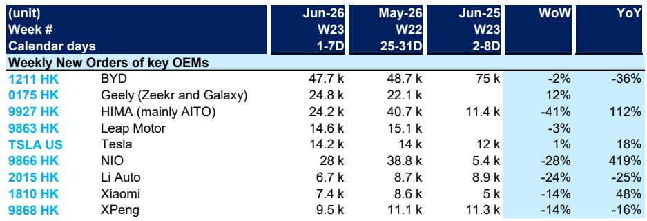
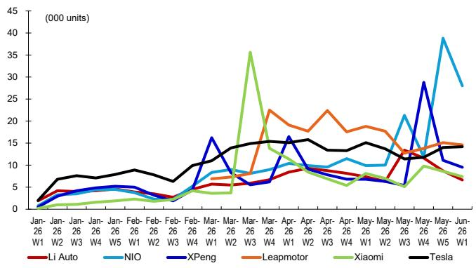

# DB：中国新能源车市最值得关注的不是总量，而是订单结构的剧烈分化

6月第一周的新能源车订单数据，看似平淡，实则暗流涌动。

DB最新发布的周度订单追踪显示，6月首周（W23）主要新能源车企合计订单环比下滑约5%，同比更是下降了约15%。如果只看这个数字，很容易得出“需求疲软”的结论。但这份报告的价值，恰恰在于它揭示了总量数字之下，各家车企正在经历的截然不同的命运。

真正重要的判断是：中国新能源车市场的竞争，已经从“谁能卖得更多”进入了“谁的订单结构更健康”的阶段。市场目前定价的核心变量，并非整体需求是否复苏，而是企业能否在订单波动中证明自己的定价能力和品牌黏性。

为什么这个时间点重要？因为5月刚经历了一轮由新车型发布和促销活动驱动的订单脉冲，6月首周的回落，恰好是检验哪些品牌拥有真实需求、哪些只是靠一次性刺激撑起数据的试金石。

以下，我们从这份研报的订单数据中，提炼出五个关键判断。

## 1. 比亚迪的订单滑坡，暴露了规模领先者的结构性隐患

6月首周，比亚迪订单量为4.77万辆，环比下滑2%，同比骤降36%。这是所有主要车企中同比降幅最大的。更值得警惕的是，这一数字不仅远低于去年同期的7.5万辆，也低于今年5月最后一周的4.87万辆。

表面上看，这是高基数效应——去年6月正值比亚迪多款冠军版车型密集上市。但问题不止于此。从更长的时间序列看，比亚迪的周度订单自3月第4周达到8.5万辆的峰值后，便进入了下行通道。尽管4月第1周仍维持在6.5万辆，但此后多数时间徘徊在4.5-5.5万辆区间。

这意味着什么？比亚迪的订单中枢正在下移。市场此前对比亚迪的定价，很大程度上基于其“规模效应持续放大”的叙事。但如果订单量无法维持在高位，规模效应的边际贡献就会递减，而固定成本分摊的压力反而会上升。

这里需要指出一个报告没有完全展开的隐含含义：比亚迪的订单下滑，可能是其产品矩阵内部竞争加剧的结果。当王朝网和海洋网的产品线越来越密集，消费者在不同车型之间的选择反而可能延迟决策，甚至出现“内部替代”效应。这个问题，目前尚未被市场充分定价。

## 2. 问界的“过山车”订单，揭示出华为生态的爆发力与脆弱性并存

HIMA（鸿蒙智行，主要以问界为代表）6月首周订单2.42万辆，环比大幅下滑41%，但同比增长112%。这个数据放在月度趋势中看尤为戏剧性：4月第4周，问界订单曾飙升至6.5万辆；5月最后一周又回升至4.1万辆；然后6月首周迅速回落。

这种脉冲式订单模式，在问界身上已经重复出现多次。每次新车型发布或重大OTA升级前后，订单都会出现一个尖峰，随后快速回落。这与特斯拉早期的模式有些相似——品牌关注度极高，但消费者的购买决策受新闻周期和营销事件驱动明显。

关键在于，这种模式的可持续性面临两个考验。第一，每次脉冲的峰值是否在衰减？从数据看，4月第4周的6.5万辆明显高于3月第4周的1.1万辆，但5月第4周的4.1万辆已经低于4月峰值。第二，脉冲之间的“谷底”是否在抬升？目前来看，问界的周度订单在非高峰期已从年初的2-3万辆提升到3-4万辆，这是一个积极信号。

报告没有直接给出结论，但数据暗示：问界正在从“纯事件驱动”向“品牌驱动”过渡，但过渡尚未完成。如果接下来两个月没有重大新品发布，问界的订单能否稳定在3万辆以上，将是检验其品牌黏性的关键窗口。

## 3. 蔚来的订单奇迹，需要拆解交付数据来验证真实转化率

蔚来是6月首周最大的亮点：订单2.8万辆，同比增长419%，环比仅下滑28%。更惊人的是，就在5月最后一周，蔚来订单曾达到3.9万辆——这个数字甚至超过了比亚迪同期的4.8万辆。

从更长时间轴看，蔚来订单的爆发始于5月第3周，从之前的周均1万辆左右直接跳升到2.1万辆，随后在第5周达到3.9万辆的峰值。这种陡峭的增长曲线，通常对应着新车型上市或重大价格调整。报告没有明确指出具体原因，但从市场公开信息可以推断，蔚来子品牌乐道的首款车型L60的预售，以及蔚来主品牌在BaaS电池租赁方案上的调整，共同推动了这一波订单潮。

但这里有一个报告尚未回答的关键问题：订单到交付的转化率。蔚来历史上一直面临订单转化周期长的问题，部分原因在于其换电网络和BaaS方案的复杂性。如果这波订单中有大量是“可退意向金”或“长交付周期订单”，那么实际交付量可能与订单量存在较大偏差。

对于投资者而言，接下来需要关注的不是订单还能不能继续增长，而是6月和7月的交付数据能否匹配订单的爆发。这才是检验蔚来订单质量的真正标尺。

## 4. 理想和小鹏的订单停滞，说明“性价比”策略正在失效

理想汽车6月首周订单仅6700辆，环比下滑24%，同比下降25%。小鹏汽车订单9500辆，环比下滑14%，同比下降16%。这两家曾经的新势力头部玩家，如今在订单量上已经被蔚来、问界甚至小米甩开。

理想的困境更为典型。从月度趋势看，理想在5月第3周曾短暂冲高至1.35万辆，但随后迅速回落。这种“冲高回落”的形态，在理想L6上市后的表现中尤为明显。L6作为理想目前售价最低的车型，确实在上市初期带来了订单增量，但这种增量似乎正在快速消耗。

问题出在哪里？理想的“家庭定位”和“增程路线”曾经是其护城河，但如今问界M7、比亚迪唐等竞品在相同价位段提供了更丰富的智能化和舒适配置。当产品力差距缩小，品牌溢价就无法维持。小鹏的情况类似，其G6和X9虽然产品力不俗，但在价格战中没有建立起清晰的品牌认知。

这两个案例共同指向一个结论：在2026年的中国新能源车市场，“性价比”已经不是一个有效的竞争策略。因为所有车企都在卷价格，消费者对“便宜”的感知阈值越来越高。真正能带来订单黏性的，是品牌定位的独特性、技术体验的差异化，以及用户社群的真实活跃度。理想和小鹏在这三个维度上，目前都还没有找到新的突破口。

## 5. 报告没有完全回答的：订单数据的“含金量”如何评估？

这份DB研报提供了宝贵的周度订单高频数据，但作为一个严谨的分析框架，它至少留下了三个值得进一步探讨的问题。

第一，订单的定义不统一。不同车企对“新订单”的统计口径可能不同——是意向金订单、可退订单，还是不可退的定金订单？这个差异会直接影响订单向交付的转化率。报告没有披露各车企的订单定义，这意味着读者需要自行判断数据的可比性。

第二，订单的“来源结构”未被拆解。有多少订单来自老车主增换购？有多少来自竞品转化？有多少来自渠道压库？这些信息对于判断订单的可持续性至关重要。一个来自老车主的订单，与一个被促销活动吸引的新客户订单，其品牌忠诚度和后续价值完全不同。

第三，订单数据的领先性正在减弱。在快速交付成为行业标配的背景下，订单到交付的时间差已经从过去的数周缩短到数天。这意味着订单数据的预测价值在下降——它更多反映的是当下的市场热度，而非未来的交付趋势。

这些未解问题，恰恰是深入理解中国新能源车竞争格局的关键切入点。

## 从订单看竞争：谁在“造血”，谁在“输血”

综合以上分析，我们可以提炼出一个简化的观察框架：将主要车企按“订单质量”分为三类。

第一类是“造血型”企业，其订单具有可持续性强、转化率高、品牌溢价稳定的特征。目前来看，特斯拉和比亚迪虽然体量最大，但都面临订单中枢下移的压力，严格来说还不能算作完全的“造血型”。蔚来如果能在未来两个月证明其订单转化率，有望进入这一梯队。

第二类是“脉冲型”企业，其订单高度依赖新品发布和营销事件，波动剧烈。问界是最典型的代表，小米也呈现出类似特征。这类企业的投资价值，取决于市场是否愿意为其“爆发力”支付溢价，以及企业能否通过持续的产品迭代将脉冲转化为稳态。

第三类是“输血型”企业，其订单增长主要依靠降价和促销，一旦价格刺激停止，订单就会迅速回落。理想和小鹏目前处于这个区间。对于这类企业，投资者需要警惕的是：价格战是消耗战，最终比拼的是谁的资金储备更厚，而不是谁的产品更好。

这份DB的研报，本质上是在用高频数据为上述分类提供实证依据。但报告的价值不止于此——它还暗示了一个更深层的判断：中国新能源车市场的下一个拐点，可能不是需求总量的见顶，而是“订单质量”成为定价核心因子。那些能够把脉冲式订单转化为稳定流量的企业，将在下一轮竞争中占据结构性的优势。

而这些判断背后，还有大量图表细节和二阶推演，无法在一篇导读中完全展开。如果你对特定车企的订单结构、交付转化率，或者不同车型的订单分布感兴趣，欢迎来星球微信群里继续讨论。我们会基于这份研报的原始数据，做更细致的拆解和推演。

Personal reading notes and learning share only. Not investment advice.

