## China Healthcare: May 2026 China hospital equipment bidding: Single-month bidding value marginally turned positive yoy

We continue to track bidding data for 9 types of medical equipment. After five consecutive months of yoy decline since last December, the total bidding value of these 9 equipment categories recorded a slight yoy increase of $+0.1\%$ in May. We believe this is in line with our previous expectation that the sector would move from a mild yoy decline to a mild yoy growth phase, and we still expect a more visible recovery in the industry to emerge in 2H26.

By equipment category, only CT, MRI, and LINAC recorded positive yoy growth in May. Patient monitors, which had previously sustained positive growth, failed to maintain their strong momentum. However, considering that many monitors procured during the Covid period are now entering the replacement cycle, we remain constructive on a potential improvement in patient monitor bidding data going forward.

Exhibit 1: Total bidding value of 9 main medical devices in China In Rmb, mn  

stacked bar chart

| Month | Patient monitor | Ultrasound | Endoscope | CT | MRI | PET-CT | DR | LINAC | DSA (IGT) |
| --- | --- | --- | --- | --- | --- | --- | --- | --- | --- |
| Jan-23 | 500 | 3500 | 4000 | 1800 | 2500 | 1000 | 500 | 200 | 1500 |
| Mar-23 | 500 | 1800 | 2500 | 1800 | 1800 | 500 | 200 | 100 | 2500 |
| May-23 | 500 | 1800 | 2500 | 1800 | 1800 | 500 | 200 | 100 | 2500 |
| Jul-23 | 500 | 1800 | 2500 | 1800 | 1800 | 500 | 200 | 100 | 2500 |
| Sep-23 | 500 | 1800 | 2500 | 1800 | 1800 | 500 | 200 | 100 | 2500 |
| Nov-23 | 500 | 1800 | 2500 | 1800 | 1800 | 500 | 200 | 100 | 2500 |
| Jan-24 | 500 | 1800 | 2500 | 1800 | 1800 | 500 | 200 | 100 | 2500 |
| Mar-24 | 500 | 1800 | 2500 | 1800 | 1800 | 500 | 200 | 100 | 2500 |
| May-24 | 500 | 1800 | 2500 | 1800 | 1800 | 500 | 200 | 100 | 2500 |
| Jul-24 | 500 | 1800 | 2500 | 1800 | 1800 | 500 | 200 | 100 | 2500 |
| Sep-24 | 500 | 1800 | 2500 | 1800 | 1800 | 500 | 200 | 100 | 2500 |
| Nov-24 | 500 | 1800 | 2500 | 1800 | 1800 | 500 | 200 | 100 | 2500 |

Source: Joinchain

## Tianyi Yan

+86(21)2401-8609

tianyi.yan@goldmansachs.cn

GS (China) Securities

Company Limited

## Ziyi Chen

+852-2978-0526 | ziyi.chen@gs.com

GS (Asia) L.L.C.

## Michael Zheng

+86(21)2401-8928

michael.zheng@goldmansachs.cn

GS (China) Securities

Company Limited

GS does and seeks to do business with companies covered in its research reports. As a result, investors should be aware that the firm may have a conflict of interest that could affect the objectivity of this report. Investors should consider this report as only a single factor in making their investment decision. For Reg AC certification and other important disclosures, see the Disclosure Appendix, or go to www.gs.com/research/hedge.html. Analysts employed by non-US affiliates are not registered/qualified as research analysts with FINRA in the U.S.

Exhibit 2: The YoY change rate of bidding value  
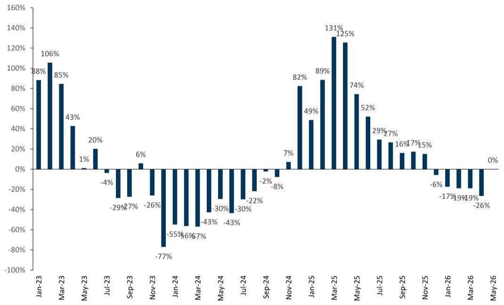

bar chart

| Month | Value (%) |
|---|---|
| Jan-23 | 88 |
| Feb-23 | 106 |
| Mar-23 | 85 |
| Apr-23 | 43 |
| May-23 | 1 |
| Jun-23 | 20 |
| Jul-23 | -4 |
| Aug-23 | -29 |
| Sep-23 | -27 |
| Oct-23 | -26 |
| Nov-23 | -77 |
| Dec-23 | -55 |
| Jan-24 | -56 |
| Feb-24 | -57 |
| Mar-24 | -43 |
| Apr-24 | -30 |
| May-24 | -43 |
| Jun-24 | -30 |
| Jul-24 | -22 |
| Aug-24 | -2 |
| Sep-24 | -8 |
| Oct-24 | 7 |
| Nov-24 | 82 |
| Dec-24 | 49 |
| Jan-25 | 89 |
| Feb-25 | 131 |
| Mar-25 | 125 |
| Apr-25 | 74 |
| May-25 | 52 |
| Jun-25 | 29 |
| Jul-25 | 27 |
| Aug-25 | 16 |
| Sep-25 | 17 |
| Oct-25 | 15 |
| Nov-25 | -6 |
| Dec-25 | -17 |
| Jan-26 | -19 |
| Feb-26 | -19 |
| Mar-26 | -26 |
| Apr-26 | 0 |

Source: Joinchain

## Read across to Mindray and United Imaging

For United Imaging, its bidding value increased by +9% yoy in the first five months of this year, making it the only company among its major competitors – including GEHC, Siemens Healthineers, Philips, and Neusoft – to deliver positive growth. We believe this was mainly driven by the company’s stable market share in CT and MRI, as well as share gains in categories such as DSA and LINAC. The company’s recently announced new equity incentive plan calls for annual revenue growth of over 20% in each of 2026-28; otherwise, the plan would not be fully triggered. Considering that domestic tendering demand is still in the early stage of recovery, our current forecast remains slightly below the company’s implied guidance, at 19.3%. We expect the company’s overseas growth rate in 2026 will still be higher than its domestic growth rate, and its revenue contribution will exceed 25%.

Exhibit 3: Revenue breakdown by geography for United Imaging

<table><tr><td>In Rmb, mn</td><td>FY24</td><td>FY25</td><td>1Q26</td><td>FY26E</td></tr><tr><td>By geography</td><td></td><td></td><td></td><td></td></tr><tr><td>China domestic</td><td>8,034</td><td>10,369</td><td>2,198</td><td>11,717</td></tr><tr><td>yoy</td><td>-17.5%</td><td>29.1%</td><td>15.0%</td><td>13.0%</td></tr><tr><td>Overseas</td><td>2,266</td><td>3,431</td><td>710</td><td>4,752</td></tr><tr><td>yoy</td><td>35.0%</td><td>51.4%</td><td>25.2%</td><td>38.5%</td></tr><tr><td>Total revenue</td><td>10,300</td><td>13,800</td><td>2,908</td><td>16,469</td></tr><tr><td>yoy</td><td>-9.7%</td><td>34.0%</td><td>17.3%</td><td>19.3%</td></tr></table>

Source: Company data, GS Global Investment Research

For Mindray, in 1Q26 the company's revenue in China decreased by $-11\%$ yoy, while overseas revenue grew by $+16\%$ yoy (or $+20\%$ yoy when denominated in USD). Its emerging businesses achieved rapid growth both in China and overseas. However, its PMLS and medical imaging businesses in the Chinese market are still under the

destocking process (the company has now guided for the process to end in 2Q26), while the IVD business showed some improvement, especially with the coagulation and immunology businesses are both growing by approximately +10% yoy per the company. Furthermore, the company stated that the average market share of its three core IVD businesses—immunology, biochemistry, and coagulation—increased from 10% in 1H25 to 12% at YE25, and further rose to 13% in 1Q26. We expect the company’s China revenue to achieve positive growth in 2025 from a low base, while overseas markets will continue to maintain double-digit growth.

Exhibit 4: Revenue breakdown for Mindray

<table><tr><td rowspan="2"></td><td colspan="2">2025A</td><td colspan="2">1Q26A</td><td colspan="2">2026E</td></tr><tr><td>Revenue Rmb, mn</td><td>yoy %</td><td>Revenue Rmb, mn</td><td>yoy %</td><td>Revenue Rmb, mn</td><td>yoy %</td></tr><tr><td>Total revenue</td><td>33,282</td><td>-9%</td><td>8,352</td><td>1%</td><td>36,067</td><td>8%</td></tr><tr><td>China</td><td>15,632</td><td>-23%</td><td>3,903</td><td>-11%</td><td>16,169</td><td>3%</td></tr><tr><td>PMLS</td><td>2,522</td><td>-56%</td><td>475</td><td>-44%</td><td>2,404</td><td>-5%</td></tr><tr><td>Medical Imaging</td><td>2,029</td><td>-43%</td><td>461</td><td>-37%</td><td>2,027</td><td>0%</td></tr><tr><td>IVD</td><td>7,508</td><td>-17%</td><td>1,951</td><td>-3%</td><td>7,309</td><td>-3%</td></tr><tr><td>APT Medical</td><td>2,584</td><td>25%</td><td>704</td><td>25%</td><td>3,227</td><td>25%</td></tr><tr><td>Other Emerging Businesses</td><td>989</td><td>NA</td><td>312</td><td>31%</td><td>1,200</td><td>21%</td></tr><tr><td>Overseas</td><td>17,650</td><td>7%</td><td>4,449</td><td>16%</td><td>19,898</td><td>13%</td></tr><tr><td>PMLS</td><td>7,315</td><td>-6%</td><td>1,789</td><td>15%</td><td>7,916</td><td>8%</td></tr><tr><td>Medical Imaging</td><td>3,688</td><td>-6%</td><td>935</td><td>10%</td><td>4,113</td><td>12%</td></tr><tr><td>IVD</td><td>4,732</td><td>1%</td><td>1,242</td><td>20%</td><td>5,571</td><td>18%</td></tr><tr><td>Emerging Businesses</td><td>1,915</td><td>NA</td><td>483</td><td>19%</td><td>2,298</td><td>20%</td></tr><tr><td>Net profit</td><td>8,136</td><td>-30%</td><td>2,330</td><td>-11%</td><td>8,306</td><td>2%</td></tr></table>

Source: Company data, GS Global Investment Research

## Detailed bidding data in nine categories

Exhibit 5: Patient monitor procurement value since Jan-23  
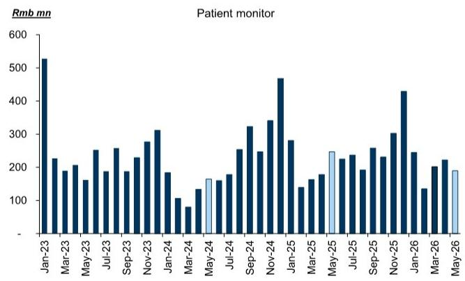

bar chart

Patient monitor
| Month | Value (Rmb mn) |
|---|---|
| Jan-23 | 530 |
| Mar-23 | 225 |
| May-23 | 185 |
| Jul-23 | 255 |
| Sep-23 | 185 |
| Nov-23 | 280 |
| Jan-24 | 310 |
| Mar-24 | 110 |
| May-24 | 90 |
| Jul-24 | 160 |
| Sep-24 | 250 |
| Nov-24 | 330 |
| Jan-25 | 470 |
| Mar-25 | 140 |
| May-25 | 170 |
| Jul-25 | 230 |
| Sep-25 | 190 |
| Nov-25 | 260 |
| Jan-26 | 305 |
| Mar-26 | 430 |
| May-26 | 245 |
| May-26 (light blue bar) | 190 |

Source: Joinchain

Exhibit 6: Patient monitor procurement value decreased by -23% yoy in May-26 vs. +25% in Apr-26  
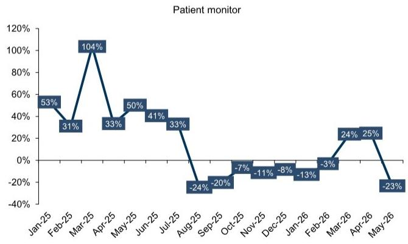

line chart

Patient monitor
| Month | Value (%) |
|---|---|
| Jan-25 | 53 |
| Feb-25 | 31 |
| Mar-25 | 104 |
| Apr-25 | 33 |
| May-25 | 50 |
| Jun-25 | 41 |
| Jul-25 | -33 |
| Aug-25 | -24 |
| Sep-25 | -20 |
| Oct-25 | -7 |
| Nov-25 | -11 |
| Dec-25 | -8 |
| Jan-26 | -13 |
| Feb-26 | -3 |
| Mar-26 | 24 |
| Apr-26 | 25 |
| May-26 | -23 |

Source: Joinchain

Exhibit 7: Endoscope procurement value since Jan-23  
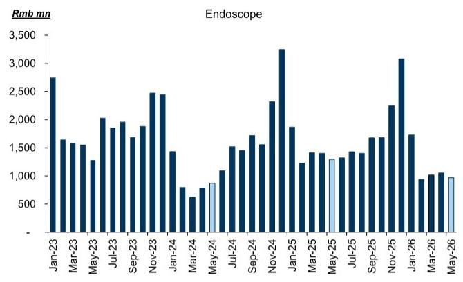

bar chart

Endoscope
| Month | Endoscope (Rmb mn) |
|---|---|
| Jan-23 | 2750 |
| Feb-23 | 1650 |
| Mar-23 | 1600 |
| Apr-23 | 1550 |
| May-23 | 1300 |
| Jun-23 | 2050 |
| Jul-23 | 1850 |
| Aug-23 | 1950 |
| Sep-23 | 1700 |
| Oct-23 | 1900 |
| Nov-23 | 2450 |
| Dec-23 | 2450 |
| Jan-24 | 1450 |
| Feb-24 | 800 |
| Mar-24 | 600 |
| Apr-24 | 750 |
| May-24 | 850 |
| Jun-24 | 1100 |
| Jul-24 | 1550 |
| Aug-24 | 1450 |
| Sep-24 | 1750 |
| Oct-24 | 1550 |
| Nov-24 | 2300 |
| Dec-24 | 3250 |
| Jan-25 | 1900 |
| Feb-25 | 1250 |
| Mar-25 | 1450 |
| Apr-25 | 1450 |
| May-25 | 1350 |
| Jun-25 | 1350 |
| Jul-25 | 1450 |
| Aug-25 | 1400 |
| Sep-25 | 1700 |
| Oct-25 | 1700 |
| Nov-25 | 2250 |
| Dec-25 | 3100 |
| Jan-26 | 1750 |
| Feb-26 | 950 |
| Mar-26 | 1050 |
| Apr-26 | 1050 |
| May-26 | 1000 |

Source: Joinchain

Exhibit 8: Endoscope procurement value decreased by -25% yoy in May-26 vs. -25% in Apr-26  
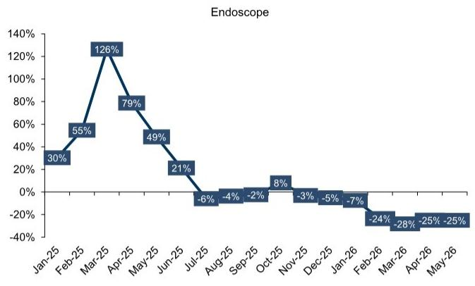

line chart

Endoscope
| Month | Value (%) |
|---|---|
| Jan-25 | 30 |
| Feb-25 | 55 |
| Mar-25 | 126 |
| Apr-25 | 79 |
| May-25 | 49 |
| Jun-25 | 21 |
| Jul-25 | -6 |
| Aug-25 | -4 |
| Sep-25 | -2 |
| Oct-25 | 8 |
| Nov-25 | -3 |
| Dec-25 | -5 |
| Jan-26 | -7 |
| Feb-26 | -24 |
| Mar-26 | -28 |
| Apr-26 | -25 |
| May-26 | -25 |

Source: Joinchain

Exhibit 9: Ultrasound procurement value since Jan-23  
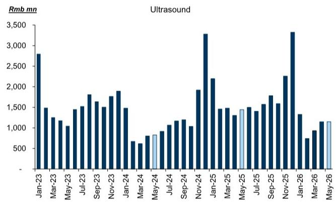

bar chart

Ultrasound
| Month | Value (Rmb mn) |
|---|---|
| Jan-23 | 2800 |
| Feb-23 | 1500 |
| Mar-23 | 1250 |
| Apr-23 | 1150 |
| May-23 | 1050 |
| Jun-23 | 1450 |
| Jul-23 | 1500 |
| Aug-23 | 1800 |
| Sep-23 | 1650 |
| Oct-23 | 1500 |
| Nov-23 | 1750 |
| Dec-23 | 1900 |
| Jan-24 | 1450 |
| Feb-24 | 650 |
| Mar-24 | 600 |
| Apr-24 | 800 |
| May-24 | 850 |
| Jun-24 | 900 |
| Jul-24 | 1050 |
| Aug-24 | 1150 |
| Sep-24 | 1200 |
| Oct-24 | 1050 |
| Nov-24 | 1950 |
| Dec-24 | 3300 |
| Jan-25 | 2200 |
| Feb-25 | 1450 |
| Mar-25 | 1500 |
| Apr-25 | 1350 |
| May-25 | 1450 |
| Jun-25 | 1500 |
| Jul-25 | 1400 |
| Aug-25 | 1550 |
| Sep-25 | 1750 |
| Oct-25 | 1600 |
| Nov-25 | 2250 |
| Dec-25 | 3350 |
| Jan-26 | 1350 |
| Feb-26 | 750 |
| Mar-26 | 950 |
| Apr-26 | 1150 |
| May-26 | 1150 |

Source: Joinchain

Exhibit 10: Ultrasound procurement value decreased by $-20\%$ in May-26 yoy vs. $-12\%$ in Apr-26  
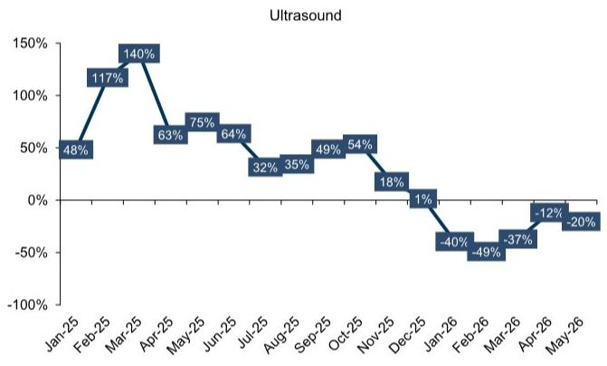

line chart

Ultrasound
| Month | Value (%) |
|---|---|
| Jan-25 | 48 |
| Feb-25 | 117 |
| Mar-25 | 140 |
| Apr-25 | 63 |
| May-25 | 75 |
| Jun-25 | 64 |
| Jul-25 | 32 |
| Aug-25 | 35 |
| Sep-25 | 49 |
| Oct-25 | 54 |
| Nov-25 | 18 |
| Dec-25 | 1 |
| Jan-26 | -40 |
| Feb-26 | -49 |
| Mar-26 | -37 |
| Apr-26 | -12 |
| May-26 | -20 |

Source: Joinchain

Exhibit 11: CT scanner procurement value since Jan-23  
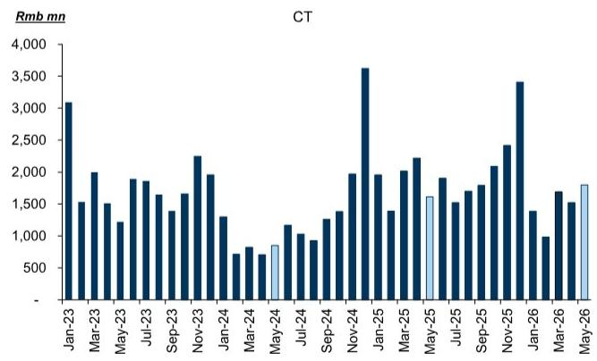

bar chart

CT
| Month | Value (Rmb mn) |
|---|---|
| Jan-23 | 3100 |
| Feb-23 | 1550 |
| Mar-23 | 2000 |
| Apr-23 | 1500 |
| May-23 | 1200 |
| Jun-23 | 1900 |
| Jul-23 | 1850 |
| Aug-23 | 1650 |
| Sep-23 | 1400 |
| Oct-23 | 1700 |
| Nov-23 | 2250 |
| Dec-23 | 1950 |
| Jan-24 | 1300 |
| Feb-24 | 750 |
| Mar-24 | 850 |
| Apr-24 | 700 |
| May-24 | 850 |
| Jun-24 | 1150 |
| Jul-24 | 1050 |
| Aug-24 | 950 |
| Sep-24 | 1250 |
| Oct-24 | 1400 |
| Nov-24 | 1950 |
| Dec-24 | 3600 |
| Jan-25 | 1950 |
| Feb-25 | 1400 |
| Mar-25 | 2050 |
| Apr-25 | 2200 |
| May-25 | 1600 |
| Jun-25 | 1950 |
| Jul-25 | 1550 |
| Aug-25 | 1700 |
| Sep-25 | 1800 |
| Oct-25 | 2100 |
| Nov-25 | 2450 |
| Dec-25 | 3450 |
| Jan-26 | 1400 |
| Feb-26 | 1000 |
| Mar-26 | 1700 |
| Apr-26 | 1600 |
| May-26 | 1800 |

Source: Joinchain

Exhibit 12: CT scanner procurement value increased by +12% yoy in May-26 vs. -31% in Apr-26  
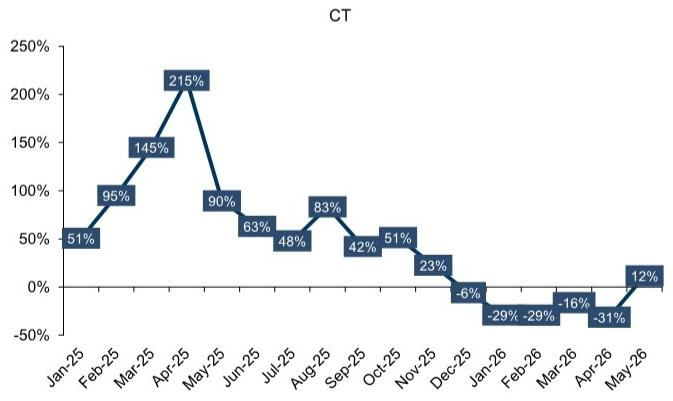

line chart

CT
| Month | Value (%) |
|---|---|
| Jan-25 | -51 |
| Feb-25 | 95 |
| Mar-25 | 145 |
| Apr-25 | 215 |
| May-25 | 90 |
| Jun-25 | 63 |
| Jul-25 | 48 |
| Aug-25 | 83 |
| Sep-25 | 42 |
| Oct-25 | 51 |
| Nov-25 | 23 |
| Dec-25 | -6 |
| Jan-26 | -29 |
| Feb-26 | -29 |
| Mar-26 | -16 |
| Apr-26 | -31 |
| May-26 | 12 |

Source: Joinchain

Exhibit 13: MRI procurement value since Jan-23  
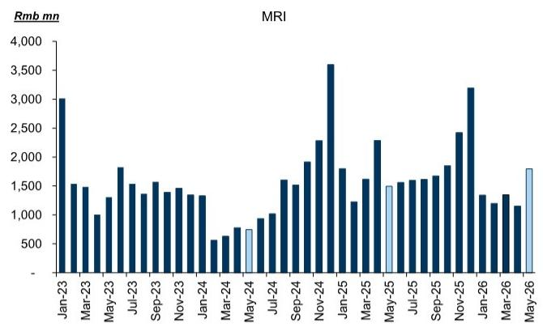

bar chart

MRI
| Month | Value (Rmb mn) |
|---|---|
| Jan-23 | 3050 |
| Feb-23 | 1550 |
| Mar-23 | 1480 |
| Apr-23 | 1000 |
| May-23 | 1300 |
| Jun-23 | 1850 |
| Jul-23 | 1550 |
| Aug-23 | 1400 |
| Sep-23 | 1600 |
| Oct-23 | 1480 |
| Nov-23 | 1450 |
| Dec-23 | 1380 |
| Jan-24 | 1350 |
| Feb-24 | 600 |
| Mar-24 | 700 |
| Apr-24 | 780 |
| May-24 | 850 |
| Jun-24 | 950 |
| Jul-24 | 1050 |
| Aug-24 | 1600 |
| Sep-24 | 1550 |
| Oct-24 | 1950 |
| Nov-24 | 2300 |
| Dec-24 | 3600 |
| Jan-25 | 1800 |
| Feb-25 | 1250 |
| Mar-25 | 1650 |
| Apr-25 | 2300 |
| May-25 | 1550 |
| Jun-25 | 1650 |
| Jul-25 | 1650 |
| Aug-25 | 1650 |
| Sep-25 | 1700 |
| Oct-25 | 1850 |
| Nov-25 | 2450 |
| Dec-25 | 3200 |
| Jan-26 | 1350 |
| Feb-26 | 1250 |
| Mar-26 | 1350 |
| Apr-26 | 1150 |
| May-26 | 1800 |

Source: Joinchain

Exhibit 14: MRI procurement value increased by $+20\%$ yoy in May-26 vs. $-50\%$ in Apr-26  
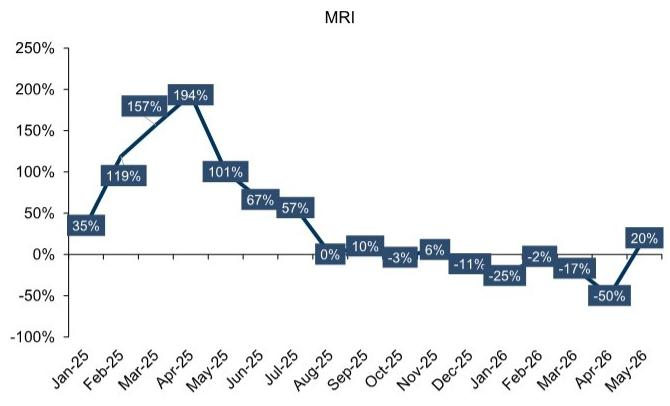

line chart

MRI
| Month | Value (%) |
|---|---|
| Jan-25 | 35 |
| Feb-25 | 119 |
| Mar-25 | 157 |
| Apr-25 | 194 |
| May-25 | 101 |
| Jun-25 | 67 |
| Jul-25 | 57 |
| Aug-25 | -0 |
| Sep-25 | 10 |
| Oct-25 | -3 |
| Nov-25 | 6 |
| Dec-25 | -11 |
| Jan-26 | -25 |
| Feb-26 | -2 |
| Mar-26 | -17 |
| Apr-26 | -50 |
| May-26 | 20 |

Source: Joinchain

Exhibit 15: PET-CT procurement value since Jan-23  
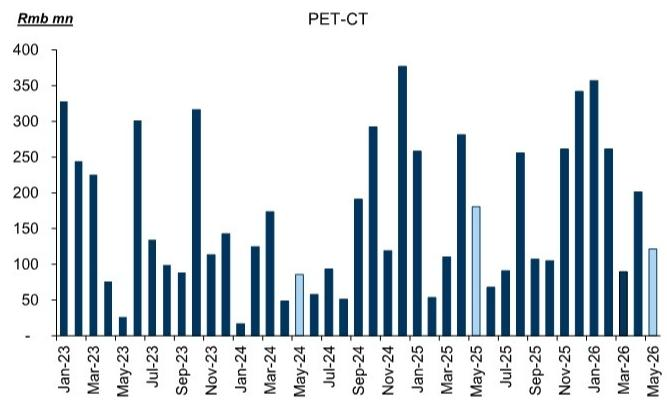

bar chart

PET-CT
| Month | Value (Rmb mn) |
|---|---|
| Jan-23 | 330 |
| Feb-23 | 245 |
| Mar-23 | 225 |
| Apr-23 | 75 |
| May-23 | 25 |
| Jun-23 | 300 |
| Jul-23 | 135 |
| Aug-23 | 95 |
| Sep-23 | 85 |
| Oct-23 | 315 |
| Nov-23 | 115 |
| Dec-23 | 140 |
| Jan-24 | 20 |
| Feb-24 | 125 |
| Mar-24 | 170 |
| Apr-24 | 45 |
| May-24 | 85 |
| Jun-24 | 55 |
| Jul-24 | 90 |
| Aug-24 | 50 |
| Sep-24 | 190 |
| Oct-24 | 290 |
| Nov-24 | 115 |
| Dec-24 | 375 |
| Jan-25 | 255 |
| Feb-25 | 50 |
| Mar-25 | 110 |
| Apr-25 | 280 |
| May-25 | 175 |
| Jun-25 | 65 |
| Jul-25 | 90 |
| Aug-25 | 250 |
| Sep-25 | 105 |
| Oct-25 | 105 |
| Nov-25 | 260 |
| Dec-25 | 340 |
| Jan-26 | 355 |
| Feb-26 | 260 |
| Mar-26 | 85 |
| Apr-26 | 195 |
| May-26 | 115 |

Source: Joinchain

Exhibit 16: PET-CT procurement value decreased by $-33\%$ yoy in May-26 vs. $-28\%$ in Apr-26  
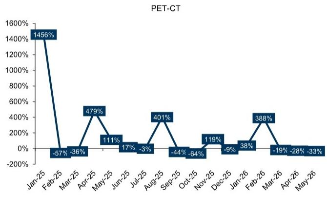

line chart

PET-CT
| Month | Value (%) |
|---|---|
| Jan-25 | 1456 |
| Feb-25 | -57 |
| Mar-25 | -36 |
| Apr-25 | 479 |
| May-25 | 111 |
| Jun-25 | 17 |
| Jul-25 | -3 |
| Aug-25 | 401 |
| Sep-25 | -44 |
| Oct-25 | -64 |
| Nov-25 | 119 |
| Dec-25 | -9 |
| Jan-26 | 38 |
| Feb-26 | 388 |
| Mar-26 | -19 |
| Apr-26 | -28 |
| May-26 | -33 |

Source: Joinchain

Exhibit 17: DR procurement value since Jan-23  
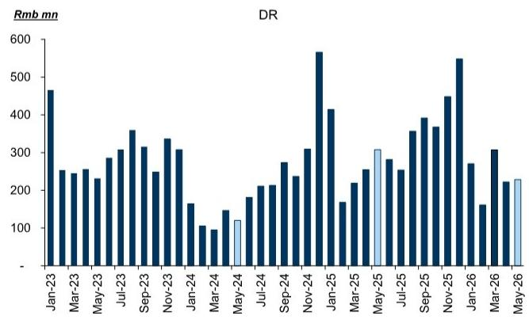

bar chart

| Month | DR (Rmb mn) |
|---|---|
| Jan-23 | 470 |
| Feb-23 | 255 |
| Mar-23 | 255 |
| Apr-23 | 235 |
| May-23 | 285 |
| Jun-23 | 305 |
| Jul-23 | 360 |
| Aug-23 | 315 |
| Sep-23 | 245 |
| Oct-23 | 335 |
| Nov-23 | 305 |
| Dec-23 | 160 |
| Jan-24 | 105 |
| Feb-24 | 90 |
| Mar-24 | 140 |
| Apr-24 | 115 |
| May-24 | 180 |
| Jun-24 | 210 |
| Jul-24 | 215 |
| Aug-24 | 270 |
| Sep-24 | 235 |
| Oct-24 | 305 |
| Nov-24 | 565 |
| Dec-24 | 415 |
| Jan-25 | 165 |
| Feb-25 | 215 |
| Mar-25 | 255 |
| Apr-25 | 305 |
| May-25 | 280 |
| Jun-25 | 250 |
| Jul-25 | 360 |
| Aug-25 | 390 |
| Sep-25 | 360 |
| Oct-25 | 445 |
| Nov-25 | 550 |
| Dec-25 | 270 |
| Jan-26 | 155 |
| Feb-26 | 305 |
| Mar-26 | 215 |
| Apr-26 | 230 |

Source: Joinchain

Exhibit 18: DR procurement value decreased by $-26\%$ yoy in May-26 vs. $-13\%$ in Apr-26  
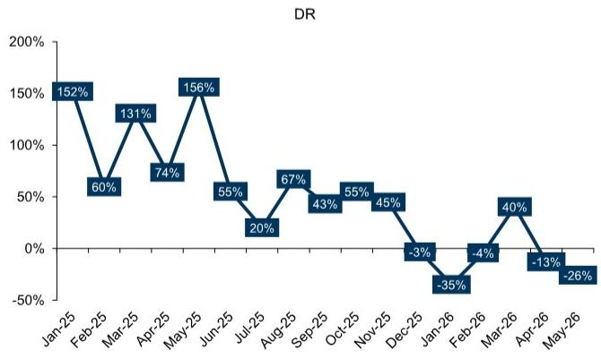

line chart

DR
| Month | Value (%) |
|---|---|
| Jan-25 | 152 |
| Feb-25 | 60 |
| Mar-25 | 131 |
| Apr-25 | 74 |
| May-25 | 156 |
| Jun-25 | 55 |
| Jul-25 | 20 |
| Aug-25 | 67 |
| Sep-25 | 43 |
| Oct-25 | 55 |
| Nov-25 | 45 |
| Dec-25 | -3 |
| Jan-26 | -35 |
| Feb-26 | -4 |
| Mar-26 | 40 |
| Apr-26 | -13 |
| May-26 | -26 |

Source: Joinchain

Exhibit 19: LINAC procurement value since Jan-23  
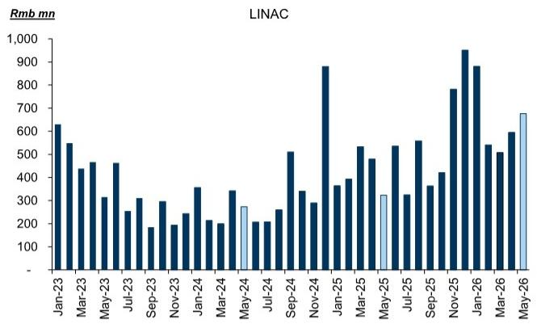

bar chart

LINAC
| Month | Value (Rmb mn) |
|---|---|
| Jan-23 | 635 |
| Feb-23 | 550 |
| Mar-23 | 440 |
| Apr-23 | 470 |
| May-23 | 315 |
| Jun-23 | 460 |
| Jul-23 | 255 |
| Aug-23 | 310 |
| Sep-23 | 185 |
| Oct-23 | 295 |
| Nov-23 | 190 |
| Dec-23 | 245 |
| Jan-24 | 360 |
| Feb-24 | 210 |
| Mar-24 | 205 |
| Apr-24 | 345 |
| May-24 | 275 |
| Jun-24 | 205 |
| Jul-24 | 195 |
| Aug-24 | 255 |
| Sep-24 | 510 |
| Oct-24 | 340 |
| Nov-24 | 290 |
| Dec-24 | 880 |
| Jan-25 | 365 |
| Feb-25 | 390 |
| Mar-25 | 540 |
| Apr-25 | 480 |
| May-25 | 320 |
| Jun-25 | 540 |
| Jul-25 | 325 |
| Aug-25 | 560 |
| Sep-25 | 360 |
| Oct-25 | 420 |
| Nov-25 | 780 |
| Dec-25 | 940 |
| Jan-26 | 880 |
| Feb-26 | 540 |
| Mar-26 | 500 |
| Apr-26 | 600 |
| May-26 | 670 |

Source: Joinchain

Exhibit 20: LINAC procurement value increased by +109% yoy in May-26 vs. +24% in Apr-26  
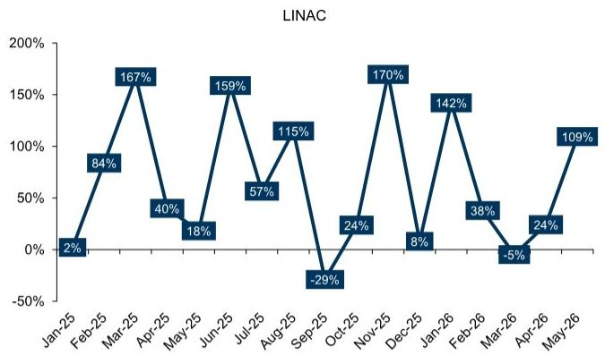

line chart

LINAC
| Month | Value (%) |
|---|---|
| Jan-25 | 2 |
| Feb-25 | 84 |
| Mar-25 | 167 |
| Apr-25 | 40 |
| May-25 | 18 |
| Jun-25 | 159 |
| Jul-25 | 57 |
| Aug-25 | 115 |
| Sep-25 | -29 |
| Oct-25 | 24 |
| Nov-25 | 170 |
| Dec-25 | 8 |
| Jan-26 | 142 |
| Feb-26 | 38 |
| Mar-26 | -5 |
| Apr-26 | 24 |
| May-26 | 109 |

Source: Joinchain

Exhibit 21: DSA (IGT) procurement value since Jan-23  
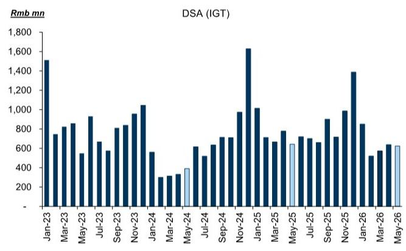

bar chart

DSA (IGT)
| Month | Value (Rmb mn) |
|---|---|
| Jan-23 | 1520 |
| Feb-23 | 740 |
| Mar-23 | 820 |
| Apr-23 | 860 |
| May-23 | 540 |
| Jun-23 | 920 |
| Jul-23 | 660 |
| Aug-23 | 570 |
| Sep-23 | 810 |
| Oct-23 | 840 |
| Nov-23 | 960 |
| Dec-23 | 1050 |
| Jan-24 | 560 |
| Feb-24 | 310 |
| Mar-24 | 320 |
| Apr-24 | 340 |
| May-24 | 390 |
| Jun-24 | 620 |
| Jul-24 | 530 |
| Aug-24 | 710 |
| Sep-24 | 720 |
| Oct-24 | 980 |
| Nov-24 | 1640 |
| Dec-24 | 1020 |
| Jan-25 | 710 |
| Feb-25 | 670 |
| Mar-25 | 780 |
| Apr-25 | 640 |
| May-25 | 710 |
| Jun-25 | 710 |
| Jul-25 | 660 |
| Aug-25 | 890 |
| Sep-25 | 710 |
| Oct-25 | 1000 |
| Nov-25 | 1400 |
| Dec-25 | 850 |
| Jan-26 | 510 |
| Feb-26 | 580 |
| Mar-26 | 640 |
| Apr-26 | 640 |
May-26 | 630 |

Source: Joinchain

Exhibit 22: DSA (IGT) procurement value decreased by -3% yoy in May-26 vs. -18% in Apr-26  
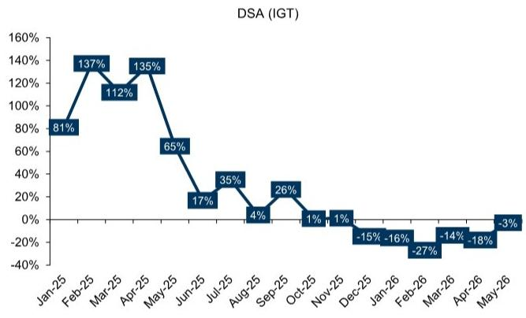

line chart

DSA (IGT)
| Month | Value (%) |
|---|---|
| Jan-25 | 81 |
| Feb-25 | 137 |
| Mar-25 | 112 |
| Apr-25 | 135 |
| May-25 | 65 |
| Jun-25 | 17 |
| Jul-25 | 35 |
| Aug-25 | 4 |
| Sep-25 | 26 |
| Oct-25 | -1 |
| Nov-25 | -1 |
| Dec-25 | -15 |
| Jan-26 | -16 |
| Feb-26 | -27 |
| Mar-26 | -14 |
| Apr-26 | -18 |
| May-26 | -3 |

Source: Joinchain

## Bidding value by brand, domestic vs. MNC

Exhibit 23: Total bidding value of United Imaging since Jan-23

In Rmb, mn

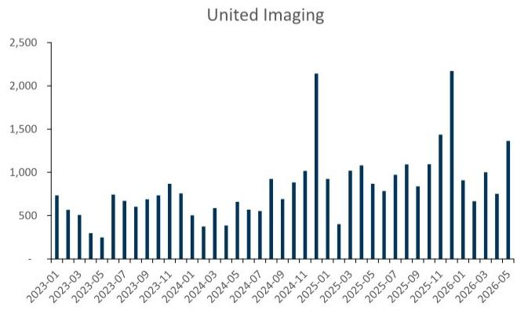

bar chart

United Imaging
| Date | Value |
|---|---|
| 2023-01 | 750 |
| 2023-03 | 550 |
| 2023-05 | 300 |
| 2023-07 | 750 |
| 2023-09 | 650 |
| 2023-11 | 750 |
| 2024-01 | 850 |
| 2024-03 | 500 |
| 2024-05 | 400 |
| 2024-07 | 650 |
| 2024-09 | 550 |
| 2024-11 | 950 |
| 2025-01 | 700 |
| 2025-03 | 1000 |
| 2025-05 | 2150 |
| 2025-07 | 950 |
| 2025-09 | 1050 |
| 2025-11 | 850 |
| 2026-01 | 1450 |
| 2026-03 | 900 |
| 2026-05 | 650 |
| 2026-07 | 1000 |
| 2026-09 | 750 |
| 2026-11 | 1350 |

Source: Joinchain

Exhibit 24: Total bidding value of GEHC since Jan-23 In Rmb, mn  
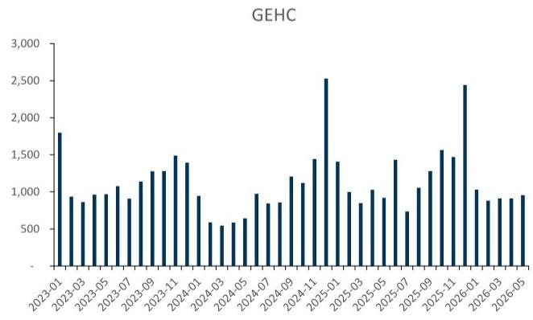

bar chart

GEHC
| Date | Value |
|---|---|
| 2023-01 | 1800 |
| 2023-03 | 950 |
| 2023-05 | 900 |
| 2023-07 | 1050 |
| 2023-09 | 1150 |
| 2023-11 | 1300 |
| 2024-01 | 1500 |
| 2024-03 | 950 |
| 2024-05 | 550 |
| 2024-07 | 600 |
| 2024-09 | 850 |
| 2024-11 | 1200 |
| 2025-01 | 1450 |
| 2025-03 | 2550 |
| 2025-05 | 1400 |
| 2025-07 | 850 |
| 2025-09 | 1050 |
| 2025-11 | 1550 |
| 2026-01 | 1450 |
| 2026-03 | 950 |
| 2026-05 | 950 |

Source: Joinchain

Exhibit 25: Total bidding value of Philips since Jan-23 In Rmb, mn  
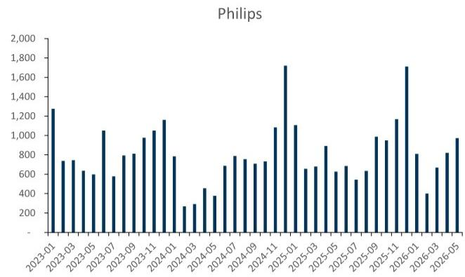

bar chart

Philips
| Date | Value |
|---|---|
| 2023-01 | 1300 |
| 2023-03 | 750 |
| 2023-05 | 650 |
| 2023-07 | 1050 |
| 2023-09 | 800 |
| 2023-11 | 1000 |
| 2024-01 | 1150 |
| 2024-03 | 800 |
| 2024-05 | 300 |
| 2024-07 | 450 |
| 2024-09 | 750 |
| 2024-11 | 1100 |
| 2025-01 | 1750 |
| 2025-03 | 1100 |
| 2025-05 | 650 |
| 2025-07 | 650 |
| 2025-09 | 900 |
| 2025-11 | 650 |
| 2026-01 | 1750 |
| 2026-03 | 800 |
| 2026-05 | 650 |
| 2026-07 | 850 |
| 2026-09 | 950 |
The data is already in CSV format and contains no additional formatting elements. The table structure is a single column for the year '2023' and '2024' (which are not explicitly labeled).

Source: Joinchain

Exhibit 26: Total bidding value of Siemens since Jan-23 In Rmb, mn  
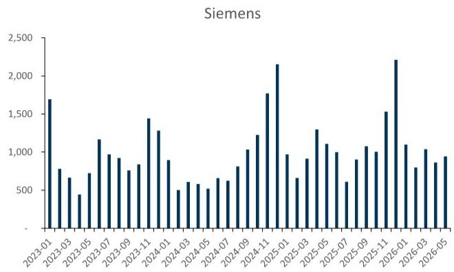

bar chart

Siemens
| Date | Value |
|---|---|
| 2023-01 | 1700 |
| 2023-02 | 750 |
| 2023-03 | 650 |
| 2023-04 | 450 |
| 2023-05 | 700 |
| 2023-06 | 1150 |
| 2023-07 | 950 |
| 2023-08 | 900 |
| 2023-09 | 750 |
| 2023-10 | 800 |
| 2023-11 | 1450 |
| 2024-01 | 1250 |
| 2024-02 | 850 |
| 2024-03 | 500 |
| 2024-04 | 600 |
| 2024-05 | 550 |
| 2024-06 | 500 |
| 2024-07 | 650 |
| 2024-08 | 600 |
| 2024-09 | 750 |
| 2024-10 | 1000 |
| 2024-11 | 1200 |
| 2024-12 | 1750 |
| 2025-01 | 2150 |
| 2025-02 | 950 |
| 2025-03 | 650 |
| 2025-04 | 900 |
| 2025-05 | 1300 |
| 2025-06 | 1100 |
| 2025-07 | 1000 |
| 2025-08 | 600 |
| 2025-09 | 950 |
| 2025-10 | 1100 |
| 2025-11 | 1050 |
| 2025-12 | 1550 |
| 2026-01 | 2250 |
| 2026-02 | 1100 |
| 2026-03 | 750 |
| 2026-04 | 1150 |
| 2026-05 | 950 |

Source: Joinchain

Exhibit 27: Total bidding value of Elekta since Jan-23 In Rmb, mn  
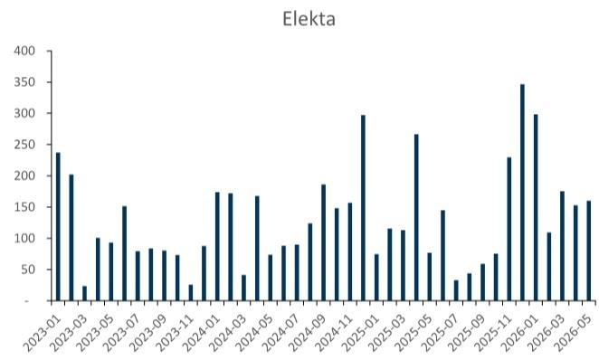

bar chart

Elekta
| Month | Value |
|---|---|
| 2023-01 | 240 |
| 2023-02 | 200 |
| 2023-03 | 25 |
| 2023-04 | 100 |
| 2023-05 | 95 |
| 2023-06 | 150 |
| 2023-07 | 80 |
| 2023-08 | 80 |
| 2023-09 | 80 |
| 2023-10 | 75 |
| 2023-11 | 30 |
| 2024-01 | 90 |
| 2024-02 | 175 |
| 2024-03 | 175 |
| 2024-04 | 40 |
| 2024-05 | 165 |
| 2024-06 | 75 |
| 2024-07 | 90 |
| 2024-08 | 85 |
| 2024-09 | 125 |
| 2024-10 | 185 |
| 2024-11 | 145 |
| 2024-12 | 155 |
| 2025-01 | 300 |
| 2025-02 | 75 |
| 2025-03 | 115 |
| 2025-04 | 115 |
| 2025-05 | 270 |
| 2025-06 | 75 |
| 2025-07 | 145 |
| 2025-08 | 35 |
| 2025-09 | 45 |
| 2025-10 | 65 |
| 2025-11 | 75 |
| 2026-01 | 345 |
| 2026-02 | 300 |
| 2026-03 | 110 |
| 2026-04 | 175 |
| 2026-05 | 165 |

Source: Joinchain

Exhibit 28: Total bidding value of Mindray since Jan-23 In Rmb, mn  
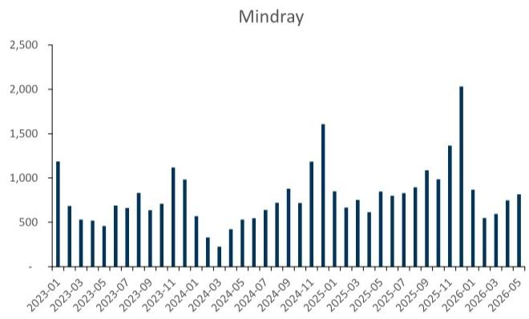

bar chart

Mindray
| Date | Value |
|---|---|
| 2023-01 | 1200 |
| 2023-02 | 700 |
| 2023-03 | 500 |
| 2023-04 | 500 |
| 2023-05 | 450 |
| 2023-06 | 700 |
| 2023-07 | 650 |
| 2023-08 | 800 |
| 2023-09 | 650 |
| 2023-10 | 700 |
| 2023-11 | 1150 |
| 2024-01 | 1000 |
| 2024-02 | 550 |
| 2024-03 | 350 |
| 2024-04 | 250 |
| 2024-05 | 450 |
| 2024-06 | 550 |
| 2024-07 | 550 |
| 2024-08 | 650 |
| 2024-09 | 750 |
| 2024-10 | 900 |
| 2024-11 | 750 |
| 2024-12 | 1150 |
| 2025-01 | 1650 |
| 2025-02 | 850 |
| 2025-03 | 650 |
| 2025-04 | 750 |
| 2025-05 | 650 |
| 2025-06 | 850 |
| 2025-07 | 850 |
| 2025-08 | 850 |
| 2025-09 | 950 |
| 2025-10 | 1150 |
| 2025-11 | 1350 |
| 2026-01 | 2050 |
| 2026-02 | 900 |
| 2026-03 | 550 |
| 2026-04 | 650 |
| 2026-05 | 850 |

Source: Joinchain

Exhibit 29: Total bidding value of SonoScape since Jan-23 In Rmb, mn  
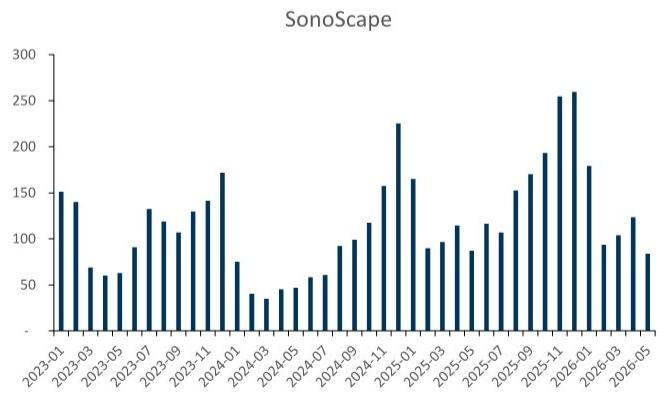

bar chart

SonoScape
| Month | Value |
|---|---|
| 2023-01 | 150 |
| 2023-02 | 140 |
| 2023-03 | 70 |
| 2023-04 | 60 |
| 2023-05 | 65 |
| 2023-06 | 90 |
| 2023-07 | 130 |
| 2023-08 | 115 |
| 2023-09 | 105 |
| 2023-10 | 125 |
| 2023-11 | 140 |
| 2024-01 | 170 |
| 2024-02 | 75 |
| 2024-03 | 40 |
| 2024-04 | 35 |
| 2024-05 | 45 |
| 2024-06 | 45 |
| 2024-07 | 55 |
| 2024-08 | 65 |
| 2024-09 | 95 |
| 2024-10 | 105 |
| 2024-11 | 115 |
| 2024-12 | 155 |
| 2025-01 | 225 |
| 2025-02 | 165 |
| 2025-03 | 90 |
| 2025-04 | 95 |
| 2025-05 | 115 |
| 2025-06 | 85 |
| 2025-07 | 115 |
| 2025-08 | 105 |
| 2025-09 | 150 |
| 2025-10 | 170 |
| 2025-11 | 195 |
| 2026-01 | 255 |
| 2026-02 | 260 |
| 2026-03 | 180 |
| 2026-04 | 95 |
| 2026-05 | 105 |
| 2026-06 | 125 |
| 2026-07 | 85 |

Source: Joinchain

Exhibit 30: Total bidding value of Olympus since Jan-23 In Rmb, mn  
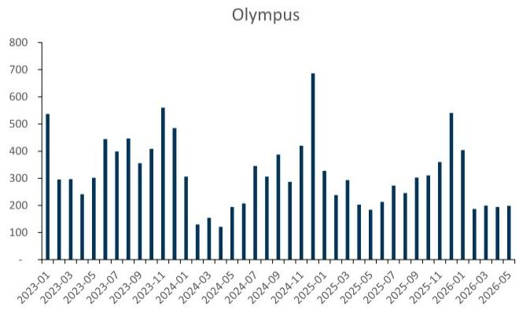

bar chart

Olympus
| Date | Value |
|---|---|
| 2023-01 | 540 |
| 2023-03 | 290 |
| 2023-05 | 240 |
| 2023-07 | 440 |
| 2023-09 | 440 |
| 2023-11 | 560 |
| 2024-01 | 480 |
| 2024-03 | 310 |
| 2024-05 | 130 |
| 2024-07 | 150 |
| 2024-09 | 110 |
| 2024-11 | 340 |
| 2025-01 | 680 |
| 2025-03 | 320 |
| 2025-05 | 230 |
| 2025-07 | 290 |
| 2025-09 | 190 |
| 2025-11 | 270 |
| 2026-01 | 360 |
| 2026-03 | 540 |
| 2026-05 | 190 |

Source: Joinchain

Exhibit 31: Total bidding value of Aohua since Jan-23 In Rmb, mn  
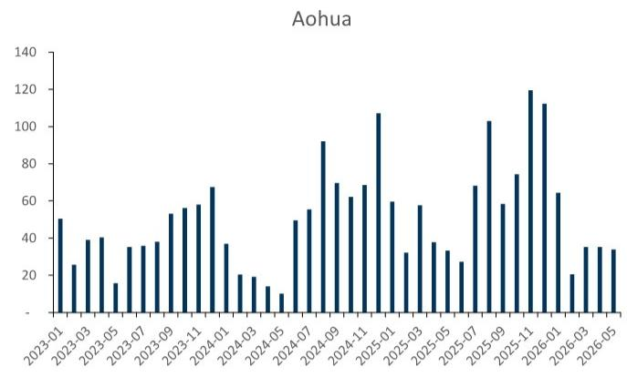

bar chart

Aohua
| Month | Value |
|---|---|
| 2023-01 | 50 |
| 2023-02 | 25 |
| 2023-03 | 40 |
| 2023-04 | 40 |
| 2023-05 | 15 |
| 2023-06 | 35 |
| 2023-07 | 35 |
| 2023-08 | 38 |
| 2023-09 | 53 |
| 2023-10 | 57 |
| 2023-11 | 60 |
| 2024-01 | 68 |
| 2024-02 | 35 |
| 2024-03 | 20 |
| 2024-04 | 18 |
| 2024-05 | 15 |
| 2024-06 | 10 |
| 2024-07 | 50 |
| 2024-08 | 56 |
| 2024-09 | 92 |
| 2024-10 | 70 |
| 2024-11 | 63 |
| 2024-12 | 69 |
| 2025-01 | 107 |
| 2025-02 | 60 |
| 2025-03 | 31 |
| 2025-04 | 58 |
| 2025-05 | 37 |
| 2025-06 | 33 |
| 2025-07 | 26 |
| 2025-08 | 68 |
| 2025-09 | 103 |
| 2025-10 | 58 |
| 2025-11 | 74 |
| 2025-12 | 119 |
| 2026-01 | 113 |
| 2026-02 | 64 |
| 2026-03 | 19 |
| 2026-04 | 36 |
| 2026-05 | 34 |

Source: Joinchain

## Investment Thesis Mindray

Mindray is a leading medtech device manufacturer in China with focus on several segments including patient monitoring systems, medical imaging and IVD. $55\%$ of its 2024 revenue was from China. We see strong healthcare infrastructure construction and domestic substitution in China. Moreover, we expect overseas revenue to increase given Mindray's relatively low market share and cost-effective product portfolio. The company is trading below its 5-year average forward P/E mainly due to policy risks. We expect Mindray to maintain its market leader position with multiple growth drivers. We are Buy-rated on Mindray. Key catalysts include procurement activities recovery, updates on medical device trade-in program, and launch of new products.

## United Imaging

United Imaging is a leading manufacturer of large-scale medical imaging equipment in China and has expanded its presence to over 100 countries worldwide. We observe that medical equipment procurement in China has rebounded, with increasing government funding support, while the company's market share continues to grow. We believe that as this trend progresses, the proportion of service-related revenue will rise, leading to an improvement in the company's GPM. The company is currently trading near its median P/E multiple since listing, but given its expected growth in revenue, GPM and NPM, we see significant long-term growth potential. Therefore, we are Buy rated. Key catalysts include future monthly hospital procurement data in China and the launch of its ultrasound product line.

## Price Target Risks & Methodology Mindray

Our 12-month target price of Rmb247 is based on a two-stage DCF valuation, with terminal growth rate of $2\%$ , and WACC of $9.5\%$ (both unchanged). Key downside risks: 1) further impact from VBP to cut the ex-factory price of some products; 2) lower-than-expected progress of penetration into top-tier hospitals in China; 3) difficulty in entering North America and European markets; 4) patent-related lawsuit

risks; and 5) unexpected changes in trade policies.

## United Imaging

Our 12-month target price of Rmb172 is based on a two-stage DCF valuation, which assumes: 1) a discount rate of $9\%$ ; and 2) a terminal growth rate of $2\%$ . Key risks: 1) chip supply chain risk; 2) raw material risk, especially helium; 3) macro economic downturns in China; and 4) potential VBP risks.

Mindray

<table><tr><td>300760.SZ</td><td>12m Price Target: Rmb247</td><td colspan="2">Price: Rmb142.33</td><td colspan="2">Upside: 73.5%</td></tr><tr><td rowspan="2">Buy</td><td colspan="5">GS Forecast</td></tr><tr><td></td><td>12/25</td><td>12/26E</td><td>12/27E</td><td>12/28E</td></tr><tr><td>Market cap: Rmb172.5bn / $25.5bn</td><td>Revenue (Rmb mn)</td><td>33,282.2</td><td>36,067.1</td><td>39,846.0</td><td>44,189.7</td></tr><tr><td>Enterprise value: Rmb153.8bn / $22.7bn</td><td>EBITDA (Rmb mn)</td><td>10,768.6</td><td>10,858.3</td><td>12,155.6</td><td>13,535.9</td></tr><tr><td>3m ADTV :Rmb1.3bn/ $196.8mn</td><td>EPS (Rmb)</td><td>6.71</td><td>6.85</td><td>7.65</td><td>8.16</td></tr><tr><td>China</td><td>P/E (X)</td><td>33.9</td><td>20.8</td><td>18.6</td><td>17.5</td></tr><tr><td rowspan="2">China A-Share Healthcare</td><td>P/B (X)</td><td>7.2</td><td>4.2</td><td>3.9</td><td>3.6</td></tr><tr><td>Dividend yield (%)</td><td>1.9</td><td>3.1</td><td>3.5</td><td>3.7</td></tr><tr><td>M&amp;A Rank 3</td><td>N debt/EBITDA (ex lease,X)</td><td>(1.6)</td><td>(1.7)</td><td>(1.5)</td><td>(1.5)</td></tr><tr><td rowspan="4">Leases incl. in net debt &amp; EV?: No</td><td>CROCI (%)</td><td>30.5</td><td>25.6</td><td>26.0</td><td>26.3</td></tr><tr><td>FCF yield (%)</td><td>2.9</td><td>3.8</td><td>3.6</td><td>4.7</td></tr><tr><td></td><td>3/26</td><td>6/26E</td><td>9/26E</td><td>12/26E</td></tr><tr><td>EPS (Rmb)</td><td>1.92</td><td>1.76</td><td>2.15</td><td>1.02</td></tr></table>

Source: Company data, GS estimates, FactSet. Price as of 09 Jun 2026 close.

United Imaging

<table><tr><td>688271.SS</td><td>12m Price Target: Rmb172</td><td colspan="2">Price: Rmb112.74</td><td colspan="2">Upside: 52.6%</td></tr><tr><td>Buy</td><td colspan="5">GS Forecast</td></tr><tr><td></td><td></td><td>12/25</td><td>12/26E</td><td>12/27E</td><td>12/28E</td></tr><tr><td>Market cap: Rmb92.9bn / $13.7bn</td><td>Revenue (Rmb mn)</td><td>13,800.3</td><td>16,469.1</td><td>20,486.2</td><td>26,604.7</td></tr><tr><td>Enterprise value: Rmb89.8bn / $13.3bn</td><td>EBITDA (Rmb mn)</td><td>2,396.7</td><td>3,073.0</td><td>4,061.3</td><td>5,376.5</td></tr><tr><td>3m ADTV :Rmb764.0mn/$112.1mn</td><td>EPS (Rmb)</td><td>2.27</td><td>2.84</td><td>3.64</td><td>4.88</td></tr><tr><td>China</td><td>P/E (X)</td><td>58.9</td><td>39.8</td><td>31.0</td><td>23.1</td></tr><tr><td>China A-Share Healthcare</td><td>P/B (X)</td><td>5.1</td><td>4.0</td><td>3.6</td><td>3.2</td></tr><tr><td></td><td>Dividend yield (%)</td><td>0.3</td><td>0.5</td><td>0.6</td><td>0.9</td></tr><tr><td>M&amp;A Rank 3</td><td>N debt/EBITDA (exlease,X)</td><td>(1.9)</td><td>(1.0)</td><td>(1.3)</td><td>(0.9)</td></tr><tr><td>Leases incl. in net debt &amp; EV?: Yes</td><td>CROCI (%)</td><td>14.9</td><td>14.8</td><td>16.6</td><td>19.3</td></tr><tr><td></td><td>FCF yield (%)</td><td>0.5</td><td>(1.0)</td><td>3.0</td><td>0.6</td></tr><tr><td></td><td></td><td>3/26</td><td>6/26E</td><td>9/26E</td><td>12/26E</td></tr><tr><td></td><td>EPS (Rmb)</td><td>0.48</td><td>0.80</td><td>0.49</td><td>1.06</td></tr></table>

Source: Company data, GS estimates, FactSet. Price as of 09 Jun 2026 close.

## Disclosure Appendix

## Reg AC

We, Tianyi Yan and Michael Zheng, hereby certify that all of the views expressed in this report accurately reflect our personal views about the subject company or companies and its or their securities. We also certify that no part of our compensation was, is or will be, directly or indirectly, related to the specific recommendations or views expressed in this report.

Contributing Authors: Tianyi Yan GS (China) Securities Company Limited, Ziyi Chen GS (Asia) L.L.C., Michael Zheng GS (China) Securities Company Limited.

Unless otherwise stated, the individuals listed in the Contributing Authors disclosure of this report are analysts in GS' Global Investment Research division.

## GS Factor Profile

The GS Factor Profile provides investment context for a stock by comparing key attributes to the market (i.e. our universe of rated stocks) and its sector peers. The four key attributes depicted are: Growth, Financial Returns, Multiple (e.g. valuation) and Integrated (a composite of Growth, Financial Returns and Multiple). Growth, Financial Returns and Multiple are calculated by using normalized ranks for specific metrics for each stock. The normalized ranks for the metrics are then averaged and converted into percentiles for the relevant attribute. The precise calculation of each metric may vary depending on the fiscal year, industry and region, but the standard approach is as follows:

Growth is based on a stock's forward-looking sales growth, EBITDA growth and EPS growth (for financial stocks, only EPS and sales growth), with a higher percentile indicating a higher growth company. Financial Returns is based on a stock's forward-looking ROE, ROCE and CROCI (for financial stocks, only ROE), with a higher percentile indicating a company with higher financial returns. Multiple is based on a stock's forward-looking P/E, P/B, price/dividend (P/D), EV/EBITDA, EV/FCF and EV/Debt Adjusted Cash Flow (DACF) (for financial stocks, only P/E, P/B and P/D), with a higher percentile indicating a stock trading at a higher multiple. The Integrated percentile is calculated as the average of the Growth percentile, Financial Returns percentile and (100% - Multiple percentile).

Financial Returns and Multiple use the GS analyst forecasts at the fiscal year-end at least three quarters in the future. Growth uses inputs for the fiscal year at least seven quarters in the future compared with the year at least three quarters in the future (on a per-share basis for all metrics).

For a more detailed description of how we calculate the GS Factor Profile, please contact your GS representative.

## M&A Rank

Across our global coverage, we examine stocks using an M&A framework, considering both qualitative factors and quantitative factors (which may vary across sectors and regions) to incorporate the potential that certain companies could be acquired. We then assign a M&A rank as a means of scoring companies under our rated coverage from 1 to 3, with 1 representing high (30%-50%) probability of the company becoming an acquisition target, 2 representing medium (15%-30%) probability and 3 representing low (0%-15%) probability. For companies ranked 1 or 2, in line with our standard departmental guidelines we incorporate an M&A component into our target price. M&A rank of 3 is considered immaterial and therefore does not factor into our price target, and may or may not be discussed in research.

## Quantum

Quantum is GS' proprietary database providing access to detailed financial statement histories, forecasts and ratios. It can be used for in-depth analysis of a single company, or to make comparisons between companies in different sectors and markets.

## Disclosures

The rating(s) for Mindray and United Imaging is/are relative to the other companies in its/their coverage universe: Aier Eye Hospital, AmoyDx, BioKangtai, Dashenlin, Dian Diagnostics, Eyebright, Gan & Lee Pharmaceuticals Co., Huadong Medicine Co., Hualan Biological Engineering, Jiangsu Nhwa Pharmaceutical Co., Kingmed, LBX Pharmacy, Lepu, Mindray, Pien Tze Huang, SNIBE, Sichuan Kelun Pharmaceutical Co., Tonghua Dongbao, United Imaging, Walvax, Yifeng Pharmacy, Zhejiang Huahai Pharmaceutical, Zhifei

## Company-specific regulatory disclosures

The following disclosures relate to relationships between The GS Group, Inc. (with its affiliates, “GS”) and companies covered by GS Global Investment Research and referred to in this research.

GS expects to receive or intends to seek compensation for investment banking services in the next 3 months: Mindray (Rmb142.33) and United Imaging (Rmb112.74)

GS had an investment banking services client relationship during the past 12 months with: Mindray (Rmb142.33) and United Imaging (Rmb112.74)

## Distribution of ratings/investment banking relationships

GS Investment Research global Equity coverage universe

<table><tr><td rowspan="2"></td><td colspan="3">Rating Distribution</td><td colspan="3">Investment Banking Relationships</td></tr><tr><td>Buy</td><td>Hold</td><td>Sell</td><td>Buy</td><td>Hold</td><td>Sell</td></tr><tr><td>Global</td><td>50%</td><td>34%</td><td>16%</td><td>65%</td><td>60%</td><td>45%</td></tr></table>

As of April 1, 2026, GS Global Investment Research had investment ratings on 3,074 equity securities. GS assigns stocks as Buys and Sells on various regional Investment Lists; stocks not so assigned are deemed Neutral. Such assignments equate to Buy, Hold and Sell for the purposes of the above disclosure required by the FINRA Rules. See ‘Ratings, Coverage universe and related definitions’ below. The Investment Banking Relationships chart reflects the percentage of subject companies within each rating category for whom GS has provided investment banking services within the previous twelve months.

Price target and rating history chart(s)  
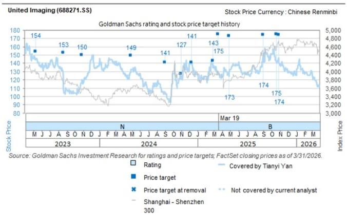

line chart

| Date | Rating | Price Target | Price Target at Removal | Not Covered by Current Analyst |
| --- | --- | --- | --- | --- |
| Mar 19 |  |  |  |  |
|  |  |  |  |  |
|  |  |  |  |  |
|  |  |  |  |  |
|  |  |  |  |  |
|  |  |  |  |  |
|  |  |  |  |  |
|  |  |  |  |  |
|  |  |  |  |  |
|  |  |  |  |  |
| (end) |  |  |  |  |
|  |  |  |  |  |
|  |  |  |  |  |
|  |  |  |  |  |
|  |  |  |  |  |
|  |  |  |  |  |
|  |  |  |  |  |
|  |  |  |  |  |
|  |  |  |  |  |
| / B |  |  |  |  |
| / D |  |  |  |  |
| / M |  |  |  |  |
| / N |  |  |  |  |
| / A |  |  |  |  |
| / S |  |  |  |  |
| / O |  |  |  |  |
| / N |  |  |  |  |
| / D |  |  |  |  |
| / F |  |  |  |  |
| / M |  |  |  |  |
| / A |  |  |  |  |
| / J |  |  |  |  |
| / A |  |  |  |  |
| / S |  |  |  |  |
| / O |  |  |  |  |
| / N |  |  |  |  |
| / D |  |  |  |  |
| / F |  |  |  |  |

The price targets shown should be considered in the context of all prior published GS, which may or may not have included price targets, as well as developments relating to the company, its industry and financial markets.

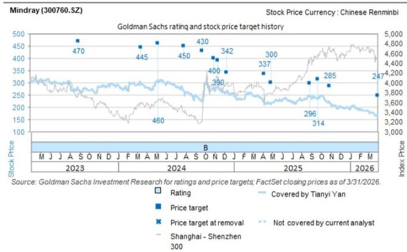

line chart

| Date | Stock Price | Rating | Price Target | Price Target at Removal | Shenzhen - Shenzhen |
| --- | --- | --- | --- | --- | --- |
| 2023 M | ~300 |  |  |  |  |
| 2023 J | ~300 |  |  |  |  |
| 2023 A | ~300 |  |  |  |  |
| 2023 S | ~300 |  |  |  |  |
| 2023 O | ~300 |  |  |  |  |
| 2023 N | ~300 |  |  |  |  |
| 2023 D | ~300 |  |  |  |  |
| 2024 J | ~300 |  |  |  |  |
| 2024 F | ~300 |  |  |  |  |
| 2024 M | ~300 |  |  |  |  |
| 2024 A | ~300 |  |  |  |  |
| 2024 M | ~300 |  |  |  |  |
| 2024 J | ~300 |  |  |  |  |
| 2024 J | ~300 |  |  |  |  |
| 2024 A | ~300 |  |  |  |  |
| 2024 S | ~300 |  |  |  |  |
| 2024 O | ~300 |  |  |  |  |
| 2024 N | ~300 |  |  |  |  |
| 2024 D | ~300 |  |  |  |  |
| 2025 J | ~300 |  |  |  |  |
| 2025 F | ~300 |  |  |  |  |
| 2025 M | ~300 |  |  |  |  |
| 2025 A | ~300 |  |  |  |  |
| 2025 J | ~300 |  |  |  |  |
| 2025 S | ~300 |  |  |  |  |
| 2025 O | ~300 |  |  |  |  |
| 2025 N | ~300 |  |  |  |  |
| 2025 D | ~300 |  |  |  |  |
| 2026 J | ~300 |  |  |  |  |
| 2026 M | ~300 |  |  |  |  |
| 2026 F | ~300 |  |  |  |  |
| 2026 M | ~300 |  |  |  |  |
| 2026 A | ~300 |  |  |  |  |
| 2026 B | ~300 |  |  |  |  |
| 2026 M | ~300 |  |  |  |  |
| 2026 N | ~300 |  |  |  |  |
| 2026 O | ~300 |  |  |  |  |
| 2026 N | ~300 |  |  |  |  |
| 2026 D | ~300 |  |  |  |  |
| 2026 M | ~300 |  |  |  |  |
| 2026 F | ~300 |  |  |  |  |
| 2026 M | ~300 |  |  |  |  |

The price targets shown should be considered in the context of all prior published GS, which may or may not have included price targets, as well as developments relating to the company, its industry and financial markets.

Target price history table(s)  
Mindray (300760.SZ)

<table><tr><td>Date of report</td><td>Target price (Rmb)</td><td>Closing price (Rmb)</td></tr><tr><td>31-Mar-26</td><td>247.00</td><td>164.66</td></tr><tr><td>30-Oct-25</td><td>285.00</td><td>216.69</td></tr><tr><td>24-Sep-25</td><td>314.00</td><td>233.89</td></tr><tr><td>28-Aug-25</td><td>296.00</td><td>247.08</td></tr><tr><td>29-Apr-25</td><td>300.00</td><td>215.85</td></tr><tr><td>06-Apr-25</td><td>337.00</td><td>225.27</td></tr><tr><td>10-Dec-24</td><td>342.00</td><td>262.98</td></tr><tr><td>11-Nov-24</td><td>390.00</td><td>282.49</td></tr><tr><td>30-Oct-24</td><td>400.00</td><td>270.50</td></tr><tr><td>23-Sep-24</td><td>430.00</td><td>222.34</td></tr><tr><td>29-Jul-24</td><td>450.00</td><td>257.20</td></tr><tr><td>06-May-24</td><td>460.00</td><td>313.16</td></tr><tr><td>15-Mar-24</td><td>445.00</td><td>294.47</td></tr><tr><td>30-Aug-23</td><td>470.00</td><td>269.00</td></tr></table>

United Imaging (688271.SS)

<table><tr><td>Date of report</td><td>Target price (Rmb)</td><td>Closing price (Rmb)</td></tr><tr><td>29-Apr-26</td><td>172.00</td><td>112.47</td></tr><tr><td>30-Oct-25</td><td>174.00</td><td>141.03</td></tr><tr><td>20-Oct-25</td><td>175.00</td><td>141.05</td></tr><tr><td>01-Sep-25</td><td>174.00</td><td>152.10</td></tr><tr><td>29-Apr-25</td><td>173.00</td><td>129.16</td></tr><tr><td>19-Mar-25</td><td>175.00</td><td>129.07</td></tr><tr><td>27-Feb-25</td><td>143.00</td><td>139.30</td></tr><tr><td>10-Dec-24</td><td>141.00</td><td>139.21</td></tr><tr><td>31-Oct-24</td><td>127.00</td><td>122.18</td></tr><tr><td>02-Sep-24</td><td>141.00</td><td>104.20</td></tr><tr><td>29-Apr-24</td><td>149.00</td><td>132.60</td></tr><tr><td>30-Oct-23</td><td>150.00</td><td>119.99</td></tr><tr><td>21-Aug-23</td><td>153.00</td><td>125.00</td></tr></table>

Price targets shown in table(s) are unadjusted for corporate actions.

## Regulatory disclosures

## Disclosures required by United States laws and regulations

See company-specific regulatory disclosures above for any of the following disclosures required as to companies referred to in this report: manager or co-manager in a pending transaction; $1\%$ or other ownership; compensation for certain services; types of client relationships; managed/co-managed public offerings in prior periods; directorships; for equity securities, market making and/or specialist role. GS trades or may trade as a principal in debt securities (or in related derivatives) of issuers discussed in this report.

The following are additional required disclosures: Ownership and material conflicts of interest: GS policy prohibits its analysts, professionals reporting to analysts and members of their households from owning securities of any company in the analyst's area of coverage. Analyst compensation: Analysts are paid in part based on the profitability of GS, which includes investment banking revenues. Analyst as officer or director: GS policy generally prohibits its analysts, persons reporting to analysts or members of their households from serving as an officer, director or advisor of any company in the analyst's area of coverage. Non-U.S. Analysts: Non-U.S. analysts may not be associated persons of GS & Co. LLC and therefore may not be subject to FINRA Rule 2241 or FINRA Rule 2242 restrictions on communications with a subject company, public appearances and trading in securities covered by the analysts.

Distribution of ratings: See the distribution of ratings disclosure above. Price chart: See the price chart, with changes of ratings and price targets in prior periods, above, or, if electronic format or if with respect to multiple companies which are the subject of this report, on the GS website at https://www.gs.com/research/hedge.html.

## Additional disclosures required under the laws and regulations of jurisdictions other than the United States

The following disclosures are those required by the jurisdiction indicated, except to the extent already made above pursuant to United States laws and regulations. Australia: GS Australia Pty Ltd and its affiliates are not authorised deposit-taking institutions (as that term is defined in the Banking Act 1959 (Cth)) in Australia and do not provide banking services, nor carry on a banking business, in Australia. This research, and any access to it, is intended only for “wholesale clients” within the meaning of the Australian Corporations Act, unless otherwise agreed by GS. In producing research reports, members of Global Investment Research of GS Australia may attend site visits and other meetings hosted by the companies and other entities which are the subject of its research reports. In some instances the costs of such site visits or meetings may be met in part or in whole by the issuers concerned if GS Australia considers it is appropriate and reasonable in the specific circumstances relating to the site visit or meeting. To the extent that the contents of this document contains any financial product advice, it is general advice only and has been prepared by GS without taking into account a client’s objectives, financial situation or needs. A client should, before acting on any such

advice, consider the appropriateness of the advice having regard to the client's own objectives, financial situation and needs. A copy of certain GS Australia and New Zealand disclosure of interests and a copy of GS' Australian Sell-Side Research Independence Policy Statement are available at: https://www.goldmansachs.com/disclosures/australia-new-zealand/index.html. Brazil: Disclosure information in relation to CVM Resolution n. 20 is available at https://www.gs.com/worldwide/brazil/area/gir/index.html. Where applicable, the Brazil-registered analyst primarily responsible for the content of this research report, as defined in Article 20 of CVM Resolution n. 20, is the first author named at the beginning of this report, unless indicated otherwise at the end of the text. Canada: This information is being provided to you for information purposes only and is not, and under no circumstances should be construed as, an advertisement, offering or solicitation by GS & Co. LLC for purchasers of securities in Canada to trade in any Canadian security. GS & Co. LLC is not registered as a dealer in any jurisdiction in Canada under applicable Canadian securities laws and generally is not permitted to trade in Canadian securities and may be prohibited from selling certain securities and products in certain jurisdictions in Canada. If you wish to trade in any Canadian securities or other products in Canada please contact GS Canada Inc., an affiliate of The GS Group Inc., or another registered Canadian dealer. Hong Kong: Further information on the securities of covered companies referred to in this research may be obtained on request from GS (Asia) L.L.C. India: Further information on the subject company or companies referred to in this research may be obtained from GS (India) Securities Private Limited, Research Analyst - SEBI Registration Number INH000001493, 10th Floor, Ascent-Worli, Sudam Kalu Ahire Marg, Worli, Mumbai-400 025, India, Corporate Identity Number U74140MH2006FTC160634, Phone +91 22 6616 9000, Fax +91 22 6616 9001. GS may beneficially own 1% or more of the securities (as such term is defined in clause 2 (h) the Indian Securities Contracts (Regulation) Act, 1956) of the subject company or companies referred to in this research report. Investment in securities market are subject to market risks. Read all the related documents carefully before investing. Registration granted by SEBI and certification from NISM in no way guarantee performance of the intermediary or provide any assurance of returns to investors. GS (India) Securities Private Limited compliance officer and investor grievance contact details can be found at: https://www.goldmansachs.com/worldwide/india/documents/Grievance-Redressal-and-Escalation-Matrix.pdf, and a copy of the annual audit compliance report can be found at this link: https://publishing.gs.com/content/site/india-annual-compliance-report.html. Japan: See below. Korea: This research, and any access to it, is intended only for “professional investors” within the meaning of the Financial Services and Capital Markets Act, unless otherwise agreed by GS. Further information on the subject company or companies referred to in this research may be obtained from GS (Asia) L.L.C., Seoul Branch. New Zealand: GS New Zealand Limited and its affiliates are neither “registered banks” nor “deposit takers” (as defined in the Reserve Bank of New Zealand Act 1989) in New Zealand. This research, and any access to it, is intended for “wholesale clients” (as defined in the Financial Advisers Act 2008) unless otherwise agreed by GS. A copy of certain GS Australia and New Zealand disclosure of interests is available at: https://www.goldmansachs.com/disclosures/australia-new-zealand/index.html. Russia: Research reports distributed in the Russian Federation are not advertising as defined in the Russian legislation, but are information and analysis not having product promotion as their main purpose and do not provide appraisal within the meaning of the Russian legislation on appraisal activity. Research reports do not constitute a personalized investment recommendation as defined in Russian laws and regulations, are not addressed to a specific client, and are prepared without analyzing the financial circumstances, investment profiles or risk profiles of clients. GS assumes no responsibility for any investment decisions that may be taken by a client or any other person based on this research report. Singapore: GS (Singapore) Pte. (Company Number: 198602165W), which is regulated by the Monetary Authority of Singapore, accepts legal responsibility for this research, and should be contacted with respect to any matters arising from, or in connection with, this research. Taiwan: This material is for reference only and must not be reprinted without permission. Investors should carefully consider their own investment risk. Investment results are the responsibility of the individual investor. United Kingdom: Persons who would be categorized as retail clients in the United Kingdom, as such term is defined in the rules of the Financial Conduct Authority, should read this research in conjunction with prior GS on the covered companies referred to herein and should refer to the risk warnings that have been sent to them by GS International. A copy of these risks warnings, and a glossary of certain financial terms used in this report, are available from GS International on request.

European Union and United Kingdom: Disclosure information in relation to Article 6 (2) of the European Commission Delegated Regulation (EU) (2016/958) supplementing Regulation (EU) No 596/2014 of the European Parliament and of the Council (including as that Delegated Regulation is implemented into United Kingdom domestic law and regulation following the United Kingdom's departure from the European Union and the European Economic Area) with regard to regulatory technical standards for the technical arrangements for objective presentation of investment recommendations or other information recommending or suggesting an investment strategy and for disclosure of particular interests or indications of conflicts of interest is available at https://www.gs.com/disclosures/europeanpolicy.html which states the European Policy for Managing Conflicts of Interest in Connection with Investment Research.

Japan: GS Japan Co., Ltd. is a Financial Instrument Dealer registered with the Kanto Financial Bureau under registration number Kinsho 69, and a member of Japan Securities Dealers Association, Financial Futures Association of Japan Type II Financial Instruments Firms Association, and Investment Management Association of Japan. Sales and purchase of equities are subject to commission pre-determined with clients plus consumption tax. See company-specific disclosures as to any applicable disclosures required by Japanese stock exchanges, the Japanese Securities Dealers Association or the Japanese Securities Finance Company.

## Ratings, coverage universe and related definitions

Buy (B), Neutral (N), Sell (S) Analysts recommend stocks as Buys or Sells for inclusion on various regional Investment Lists. Being assigned a Buy or Sell on an Investment List is determined by a stock's total return potential relative to its coverage universe. Any stock not assigned as a Buy or a Sell on an Investment List with an active rating (i.e., a stock that is not Rating Suspended, Not Rated, Early-Stage Biotech, Coverage Suspended or Not Covered), is deemed Neutral. Each region manages Regional Conviction Lists, which are selected from Buy rated stocks on the respective region's Investment Lists and represent investment recommendations focused on the size of the total return potential and/or the likelihood of the realization of the return across their respective areas of coverage. The addition or removal of stocks from such Conviction Lists are managed by the Investment Review Committee or other designated committee in each respective region and do not represent a change in the analysts' investment rating for such stocks.

Total return potential represents the upside or downside differential between the current share price and the price target, including all paid or anticipated dividends, expected during the time horizon associated with the price target. Price targets are required for all covered stocks. The total return potential, price target and associated time horizon are stated in each report adding or reiterating an Investment List membership.

Coverage Universe: A list of all stocks in each coverage universe is available by primary analyst, stock and coverage universe at https://www.gs.com/research/hedge.html.

Not Rated (NR). The investment rating, target price and earnings estimates (where relevant) are removed pursuant to GS policy when GS is acting in an advisory capacity in a merger or in a strategic transaction involving this company, when there are legal, regulatory or policy constraints due to GS' involvement in a transaction, and in certain other circumstances. Early-Stage Biotech (ES). An investment rating and a target price are not assigned pursuant to GS policy when this company has neither a drug, treatment or medical device that has passed a Phase II clinical trial nor a license to distribute a post-Phase II drug, treatment or medical device. Rating Suspended (RS). GS has suspended the investment rating and price target for this stock, because there is not a sufficient fundamental basis for determining an investment rating or target price. The previous investment rating and target price, if any, are no longer in effect for this stock and should not be relied upon. Coverage Suspended (CS). GS has suspended coverage of this company. Not Covered (NC). GS does not cover this company.

## Global product; distributing entities

GS Global Investment Research produces and distributes research products for clients of GS on a global basis. Analysts based in GS offices around the world produce research on industries and companies, and research on macroeconomics, currencies, commodities and portfolio strategy. This research is disseminated in Australia by GS Australia Pty Ltd (ABN 21 006 797 897); in Brazil by GS do Brasil Corretora de Títulos e Valores Mobiliários S.A.; Public Communication Channel GS Brazil: 0800 727 5764 and / or contatogoldmanbrasil@gs.com. Available Weekdays (except holidays), from 9am to 6pm. Canal de Comunicação com o Público GS Brasil: 0800 727 5764 e/ou contatogoldmanbrasil@gs.com. Horário de funcionamento: segunda-feira à sexta-feira (exceto feriados), das 9h às 18h; in Canada by GS & Co. LLC; in Hong Kong by GS (Asia) L.L.C.; in India by GS (India) Securities Private Ltd.; in Japan by GS Japan Co., Ltd.; in the Republic of Korea by GS (Asia) L.L.C., Seoul Branch; in New Zealand by GS New Zealand Limited; in Russia by OOO GS; in Singapore by GS (Singapore) Pte. (Company Number: 198602165W); and in the United States of America by GS & Co. LLC. GS International has approved this research in connection with its distribution in the United Kingdom.

GS International ("GSI"), authorised by the Prudential Regulation Authority ("PRA") and regulated by the Financial Conduct Authority ("FCA") and the PRA, has approved this research in connection with its distribution in the United Kingdom.

European Economic Area: GS Bank Europe SE (“GSBE”) is a credit institution incorporated in Germany and, within the Single Supervisory Mechanism, subject to direct prudential supervision by the European Central Bank and in other respects supervised by German Federal Financial Supervisory Authority (Bundesanstalt für Finanzdienstleistungsaufsicht, BaFin) and Deutsche Bundesbank and disseminates research within the European Economic Area.

## General disclosures

This research is for our clients only. Other than disclosures relating to GS, this research is based on current public information that we consider reliable, but we do not represent it is accurate or complete, and it should not be relied on as such. The information, opinions, estimates and forecasts contained herein are as of the date hereof and are subject to change without prior notification. We seek to update our research as appropriate, but various regulations may prevent us from doing so. Other than certain industry reports published on a periodic basis, the large majority of reports are published at irregular intervals as appropriate in the analyst's judgment.

GS conducts a global full-service, integrated investment banking, investment management, and brokerage business. We have investment banking and other business relationships with a substantial percentage of the companies covered by Global Investment Research. GS & Co. LLC, the United States broker dealer, is a member of SIPC (https://www.sipc.org).

Our salespeople, traders, and other professionals may provide oral or written market commentary or trading strategies to our clients and principal trading desks that reflect opinions that are contrary to the opinions expressed in this research. Our asset management area, principal trading desks and investing businesses may make investment decisions that are inconsistent with the recommendations or views expressed in this research.

The analysts named in this report may have from time to time discussed with our clients, including GS salespersons and traders, or may discuss in this report, trading strategies that reference catalysts or events that may have a near-term impact on the market price of the equity securities discussed in this report, which impact may be directionally counter to the analyst's published price target expectations for such stocks. Any such trading strategies are distinct from and do not affect the analyst's fundamental equity rating for such stocks, which rating reflects a stock's return potential relative to its coverage universe as described herein.

We and our affiliates, officers, directors, and employees will from time to time have long or short positions in, act as principal in, and buy or sell, the securities or derivatives, if any, referred to in this research, unless otherwise prohibited by regulation or GS policy.

The views attributed to third party presenters at GS arranged conferences, including individuals from other parts of GS, do not necessarily reflect those of Global Investment Research and are not an official view of GS.

Any third party referenced herein, including any salespeople, traders and other professionals or members of their household, may have positions in the products mentioned that are inconsistent with the views expressed by analysts named in this report.

This research is not an offer to sell or the solicitation of an offer to buy any security in any jurisdiction where such an offer or solicitation would be illegal. It does not constitute a personal recommendation or take into account the particular investment objectives, financial situations, or needs of individual clients. Clients should consider whether any advice or recommendation in this research is suitable for their particular circumstances and, if appropriate, seek professional advice, including tax advice. The price and value of investments referred to in this research and the income from them may fluctuate. Past performance is not a guide to future performance, future returns are not guaranteed, and a loss of original capital may occur. Fluctuations in exchange rates could have adverse effects on the value or price of, or income derived from, certain investments.

Certain transactions, including those involving futures, options, and other derivatives, give rise to substantial risk and are not suitable for all investors. Investors should review current options and futures disclosure documents which are available from GS sales representatives or at https://www.theocc.com/about/publications/character-risks.jsp and https://www.goldmansachs.com/disclosures/cftc\_fcm\_disclosures. Transaction costs may be significant in option strategies calling for multiple purchase and sales of options such as spreads. Supporting documentation will be supplied upon request.

Differing Levels of Service provided by Global Investment Research: The level and types of services provided to you by GS Global Investment Research may vary as compared to that provided to internal and other external clients of GS, depending on various factors including your individual preferences as to the frequency and manner of receiving communication, your risk profile and investment focus and perspective (e.g., marketwide, sector specific, long term, short term), the size and scope of your overall client relationship with GS, and legal and regulatory constraints. As an example, certain clients may request to receive notifications when research on specific securities is published, and certain clients may request that specific data underlying analysts' fundamental analysis available on our internal client websites be delivered to them electronically through data feeds or otherwise. No change to an analyst's fundamental research views (e.g., ratings, price targets, or material changes to earnings estimates for equity securities), will be communicated to any client prior to inclusion of such information in a research report broadly disseminated through electronic publication to our internal client websites or through other means, as necessary, to all clients who are entitled to receive such reports.

All research reports are disseminated and available to all clients simultaneously through electronic publication to our internal client websites. Not all research content is redistributed to our clients or available to third-party aggregators, nor is GS responsible for the redistribution of our research by third party aggregators. For research, models or other data related to one or more securities, markets or asset classes (including related services) that may be available to you, please contact your GS representative or go to https://research.gs.com.

Disclosure information is also available at https://www.gs.com/research/hedge.html or from Research Compliance, 200 West Street, New York, NY 10282.

© 2026 GS.

You are permitted to store, display, analyze, modify, reformat, and print the information made available to you via this service only for your own use. You may not resell or reverse engineer this information to calculate or develop any index for disclosure and/or marketing or create any other derivative works or commercial product(s), data or offering(s) without the express written consent of GS. You are not permitted to publish, transmit, or otherwise reproduce this information, in whole or in part, in any format to any third party without the express written consent of GS. This foregoing restriction includes, without limitation, using, extracting, downloading or retrieving this information, in whole or in part, to train or finetune a machine learning or artificial intelligence system, or to provide or reproduce this information, in whole or in part, as a prompt or input to any such system.