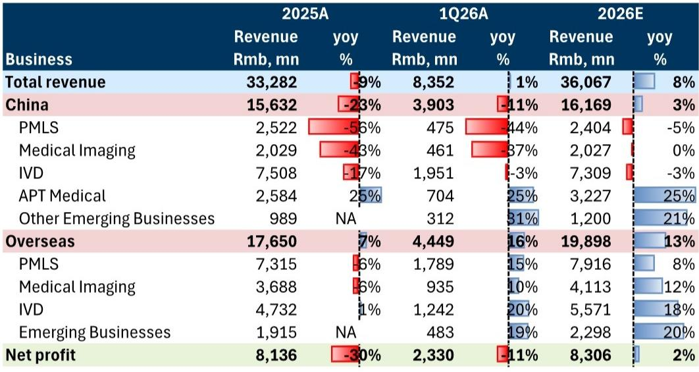
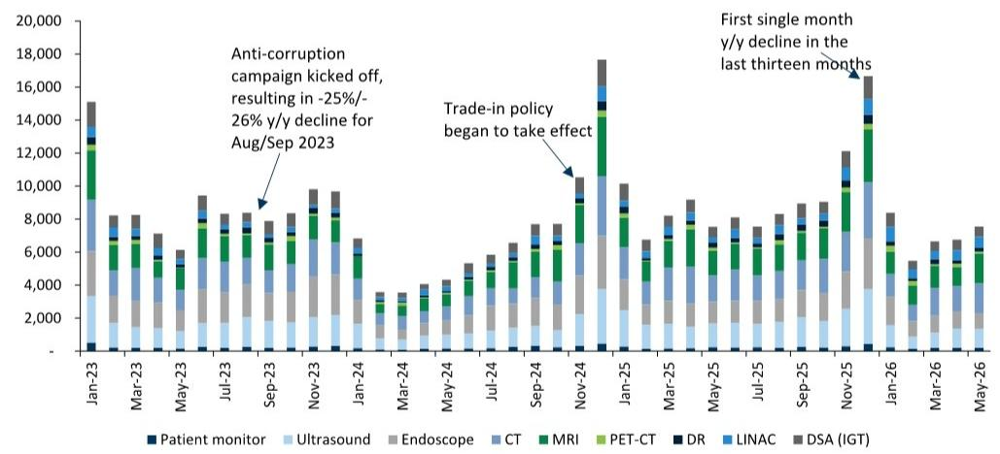
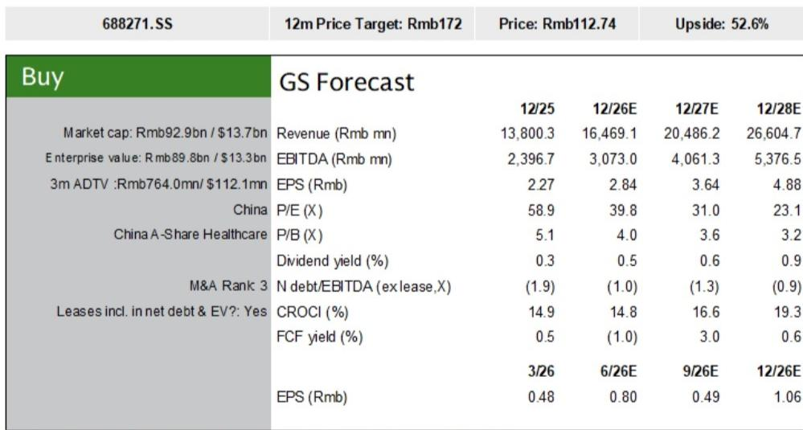

# GS：中国医疗设备招标的拐点正在到来，但真正的分化才刚刚开始

2026年5月的数据，让关注中国医疗设备行业的人稍微松了一口气。GS最新发布的招标跟踪数据显示，在经历了连续五个月的同比下滑之后，九大类医疗设备的总招标金额在5月录得了0.1%的同比正增长。这个数字不大，甚至可以说刚刚转正，但它所承载的信号意义，远比数字本身重要。

这份报告的真正价值，不在于告诉你“5月数据转正了”，而在于它揭示了一个正在发生的结构性变化：中国医疗设备市场正在从“总量承压”转向“结构分化”。那些能在招标总量恢复的过程中，同时实现份额提升和海外扩张的公司，将获得远超行业平均的增长弹性。而那些仅仅依赖国内招标总量回暖的企业，可能会在接下来的竞争中感受到更大的压力。

为什么这个时间点值得关注？因为2026年5月的转正，是在2025年同期已经处于相对高基数的基础上实现的。GS的报告明确指出，这一变化符合其此前“行业将从温和同比下降转向温和同比增长”的预期，并且预计更为明显的复苏将在2026年下半年出现。这意味着，市场的底部可能已经确认，但接下来的上行路径，不会是普涨。

## 1. 招标总量转正背后的三个关键信号：不是所有品类都在好转

5月的数据表面上是总量层面的好消息，但拆开来看，结构性的分化才是核心。在九大类设备中，只有CT、MRI和直线加速器（LINAC）实现了同比正增长。这三类设备有一个共同特征：它们都属于大型、高单价、采购决策周期较长的设备。它们的恢复，可能意味着医院端对于大型资本开支的态度正在从“极度谨慎”转向“有条件放开”。

与之形成对比的是，此前连续保持正增长的患者监护仪，在5月未能延续强势。这看似是一个负面信号，但GS在报告中给出了一个值得深思的观察：疫情期间大量采购的监护仪，现在正进入替换周期。这意味着监护仪的需求逻辑正在从“应急采购”转向“存量替换”，这种需求的持续性可能比市场预期的更强。不过，报告并没有完全展开这个替换周期的具体节奏和规模，这里仍需验证。

超声、内窥镜、DR等品类的招标数据仍然疲软。超声在5月同比下降20%，内窥镜同比下降25%，DR同比下降26%。这些品类的共同问题是：它们更多依赖基层医疗机构的采购和日常诊疗量驱动，而非大型医院的资本开支计划。它们的恢复，可能需要对基层医疗财政支持力度有更明确的信号。

所以，5月数据转正的真正含义是：大型设备率先企稳，但中小型设备的拐点尚未到来。对于投资者而言，这意味着不能简单用“行业复苏”来概括所有公司的前景。

## 2. CT和MRI的招标恢复：是需求回补，还是医院信心修复？

CT和MRI是5月招标数据中最亮眼的两类。CT招标金额同比增长12%，MRI同比增长20%。这两个数字，是在4月分别同比下降31%和50%的背景下实现的。这种大幅波动本身说明，大型设备招标的月度数据存在较大的噪音，单月数据不宜过度解读。

但如果我们把时间拉长，看今年前五个月的整体趋势，CT和MRI的招标金额仍然处于一个从低位缓慢爬升的过程中。GS的报告没有给出前五个月的累计同比数据，但从图表趋势来看，CT和MRI的招标金额在2025年下半年经历了一轮显著回升，进入2026年后有所回落，5月再次反弹。这种“W型”走势，更像是医院在财政预算约束下的“按需采购”行为，而非全面的需求爆发。

这里有一个关键问题：医院端的采购意愿是否已经真正修复？GS的报告没有直接回答这个问题，但我们可以从另一个角度来推断。报告提到，联影医疗在今年前五个月的招标金额同比增长了9%，是主要竞争对手中唯一实现正增长的企业。如果整个行业的需求仍然疲软，联影很难单独实现增长。这说明，至少在CT和MRI这两个品类上，需求端的恢复是真实存在的，只是恢复的力度和节奏在不同企业之间出现了分化。

## 3. 联影医疗为何能逆势增长：份额提升比总量恢复更重要

联影医疗的表现，是这份报告中最值得深入分析的部分。在GEHC、西门子医疗、飞利浦、东软等主要竞争对手的招标金额仍在下滑的背景下，联影在前五个月实现了9%的同比增长。GS认为，这主要得益于其在CT和MRI领域稳定的市场份额，以及在DSA和直线加速器等品类上的份额提升。

份额提升，是比总量恢复更重要的变量。在一个总量缓慢恢复的市场中，能够持续提升份额的企业，本质上是在“抢别人的饭吃”。这种能力的来源，通常不是单一的产品优势，而是产品组合、渠道覆盖、服务能力和价格策略的综合体现。

联影最近公布的新股权激励计划，要求2026-2028年每年营收增长超过20%，否则计划不会完全触发。这是一个相当激进的指引。GS目前对联影2026年的营收增长预测是19.3%，略低于公司指引。考虑到国内招标需求仍处于恢复早期，这个预测是合理的。但值得关注的是，联影的海外业务正在成为新的增长引擎。报告显示，联影海外收入占比已经超过25%，且2026年海外增速预计仍将高于国内增速。如果海外市场能够持续贡献增量，那么联影实现20%以上增长的可能性就会显著提升。

这里有一个尚未完全回答的问题：联影的份额提升，在多大程度上是可持续的？是依靠产品力和服务能力的长期竞争优势，还是短期价格策略或政策导向的结果？GS的报告没有展开讨论，但这恰恰是判断联影长期估值中枢的关键。

## 4. 迈瑞医疗的国内去库存何时结束：一个正在被市场低估的拐点

迈瑞医疗的情况，与联影形成了有趣的对比。联影在招标端实现了增长，而迈瑞在国内市场仍处于去库存阶段。报告显示，迈瑞1Q26国内收入同比下降11%，其中PMLS（病人监护、生命支持）业务同比下降44%，医学影像业务同比下降37%。这些数字看起来仍然令人担忧。

但GS在报告中给出了一个重要的时间节点：公司已经指引，去库存过程将在2Q26结束。如果这个指引兑现，那么迈瑞的国内业务将迎来一个明确的拐点。同时，报告还披露了一个值得关注的细节：迈瑞的IVD业务正在改善，凝血和免疫业务均实现了约10%的同比增长。更重要的是，其三大核心IVD业务（免疫、生化、凝血）的平均市场份额，从1H25的10%提升至1Q26的13%。这意味着，即使在去库存的压力下，迈瑞仍在通过产品组合的优势实现份额提升。

海外市场是迈瑞的另一个亮点。1Q26海外收入同比增长16%（以美元计增长20%），PMLS、医学影像和IVD在海外均实现了正增长。GS预计迈瑞2026年海外收入将同比增长13%。对于一家在国内市场仍面临压力的公司来说，海外业务的持续增长提供了重要的缓冲。

迈瑞面临的核心问题是：去库存结束后，国内业务的恢复速度有多快？GS预计其2026年中国收入同比增长3%，这个预测相对保守。如果去库存的结束能够带来一波需求回补，实际增速可能高于这个水平。但报告没有给出具体的回补弹性测算，这需要投资者基于后续的月度数据自行判断。

## 5. 报告尚未完全回答的关键问题：招标数据与公司收入之间的传导链条

GS这份报告的核心数据来源是招标金额，但招标金额并不直接等于公司确认的收入。从招标到中标，从中标到发货，从发货到收入确认，中间存在一个时间差。这个时间差的长短，取决于设备类型、合同条款和医院的付款节奏。

报告没有讨论这个传导链条的细节，但这是理解数据含义的关键。5月招标数据的转正，可能意味着3-6个月后相关公司的收入端会出现改善。但如果招标数据在接下来的几个月出现反复，这个改善的幅度和持续性就会打折扣。

另一个未完全回答的问题是：设备价格的压力。在招标总量恢复的同时，单位设备的中标价格是否也在恢复？如果总量恢复是靠“以价换量”实现的，那么对利润率的正面影响就会有限。GS的报告没有提供价格维度的数据，这可能是因为Joinchain的数据库主要跟踪金额而非台数。对于投资者来说，后续需要关注的是，公司层面的毛利率变化，而不是仅仅看收入增速。

## 6. 一个观察框架：如何从招标数据推演投资逻辑

基于GS这份报告提供的信息，我们可以构建一个简单的观察框架，用于跟踪和判断医疗设备行业的投资机会。

第一步，看总量趋势。5月转正是一个积极信号，但需要确认后续月份能否持续。如果6月和7月的数据能够延续正增长，那么“温和复苏”的判断就会得到进一步验证。如果数据再次转负，那么底部可能尚未确认。

第二步，看品类分化。CT和MRI的恢复是领先指标，但超声、内窥镜等品类的恢复滞后。如果后者开始出现改善，说明需求正在从大型医院向基层医疗机构扩散，这是更全面的复苏信号。

第三步，看公司层面的份额变化。联影和迈瑞都在不同品类上实现了份额提升，但背后的驱动因素不同。联影更多依赖大型设备的国产替代和海外扩张，迈瑞则依靠产品组合的广度和海外市场的韧性。投资者需要判断，哪家公司的份额提升更具可持续性。

第四步，看海外业务的风险对冲能力。在国内招标总量恢复尚不确定的情况下，海外业务的增长为两家公司提供了重要的缓冲。如果海外增长能够持续超预期，那么即使国内恢复慢于预期，公司的整体增长也不会受到太大影响。

这个框架的核心是：不要只看总量，要看结构；不要只看招标数据，要看公司层面的执行力和份额变化。在行业从总量承压转向结构分化的过程中，能够同时实现国内份额提升和海外扩张的公司，将获得估值溢价。

GS这份报告的真正价值，不是告诉读者“5月数据转正了”，而是提供了一个追踪行业拐点的分析框架。但报告本身也留下了一些未解的问题：招标数据到公司收入的传导时间差有多长？设备价格是否也在恢复？去库存结束后的需求回补弹性有多大？这些问题，需要更长期的跟踪和更深入的研究才能回答。

对于希望持续跟踪这个行业动态的读者，欢迎来星球微信群里继续讨论。我们会在群内分享更多的月度数据更新、交叉验证信息，以及基于最新数据的投资框架调整。这些讨论，往往比单篇报告本身更能帮助理解市场的真实变化。

Personal reading notes and learning share only. Not investment advice.

