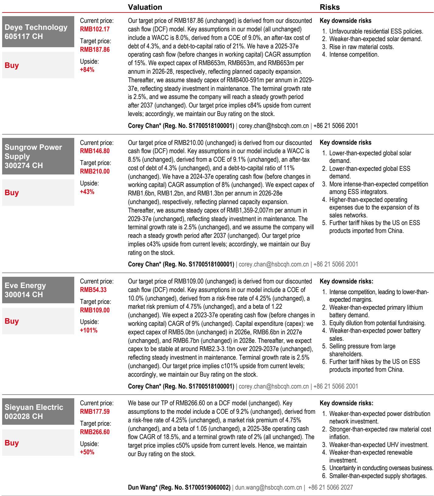
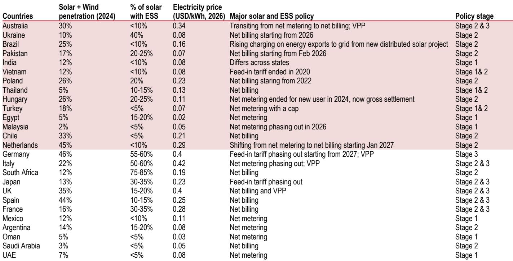
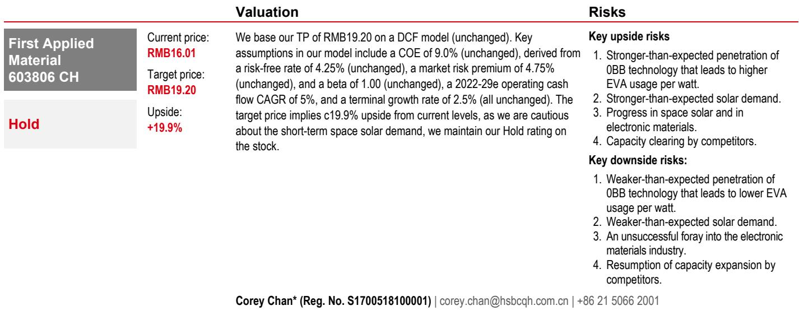

# HSBC：储能正在成为全球能源政策的新重心，光伏反而面临需求拐点

2026年6月初的上海SNEC光伏展，传递出的信号并不像展馆内的热闹那样均衡。HSBC在其最新SNEC观展报告中给出了一个层次分明的判断：地面光伏正面临中国市场化定价改革带来的需求转弱，而储能——尤其是户用储能——正在成为全球能源政策切换的新重心。这一判断并非简单的“光伏不行了、储能行了”的二元叙事，而是建立在各国电网消纳瓶颈、政策补贴结构变化以及技术渗透阶段差异之上的结构性推演。

对于关注中国新能源产业链的投资者而言，这份报告的核心价值不在于复述展会上的产品陈列，而在于它揭示了一个正在发生的政策优先级转移：全球范围内，从“鼓励光伏装机”到“强制配套储能”的过渡，正在从早期市场向更多国家蔓延。这意味着，储能赛道的选股逻辑，需要从“跟着光伏走”切换到“独立于光伏、甚至受益于光伏瓶颈”的新框架。

## 1. 地面光伏正在经历的需求拐点，比市场预期的更结构化

HSBC在报告中明确指出了地面光伏面临的两个压力源。第一个是中国的政策切换：2025年6月，中国从固定上网电价转向市场化定价机制。这一变化的影响在一年后的SNEC上已经可以感知——参展商对地面项目需求的预期明显趋于谨慎。第二个压力来自竞争格局的恶化：非传统玩家如京东方和阳光电源都在SNEC上展示了光伏组件产品。这意味着组件环节的竞争正在从传统光伏制造商之间的“内卷”，升级为跨界巨头的“降维打击”。

这两点叠加在一起，指向一个结论：地面光伏的利润率压缩可能不是周期性的，而是结构性的。市场化定价意味着电站开发商不再享有稳定的电价保证，回报率的不确定性会抑制新项目开工；而跨界玩家的进入，则意味着即便需求恢复，价格竞争也难以缓解。

对于投资者而言，这意味着光伏制造端的选股逻辑需要从“规模扩张”转向“成本曲线和差异化”。HSBC对福斯特的评级为持有，隐含的正是对短期空间太阳能需求谨慎、对传统组件竞争格局担忧的综合判断。

## 2. 户用储能正在成为全球能源政策切换的最大受益者

HSBC报告中最重要的数据点之一，是中国锂电池对前十大市场的出口在2026年前四个月同比增长29%。这一增长并非均匀分布——对澳大利亚的出口增长了1.9倍，对荷兰增长了1.48倍，对英国增长了23%。这些数字背后，是各国政策正在从“补贴光伏”转向“补贴储能”的明显信号。

报告特别提到了两个关键政策节点。澳大利亚的“Cheaper Battery Program”虽然在2026年5月开始退坡，但英国的“Warm Home Plan”（150亿英镑用于屋顶光伏/储能/热泵）将在2026年底生效。更重要的是，HSBC在报告中绘制了一张包含20多个国家的“储能政策阶段图”，清晰地展示了全球从净计量（net metering）向净结算（net billing）乃至虚拟电厂（VPP）演进的路径。

这张图的含义是：当一个国家光伏加风电渗透率接近两位数时，电网瓶颈会成为制约可再生能源进一步发展的硬约束。解决这一约束的唯一办法，就是加速储能部署。因此，全球政策优先级从“促光伏”转向“促储能”不是偶然，而是电网物理规律的必然结果。

## 3. 欧盟对中国逆变器的融资禁令，影响被市场低估了

这可能是报告中最容易被忽视但最具杀伤力的信息点。2026年4月22日，欧盟委员会禁止欧盟资金支持使用中国逆变器的可再生能源项目。HSBC估算，这一禁令可能影响欧洲约20%的地面光伏和储能市场，而对工商业项目的影响约为5%。

这一影响的非对称性值得深思。地面项目通常依赖项目融资，融资成本的变化会直接改变项目的IRR。如果使用中国逆变器导致项目无法获得欧盟资金支持，那么开发商的理性选择要么是改用非中国逆变器（成本上升），要么是放弃项目。无论哪种选择，对阳光电源等中国逆变器龙头的欧洲地面项目业务都会形成压力。

而工商业项目对融资的依赖度较低，影响相对可控。这意味着，对于中国储能企业而言，欧洲市场的增长驱动力正在从“地面项目”转向“户用和工商业”，而后者恰恰是德业等户用逆变器龙头的优势战场。

## 4. 固态变压器和空间钙钛矿：技术兴奋点与商业化现实之间的鸿沟

SNEC上展示了大量固态变压器原型和空间级钙钛矿产品，但HSBC的评估相当冷静。对于固态变压器，报告指出其应用将是渐进的，因为电网稳定性和安全性顾虑不会轻易消除。相比之下，800V高压直流技术虽然听起来不如固态变压器“性感”，但由于技术成熟且对现有数据中心供电基础设施改动较小，其商业化速度反而可能更快。

对于空间钙钛矿，HSBC认为在地球上的应用（如BIPV、智能门锁电源、便携式电子设备）会比在太空中更快，因为太空应用需要足够多的在轨数据来验证可靠性，这一过程可能耗时数年。

这里的投资启示是：技术路线选择上，市场往往高估了短期内突破性技术的渗透速度，低估了渐进式改进的累积效应。HSBC对宏发股份的看好，部分逻辑正来自于此——800V高压直流继电器市场40%的全球份额，意味着宏发是HVDC技术推广的直接受益者，而这一技术路线比固态变压器更可能在未来2-3年放量。

## 5. HSBC尚未完全回答的关键问题：储能电池产能过剩的消化路径

报告对亿纬锂能给出了101%的上涨空间，核心逻辑是市场份额增长和产能扩张。但报告没有完全展开的一个问题是：全球储能电池产能过剩的消化路径。亿纬锂能计划新增约260GWh的LFP电池产能，而德业、阳光电源等系统集成商也在扩大产能。在需求端，虽然户用储能增长强劲，但地面项目面临欧盟禁令和融资环境收紧的双重压力。

这意味着，储能电池环节可能面临类似光伏组件在2023-2024年经历的利润率压缩。HSBC对亿纬锂能的风险提示中提到了“激烈竞争导致利润率低于预期”，但报告没有量化这一风险的可能影响。对于投资者而言，这是一个需要持续跟踪的关键变量：储能电池的单位利润何时触底，以及头部企业能否通过技术差异化（如钠离子电池、大容量电芯）建立护城河。

## 6. 一个值得读者自行验证的观察框架：国家层面的“储能政策阶段”与公司敞口的匹配

HSBC报告中那张包含20多个国家的储能政策阶段图，实际上提供了一个极具操作性的投资分析框架。不同国家处于不同的政策阶段：从净计量（阶段1）到净结算（阶段2）再到虚拟电厂（阶段3）。处于阶段2和阶段3的国家，储能需求的政策驱动力更强。

投资者可以基于这个框架做两件事。第一，判断哪些国家的需求将在未来1-2年加速。例如，荷兰将在2027年1月从净计量转向净结算，这很可能引发一轮户用储能抢装。第二，匹配公司的地区敞口。德业在户用储能逆变器市场拥有约24%的全球份额，其在澳大利亚、英国、荷兰等市场的收入占比，决定了它对这些政策切换的敏感度。

这个框架的价值在于，它把抽象的政策趋势转化成了可追踪、可验证的投资线索。HSBC在报告中只是画出了地图，但每个读者都可以基于自己的研究，标记出最有价值的坐标。

---

这份SNEC观展报告的核心价值，不在于它罗列了多少展品，而在于它用金字塔式的逻辑，把展会上的碎片化信息整合成了一个有因果关系的判断链：电网瓶颈驱动政策切换，政策切换驱动储能需求结构变化，结构变化决定哪些企业受益、哪些承压。报告对德业、宏发、阳光电源等公司的投资判断，都是从这个逻辑链推导出来的。

但报告也留下了一些没有完全展开的伏笔：储能电池产能过剩的消化节奏、欧盟禁令的扩散效应、固态变压器商业化时间表的实际弹性空间。这些问题的答案，可能隐藏在更细分的行业数据或尚未披露的公司订单结构中。

如果你想进一步讨论这些未解问题，或者希望看到HSBC报告中那20多个国家的完整政策阶段图以及具体的渗透率数据，欢迎来星球微信群里继续交流。我们会在群内分享原始报告的图表和我们的进一步解读，帮助大家把这份研报的洞察转化为可操作的观察框架。

Personal reading notes and learning share only. Not investment advice.

