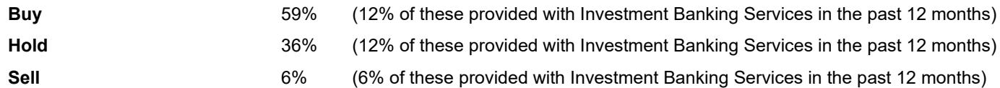

# HSBC：SNEC 2026揭示的真正信号，不是光伏回暖，而是能源系统的权力交接

每年SNEC都是中国光伏行业的一次集体亮相，但今年的信号与往年截然不同。HSBC分析师团队在2026年6月初实地走访上海SNEC后，给出的核心判断并非关于组件价格何时触底，也不是产能出清到了哪个阶段——而是整个行业的叙事重心正在发生一次根本性转移：光伏不再只是发电源，而正在成为AI算力基础设施的底层能源架构。

这份报告的价值不在于告诉读者“行业还在调整”，而在于它捕捉到了一个正在发生的结构性变化：当传统光伏供应链的展台人流稀疏、讨论沉闷时，固态变压器、AI数据中心供电一体化方案、以及住宅储能软件的智能化，正在成为新的流量中心。HSBC的观察暗示，投资者真正需要关注的不再是组件出货量或电池效率突破，而是“谁能把光伏从发电设备重新定义为算力能源接口”。

这并非一个遥远的愿景。报告指出，在SNEC现场，“绿色电力驱动AIDC”已经成为大量展台的核心叙事，从渲染图到参考架构再到实物演示，生态系统的参与度远高于一年前。而固态变压器（SST）作为连接光伏直流发电与数据中心配电的关键环节，正在成为多个企业竞相布局的焦点。

以下是我们基于HSBC这份实地调研报告提炼出的五个核心洞察，以及一个尚未被充分回答的关键问题。

## 1. 光伏供应链的“冷静”并非坏事，它意味着资本正在从制造端向应用端迁移

HSBC团队的直观感受是，与储能和AIDC主题的火爆相比，传统光伏供应链展区“明显更安静”。这不是一个孤立的观察。当组件价格仍在RMB0.69-0.75/W的主流区间承压，分布式和海外市场能清到RMB0.85-1.00/W，而更低价的订单更多集中在年初时，整个制造环节的定价权正在被持续压缩。

但“安静”不等于“没有信号”。HSBC报告揭示了一个关键的结构性转变：设备投资周期正从新建产能转向升级改造。累计TOPCon产能已超过800GW，这意味着新线建设的高峰已经过去，取而代之的是每GW约RMB3000万的改造投资，用以将组件功率从620W提升至650W以上。这是一个典型的“存量优化”叙事——资本支出强度下降，但技术迭代仍在进行。

对于投资者而言，这意味着光伏制造环节的边际价值正在从“扩产”转向“提效”。铜基浆料替代银浆、降低金属化成本等工艺优化，每瓦可带来RMB0.03-0.05的成本下降，但规模爬坡需要时间。那些能够在这个“优化而非新建”的周期中持续降本的企业，将比单纯追求出货量的公司更具防御性。

但更值得关注的是，资本和注意力的转移方向。当传统供应链变得“安静”，而储能和AIDC展区人流密集时，行业正在用脚投票：下一轮价值创造的主战场，不在制造端，而在应用端和系统集成端。

## 2. 住宅储能正在经历“硬件同质化后的渠道与软件之战”，AI能源管理已成标配

HSBC报告指出，住宅储能是SNEC现场人流最密集的展区之一。但最值得关注的不是热度本身，而是竞争格局的变化方向。报告明确提出，硬件差异化正在收窄，竞争正在向渠道、认证、交付和软件服务转移。

“AI驱动的能源管理”已经不再是少数厂商的差异化卖点，而是被大量展商定位为“基线能力”。这意味着，能够实现电价套利、智能调度、预测控制和虚拟电厂参与等功能的系统，正在从“锦上添花”变成“入场券”。同时，一体化系统的普及正在简化安装流程和用户体验，进一步降低了新进入者的门槛。

这个趋势对行业格局的含义是双重的。一方面，硬件的商品化会加速价格竞争，压缩制造环节的利润空间。另一方面，软件和渠道能力的价值正在被重新定价——谁能通过AI算法更精准地管理用户侧储能，谁就能在电力市场化和虚拟电厂崛起的背景下，获得更高的客户粘性和服务溢价。

对于投资者而言，评估住宅储能企业的框架需要从“出货量增速”转向“软件订阅收入占比”和“渠道覆盖密度”。硬件制造的规模效应正在让位于软件生态的网络效应。

## 3. 固态变压器正在成为AIDC与光伏之间的“隐形冠军”，但生命周期经济性仍是最大未知数

HSBC报告中最具前瞻性的观察之一，是固态变压器（SST）在数据中心供电方案中的崛起。报告明确指出，多家企业正在开发基于SST的AIDC电源解决方案，竞争强度“真实且正在上升”。

SST之所以重要，是因为它解决了光伏发电与AI数据中心之间最关键的接口问题：直流耦合与系统级集成。传统的数据中心配电架构基于交流变压和UPS系统，而光伏发电天然是直流电，AI芯片的供电也越来越倾向于直流微网架构。SST作为连接这两端的核心器件，其效率和可靠性直接影响数据中心的PUE（电能使用效率）和整体运营成本。

然而，HSBC报告也给出了一个必要的审慎判断：尽管兴趣浓厚，但部署速度预计会较慢。原因在于，SST的生命周期经济性、效率表现、对PUE的实际影响、可靠性数据以及标准化进程，都还需要时间来验证和证明。

这意味着，SST目前处于一个典型的“预期先行、业绩滞后”的阶段。对于投资者来说，关键不是判断SST会不会成为主流——从技术逻辑看，这几乎是必然的——而是判断谁能在标准化和成本下降过程中占据先机。报告没有给出明确的胜出者，但指出“多家企业”正在竞逐，这意味着竞争格局尚未定型，技术路线和客户验证将成为未来12-18个月的核心观察变量。

## 4. 太空太阳能仍然“小众但旗舰”，商业化时间表指向2027年，SpaceX的目标被谨慎对待

太空太阳能是HSBC报告中的一个有趣插曲。尽管参展商数量有限，但那些展示了太空相关产品的企业，都将其放在展台的核心位置——这是一种“旗舰叙事”而非“配角展示”。

技术方向正在从依赖GaAs向硅基柔性方案和叠层概念演进，目标效率超过30%，而当前硅基太空电池的效率约为20%。轻量化材料被反复提及，特别是太空无色聚酰亚胺薄膜（SCPI）作为传统玻璃盖层的替代品，能够实现360度弯曲、承受约1万次弯折而不损坏，而超薄玻璃在约20次弯折后就会破裂。

但商业化时间表仍然遥远。HSBC报告指出，行业预期需要多轮验证周期——地面测试加在轨测试，每轮3-6个月，需要多次在轨试验机会来加速迭代。有意义的订单转化更可能在2027年左右发生。

更重要的是，HSBC团队发现，企业和投资者对SpaceX和特斯拉提出的“三年内在美国实现100GW/年的太阳能制造能力”目标，普遍持保守态度。这意味着，太空太阳能虽然概念上令人兴奋，但在可预见的投资周期内，它更可能是一个长期期权而非短期催化剂。

## 5. 储能仍是“增长与故事”的引擎，但C&I储能正在从配角变成主角

HSBC报告确认了一个行业共识：储能仍然是当前增长叙事最强的板块，吸引了比组件展区更多的人流和关注度。但报告揭示了一个重要的结构变化：工商业储能（C&I storage）正在快速崛起，而大型储能（utility-scale）则变得越来越拥挤和价格竞争。

C&I储能被反复描述为一个快速增长的市场，项目管道稳定性正在改善。相比之下，大型储能由于参与者众多、价格竞争激烈，正在推动部分企业转向海外市场或利基项目结构。

这个分化的含义很清晰：在大型储能领域，竞争优势正在从“产能规模”转向“定价纪律”和“成本传导能力”。随着电池原材料成本波动，能够灵活调整定价同时保护利润率的企业，将成为赢家。而在C&I储能领域，由于客户分散、应用场景多样，渠道能力和定制化解决方案的价值更高。

对于投资者而言，这意味着储能赛道的投资逻辑需要细分：大型储能更像大宗商品生意，利润取决于成本控制和产能利用率；C&I储能则更像服务生意，利润取决于客户获取效率和解决方案的差异化。

## 报告尚未完全回答的关键问题：固态变压器的生命周期经济性如何量化，以及谁能在标准化竞赛中占据先机

HSBC报告在SST领域提供了清晰的趋势判断，但有一个关键问题没有被完全回答：SST的生命周期经济性到底如何？报告指出，部署速度“pending proof of lifecycle economics and efficiency”，但并未给出具体的效率指标、成本曲线或者与现有方案的对比数据。

这是一个合理的空白，因为SST技术仍处于早期商业化阶段，行业本身也缺乏足够长的运行数据来支撑可靠的TCO（总拥有成本）分析。但对于投资者来说，这恰恰是最需要跟踪的变量。如果SST的全生命周期成本能够在未来12-18个月内接近或低于传统方案，那么AIDC与光伏的融合将进入一个加速期。反之，如果效率或可靠性数据不及预期，这一波热潮可能会经历一次“预期修正”。

另一个悬而未决的问题是标准化进程。SST目前仍处于多家企业各自为战的阶段，不同的拓扑结构、通信协议和接口标准可能会延缓行业规模化。谁能在标准化过程中占据主导地位，谁就能在未来的供应链中拥有更大的议价权。

这些未解问题，恰恰是深入分析SST产业链和AIDC供电架构的核心切入点。HSBC的报告提供了一个高质量的现场观察框架，但更深入的财务模型、技术路线对比和供应链图谱，需要结合更多一手信息和持续跟踪才能形成可操作的判断。

欢迎来星球微信群里继续讨论。我们会在社群中分享对SST产业链的进一步拆解，包括主要参与者的技术路线对比、生命周期成本的初步估算模型，以及AIDC供电架构变革对电力设备行业的二阶影响。这些内容在公开报告中难以完整呈现，但在持续的深度讨论中，往往能形成更清晰的判断框架。

Personal reading notes and learning share only. Not investment advice.

