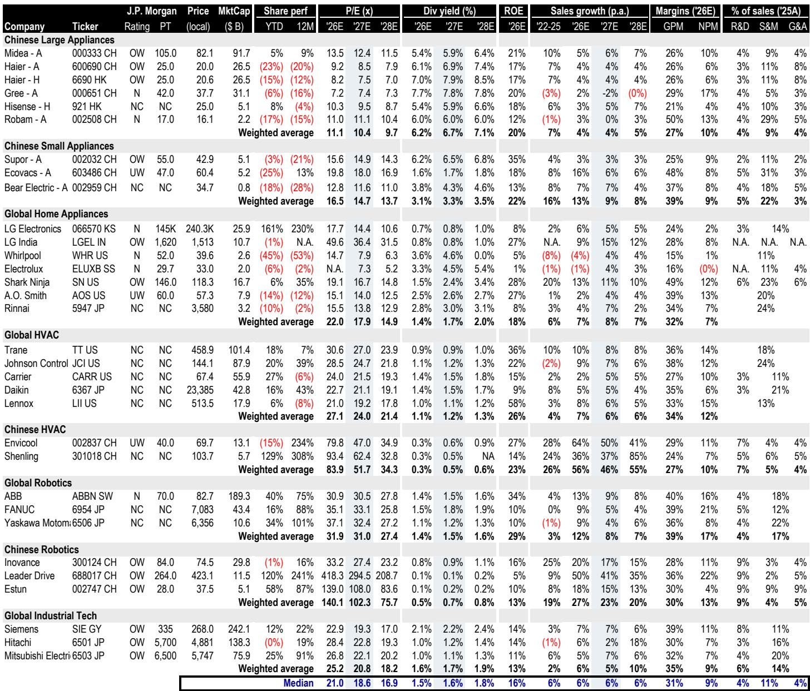
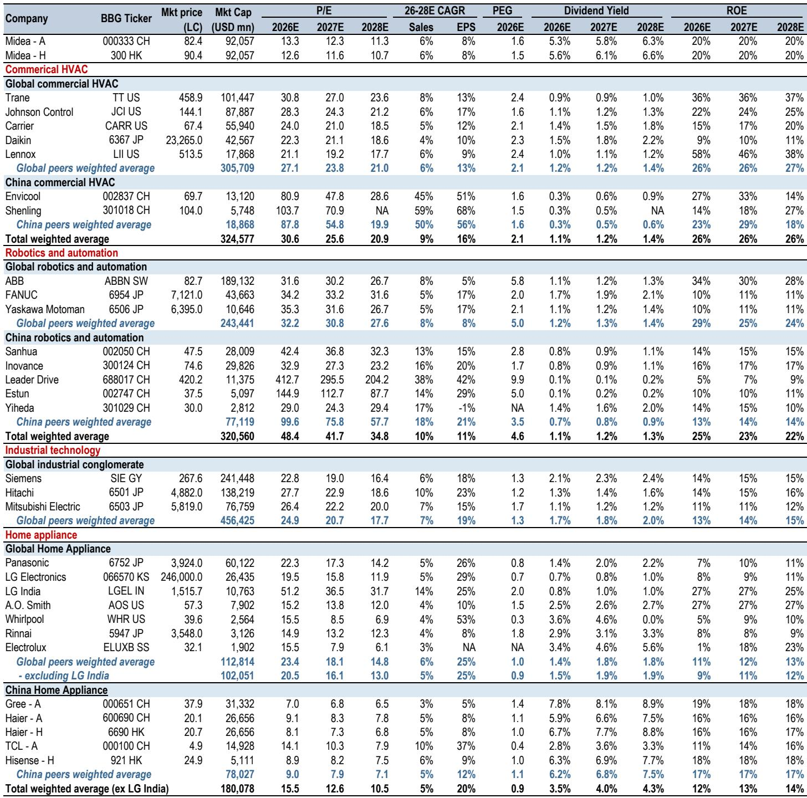
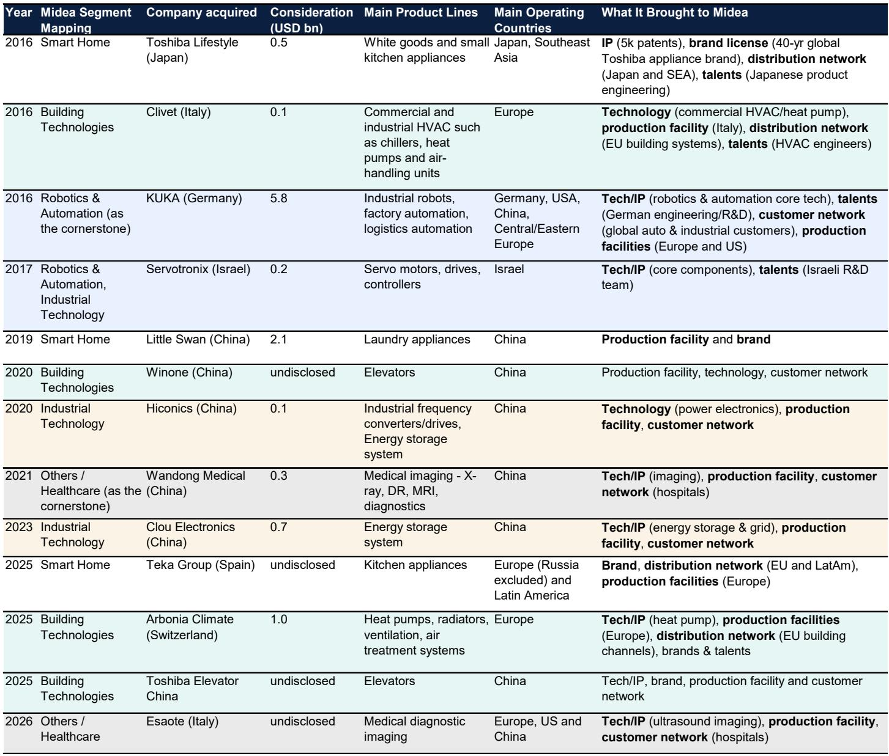

# JPM：中国家电的估值逻辑正在从“周期股”转向“复合增长引擎”

市场对家电板块的定价，可能还停留在旧世界里。10倍市盈率、6%的股息率、约20%的净资产收益率，这是当前市场给中国家电三巨头——美的、海尔、格力——的集体定价。这个定价隐含的假设是：这些公司本质上是国内耐用消费品周期股，补贴退坡后需求放缓，利润承压，估值没有扩张空间。

JPM最新发布的家电行业深度报告提出了一个根本性的问题：如果中国家电不再应该被当作一个国内家电周期来估值，而是作为“现金牛盈利 + 全球挑战者增长 + 工业科技期权价值”的组合，那会怎样？

这个问题的答案，决定了当前估值体系是否正在酝酿一次系统性重估。报告的核心判断是：市场低估的不是短期需求，而是供给侧的再定价——即龙头企业能否将中国市场的现金流，转化为全球份额扩张和B2B能力建设。而在这条逻辑线上，美的集团被选为最清晰的标的。

## 1. 国内B2C不再是增长引擎，但它是整个故事的现金基础

国内家电市场正在成熟，这是共识。补贴政策退坡后，2026年国内零售需求可能出现中个位数的下滑。JPM预计，二季度将是利润率压力测试的关键窗口：需求走弱已充分预期，但石化产品驱动的成本上升将真正考验龙头企业的定价能力和成本传导能力。基准情景下，三巨头在2026年二、三季度的毛利率将温和收缩0.5至1个百分点。

但这里的关键判断不是“利润会不会跌”，而是“龙头企业能否守住利润池”。报告指出，三巨头在国内市场合计控制了约60%的份额，核心利润池相对稳固。如果它们能在二、三季度再次证明毛利率的相对稳定，“成熟品类叠加利润率压缩”的熊市叙事就会失去说服力。

这意味着，国内B2C业务的角色正在转变：它不再是增长的主要驱动力，而是变成了一个高现金回报的“燃料箱”。这个燃料箱能否被有效再配置到更高增长的领域，才是投资者真正应该关注的变量。

## 2. 海外市场是“中国家电并未停止增长”的最直接证据

国内增长放缓，并不等于整个行业的增长曲线已经平坦。海外市场的结构性机会，是这份报告最有力的反驳论据。

数据很清楚：三巨头在国内的市场份额合计超过60%，但在中国以外的全球市场，它们的合计份额只有约16%。而海外可寻址市场大约是国内市场的三倍。这个差距本身就是增长空间。

更重要的是，增长的驱动力正在从“出口量”转向“OBM（自主品牌）规模、渠道控制和品牌经济性”。JPM预计，2026至2028财年，美的、海尔、格力的海外收入复合年增长率将分别达到11%、9%和7%。这个增速意味着，即使国内需求趋于平稳，这些公司仍然能够实现持续的收入复合增长。

海外业务不再是“锦上添花”，而是正在成为新的增长引擎。这一点对于估值框架的转变至关重要——因为全球投资者对“中国出口型公司”的估值逻辑，与对“全球品牌运营商”的估值逻辑，是完全不同的两套体系。

## 3. B2B业务是估值倍数扩张的真正钥匙，而市场尚未定价

如果说海外业务是“增长引擎”，那么B2B业务就是“估值乘数”。这是整份报告中最具洞察力的部分，也是市场定价与公司实际价值之间差距最大的地方。

商用暖通空调、数据中心液冷、欧洲热泵——这些业务看起来与传统家电无关，但它们恰好坐落在三巨头的核心能力之上：热管理、零部件深度、供应链控制、制造规模和成本下降执行力。全球商用暖通空调市场规模约1.2万亿元人民币，而三巨头合计份额仅约5%。如果执行力能够维持，这是一个极长的增长跑道。

美的集团是最清晰的案例。到2026财年，其B2B业务预计将接近总收入的30%。但市场仍然以“家电公司”的框架给它定价，几乎没有为这种业务结构的变化给予估值溢价。这个差距，就是重估的机会。

这里有一个值得深思的类比：报告专门用了一个章节的标题来提问——“美的到2030年：西门子，还是松下？”西门子代表了从工业集团转型为科技驱动型工业公司的成功案例，估值溢价显著；松下则代表了未能完成转型、被市场长期低估的教训。美的正站在这个十字路口，而市场目前给它定价的假设更接近后者。

## 4. 买入“多引擎复合增长型”公司，避开“单一引擎依赖型”公司

基于上述逻辑，JPM给出了清晰的排序。

美的集团是最优选择。它拥有最清晰的组合：中国市场的现金生成能力、海外OBM份额增长、以及B2B的期权价值。报告给出了105元人民币的目标价，对应约27%的上行空间。

海尔A/H股同样具有吸引力，尤其在海外执行力方面有优势。苏泊尔则是一个“收益质量型”标的，拥有行业最高的净资产收益率，但增长已趋于成熟。

报告对格力电器和老板电器持中性态度。两者都高度依赖国内市场的复苏，而格力还面临着高端定价模式在消费降级趋势下的挑战。

科沃斯是被明确回避的标的。报告认为，其面临三重利润率压力——物料成本上涨、竞争阻碍成本传导、以及湿干吸尘器市场份额流失——而市场共识尚未充分反映这一点。JPM的净利润率预测为8.0%，远低于市场共识的9.6%。

## 5. 报告尚未完全回答的关键问题：B2B转型的执行风险与时间窗口

这份报告的逻辑链条是清晰的，但并非没有未解的问题。其中最关键的两个，都指向B2B转型的执行层面。

第一，B2B业务的利润率曲线尚不明确。商用暖通空调和数据中心液冷虽然是高增长领域，但它们的利润率结构、客户集中度、以及资本回报率，与家电业务有本质区别。报告没有充分展开这些业务的单位经济模型，而这是评估“期权价值”能否转化为“实际价值”的核心。

第二，转型的时间窗口。即便B2B业务最终能够带来估值重估，这个过程需要多长时间？市场是否愿意为一个可能需要三到五年才能兑现的期权支付溢价？如果国内需求放缓超预期，现金流的再配置能力是否会受到制约？这些问题的答案，将决定当前估值是否已经足够安全。

对于产业决策者和长期投资者而言，这份报告最有价值的贡献不是具体的价格目标，而是提供了一个新的分析框架：不要再用“家电周期”的旧地图来导航。真正值得关注的是，哪些公司能够把中国市场的现金流，转化为全球竞争力和B2B能力。这需要超越季度数据的耐心，以及对执行力的持续跟踪。

---

这些未解问题，正是我们希望在社群中继续深入讨论的方向。B2B转型的利润率曲线如何拆解？美的与西门子的类比是否成立？海外OBM扩张的真实成本与回报周期是怎样的？如果你对这些话题感兴趣，欢迎来我们的星球微信群继续讨论，我们将基于完整报告的数据和图表，进行更细致的推演。

Personal reading notes and learning share only. Not investment advice.

