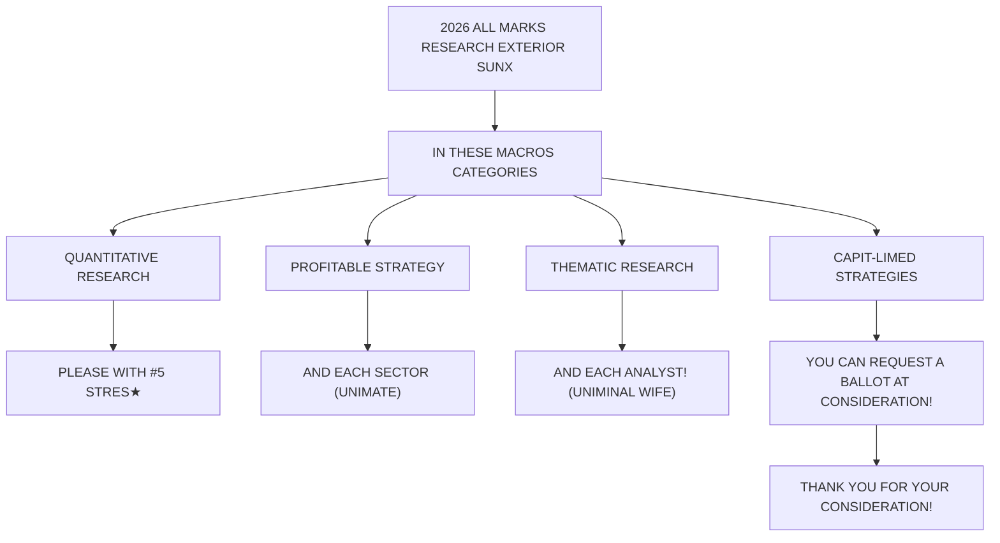

You are a senior financial newsletter editor with a consulting-style strategy lens. You turn research-report material into a long-form English article that is structured, insightful, and suitable for a serious business audience.

Objective:
- Write an English Markdown article based on the report parsing below.
- Target length: around 2200 words, plus or minus 15%.
- Tone: serious, analytical, strategic, and readable.
- The article should not feel like a summary. It should make an argument.
- You may extend the report's logic into reasonable second-order implications, but do not invent data, company actions, or quotes.
- Do not disclose every detail. Leave several meaningful open questions that make readers want the full report.

McKinsey-style writing principles:
1. Answer first: open with the controlling idea, not background.
2. Governing thought: every section must support the main answer.
3. Mutually exclusive, collectively exhaustive logic: avoid overlapping sections.
4. So what: every section must explain why the point matters.
5. Synthesis over summary: do not list facts; interpret what the pattern means.
6. Action titles: section headings must be complete, insight-bearing sentences. Do not use generic headings such as "Key Takeaways", "Market Background", "Core View", or "Reader Implications".
7. Natural hooks: if you want readers to join the community or read the full report, the hook should emerge from unresolved analytical questions, not from promotional language.

Required Markdown structure:
- `# Title`: make it a direct argument, not a topic label.
- Opening: 4-6 short paragraphs that state the main thesis and why now matters.
- 4-6 `##` sections. Each `##` heading must be an action title: a sentence that tells the reader the insight.
- One section should identify what the report does not fully answer yet.
- One section should translate the report into a decision framework for readers.
- Final section: naturally invite readers to join the community or read the full report using this CTA: Join the community to read the full report and review the original charts.
- End with: `*This article is for learning and discussion only and does not constitute investment advice.*`

Content boundaries:
- Do not mention specific investment bank names such as GS. Use "a global investment bank report" if needed.
- Do not use emoji.
- Do not write like a viral post.
- Do not output your reasoning process.
- Do not generate image Markdown; the system will insert original MinerU images afterward.

Report parsing:
"""
## Retail Radar

Jun 10 - Tech Selling amidst Drawdown, World Cup Theme Yet to Kick In

2026 Extel

All-America Equity Research Survey

CLICK TO VOTE

Voting Open May 26 $^{th}$ - June 12 $^{th}$

Please vote for JPM (5 stars)

Last week to vote!

Please vote 5 Stars for JPM and each analyst in the 2026 All-Americas Research Extel Survey in the following macro categories:

• Quantitative Research  
- Portfolio Strategy  
• Thematic Research

Request a ballot here - extelinsights.com/voting. Thank you for your consideration.

## Retail Trading Activity Overview

- Over the past week, retail investor flows have swung from one extreme to another —from outsized Tech buying last week to record-selling the sector this week. In aggregate, retail dollar imbalances fell to their lowest weekly reading in more than a year, Figure 11, reflecting weakness across both ETFs (2.8%ile) and Single Stocks (0.8%ile). Retail selling was concentrated in two clear liquidation sessions, Friday and Tuesday; in fact, Friday was the largest retail selling day in over a year.  
- When de-risking, retail investors disproportionately reduced exposure to Tech ETFs and Tech ex-Mag 7 stocks. Activity appeared largely performance-driven — P&Ls suffered drawdowns, although they did not meaningfully erode any outperformance, e.g. Figure 3; retail investors seemingly cut their losses amid Tech weakness, rather than selling to raise liquidity in anticipation of prospective opportunities (for example, there was no broad-based net selling / profit-taking as markets rebounded on Monday).  
- Retail investors' activity reflected the broader market rotation out of AI/Tech winners and into more defensive areas, e.g. Consumer Staples.

- Within ETFs, retail investors overwhelmingly sold Tech ETFs—the heaviest selling on record (-3.7z), Figure 3, and a complete reversal from last week when buying hit extreme levels (3.1z). Selling was particularly pronounced in SOXL (-2.8z), IGV (-1.5z), SMH (-2.0z), and the related Korea ETF EWY (-2.5z).  
- Within Single Stocks, retail investors sold Tech ex-Mag7 and bought Staples, Figure 14. The most-sold names this week included former favorites MU (-3.2z) and MRVL (-6.9z), alongside AMD (-3.0z), INTC (-2.0z), ARM (-7.0z) and DELL (-4.0z). It is worth noting that there was no broad-based “buying-the-dip” across Tech, with only moderate

## Equity Strategy and Quantitative Research

Arun Jain AC

(1-212) 622-9454

arun.p.jain@JPM.com

JPM Securities LLC

Shizuka Suga, CFA AC

(1-212) 622-2134

shizuka.suga@JPM.com

JPM Securities LLC

Kamal Tamboli

(1-212) 622-5794

kamal.r.tamboli@JPM.com

JPM Securities LLC

Ana Pous Avila

(1-212) 622-0496

ana.pousavila@JPM.com

JPM Securities LLC

William Matheson

(1-212) 622-9538

william.matheson@jpmchase.com

JPM Securities LLC

Khuram Chaudhry

(44-20) 7134-6297

khuram.chaudhry@JPM.com

JPM Securities plc

Bhupinder Singh AC

(1-212) 622-9812

bhupinder.singh@JPM.com

JPM Securities LLC

Dubravko Lakos-Bujas AC

(1-212) 622-3601

dubravko.lakos-bujas@JPM.com

JPM Securities LLC

All-America Equity Research Extel (I.I.) Survey is open. You can access/ask for the ballot at https://www.extelinsights.com/voting.

flowchart

exceptions in AVGO (0.7z) and SNDK (0.5z). ASML attracted comparatively stronger inflows (3.2z) as it outperformed its US Tech peers. Meanwhile, NVDA and TSLA, along with other Mag 7 names, returned to the top of retail buy lists, while AAPL reappeared among the most-sold stocks. ORCL was bought today (0.6z) into its earnings; the stock dropped \~8% post-market following the announcement.

- As the US launches new waves of strikes on Iran, we note that retail positioning has steadily increased in USO and BNO (Figure 7 and Figure 9), while stabilizing in SCO, Figure 11. Crowding in Oil Sensitive Outperformers vs. Underperformers remains persistent and has not meaningfully converged over the past few weeks, Figure 4. Outside of oil, retail investors sold GLD (-1.4z), CPER (-1.2z) and were neutral /positive IBIT (0.2z).  
- The World Cup starts on Thursday, but retail investors are not actively trading the theme, Figure 16. The expectations for likely beneficiaries are quite low given a challenging macro backdrop, geopolitical uncertainty and growing concerns about the low-end consumer. Given the magnitude of this approaching catalyst, we expect market sentiment to improve. We therefore recommend going tactically long 2026 World Cup Beneficiaries Basket (JPRWC26B) created in conjunction with input from our broader Equity Research department to best capture World Cup spending, see report.  
- Our JPM NY Quantitative and AI Conference Summaries are out alongside a short \~10 min video summary! Thank you for joining us, we look forward to hosting you again soon.

We thank G. K. Kiruthik Srinivaas and Aditya Mulye of JPM India Private Limited for their significant contributions to this report.

## Past Issues:

6/3 - MEME Earnings, Trading around IPOs  
5/27 - Theme Stack: AI, Memory, Space, Quantum  
5/13 - Software vs Semis Positioning  
5/6 - Memory and AI, the Catch-Up Trade  
4/29 - Peak Earnings, Peak Mag-7  
4/22 - Towards a MEME Revival?  
4/15 - Back to Average  
4/8 - Not Buying Despite the Ceasefire  
4/1 - In Defensive Mode  
3/25 - Selling Rips  
3/18 - From FOMO to FOHO: Fear Of Higher Oil  
3/11 - Buying Oil, Selling Energy  
3/4 - Cautiously Optimistic  
2/25 - Balanced Optimism  
2/18 - AI Software Averaging Down  
2/11 - Positioning around Dislocations  
2/4 - Softening Sentiment, Software vs Semis  
1/28 - Earnings, Intl Equities, Precious Metals  
1/21 - Unfazed through Vol Shock  
1/14 - The January Effect?  
1/7 - December Spree and a good start to January  
12/10 - 2025 Retail Mania  
12/3 - The Retail AI Trade  
11/26 - Weekly Highlights  
11/19 - 2025 Retail Mania: Dip-buying in AI  
11/12 - Bullion to Silicon: Al Gold Rush Resumes  
11/5 - Skipping the Dip, Earnings Stock Picking  
10/29 - Reaching Peak-Earnings, AI, FOMC  
10/22 - Sold GLD, onto New Memes and Earnings  
10/15 - Trading around Tariffs, AI and Earnings  
10/8 - Back after Summer Break  
10/1 - Back to Stocks, Thematic ETFs, GLD Rush  
9/24 - Precious Metals, Cyclicals and Domestic  
9/17 - FOMC, Herding in OPEN and GRAB

## Retail Trading Activity in Numbers for the Week: Jun 4 to Jun 10

- Retail flows were \$1.7B this week, well below the 12-month avg of \$6.6B/week. Retail investors continued to favor ETFs (+\$3.7B) over Single Stocks (-\$2.0B).  
- Outside of Broad Based Large Cap Equity ETFs (+\$1.7B), retail ETF buying was influenced by International EAFE (+\$222M), Equity Style Dividend (+\$211M), Multi Cap (+\$202M), and Fixed Income — Multi Sector (+\$166M).  
- This week, in line with prior weeks, retail investors continued to buy Mag7, Growth, AI datacenters and electrification (JPAMAIDE) and Growth, along with Consumer Laggards with Brand Value, see Figure 12.  
- Activity in Mag7 this week: Retail investors bought: TSLA (+\$713M), NVDA (+\$583M), GOOGL/GOOG (+\$205M), META (+\$73M), and sold MSFT (-\$11M), AMZN (-\$43M) and AAPL (-\$178M).  
- Outside of Mag7, retail investors favored Staples (+\$157M) and were net sellers of Tech (-\$2.4B), Financials (-\$343M), Consumer Discretionary (-\$202M) and Energy (-\$169M).  
- Top 5 retail stocks last week: TSLA (+\$713M), NVDA (+\$583M), GOOGL/GOOG (+\$205M), ASML (+\$179M, 3.3z) AVGO (+\$144M). Bottom 5 retail stocks: MU (-\$442M, -3.6z), MRVL (-\$376M, -7.3z), AMD (-\$322M, -2.3z), INTC (-\$190M), AAPL (-\$178M).  
- In options, retail share is off its highs, Figure 67. The most traded options were in the following names, echoing previous weeks: TSLA, MU, NVDA, MRVL, AMD, AAPL, AMZN, AVGO, META and SNDK. For the most bought/sold delta and gamma names, see Retail Activity in Options. Also see Retail Investors Options Activity by Sectors.  
- Futures Activity (Non Retail): The past week saw the largest weekly net futures sell YTD, with futures traders selling \$29.4B in total - led by NQ (\$20.4B), followed by ES (\$7.1B) and RTY (\$1.9B).

Figure 1: Tech ETF Outflows at All-Time-Highs  
Weekly flows in \$B, as of Jun 10 $^{th}$  

bar chart

| Date       | Retail Weekly Flows ($B) |
| ---------- | ------------------------ |
| 24-Jan-24  | 600                      |
| 19-Jun-24  | 500                      |
| 9-Apr-25   | 450                      |
| 3-Jun-26   | 400                      |
| 8-Apr-26   | -100                     |
| 10-Jun-26  | -300                     |

Source: JPM Equity Strategy & Quantitative Research

Figure 2: Retail P&L in ETFs - Underperforming QQQ  

line chart

| Date   | Retail Investors ETF trades %P&L | QQQ %P&L (DCA) | SPY %P&L (DCA) |
|--------|----------------------------------|----------------|----------------|
| Jan-26 | ~0.5%                            | ~0.3%          | ~0.1%          |
| Mar-26 | ~9.0%                            | ~7.0%          | ~-2.0%         |
| May-26 | ~16.0%                           | ~18.0%         | ~9.0%          |

Source: JPM Equity Strategy & Quantitative Research

Figure 3: Retail P&L in Single Stocks - Recent Drawdown  

line chart

| Date   | Retail Investors Single Stock trades %P&L | JPM AI 30 Basket %P&L (JPRAID30 <Index>, DCA) | JPM AI Software Basket %P&L (JPAMAISO <Index>, DCA) | JPM AI Datacenter/Elec. Basket %P&L (JPAMAIDE <Index>, DCA) | QQQ %P&L (DCA) |
|--------|---------------------------------------------|--------------------------------------------------|--------------------------------------------------|--------------------------------------------------|----------------|
| Jan-26 | ~0.0%                                       | ~0.0%                                            | ~0.0%                                            | ~0.0%                                            | ~0.0%          |
| Mar-26 | ~-20.0%                                     | ~-5.0%                                           | ~-10.0%                                          | ~-5.0%                                           | ~-5.0%         |
| May-26 | ~110.0%                                     | ~45.0%                                           | ~30.0%                                           | ~40.0%                                           | ~25.0%         |

Source: JPM Equity Strategy & Quantitative Research

Figure 4: Crowding in Oil Sensitive Outperformers and Underperformers - persistent  

line chart

| Year | Crowding in Oil Sensitive Outperformers (%) | Crowding in Oil Sensitive Underperformers (%) |
|------|---------------------------------------------|-----------------------------------------------|
| '90  | ~10                                         | ~-15                                          |
| '02  | ~-5                                         | ~-10                                          |
| '04  | ~30                                         | ~-5                                           |
| '06  | ~50                                         | ~-10                                          |
| '08  | ~70                                         | ~-20                                          |
| '10  | ~20                                         | ~-15                                          |
| '12  | ~10                                         | ~-10                                          |
| '14  | ~-10                                        | ~-5                                           |
| '16  | ~-50                                        | ~-10                                          |
| '18  | ~-20                                        | ~-5                                           |
| '20  | ~-30                                        | ~-10                                          |
| '22  | ~60                                         | ~-5                                           |
| '24  | ~30                                         | ~-10                                          |

Figure 5: Retail Investor Daily Purchases by Stocks and ETFs  

bar chart

| Date       | ETF   | Single Stocks |
| ---------- | ----- | ------------- |
| 10-Dec     | 1300  | 1800          |
| 17-Dec     | 900   | -200          |
| 24-Dec     | 1600  | 2700          |
| 02-Jan     | 1200  | -500          |
| 09-Jan     | 1800  | 2700          |
| 16-Jan     | 1700  | 2400          |
| 26-Jan     | 1600  | 3000          |
| 02-Feb     | 1400  | 2500          |
| 09-Feb     | 1700  | -1000         |
| 17-Feb     | 1600  | 2600          |
| 24-Feb     | 1800  | 2300          |
| 03-Mar     | 1900  | 2800          |
| 10-Mar     | 1500  | -500          |
| 17-Mar     | 1200  | 1700          |
| 24-Mar     | 1000  | -500          |
| 31-Mar     | 1500  | -500          |
| 08-Apr     | 1900  | -500          |
| 15-Apr     | 800   | -50           |
| 22-Apr     | 1100  | -50           |
| 29-Apr     | 900   | -50           |
| 06-May     | 1600  | -50           |
| 13-May     | 1300  | -50           |
| 20-May     | 1200  | -50           |
| 29-May     | 900   | -50           |
| 05-Jun     | 800   | -50           |
| Latest     | -50   | -5            |

Source: JPM Equity Strategy & Quantitative Research

Figure 6: Daily Retail Imbalance in USO  

line chart

| Date    | Net Retail Imbalance ($M) | Price (RHS) |
|---------|----------------------------|-------------|
| Jul-25  | ~0                         | ~-10        |
| Aug-25  | ~0                         | ~-15        |
| Sep-25  | ~0                         | ~-18        |
| Oct-25  | ~0                         | ~-20        |
| Nov-25  | ~0                         | ~-22        |
| Dec-25  | ~0                         | ~-25        |
| Jan-26  | ~0                         | ~-28        |
| Feb-26  | ~0                         | ~-30        |
| Mar-26  | ~0                         | ~-35        |
| Apr-26  | ~40                        | ~100        |
| May-26  | ~30                        | ~140        |
| Jun-26  | ~10                        | ~120        |

Source: JPM Equity Strategy & Quantitative Research

Figure 7: Cumulative Retail Imbalance in USO  

line chart

| Date   | Cum. Retail Imbalance ($M) | Short Interest (RHS) |
|--------|-----------------------------|----------------------|
| Jul-25 | ~10                         | ~4.0                 |
| Aug-25 | ~5                          | ~5.0                 |
| Sep-25 | ~3                          | ~6.0                 |
| Oct-25 | ~2                          | ~7.0                 |
| Nov-25 | ~1                          | ~8.0                 |
| Dec-25 | ~0                          | ~9.0                 |
| Jan-26 | ~0                          | ~10.0                |
| Feb-26 | ~10                         | ~12.0                |
| Mar-26 | ~50                         | ~14.0                |
| Apr-26 | ~180                        | ~16.0                |
| May-26 | ~250                        | ~18.0                |
| Jun-26 | ~280                        | ~20.0                |

Source: JPM Equity Strategy & Quantitative Research

Figure 8: Daily Retail Imbalance in BNO  

line chart

| Date   | Net Retail Imbalance ($M) | Price (RHS) |
|--------|---------------------------|-------------|
| Jul-25 | ~1.0                      | ~-4.0       |
| Aug-25 | ~0.5                      | ~-3.5       |
| Sep-25 | ~0.0                      | ~-3.0       |
| Oct-25 | ~0.0                      | ~-3.5       |
| Nov-25 | ~0.0                      | ~-4.0       |
| Dec-25 | ~0.0                      | ~-4.5       |
| Jan-26 | ~0.0                      | ~-5.0       |
| Feb-26 | ~0.0                      | ~-4.5       |
| Mar-26 | ~2.0                      | ~-3.0       |
| Apr-26 | ~6.0                      | ~45         |
| May-26 | ~4.0                      | ~55         |
| Jun-26 | ~2.0                      | ~45         |

Source: JPM Equity Strategy & Quantitative Research

Figure 10: Daily Retail Imbalance in SCO  

line chart

| Date   | Net Retail Imbalance ($M) | Price (RHS) |
|--------|----------------------------|-------------|
| Jul-25 | ~0                         | ~70         |
| Aug-25 | ~0                         | ~60         |
| Sep-25 | ~0                         | ~50         |
| Oct-25 | ~0                         | ~40         |
| Nov-25 | ~0                         | ~30         |
| Dec-25 | ~0                         | ~20         |
| Jan-26 | ~0                         | ~10         |
| Feb-26 | ~0                         | ~5          |
| Mar-26 | ~0                         | ~0          |
| Apr-26 | ~15                        | ~-80        |
| May-26 | ~10                        | ~-90        |
| Jun-26 | ~0                         | ~-100       |
</de

[中间内容因长度限制已省略]

pdates may be provided on companies/industries based on company-specific developments or announcements, market conditions or any other publicly available information. There can be no assurance that future results or events will be consistent with any such opinions, forecasts or projections, which represent only one possible outcome. Furthermore, such opinions, forecasts or projections are subject to certain risks, uncertainties and assumptions that have not been verified, and future actual results or events could differ materially. The value of, or income from, any investments referred to in this material may fluctuate and/or be affected by changes in exchange rates. All pricing is indicative as of the close of market for the securities discussed, unless otherwise stated. Past performance is not indicative of future results. Accordingly, investors may receive back less than originally invested. This material is not intended as an offer or solicitation for the purchase or sale of any financial instrument. The opinions and recommendations herein do not take into account individual client circumstances, objectives, or needs and are not intended as recommendations of particular securities, financial instruments or strategies to particular clients. This material may include views on structured securities, options, futures and other derivatives. These are complex instruments, may involve a high degree of risk and may be appropriate investments only for sophisticated investors who are capable of understanding and assuming the risks involved. The recipients of this material must make their own independent decisions regarding any securities or financial instruments mentioned herein and should seek advice from such independent financial, legal, tax or other adviser as they deem necessary. JPM may trade as a principal on the basis of the Research Analysts' views and research, and it may also engage in transactions for its own account or for its clients' accounts in a manner inconsistent with the views taken in this material, and JPM is under no obligation to ensure that such other communication is brought to the attention of any recipient of this material. Others within JPM, including Strategists, Sales staff and other Research Analysts, may take views that are inconsistent with those taken in this material. Employees of JPM not involved in the preparation of this material may have investments in the securities (or derivatives of such securities) mentioned in this material and may trade them in ways different from those discussed in this material. This material is not an advertisement for or marketing of any issuer, its products or services, or its securities in any jurisdiction.

Confidentiality and Security Notice: This transmission may contain information that is privileged, confidential, legally privileged, and/or exempt from disclosure under applicable law. If you are not the intended recipient, you are hereby notified that any disclosure, copying, distribution, or use of the information contained herein (including any reliance thereon) is STRICTLY PROHIBITED. Although this transmission and any attachments are believed to be free of any virus or other defect that might affect any computer system into which it is received and opened, it is the responsibility of the recipient to ensure that it is virus free and no responsibility is accepted by JPM Chase & Co., its subsidiaries and affiliates, as applicable, for any loss or damage arising in any way from its use. If you received this transmission in error, please immediately contact the sender and destroy the material in its entirety, whether in electronic or hard copy format. This message is subject to electronic monitoring: https://www.JPM.com/disclosures/email

MSCI: Certain information herein (“Information”) is reproduced by permission of MSCI Inc., its affiliates and information providers (“MSCI”) ©2026. No reproduction or dissemination of the Information is permitted without an appropriate license. MSCI MAKES NO EXPRESS OR IMPLIED WARRANTIES (INCLUDING MERCHANTABILITY OR FITNESS) AS TO THE INFORMATION AND DISCLAIMS ALL LIABILITY TO THE EXTENT PERMITTED BY LAW. No Information constitutes investment advice, except for any applicable Information from MSCI ESG Research. Subject also to msci.com/disclaimer

Sustainalytics: Certain information, data, analyses and opinions contained herein are reproduced by permission of Sustainalytics and: (1) includes the proprietary information of Sustainalytics; (2) may not be copied or redistributed except as specifically authorized; (3) do not constitute investment advice nor an endorsement of any product or project; (4) are provided solely for informational purposes; and (5) are not warranted to be complete, accurate or timely. Sustainalytics is not responsible for any trading decisions, damages or other losses related to it or its use. The use of the data is subject to conditions available at https://www.sustainalytics.com/legal-disclaimers. ©2026 Sustainalytics. All Rights Reserved.

"Other Disclosures" last revised May 16, 2026.

Copyright 2026 JPM Chase & Co. All rights reserved. This material or any portion hereof may not be reprinted, sold or redistributed without the written consent of JPM. It is strictly prohibited to use or share without prior written consent from JPM any research material received from JPM or an authorized third-party (“JPM Data”) in any third-party artificial intelligence (“AI”) systems or models when such JPM Data is accessible by a third-party.

Completed 11 Jun 2026 02:45 AM EDT

Disseminated 11 Jun 2026 02:45 AM EDT
"""
