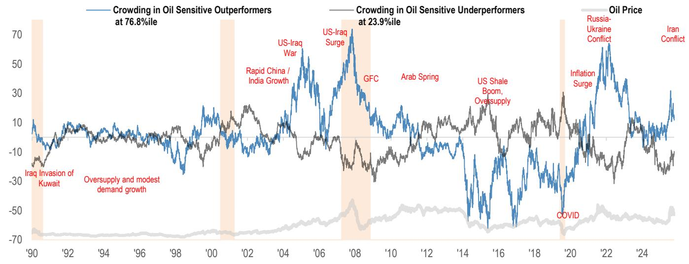

# Retail Investors Are Not Panicking: They Are Rotating, and That Changes the Signal

The largest single-day retail selling event in over a year occurred last Friday. By Tuesday, the liquidation had deepened. Retail dollar imbalances collapsed to their lowest weekly reading in more than twelve months. On the surface, this looks like fear. It looks like capitulation. It looks like the individual investor finally breaking under the weight of a tech drawdown that has punished the very names that made them money through the first half of the year.

But the data tells a more nuanced story. This was not a panic. This was a rotation — sharp, deliberate, and concentrated in precisely the sectors that had become overcrowded. Retail investors did not sell everything. They sold Tech ETFs at a record pace and bought Consumer Staples. They sold semiconductor names that had been their favorites for months and bought back into Mag7 leaders that had already corrected. They cut losses, not to raise cash for a broader market opportunity, but to reposition into areas they believe offer relative safety.

That distinction matters. A panicked retail base liquidates indiscriminately. A rotating retail base is still engaged, still making active decisions, and still capable of snapping back into risk when the narrative shifts. The question is not whether retail is fleeing the market. The question is whether this rotation is a defensive pause before a new leg higher, or the beginning of a more structural shift away from the AI trade that has dominated retail portfolios for two years running.

The timing of this rotation is particularly instructive. It comes ahead of the World Cup, a global event that historically generates measurable spending and sentiment uplift. Yet retail investors are not positioning for it. It comes alongside escalating geopolitical tensions in the Middle East, where oil-sensitive positioning has steadily increased but not yet reached extreme crowding. And it comes after a period in which retail P&Ls had built up substantial outperformance relative to benchmarks — outperformance that has now been partially, but not fully, eroded.

Understanding what retail investors are actually doing — and more importantly, what they are not doing — provides a window into where the next wave of flows may go. This article unpacks the data, identifies the strategic implications, and flags the questions that remain unanswered.

## The Record Tech ETF Selloff Was a De-Risking Event, Not a Liquidation Crisis

The headline number demands attention: retail investors sold Tech ETFs at the heaviest pace on record, registering a z-score of negative 3.7 standard deviations. This is a complete reversal from the prior week, when Tech ETF buying hit extreme positive levels at 3.1 standard deviations. The swing from one extreme to the other in a single week is not normal. It suggests that a specific catalyst — likely the drawdown in AI-related names and semiconductor stocks — triggered a mechanical response in retail portfolios.

But the nature of that response reveals the strategy behind it. Retail investors did not sell broadly. They concentrated their selling in Tech ETFs and Tech ex-Mag7 single stocks. The most-sold names included MU, MRVL, AMD, INTC, ARM, and DELL — all former retail favorites that had run hard and were now underperforming. The selling was performance-driven. Retail P&Ls had suffered drawdowns, but those drawdowns did not meaningfully erode the year-to-date outperformance that retail investors had built up.

This is the critical distinction: retail investors were not selling because they needed liquidity. They were selling because they wanted to protect gains. When markets rebounded on Monday, there was no broad-based net selling or profit-taking. That is not the behavior of a frightened investor base. That is the behavior of a tactical trader who recognizes that the easy money in a particular trade has been made and is willing to step aside to preserve capital.

The implication for institutional investors is straightforward: retail flows are now a contrarian signal of timing, not a signal of conviction. When retail buying reaches extreme levels in a sector, as it did in Tech the prior week, it may indicate that the trade is crowded and vulnerable. When retail selling reaches extreme levels, as it did this week, it may indicate that the forced selling is largely done and that the sector could stabilize or rebound. The record selloff in Tech ETFs may actually be a near-term bullish signal for the sector, not a bearish one.

## Retail Investors Are Rotating Into Staples and Oil, But the World Cup Trade Has Not Yet Materialized

The rotation out of Tech did not go into cash. It went into Consumer Staples, which saw net buying of $157 million, and into oil-related ETFs such as USO and BNO, where retail positioning has steadily increased over recent weeks. Retail investors also bought Mag7 names selectively — TSLA, NVDA, GOOGL, and META all returned to the top of retail buy lists — while selling AAPL and MSFT.

This pattern suggests that retail investors are not abandoning risk entirely. They are shifting from high-beta, high-momentum Tech names into more defensive sectors and into names that have already corrected to levels they find attractive. The Mag7 buying is particularly telling: these are the names that have the highest brand recognition and the deepest retail following. When retail investors want safety, they do not buy Treasuries. They buy Apple, Tesla, and Nvidia after a pullback.

The oil trade is more complex. Retail positioning in USO and BNO has increased steadily, but crowding in oil-sensitive outperformers versus underperformers has not meaningfully converged. This suggests that retail investors are still in the early stages of building oil exposure, not at the point of overcrowding. If geopolitical tensions persist or escalate, there may be room for further retail inflows into energy.

The most surprising absence is the World Cup. The tournament starts this week, and historically, major sporting events generate measurable spending and sentiment shifts in consumer-facing sectors. Yet retail investors are not actively trading the theme. The report notes that expectations for likely beneficiaries are quite low given the challenging macro backdrop, geopolitical uncertainty, and growing concerns about the low-end consumer. This is a meaningful data point. If retail investors are not positioning for a catalyst as visible as the World Cup, it suggests that the broader sentiment environment remains cautious, and that any positive surprise from the event could trigger a delayed positioning response.

## The Retail P&L Drawdown Has Not Broken the Narrative, But It Has Changed the Behavior

Retail investor P&Ls in single stocks had built up substantial outperformance through the first half of the year. The recent drawdown has partially eroded that outperformance, but it has not eliminated it. This is visible in the data: retail single-stock P&Ls remain above benchmark levels even after the selloff, and retail ETF P&Ls have underperformed QQQ but not catastrophically so.

The behavioral implications are significant. Retail investors who are still sitting on year-to-date gains are more likely to view the current drawdown as a buying opportunity rather than a reason to exit entirely. They have a cushion. They have not been wiped out. Their willingness to re-engage in risk assets depends on whether the drawdown stabilizes or deepens.

If the drawdown stabilizes, retail investors are likely to rotate back into the names they know and trust — Tech, Mag7, and AI-related plays — particularly if the World Cup generates positive sentiment or if geopolitical tensions ease. If the drawdown deepens, the cushion will erode, and the selling could become more indiscriminate. The difference between a rotation and a liquidation is a matter of a few percentage points in portfolio performance.

This is where the institutional reader must pay close attention. Retail flows are not a leading indicator of market direction, but they are a powerful amplifier of existing trends. When retail investors are buying, they add momentum. When they are selling, they accelerate drawdowns. The current rotation suggests that retail is still engaged and still making active decisions. That is a more constructive signal than a complete withdrawal from risk assets would be.

## What the Report Does Not Yet Answer: Is This a Tactical Pause or a Structural Shift?

The report provides a detailed snapshot of retail behavior over a single week, but it cannot answer the deeper strategic question: is this rotation a temporary tactical adjustment, or is it the beginning of a structural shift away from the AI and Tech themes that have dominated retail portfolios for two years?

Several open questions remain. First, will retail investors return to Tech buying once the drawdown stabilizes, or has the experience of the past week permanently altered their risk appetite? The record selloff in Tech ETFs suggests that the trade had become extremely crowded, and extreme crowding often marks a turning point. But retail investors have demonstrated a remarkable ability to re-engage in the same names after pullbacks, particularly when those names are household brands.

Second, how will the World Cup affect retail sentiment and positioning? If the tournament generates positive consumer spending data and a broader sense of economic normalcy, retail investors may use it as a reason to rotate back into risk. If the tournament is overshadowed by geopolitical events or disappointing economic data, the current defensive posture may persist.

Third, what is the institutional response to this retail rotation? Futures activity showed the largest weekly net futures sell of the year, led by NQ and ES. Institutions are reducing exposure at the same time that retail is rotating. The convergence of institutional selling and retail rotation could create a period of low volatility and low conviction, or it could set the stage for a sharp reversal if one side of the trade proves wrong.

These are not questions that a single week of data can answer. They require ongoing observation of retail flows, institutional positioning, and the macroeconomic catalysts that drive both.

## A Decision Framework for Interpreting Retail Flow Signals

For readers who want to apply the insights from this report to their own investment process, the following framework may be useful. It is not a trading signal. It is a lens for interpreting what retail flows mean in the current context.

First, distinguish between rotation and liquidation. Rotation is characterized by concentrated selling in specific sectors and concentrated buying in others. Liquidation is characterized by broad-based selling across sectors and asset classes. The current data points to rotation, not liquidation. That is a constructive signal.

Second, compare retail flow extremes to P&L performance. When retail selling reaches extreme levels but P&Ls have not been meaningfully impaired, the selling is likely tactical and may be followed by re-engagement. When retail selling reaches extreme levels and P&Ls are deeply negative, the selling is likely structural and may be followed by further outflows.

Third, monitor the sectors that retail is buying during the rotation. If retail is rotating into defensive sectors like Staples and Utilities, it suggests a cautious outlook. If retail is rotating into cyclical sectors like Energy and Financials, it suggests a more opportunistic posture. The current rotation into Staples and oil, combined with selective Mag7 buying, suggests a cautious but not fearful stance.

Fourth, watch for convergence or divergence in crowded trades. The report notes that crowding in oil-sensitive outperformers versus underperformers has not meaningfully converged. When crowded trades begin to converge, it often signals that the trade is breaking down. When they persist, it signals that the trend remains intact.

Finally, use retail flow data as a contrarian timing tool, not a conviction indicator. Extreme retail buying in a sector often precedes a pullback. Extreme retail selling often precedes a stabilization or rebound. The record Tech ETF selloff may be a near-term bullish signal for the sector, but it does not tell you whether the longer-term AI theme is intact.

## Join the Community to Read the Full Report and Review the Original Charts

The analysis above is based on a single week of data from a single source. The full report contains additional charts on retail options activity, sector-level flow breakdowns, historical context for the current rotation, and the proprietary World Cup beneficiary basket that the research team has constructed. It also includes detailed data on retail positioning in oil, gold, and other commodity-linked assets that were not covered in this article.

For readers who want to track these flows in real time and apply the framework to their own decision-making, the original report and its accompanying charts are essential. The data is granular. The context is historical. And the implications are actionable.

Join the community to read the full report and review the original charts.

*This article is for learning and discussion only and does not constitute investment advice.*

Personal reading notes and learning share only. Not investment advice.

