## IP Toys Monthly Tracker - May

Pop Mart's share price has been resilient since its 1Q26 earnings release on 13 May. While Mr. Duan Yongping's purchase of 81m shares (c.6% stake) in late May boosted market confidence, we do not see any material change in fundamentals. Key catalysts ahead include: (1) the launch of Labubu 4.0, and (2) World Cup-related promotions, which could further drive overseas momentum.

## China

- Second-hand prices: Labubu plush second-hand prices stabilized MoM. Of the top 30 most wanted products on the second-hand exchange platforms, we see more diversity: three of them are non-Pop Mart products, while the Pop Mart x aespa collaboration remains most wanted.  
- Ecommerce sales: Meritco has not released May data yet; Apr data shows Pop Mart's GMV on ecommerce platforms was up 70% YoY and up 25% MoM. Meanwhile, Bloks' ecommerce sales were up 16% you, and Miniso's was up 11% YoY in Apr.

## Overseas

- Social media interactions: Amid the ongoing normalization trend, Pop Mart's engagement on TikTok picked up in May for its global and Thailand accounts, which were up 49% and 67% MoM, respectively.  
- Social media followers: In May, Pop Mart added 13k new Instagram followers across its Global, Thailand, US, and UK accounts combined (vs. +19k in Apr; Figures 19-20).  
- Website traffic & app active users: Pop Mart app's active users declined in May, both globally and in the US. Global and regional Google Search Trends for Pop Mart continued to trend downward (Figures 21-24).

## New Product Launches/events

- Pop Mart: Pop Mart's 1Q26 results were broadly in line with market expectations, while the post-earnings call highlighted possible margin pressure in 2026 (refer to our report). Despite this, the share price was resilient, supported by Duan Yongping's purchase of 81m shares, representing c.6% of total shares outstanding, between 25–28 May, making him a substantial shareholder of the company (Figure 3).  
- On the product front, Pop Mart stepped up global marketing initiatives through World Cup-related promotions, including an appearance in the music video of the official FIFA World Cup 2026 song "Goals", and a collaboration with Coca-Cola to launch Labubu-branded cans in China.  
- Bloks: Bloks launched 13 new series in May (vs. 12 in Apr and 21 in 1Q26). The new releases feature a more diversified IP portfolio, with a particular focus on Star Wars, while the company continued to emphasize assembly vehicle products. Looking ahead, Bloks is expected to launch collaborative products tied to Toy Story 5 ahead of the movie's release in late June.

[Continued inside.]

Figure 1 - Pop Mart Labubu 1.0 second-hand price in mainland China  
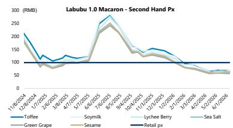

line chart

| Date | Toffee | Soymilk | Lychee Berry | Sea Salt | Green Grape | Sesame |
| --- | --- | --- | --- | --- | --- | --- |
| 11/8/2004 | 200 | 100 | 100 | 100 | 100 | 100 |
| 12/7/2004 | 150 | 100 | 100 | 100 | 100 | 100 |
| 2/6/2005 | 125 | 100 | 100 | 100 | 100 | 100 |
| 3/5/2005 | 125 | 100 | 100 | 100 | 100 | 100 |
| 4/4/2005 | 125 | 100 | 100 | 100 | 100 | 100 |
| 5/3/2005 | 125 | 100 | 100 | 100 | 100 | 100 |
| 6/2/2005 | 125 | 100 | 100 | 100 | 100 | 100 |
| 7/9/2005 | 250 | 250 | 250 | 250 | 250 | 250 |
| 8/6/2005 | 250 | 250 | 250 | 250 | 250 | 250 |
| 9/4/2005 | 250 | 250 | 250 | 250 | 250 | 250 |
| 10/3/2005 | 250 | 250 | 250 | 250 | 250 | 250 |
| 11/2/2005 | 250 | 250 | 250 | 250 | 250 | 250 |
| 12/9/2005 | 250 | 250 | 250 | 250 | 250 | 250 |
| 1/7/2006 | 250 | 250 | 250 | 250 | 250 | 250 |
| 2/6/2006 | 250 | 250 | 250 | 250 | 250 | 250 |
| 3/4/2006 | 250 | 250 | 250 | 250 | 250 | 250 |
| 4/3/2006 | 250 | 250 | 250 | 250 | 250 | 250 |
| 5/2/2006 | 250 | 250 | 250 | 250 | 250 | 250 |
| 6/1/2006 | 250 | 250 | 250 | 250 | 250 | 250 |
| Jun-16-26 | 17.7 | 17.7 | 17.7 | 17.7 | 17.7 | 17.7 |
| Jul-16-26 | 17.7 | 17.7 | 17.7 | 17.7 | 17.7 | 17.7 |
| Aug-16-26 | 17.7 | 17.7 | 17.7 | 17.7 | 17.7 | 17.7 |
| Sep-16-26 | 17.7 | 17.7 | 17.7 | 17.7 | 17.7 | 17.7 |
| Oct-16-26 | 17.7 | 17.7 | 17.7 | 17.7 | 17.7 | 17.7 |
| Nov-16-26 | 17.7 | 17.7 | 17.7 | 17.7 | 17.7 | 17.7 |
| Dec-16-26 | 17.7 | 17.7 | 17.7 | 17.7 | 17.7 | 17.7 |
| Jan-17-26 | 17.7 | 17.7 | 17.7 | 17.7 | 17.7 | 17.7 |
| Feb-17-26 | 17.7 | 17.7 | 17.7 | 17.7 | 17.7 | 17.7 |
| Mar-18-26 | 17.7 | 17.7 | 17.7 | 17.7 | 17.7 | 17.7 |
| Apr-18-26 | 17.7 | 17.7 | 17.7 | 17.7 | 17.7 | 17.7 |
| May-18-26 | 17.7 | 17.7 | 17.7 | 17.7 | 17.7 | 17.7 |
| Jun-18-26 | 17.7 | 17.7 | 17.7 | 17.7 | 17.7 | 17.7 |
| Jul-18-26 | nan | nan | nan | nan | nan | nan |
| Aug-18-26 | nan | nan | nan | nan | nan | nan |
| Sep-18-26 | nan | nan | nan | nan | nan | nan |
| Oct-18-26 | nan | nan | nan | nan | nan | nan |
| Nov-18-26 | nan | nan | nan | nan | nan | nan |
| Dec-18-26 | nan | nan | nan | nan | nan | nan |
| Jan-19-26 | nan | nan | nan | nan | nan | nan |
| Feb-19-26 | nan | nan | nan | nan | nan | nan |
| Mar-19-26 | nan | nan | nan | nan | nan | nan |
| Apr-19-26 | nan | nan | nan | nan | nan | nan |
| May-19-26 | nan | nan | nan | nan | nan | nan |
| Jun-19-26 | nan | nan | nan | nan | nan | nan |
| Jul-19-26 | nan | nan | nan | nan | nan | nan |
| Aug-19-26 | nan | nan | nan | nan | nan | nan |
| Sep-19-26 | nan | nan | nan | nan | nan | nan |
| Oct-19-26 | nan | nan | nan | nan | nan | nan |
| Nov-19-26 | nan | nan | nan | nan | nan | nan |
| Dec-19-26 | nan | nan | nan | nan | nan | nan |

Source: Chaowanzu, JEF. Note: official retail price is RMB99

Figure 2 - Pop Mart Instagram Interaction Index  
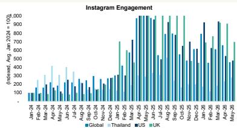

bar chart

| Month   | Global | Thailand | US   |
|---------|--------|----------|------|
| Jan-24  | 100    | 100      | 100  |
| Feb-24  | 150    | 150      | 150  |
| Mar-24  | 200    | 200      | 200  |
| Apr-24  | 250    | 250      | 250  |
| May-24  | 300    | 300      | 300  |
| Jun-24  | 350    | 350      | 350  |
| Jul-24  | 400    | 400      | 400  |
| Aug-24  | 450    | 450      | 450  |
| Sep-24  | 500    | 500      | 500  |
| Oct-24  | 550    | 550      | 550  |
| Nov-24  | 600    | 600      | 600  |
| Dec-24  | 650    | 650      | 650  |
| Jan-25  | 700    | 700      | 700  |
| Feb-25  | 750    | 750      | 750  |
| Mar-25  | 800    | 800      | 800  |
| Apr-25  | 850    | 850      | 850  |
| May-25  | 900    | 900      | 900  |
| Jun-25  | 950    | 950      | 950  |
| Jul-25  | 1000   | 1000     | 1000 |
| Aug-25  | 1050   | 1050     | 1050 |
| Sep-25  | 1100   | 1100     | 1100 |
| Oct-25  | 1150   | 1150     | 1150 |
| Nov-25  | 1200   | 1200     | 1200 |
| Dec-25  | 1250   | 1250     | 1250 |
| Jan-26  | 1300   | 1300     | 1300 |
| Feb-26  | 1350   | 1350     | 1350 |
| Mar-26  | 1400   | 1400     | 1400 |
| Apr-26  | 1450   | 1450     | 1450 |
| May-26  | 1500   | 1500     | 1500 |

Source: Listen First, JEF, Note: Jan-2024 = 100, interactions include likes, comments, and forwards.

Figure 3 - Pop Mart shareholdings breakdown: Duan Yong Ping is now a substantial shareholder

<table><tr><td>Total no.of shares</td><td>1,341,043,150</td><td>100.0%</td></tr><tr><td>GWF</td><td>561,131,960</td><td>41.84%</td></tr><tr><td>Pop Mart Hehuo</td><td>62,053,027</td><td>4.63%</td></tr><tr><td>Tianjin Paqu</td><td>31,196,420</td><td>2.33%</td></tr><tr><td>Owned by Mr. Wang</td><td>654,381,407</td><td>48.80%</td></tr><tr><td>Sidsi</td><td>10,616,060</td><td>0.79%</td></tr><tr><td>Justin Moon</td><td>1,319,618</td><td>0.10%</td></tr><tr><td>Owned by mgmt</td><td>11,935,678</td><td>0.89%</td></tr><tr><td>Andrew Yue Wu</td><td>8,609</td><td>0.00%</td></tr><tr><td>Owned by Non-executive director</td><td>8,609</td><td>0.00%</td></tr><tr><td>Duan Yongping</td><td>81,031,600</td><td>6.04%</td></tr></table>

Source: HKEX, JEF, Note: as of 8 June 2026

Jingjue Pei \* | Equity Analyst

852 3767 1224 | jingjue.pei@JEF.com

Anne Ling \* | Equity Analyst

852 3743 8783 | aling@JEF.com

## Ecommerce sales trackers

May data will be available after 15 June.

Figure 4 - Pop Mart eCommerce sales  
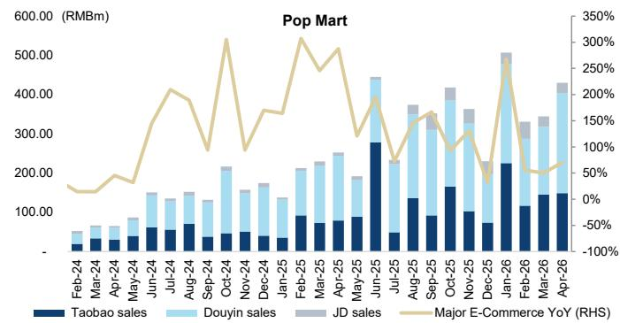

bar-line hybrid

Pop Mart
| Month | Taobao sales (RMBm) | Douyin sales (RMBm) | JD sales (RMBm) | Major E-Commerce YoY (%) |
|---|---|---|---|---|
| Feb-24 | 30.00 | 50.00 | 10.00 | 150 |
| Mar-24 | 35.00 | 55.00 | 12.00 | 140 |
| Apr-24 | 40.00 | 60.00 | 15.00 | 180 |
| May-24 | 50.00 | 70.00 | 20.00 | 220 |
| Jun-24 | 60.00 | 140.00 | 25.00 | 350 |
| Jul-24 | 70.00 | 130.00 | 30.00 | 380 |
| Aug-24 | 80.00 | 140.00 | 35.00 | 360 |
| Sep-24 | 90.00 | 130.00 | 40.00 | 280 |
| Oct-24 | 150.00 | 210.00 | 55.00 | 320 |
| Nov-24 | 160.00 | 155.00 | 65.00 | 250 |
| Dec-24 | 175.00 | 175.00 | 75.00 | 280 |
| Jan-25 | 185.00 | 135.00 | 85.00 | 310 |
| Feb-25 | 95.00 | 215.00 | 195.00 | 335 |
| Mar-25 | 85.00 | 225.00 | 195.00 | 315 |
| Apr-25 | 95.00 | 255.00 | 195.00 | 335 |
| May-25 | 95.00 | 195.00 | 195.00 | 285 |
| Jun-25 | 285.00 | 445.00 | 395.00 | 365 |
| Jul-25 | 65.00 | 235.00 | 195.00 | 185 |
| Aug-25 | 135.00 | 375.00 | 375.00 | 195 |
| Sep-25 | 95.00 | 315.00 | 315.00 | 175 |
| Oct-25 | 165.00 | 415.00 | 415.00 | 195 |
| Nov-25 | 115.00 | 375.00 | 375.00 | 165 |
| Dec-25 | 85.00 | -65.00 | -65.00 | -47 |
| Jan-26 | 225.00 | 375.00 | 512.56 | 277 |
| Feb-26 | 115.00 | 337.56 | 337.56 | -67 |
| Mar-26 | 145.00 | 425.00 | 375.66 | -67 |
| Apr-26 | 148.76 | 437.56 | 425.66 | -67 |
The chart displays a bar chart for Taobao sales and Douyin sales, alongside a line graph for JD sales, with the line representing the year-over-year growth rate of major e-commerce YoY (%). The data is already in English.

Source: Meritco, JEF

Figure 6 - Kayou eCommerce sales  
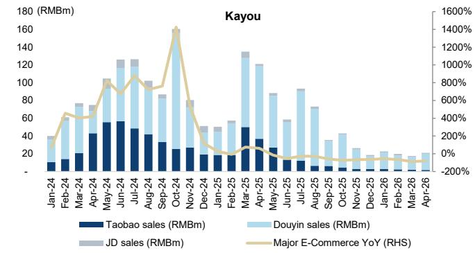

bar-line hybrid

Kayou
| Month | Taobao sales (RMBm) | Douyin sales (RMBm) | JD sales (RMBm) | Major E-Commerce YoY (RHS) (%) |
|---|---|---|---|---|
| Jan-24 | 15 | 35 | 0 | 0 |
| Feb-24 | 18 | 45 | 0 | 0 |
| Mar-24 | 22 | 55 | 0 | 0 |
| Apr-24 | 45 | 60 | 0 | 0 |
| May-24 | 55 | 70 | 0 | 0 |
| Jun-24 | 58 | 75 | 0 | 0 |
| Jul-24 | 50 | 65 | 0 | 0 |
| Aug-24 | 40 | 60 | 0 | 0 |
| Sep-24 | 35 | 70 | 0 | 0 |
| Oct-24 | 30 | 160 | 0 | 0 |
| Nov-24 | 25 | 80 | 0 | 0 |
| Dec-24 | 20 | 50 | 0 | 0 |
| Jan-25 | 18 | 45 | 0 | -10 |
| Feb-25 | 18 | 55 | 0 | -10 |
| Mar-25 | 50 | 135 | 0 | -10 |
| Apr-25 | 35 | 120 | 0 | -10 |
| May-25 | 15 | 85 | 0 | -10 |
| Jun-25 | 12 | 60 | 0 | -10 |
| Jul-25 | 12 | 90 | 0 | -10 |
| Aug-25 | 12 | 70 | 0 | -10 |
| Sep-25 | 8 | 35 | 0 | -10 |
| Oct-25 | 8 | 40 | 0 | -10 |
| Nov-25 | 8 | 25 | 0 | -10 |
| Dec-25 | 8 | 15 | 0 | -10 |
| Jan-26 | 8 | 18 | 0 | -10 |
| Feb-26 | 8 | 18 | 0 | -10 |
| Mar-26 | 8 | 18 | 0 | -10 |
| Apr-26 | 8 | 18 | 0 | -10 |

Source: Meritco, JEF

Figure 8 - Top Toy eCommerce sales  
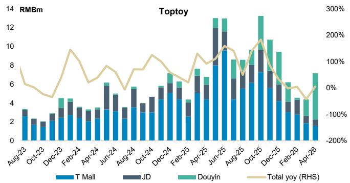

bar chart

| Month    | T Mall | JD   | Douyin | Total yoy (RHS) |
|----------|--------|------|--------|-----------------|
| Aug-23   | 3      | 1    | 0      | 80%             |
| Oct-23   | 2      | 1    | 0      | 60%             |
| Dec-23   | 3      | 1    | 0      | 40%             |
| Feb-24   | 3      | 1    | 0      | 100%            |
| Apr-24   | 3      | 1    | 0      | 60%             |
| Jun-24   | 3      | 1    | 0      | 80%             |
| Aug-24   | 3      | 1    | 0      | 60%             |
| Oct-24   | 3      | 1    | 0      | 80%             |
| Dec-24   | 5      | 1    | 0      | 90%             |
| Feb-25   | 3      | 1    | 0      | 60%             |
| Apr-25   | 5      | 1    | 0      | 100%            |
| Jun-25   | 8      | 3    | 1      | 150%            |
| Aug-25   | 7      | 3    | 2      | 120%            |
| Oct-25   | 7      | 3    | 3      | 180%            |
| Dec-25   | 5      | 3    | 4      | 100%            |
| Feb-26   | 3      | 1    | 0      | 60%             |
| Apr-26   | 2      | 1    | 1      | -20%            |

Source: Meritco, JEF

Figure 5 - Bloks eCommerce sales  
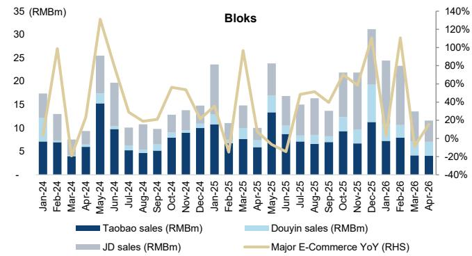

bar-line hybrid

Bloks
| Month | Taobao sales (RMBm) | Douyin sales (RMBm) | JD sales (RMBm) | Major E-Commerce YoY (RHS) |
|---|---|---|---|---|
| Jan-24 | 7 | 3 | 10 | 5% |
| Feb-24 | 7 | 5 | 8 | 100% |
| Mar-24 | 4 | 1 | 3 | -20% |
| Apr-24 | 7 | 3 | 9 | 50% |
| May-24 | 15 | 3 | 12 | 130% |
| Jun-24 | 10 | 1 | 10 | 50% |
| Jul-24 | 5 | 1 | 6 | 30% |
| Aug-24 | 5 | 1 | 6 | 20% |
| Sep-24 | 5 | 1 | 6 | 20% |
| Oct-24 | 8 | 3 | 6 | 50% |
| Nov-24 | 9 | 3 | 6 | 50% |
| Dec-24 | 11 | 3 | 10 | 30% |
| Jan-25 | 11 | 1 | 10 | 30% |
| Feb-25 | 7 | 1 | 5 | -20% |
| Mar-25 | 8 | 3 | 10 | 70% |
| Apr-25 | 7 | 1 | 6 | -10% |
| May-25 | 13 | 3 | 8 | -10% |
| Jun-25 | 9 | 1 | 10 | -20% |
| Jul-25 | 7 | 1 | 8 | 50% |
| Aug-25 | 7 | 1 | 8 | 50% |
| Sep-25 | 7 | 1 | 8 | 50% |
| Oct-25 | 9 | 3 | 8 | 60% |
| Nov-25 | 7 | 1 | 10 | 60% |
| Dec-25 | 11 | 8 | 10 | 110% |
| Jan-26 | 7 | 3 | 10 | -20% |
| Feb-26 | 8 | 3 | 10 | -20% |
| Mar-26 | 4 | 1 | 8 | -10% |
| Apr-26 | 4 | 1 | 6 | -10% |
The chart displays a stacked bar chart with the left axis showing total sales in RMBm and the right axis showing the percentage of major e-commerce year-over-year growth. The bars are segmented by sales channel: Taobao (dark blue), Douyin (light blue), JD (gray), and Major E-Commerce YoY (light yellow). The data is already in English.

Source: Meritco, JEF

Figure 7 - 52 Toys eCommerce sales  
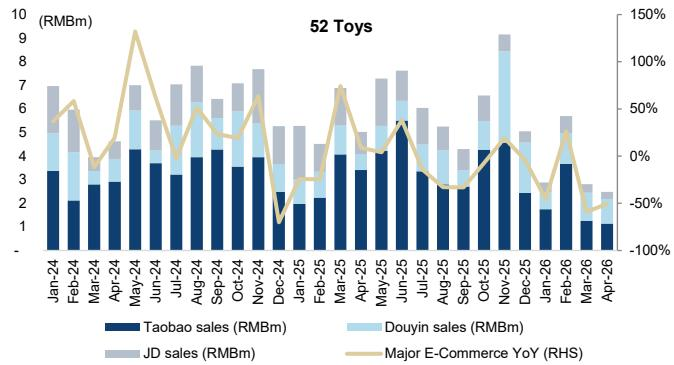

bar-line hybrid

52 Toys
| Month | Taobao sales (RMBm) | Douyin sales (RMBm) | JD sales (RMBm) | Major E-Commerce YoY (%) |
|---|---|---|---|---|
| Jan-24 | 3.3 | 1.8 | 2.0 | 30 |
| Feb-24 | 2.0 | 2.0 | 2.0 | 40 |
| Mar-24 | 2.7 | 1.6 | 1.0 | -30 |
| Apr-24 | 2.7 | 1.6 | 1.0 | 10 |
| May-24 | 4.3 | 1.9 | 1.0 | 130 |
| Jun-24 | 3.7 | 1.9 | 1.0 | -10 |
| Jul-24 | 3.3 | 1.9 | 1.0 | -30 |
| Aug-24 | 4.0 | 1.9 | 1.0 | 20 |
| Sep-24 | 3.7 | 1.9 | 1.0 | -10 |
| Oct-24 | 3.7 | 1.9 | 1.0 | -10 |
| Nov-24 | 3.9 | 1.9 | 1.0 | -10 |
| Dec-24 | 2.3 | 1.9 | 1.0 | -70 |
| Jan-25 | 2.0 | 1.9 | 1.0 | -30 |
| Feb-25 | 2.3 | 1.9 | 1.0 | -30 |
| Mar-25 | 3.8 | 1.9 | 1.0 | 70 |
| Apr-25 | 3.7 | 1.9 | 1.0 | -10 |
| May-25 | 3.8 | 1.9 | 1.0 | -10 |
| Jun-25 | 5.0 | 1.9 | 1.0 | -10 |
| Jul-25 | 3.3 | 1.9 | 1.0 | -30 |
| Aug-25 | 2.7 | 1.9 | 1.0 | -30 |
| Sep-25 | 2.7 | 1.9 | 1.0 | -30 |
| Oct-25 | 4.3 | 1.9 | 1.0 | -30 |
| Nov-25 | 4.3 | 1.9 | 1.0 | -30 |
| Dec-25 | 2.7 | 1.9 | 1.0 | -30 |
| Jan-26 | 1.7 | 1.9 | 1.0 | -30 |
| Feb-26 | 3.7 | 1.9 | 1.0 | -30 |
| Mar-26 | 1.3 | 1.9 | 1.0 | -50 |
| Apr-26 | 1.3 | 1.9 | 1.0 | -50 |
The chart displays a bar chart with two data series: 'Taobao sales' and 'Douyin sales'. The bars are grouped by month from Jan to Dec, with each bar labeled by its value in RMBm and percentage change from prior month's baseline (e.g., +5% YoY). The secondary axis on the right shows 'Major E-Commerce YoY' values as percentages.

Source: Meritco, JEF

Figure 9 - Miniso eCommerce sales  
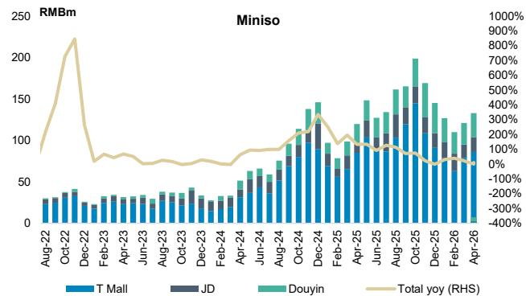

bar-line hybrid

| Month | T Mall (RMBm) | JD (RMBm) | Douyin (RMBm) | Total yoy (RHS) (%) |
| --- | --- | --- | --- | --- |
| Aug-22 | 25 | 10 | 0 | 100 |
| Sep-22 | 30 | 15 | 0 | 300 |
| Oct-22 | 35 | 20 | 0 | 700 |
| Nov-22 | 40 | 25 | 0 | 900 |
| Dec-22 | 30 | 15 | 0 | 800 |
| Jan-23 | 25 | 10 | 0 | 700 |
| Feb-23 | 25 | 10 | 0 | 600 |
| Mar-23 | 25 | 10 | 0 | 600 |
| Apr-23 | 25 | 10 | 0 | 600 |
| May-23 | 25 | 10 | 0 | 600 |
| Jun-23 | 25 | 10 | 0 | 600 |
| Jul-23 | 25 | 10 | 0 | 600 |
| Aug-23 | 25 | 10 | 0 | 600 |
| Sep-23 | 25 | 10 | 0 | 600 |
| Oct-23 | 25 | 10 | 0 | 600 |
| Nov-23 | 25 | 10 | 0 | 600 |
| Dec-23 | 25 | 10 | 0 | 600 |
| Jan-24 | 25 | 10 | 0 | 600 |
| Feb-24 | 25 | 10 | 0 | 600 |
| Mar-24 | 35 | 15 | 0 | 750 |
| Apr-24 | 45 | 20 | 0 | 850 |
| May-24 | 55 | 25 | 0 | 950 |
| Jun-24 | 65 | 30 | 0 | 1050 |
| Jul-24 | 75 | 35 | 0 | 1150 |
| Aug-24 | 85 | 40 | 0 | 1250 |
| Sep-24 | 95 | 45 | 0 | 1350 |
| Oct-24 | 115 | 55 | 15 | 175 |
| Nov-24 | 135 | 65 | 35 | 235 |
| Dec-24 | 145 | 75 | 45 | 315 |
| Jan-25e | 135 | 75 | 45 | 315 |
| Feb-25e | 145 | 85 | 65 | 315 |
| Mar-25e | 165 | 95 | 85 | 395 |
| Apr-25e | 185 | 115 | 115 | 485 |
| May-25e | 215 | 135 | 145 | 685 |
| Jun-25e | 245 | 165 | 185 | 885 |
| Jul-25e | 275 | 195 | 235 | 1185 |
| Aug-25e | 315 | 235 | 285 | 1485 |
| Sep-25e | 345 | 275 | 335 | 1785 |
| Oct-25e | 385 | 315 | 385 | 2185 |
| Nov-25e | 415 | 345 | 435 | 2485 |
| Dec-25e | 445 | 375 | 485 | 2785 |
| Jan-26e | 475 | 405 | 535 | 3185 |
| Feb-26e | 495 | 415 | 575 | 338 |

Source: Meritco, JEF

## Second-hand price trackers

Figure 10 - Pop Mart Labubu 1.0 second-hand price in mainland China  
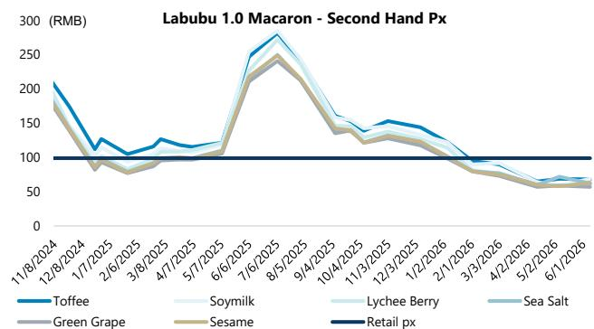

line chart

| Date | Toffee | Soymilk | Lychee Berry | Sea Salt | Green Grape | Sesame | Retail px |
| --- | --- | --- | --- | --- | --- | --- | --- |
| 11/8/2024 | 200 | 180 | 170 | 160 | 150 | 140 | 100 |
| 12/8/2024 | 150 | 130 | 120 | 110 | 100 | 90 | 100 |
| 1/7/2025 | 120 | 100 | 90 | 80 | 70 | 60 | 100 |
| 2/6/2025 | 130 | 110 | 100 | 90 | 80 | 70 | 100 |
| 3/8/2025 | 140 | 120 | 110 | 100 | 90 | 80 | 100 |
| 4/7/2025 | 150 | 130 | 120 | 110 | 100 | 90 | 100 |
| 5/7/2025 | 160 | 140 | 130 | 120 | 110 | 100 | 100 |
| 6/6/2025 | 250 | 230 | 220 | 210 | 200 | 190 | 100 |
| 7/6/2025 | 280 | 260 | 250 | 240 | 230 | 220 | 100 |
| 8/5/2025 | 270 | 250 | 240 | 230 | 220 | 210 | 100 |
| 9/4/2025 | 240 | 220 | 210 | 200 | 190 | 180 | 100 |
| 10/4/2025 | 230 | 210 | 200 | 190 | 180 | 170 | 100 |
| 11/3/2025 | 220 | 200 | 190 | 180 | 170 | 160 | 100 |
| 12/3/2025 | 230 | 210 | 200 | 190 | 180 | 170 | 100 |
| 1/2/2026 | 240 | 220 | 210 | 200 | 190 | 180 | 100 |
| 2/1/2026 | 250 | 230 | 220 | 210 | 200 | 190 | 100 |
| 3/3/2026 | 260 | 240 | 230 | 220 | 210 | 200 | 100 |
| 4/2/2026 | 270 | 250 | 240 | 230 | 220 | 210 | 100 |
| 5/2/2026 | 280 | 260 | 250 | 240 | 230 | 220 | 100 |
| 6/1/2026 | 290 | 270 | 260 | 250 | 240 | 230 | 100 |

Source: Chaowanzu, JEF. Note: official retail price is RMB99

Figure 12 - Pop Mart Twinkle Twinkle plush series second-hand price  
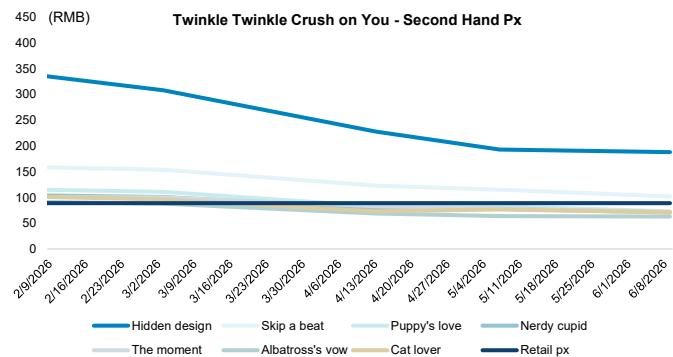  
Source: Chaowanzu, JEF. Note: official retail price is RMB89

Figure 11 - Pop Mart Labubu x Sanrio second-hand price in mainland China  
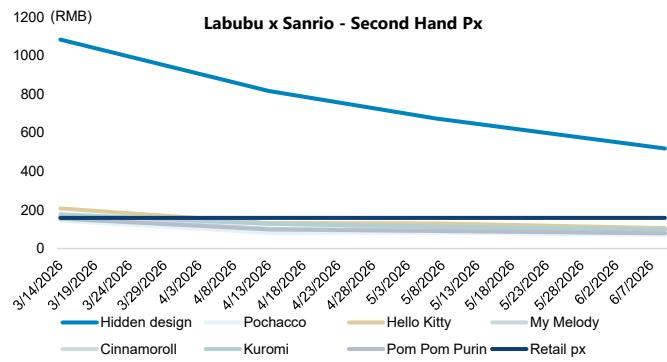

Figure 13 - Pop Mart Pucky plush series second-hand price  
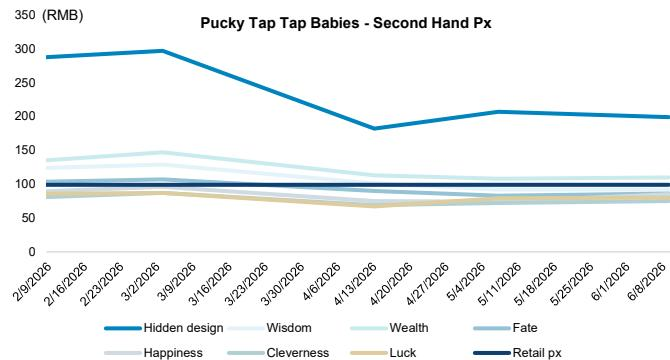  
Source: Chaowanzu, JEF. Note: official retail price is RMB99

Figure 14 - Most wanted IPs on second-hand exchange platform on 9 June

<table><tr><td>Rank</td><td>IP</td><td>Company</td><td>Rank</td><td>IP</td><td>Company</td></tr><tr><td>1</td><td>aespa</td><td>Pop Mart</td><td>16</td><td>Dimoo</td><td>Pop Mart</td></tr><tr><td>2</td><td>Zsiga</td><td>Pop Mart</td><td>17</td><td>Twinkle Twinkle</td><td>Pop Mart</td></tr><tr><td>3</td><td>Hirono</td><td>Pop Mart</td><td>18</td><td>Dimoo</td><td>Pop Mart</td></tr><tr><td>4</td><td>Twinkle Twinkle</td><td>Pop Mart</td><td>19</td><td>Spongebob</td><td>Pop Mart</td></tr><tr><td>5</td><td>Zsiga</td><td>Pop Mart</td><td>20</td><td>Twinkle Twinkle</td><td>Pop Mart</td></tr><tr><td>6</td><td>Twinkle Twinkle</td><td>Pop Mart</td><td>21</td><td>SKULLPANDA</td><td>Pop Mart</td></tr><tr><td>7</td><td>Crybaby</td><td>Pop Mart</td><td>22</td><td>Labubu</td><td>Pop Mart</td></tr><tr><td>8</td><td>Dimoo</td><td>Pop Mart</td><td>23</td><td>Dimoo</td><td>Pop Mart</td></tr><tr><td>9</td><td>Twinkle Twinkle</td><td>Pop Mart</td><td>24</td><td>Spongebob</td><td>Pop Mart</td></tr><tr><td>10</td><td>Buer</td><td>Mita</td><td>25</td><td>YOYO</td><td>Miniso</td></tr><tr><td>11</td><td>SIINONO</td><td>HERE</td><td>26</td><td>Labubu</td><td>Pop Mart</td></tr><tr><td>12</td><td>Twinkle Twinkle</td><td>Pop Mart</td><td>27</td><td>Haci Pupu</td><td>Pop Mart</td></tr><tr><td>13</td><td>Molly</td><td>Pop Mart</td><td>28</td><td>Hatti</td><td>Pop Mart</td></tr><tr><td>14</td><td>Mix-Dear Birds</td><td>Pop Mart</td><td>29</td><td>Nyota</td><td>Pop Mart</td></tr><tr><td>15</td><td>Crybaby</td><td>Pop Mart</td><td>30</td><td>Twinkle Twinkle</td><td>Pop Mart</td></tr></table>

Source: Chaowanzu, JEF. Note: this list is ranked by series; hence, one IP can appear multiple times for its different series. Yellow highlights are IPs not owned by Pop Mart and green are products from non-Pop Mart bvrand

## Interaction trackers

Figure 15 - Pop Mart TikTok Interaction Index  
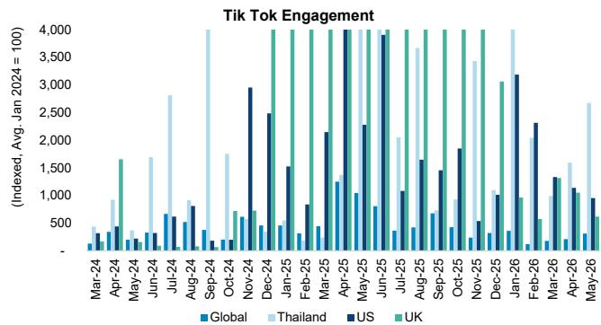

bar chart

| Month    | Global | Thailand | US   | UK   |
|----------|--------|----------|------|------|
| Mar-24   | 100    | 300      | 100  | 100  |
| Apr-24   | 200    | 900      | 300  | 1700 |
| May-24   | 100    | 300      | 100  | 100  |
| Jun-24   | 100    | 1700     | 300  | 1700 |
| Jul-24   | 100    | 2800     | 600  | 1700 |
| Aug-24   | 100    | 900      | 800  | 1700 |
| Sep-24   | 100    | 400      | 300  | 1700 |
| Oct-24   | 100    | 1700     | 300  | 700  |
| Nov-24   | 100    | 3900     | 3900 | 700  |
| Dec-24   | 100    | 2500     | 1500 | 4000 |
| Jan-25   | 100    | 500      | 800  | 4000 |
| Feb-25   | 100    | 800      | 1500 | 4000 |
| Mar-25   | 100    | 2100     | 1500 | 4000 |
| Apr-25   | 1300   | 1300     | 2300 | 4000 |
| May-25   | 1100   | 3900     | 2300 | 4000 |
| Jun-25   | 800    | 3900     | 3900 | 4000 |
| Jul-25   | 400    | 2100     | 1100 | 4000 |
| Aug-25   | 400    | 3700     | 1600 | 4000 |
| Sep-25   | 700    | 1600     | 1500 | 4000 |
| Oct-25   | 400    | 900      | 1900 | 4000 |
| Nov-25   | 300    | 350      | 550  | 4000 |
| Dec-25   | 350    | 1155     | 1155 | 4000 |
| Jan-26   | 350    | 395      | 325          | 956  |
| Feb-26   | 35      | 235      | 235          | 656  |
| Mar-26   | 35      | 165      | 135          | 1356 |
| Apr-26   | 35      | 165      | 135          | 1356 |
| May-26   | 35      | 275      | 956          | 656  |

Source: Listen First, JEF, Note: Jan-2024 = 100, interactions include likes, comments, and forwards.

Figure 17 - Pop Mart Facebook Interaction Index  
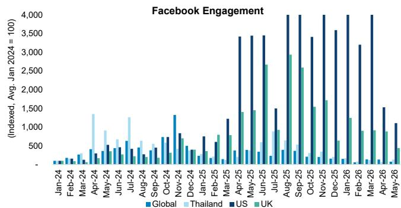

bar chart

| Month    | Global | Thailand | US   | UK   |
|----------|--------|----------|------|------|
| Jan-24   | 100    | 50       | 50   | 50   |
| Feb-24   | 150    | 100      | 100  | 100  |
| Mar-24   | 200    | 150      | 150  | 150  |
| Apr-24   | 300    | 400      | 200  | 200  |
| May-24   | 400    | 600      | 300  | 300  |
| Jun-24   | 500    | 800      | 400  | 400  |
| Jul-24   | 600    | 1,000    | 500  | 500  |
| Aug-24   | 700    | 1,200    | 600  | 600  |
| Sep-24   | 800    | 1,400    | 700  | 700  |
| Oct-24   | 900    | 1,600    | 800  | 800  |
| Nov-24   | 1,300  | 1,800    | 900  | 900  |
| Dec-24   | 1,500  | 2,000    | 1,000| 1,000|
| Jan-25   | 1,700  | 2,200    | 1,100| 1,100|
| Feb-25   | 1,900  | 2,400    | 1,200| 1,200|
| Mar-25   | 2,100  | 2,600    | 1,300| 1,300|
| Apr-25   | 2,300  | 2,800    | 1,400| 1,400|
| May-25   | 2,500  | 3,000    | 1,500| 1,500|
| Jun-25   | 2,700  | 3,200    | 1,600| 1,600|
| Jul-25   | 2,900  | 3,400    | 1,700| 1,700|
| Aug-25   | 3,100  | 3,600    | 1,800| 1,800|
| Sep-25   | 3,300  | 3,800    | 1,900| 1,900|
| Oct-25   | 3,500  | 4,000    | 2,000| 2,000|
| Nov-25   | 3,700  | 4,200    | 2,100| 2,100|
| Dec-25   | 3,900  | 4,400    | 2,200| 2,200|
| Jan-26   | 4,100  | 4,600    | 2,300| 2,300|
| Feb-26   | 4,300  | 4,800    | 2,400| 2,400|
| Mar-26   | 4,500  | 5,000    | 2,500| 2,500|
| Apr-26   | 4,700  | 5,200    | 2,600| 2,600|
| May-26   | 4,900  | 5,400    | 2,700| 2,700|

Source: Listen First, JEF, Note: Jan-2024 = 100, interactions include likes, comments, and forwards.

Figure 19 - Pop Mart official accounts' followers on TikTok  
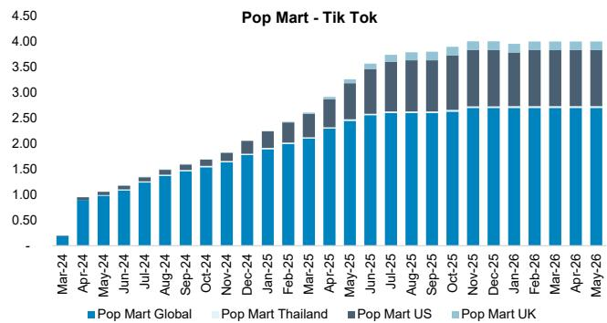

stacked bar chart

| Month    | Pop Mart Global | Pop Mart Thailand | Pop Mart US | Pop Mart UK |
|----------|-----------------|-------------------|-------------|-------------|
| Mar-24   | 0.1             | 0.0               | 0.0         | 0.0         |
| Apr-24   | 0.9             | 0.0               | 0.0         | 0.0         |
| May-24   | 1.0             | 0.0               | 0.0         | 0.0         |
| Jun-24   | 1.1             | 0.0               | 0.0         | 0.0         |
| Jul-24   | 1.3             | 0.0               | 0.0         | 0.0         |
| Aug-24   | 1.4             | 0.0               | 0.1         | 0.0         |
| Sep-24   | 1.5             | 0.0               | 0.1         | 0.0         |
| Oct-24   | 1.6             | 0.0               | 0.1         | 0.0         |
| Nov-24   | 1.7             | 0.0               | 0.1         | 0.0         |
| Dec-24   | 1.8             | 0.0               | 0.1         | 0.0         |
| Jan-25   | 1.9             | 0.0               | 0.1         | 0.0         |
| Feb-25   | 2.0             | 0.0               | 0.1         | 0.0         |
| Mar-25   | 2.1             | 0.0               | 0.1         | 0.0         |
| Apr-25   | 2.2             | 0.0               | 0.1         | 0.0         |
| May-25   | 2.3             | 0.0               | 0.1         | 0.0         |
| Jun-25   | 2.4             | 0.0               | 0.1         | 0.1         |
| Jul-25   | 2.5             | 0.0               | 0.1         | 0.1         |
| Aug-25   | 2.5             | 0.0               | 0.1         | 0.1         |
| Sep-25   | 2.5             | 0.0               | 0.1         | 0.1         |
| Oct-25   | 2.6             | 0.0               | 0.1         | 0.1         |
| Nov-25   | 2.7             | 0.0               | 0.1         | 0.1         |
| Dec-25   | 2.7             | 0.0               | 0.1         | 0.1         |
| Jan-26   | 2.7             | 0.0               | 0.1         | 0.1         |
| Feb-26   | 2.7             | 0.0               | 0.1         | 0.1         |
| Mar-26   | 2.7             | 0.0               | 0.1         | 0.1         |
| Apr-26   | 2.7             | 0.0               | 0.1         | 0.1         |
| May-26   | 2.7             | 0.0               | 0.1         | 0.1         |

Source: Listen First, JEF

Figure 21 - Pop Mart app's active users  
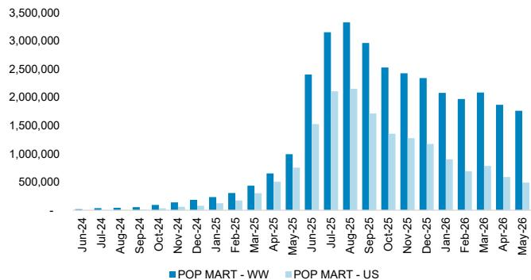

bar chart

| Month | POP MART - WW | POP MART - US |
|---|---|---|
| Jun-24 | 100000 | 50000 |
| Jul-24 | 100000 | 50000 |
| Aug-24 | 100000 | 50000 |
| Sep-24 | 100000 | 50000 |
| Oct-24 | 150000 | 50000 |
| Nov-24 | 200000 | 50000 |
| Dec-24 | 250000 | 50000 |
| Jan-25 | 300000 | 50000 |
| Feb-25 | 400000 | 150000 |
| Mar-25 | 500000 | 350000 |
| Apr-25 | 700000 | 550000 |
| May-25 | 1100000 | 850000 |
| Jun-25 | 2450000 | 1550000 |
| Jul-25 | 3250000 | 2150000 |
| Aug-25 | 3450000 | 2250000 |
| Sep-25 | 3150000 | 1750000 |
| Oct-25 | 2550000 | 1350000 |
| Nov-25 | 2450000 | 1350000 |
| Dec-25 | 2350000 | 1250000 |
| Jan-26 | 2150000 | 955666 |
| Feb-26 | 2155111 | 737777 |
| Mar-26 | 2155111 | 787777 |
| Apr-26 | 1955111 | 617777 |
| May-26 | 1835111 | 537777 |

Source: Sensor Tower, JEF. Note: Dream Home is only available in China. WW refers to worldwide and US to the United States.

Figure 16 - Pop Mart Instagram Interaction Index  
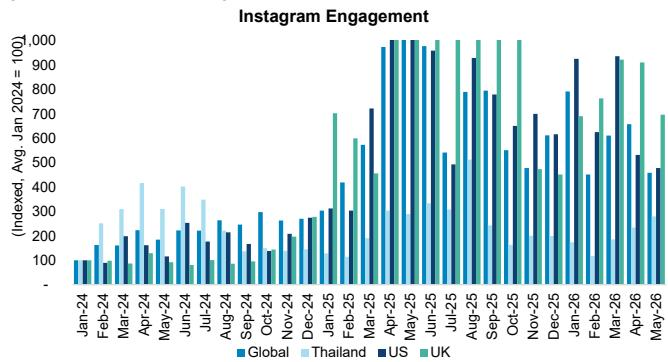

bar chart

| Month    | Global | Thailand | US   | UK   |
|----------|--------|----------|------|------|
| Jan-24   | 100    | 150      | 100  | 100  |
| Feb-24   | 150    | 250      | 150  | 100  |
| Mar-24   | 200    | 300      | 200  | 150  |
| Apr-24   | 250    | 400      | 250  | 200  |
| May-24   | 300    | 350      | 300  | 250  |
| Jun-24   | 350    | 400      | 350  | 300  |
| Jul-24   | 400    | 450      | 400  | 350  |
| Aug-24   | 450    | 500      | 450  | 400  |
| Sep-24   | 500    | 550      | 500  | 450  |
| Oct-24   | 550    | 600      | 550  | 500  |
| Nov-24   | 600    | 650      | 600  | 550  |
| Dec-24   | 650    | 700      | 650  | 600  |
| Jan-25   | 700    | 750      | 700  | 650  |
| Feb-25   | 750    | 800      | 750  | 700  |
| Mar-25   | 800    | 850      | 800  | 750  |
| Apr-25   | 850    | 900      | 850  | 800  |
| May-25   | 900    | 950      | 900  | 850  |
| Jun-25   | 950    | 1000     | 950  | 900  |
| Jul-25   | 1000   | 1050     | 1000 | 950  |
| Aug-25   | 1050   | 1100     | 1050 | 1000 |
| Sep-25   | 1100   | 1150     | 1100 | 1050 |
| Oct-25   | 1150   | 1200     | 1150 | 1100 |
| Nov-25   | 1200   | 1250     | 1200 | 1150 |
| Dec-25   | 1250   | 1300     | 1250 | 1200 |
| Jan-26   | 1300   | 1350     | 1300 | 1250 |
| Feb-26   | 1350   | 1400     | 1350 | 1300 |
| Mar-26   | 1400   | 1450     | 1400 | 1350 |
| Apr-26   | 1450   | 1500     | 1450 | 1400 |
| May-26   | 1500   | 1550     | 1500 | 1450 |

Source: Listen First, JEF, Note: Jan-2024 = 100, interactions include likes, comments, and forwards.

Figure 18 - Pop Mart share price vs social media engagement  
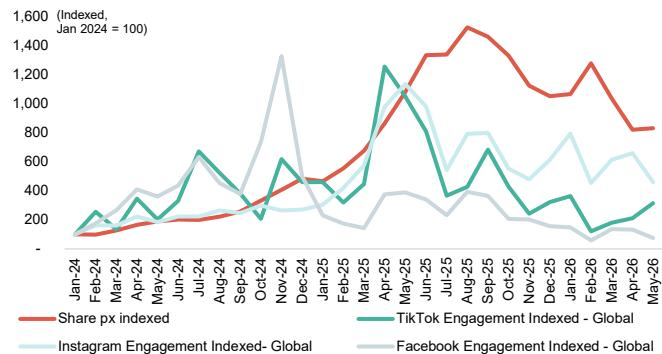

line chart

| Month    | Share px indexed | TikTok Engagement Indexed - Global | Instagram Engagement Indexed - Global | Facebook Engagement Indexed - Global |
|----------|------------------|------------------------------------|----------------------------------------|--------------------------------------|
| Jan-24   | 100              | 100                                | 100                                    | 100                                  |
| Feb-24   | 150              | 200                                | 150                                    | 150                                  |
| Mar-24   | 200              | 300                                | 200                                    | 200                                  |
| Apr-24   | 250              | 400                                | 250                                    | 250                                  |
| May-24   | 300              | 500                                | 300                                    | 300                                  |
| Jun-24   | 350              | 600                                | 350                                    | 350                                  |
| Jul-24   | 400              | 700                                | 400                                    | 400                                  |
| Aug-24   | 450              | 800                                | 450                                    | 450                                  |
| Sep-24   | 500              | 900                                | 500                                    | 500                                  |
| Oct-24   | 550              | 1000                               | 550                                    | 550                                  |
| Nov-24   | 600              | 1100                               | 600                                    | 600                                  |
| Dec-24   | 650              | 1200                               | 650                                    | 650                                  |
| Jan-25   | 700              | 1300                               | 700                                    | 700                                  |
| Feb-25   | 750              | 1400                               | 750                                    | 750                                  |
| Mar-25   | 800              | 1500                               | 800                                    | 800                                  |
| Apr-25   | 850              | 1600                               | 850                                    | 850                                  |
| May-25   | 900              | 1700                               | 900                                    | 900                                  |
| Jun-25   | 950              | 1800                               | 950                                    | 950                                  |
| Jul-25   | 1000             | 1900                               | 1000                                   | 1000                                 |
| Aug-25   | 1100             | 2000                               | 1100                                   | 1100                                 |
| Sep-25   | 1200             | 2100                               | 1200                                   | 1200                                 |
| Oct-25   | 1300             | 2200                               | 1300                                   | 1300                                 |
| Nov-25   | 1400             | 2300                               | 1400                                   | 1400                                 |
| Dec-25   | 1500             | 2400                               | 1500                                   | 1500                                 |
| Jan-26   | 1600             | 2500                               | 1600                                   | 1600                                 |
| Feb-26   | 1700             | 2600                               | 1700                                   | 1700                                 |
| Mar-26   | 1800             | 2700                               | 1800                                   | 1800                                 |
| Apr-26   | 1900             | 2800                               | 1900                                   | 1900                                 |
| May-26   | 2000             | 2900                               | 2000                                   | 2000                                 |

Source: Factset, Listen First, JEF. Note: Jan-2024 = 100.

Figure 20 - Pop Mart official accounts' followers on Instagram  
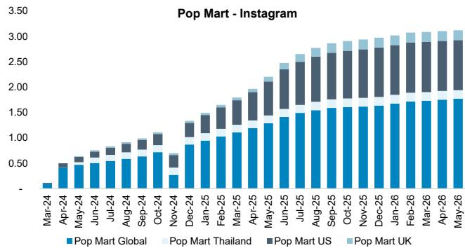

stacked bar chart

| Month    | Pop Mart Global | Pop Mart Thailand | Pop Mart US | Pop Mart UK |
|----------|-----------------|-------------------|-------------|-------------|
| Mar-24   | 0.1             | 0.0               | 0.0         | 0.0         |
| Apr-24   | 0.3             | 0.0               | 0.1         | 0.0         |
| May-24   | 0.4             | 0.0               | 0.1         | 0.0         |
| Jun-24   | 0.5             | 0.0               | 0.1         | 0.0         |
| Jul-24   | 0.6             | 0.0               | 0.1         | 0.0         |
| Aug-24   | 0.7             | 0.0               | 0.1         | 0.0         |
| Sep-24   | 0.8             | 0.0               | 0.1         | 0.0         |
| Oct-24   | 0.9             | 0.0               | 0.1         | 0.0         |
| Nov-24   | 0.3             | 0.0               | 0.1         | 0.0         |
| Dec-24   | 0.8             | 0.0               | 0.1         | 0.0         |
| Jan-25   | 0.9             | 0.0               | 0.1         | 0.0         |
| Feb-25   | 1.0             | 0.0               | 0.1         | 0.0         |
| Mar-25   | 1.1             | 0.0               | 0.1         | 0.0         |
| Apr-25   | 1.2             | 0.0               | 0.1         | 0.0         |
| May-25   | 1.3             | 0.0               | 0.1         | 0.1         |
| Jun-25   | 1.4             | 0.0               | 0.1         | 0.1         |
| Jul-25   | 1.5             | 0.0               | 0.1         | 0.1         |
| Aug-25   | 1.6             | 0.0               | 0.1         | 0.1         |
| Sep-25   | 1.7             | 0.0               | 0.1         | 0.1         |
| Oct-25   | 1.8             | 0.0               | 0.1         | 0.1         |
| Nov-25   | 1.9             | 0.0               | 0.1         | 0.1         |
| Dec-25   | 2.0             | 0.0               | 0.1         | 0.1         |
| Jan-26   | 2.1             | 0.0               | 0.1         | 0.1         |
| Feb-26   | 2.2             | 0.0               | 0.1         | 0.1         |
| Mar-26   | 2.3             | 0.0               | 0.1         | 0.1         |
| Apr-26   | 2.4             | 0.0               | 0.1         | 0.1         |
| May-26   | 2.5             | 0.0               | 0.1         | 0.1         |

Source: Listen First, JEF

Figure 22 - Pop Mart app's active users - Asian countries more resilient  
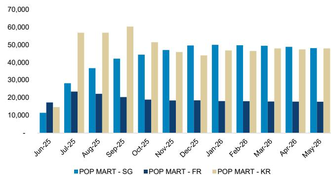

bar chart

| Month   | POP MART - SG | POP MART - FR | POP MART - KR |
|---------|---------------|---------------|---------------|
| Jun-25  | 10,000        | 17,000        | 14,000        |
| Jul-25  | 28,000        | 23,000        | 57,000        |
| Aug-25  | 37,000        | 22,000        | 57,000        |
| Sep-25  | 42,000        | 20,000        | 61,000        |
| Oct-25  | 44,000        | 19,000        | 52,000        |
| Nov-25  | 47,000        | 18,000        | 46,000        |
| Dec-25  | 50,000        | 18,000        | 44,000        |
| Jan-26  | 51,000        | 18,000        | 47,000        |
| Feb-26  | 51,000        | 18,000        | 47,000        |
| Mar-26  | 51,000        | 18,000        | 48,000        |
| Apr-26  | 51,000        | 18,000        | 48,000        |
| May-26  | 51,000        | 18,000        | 48,000        |

Source: Sensor Tower, JEF. SG for Singapore, FR for France, KR for South Korea

Figure 23 - Popmart website visits from worldwide and the US  
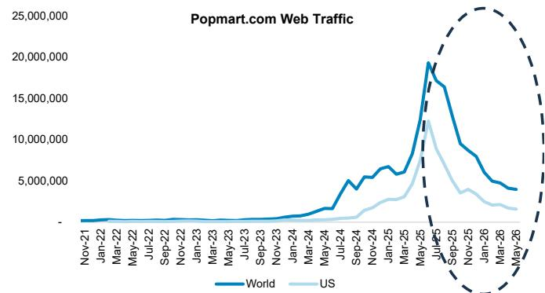

line chart

| Month    | World     | US        |
| -------- | --------- | --------- |
| Nov-21   | 0         | 0         |
| Jan-22   | 0         | 0         |
| Mar-22   | 0         | 0         |
| May-22   | 0         | 0         |
| Jul-22   | 0         | 0         |
| Sep-22   | 0         | 0         |
| Nov-22   | 0         | 0         |
| Jan-23   | 0         | 0         |
| Mar-23   | 0         | 0         |
| May-23   | 0         | 0         |
| Jul-23   | 0         | 0         |
| Sep-23   | 0         | 0         |
| Nov-23   | 0         | 0         |
| Jan-24   | 0         | 0         |
| Mar-24   | 1,000,000 | 5,000,000 |
| May-24   | 3,000,000 | 1,000,000 |
| Jul-24   | 5,000,000 | 1,500,000 |
| Sep-24   | 7,000,000 | 2,500,000 |
| Nov-24   | 8,000,000 | 3,500,000 |
| Jan-25   | 9,000,000 | 4,500,000 |
| Mar-25   | 15,000,000| 7,500,000 |
| May-25   | 19,561,838| 12,561,838|
| Jul-25   | 17,561,838| 9,561,838 |
| Sep-25   | 14,561,838| 6,561,838 |
| Nov-25   | 11,561,838| 4,561,838 |
| Jan-26   | 8,561,838 | 3,561,838 |
| Mar-26   | 6,561,838 | 2,561,838 |
| May-26   | 4,561,838 | 1,561,838 |

Source: SimilarWeb, JEF

Figure 25 - Google search trends for Pop Mart and Labubu – Worldwide  
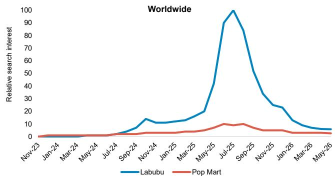

line chart

| Month    | Labubu | Pop Mart |
| -------- | ------ | -------- |
| Nov-23   | 0      | 0        |
| Jan-24   | 0      | 0        |
| Mar-24   | 0      | 0        |
| May-24   | 0      | 0        |
| Jul-24   | 0      | 0        |
| Sep-24   | 5      | 0        |
| Nov-24   | 15     | 0        |
| Jan-25   | 10     | 0        |
| Mar-25   | 15     | 0        |
| May-25   | 20     | 0        |
| Jul-25   | 95     | 5        |
| Sep-25   | 80     | 5        |
| Nov-25   | 30     | 0        |
| Jan-26   | 20     | 0        |
| Mar-26   | 10     | 0        |
| May-26   | 5      | 0        |

Source: Google trends, JEF

Figure 27 - Google search trends for Pop Mart and Labubu - Japan  
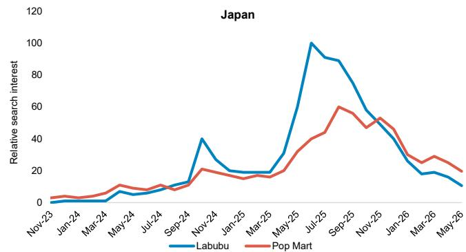

line chart

| Month    | Labubu | Pop Mart |
| -------- | ------ | -------- |
| Nov-23   | 0      | 0        |
| Jan-24   | 0      | 0        |
| Mar-24   | 0      | 0        |
| May-24   | 0      | 0        |
| Jul-24   | 0      | 0        |
| Sep-24   | 0      | 0        |
| Nov-24   | 40     | 20       |
| Jan-25   | 20     | 15       |
| Mar-25   | 20     | 15       |
| May-25   | 30     | 30       |
| Jul-25   | 100    | 40       |
| Sep-25   | 90     | 60       |
| Nov-25   | 70     | 50       |
| Jan-26   | 40     | 30       |
| Mar-26   | 20     | 25       |
| May-26   | 10     | 15       |

Source: Google trends, JEF

Figure 29 - Google search trends for Pop Mart and Labubu - France  
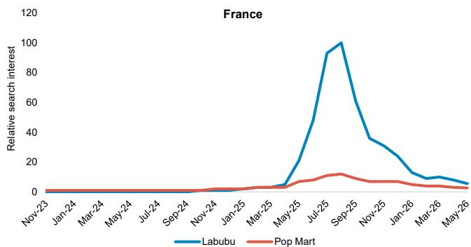

line chart

| Month    | Labubu | Pop Mart |
| -------- | ------ | -------- |
| Nov-23   | 0      | 0        |
| Jan-24   | 0      | 0        |
| Mar-24   | 0      | 0        |
| May-24   | 0      | 0        |
| Jul-24   | 0      | 0        |
| Sep-24   | 0      | 0        |
| Nov-24   | 0      | 0        |
| Jan-25   | 0      | 0        |
| Mar-25   | 0      | 0        |
| May-25   | 5      | 0        |
| Jul-25   | 95     | 10       |
| Sep-25   | 100    | 10       |
| Nov-25   | 35     | 5        |
| Jan-26   | 20     | 5        |
| Mar-26   | 10     | 5        |
| May-26   | 5      | 0        |

Source: Google trends, JEF

Figure 24 - Sanrio website visits  
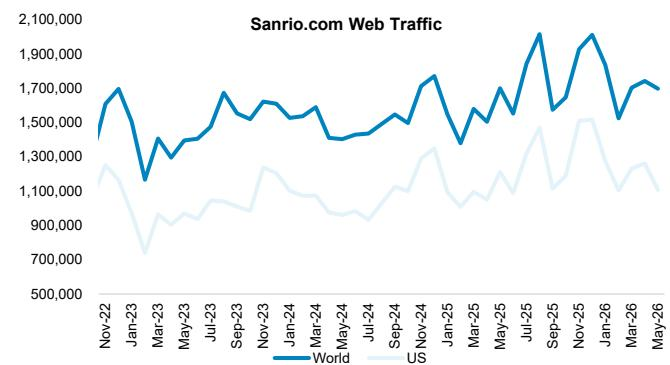

line chart

| Month    | World   | US      |
| -------- | ------- | ------- |
| Nov-22   | 1,400,000 | 1,200,000 |
| Jan-23   | 1,700,000 | 900,000  |
| Mar-23   | 1,300,000 | 950,000  |
| May-23   | 1,400,000 | 1,000,000 |
| Jul-23   | 1,700,000 | 1,100,000 |
| Sep-23   | 1,600,000 | 1,200,000 |
| Nov-23   | 1,650,000 | 1,150,000 |
| Jan-24   | 1,550,000 | 1,100,000 |
| Mar-24   | 1,550,000 | 1,050,000 |
| May-24   | 1,450,000 | 1,050,000 |
| Jul-24   | 1,550,000 | 1,150,000 |
| Sep-24   | 1,750,000 | 1,350,000 |
| Nov-24   | 1,850,000 | 1,350,000 |
| Jan-25   | 1,450,000 | 1,150,000 |
| Mar-25   | 1,650,000 | 1,250,000 |
| May-25   | 1,750,000 | 1,350,000 |
| Jul-25   | 1,950,000 | 1,450,000 |
| Sep-25   | 1,650,000 | 1,550,000 |
| Nov-25   | 1,950,000 | 1,550,000 |
| Jan-26   | 1,850,000 | 1,450,000 |
| Mar-26   | 1,750,000 | 1,350,000 |
| May-26   | 1,750,000 | 1,350,000 |

Source: SimilarWeb, JEF

Figure 26 - Google search trends for Pop Mart and Labubu - Thailand  
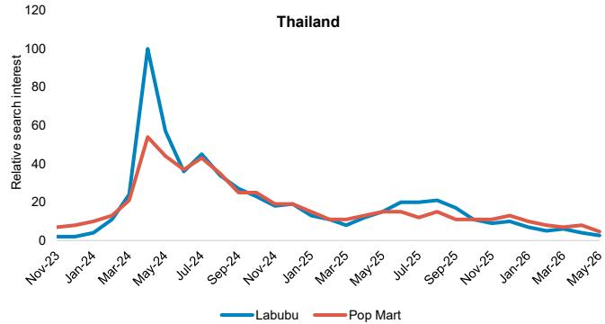

line chart

| Month    | Labubu | Pop Mart |
| -------- | ------ | -------- |
| Nov-23   | 0      | 0        |
| Jan-24   | 0      | 0        |
| Mar-24   | 20     | 15       |
| May-24   | 100    | 55       |
| Jul-24   | 45     | 35       |
| Sep-24   | 30     | 25       |
| Nov-24   | 20     | 15       |
| Jan-25   | 10     | 10       |
| Mar-25   | 5      | 5        |
| May-25   | 15     | 10       |
| Jul-25   | 20     | 15       |
| Sep-25   | 10     | 10       |
| Nov-25   | 5      | 5        |
| Jan-26   | 5      | 5        |
| Mar-26   | 0      | 0        |
| May-26   | 0      | 0        |

Source: Google trends, JEF

Figure 28 - Google search trends for Pop Mart and Labubu - the US  
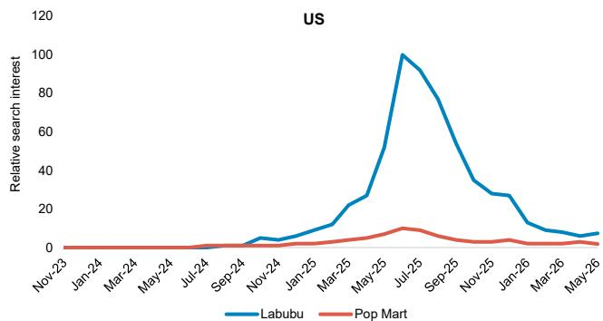

line chart

| Month    | Labubu | Pop Mart |
| -------- | ------ | -------- |
| Nov-23   | 0      | 0        |
| Jan-24   | 0      | 0        |
| Mar-24   | 0      | 0        |
| May-24   | 0      | 0        |
| Jul-24   | 0      | 0        |
| Sep-24   | 0      | 0        |
| Nov-24   | 5      | 0        |
| Jan-25   | 10     | 0        |
| Mar-25   | 20     | 0        |
| May-25   | 50     | 5        |
| Jul-25   | 100    | 10       |
| Sep-25   | 80     | 5        |
| Nov-25   | 30     | 0        |
| Jan-26   | 25     | 0        |
| Mar-26   | 10     | 0        |
| May-26   | 5      | 0        |

Source: Google trends, JEF

Figure 30 - Google search trends for Pop Mart and Labubu - Italy  
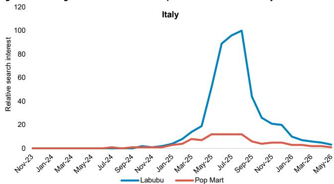

line chart

| Month    | Labubu | Pop Mart |
| -------- | ------ | -------- |
| Nov-23   | 0      | 0        |
| Jan-24   | 0      | 0        |
| Mar-24   | 0      | 0        |
| May-24   | 0      | 0        |
| Jul-24   | 0      | 0        |
| Sep-24   | 0      | 0        |
| Nov-24   | 0      | 0        |
| Jan-25   | 0      | 0        |
| Mar-25   | 10     | 5        |
| May-25   | 20     | 10       |
| Jul-25   | 90     | 15       |
| Sep-25   | 100    | 15       |
| Nov-25   | 40     | 5        |
| Jan-26   | 20     | 5        |
| Mar-26   | 10     | 5        |
| May-26   | 5      | 0        |

Source: Google trends, JEF

## Other trackers

Figure 31 - Pop Mart blind box launches  
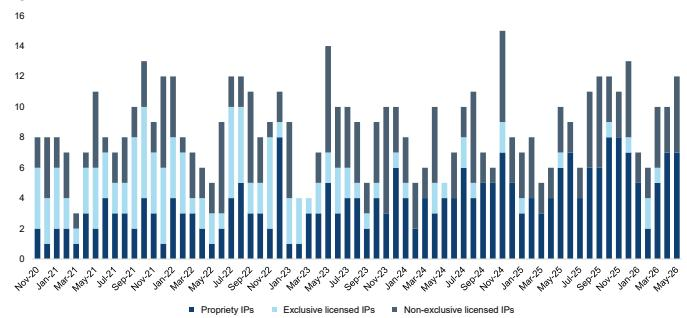

stacked bar chart

| Month | Propriety IPs | Exclusive licensed IPs | Non-exclusive licensed IPs |
| :--- | :--- | :--- | :--- |
| Nov-20 | 1 | 3 | 2 |
| Jan-21 | 1 | 3 | 2 |
| Mar-21 | 1 | 3 | 2 |
| May-21 | 1 | 3 | 2 |
| Jul-21 | 1 | 3 | 2 |
| Sep-21 | 1 | 3 | 2 |
| Nov-21 | 1 | 3 | 2 |
| Jan-22 | 1 | 3 | 2 |
| Mar-22 | 1 | 3 | 2 |
| May-22 | 1 | 3 | 2 |
| Jul-22 | 1 | 3 | 2 |
| Sep-22 | 1 | 3 | 2 |
| Nov-22 | 1 | 3 | 2 |
| Jan-23 | 1 | 3 | 2 |
| Mar-23 | 1 | 3 | 2 |
| May-23 | 1 | 3 | 2 |
| Jul-23 | 1 | 3 | 2 |
| Sep-23 | 1 | 3 | 2 |
| Nov-23 | 1 | 3 | 2 |
| Jan-24 | 1 | 3 | 2 |
| Mar-24 | 1 | 3 | 2 |
| May-24 | 1 | 3 | 2 |
| Jul-24 | 1 | 3 | 2 |
| Sep-24 | 1 | 3 | 2 |
| Nov-24 | 1 | 3 | 2 |
| Jan-25 | 1 | 3 | 2 |
| Mar-25 | 1 | 3 | 2 |
| May-25 | 1 | 3 | 2 |
| Jul-25 | 1 | 3 | 2 |
| Sep-25 | 1 | 3 | 2 |
| Nov-25 | 1 | 3 | 2 |
| Jan-26 | 1 | 3 | 2 |
| Mar-26 | 1 | 3 | 2 |
| May-26 | 1 | 3 | 2 |
The chart displays a stacked bar chart with three categories: Propriety IPs (dark blue), Exclusive licensed IPs (light blue), and Non-exclusive licensed IPs (gray). The x-axis represents months from Nov-20 to May-26. Values for each category are labeled on top of each bar. The y-axis represents the count of occurrences. The data is already in English. There is no variation or trend over time — only the total stacked bars are shown. The labels appear to be 'Propriety IPs' or 'Non-exclusive licensed IPs'.

Source: Company data, JEF

Figure 32 - Bloks product launches by IP  
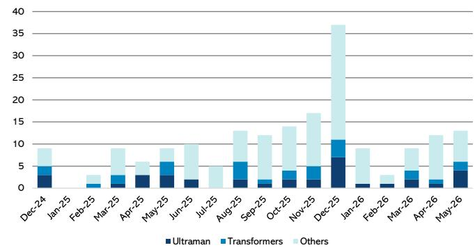

stacked bar chart

| Month | Ultraman | Transformers | Others |
| :--- | :--- | :--- | :--- |
| Dec-24 | 3 | 5 | 7 |
| Jan-25 | 0 | 0 | 1 |
| Feb-25 | 0 | 1 | 1 |
| Mar-25 | 2 | 2 | 8 |
| Apr-25 | 3 | 0 | 5 |
| May-25 | 3 | 5 | 5 |
| Jun-25 | 2 | 0 | 9 |
| Jul-25 | 0 | 0 | 4 |
| Aug-25 | 2 | 6 | 11 |
| Sep-25 | 2 | 1 | 11 |
| Oct-25 | 2 | 3 | 13 |
| Nov-25 | 2 | 6 | 16 |
| Dec-25 | 7 | 7 | 37 |
| Jan-26 | 1 | 0 | 9 |
| Feb-26 | 1 | 0 | 2 |
| Mar-26 | 2 | 3 | 9 |
| Apr-26 | 0 | 2 | 11 |
| May-26 | 4 | 4 | 11 |

Source: Company data, JEF

## Share performance

Figure 33 - LTM performance  
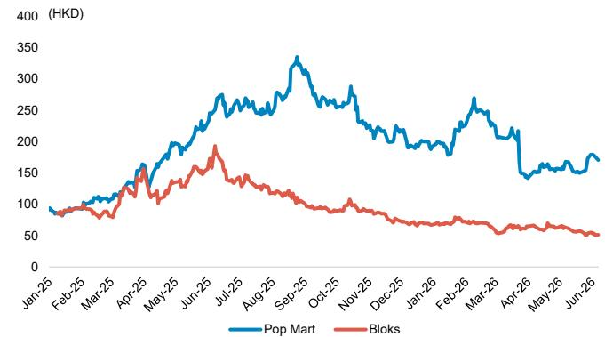

line chart

| Month   | Pop Mart | Bloks |
|---------|----------|-------|
| Jan-25  | 90       | 90    |
| Feb-25  | 100      | 95    |
| Mar-25  | 110      | 100   |
| Apr-25  | 130      | 110   |
| May-25  | 160      | 130   |
| Jun-25  | 190      | 150   |
| Jul-25  | 220      | 180   |
| Aug-25  | 270      | 160   |
| Sep-25  | 330      | 140   |
| Oct-25  | 280      | 120   |
| Nov-25  | 240      | 100   |
| Dec-25  | 210      | 90    |
| Jan-26  | 190      | 80    |
| Feb-26  | 270      | 70    |
| Mar-26  | 240      | 60    |
| Apr-26  | 150      | 50    |
| May-26  | 170      | 45    |
| Jun-26  | 180      | 40    |

Source: Factset, JEF. Note: As of 8 June 2026

Figure 34 - YTD share performance of IP toys related names  
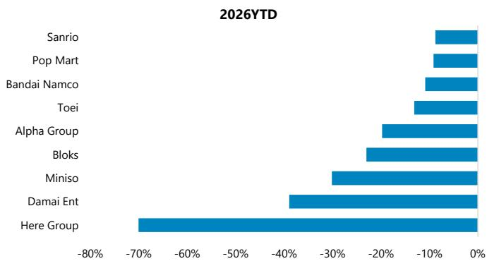

bar chart

2026YTD
| Company | Value (%) |
| :--- | :--- |
| Sanrio | -5 |
| Pop Mart | -5 |
| Bandai Namco | -10 |
| Toei | -10 |
| Alpha Group | -20 |
| Bloks | -25 |
| Miniso | -30 |
| Damai Ent | -40 |
| Here Group | -70 |

Source: Factset, JEF. Note: As of 8 June 2026

## Company Valuation/Risks

## Bandai Namco Holdings Inc.

We forecast sales from main IP by analyzing the product cycle in each avenue (domestic toys, anime slates, and gaming). We project Toys & Hobby OP to be driven by anime slates of 1P/3P IP developed by internal and external studios. We expect Gaming OP to grow, driven by high-margin repeat title sales. Applying a 26.5x P/E to our revised FY3/27 EPS estimate of ¥241 yields PT of ¥6,390 (C. 10% premium to gaming Avg). Risks include (1) saturation and intensified competition in Japan mobile games; (2) slowdown in the growth of Gunpla fan base; (3) inability of the pipeline titles to drive top-line growth or to foster the repeat title sales in the following year; (4) material cost hike pressurizes margins; (5) impact of global recession on overseas demand; and (6) slow OP recovery of Real Entertainment (Amusement).

## Bloks Group Ltd

Our primary valuation methodology is DCF, employing a WACC of 9.5%, including COE of 9.5%, beta of 1, and terminal growth rate of 1% (TGR is in line with our range of 0-3% set for China consumer stocks). Key risks include fashion risk and IP concentration, channel inventory, IP renewals, and competition from other brands.

## MINISO Group Holding Limited

Our primary valuation methodology is DCF, employing a WACC of 15.1%, beta of 1.5, and terminal growth rate of 1.0% (TGR is in line with our range of 0-3% set for China consumer stocks).

Downside risks include lower-than-expected performance in overseas expansion, store opening vs cannibalization, inability to sustain popularity of products, YH's performance dragging Miniso's resources, and Miniso continuing to branch out to less favorable/premature investments.

## Pop Mart International Group Limited

Our primary valuation methodology is DCF, employing a WACC of 10.6%, including COE of 9.5%, beta of 1.0, and terminal growth rate of 1% (TGR is in line with our range of 0-3% set for China consumer stocks).

Industry risks include policy risk, especially for blind boxes, and changes in consumer preferences for pop toys or blind-box consumption. Company risks include inability to sustain the popularity of its existing IPs, failure to develop new IPs, product quality issues, and overexpansion resulting in cannibalization of store sales.

## Analyst Certification:

I, Jingjue Pei, certify that all of the views expressed in this research report accurately reflect my personal views about the subject security(ies) and subject company(ies). I also certify that no part of my compensation was, is, or will be, directly or indirectly, related to the specific recommendations or views expressed in this research report.

I, Anne Ling, certify that all of the views expressed in this research report accurately reflect my personal views about the subject security(ies) and subject company(ies). I also certify that no part of my compensation was, is, or will be, directly or indirectly, related to the specific recommendations or views expressed in this research report.

Registration of non-US analysts: Jingjue Pei is employed by JEF Hong Kong Limited, a non-US affiliate of JEF LLC and is not registered/qualified as a research analyst with FINRA. This analyst(s) may not be an associated person of JEF LLC, a FINRA member firm, and therefore may not be subject to the FINRA Rule 2241 and restrictions on communications with a subject company, public appearances and trading securities held by a research analyst.

Registration of non-US analysts: Anne Ling is employed by JEF Hong Kong Limited, a non-US affiliate of JEF LLC and is not registered/qualified as a research analyst with FINRA. This analyst(s) may not be an associated person of JEF LLC, a FINRA member firm, and therefore may not be subject to the FINRA Rule 2241 and restrictions on communications with a subject company, public appearances and trading securities held by a research analyst. As is the case with all JEF employees, the analyst(s) responsible for the coverage of the financial instruments discussed in this report receives compensation based in part on the overall performance of the firm, including investment banking income. We seek to update our research as appropriate, but various regulations may prevent us from doing so. Aside from certain industry reports published on a periodic basis, the large majority of reports are published at irregular intervals as appropriate in the analyst's judgement.

## Investment Recommendation Record

## (Article 3(1)e and Article 7 of MAR)

Recommendation Published

Recommendation Distributed

June 9, 2026 5:14 A.M.

June 9, 2026 5:14 A.M.

## Explanation of JEF Ratings

Buy - Describes securities that we expect to provide a total return (price appreciation plus yield) of 15% or more within a 12-month period.

Hold - Describes securities that we expect to provide a total return (price appreciation plus yield) of plus 15% or minus 10% within a 12-month period.

Underperform - Describes securities that we expect to provide a total return (price appreciation plus yield) of minus 10% or less within a 12-month period. The expected total return (price appreciation plus yield) for Buy rated securities with an average security price consistently below \$10 is 20% or more within a 12-month period as these companies are typically more volatile than the overall stock market. For Hold rated securities with an average security price consistently below \$10, the expected total return (price appreciation plus yield) is plus or minus 20% within a 12-month period. For Underperform rated securities with an average security price consistently below \$10, the expected total return (price appreciation plus yield) is minus 20% or less within a 12-month period.

NR - The investment rating and price target have been temporarily suspended. Such suspensions are in compliance with applicable regulations and/or JEF policies.

CS - Coverage Suspended. JEF has suspended coverage of this company.

NC - Not covered. JEF does not cover this company.

Restricted - Describes issuers where, in conjunction with JEF engagement in certain transactions, company policy or applicable securities regulations prohibit certain types of communications, including investment recommendations.

Monitor - Describes securities whose company fundamentals and financials are being monitored, and for which no financial projections or opinions on the investment merits of the company are provided.

## Valuation Methodology

JEF' methodology for assigning ratings may include the following: market capitalization, maturity, growth/value, volatility and expected total return over the next 12 months. The price targets are based on several methodologies, which may include, but are not restricted to, analyses of market risk, growth rate, revenue stream, discounted cash flow (DCF), EBITDA, EPS, cash flow (CF), free cash flow (FCF), EV/EBITDA, P/E, PE/growth, P/CF, P/FCF, premium (discount)/average group EV/EBITDA, premium (discount)/average group P/E, sum of the parts, net asset value, dividend returns, and return on equity (ROE) over the next 12 months.

## JEF Franchise Picks

JEF Franchise Picks include stock selections from among the best stock ideas from our equity analysts over a 12 month period. Stock selection is based on fundamental analysis and may take into account other factors such as analyst conviction, differentiated analysis, a favorable risk/reward ratio and investment themes that JEF analysts are recommending. JEF Franchise Picks will include only Buy rated stocks and the number can vary depending on analyst recommendations for inclusion. Stocks will be added as new opportunities arise and removed when the reason for inclusion changes, the stock has met its desired return, if it is no longer rated Buy and/or if it triggers a stop loss. Stocks having 120 day volatility in the bottom quartile of S&P stocks will continue to have a 15% stop loss, and the remainder will have a 20% stop. Franchise Picks are not intended to represent a recommended portfolio of stocks and is not sector based, but we may note where we believe a Pick falls within an investment style such as growth or value.

## Risks which may impede the achievement of our Price Target

This report was prepared for general circulation and does not provide investment recommendations specific to individual investors. As such, the financial instruments discussed in this report may not be suitable for all investors and investors must make their own investment decisions based upon their specific investment objectives and financial situation utilizing their own financial advisors as they deem necessary. Past performance of the financial instruments recommended in this report should not be taken as an indication or guarantee of future results. The price, value of, and income from, any of the financial instruments mentioned in this report can rise as well as fall and may be affected by changes in economic, financial and political factors. If a financial instrument is denominated in a currency other than the investor's home currency, a change in exchange rates may adversely affect the price of, value of, or income derived from the financial instrument described in this report. To the extent prices are shown in non-US currency, please note that our local currency price targets are based on a currency conversion using an exchange rate as of the prior trading day (unless otherwise noted). Should there be fluctuations in the exchange rate after this date, that will affect the non-US target prices and should no longer be relied upon. In addition, investors in securities such as ADRs, whose values are affected by the currency of the underlying security, effectively assume currency risk.

## Other Companies Mentioned in This Report

• Bandai Namco Holdings Inc. (7832 JP: ¥3,694, BUY)  
• Bloks Group Ltd (325 HK: HK\$51.55, BUY)  
• MINISO Group Holding Limited (9896 HK: HK\$25.50, BUY)  
• MINISO Group Holding Limited (MNSO: \$13.10, BUY)  
• Pop Mart International Group Limited (9992 HK: HK\$170.50, BUY)

Rating and Price Target History for: Bloks Group Ltd (325 HK) as of 06-05-2026  
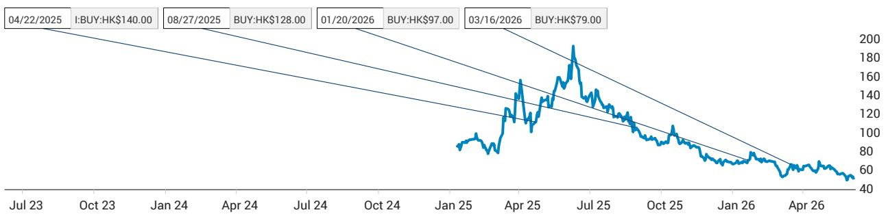

line chart

| Date       | Action | Price   |
| ---------- | ------ | ------- |
| 04/22/2025 | BUY    | HK$140.00 |
| 08/27/2025 | BUY    | HK$128.00 |
| 01/20/2026 | BUY    | HK$97.00  |
| 03/16/2026 | BUY    | HK$79.00  |

Rating and Price Target History for: Bandai Namco Holdings Inc. (7832 JP) as of 06-05-2026  
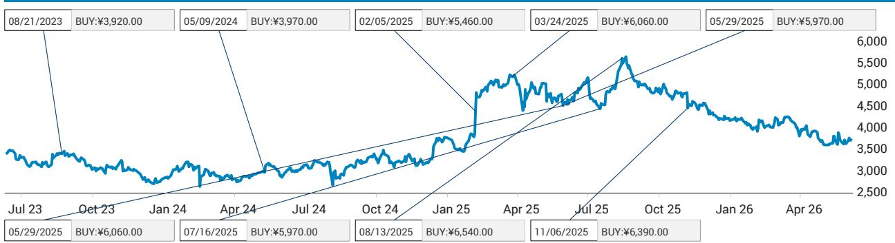

line chart

| Date       | Buy Price |
| ---------- | --------- |
| 08/21/2023 | $3,920.00 |
| 05/09/2024 | $3,970.00 |
| 02/05/2025 | $5,460.00 |
| 03/24/2025 | $6,060.00 |
| 05/29/2025 | $5,970.00 |
| 05/29/2025 | $6,060.00 |
| 07/16/2025 | $5,970.00 |
| 08/13/2025 | $6,540.00 |
| 11/06/2025 | $6,390.00 |

Rating and Price Target History for: MINISO Group Holding Limited (9896 HK) as of 06-05-2026  
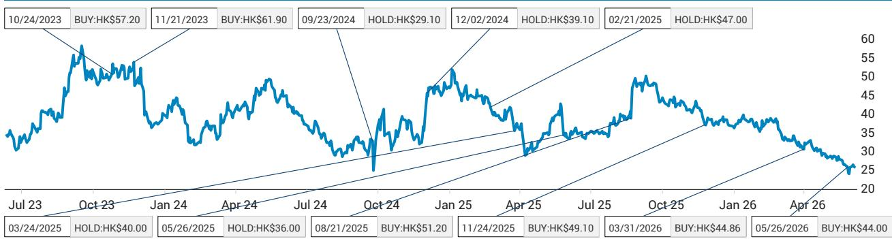

line chart

| Date       | Action | Price  |
| ---------- | ------ | ------ |
| 10/24/2023 | BUY    | HK$57.20 |
| 11/21/2023 | BUY    | HK$61.90 |
| 09/23/2024 | HOLD   | HK$29.10 |
| 12/02/2024 | HOLD   | HK$39.10 |
| 02/21/2025 | HOLD   | HK$47.00 |
| 03/24/2025 | HOLD   | HK$40.00 |
| 05/26/2025 | HOLD   | HK$36.00 |
| 08/21/2025 | BUY    | HK$51.20 |
| 11/24/2025 | BUY    | HK$49.10 |
| 03/31/2026 | BUY    | HK$44.86 |
| 05/26/2026 | BUY    | HK$44.00 |

Rating and Price Target History for: Pop Mart International Group Limited (9992 HK) as of 06-05-2026  

line chart

| Date       | Action | Price   |
| ---------- | ------ | ------- |
| 08/23/2023 | HOLD   | HK$25.40 |
| 01/11/2024 | HOLD   | HK$22.60 |
| 03/21/2024 | BUY    | HK$30.10 |
| 05/24/2024 | BUY    | HK$39.30 |
| 07/18/2024 | BUY    | HK$47.40 |
| 08/21/2024 | BUY    | HK$53.00 |
| 10/22/2024 | BUY    | HK$80.50 |
| 11/22/2024 | BUY    | HK$97.20 |
| 01/09/2025 | BUY    | HK$103.00 |
| 03/26/2025 | BUY    | HK$184.00 |
| 04/23/2025 | BUY    | HK$203.00 |
| 07/15/2025 | BUY    | HK$315.20 |
| 08/20/2025 | BUY    | HK$358.20 |
| 10/22/2025 | BUY    | HK$383.20 |
| 03/25/2026 | BUY    | HK$227.60 |

Rating and Price Target History for: MINISO Group Holding Limited (MNSO) as of 06-08-2026  

line chart

| Date       | Action | Price  |
| ---------- | ------ | ------ |
| 10/24/2023 | BUY    | $29.30 |
| 11/21/2023 | BUY    | $31.86 |
| 09/23/2024 | HOLD   | $14.91 |
| 12/02/2024 | HOLD   | $20.12 |
| 02/21/2025 | HOLD   | $24.20 |
| 03/24/2025 | HOLD   | $20.57 |
| 05/26/2025 | HOLD   | $18.50 |
| 08/21/2025 | HOLD   | $26.20 |
| 09/22/2025 | BUY    | $26.20 |
| 09/22/2025 | HOLD   | $26.20 |
| 10/14/2025 | BUY    | $26.20 |
| 11/24/2025 | BUY    | $25.10 |
| 03/31/2026 | BUY    | $23.08 |
| 05/26/2026 | BUY    | $22.48 |

Notes: Each box in the Rating and Price Target History chart above represents actions over the past three years in which an analyst initiated on a company, made a change to a rating or price target of a company or discontinued coverage of a company.
Legend:

I: Initiating Coverage

D: Dropped Coverage

B: Buy

H: Hold

UP: Underperform

Distribution of Ratings  
IB Serv./Past12 Mos.  
JIL Mkt Serv./Past12 Mos.

<table><tr><td></td><td>Count</td><td>Percent</td><td>Count</td><td>Percent</td><td>Count</td><td>Percent</td></tr><tr><td>BUY</td><td>2202</td><td>62.13%</td><td>383</td><td>17.39%</td><td>113</td><td>5.13%</td></tr><tr><td>HOLD</td><td>1179</td><td>33.27%</td><td>111</td><td>9.41%</td><td>20</td><td>1.70%</td></tr><tr><td>UNDERPERFORM</td><td>163</td><td>4.60%</td><td>1</td><td>0.61%</td><td>1</td><td>0.61%</td></tr></table>

## Other Important Disclosure

## Other Important Disclosures

JEF does business and seeks to do business with companies covered in its research reports, and expects to receive or intends to seek compensation for investment banking services among other activities from such companies. As a result, investors should be aware that JEF may have a conflict of interest that could affect the objectivity of this report. Investors should consider this report as only a single factor in making their investment decision.

JEF Equity Research refers to research reports produced by analysts employed by one of the following JEF Financial Group Inc. ("JEF") companies:

United States: JEF LLC which is an SEC registered broker-dealer and a member of FINRA (and distributed by JEF Services, LLC, an SEC registered Investment Adviser, to clients paying separately for such research).

Canada: JEF Securities Inc., which is an investment dealer registered in each of the thirteen Canadian jurisdictions and a dealer member of the Canadian Investment Regulatory Organization, including research reports produced jointly by JEF Securities Inc. and another JEF entity (and distributed by JEF Securities Inc.).

Where JEF Securities Inc. distributes research reports produced by JEF LLC, JEF International Limited, JEF Japan Company Limited, or JEF India Private Limited, you are advised that each of JEF LLC, JEF International Limited, JEF Japan Company Limited, and JEF India Private Limited operates as a dealer in your jurisdiction under an exemption from the dealer registration requirements contained in National Instrument 31-103 Registration Requirements, Exemptions and Ongoing Registrant Obligations and, as such, each of JEF LLC, JEF International Limited, JEF Japan Company Limited, and JEF India Private Limited is not required to be and is not a registered dealer or adviser in your jurisdiction. You are advised that where JEF LLC or JEF International Limited prepared this research report, it was not prepared in accordance with Canadian disclosure requirements relating to research reports in Canada.

United Kingdom: JEF International Limited, which is authorized and regulated by the Financial Conduct Authority; registered in England and Wales No. 1978621; registered office: 100 Bishopsgate, London EC2N 4JL; telephone +44 (0)20 7029 8000; facsimile +44 (0)20 7029 8010.

Germany: JEF GmbH, which is authorized and regulated by the Bundesanstalt fuer Finanzdienstleistungsaufsicht, BaFin-ID: 10150151; registered office: Bockenheimer Landstr. 24, 60323 Frankfurt a.M., Germany; telephone: +49 (0) 69 719 1870

Hong Kong: JEF Hong Kong Limited, which is licensed by the Securities and Futures Commission of Hong Kong with CE number ATS546; located at Level 26, Two International Finance Center, 8 Finance Street, Central, Hong Kong; telephone: +852 3743 8000.

Singapore: JEF Singapore Limited, which is licensed by the Monetary Authority of Singapore; located at 10 Collyer Quay #41-01, Ocean Financial Centre, Singapore 049315, telephone: +65 6551 3950.

Japan: JEF Japan Company Limited, which is a securities company registered by the Financial Services Agency of Japan and is a member of the Japan Securities Dealers Association; located at Tokyo Midtown Hibiya 30F Hibiya Mitsui Tower, 1-1-2 Yuraku-cho, Chiyoda-ku, Tokyo 100-0006; telephone +813 5251 6100; facsimile +813 5251 6101.

India: JEF India Private Limited (CIN - U74140MH2007PTC200509), licensed by the Securities and Exchange Board of India for: Stock Broker (NSE & BSE) INZ000243033, Research Analyst INH000000701 and Merchant Banker INM000011443, located at Level 16, Express Towers, Nariman Point, Mumbai 400 021, India; Tel +91 22 4356 6000. Compliance Officer name: Sanjay Pai, Tel No: +91 22 42246150, Email: spai@JEF.com, Grievance officer name: Sanjay Pai, Tel no. +91 22 42246150, Email: compliance\_india@JEF.com. Registration granted by SEBI and certification from NISM in no way guarantee performance of the intermediary or provide any assurance of returns to investors.

Australia: JEF (Australia) Pty Limited (ACN 623 059 898), which holds an Australian financial services license (AFSL 504712) and is located at Level 20, 60 Martin Place, Sydney NSW 2000; telephone +61 2 9364 2800.

Dubai: JEF International Limited, Dubai branch, which is licensed by the Dubai Financial Services Authority (DFSA Reference Number F007325); registered office Unit L31-06, L31-07, Level 31, ICD Brookfield Pace, DIFC, PO Box 121208, Dubai, UAE.

This report was prepared by personnel who are associated with JEF (JEF Securities Inc., JEF International Limited, JEF GmbH, JEF Hong Kong Limited, JEF Singapore Limited, JEF Japan Company Limited, JEF India Private Limited), and JEF (Australia) Pty Ltd; or by personnel who are associated with both JEF LLC and JEF Services LLC ("JRS"). JEF LLC is a US registered broker-dealer and is affiliated with JRS, which is a US registered investment adviser. JRS does not create tailored or personalized research and all research provided by JRS is impersonal. If you are paying separately for this research, it is being provided to you by JRS. Otherwise, it is being provided by JEF LLC. JEF LLC, JRS, and their affiliates are collectively referred to below as "JEF". JEF may seek to do business with companies covered in this research report. As a result, investors should be aware that JEF may have a conflict of interest that could affect the objectivity of this report. Investors should consider this report as only one of many factors in making their investment decisions. Specific conflict of interest and other disclosures that are required by FINRA, the Canadian Investment Regulatory Organization and other rules are set forth in this disclosure section.

\*\*\*

If you are receiving this report from a non-US JEF entity, please note the following: Unless prohibited by the provisions of Regulation S of the U.S. Securities Act of 1933, as amended, this material is distributed in the United States by JEF LLC, which accepts responsibility for its contents in accordance with the provisions of Rule 15a-6 under the US Securities Exchange Act of 1934, as amended. Transactions by or on behalf of any US person may only be effected through JEF LLC. In the United Kingdom and European Economic Area this report is issued and/or approved for distribution by JEF International Limited ("JIL") and/or JEF GmbH and is intended for use only by persons who have, or have been assessed as having, suitable professional experience and expertise, or by persons to whom it can be otherwise lawfully distributed. JEF LLC, JIL, JEF GmbH and their affiliates, may make a market or provide liquidity in the financial instruments referred to in this report; and where they do make a market, such activity is disclosed specifically in this report under "company specific disclosures".

For Canadian investors, this material is intended for use only by professional or institutional investors. None of the investments or investment services mentioned or described herein is available to other persons or to anyone in Canada who is not a "permitted client" as defined by National Instrument 31-103 Registration Requirements, Exemptions and Ongoing Registrant Obligations, as applicable. This research report is a general discussion of the merits and risks of a security or securities only, and is not in any way meant to be tailored to the needs and circumstances of any recipient. The information contained herein is not, and under no circumstances is to be construed as, an offer to sell securities described herein, or solicitation of an offer to buy securities described herein, in Canada or any province or territory thereof. Any offer or sale of the securities described herein in Canada will be made only under an exemption from the requirements to file a prospectus with the relevant Canadian securities regulators, if applicable, and only by a dealer properly registered under applicable securities laws or, alternatively, pursuant to an exemption from the dealer registration requirement in the relevant province or territory of Canada in which such offer or sale is made. The information contained herein is under no circumstances to be construed as investment advice in any province or territory of Canada and is not tailored to the needs of the recipient. To the extent that the information contained herein references securities of an issuer incorporated, formed or created under the laws of Canada or a province or territory of Canada, any trades in such securities must be conducted through a dealer registered in Canada. No securities commission or similar regulatory authority in Canada has reviewed or in any way passed judgment upon this research report, the information contained herein or the merits of the securities described herein, and any representation to the contrary is an offence. In Singapore, JEF Singapore Limited ("JSL") is regulated by the Monetary Authority of Singapore. For investors in the Republic of Singapore, where this material is prepared and issued by a JEF affiliate outside of Singapore, it is distributed by JSL pursuant to Regulation 32C of the Financial Advisers Regulations. The material contained in this document is intended solely for accredited, expert or institutional investors, as defined under the Securities and Futures Act 2001 (Singapore). If there are any matters arising from, or in connection with this material, please contact JSL, located at 80 Raffles Place #15-20, UOB Plaza 2, Singapore 048624, telephone: +65 6551 3950. In Dubai, this material is issued and distributed by JEF International Limited, Dubai branch, and is intended solely for Professional Clients and should not be distributed to, or relied upon by, Retail Clients (as defined by DFSA). A distribution of ratings in percentage terms in each sector covered is available upon request from your sales representative. In Japan, this material is issued and distributed by JEF Japan Company Limited to institutional investors only. In Hong Kong, this report is issued and approved by JEF Hong Kong Limited and is intended for use only by professional investors as defined in the Hong Kong Securities and Futures Ordinance and its subsidiary legislation. In the Republic of China (Taiwan), this report should not be distributed. The research in relation to this report is conducted outside the People's Republic of China ("PRC"). This report does not constitute an offer to sell or the solicitation of an offer to buy any securities in the PRC. PRC investors shall have the relevant qualifications to invest in such securities and shall be responsible for obtaining all relevant approvals, licenses, verifications and/or registrations from the relevant governmental authorities themselves. In India, this report is made available by JEF India Private Limited. In Australia, this report is issued and/or approved for distribution by, or on behalf of, JEF (Australia) Securities Pty Ltd (ACN 610 977 074), which holds an Australian financial services license (AFSL 487263). It is directed solely at wholesale clients within the meaning of the Corporations Act 2001 (Cth) of Australia (the "Corporations Act"), in connection with their consideration of any investment or investment service that is the subject of this report. This report may contain general financial product advice. Where this report refers to a particular financial product, you should obtain a copy of the relevant product disclosure statement or offer document before making any decision in relation to the product. Recipients of this document in any other jurisdictions should inform themselves about and observe any applicable legal requirements in relation to the receipt of this document.

This report is not an offer or solicitation of an offer to buy or sell any security or derivative instrument, or to make any investment. Any opinion or estimate constitutes the preparer's best judgment as of the date of preparation, and is subject to change without notice. JEF assumes no obligation to maintain or update this report based on subsequent information and events. JEF, and their respective officers, directors, and employees, may have long or short positions in, or may buy or sell any of the securities, derivative instruments or other investments mentioned or described herein, either as agent or as principal for their own account. This material is provided solely for informational purposes and is not tailored to any recipient, and is not based on, and does not take into account, the particular investment objectives, portfolio holdings, strategy, financial situation, or needs of any recipient. As such, any advice or recommendation in this report may not be suitable for a particular recipient. JEF assumes recipients of this report are capable of evaluating the information contained herein and of exercising independent judgment. A recipient of this report should not make any investment decision without first considering whether any advice or recommendation in this report is suitable for the recipient based on the recipient's particular circumstances and, if appropriate or otherwise needed, seeking professional advice, including tax advice. JEF does not perform any suitability or other analysis to check whether an investment decision made by the recipient based on this report is consistent with a recipient's investment objectives, portfolio holdings, strategy, financial situation, or needs.

By providing this report, neither JRS nor any other JEF entity accepts any authority, discretion, or control over the management of the recipient's assets. Any action taken by the recipient of this report, based on the information in the report, is at the recipient's sole judgment and risk. The recipient must perform his or her own independent review of any prospective investment. If the recipient uses the services of JEF LLC (or other affiliated broker-dealers), in connection with a purchase or sale of a security that is a subject of these materials, such broker-dealer may act as principal for its own accounts or as agent for another person. Only JRS is registered with the SEC as an investment adviser; and therefore neither JEF LLC nor any other JEF affiliate has any fiduciary duty in connection with distribution of these reports.

The price and value of the investments referred to herein and the income from them may fluctuate. Past performance is not a guide to future performance, future returns are not guaranteed, and a loss of original capital may occur. Fluctuations in exchange rates could have adverse effects on the value or price of, or income derived from, certain investments.

This report may contain forward looking statements that may be affected by inaccurate assumptions or by known or unknown risks, uncertainties, and other important factors. As a result, the actual results, events, performance or achievements of the financial product may be materially different from those expressed or implied in such statements.

This report has been prepared independently of any issuer of securities mentioned herein and not as agent of any issuer of securities. No Equity Research personnel have authority whatsoever to make any representations or warranty on behalf of the issuer(s). Any comments or statements made herein are those of the JEF entity producing this report and may differ from the views of other JEF entities.

This report may contain information obtained from third parties, including ratings from credit ratings agencies such as Standard & Poor's, and information derived from third-party or proprietary generative artificial intelligence (Gen AI) models. JEF does not guarantee the accuracy, completeness, timeliness or availability of this information, and is not responsible for any errors or omissions (negligent or otherwise), regardless of the cause, or for the results obtained from the use of such content. Neither JEF nor any third-party content providers, including providers of Gen AI models, give any express or implied warranties, including, but not limited to, any warranties of merchantability or fitness for a particular purpose or use. Neither JEF nor any third-party content provider shall be liable for any direct, indirect, incidental, exemplary, compensatory, punitive, special or consequential damages, costs, expenses, legal fees, or losses (including lost income or profits and opportunity costs) in connection with any use of their content, including ratings. Credit ratings are statements of opinions and are not statements of fact or recommendations to purchase, hold or sell securities. They do not address the suitability of securities or the suitability of securities for investment purposes, and should not be relied on as investment advice. Reproduction and distribution of third party content in any form is prohibited except with the prior written permission of the related third party.

JEF reports are disseminated and available electronically, and, in some cases, also in printed form. Electronic research is simultaneously made available to all clients. This report or any portion hereof may not be copied, reprinted, sold, or redistributed or disclosed by the recipient or any third party, by content scraping or extraction, automated processing, or any other form or means, without the prior written consent of JEF. Any unauthorized use is prohibited. Neither JEF nor any of its respective directors, officers or employees, is responsible for guaranteeing the financial success of any investment, or accepts any liability whatsoever for any direct, indirect or consequential damages or losses arising from any use of this report or its contents. Nothing herein shall be construed to waive any liability JEF has under applicable U.S. federal or state securities laws.

For Important Disclosure information relating to JRS, please see https://adviserinfo.sec.gov/IAPD/Content/Common/crd\_iapd\_Brochure.aspx?BRCHR\_VRSN\_ID=483878 and https://adviserinfo.sec.gov/Firm/292142 or visit our website at https://javatar.bluematrix.com/sellside/Disclosures.action, or www.JEF.com, or call 1.888.JEF.

© 2026 JEF