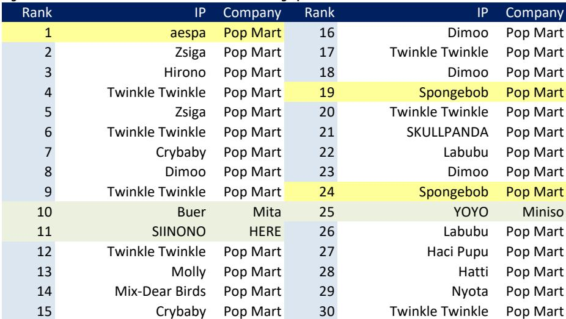
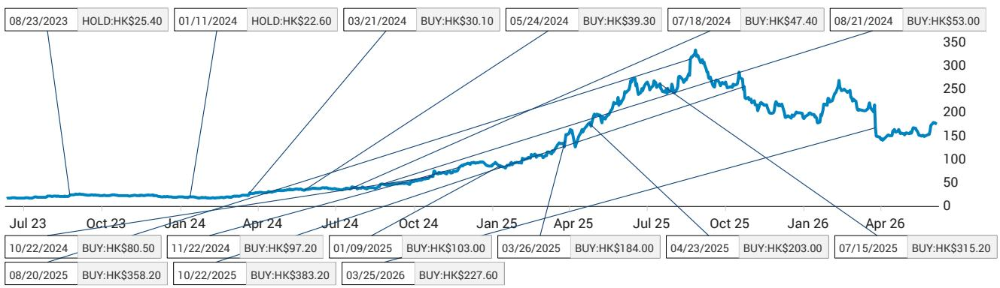
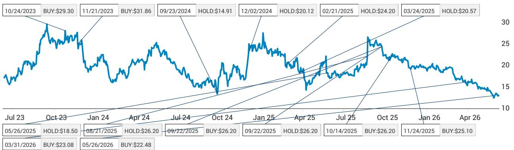

# JEF：泡泡玛特的韧性来自股东结构变化，而非基本面改善

这份JEF最新发布的IP玩具月度追踪报告，表面上是一份常规的数据更新，但如果我们用金字塔原理来拆解，会发现一个被市场情绪掩盖的核心判断：泡泡玛特股价在1Q26业绩发布后的韧性，更多来自股东结构的结构性变化，而非运营基本面的加速改善。段永平在5月底购入约6%股份成为重要股东，这一事件对市场信心的支撑力度，可能超过了公司自身业绩所能提供的边际增量。

报告发布时点恰逢市场对泡泡玛特海外增长动能是否可持续产生分歧。4月电商GMV同比增长70%、环比增长25%的数据，以及Labubu二手价格环比企稳的信号，确实为多头提供了弹药。但与此同时，报告也坦率指出：公司App活跃用户数在5月出现下滑，全球及区域Google搜索趋势继续走弱，Instagram粉丝增速也在放缓。这些信号组合在一起，指向一个更复杂的图景——短期催化剂（Labubu 4.0发布、世界杯相关营销）能否转化为可持续的增长，仍需验证。

这份报告的价值不在于罗列数据，而在于它揭示了一个关键张力：市场正在用股东结构变化来定价，而非用运营数据的边际变化来定价。这种定价逻辑的切换，对投资者的观察框架提出了新要求。

## 1. 段永平入股是股价韧性的主要支撑，而非基本面拐点

报告开篇就给出了一个清晰的判断：在5月13日1Q26业绩发布后，泡泡玛特股价保持了韧性，但JEF并未看到基本面有任何实质性变化。真正改变市场情绪的事件，是段永平在5月25日至28日期间购入8100万股，约占公司总股本的6%，使其成为重要股东。

这一判断的关键在于时间序列的对照。业绩发布到段永平入股之间有两个星期的窗口期，如果市场对业绩本身有强烈正面反应，股价韧性应该在这两周内就已经建立。但报告暗示，真正驱动股价走强的催化剂是后续的股东结构变化。段永平的入场不仅带来了资金层面的支撑，更重要的是向市场传递了一个信号：有长期视角的投资者愿意在这个价位建立头寸。

这意味着投资者需要区分两种不同类型的支撑力。运营数据改善带来的支撑是可持续的，因为它反映了公司竞争力的提升；而股东结构变化带来的支撑是情绪性的，其持续性取决于新股东是否会继续增持、是否会参与公司治理、以及市场是否会将这一事件解读为价值发现的信号。目前来看，这些维度都尚未得到充分验证。

## 2. 海外社交媒体的互动回暖与流量下滑并存，增长质量需要更细致的拆解

报告在海外运营数据部分呈现了一个看似矛盾的画面。一方面，TikTok上的互动量在5月出现明显回升，全球账号和泰国账号分别环比增长49%和67%；另一方面，Instagram粉丝净增量从4月的1.9万降至5月的1.3万，App活跃用户数在全球和美国市场均出现下滑，Google搜索趋势也继续下行。

这种“互动回暖但用户基础收缩”的组合，可能意味着泡泡玛特在海外市场的增长正在从“广度扩张”转向“深度运营”。互动量的提升说明现有粉丝的参与度在提高，这可能得益于世界杯相关营销活动的拉动；但粉丝增速放缓和搜索趋势下行，则暗示新用户的获取成本在上升，或者品牌在目标市场的渗透率已经接近一个阶段性平台。

对于投资者而言，这个信号的含义是：海外增长的下一个阶段，可能不再是由社交媒体病毒式传播驱动的自然增长，而是需要更系统性的渠道建设、本地化运营和产品创新来支撑。世界杯营销和Labubu 4.0能否带来新用户增量，还是仅仅激活了存量用户，将是判断海外增长质量的关键观察点。

## 3. 电商数据分化揭示行业竞争格局的重新洗牌

报告提供的4月电商数据显示，泡泡玛特在主流电商平台的GMV同比增长70%、环比增长25%，增速显著领先于竞争对手。同期，Bloks的电商销售同比增长16%，名创优品同比增长11%。而52Toys和卡游的电商销售则出现同比下滑。

这一数据分化的背后，可能反映了三个结构性变化。第一，泡泡玛特凭借IP矩阵的深度和广度，正在将规模优势转化为电商渠道的流量获取效率优势。当消费者在电商平台搜索盲盒或潮玩时，泡泡玛特的产品覆盖面和品牌认知度使其能够获得更多的自然流量和付费流量。第二，名创优品和Bloks虽然也有增长，但增速明显落后，说明它们尚未找到能够与泡泡玛特形成差异化竞争的有效路径。第三，52Toys和卡游的下滑，可能意味着中小型IP玩具品牌正在被挤出电商渠道，行业集中度正在提升。

但这里有一个关键问题尚未回答：电商GMV的增长有多少来自价格提升，多少来自销量增长？如果增长主要由Labubu等高端产品线带动，那么单位经济模型可能正在改善；但如果增长主要依赖低价产品走量，那么利润率可能面临压力。报告没有展开这一分析，但它对判断增长的可持续性至关重要。

## 4. 二手市场价格企稳但产品结构趋于分散，IP生命周期的管理能力面临考验

报告指出，Labubu毛绒玩具的二手价格在5月环比企稳。同时，在二手交易平台上最受欢迎的30款产品中，出现了更多样化的构成：其中有3款是非泡泡玛特产品，而泡泡玛特与aespa的联名款仍然是需求最旺盛的产品。

二手价格企稳是一个积极信号，它说明市场对Labubu系列的需求没有出现急剧萎缩。但产品结构的分散化趋势值得关注。当非泡泡玛特产品开始进入最受欢迎榜单的前列，意味着消费者的注意力正在被其他IP分散。联名款成为需求顶峰，也说明泡泡玛特自有IP的热度可能已经接近阶段性高点，未来的增长可能需要更多地依赖外部IP合作。

这引出了一个更深层的问题：泡泡玛特的IP生命周期管理能力是否足以支撑其估值溢价？如果Labubu的热度开始自然衰减，公司是否有足够的IP储备来填补空白？报告没有给出明确答案，但它在数据层面提供了一个观察框架：二手价格走势和热门产品构成的变化，将是判断IP生命周期阶段的前瞻性指标。

## 5. 世界杯营销和Labubu 4.0是短期催化剂，但2026年利润率压力才是真正的变量

报告在“新产品发布/活动”部分提到两个关键催化剂：Labubu 4.0的发布和世界杯相关的全球营销活动。这些确实可能在短期内提振海外市场情绪和销售数据。但报告同时也指出，在1Q26业绩后的电话会上，公司管理层提到了2026年可能面临的利润率压力。

这个信息的重要性可能被市场低估了。如果2026年利润率确实面临压力，那么当前股价所隐含的增长预期就需要重新审视。利润率压力的来源可能包括：海外扩张带来的运营成本上升、原材料价格波动、以及为了维持增长而增加的市场营销投入。世界杯营销本身也是一把双刃剑——它能够提升品牌知名度，但也意味着短期费用的增加。

报告没有对利润率压力的具体幅度和持续时间做出预测，但它提出了一个投资者必须自己回答的问题：当前的股价是否已经充分反映了潜在的利润率压力？如果市场对利润率的预期过于乐观，那么一旦实际数据低于预期，股价的调整幅度可能会超过基本面所能解释的范围。

## 6. 报告尚未完全回答的关键问题：股东结构变化能否转化为治理改善

段永平的入股是这份报告最引人注目的信息点。但报告坦诚地指出，目前没有看到任何基本面变化。这意味着段永平的入股更像是一个被动的财务投资，而非主动的战略布局。他是否会寻求董事会席位？是否会推动公司战略调整？是否会参与公司的长期治理？这些问题都悬而未决。

从历史经验来看，知名投资者的入股往往能够短期内提振股价，但长期效果取决于他们能否为被投企业带来实质性的价值创造。段永平在投资领域的声誉确实很高，但他过往的投资风格更偏向于“买入并持有”，而非“积极参与治理”。对于泡泡玛特而言，段永平的入股能否带来战略层面的改变，比如帮助公司拓展海外渠道、优化供应链管理、或者提升品牌运营效率，目前都是未知数。

这个问题的答案，可能需要等到公司下一次业绩发布或者股东结构发生进一步变化时才能揭晓。在此之前，投资者需要保持对股东结构变化与运营基本面变化之间关系的清醒认知。

---

这份JEF的月度追踪报告，其价值不在于给出了明确的投资建议，而在于提供了一个结构化的观察框架。它告诉我们，在评估泡泡玛特时，需要同时关注三个维度：运营数据的边际变化、股东结构的稳定性、以及行业竞争格局的演化。这三个维度目前呈现出不同的信号强度，而市场似乎正在用股东结构的变化来对冲运营数据的边际走弱。

报告中还有大量关于其他IP玩具公司的电商销售数据、二手价格走势、以及社交媒体互动指标的详细图表，这些数据对于理解整个IP玩具行业的竞争态势具有重要价值。受限于篇幅，本文未能一一展开。如果你希望获取完整的报告解读和原始数据图表，欢迎来我们的星球微信群里继续讨论。在那里，我们会定期分享对IP玩具行业、消费品牌以及相关上市公司的最新研究和思考。

Personal reading notes and learning share only. Not investment advice.

