## Tech Bytes | Asia Pacific

# Memory – A Healthy Reset

Corrections are necessary for the cycle to continue. DRAM is the main bottleneck to the AI build-out but the market concerns on the durability of this cycle. We think multiple expansion can be a bigger driver of returns from here. We revise up bear cases substantially for Samsung and SK hynix.

This reset on price performance does not mean the cycle is over. Our core view is that the cycle is still accelerating, earnings revisions remain robust and more sustainable than most believe. The earnings revisions justify the rally – the earnings estimates for memory companies are up just as much as the stocks are – and the LTAs justify a re-rating potential.

Memory cycles – a long-term perspective. We should be near peak cycle by year-end if we go by the historical DRAM cycle duration and a re-rating needs: (1) the supply side to behave, and (2) demand must convert into durable economics in the long-run as well. Prior cycles were never about demand but supply discipline which never held. AI structural demand on top of undisciplined supply is just a longer cycle with a much higher peak, which is a consensus view at the moment.

Memory prices will decline, the cycle always turns as current investment plans come online from late 2027, but price elasticity of AI demand may be different. Lower DRAM prices reduce the cost of running AI inference, making AI deployment cheaper, and create new demand, rather than simply reducing costs for a fixed number of consumer devices.

How much upside? Memory pricing has nearly doubled since February and lead times have stretched out significantly. The underlying driver is constrained physical production due to LTAs. If LTAs could account for 70%+ of total supply in the next 3-5 years, in our view, this implies DRAM stocks could re-rate to at least 8-10x PE vs. 5x PE now, in theory. This is based on simple math of 70%+ of 2027 EPS valued closer to market multiples (rolling 5Y 10-14x PE) and the remaining 30% of non-LTA EPS at historical 5x peak PE of peak earning.

Stock implications. We estimate more than 20-30% DRAM price hikes in 3Q26, enough to keep the YoY rate of change accelerating. Pricing power is translating into earnings revisions that in turn support P/E stability – at 5.2x 2027e earnings – even as stocks surged 70-134% in the last 2-months, and not a change in the discount rate. We revise up our bear case values for SK hynix and Samsung by 175% and 58%, respectively (Revising up the bear case).

MS & CO. INTERNATIONAL PLC+

## Shawn Kim

Equity Analyst

Shawn.Kim@morganstanley.com +44 20 7677-1018

MS ASIA LIMITED+

## Duan Liu

Equity Analyst

Duan.Liu@morganstanley.com +852 2239-7357

MS & CO. INTERNATIONAL PLC+

## Cindy Huang

Equity Analyst

Cindy.Huang@morganstanley.com +44 20 7425-2915

MS & CO. INTERNATIONAL PLC, SEOUL BRANCH+

## Ryan Kim

Equity Analyst

Ryan.G.Kim@morganstanley.com +82 2 399-4939

## Asia Summer School 2026

MS does and seeks to do business with companies covered in MS. As a result, investors should be aware that the firm may have a conflict of interest that could affect the objectivity of MS. Investors should consider MS as only a single factor in making their investment decision.

## For analyst certification and other important disclosures, refer to the Disclosure Section, located at the end of this report.

+= Analysts employed by non-U.S. affiliates are not registered with FINRA, may not be associated persons of the member and may not be subject to FINRA restrictions on communications with a subject company, public appearances and trading securities held by a research analyst account.

## A Healthy Reset

Markets rarely move in a straight line at the pace seen since the March lows. In our view, a correction was inevitable and ultimately healthy if this memory bull market is going to extend into year-end. Parabolic charts in memory stocks clashed with levered ETF exposure and record crowding by hedge funds and retail investors. This reset on price does not mean the cycle is over. Instead, it is more likely that this is a necessary reset for the cycle to eventually extend – we have had 3 such resets since Generative AI was launched in the fall of 2022. Our constructive year-end view is grounded in: (1) still-strong AI demand, (2) supply growth that is limited by clean room and EUV availability, and (3) LTAs driving durable earnings and FCF growth. We are not at peak cycle yet but acknowledge that accelerative moves in fundamentals always reach an apex in terms of the rate of change and stocks tend to react to that.

Exhibit 1: DRAM Stocks vs. 200-Day Moving Average  
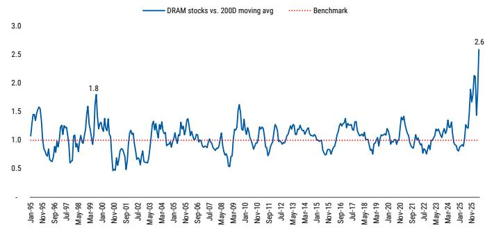

line chart

| Date     | DRAM stocks vs. 200D moving avg |
| -------- | -------------------------------- |
| Jan-95   | 1.5                              |
| May-98   | 1.8                              |
| Nov-25   | 2.6                              |

Source: Factset, MS

Exhibit 2: DRAM Stocks: Major sell-offs through the rally  
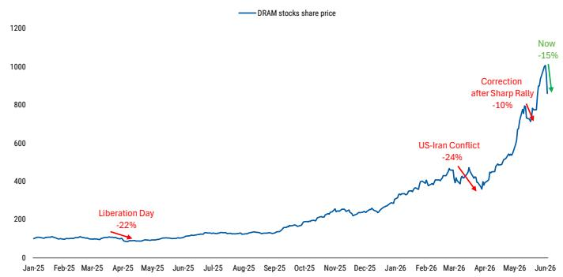

line chart

| Date       | DRAM stocks share price |
| ---------- | ----------------------- |
| Apr-25     | -22%                    |
| Mar-26     | -24%                    |
| Apr-26     | -10%                    |
| Jun-26     | -15%                    |

Source: Factset, MS

## Prior memory corrections after parabolic moves may be instructive. These

developments don't necessarily mark the end of a bull market in the memory cycle, but these areas typically don't spring back right away either. That process takes time and this reminds us of similar price moves we have seen in other commodity areas earlier this year (Gold/Silver, Rare Earths, other Industrial Metals, Energy, etc). We would point out that commodities often exhibit this type of volatility while still in the midst of a long bull market.

We note that for the Korea market, historically, post-circuit breaker dynamics skew constructive, with \~75% next-day hit rates improving to \~87-88% over medium horizons, suggesting that while volatility may persist near term, risk-reward is gradually improving into weakness, particularly with Samsung and SK Hynix now trading at \~5.2x and \~4.7x fwd P/E, respectively.

Exhibit 3: Samsung: Returns following KOSPI Circuit Breaker Events

<table><tr><td>Event</td><td>1st trading day</td><td>1D</td><td>1W</td><td>1M</td><td>3M</td></tr><tr><td>Dotcom Bubble</td><td>17/04/2000</td><td>9.4%</td><td>9.6%</td><td>12.0%</td><td>36.8%</td></tr><tr><td>Dotcom Bubble</td><td>18/09/2000</td><td>4.8%</td><td>-4.3%</td><td>-1.8%</td><td>-12.1%</td></tr><tr><td>Dotcom Bubble</td><td>12/09/2001</td><td>6.2%</td><td>1.5%</td><td>-13.3%</td><td>60.1%</td></tr><tr><td>Covid-19</td><td>13/03/2020</td><td>0.0%</td><td>-8.7%</td><td>-6.3%</td><td>8.7%</td></tr><tr><td>Covid-19</td><td>19/03/2020</td><td>5.7%</td><td>9.3%</td><td>13.2%</td><td>21.5%</td></tr><tr><td>Yen Carry Unwind Scare</td><td>06/08/2024</td><td>3.0%</td><td>3.0%</td><td>5.0%</td><td>-19.0%</td></tr><tr><td>US-Iran Conflict</td><td>04/03/2026</td><td>11.3%</td><td>0.8%</td><td>10.2%</td><td>109.3%</td></tr><tr><td>US-Iran Conflict</td><td>09/03/2026</td><td>8.3%</td><td>5.8%</td><td>3.6%</td><td>89.6%</td></tr><tr><td></td><td>Hit Ratio %</td><td>87.5%</td><td>75.0%</td><td>62.5%</td><td>75.0%</td></tr><tr><td></td><td>Mean Return %</td><td>6.1%</td><td>2.1%</td><td>2.8%</td><td>36.9%</td></tr><tr><td></td><td>Max Return %</td><td>11.3%</td><td>9.6%</td><td>13.2%</td><td>109.3%</td></tr><tr><td></td><td>Min Return %</td><td>0.0%</td><td>-8.7%</td><td>-13.3%</td><td>-19.0%</td></tr><tr><td></td><td>Median Return %</td><td>5.9%</td><td>2.3%</td><td>4.3%</td><td>29.2%</td></tr></table>

Source: Factset, MS

## Memory cycles – a long-term perspective

We should be near peak cycle by year-end if we go by the historical DRAM cycle duration – the playbook has been the typical 6 quarters on the way up before supply becomes less tight (i.e. the YoY rate of change in pricing) and stocks moving about 4-months before that. But because of AI agent demand (which dates from January 2026), it is reasonable to assume the top is at least several quarters away from today. The re-rating needs (1) the supply side to behave, and (2) demand must convert into durable economics in the long-run as well.

- Prior cycles were never about demand (every prior cycle had real, growing demand with the exceptions of the 2008 GFC and 2021 initial COVID demand shocks). But the cycles were always supply-driven, racing to meet any demand gap and overshooting.  
- What breaks the cycle is supply discipline, and that is the variable that has never held. Structural demand on top of undisciplined supply is just a longer cycle with a much higher peak, which is consensus thinking at the moment.

Exhibit 4: Long-Term DRAM cycle YoY chart  
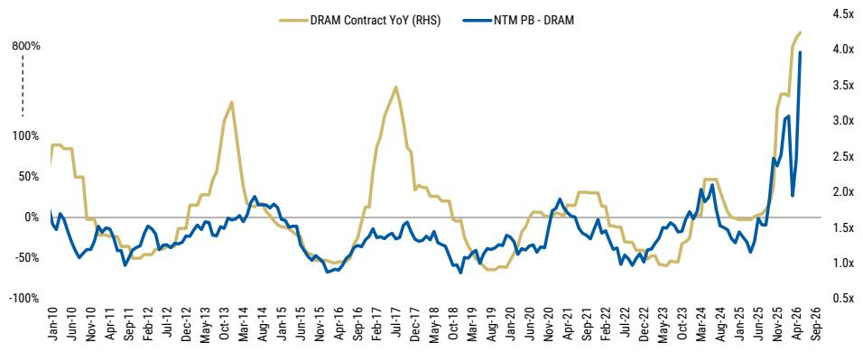

line chart

| Date   | DRAM Contract YoY (RHS) | NTM PB - DRAM |
|--------|--------------------------|---------------|
| Jan-10 | ~90%                     | ~0.5x         |
| Jun-10 | ~50%                     | ~1.0x         |
| Nov-10 | ~0%                      | ~1.5x         |
| Apr-11 | ~-50%                    | ~1.0x         |
| Sep-11 | ~-50%                    | ~1.5x         |
| Feb-12 | ~-50%                    | ~1.0x         |
| Jul-12 | ~-50%                    | ~1.5x         |
| Dec-12 | ~-50%                    | ~1.0x         |
| May-13 | ~50%                     | ~1.5x         |
| Oct-13 | ~150%                    | ~2.0x         |
| Mar-14 | ~20%                     | ~2.5x         |
| Aug-14 | ~20%                     | ~2.0x         |
| Jan-15 | ~0%                      | ~1.5x         |
| Jun-15 | ~-50%                    | ~1.0x         |
| Nov-15 | ~-50%                    | ~1.5x         |
| Apr-16 | ~-50%                    | ~1.0x         |
| Sep-16 | ~-50%                    | ~1.5x         |
| Feb-17 | ~70%                     | ~2.0x         |
| Jul-17 | ~70%                     | ~2.5x         |
| Dec-17 | ~30%                     | ~2.0x         |
| May-18 | ~20%                     | ~1.5x         |
| Oct-18 | ~-50%                    | ~1.0x         |
| Mar-19 | ~-50%                    | ~1.5x         |
| Aug-19 | ~-50%                    | ~2.0x         |
| Jan-20 | ~-50%                    | ~2.5x         |
| Jun-20 | ~0%                      | ~3.0x         |
| Nov-20 | ~20%                     | ~3.5x         |
| Apr-21 | ~30%                     | ~4.0x         |
| Sep-21 | ~30%                     | ~4.5x         |
| Feb-22 | ~20%                     | ~4.0x         |
| Jul-22 | ~-50%                    | ~3.5x         |
| Dec-22 | ~-50%                    | ~3.0x         |
| May-23 | ~-50%                    | ~2.5x         |
| Oct-23 | ~20%                     | ~2.0x         |
| Mar-24 | ~40%                     | ~2.5x         |
| Aug-24 | ~40%                     | ~3.0x         |
| Jan-25 | ~20%                     | ~2.5x         |
| Jun-25 | ~-50%                    | ~2.0x         |
| Nov-25 | ~30%                     | ~3.0x         |
| Apr-26 | ~80%                     | ~4.0x         |
| Sep-26 | ~80%                     | ~4.5x         |

Source: Trendforce, Factset, MS

What's different? Intelligence vs. consumer electronics demand. Memory has become an essential input for intelligence or token manufacturing where more HBM bandwidth, more DRAM and NAND capacity mean more intelligence output per second. The larger the model usage, the longer the context and number of users simultaneously supporting more AI agents deployed – this demand is not the same as traditional PC or smartphone where the TAM is fixed.

- AI inference growing exponentially as well as AI agent usage in its infancy and very far from saturation.  
- The ratio of memory that goes into PCs and smartphones and other personal-use devices is lower each day as memory capacity keeps moving to AI-related infrastructure.  
- Every generation of GPU is constrained by memory, not compute. DRAM content per AI unit is growing 4-7x (from 80GB per A100 to 288-768GB for Rubin GPU/Superchip) while AI chips are growing at about 60% annual run rate today.

Memory prices will decline, the cycle always turns... as new fab capacity from current investment plans comes online in late 2027. The nature of demand for memory however, is AI-driven and tied to long-lived infrastructure programs rather than short consumer cycles. This gives memory producers more visibility and confidence on future demand but not enough to aggressively overbuild as in the past cycles. According to management targets, adding capacity may be coming in much more controlled stages.

... but price elasticity of AI demand may be different. Lower DRAM prices reduce the cost of running AI inference, making AI deployment cheaper. This creates new demand and expands the addressable market, rather than simply reducing costs for a fixed number of consumer devices.

## On bubbles

A bubble can inflate for a long time. We had two great years of stock performance back during that internet build out, and we think we can have at least one more great year this year. If we go back to the internet build out, the Generative AI equivalent of internet – Netscape Navigator – was out at the end of 1994, NASDAQ over the next 4-years was up 149%, and in year-5 in 1999 up 86%. Generative AI came out at the end of 2022, and we are 3-years into this, NASDAQ is up 122%. The Dot.com peak in March 2000 can be explained by: (1) fundamentals where the rate of change in internet traffic growth slowed from doubling every 3-months to doubling every year – that slowdown was not what was built into valuations, and (2) post Fed easy money before Y2K (M2 up >10%), oil prices spiked and the Fed started to withdraw that liquidity. NASDAQ then fell 85% and mean reverted back to mid-1996.

It is hard to predict exactly how much of the current demand bubble will persist in the long-run. Agentic AI is a step change in token generation, up from 20% growth 2-months before OpenClaw and over 120% after its launch on January 2026. Clearly, the current market is distorted by short-term dynamics but which part is base demand and which distortion?

Exhibit 5: AI vs. Dot.com: NASDAQ Performance from the Technology's arriva  
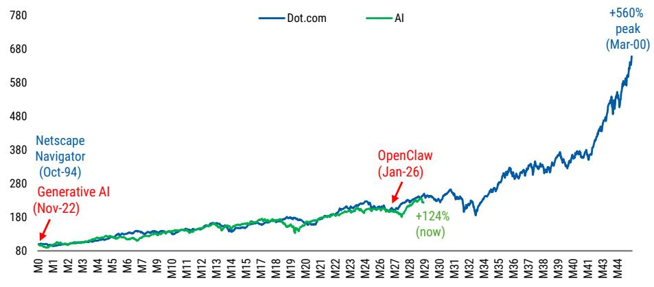

line chart

| Date       | Dot.com | AI     |
| ---------- | ------- | ------ |
| Nov-22     | -       | -      |
| Jan-26     | -       | +124% (now) |

Source: Factset, MS

## Key risks

The risk for the memory cycle at the current stage is plentiful. Technology will evolve, competition and supply will normalize and so will memory stocks. However, the chances of this happening in the very near-term are low, but worth pointing out as it would be significant enough to derail our positive industry view.

- A technical breakthrough on efficiency that would use significantly less memory/HBM, or a change that would bypass memory altogether. We would exclude memory compression as it has been a constant, but acknowledge that the industry always looks for ways around bottlenecks.  
- Falling off the AI race. We still need five major drivers of frontier LLMs and hyperscale AI infrastructure spend to stay elevated.  
- AI demand rate of change moving off-course and no longer exponential. The ARR (Annualized Run Rate) trajectory is an important indicator of AI usage in enterprise API contracts and the adoption of agentic coding tools, and an important indicator of how the business may grow in the future.  
- Chipflation and the macro impact. The question is not whether memory prices have risen enough to matter. They have. It is whether the cost is travelling through channels diffused and slow enough that, by the time it becomes fully visible, the underlying price shock will be two years old. Global Technology: Chipflation – Navigating A Memory Crisis (2 Jun 2026).  
- Market liquidity may act as a near-term risk. The liquidity picture is tightening again from a rate of change standpoint, while China has been aggressively slowing its money supply growth as well. Add in higher oil prices and a very resilient US dollar, and the liquidity picture is less accommodative than it was in the first quarter and a risk given liquidity tends to lead equity markets by approximately 3 months.

## The AI CPU memory bull case comes into view

The agentic AI CPU thesis has moved from forecast to validation post GTC Taipei and

Computex 2026. Recent management commentaries are now skewing our server CPU and memory TAM towards the bull case. The cluster CPU-to-GPU ratio that underpinned our previous framework (Agentic AI - The Surge Begins) is being corroborated, with commentary across major chip companies pointing to a shift from training-era ratios towards parity for agentic AI workloads, alongside a step-change in per-agent token intensity. This supports the upper end of our US\$283bn bull case server CPU TAM.

We see the read-through to memory as asymmetric to the upside. The move towards native LPDDR (mobile DRAM) across the latest generation of orchestration CPUs, combined with higher token intensity per agent, supports greater DRAM content per CPU – the key swing factor in our framework. We raise our incremental DRAM estimate accordingly (prior \~74EB base case/ -221EB bull case).

## Significant incremental upside – when intelligence is produced at the point of context.

The data center is coming to laptops, smartphones and at home. So wherever and whenever the context is, that is where intelligence will be produced – where we see the upside will likely be coming from edge device, such as agentic AI PCs introduced at Computex that come with a memory vector that server-attached framework excludes today. With 128GB of unified LPDDR5x per AI PC systems, we see this as a source of potential upside to both our memory TAM.

- Agents will be on premise because that is where all of the data sits (secure, proprietary and all the skills associated with users/companies).  
- Agents iterate until it can get the job done using all different tools. The amount of computation that is necessary... because it is running autonomously for so long, and instead of responding to a query, the amount on computation has grown exponentially.  
- Instead of humans using tools, it is agents using tools – people use tools every now and then, agents use tools all the time and very quickly. You give digital agents a PC and access to GPU and memory.

Exhibit 6: We estimate the Agentic CPU TAM to grow at a 251% CAGR from FY26 to FY30  
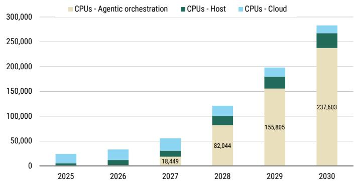

stacked bar chart

| Year | CPUs - Agentic orchestration | CPUs - Host | CPUs - Cloud |
|---|---|---|---|
| 2025 | 0 | 5000 | 25000 |
| 2026 | 0 | 10000 | 30000 |
| 2027 | 18,449 | 15000 | 35000 |
| 2028 | 82,044 | 25000 | 15000 |
| 2029 | 155,805 | 30000 | 15000 |
| 2030 | 237,603 | 35000 | 15000 |

Source: MS estimates

Exhibit 7: We estimate incremental DRAM demand to reach \~221EB as orchestration CPU racks scale  
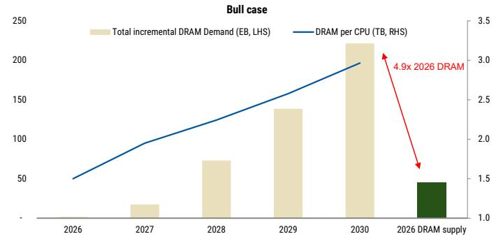

bar-line hybrid

Bull case
| Year | Total incremental DRAM Demand (EB, LHS) | DRAM per CPU (TB, RHS) |
| :--- | :--- | :--- |
| 2026 | 0 | 50 |
| 2027 | 20 | 100 |
| 2028 | 70 | 125 |
| 2029 | 135 | 155 |
| 2030 | 220 | 195 |
| 2030-2036 DRAM supply | 45 | 1.5 |
4.9x 2026 DRAM

Source: MS estimates

## What have companies said?

- NVIDIA (covered by Joseph Moore): CEO Jensen Huang said: "Every CPU today was designed for humans. Vera was designed for agents." Vera Rubin is in full production, with a supply chain twice the size of Grace Blackwell; Vera is pitched as a purpose-built CPU for agentic and reinforcement learning workloads, claiming \~ 2x efficiency and 50% faster performance vs traditional x86 server CPUs. Huang stressed single-thread performance over core count and suggested Vera can sit across GPU head nodes, storage servers and orchestration nodes.  
- Intel (covered by Joseph Moore): CEO Lip-Bu Tan said the CPU:GPU ratio has shifted from 1:8 in frontier-model training to 1:1 or better for agentic AI, as the CPU orchestrates the reasoning process, while an agent can consume up to \~1,000x more tokens than single-turn reasoning. Intel launched the Xeon 6+ (Clearwater Forest, Intel 18A, 288 e-cores, 576MB L3), claiming up to 150,000 agents per rack, previewed rackscale "Intelligence Center" designs with Foxconn, and confirmed big-core Diamond Rapids slips to 2027.  
- Arm (covered by Lee Simpson): Arm holds \~50% of CPU compute among top hyperscalers, with AGI CPU customer demand now >US\$2bn across FYE27-28 (more than double the level indicated at Arm Everywhere), and the AGI CPU co-developed with Meta for agentic infrastructure. Arm unveiled two AGI-CPU rack reference designs – a 36kW air-cooled rack with 8,160 cores and a 200kW liquid-cooled rack with 45,696 cores – with data-centre royalties more than doubling YoY.  
- Qualcomm (covered by Joseph Moore): CEO Cristiano Amon declared 2026 the "Year of the Agent," with agentic AI moving beyond prompts to take action across phones, PCs, vehicles, robots, industrial systems and cloud. Qualcomm announced Dragonfly, its official entry into the high-performance data centre server market, alongside a new Snapdragon C platform for Windows laptops and the Dragonwing IQ10 robotics reference design.

Exhibit 8: NTM consensus EPS trend over last 1 year  
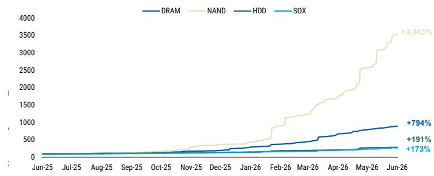

line chart

| Date   | DRAM   | NAND   | HDD    | SOX    |
|--------|--------|--------|--------|--------|
| Jun-26 | +794%  | +3,443%| +191%  | +173%  |

Source: Factset, MS

Exhibit 9: Memory's earnings revision breadth since 2018  
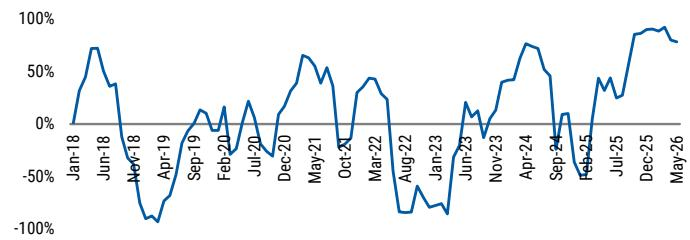

line chart

| Month    | Value  |
| -------- | ------ |
| Jan-18   | 0%     |
| Jun-18   | 75%    |
| Nov-18   | -100%  |
| Apr-19   | -90%   |
| Sep-19   | 10%    |
| Feb-20   | 20%    |
| Jul-20   | -20%   |
| Dec-20   | 60%    |
| May-21   | 40%    |
| Oct-21   | -20%   |
| Mar-22   | 40%    |
| Aug-22   | -80%   |
| Jan-23   | -60%   |
| Jun-23   | 20%    |
| Nov-23   | -20%   |
| Apr-24   | 75%    |
| Sep-24   | 10%    |
| Feb-25   | -40%   |
| Jul-25   | 40%    |
| Dec-25   | 90%    |
| May-26   | 80%    |

Source: Factset, MS

## Memory Channel Checks

## DRAM

\- SemiAnalysis suggests a reduction in the Rubin NVL72 platform's SOCAMM memory configuration from 55TB to 28TB per rack (news) The spec downgrade is consistent with our channel checks. However, our channel checks also indicate that the overall Nvidia memory order size does not shrink, which indicates the DRAM shortage has not come to the double order stage yet. (See more comments from Joe Moore: Weekly: NVDA memory cuts? And Apr SIA)

\- HBM pricing negotiations are still ongoing and prices will likely be raised by at least 50-100% YoY starting from 2027. The 2026 HBM pricing has already been settled under annual contract negotiated earlier last year and we do not expect near-term change in 2H26.

\- The pricing for 3Q26 will continue to increase and we expect +20% QoQ ask at the very beginning but we've already seen signs of consumer electronics customers starting to cut orders after 2Q26 pricing hikes. Therefore, we expect the 3Q trend to diverge between AI vs non-AI products

\- LTA negotiations are still ongoing, amid AI growth and structural shortages that will likely persist into 2028, some of the suppliers started to de-commit hyperscale customers in order to win more flexibility on quarterly pricing negotiation.

\- We expect AI related products to continue gain share in the supply allocation from over 50% this year to nearly 70% next year. Besides additional supply from new capacity, the consumer electronics and module makers will likely face continued order squeeze due to tight AI demand growth

## NAND

\- 3Q26 contract pricing will likely increase by another 30% QoQ mainly driven by eSSDs. Spot pricing trends muted given the consumer electronics market already faces challenges on digesting the soaring pricing.

\- HBF products outlook remain mixed according to the industry feedback. CSPs are worried that the durability issue of NAND die will significantly lower the long cycle of GPU when they are packaged together and eSSD seems to be a better/safer solution for now. One customer appears interested in HBF technology for its smartphone and edge devices to be compatible with its AI applications.

\- We expect AI NAND to grow with at least 50% YoY bit growth moving into 2027, mainly driven by CSP's KV Cache offloading demand as well as the QLC SSD capacity expansion in response to the shortage in HDD side. The agentic rack could potentially lift the TAM for AI NAND demand as well, as we estimate 2-8TB eSSD buffer per tray while the specific rack shipment will become more meaningful moving into 2027.

## Nvidia AI PC

At GTC Taipei, Jensen Huang unveiled the RTX Spark, Nvidia's first SoC for Windows PCs and its entry into consumer PC silicon, against Apple Silicon and Qualcomm Snapdragon X2. Huang framed the PC as moving "from tool to teammate" - you ask, and the PC does the work. The key point is that Al agents become the main interface and the largest users of compute, with much of that work running on-device rather than in the cloud. Local execution keeps sensitive context on the machine, runs persistent background agents, and cuts latency versus a 100%-cloud setup.

For memory, this means more DRAM per device, because running large models on the device needs a big pool of memory. RTX Spark has a 20-core Grace Arm CPU (10x Cortex-X925 + 10x Cortex-A725, co-developed with MediaTek) and a Blackwell GPU (6,144 CUDA cores) with up to 128GB unified LPDDR5X, up to 300GB/s memory bandwidth, on TSMC 3nm. It can run 120bn-parameter models on the device. NAND depends on the OEM and the model- ASUS ProArt offers 2TB SSD on the P16 and 1TB on the P14, with spare slots for expansion, while most other options are not confirmed yet.

On pricing, our hardware team estimates the highest-end spec notebook will likely exceed US\$3K, but it also comes in a desktop form factor. Preliminarily, their checks suggest <10M units of cumulative shipments over the next 3 years vs. an annual PC TAM of \~270M units given higher price points.

## Memory inflections

## We monitor four signposts as early inflection signals during a cycle:

1. DRAM prices extending strength. We expect LTAs to change the high volatility nature of memory pricing for the next 2-3 years. After significant hikes from 4Q25-2Q26, we expect pricing increases on a QoQ basis to narrow to around 8-13% QoQ for both DRAM and NAND. Instead of viewing this as a sign of inflection, we believe LTAs can instill stability, improve earnings predictability, and reduce the risk of overbuilding capacity with better supply management for memory companies by locking in pricing at an elevated level with prepayments. (LTAs – How They Are Affecting Memory)

2. Inventory adjustment cycle. Supplier inventory remains at historical lows of only 2-3 weeks for DRAM and 4-5 weeks for NAND at the beginning of 2Q26. Server customers, despite aggressive orders, continue to work down their inventory, with remaining end customers retaining healthy inventory levels. During an upturn, lead times for the delivery of chips to manufacturers of PCs, servers and smartphones tend to grow longer. This prompts those customers to order more than they need and hoard that inventory in case longer lead times grow into a real shortage. We see this as an ongoing issue for consumer customers, who face a trade-off between soaring prices and limited supply allocation.

3. Capex budgets pared down while capital intensity moves higher. There is typically either too much or too little supply in memory. The industry is competitive but also rational, and should therefore be responsive to periods of price disequilibrium. In response to the increase in inventories and the prospect of lower profitability, chip manufacturers reduce their capacity growth to manufacture chips to meet that demand. Capital expenditure for DRAM was cut by 23% in 2019 and stayed flat in 2020, while the 2015 downturn saw only 9% cuts. However, AI demand is likely to keep absolute capex levels elevated in upcoming downturns and also prompt companies to require higher returns to justify those investments.

4. Continued upward earnings revisions and valuation expansion. The market often runs ahead of the actual revisions in earnings, and we would look for further earnings upside through HBM pricing negotiations. Our sensitivity analysis (here) suggests that the market is not yet assigning any meaningful P/E premium to memory suppliers' LTA-backed earnings and FCF. For illustration, if we were to apply a 10x P/E multiple to LTA-backed earnings and assume 70% commodity LTA coverage, the 2027 P/E for Samsung/hynix could expand to \~8.5x, all else equal (from 5x currently).

Exhibit 10: DRAM inventory  
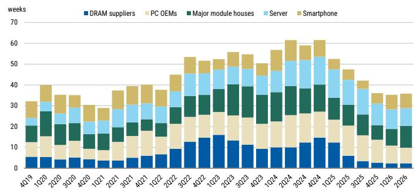

stacked bar chart

| Quarter | DRAM suppliers | PC OEMs | Major module houses | Server | Smartphone |
|---------|----------------|---------|---------------------|--------|------------|
| 4Q19    | 5              | 8       | 10                  | 5      | 5          |
| 1Q20    | 5              | 10      | 15                  | 5      | 5          |
| 2Q20    | 5              | 10      | 10                  | 5      | 5          |
| 3Q20    | 5              | 10      | 10                  | 5      | 5          |
| 4Q20    | 5              | 10      | 10                  | 5      | 5          |
| 1Q21    | 5              | 10      | 10                  | 5      | 5          |
| 2Q21    | 5              | 10      | 10                  | 5      | 5          |
| 3Q21    | 5              | 10      | 10                  | 5      | 5          |
| 4Q21    | 5              | 10      | 10                  | 5      | 5          |
| 1Q22    | 5              | 10      | 10                  | 5      | 5          |
| 2Q22    | 5              | 10      | 10                  | 5      | 5          |
| 3Q22    | 5              | 10      | 10                  | 5      | 5          |
| 4Q22    | 5              | 10      | 10                  | 5      | 5          |
| 1Q23    | 5              | 10      | 10                  | 5      | 5          |
| 2Q23    | 5              | 10      | 10                  | 5      | 5          |
| 3Q23    | 5              | 10      | 10                  | 5      | 5          |
| 4Q23    | 5              | 10      | 10                  | 5      | 5          |
| 1Q24    | 5              | 10      | 10                  | 5      | 5          |
| 2Q24    | 5              | 10      | 10                  | 5      | 5          |
| 3Q24    | 5              | 10      | 10                  | 5      | 5          |
| 4Q24    | 5              | 10      | 10                  | 5      | 5          |
| 1Q25    | 5              | 10      | 10                  | 5      | 5          |
| 2Q25    | 5              | 10      | 10                  | 5      | 5          |
| 3Q25    | 5              | 10      | 10                  | 5      | 5          |
| 4Q25    | 5              | 10      | 10                  | 5      | 5          |
| 1Q26    | 5              | 10      | 10                  | 5      | 5          |
| 2Q26    | 5              | 10      | 10                  | 5      | 5          |

Source: TrendForce estimates, MS

Exhibit 11: NAND inventory  
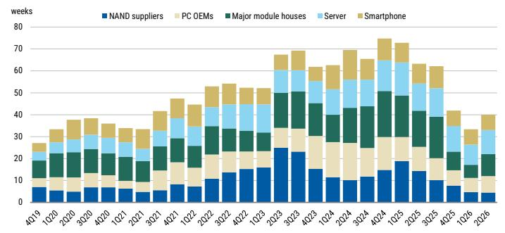

stacked bar chart

| Quarter | NAND suppliers | PC OEMs | Major module houses | Server | Smartphone |
|---------|----------------|---------|----------------------|--------|------------|
| 4Q19    | 7              | 5       | 8                    | 3      | 2          |
| 1Q20    | 7              | 5       | 9                    | 3      | 2          |
| 2Q20    | 7              | 5       | 10                   | 3      | 2          |
| 3Q20    | 7              | 5       | 10                   | 3      | 2          |
| 4Q20    | 7              | 5       | 10                   | 3      | 2          |
| 1Q21    | 7              | 5       | 10                   | 3      | 2          |
| 2Q21    | 7              | 5       | 10                   | 3      | 2          |
| 3Q21    | 7              | 5       | 10                   | 3      | 2          |
| 4Q21    | 7              | 5       | 10                   | 3      | 2          |
| 1Q22    | 7              | 5       | 10                   | 3      | 2          |
| 2Q22    | 7              | 5       | 10                   | 3      | 2          |
| 3Q22    | 7              | 5       | 10                   | 3      | 2          |
| 4Q22    | 7              | 5       | 10                   | 3      | 2          |
| 1Q23    | 7              | 5       | 10                   | 3      | 2          |
| 2Q23    | 7              | 5       | 10                   | 3      | 2          |
| 3Q23    | 7              | 5       | 10                   | 3      | 2          |
| 4Q23    | 7              | 5       | 10                   | 3      | 2          |
| 1Q24    | 7              | 5       | 10                   | 3      | 2          |
| 2Q24    | 7              | 5       | 10                   | 3      | 2          |
| 3Q24    | 7              | 5       | 10                   | 3      | 2          |
| 4Q24    | 7              | 5       | 10                   | 3      | 2          |
| 1Q25    | 7              | 5       | 10                   | 3      | 2          |
| 2Q25    | 7              | 5       | 10                   | 3      | 2          |
| 3Q25    | 7              | 5       | 10                   | 3      | 2          |
| 4Q25    | 7              | 5       | 10                   | 3      | 2          |
| 1Q26    | 7              | 5       | 10                   | 3      | 2          |
| 2Q26    | 7              | 5       | 10                   | 3      | 2          |

Source: TrendForce estimates, MS

Exhibit 12: DRAM Capex (US\$ mn)  
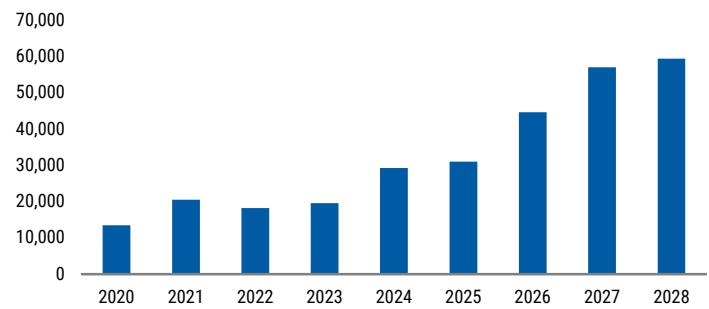

bar chart

| Year | Value |
|---|---|
| 2020 | 13000 |
| 2021 | 20000 |
| 2022 | 18000 |
| 2023 | 19000 |
| 2024 | 29000 |
| 2025 | 31000 |
| 2026 | 44000 |
| 2027 | 57000 |
| 2028 | 59000 |

Source: TrendForce estimates, MS

Exhibit 13: NAND Capex (US\$ mn)  
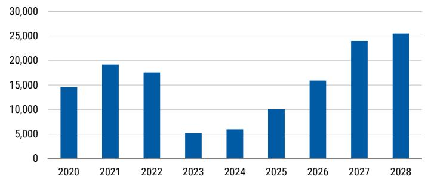

bar chart

| Year | Value |
|---|---|
| 2020 | 14500 |
| 2021 | 19000 |
| 2022 | 17500 |
| 2023 | 5000 |
| 2024 | 6000 |
| 2025 | 10000 |
| 2026 | 16000 |
| 2027 | 24000 |
| 2028 | 25500 |

Source: TrendForce estimates, MS

## Exhibit 14:

DRAM in the context of the semiconductor cycle – revenue YoY is highly correlated for memory with DRAM at a more advanced stage relative to NAND

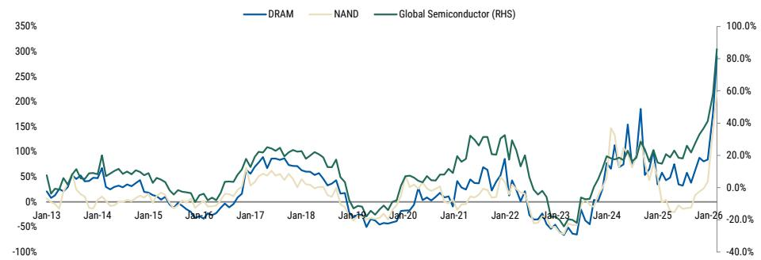

line chart

| Date   | DRAM  | NAND  | Global Semiconductor (RHS) |
|--------|-------|-------|---------------------------|
| Jan-13 | ~0%   | ~0%   | ~50%                      |
| Jan-14 | ~50%  | ~0%   | ~100%                     |
| Jan-15 | ~0%   | ~0%   | ~50%                      |
| Jan-16 | ~0%   | ~0%   | ~0%                       |
| Jan-17 | ~50%  | ~50%  | ~100%                     |
| Jan-18 | ~100% | ~100% | ~100%                     |
| Jan-19 | ~0%   | ~0%   | ~0%                       |
| Jan-20 | ~50%  | ~50%  | ~50%                      |
| Jan-21 | ~100% | ~100% | ~100%                     |
| Jan-22 | ~50%  | ~50%  | ~50%                      |
| Jan-23 | ~-50% | ~-50% | ~-50%                     |
| Jan-24 | ~150% | ~150% | ~150%                     |
| Jan-25 | ~100% | ~100% | ~100%                     |
| Jan-26 | ~300% | ~300% | ~300%                     |

Source: SIA

## Revising up the bear case

With the visibility of the persistent shortage in 2027 becoming clear, we revise up our bear case scenarios to assume a downcycle in 2028, instead of going back to a downcycle with 1x P/B in our original assumption. For our bear cases, we assume the commodity memory pricing will face -30-50% YoY decrease due to a pause in AI capex or the industry supply catching up faster than expected. Over the long-term, we assumed that margin for HBM will decrease to \~40% due to market competition, DRAM margin will go back to 20-30% and NAND margin will normalize in the low teens% as in the previous cycle.

As such, our new bear case valuations on residual income models are W1.1mn for SK hynix, implying 2.4x 27e P/E and W190,000 for Samsung Electronics (005930.KS) and W152,000 for Samsung Electronics preferred shares (005935.KS), implying 3.1x 27e P/E.

## Risk Reward – SK hynix (000660.KS)

Robust commodity super-cycle supported by AI in 2026

## PRICE TARGET W2,600,000

Base case, residual income valuation model. We assume a cost of equity of 11.5% (5% risk-free rate, 6.5% risk premium, 1.0 beta) and a terminal growth rate of 3%.

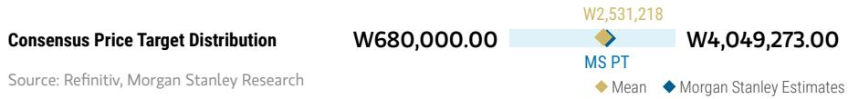

bar-line hybrid chart

| Category | Value     |
| -------- | --------- |
| W2,531,218 | 680,000.00 |
| W4,049,273.00 | 4,049,273.00 |

RISK REWARD CHART  
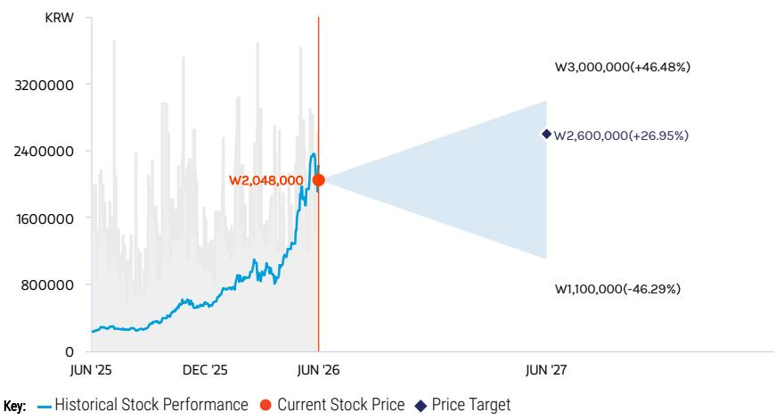

line chart

| Date     | Historical Stock Performance | Current Stock Price | Price Target |
| -------- | ----------------------------- | ------------------- | ------------ |
| JUN '25  | ~50,000                       | -                   | -            |
| DEC '25  | ~700,000                      | -                   | -            |
| JUN '26  | ~2,048,000                    | -                   | -            |
| JUN '27  | -                             | -                   | W3,000,000   |
| -        | -                             | -                   | W2,600,000   |
| -        | -                             | -                   | W1,100,000   |

Source: Refinitiv, MS

## OVERWEIGHT THESIS

■ We believe the commodity cycle is likely to stay robust in 2026 and into 2027, thanks to AI inference demand growth.  
- Our earnings estimates reflect downside protection from LTAs nto 2028, stronger commodity pricing assumptions, and stronger HBM pricing reset in 2027.  
■ We do not think this is the time to rotate out of outperformers such as SK hynix.  
- Our sensitivity analysis suggests that the market is not yet assigning any meaningful P/E premium to the company's LTA-backed memory earnings and FCF.

Consensus Rating Distribution  
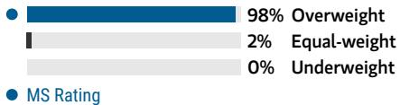

bar chart

| Category       | Value |
| -------------- | ----- |
| Overweight     | 98%   |
| Equal-weight   | 2%    |
| Underweight    | 0%    |

Source: Refinitiv, MS

Risk Reward Themes

<table><tr><td>Pricing Power:</td><td>Positive</td></tr><tr><td>Secular Growth:</td><td>Positive</td></tr><tr><td>Self-help:</td><td>Positive</td></tr></table>

View descriptions of Risk Rewards Themes here

## BULL CASE

## W3,000,000

## Memory TAM grows; AI HBM leadership is extended

We see a stronger-than-expected commodity cycle for DRAM and NAND, supported by AI inference demand moving into 2027. Our bull scenario valuation implies 6.7x 2027e P/E.

## BASE CASE

## W2,600,000

## Commodity up-cycle

We see a stronger-than-expected commodity cycle for DRAM and NAND, supported by AI inference demand in 2026 and into 2027. HBM competition risks remain but are being increasingly recognized by the market. Our price target implies 5.7x 2027e P/E, underpinned by Hynix's leadership in HBM and a sharp rebound in commodity memory pricing.

## BEAR CASE

## W1,100,000

## 2028 down cycle

We assume a period of AI computing digestion in 2028, leading to more aggressive margin erosion for the HBM segment owing to competitors' aggressive capacity expansion and pricing competition, as well as faster DRAM pricing drops with muted demand recovery. Our bear case valuation implies 2.4x 2027e P/B.

## Risk Reward – SK hynix (000660.KS)

KEY EARNINGS INPUTS

<table><tr><td>Drivers</td><td>2025</td><td>2026e</td><td>2027e</td><td>2028e</td></tr><tr><td>Revenue Growth (%)</td><td>125.9</td><td>679.1</td><td>1,472.8</td><td>785.3</td></tr><tr><td>OPM (%)</td><td>48.6</td><td>80.0</td><td>81.5</td><td>78.7</td></tr><tr><td>CAPEX (%)</td><td>(2,840,890.0)</td><td>(6,257,430.9)</td><td>(7,730,302.6)</td><td>(8,790,428.5)</td></tr></table>

## INVESTMENT DRIVERS

• Supply and demand outlook for DRAM, NAND, and HBM  
- Global demand for data center products (server DRAM, enterprise SSD)

## GLOBAL REVENUE EXPOSURE

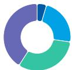

0-10% Europe ex UK  
20-30% Mainland China  
30-40% APAC, ex Japan, Mainland China and India  
40-50% North America

Source: MS Estimate View explanation of regional hierarchies here

## MS ALPHA MODELS

1/5 MOST

3 Month Horizon

Source: Refinitiv, FactSet, MS; 1 is the highest favored Quintile and 5 is the least favored Quintile

## RISKS TO PT/RATING

## RISKS TO UPSIDE

• ASP growth re-acceleration  
• Preemptive production cuts or disruption  
- Sharp demand improvements  
• Significant increase in capital returns

## RISKS TO DOWNSIDE

• End demand turning weaker than expected  
- Rising competition for DDR5, causing overspending on the supply side.  
- Inventories remaining elevated at cloud and Chinese smartphone customers.

## OWNERSHIP POSITIONING

Inst. Owners, % Active

78.6%

Source: Refinitiv, MS

## MS ESTIMATES VS. CONSENSUS

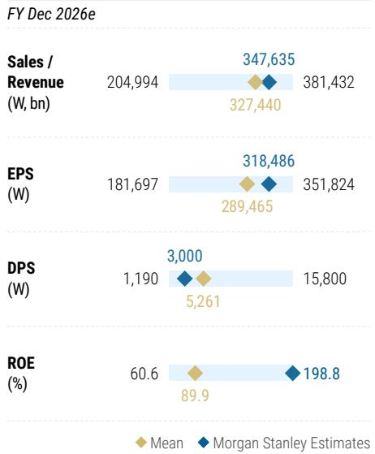

bar-line hybrid chart

FY Dec 2026e
| Metric | Mean (W bn) | MS Estimates (W bn) | Median (W bn) |
| :--- | :--- | :--- | :--- |
| Sales / Revenue | 204,994 | 347,635 | 381,432 |
| EPS (W) | 181,697 | 318,486 | 351,824 |
| DPS (W) | 1,190 | 3,000 | 15,800 |
| ROE (%) | 60.6 | 89.9 | 198.8 |

Source: Refinitiv, MS

## Risk Reward – Samsung Electronics (005930.KS)

Top Pick

Improvement in HBM + commodity up-cycle = stock re-rating

## PRICE TARGET W381,000

Our base case price target is derived from our residual income valuation model. At our price target, the 2027e P/B multiple would be c.2x, in line with the stock's commodity cycle peak of 2.0x. We assume an 11.5% cost of equity, based on a beta of 1.0, and our terminal growth rate assumption is 3%.

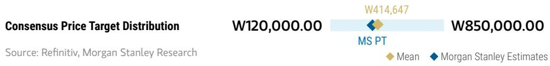

bar-line hybrid chart

| Consensus Price Target | Value     |
| ----------------------- | --------- |
| W120,000.00             | W120,000.00 |
| W414,647                | W414,647   |
| W850,000.00             | W850,000.00 |

RISK REWARD CHART  
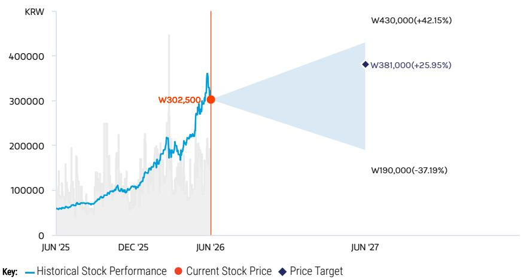

line chart

| Date     | Historical Stock Performance | Current Stock Price | Price Target |
| -------- | ----------------------------- | ------------------- | ------------ |
| JUN '25  | ~60,000                       | -                   | -            |
| DEC '25  | ~100,000                      | -                   | -            |
| JUN '26  | W302,500                       | W302,500            | -            |
| JUN '27  | -                             | W430,000(+42.15%)   | W381,000(+25.95%) |
| W190,000 | -                             | -                   | -            |

Source: Refinitiv, MS

## OVERWEIGHT THESIS

■ We expect pricing to move well beyond historical mean reversion from here, on a price per gigabit basis, which should create further incremental tailwinds to forecasts for 2026-27. The commodity cycle is better than feared thanks to AI inference demand.  
■ We expect HBM improvement and potential market share gains from 2026.  
■ Rising prices and falling inventories, along with supply cuts and improving demand, are positives for margin recovery in the memory business.  
■ The implied 2027e P/B at our price target is 2x, aligning with the stock's commodity cycle peak of 2.0x.

Consensus Rating Distribution  
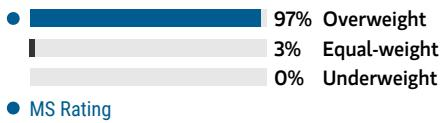

bar chart

| Category     | Value |
| ------------ | ----- |
| Overweight   | 97%   |
| Equal-weight | 3%    |
| Underweight  | 0%    |

Source: Refinitiv, MS

## Risk Reward Themes

Secular Growth: Positive
Self-help: Positive

View descriptions of Risk Rewards Themes here

## BULL CASE

## W430,000

## HPC drives sustained memory pricing

High-performance computing drives sustained memory pricing strength and capital returns exceed expectations: We assume continued robust demand growth for memory and OLED with stabilization in the macro environment and China's failure to successfully enter the memory semiconductor industry. Our bull case valuation is based 14x HBM, 5x conventional memory and 10x P/E for the rest of the group profitability.

## BASE CASE

## W381,000

## Commodity cycle recovery

We expect favorable commodity pricing trends to bode well for Samsung's share price with improving HBM market share and new product execution. Our base case reflects our relatively conservative view on HBM progress this year, but sequential improvement in 2026 and beyond support Samsung's earnings growth and stock re-rating amid low expectations. 2027e implied P/B at c.2x.

## BEAR CASE

## W190,000

## Slower memory consumption, competition from China

We assume a period of AI computing digestion in 2028, leading to more aggressive margin erosion for the HBM segment owing to competitors' aggressive capacity expansion and pricing competition, as well as faster DRAM pricing drops with muted demand recovery. Our bear case valuation implies 3.1x 2027e P/B.

## Risk Reward – Samsung Electronics (005930.KS)

KEY EARNINGS INPUTS

<table><tr><td>Drivers</td><td>2025</td><td>2026e</td><td>2027e</td><td>2028e</td></tr><tr><td>Revenue Growth (%)</td><td>10.9</td><td>120.8</td><td>39.2</td><td>6.3</td></tr><tr><td>OPM (%)</td><td>13.1</td><td>57.3</td><td>62.5</td><td>58.7</td></tr><tr><td>CAPEX (%)</td><td>(4,730,271.0)</td><td>(14,538,562.3)</td><td>(13,759,464.7)</td><td>(13,426,163.4)</td></tr></table>

## INVESTMENT DRIVERS

• Supply-demand outlook for memory and OLED  
• Smartphone market share and margins  
• Capital returns of 50% FCF

## GLOBAL REVENUE EXPOSURE

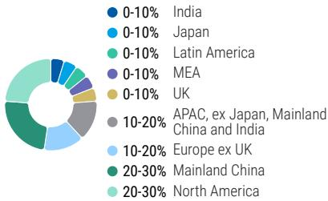

0-10% India  
0-10% Japan  
0-10% Latin America  
0-10% MEA  
0-10% UK  
● 10-20% APAC, ex Japan, Mainland China and India  
10-20% Europe ex UK  
20-30% Mainland China  
20-30% North America

Source: MS Estimate View explanation of regional hierarchies here

## MS ALPHA MODELS

1/5

MOST

3 Month

Horizon

Source: Refinitiv, FactSet, MS; 1 is the highest favored Quintile and 5 is the least favored Quintile

## RISKS TO PT/RATING

## RISKS TO UPSIDE

- New technological developments, especially in memory and foldable displays  
- Longer-lasting memory up-cycle from AI and hyperscale data center growth

## RISKS TO DOWNSIDE

- Product and memory cycle, including Apple and new Chinese smartphone competition  
- Earnings growth concentration in semiconductors

## OWNERSHIP POSITIONING

Inst. Owners, % Active

84.1%

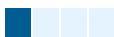

Source: Refinitiv, MS

MS ESTIMATES VS. CONSENSUS  
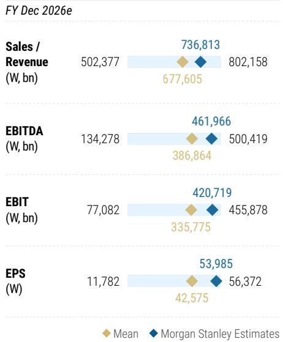

bar-line hybrid chart

FY Dec 2026e
| Metric | FY Dec 2026e (W bn) | Mean | MS Estimates |
| :--- | :--- | :--- | :--- |
| Sales / Revenue | 502,377 | 677,605 | 736,813 |
| EBITDA (W bn) | 134,278 | 386,864 | 461,966 |
| EBIT (W bn) | 77,082 | 335,775 | 420,719 |
| EPS (W) | 11,782 | 42,575 | 53,985 |
| Sales / Revenue (W bn) | 802,158 | 677,605 | 802,158 |
| EBITDA (W bn) | 500,419 | 386,864 | 461,966 |
| EBIT (W bn) | 455,878 | 335,775 | 420,719 |
| EPS (W) | 56,372 | 42,575 | 53,985 |

Source: Refinitiv, MS

## Risk Reward – Samsung Electronics (005935.KS)

Overweight with discount to common shares to narrow

## PRICE TARGET W304,800

Our price target for the preferred shares is based on our PT for the common shares and our assumption that the preferred shares' trade at a 20% discount to the common shares, based on the past 2-year average. We assume an 11.5% cost of equity, based on a beta of 1.0, and our terminal growth rate assumption is 3%.

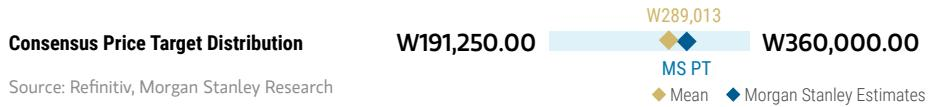

bar-line hybrid chart

| Consensus Price Target Distribution | W191,250.00 | W289,013 | W360,000.00 |
| ----------------------------------- | ----------- | -------- | ----------- |
| MS PT                               |             |          |             |
| Mean                                |             |          |             |
| MS Estimates              |             |          |             |

RISK REWARD CHART  
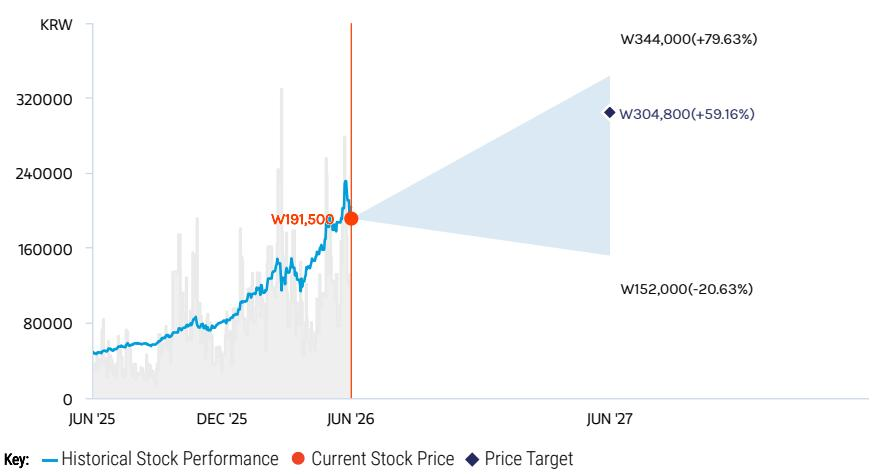

line chart

| Date     | Historical Stock Performance | Current Stock Price | Price Target |
| -------- | ----------------------------- | ------------------- | ------------ |
| JUN '25  | ~70,000                       | -                   | -            |
| DEC '25  | ~80,000                       | -                   | -            |
| JUN '26  | ~191,500                      | W191,500            | -            |
| JUN '27  | -                             | -                   | W344,000     |
| -        | -                             | -                   | W304,800     |

Source: Refinitiv, MS

## OVERWEIGHT THESIS

We expect pricing to move well beyond historical mean reversion from here, on a price per gigabit basis, which should create further incremental tailwinds to forecasts for 2026-27. The commodity cycle is better than feared thanks to AI inference demand.  
■ We expect HBM improvement and potential market share gains from 2026.  
■ Rising prices and falling inventories, along with supply cuts and improving demand, are positives for margin recovery in the memory business.  
■ Common shares' implied 2027e P/E is 5x. We assume that the preferred shares' discount to the common shares is 20% (the past 2-year average).

Consensus Rating Distribution  

bar chart

| Metric       | Value |
| ------------ | ----- |
| Overweight   | 100%  |
| Equal-weight | 0%    |
| Underweight  | 0%    |

Source: Refinitiv, MS

## Risk Reward Themes

Secular Growth: Positive
Self-help: Positive

View descriptions of Risk Rewards Themes here

## BULL CASE

## W344,000

20% discount to bull case value for common shares

High-performance computing drives sustained memory pricing strength and capital returns exceed expectations: We assume continued robust demand growth for memory and OLED with stabilization in the macro environment and China's failure to successfully enter the memory semiconductor industry.

## BASE CASE

## W304,800

20% discount to base case value for common shares

We expect favorable commodity pricing trends to bode well for Samsung's share price with improving HBM market share and new product execution. Our base case reflects our optimistic view on commodity upcycle and stock re-rating with LTA to potentially smooth the cyclicality of memory sector.

## BEAR CASE

## W152,000

20% discount to bear case value for common shares

We assume a period of AI computing digestion in 2028, leading to more aggressive margin erosion for the HBM segment owing to competitors' aggressive capacity expansion and pricing competition, as well as faster DRAM pricing drops with muted demand recovery. Our bear case valuation implies 3.1x 2027e P/B.

## Risk Reward – Samsung Electronics (005935.KS)

KEY EARNINGS INPUTS

<table><tr><td>Drivers</td><td>2025</td><td>2026e</td><td>2027e</td><td>2028e</td></tr><tr><td>Revenue Growth (%)</td><td>10.9</td><td>120.8</td><td>39.2</td><td>6.3</td></tr><tr><td>OPM (%)</td><td>13.1</td><td>57.3</td><td>62.5</td><td>58.7</td></tr><tr><td>CAPEX (%)</td><td>(4,730,271.0)</td><td>(14,538,562.3)</td><td>(13,759,464.7)</td><td>(13,426,163.4)</td></tr></table>

## INVESTMENT DRIVERS

• Supply-demand outlook for memory and OLED  
• Smartphone market share and margins  
• Capital returns of 50% FCF

## GLOBAL REVENUE EXPOSURE

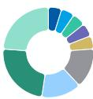

0-10% India  
0-10% Japan  
0-10% Latin America  
0-10% MEA  
0-10% UK  
● 10-20% APAC, ex Japan, Mainland China and India  
10-20% Europe ex UK  
20-30% Mainland China  
20-30% North America

Source: MS Estimate View explanation of regional hierarchies here

## MS ALPHA MODELS

1/5

MOST

3 Month

Horizon

Source: Refinitiv, FactSet, MS; 1 is the highest favored Quintile and 5 is the least favored Quintile

## RISKS TO PT/RATING

## RISKS TO UPSIDE

- New technology developments, especially in memory and foldable displays  
- Longer-lasting memory up-cycle from AI and hyperscale data center growth  
• Further narrowing of discount to common shares

## RISKS TO DOWNSIDE

- Product and memory cycle, including Apple and new Chinese smartphone competition  
- Earnings growth concentration in semiconductors  
- Deepening of discount to common shares

## OWNERSHIP POSITIONING

Inst. Owners, % Active

75.3%

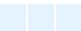

Source: Refinitiv, MS

## MS ESTIMATES VS. CONSENSUS

FY Dec 2026e

## EPS

(W)

◆ 53,985

Note: There are not sufficient brokers supplying consensus data for this metric

Mean

♦ MS Estimates

Source: Refinitiv, MS

## Risk Reward Reference links

1. View explanation of Options Probabilities methodology -  
Options\_Probabilities\_Exhibit\_Link.pdf  
2. View descriptions of Risk Rewards Themes - RR\_Themes\_Exhibit\_Link.pdf  
3. View explanation of regional hierarchies - GEG\_Exhibit\_Link.pdf  
4. View explanation of Theme/Exposure methodology -  
ESG\_Sustainable\_Solutions\_External\_Link.pdf  
5. View explanation of HERS methodology - ESG\_HERS\_External\_Link.pdf

## Disclosure Section

The information and opinions in MS were prepared or are disseminated by MS Asia Limited (which accepts the responsibility for its contents) and/or MS Asia (Singapore) Pte. (Registration number 199206298Z) and/or MS Asia (Singapore) Securities Pte Ltd (Registration number 200008434H), regulated by the Monetary Authority of Singapore (which accepts legal responsibility for its contents and should be contacted with respect to any matters arising from, or in connection with, MS), and/or MS Taiwan Limited and/or MS & Co International plc, Seoul Branch, and/or MS Australia Limited (A.B.N. 67 003 734 576, holder of Australian financial services license No. 233742, which accepts responsibility for its contents), and/or MS Wealth Management Australia Pty Ltd (A.B.N. 19 009 145 555, holder of Australian financial services license No. 240813, which accepts responsibility for its contents), and/or MS India Company Private Limited having Corporate Identification No (CIN) U22990MH1998PTC115305, regulated by the Securities and Exchange Board of India ("SEBI") and holder of licenses as a Research Analyst (SEBI Registration No. INH000001105); Stock Broker (SEBI Stock Broker Registration No. INZ000244438), Merchant Banker (SEBI Registration No. INM000011203), and depository participant with National Securities Depository Limited (SEBI Registration No. IN-DP-NSDL-567-2021) having registered office at Altimus, Level 39 & 40, Pandurang Budhkar Marg, Worli, Mumbai 400018, India; Telephone no. +91-22-61181000; Compliance Officer Details: Mr. Tejarshi Hardas, Tel. No.: +91-22-61181000 or Email: tejarshi.hardas@morganstanley.com; Grievance officer details: Mr. Tejarshi Hardas, Tel. No.: +91-22-61181000 or Email: msic-compliance@morganstanley.com which accepts the responsibility for its contents and should be contacted with respect to any matters arising from, or in connection with, MS, and their affiliates (collectively, "MS"). MS India Company Private Limited (MSICPL) may use AI tools in providing research services. All recommendations contained herein are made by the duly qualified research analysts.

For important disclosures, stock price charts and equity rating histories regarding companies that are the subject of this report, please see the MS Disclosure Website at www.morganstanley.com/eqr/disclosures/webapp/generalresearch, or contact your investment representative or MS at 1585 Broadway, (Attention: Research Management), New York, NY, 10036 USA.

For valuation methodology and risks associated with any recommendation, rating or price target referenced in this research report, please contact the Client Support Team as follows: US/Canada +1 800 303-2495; Hong Kong +852 2848-5999; Latin America +1 718 754-5444 (U.S.); London +44 (0)20-7425-8169; Singapore +65 6834-6860; Sydney +61 (0)2-9770-1505; Tokyo +81 (0)3-6836-9000. Alternatively you may contact your investment representative or MS at 1585 Broadway, (Attention: Research Management), New York, NY 10036 USA.

## Analyst Certification

The following analysts hereby certify that their views about the companies and their securities discussed in this report are accurately expressed and that they have not received and will not receive direct or indirect compensation in exchange for expressing specific recommendations or views in this report: Cindy Huang; Ryan Kim; Shawn Kim; Duan Liu.

## Global Research Conflict Management Policy

MS has been published in accordance with our conflict management policy, which is available at www.morganstanley.com/institutional/research/conflictpolicies. A Portuguese version of the policy can be found at www.morganstanley.com.br

## Important Regulatory Disclosures on Subject Companies

As of May 29, 2026, MS beneficially owned 1% or more of a class of common equity securities of the following companies covered in MS: SK hynix.

Within the last 12 months, MS managed or co-managed a public offering (or 144A offering) of securities of Samsung Electronics, SK hynix.

Within the last 12 months, MS has received compensation for investment banking services from SK hynix.

In the next 3 months, MS expects to receive or intends to seek compensation for investment banking services from Samsung Electronics, SK hynix.

Within the last 12 months, MS has provided or is providing investment banking services to, or has an investment banking client relationship with, the following company: Samsung Electronics, SK hynix.

The equity research analysts or strategists principally responsible for the preparation of MS have received compensation based upon various factors, including quality of research, investor client feedback, stock picking, competitive factors, firm revenues and overall investment banking revenues. Equity Research analysts' or strategists' compensation is not linked to investment banking or capital markets transactions performed by MS or the profitability or revenues of particular trading desks.

MS and its affiliates do business that relates to companies/instruments covered in MS, including market making, providing liquidity, fund management, commercial banking, extension of credit, investment services and investment banking. MS sells to and buys from customers the securities/instruments of companies covered in MS on a principal basis. MS may have a position in the debt of the Company or instruments discussed in this report. MS trades or may trade as principal in the debt securities (or in related derivatives) that are the subject of the debt research report.

Certain disclosures listed above are also for compliance with applicable regulations in non-US jurisdictions.

## STOCK RATINGS

MS uses a relative rating system using terms such as Overweight, Equal-weight, Not-Rated or Underweight (see definitions below). MS does not assign ratings of Buy, Hold or Sell to the stocks we cover. Overweight, Equal-weight, Not-Rated and Underweight are not the equivalent of buy, hold and sell. Investors should carefully read the definitions of all ratings used in MS. In addition, since MS contains more complete information concerning the analyst's views, investors should carefully read MS, in its entirety, and not infer the contents from the rating alone. In any case, ratings (or research) should not be used or relied upon as investment advice. An investor's decision to buy or sell a stock should depend on individual circumstances (such as the investor's existing holdings) and other considerations.

## Global Stock Ratings Distribution

(as of May 31, 2026)

The Stock Ratings described below apply to MS's Fundamental Equity Research and do not apply to Debt Research produced by the Firm.

For disclosure purposes only (in accordance with FINRA requirements), we include the category headings of Buy, Hold, and Sell alongside our ratings of Overweight, Equal-weight, Not-Rated and Underweight. MS does not assign ratings of Buy, Hold or Sell to the stocks we cover. Overweight, Equal-weight, Not-Rated and Underweight are not the equivalent of buy, hold, and sell but represent recommended relative weightings (see definitions below). To satisfy regulatory requirements, we correspond Overweight, our most positive stock rating, with a buy recommendation; we correspond Equal-weight and Not-Rated to hold and Underweight to sell recommendations, respectively.

<table><tr><td></td><td colspan="2">Coverage Universe</td><td colspan="3">Investment Banking Clients (IBC)</td><td colspan="2">Other Material Investment ServicesClients (MISC)</td></tr><tr><td>Stock RatingCategory</td><td>Count</td><td>% of Total</td><td>Count</td><td>% of Total IBC</td><td>% of RatingCategory</td><td>Count</td><td>% of Total OtherMISC</td></tr><tr><td>Overweight/Buy</td><td>1542</td><td>42%</td><td>465</td><td>51%</td><td>30%</td><td>707</td><td>43%</td></tr><tr><td>Equal-weight/Hold</td><td>1571</td><td>43%</td><td>369</td><td>40%</td><td>23%</td><td>723</td><td>44%</td></tr><tr><td>Not-Rated/Hold</td><td>3</td><td>0%</td><td>0</td><td>0%</td><td>0%</td><td>1</td><td>0%</td></tr><tr><td>Underweight/Sell</td><td>551</td><td>15%</td><td>86</td><td>9%</td><td>16%</td><td>201</td><td>12%</td></tr><tr><td>Total</td><td>3,667</td><td></td><td>920</td><td></td><td></td><td>1632</td><td></td></tr></table>

Data include common stock and ADRs currently assigned ratings. Investment Banking Clients are companies from whom MS received investment banking compensation in the last 12 months. Due to rounding off of decimals, the percentages provided in the "% of total" column may not add up to exactly 100 percent.

## Analyst Stock Ratings

Overweight (O). The stock's total return is expected to exceed the average total return of the analyst's industry (or industry team's) coverage universe, on a risk-adjusted basis, over the next 12-18 months.

Equal-weight (E). The stock's total return is expected to be in line with the average total return of the analyst's industry (or industry team's) coverage universe, on a risk-adjusted basis, over the next 12-18 months.

Not-Rated (NR). Currently the analyst does not have adequate conviction about the stock's total return relative to the average total return of the analyst's industry (or industry team's) coverage universe, on a risk-adjusted basis, over the next 12-18 months.

Underweight (U). The stock's total return is expected to be below the average total return of the analyst's industry (or industry team's) coverage universe, on a risk-adjusted basis, over the next 12-18 months.

Unless otherwise specified, the time frame for price targets included in MS is 12 to 18 months.

## Analyst Industry Views

Attractive (A): The analyst expects the performance of his or her industry coverage universe over the next 12-18 months to be attractive vs. the relevant broad market benchmark, as indicated below.

In-Line (I): The analyst expects the performance of his or her industry coverage universe over the next 12-18 months to be in line with the relevant broad market benchmark, as indicated below. Cautious (C): The analyst views the performance of his or her industry coverage universe over the next 12-18 months with caution vs. the relevant broad market benchmark, as indicated below. Benchmarks for each region are as follows: North America - S&P 500; Latin America - relevant MSCI country index or MSCI Latin America Index; Europe - MSCI Europe; Japan - TOPIX; Asia - relevant MSCI country index or MSCI sub-regional index or MSCI AC Asia Pacific ex Japan Index.

Stock Price, Price Target and Rating History (See Rating Definitions)

Samsung Electronics (005930.KS) - As of 06/10/26 GMT in KRW Industry : S. Korea Technology  

line chart

| Date       | Value   |
| ---------- | ------- |
| 06/01 2023 | 90000   |
| 06/01 2023 | 95000   |
| 06/01 2023 | 101000  |
| 06/01 2023 | 105000  |
| 06/01 2023 | 76000   |
| 06/01 2023 | 65000   |
| 06/01 2023 | 70000   |
| 06/01 2023 | 86000   |
| 06/01 2023 | 97000   |
| 06/01 2023 | 111000  |
| 06/01 2023 | 139000  |
| 06/01 2023 | 144000  |
| 06/01 2023 | 170000  |
| 06/01 2023 | 210000  |
| 06/01 2023 | 248000  |
| 06/01 2023 | 251000  |
| 06/01 2023 | 381000  |
| 06/01 2023 | 362000  |

Stock Rating History: 6/1/21 : 0/A; 7/19/21 : 0/I; 8/12/21 : 0/C; 10/4/22 : 0/A; 7/21/24 : 0/I; 9/15/24 : 0/C; 6/13/25 : 0/I; 9/21/25 : 0/A  
Price Target History: 5/18/21 : 93000; 6/8/21 : 98000; 8/12/21 : 89000; 9/15/21 : 95000; 12/3/21 : 97000; 3/18/22 : 95000;  
4/28/22 : 85000; 6/10/22 : 80000; 7/5/22 : 75000; 7/22/22 : 70000; 9/17/22 : 68000; 3/21/23 : 70000; 5/30/23 : 90000; 7/7/23 : 95000;  
3/22/24 : 97000; 4/16/24 : 101000; 6/6/24 : 105000; 9/15/24 : 76000; 12/18/24 : 65000; 3/19/25 : 70000; 8/1/25 : 86000;  
9/21/25 : 97000; 10/8/25 : 111000; 10/23/25 : 120000; 10/30/25 : 139000; 11/5/25 : 144000; 1/8/26 : 170000; 1/30/26 : 210000;  
2/24/26 : 248000; 3/18/26 : 251000; 4/19/26 : 362000; 5/6/26 : 381000  
Source: MS Date Format : MM/DD/YY Price Target No Price Target Assigned (NA)  
Stock Price (Not Covered by Current Analyst) — Stock Price (Covered by Current Analyst)  
Stock and Industry Ratings (abbreviations below) appear as ♦ Stock Rating/Industry View  
Stock Ratings: Overweight (O) Equal-weight (E) Underweight (U) Not-Rated (NR) No Rating Available (NA)  
Industry View: Attractive (A) In-line (I) Cautious (C) No Rating (NR)  
Effective January 13, 2014, the stocks covered by MS Asia Pacific will be rated relative to the analyst's industry (or industry team's) coverage.  
Effective January 13, 2014, the industry view benchmarks for MS Asia Pacific are as follows: relevant MSCI country index or MSCI sub-regional index or MSCI AC Asia Pacific ex Japan Index.

Samsung Electronics (005935.KS) - As of 06/10/26 GMT in KRW Industry : S. Korea Technology  
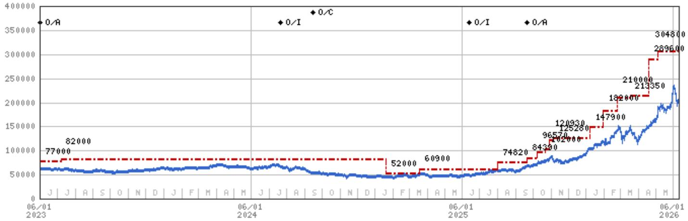

line chart

| Date       | Value   |
| ---------- | ------- |
| 06/01 2023 | 77000   |
| 06/01 2024 | 82000   |
| 06/01 2025 | 52000   |
| 06/01 2026 | 304800  |

Stock Rating History: 6/1/21 : 0/A; 7/19/21 : 0/I; 8/12/21 : 0/C; 10/4/22 : 0/A; 7/21/24 : 0/I; 9/15/24 : 0/C; 6/13/25 : 0/I; 9/21/25 : 0/A  
Price Target History: 5/18/21 : 80000; 6/8/21 : 84000; 8/12/21 : 77000; 9/15/21 : 82000; 12/3/21 : 83000; 3/18/22 : 82000;  
4/28/22 : 73000; 6/10/22 : 69000; 7/5/22 : 65000; 7/22/22 : 60000; 9/17/22 : 58000; 3/21/23 : 60000; 5/30/23 : 77000; 7/7/23 : 82000;  
1/20/25 : 52000; 3/19/25 : 60900; 8/1/25 : 74820; 9/21/25 : 84390; 10/8/25 : 96570; 10/23/25 : 102000; 10/30/25 : 120930;  
11/5/25 : 125280; 1/8/26 : 147900; 1/30/26 : 182000; 2/24/26 : 210000; 3/18/26 : 213350; 4/19/26 : 289600; 5/6/26 : 304800  
Source: MS Date Format : MM/DD/YY Price Target No Price Target Assigned (NA)  
Stock Price (Not Covered by Current Analyst) — Stock Price (Covered by Current Analyst)  
Stock and Industry Ratings (abbreviations below) appear as ♦ Stock Rating/Industry View  
Stock Ratings: Overweight (O) Equal-weight (E) Underweight (U) Not-Rated (NR) No Rating Available (NA)  
Industry View: Attractive (A) In-line (I) Cautious (C) No Rating (NR)  
Effective January 13, 2014, the stocks covered by MS Asia Pacific will be rated relative to the analyst's industry (or industry team's) coverage.  
Effective January 13, 2014, the industry view benchmarks for MS Asia Pacific are as follows: relevant MSCI country index or MSCI sub-regional index or MSCI AC Asia Pacific ex Japan Index.

SK hynix (000660.KS) - As of 06/10/26 GMT in KRW Industry : S. Korea Technology  
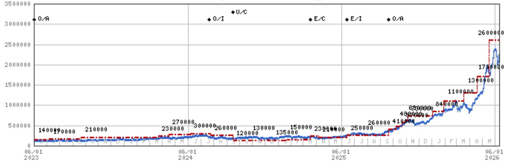

line chart

| Date | Value |
| --- | --- |
| 06/01 2023 | 140000 |
|  | 170000 |
|  | 210000 |
|  | 230000 |
|  | 270000 |
|  | 300000 |
|  | 260000 |
|  | 120000 |
|  | 135000 |
|  | 150000 |
|  | 230000 |
|  | 250000 |
|  | 260000 |
|  | 410000 |
|  | 650000 |
|  | 840000 |
|  | 1100000 |
|  | 1340000 |
|  | 1740000 |
|  | 2600000 |
|  | 26666666666666666666666666666666666666666666666666666666666666666666666666666666666666666666666666666 |

Stock Rating History: 6/1/21 : 0/A; 7/19/21 : 0/I; 8/12/21 : U/C; 12/3/21 : E/C; 2/11/22 : 0/C; 7/22/22 : E/C; 10/4/22 : 0/A;  
7/21/24 : 0/I; 9/15/24 : U/C; 3/19/25 : E/C; 6/13/25 : E/I; 9/21/25 : 0/A  
Price Target History: 5/18/21 : 146000; 6/8/21 : 156000; 8/12/21 : 80000; 9/15/21 : 88000; 12/3/21 : 110000; 12/23/21 : 125000;  
1/24/22 : 130000; 1/28/22 : 136000; 2/11/22 : 155000; 3/18/22 : 150000; 4/27/22 : 130000; 6/10/22 : 120000; 7/5/22 : 110000;  
7/22/22 : 105000; 10/4/22 : 130000; 12/7/22 : 120000; 3/21/23 : 110000; 5/30/23 : 140000; 7/7/23 : 170000; 9/21/23 : 210000;  
3/22/24 : 230000; 4/16/24 : 270000; 6/6/24 : 300000; 7/25/24 : 260000; 9/15/24 : 120000; 10/24/24 : 130000; 12/18/24 : 135000;  
1/20/25 : 150000; 3/19/25 : 230000; 4/7/25 : 210000; 6/13/25 : 250000; 7/24/25 : 260000; 9/21/25 : 410000; 10/8/25 : 480000;  
10/23/25 : 570000; 10/29/25 : 630000; 11/5/25 : 730000; 1/2/26 : 840000; 1/30/26 : 1100000; 3/18/26 : 1300000; 4/19/26 : 1700000;  
5/18/26 : 2600000  
Source: MS Date Format : MM/DD/YY Price Target = No Price Target Assigned (NA)  
Stock Price (Not Covered by Current Analyst) — Stock Price (Covered by Current Analyst)  
Stock and Industry Ratings (abbreviations below) appear as ♦ Stock Rating/Industry View  
Stock Ratings: Overweight (O) Equal-weight (E) Underweight (U) Not-Rated (NR) No Rating Available (NA)  
Industry View: Attractive (A) In-line (I) Cautious (C) No Rating (NR)  
Effective January 13, 2014, the stocks covered by MS Asia Pacific will be rated relative to the analyst's industry (or industry team's) coverage.  
Effective January 13, 2014, the industry view benchmarks for MS Asia Pacific are as follows: relevant MSCI country index or MSCI sub-regional index or MSCI AC Asia Pacific ex Japan Index.

## Important Disclosures for MS Smith Barney LLC Customers

Important disclosures regarding any material conflict of interest that can reasonably be expected to have influenced MS Smith Barney LLC's choice of a third-party research provider or the subject company of a third-party research report, are available on the MS Wealth Management disclosure website at www.morganstanley.com/online/researchdisclosures. For MS specific disclosures, you may refer to https://www.morganstanley.com/eqr/disclosures/webapp/generalresearch.

Each MS report is reviewed and approved on behalf of MS Smith Barney LLC. This review and approval is conducted by the same person who reviews the research report on behalf of MS. This could create a conflict of interest.

## Other Important Disclosures

MS policy is to update research reports as and when the Research Analyst and Research Management deem appropriate, based on developments with the issuer, the sector, or the market that may have a material impact on the research views or opinions stated therein. In addition, certain Research publications are intended to be updated on a regular periodic basis (weekly/monthly/quarterly/annual) and will ordinarily be updated with that frequency, unless the Research Analyst and Research Management determine that a different publication schedule is appropriate based on current conditions.

MS is not acting as a municipal advisor and the opinions or views contained herein are not intended to be, and do not constitute, advice within the meaning of Section 975 of the Dodd-Frank Wall Street Reform and Consumer Protection Act.

MS produces an equity research product called a "Tactical Idea." Views contained in a "Tactical Idea" on a particular stock may be contrary to the recommendations or views expressed in research on the same stock. This may be the result of differing time horizons, methodologies, market events, or other factors. For all research available on a particular stock, please contact your sales representative or go to Matrix at http://www.morganstanley.com/matrix.

MS is provided to our clients through our proprietary research portal on Matrix and also distributed electronically by MS to clients. Certain, but not all, MS products are also made available to clients through third-party vendors or redistributed to clients through alternate electronic means as a convenience. For access to all available MS, please contact your sales representative or go to Matrix at http://www.morganstanley.com/matrix.

Any access and/or use of MS is subject to MS's Terms of Use (http://www.morganstanley.com/terms.html). By accessing and/or using MS, you are indicating that you have read and agree to be bound by our Terms of Use (http://www.morganstanley.com/terms.html). In addition you consent to MS processing your personal data and using cookies in accordance with our Privacy Policy and our Global Cookies Policy (http://www.morganstanley.com/privacy\_pledge.html), including for the purposes of setting your preferences and to collect readership data so that we can deliver better and more personalized service and products to you. To find out more information about how MS processes personal data, how we use cookies and how to reject cookies see our Privacy Policy and our Global Cookies Policy (http://www.morganstanley.com/privacy\_pledge.html). Please use the provided link to review the Terms and Conditions and Most Important Terms and Conditions for MS India Company Private Limited (https://www.morganstanley.com/assets/ pdfs/about-us-global-offices/india/Terms\_and\_conditions.pdf) and the following link to review the audit report (https://ny.matrix.ms.com/eqr/research/webapp/researchdocs/MSICPL\_Morgan\_Stanley\_Research\_Audit\_Report.pdf).

If you do not agree to our Terms of Use and/or if you do not wish to provide your consent to MS processing your personal data or using cookies please do not access our research. MS does not provide individually tailored investment advice. MS has been prepared without regard to the circumstances and objectives of those who receive it. MS recommends that investors independently evaluate particular investments and strategies, and encourages investors to seek the advice of a financial adviser. The appropriateness of an investment or strategy will depend on an investor's circumstances and objectives. The securities, instruments, or strategies discussed in MS may not be suitable for all investors, and certain investors may not be eligible to purchase or participate in some or all of them. MS is not an offer to buy or sell or the solicitation of an offer to buy or sell any security/instrument or to participate in any particular trading strategy. The value of and income from your investments may vary because of changes in interest rates, foreign exchange rates, default rates, prepayment rates, securities/instruments prices, market indexes, operational or financial conditions of companies or other factors. There may be time limitations on the exercise of options or other rights in securities/instruments transactions. Past performance is not necessarily a guide to future performance. Estimates of future performance are based on assumptions that may not be realized. If provided, and unless otherwise stated, the closing price on the cover page is that of the primary exchange for the subject company's securities/instruments.

The fixed income research analysts, strategists or economists principally responsible for the preparation of MS have received compensation based upon various factors, including quality, accuracy and value of research, firm profitability or revenues (which include fixed income trading and capital markets profitability or revenues), client feedback and competitive factors. Fixed Income Research analysts', strategists' or economists' compensation is not linked to investment banking or capital markets transactions performed by MS or the profitability or revenues of particular trading desks.

The "Important Regulatory Disclosures on Subject Companies" section in MS lists all companies mentioned where MS owns 1% or more of a class of common equity securities of the companies. For all other companies mentioned in MS, MS may have an investment of less than 1% in securities/instruments or derivatives of securities/instruments of companies and may trade them in ways different from those discussed in MS. Employees of MS not involved in the preparation of MS may have investments in securities/instruments or derivatives of securities/instruments of companies mentioned and may trade them in ways different from those discussed in MS. Derivatives may be issued by MS or associated persons.

With the exception of information regarding MS, MS is based on public information. MS makes every effort to use reliable, comprehensive information, but we make no representation that it is accurate or complete. We have no obligation to tell you when opinions or information in MS change apart from when we intend to discontinue equity research coverage of a subject company. Facts and views presented in MS have not been reviewed by, and may not reflect information known to, professionals in other MS business areas, including investment banking personnel.

MS personnel may participate in company events such as site visits and are generally prohibited from accepting payment by the company of associated expenses unless pre-approved by authorized members of Research management.

MS may make investment decisions that are inconsistent with the recommendations or views in this report.

To our readers based in Taiwan or trading in Taiwan securities/instruments: Information on securities/instruments that trade in Taiwan is distributed by MS Taiwan Limited ("MSTL"). Such information is for your reference only. The reader should independently evaluate the investment risks and is solely responsible for their investment decisions. MS may not be distributed to the public media or quoted or used by the public media without the express written consent of MS. Any non-customer reader within the scope of Article 7-1 of the Taiwan Stock Exchange Recommendation Regulations accessing and/or receiving MS is not permitted to provide MS to any third party (including but not limited to related parties, affiliated companies and any other third parties) or engage in any activities regarding MS which may create or give the appearance of creating a conflict of interest. Information on securities/instruments that do not trade in Taiwan is for informational purposes only and is not to be construed as a recommendation or a solicitation to trade in such securities/instruments. MSTL may not execute transactions for clients in these securities/instruments.

Certain information in MS was sourced by employees of the Shanghai Representative Office of MS Asia Limited for the use of MS Asia Limited. MS is not incorporated under PRC law and the research in relation to this report is conducted outside the PRC. MS does not constitute an offer to sell or the solicitation of an offer to buy any securities in the PRC. PRC investors shall have the relevant qualifications to invest in such securities and shall be responsible for obtaining all relevant approvals, licenses, verifications and/or registrations from the relevant governmental authorities themselves. Neither this report nor any part of it is intended as, or shall constitute, provision of any consultancy or advisory service of securities investment as defined under PRC law. Such information is provided for your reference only.

MS is disseminated in Brazil by MS C.T.V.M. S.A. located at Av. Brigadeiro Faria Lima, 3600, 6th floor, São Paulo - SP, Brazil; and is regulated by the Comissão de Valores Mobiliários; in Mexico by MS México, Casa de Bolsa, S.A. de C.V which is regulated by Comision Nacional Bancaria y de Valores. Paseo de los Tamarindos 90, Torre 1, Col. Bosques de las Lomas Floor 29, 05120 Mexico City; in Japan by MS MUFG Securities Co., Ltd. and, for Commodities related research reports only, MS Capital Group Japan Co., Ltd; in Hong Kong by MS Asia Limited (which accepts responsibility for its contents) and by MS Bank Asia Limited; in Singapore by MS Asia (Singapore) Pte. (Registration number 199206298Z) and/or MS Asia (Singapore) Securities Pte Ltd (Registration number 200008434H), regulated by the Monetary Authority of Singapore (which accepts legal responsibility for its contents and should be contacted with respect to any matters arising from, or in connection with, MS) and by MS Bank Asia Limited, Singapore Branch (Registration number T14FC0118J); in Australia to "wholesale clients" within the meaning of the Australian Corporations Act by MS Australia Limited A.B.N. 67 003 734 576, holder of Australian financial services license No. 233742, which accepts responsibility for its contents; in Australia to "wholesale clients" and "retail clients" within the meaning of the Australian Corporations Act by MS Wealth Management Australia Pty Ltd (A.B.N. 19 009 145 555, holder of Australian financial services license No. 240813, which accepts responsibility for its contents; in Korea by MS & Co International plc, Seoul Branch; in India by MS India Company Private Limited having Corporate Identification No (CIN) U22990MH1998PTC115305, regulated by the Securities and Exchange Board of India ("SEBI") and holder of licenses as a Research Analyst (SEBI Registration No. INH000001105); Stock Broker (SEBI Stock Broker Registration No. INZ000244438), Merchant Banker (SEBI Registration No. INM000011203), and depository participant with National Securities Depository Limited (SEBI Registration No. IN-DP-NSDL-567-2021) having registered office at Altimus, Level 39 & 40, Pandurang Budhkar Marg, Worli, Mumbai 400018, India; Telephone no. +91-22-61181000; Compliance Officer Details: Mr. Tejarshi Hardas, Tel. No.: +91-22-61181000 or Email: tejarshi.hardas@morganstanley.com; Grievance officer details: Mr. Tejarshi Hardas, Tel. No.: +91-22-61181000 or Email: msic-compliance@morganstanley.com. MS India Company Private Limited (MSICPL) may use AI tools in providing research services. All recommendations contained herein are made by the duly qualified research analysts; in Canada by MS Canada Limited; in Germany and the European Economic Area where required by MS Europe S.E., authorised and regulated by Bundesanstalt fuer Finanzdienstleistungsaufsicht (BaFin) under the reference number 149169; in the US by MS & Co. LLC, which accepts responsibility for its contents. MS & Co. International plc, authorized by the Prudential Regulation Authority and regulated by the Financial Conduct Authority and the Prudential Regulation Authority, disseminates in the UK research that it has prepared, and research which has been prepared by any of its affiliates, only to persons who (i) are investment professionals falling within Article 19(5) of the Financial Services and Markets Act 2000 (Financial Promotion) Order 2005 (as amended, the "Order"); (ii) are persons who are high net worth entities falling within Article 49(2)(a) to (d) of the Order; or (iii) are persons to whom an invitation or inducement to engage in investment activity (within the meaning of section

21 of the Financial Services and Markets Act 2000, as amended) may otherwise lawfully be communicated or caused to be communicated. RMB MS Proprietary Limited is a member of the JSE Limited and A2X (Pty) Ltd. RMB MS Proprietary Limited is a joint venture owned equally by MS International Holdings Inc. and RMB Investment Advisory (Proprietary) Limited, which is wholly owned by FirstRand Limited. The information in MS is being disseminated by MS Saudi Arabia, regulated by the Capital Market Authority in the Kingdom of Saudi Arabia, and is directed at Sophisticated investors only.

The information in MS is being communicated by MS & Co. International plc (DIFC Branch), regulated by the Dubai Financial Services Authority (the DFSA) or by MS & Co. International plc (ADGM Branch), regulated by the Financial Services Regulatory Authority Abu Dhabi (the FSRA), and is directed at Professional Clients only, as defined by the DFSA or the FSRA, respectively. The financial products or financial services to which this research relates will only be made available to a customer who we are satisfied meets the regulatory criteria of a Professional Client. A distribution of the different MS Research ratings or recommendations, in percentage terms for Investments in each sector covered, is available upon request from your sales representative.

The information in MS is being communicated by MS & Co. International plc (QFC Branch), regulated by the Qatar Financial Centre Regulatory Authority (the QFCRA), and is directed at business customers and market counterparties only and is not intended for Retail Customers as defined by the QFCRA.

As required by the Capital Markets Board of Turkey, investment information, comments and recommendations stated here, are not within the scope of investment advisory activity. Investment advisory service is provided exclusively to persons based on their risk and income preferences by the authorized firms. Comments and recommendations stated here are general in nature. These opinions may not fit to your financial status, risk and return preferences. For this reason, to make an investment decision by relying solely to this information stated here may not bring about outcomes that fit your expectations.

The following companies do business in countries which are generally subject to comprehensive sanctions programs administered or enforced by the U.S. Department of the Treasury's Office of Foreign Assets Control ("OFAC") and by other countries and multi-national bodies: Samsung Electronics.

The trademarks and service marks contained in MS are the property of their respective owners. Third-party data providers make no warranties or representations relating to the accuracy, completeness, or timeliness of the data they provide and shall not have liability for any damages relating to such data. The Global Industry Classification Standard (GICS) was developed by and is the exclusive property of MSCI and S&P.

MS, or any portion thereof may not be reprinted, sold or redistributed without the written consent of MS.

Indicators and trackers referenced in MS may not be used as, or treated as, a benchmark under Regulation EU 2016/1011, or any other similar framework.

The issuers and/or fixed income products recommended or discussed in certain fixed income research reports may not be continuously followed. Accordingly, investors should regard those fixed income research reports as providing stand-alone analysis and should not expect continuing analysis or additional reports relating to such issuers and/or individual fixed income products. MS may hold, from time to time, material financial and commercial interests regarding the company subject to the Research report.

Registration granted by SEBI and certification from the National Institute of Securities Markets (NISM) in no way guarantee performance of the intermediary or provide any assurance of returns to investors. Investment in securities market are subject to market risks. Read all the related documents carefully before investing.

© 2026 MS