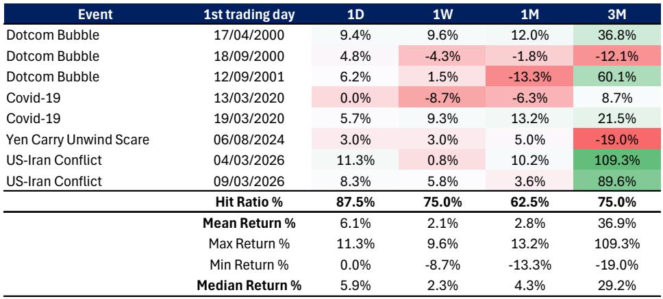
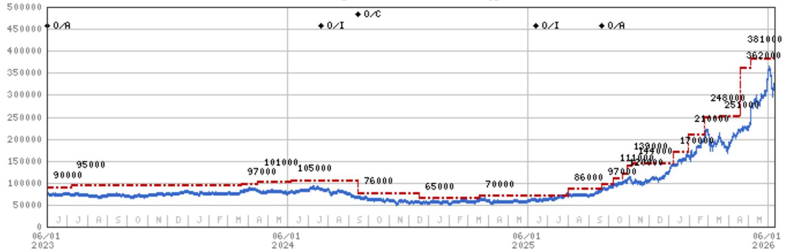

# The Memory Cycle Is Not Over: Why the Correction Signals a Structural Re-Rating, Not a Peak

The recent sell-off in memory stocks is not the beginning of the end for this cycle. It is a healthy reset that clears the path for a more durable and longer-lasting bull market. The market's reflexive fear that a price correction signals a peak cycle is rooted in historical precedent, but that precedent is misleading. This cycle is fundamentally different because the demand driver has shifted from consumer electronics to artificial intelligence infrastructure, and the supply discipline enforced by long-term agreements is unlike anything seen in prior memory booms. The correction, therefore, does not invalidate the thesis; it strengthens it by resetting expectations and creating room for multiple expansion.

The core argument that investors must grapple with is this: the memory cycle is still accelerating, and the earnings revisions that have driven the rally are more sustainable than most believe. The stocks have moved in lockstep with earnings estimates, meaning the price-to-earnings ratio has not expanded. At roughly 5 times forward earnings for the leading memory producers, the market is pricing in a peak-cycle scenario that is at least several quarters away. The real opportunity lies not in chasing further earnings upgrades from current levels, but in the re-rating that will occur as the market recognizes the structural shift in demand and supply dynamics. The correction has set the stage for this re-rating by washing out speculative froth and bringing valuations back to levels that offer substantial upside.

Why now matters is that the market is at an inflection point. The parabolic move in memory stocks from the March lows was unsustainable, driven by leveraged positioning and record crowding. That has been cleared. The fundamental drivers—AI agent demand, tight supply from clean room and EUV constraints, and the growing proportion of supply locked into long-term agreements—remain intact. The question is no longer whether the cycle will continue, but whether the market will re-rate memory stocks to reflect their new structural reality. The answer, based on the math of long-term agreements and the price elasticity of AI demand, is yes.

## The Correction Was Necessary and Does Not Signal a Cycle Peak

The recent sell-off in memory stocks, which saw declines of 10 to 24 percent in a matter of weeks, is not a harbinger of a cyclical downturn. It is a technical correction driven by positioning, not fundamentals. Parabolic charts, record hedge fund crowding, and leveraged ETF exposure created a fragile market structure that was vulnerable to a shock. The trigger—geopolitical tensions and a broader risk-off move—merely provided the excuse for a necessary unwind. Historically, such corrections in the midst of a long bull market are common and often precede the strongest phases of the cycle.

The data on post-circuit breaker dynamics in the Korean market is instructive. After eight such events since 2000, the mean return for Samsung Electronics over the following three months is 37 percent, with a hit rate of 75 percent. This is not a statistical artifact; it reflects the reality that extreme fear creates opportunity when the fundamental thesis remains intact. The current correction has brought valuations for the leading memory producers back to roughly 5 times forward earnings, a level that historically has marked the bottom of the cycle, not the top. The market is pricing in a peak-cycle scenario that is at least several quarters away, given the trajectory of AI demand and the constraints on supply.

The risk is not that the cycle is over, but that the market fails to recognize the structural change in the nature of memory demand. Prior cycles were driven by consumer electronics—PCs and smartphones—where the total addressable market was fixed and demand was largely a function of replacement cycles. AI demand is different. It is tied to the production of intelligence, where more memory capacity means more tokens per second, longer context windows, and more simultaneous users. This is not a fixed pie; it is a rapidly expanding one. The correction has reset expectations and created the conditions for a re-rating as the market comes to terms with this reality.

## Long-Term Agreements Are the Key to a Structural Re-Rating, Not Just a Cyclical Upturn

The most underappreciated development in the memory industry is the proliferation of long-term agreements between memory producers and their customers. These LTAs, which now account for an estimated 70 percent or more of total supply for the next three to five years, fundamentally change the economics of the industry. In prior cycles, memory producers were at the mercy of spot prices, which would collapse as soon as supply caught up with demand. LTAs provide visibility and stability, allowing producers to plan capacity additions with confidence and reducing the risk of the oversupply that has historically ended every cycle.

The implications for valuation are profound. If 70 percent of earnings are locked into LTAs that provide predictable revenue streams, those earnings should be valued at market multiples, not at the depressed multiples that have historically been applied to cyclical memory stocks. The remaining 30 percent of earnings, which are exposed to spot prices, can be valued at the historical peak-cycle multiple. Simple math suggests that this implies a fair value price-to-earnings ratio of 8 to 10 times for the leading memory producers, compared to the current 5 times. This is not a speculative projection; it is a conservative estimate based on the growing share of LTA-covered supply.

The market has not yet priced in this re-rating because it remains anchored to the historical memory cycle playbook. That playbook says that memory stocks are cyclical, that they peak well before the cycle turns, and that they should be sold into strength. But the playbook was written for a world where demand was driven by consumer electronics and supply was undisciplined. In the current world, demand is structural and supply is constrained by the physical realities of building clean rooms and acquiring EUV lithography equipment. The LTAs represent a structural change in the industry's business model, and the market is slow to recognize it. The correction has created an opportunity to buy into this re-rating before it happens.

## AI Demand Is Price-Elastic in a Way That Consumer Demand Never Was

A common concern among investors is that memory prices will eventually decline as new capacity comes online, and that this will end the cycle. This concern is valid but incomplete. Memory prices will indeed decline, but the nature of AI demand means that lower prices will create new demand rather than simply compressing margins. This is the price elasticity of AI demand, and it is fundamentally different from the price elasticity of consumer electronics demand.

When DRAM prices fall, the cost of running AI inference declines. This makes it economically viable to deploy AI in a wider range of applications, from edge devices to enterprise workloads. It also makes it feasible to use larger models with longer context windows, which in turn require more memory. The result is a virtuous cycle: lower prices expand the addressable market, which increases demand, which absorbs the new supply. This is not a theoretical possibility; it is already happening. The explosion in AI agent usage following the launch of OpenClaw in January 2026 has driven a step-change in token generation, and this is just the beginning.

The historical pattern of memory cycles was that demand was largely inelastic to price. A lower price for DRAM did not cause consumers to buy more PCs or smartphones; it simply meant that manufacturers enjoyed higher margins. AI demand is different because memory is not a finished good; it is an input to the production of intelligence. Lower input costs mean more intelligence can be produced at the same cost, which drives adoption and usage. This creates a natural demand floor that did not exist in prior cycles. The market has not yet fully priced in this structural shift, and the correction provides an opportunity to do so.

## The Unanswered Question: How Much of the Current Demand Is Sustainable?

For all the structural optimism, there is one question that the report does not fully answer: how much of the current AI-driven demand is sustainable, and how much is a temporary distortion caused by the frenzy around agentic AI? The explosion in token generation following the launch of OpenClaw is impressive, but it is not clear how much of this represents genuine, durable demand versus speculative overbuilding by hyperscalers who are racing to capture market share.

The report draws an analogy to the dot-com era, noting that the NASDAQ rose 149 percent in the four years after Netscape Navigator launched, and then another 86 percent in the fifth year before peaking. The peak was driven by a slowdown in the rate of change of internet traffic growth, which was not reflected in valuations. The same risk exists today. If the rate of change in AI token generation or model usage begins to decelerate, the market could reprice memory stocks sharply, even if absolute demand continues to grow.

The distinction between base demand and speculative distortion is critical, and it is not yet resolvable. The report acknowledges this by highlighting the risk of a technical breakthrough that would use significantly less memory, or a change that would bypass memory altogether. These are real risks, but they are not imminent. For now, the evidence points to accelerating demand, and the correction has created a favorable entry point for investors who are willing to accept the uncertainty. The full report provides the detailed charts and data that allow investors to make their own assessment of this risk.

## A Decision Framework for Navigating the Memory Cycle

For investors who are considering whether to act on this thesis, the following framework provides a structured approach. First, assess the trajectory of AI demand by monitoring the annualized run rate of enterprise API contracts and the adoption of agentic coding tools. These are leading indicators that will signal whether the rate of change in demand is accelerating or decelerating. Second, track the proportion of supply covered by LTAs. As this share increases, the case for a structural re-rating strengthens. Third, monitor the liquidity environment. The report notes that liquidity tends to lead equity markets by approximately three months, and the current tightening in liquidity is a near-term risk that must be weighed against the long-term opportunity.

The decision to invest in memory stocks at current levels hinges on the investor's time horizon and risk tolerance. For a short-term trader, the correction may not have fully played out, and further volatility is possible. For a long-term investor, the current valuations offer a compelling entry point into a structural shift that is still in its early stages. The key is to avoid the trap of anchoring to historical cycles and to recognize that this cycle is different. The report provides the analytical framework for making that judgment, but the ultimate decision rests on the investor's conviction in the AI thesis.

The most important insight from the report is that the bear case for memory stocks has been substantially revised upward. This is not a sign that the risks have diminished; it is a sign that the floor has risen. Even in a pessimistic scenario, the leading memory producers are worth significantly more than the market currently prices them. This asymmetry—limited downside relative to the revised bear case, and substantial upside if the bull case materializes—is the defining characteristic of the current opportunity.

Join the community to read the full report and review the original charts that support this analysis, including the detailed breakdown of LTA coverage, the historical cycle comparisons, and the bull and bear case valuations for the leading memory producers.

*This article is for learning and discussion only and does not constitute investment advice.*

Personal reading notes and learning share only. Not investment advice.

