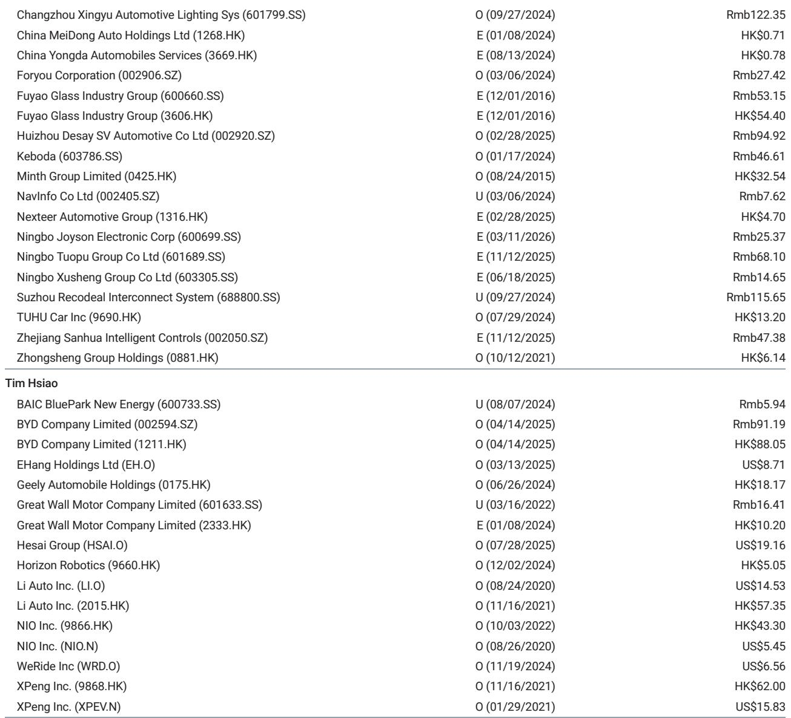
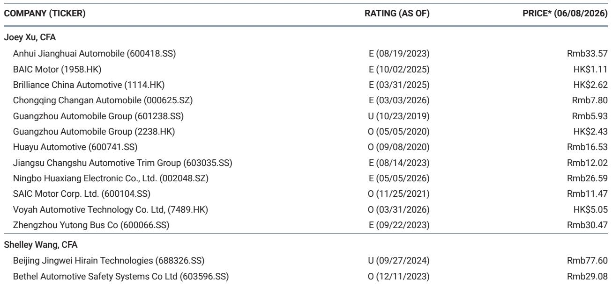

# China EV Orders Are Slowing, But the Real Story Is About What Comes Next in the Product Cycle

The headline numbers from the first week of June tell a seemingly straightforward story: China's electric vehicle majors saw a broad-based decline in weekly order intake. BYD dropped 10% week-over-week. NIO fell 72%. XPeng fell 49%. HIMA fell 58%. Even Tesla China slipped 10%. For an observer focused on the immediate data, the narrative would be one of cooling momentum, a market taking a breather after a frenetic spring of new model launches.

That reading would be dangerously incomplete. The weekly order data for June 1-7 is not a signal of weakening demand. It is a snapshot of a market in the middle of a deliberate, strategic transition between product cycles. The decline is not a demand problem; it is a timing artifact. The real insight for investors lies not in the week-over-week percentage changes, but in understanding the shape of the product pipeline that is about to unfold.

This is a market where the competitive landscape is redefined not by quarterly earnings calls, but by the precise timing of model launches, the conversion rates of pre-orders, and the ability to sustain order momentum through the gaps between product waves. The next four to six weeks will determine which manufacturers have built sufficient order book buffers to weather the lull, and which will enter the second half of the year with diminished momentum. The data from the first week of June is merely the opening paragraph of that story.

The critical analytical question is not "why are orders down," but rather "which companies have the structural advantage to accelerate out of this slowdown when the next launch wave hits in late July?" The answer requires a framework that goes beyond the weekly numbers and into the architecture of product strategy, order book quality, and the competitive dynamics of the mid-cycle refresh.

## The June Lull Is a Structural Feature of the Product Cycle, Not a Cyclical Weakness

The decline in weekly orders across nearly every major EV brand in the first week of June is best understood as a predictable, almost mechanical consequence of the product launch calendar. The market just emerged from a concentrated period of high-profile debuts: the Geely Flagship7 on June 10, the Leapmotor C-series facelift on June 16, the Great Tang on June 17, the Maextro V800 on June 25, and the upcoming Aito M6 EREV and Li Auto L8. In the immediate aftermath of a launch wave, order intake naturally decelerates as the initial surge of early adopters and pre-order conversions is absorbed.

This pattern is not new. It is a structural feature of the EV market in China, where product cycles are compressed and the competitive intensity is such that every new model launch creates a temporary demand spike that then normalizes. The week-over-week declines for NIO and XPeng, for instance, are not signs of waning consumer interest in their brands. They are the statistical echo of the ES9 and GX launch spikes, respectively. NIO's orders of 13.2-13.7k units in the week of June 1-7 represent a 72% week-over-week decline, but a 65% month-over-month increase and a staggering 144% year-over-year gain. The normalization is from an elevated base, not from a deteriorating trend.

The strategic implication is clear: investors should not penalize companies for post-launch normalization. The more important metric is the absolute level of the order book relative to production capacity and the quality of the pipeline for the next launch cycle. Companies that have successfully built a strong order book during the launch window will have the cushion to maintain steady delivery volumes through June, even as weekly intake moderates. The risk lies with manufacturers who entered the launch window with insufficient pre-launch marketing or who failed to convert initial interest into binding orders.

This dynamic also explains why the next major model launch season, expected from late July, is so critical. The June lull is a period of inventory digestion and order book consolidation. The companies that use this time effectively to manage their production schedules, optimize their supply chains, and prepare their marketing campaigns for the second-half launches will be the ones that emerge with the strongest relative momentum. The question is not whether orders will recover, but which companies have the operational discipline to execute this transition seamlessly.

## BYD's Order Trajectory Reveals the Strategic Importance of Pre-Order Conversion for the Great Tang

BYD's weekly order performance of 68.4-68.9k units, down 10% week-over-week but up 23% month-over-month, is the most strategically instructive data point in the report. The company is the market leader by a wide margin, and its order trajectory is a bellwether for the entire sector. The report explicitly states that order growth in the following weeks will hinge on the pre-order conversion of the Great Tang, with the Great Han serving as the next catalyst.

This is a classic example of product cycle dependency. BYD is not a company that relies on a single model, but the Great Tang is a significant launch that will determine the company's order momentum through the second quarter. The conversion rate of pre-orders into firm sales is the single most important operational variable for BYD in the near term. If the Great Tang achieves a high conversion rate, it will not only boost June deliveries but also create a positive halo effect for the subsequent Great Han launch, extending the company's order runway into the third quarter.

The analytical challenge is that pre-order conversion rates are not publicly disclosed. Investors must infer the quality of the order book from secondary signals: the speed of delivery timelines, the level of dealer inventory, and the pricing discipline in the secondary market. A high conversion rate typically manifests as extended delivery wait times and stable pricing. A low conversion rate shows up as rapidly shortening delivery windows and discounting. BYD's ability to maintain its market leadership depends on its execution in this narrow window.

The broader implication is that the entire EV market is now operating on a model of "wave-based" product cycles, where a few key launches determine the competitive trajectory for months at a time. This is a departure from the traditional automotive model of steady, incremental model updates. The EV market in China has become a series of discrete, high-stakes product events. The winners are the companies that can not only launch compelling products but also manage the conversion pipeline with surgical precision. The losers are those that launch well but fail to convert interest into sales.

## The Divergence in Post-Launch Normalization Rates Reveals Underlying Brand Strength

The most granular insight from the weekly data lies not in the aggregate numbers, but in the differences in how quickly each brand normalizes after a launch. NIO's 72% week-over-week decline is dramatic, but it follows a launch spike that was exceptionally strong. XPeng's 49% decline is less severe, but it comes from a lower absolute base. HIMA's 58% decline masks the fact that Aito's orders were down 69% week-over-week, while the broader HIMA portfolio held up better.

This divergence is not random. It reflects the underlying strength of each brand's customer base and the stickiness of its product ecosystem. Brands with a loyal, repeat-purchase customer base and a strong software or service ecosystem tend to see more gradual normalization, because their demand is less dependent on a single product launch. Brands that are still establishing their identity or that rely heavily on a single model for their sales volume are more susceptible to sharp post-launch declines.

Consider Li Auto, which saw orders of 7.1-7.6k units, down only 9% week-over-week and flat month-over-month. This is a remarkably stable performance for a company that is in between major product launches. The L8 is expected to launch in the coming weeks, but even without it, Li Auto's order book is holding steady. This suggests that the company has built a sustainable demand base that is not entirely dependent on new model introductions. The L8 launch will be an accelerant, not a lifeline.

In contrast, brands like Leapmotor and ZEEKR, which saw week-over-week declines of 10% and 21% respectively, are more exposed to the product cycle. Leapmotor's updated C-series SUV is expected to boost weekly orders, but until that happens, the company is in a vulnerable position. ZEEKR's 65% year-over-year growth is impressive, but the week-over-week decline suggests that its recent momentum is tied to specific product events rather than a steady-state demand.

The strategic takeaway is that the EV market is bifurcating into two categories: brands with structural demand stability and brands with event-driven demand volatility. The former are better positioned to weather the lulls and compound their gains over multiple product cycles. The latter are more likely to experience boom-and-bust patterns that make consistent delivery growth difficult to achieve. Investors should be paying close attention to which category each brand falls into, as it has direct implications for revenue predictability and margin stability.

## What the Report Does Not Fully Answer: The Role of Pricing and Inventory in the Order Slowdown

The report provides a detailed snapshot of order intake but does not fully address the interplay between pricing strategy, inventory levels, and the order slowdown. This is a meaningful analytical gap, because the June lull may not be purely a product cycle phenomenon. It could also be influenced by the pricing environment and the level of dealer inventory across the industry.

The EV market in China has been characterized by aggressive price competition throughout 2025 and into 2026. The question that the weekly order data cannot answer is whether the June slowdown is also being driven by consumers waiting for further price reductions or promotional incentives. If inventory levels are rising across the industry, manufacturers may be forced to offer additional discounts in the coming weeks, which could compress margins even as order volumes eventually recover.

Furthermore, the report does not disaggregate the order data by price segment or by region. A decline in overall orders could be driven by weakness in the mass-market segment while the premium segment remains strong, or vice versa. Without this granularity, it is difficult to determine whether the slowdown is broad-based or concentrated in specific parts of the market. The strategic implications are very different in each scenario.

Another unresolved question is the impact of the trade-in policy and government subsidies on order behavior. The Chinese government has been using vehicle trade-in programs to stimulate demand, and the expiration or modification of these programs could create artificial demand spikes followed by lulls. The weekly order data may be capturing some of this policy-driven volatility, but the report does not address it directly.

These gaps are not criticisms of the analysis, but rather invitations for deeper investigation. The full report likely contains more detail on these dimensions, and investors who rely solely on the weekly order snapshot are missing a critical piece of the puzzle. The real value of the research lies in connecting the order data to the broader competitive, pricing, and policy landscape.

## A Decision Framework for Investors: How to Read the Next Four Weeks of Order Data

Given the product cycle dynamics at play, investors need a structured framework for interpreting the weekly order data over the next month. The data from June 1-7 is the baseline. The next three to four weeks will reveal which companies are executing effectively and which are falling behind.

The first indicator to watch is the pace of order recovery for companies that experienced sharp post-launch declines. NIO and XPeng are the most important cases. If their weekly orders stabilize or begin to recover within two to three weeks, it will confirm that the decline was a normalization and not a trend reversal. If orders continue to drift lower, it would suggest that the initial launch enthusiasm has faded more quickly than expected, potentially due to competitive pressure or execution issues.

The second indicator is the pre-order conversion rate for BYD's Great Tang. This is the single most important operational metric in the sector for the month of June. Investors should look for signals such as delivery timeline extensions, positive dealer feedback, and stable pricing. Any sign of weak conversion should be taken seriously, as it would indicate that even the market leader is struggling to sustain momentum in this environment.

The third indicator is the order trajectory for Li Auto in the lead-up to the L8 launch. Li Auto has shown remarkable stability, but the L8 launch will be a test of whether the company can translate its steady-state demand into a meaningful acceleration. A strong pre-launch order build would be a positive signal. A muted response would suggest that the market is becoming saturated in Li Auto's target segment.

The fourth indicator is the performance of Tesla China. Tesla's 10% week-over-week decline and 25% year-over-year decline are concerning, but the company operates on a different product cycle and has global supply chain dynamics that influence its China orders. Investors should watch for any signs of inventory buildup or pricing adjustments in the coming weeks, as these would be leading indicators of demand weakness.

The final indicator is the behavior of the second-tier players like Leapmotor and ZEEKR. These companies are more dependent on individual model launches, and their order data will be more volatile. The key question is whether they can sustain any post-launch momentum or whether they quickly revert to pre-launch levels. A pattern of sharp spikes followed by rapid declines would confirm that these companies lack the brand stickiness to build a sustainable demand base.

## The Next Product Wave Will Separate the Leaders from the Laggards

The June lull is a pause, not a reversal. The next major model launch season, expected from late July, will be the true test of competitive strength in China's EV market. The companies that have used this period to build order book buffers, optimize their production schedules, and refine their marketing strategies will be positioned to capture the next wave of demand. The companies that entered the lull with weak order books or execution problems will find themselves falling further behind.

The report's data, when interpreted through the lens of product cycle dynamics, tells a story of a market that is maturing but still highly dynamic. The winners will be those that can manage the transition between product waves with discipline and foresight. The losers will be those that mistake a temporary lull for a permanent slowdown and fail to prepare for the next opportunity.

For serious investors, the weekly order data is not a trading signal. It is a diagnostic tool for understanding the operational health and strategic positioning of each company. The full report provides the charts and the detailed analysis that make this diagnostic possible. The weekly numbers are the symptoms; the underlying product cycle dynamics are the condition.

Join the community to read the full report and review the original charts.

*This article is for learning and discussion only and does not constitute investment advice.*

Personal reading notes and learning share only. Not investment advice.

