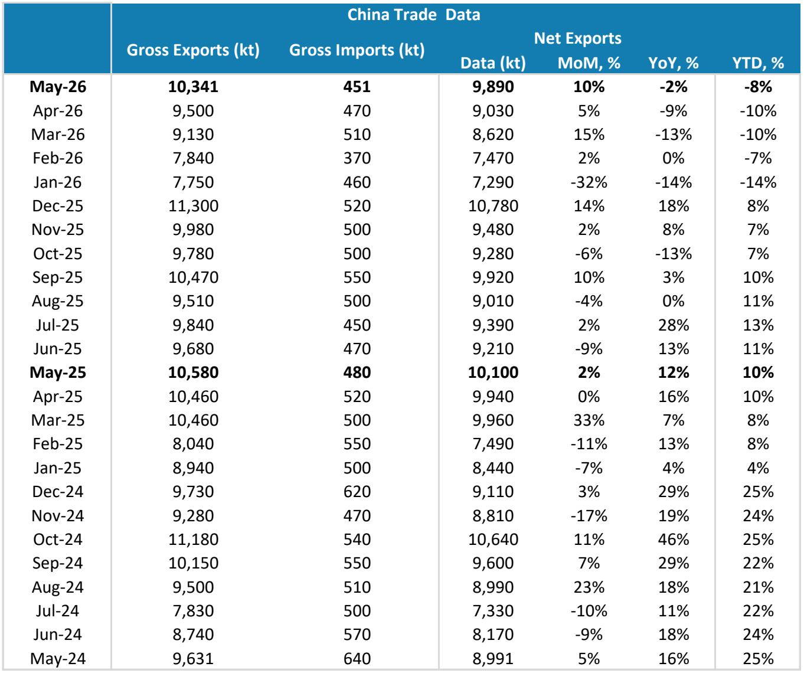
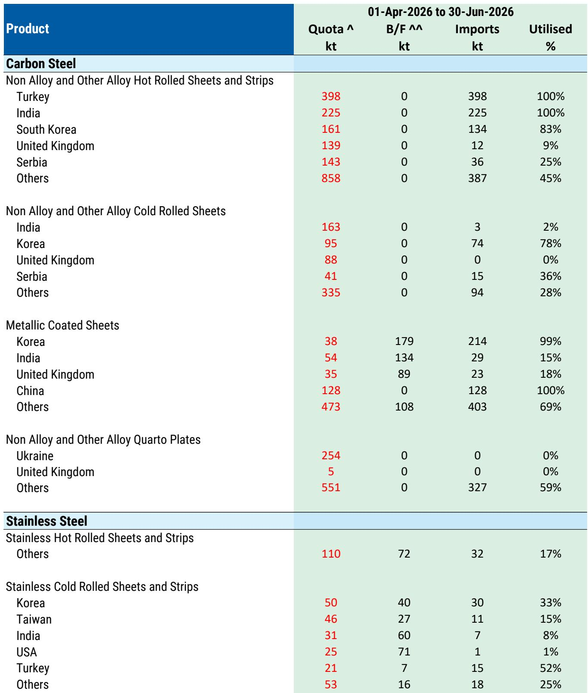
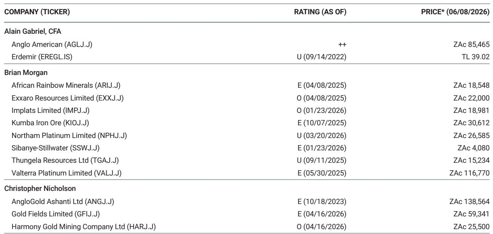

# China's Steel Export Surge Is a Distraction: The Real Story Is Europe's Widening Regional Premium

The headline numbers from China's May trade data appear contradictory. Finished-steel net exports rose roughly 10 percent month-on-month on a day-adjusted basis to 9.89 million tonnes, implying an annualized run rate of approximately 119 million tonnes. That figure exceeds what most analysts had forecast for full-year 2026. Yet year-to-date, exports remain roughly 8 percent lower than the same period last year. The sequential uptick is real, but it is not the signal that matters.

What matters is the structural divergence now underway between the global steel market and Europe. While Chinese mills continue to push tonnage into an oversupplied world, Europe is becoming increasingly insulated. Imports into the region are declining, policy barriers are tightening, and the premium that European hot-rolled coil commands over Chinese HRC is widening in ways that reflect more than just freight costs. The pattern suggests a fundamental repricing of supply-chain security, with lasting implications for where steel profits will accrue.

For investors, the critical question is not whether Chinese exports will moderate further. The question is whether Europe's policy framework can sustain a structural shortage that supports domestic pricing power even without a demand recovery. The early evidence suggests it can. But the transition is not uniform, and the winners will be those producers with the right assets and the right exposure.

## China's Export Machine Is Still Running, But the Destination Mix Is Shifting

The May data shows that Chinese steel exports remain elevated by historical standards. The annualized run rate of 119 million tonnes is well above the roughly 105 million tonnes that the sell side had penciled in for 2026. Yet the year-on-year decline of 8 percent tells a more nuanced story. Chinese mills are not exporting less because they want to. They are exporting less because they can find fewer markets willing to absorb their tonnage at acceptable prices.

Domestic demand in China remains weak. CISA member output is down roughly 7 percent year-on-year, and the latest late-May data point shows a further 4 percent decline relative to the prior 10-year period. Buying activity slowed heading into the weaker summer season. The steel industry in China is producing into a demand hole, and exports are the pressure valve. But that valve is being squeezed.

The geographic composition of Chinese exports is fragmenting. Rather than concentrating on a few large buyers, Chinese mills are shipping to a wider array of smaller destinations. This dispersion is a sign of distress. When a producer has to find incremental buyers in dozens of countries rather than a handful, it suggests that traditional markets are closing or becoming less willing to absorb large volumes. The pattern is consistent with a global steel market that is regionalizing, not integrating.

The implication is clear. Chinese exports will remain elevated as long as domestic demand stays depressed, but the marginal tonne will find it increasingly difficult to land in high-priced regions. The export surge is a symptom of China's overcapacity, not a signal of global strength.

## Europe's Import Wall Is Rising, and Policy Is Reinforcing the Structure

The most important development in the global steel market this quarter is not what China is doing. It is what Europe is preventing. Second-quarter indicators point to a decline in European steel imports across products relative to the fourth quarter of 2025. This is not a seasonal blip. It is evidence that policy is starting to bite.

The European Union's safeguard measures, formally approved by the European Council, are tightening from July 1. Higher out-of-quota tariffs are being implemented, and the proposed melted-and-poured clause could materially extend the policy's reach by capturing steel that transits through intermediary countries. Even though China accounts directly for only about 13 percent of Europe's imports, the indirect channel is far larger. Steel that originates in China but is processed or re-exported through Vietnam, Turkey, or South Korea can still enter Europe. The melted-and-poured clause is designed to close that loophole.

The numbers support the thesis. Without any demand recovery, the policy framework could leave Europe structurally short by 10 to 15 million tonnes. That is not a forecast of a supply crisis. It is an estimate of the volume that would need to be filled by domestic production or non-Chinese imports to maintain current consumption levels. A structural shortage of that magnitude would tighten the market and support higher clearing prices.

The market is already pricing this in. EU HRC spreads have risen to $404 per tonne, above the long-run average of $320 per tonne. The spread between EU HRC and Chinese HRC has widened by $41 per tonne since the start of the Middle East conflict, even before any incremental uplift from the Carbon Border Adjustment Mechanism or tighter safeguards. Buyers are increasingly paying for proximity and reliability. Freight costs, insurance premiums, and disruption risks are all being factored into the price of European steel.

This is not a cyclical story. It is a structural repricing of supply-chain security. Europe is becoming a premium market, and that premium is being reinforced by policy.

## The Profit Pool Is Migrating Back to Domestic European Mills, But Not All Mills Are Equal

The widening regional premium creates a clear investment implication. The profit pool in European steel is migrating back toward domestic mills. Higher import parity, a more robust policy framework, and improving utilization rates are supporting an earnings before interest, taxes, depreciation, and amortization per tonne re-base.

But the migration is not uniform. Not every European steel producer will benefit equally. The key differentiators are asset location, shipment flexibility, and the ability to capture share as the policy framework redirects marginal tonnes back toward domestic supply.

Integrated mills with local assets are best positioned. They have the cost base and the logistics to serve European customers without relying on imported slab or semi-finished products. They can flex volumes upward as import volumes decline, improving fixed-cost absorption. They also have the balance sheet to invest in capacity upgrades that meet the Carbon Border Adjustment Mechanism's requirements, which will become a competitive advantage over time.

Producers that rely on imported raw materials or semi-finished products face a different calculus. The widening premium benefits them on the output side, but they are exposed to the same disruption risks and freight costs that are driving the premium higher in the first place. The net benefit is smaller.

The report highlights two names as preferred plays. One is a global diversified producer with significant European integrated assets, offering scope to flex volumes and improve fixed-cost absorption. The other is a German specialty steelmaker where the earnings inflection is increasingly visible. Both have leverage to the widening regional premium and the policy-driven structural shortage.

## What the Report Does Not Fully Answer: The Durability of Demand and the Carbon Transition Cost

For all its analytical rigor, the report leaves several meaningful open questions. The most important is the demand side. The structural shortage thesis depends on the assumption that European steel demand does not collapse. If the European economy enters a recession or if industrial activity weakens materially, the 10 to 15 million tonne shortage could evaporate quickly. The report does not model a demand shock scenario, and it does not provide a sensitivity analysis for how the policy framework would interact with a sharp demand decline.

A second open question is the cost of the carbon transition. The Carbon Border Adjustment Mechanism will impose costs on imported steel, but it will also impose costs on domestic producers. European mills face rising carbon compliance costs, and those costs will be passed through to customers only to the extent that the market allows. If demand is weak, the pass-through may be incomplete, squeezing margins even as volumes hold up. The report acknowledges the policy framework but does not fully quantify the net cost impact on domestic producers.

A third question is the response from other exporting regions. If China's exports are diverted away from Europe, they will flow to other markets. That could depress pricing in Asia, the Middle East, or Africa, creating a two-tier market where European premiums widen but global margins compress. Producers with global exposure may benefit from the European uplift but suffer from weakness elsewhere. The report focuses on European equities, but the global spillover effects are not fully addressed.

These open questions do not invalidate the thesis. They define the range of outcomes that investors need to consider. The structural shortage argument is compelling, but it is not a certainty.

## A Decision Framework for Investors: Three Filters for Selecting European Steel Exposure

For investors looking to act on the thesis, a simple decision framework can help differentiate the winners from the laggards. Three filters are particularly relevant.

The first filter is asset geography. Producers with integrated mills inside the European Union are better positioned than those with assets outside or those that rely on imported semi-finished products. The policy framework rewards local production. The Carbon Border Adjustment Mechanism and the safeguard measures create a moat around European mills. Producers inside that moat have pricing power that outsiders lack.

The second filter is cost flexibility. The ability to flex volumes up and down without destroying margins is critical in a market where the structural shortage is real but demand remains uncertain. Producers with high fixed costs and low variable costs benefit from volume increases but are exposed if demand disappoints. The ideal candidate has a cost structure that allows it to capture upside while limiting downside.

The third filter is balance sheet strength. The carbon transition will require capital expenditure. Mills that need to invest in electric arc furnaces, carbon capture, or other decarbonization technologies will face a multi-year investment cycle. Producers with strong balance sheets can fund that investment without diluting equity or taking on excessive debt. Producers with weak balance sheets may be forced to underinvest, losing competitive position over time.

Applying these three filters narrows the universe considerably. The report's preferred names pass all three filters, but the framework can be applied to any European steel equity. The key insight is that the regional premium is real, but it is not a rising tide that lifts all boats.

## The Unresolved Analytical Question: How Much of the Premium Is Policy, and How Much Is Fear?

The most interesting analytical question that the report raises but does not fully answer is the composition of the European premium. How much of the $41 per tonne widening since the start of the Middle East conflict is attributable to policy expectations, and how much is attributable to genuine supply-chain disruption?

If the premium is primarily a fear premium, it could compress quickly if geopolitical tensions ease or if freight costs normalize. The policy framework would still support a premium, but it would be smaller. If the premium is primarily a policy premium, it is more durable, but it depends on continued regulatory enforcement and the absence of legal challenges.

The distinction matters for valuation. A fear premium is transient. A policy premium is structural but subject to political risk. Investors need to assess which component dominates and what events could cause it to reverse.

The report leans toward the policy explanation, but the evidence is not conclusive. The widening premium coincided with the Middle East conflict, making it difficult to disentangle the two factors. The next six months will provide a clearer signal. If the premium holds or widens as the safeguard measures take effect, the policy explanation will be validated. If the premium compresses despite the policy tightening, the fear premium explanation will gain credibility.

## Join the Community to Read the Full Report and Review the Original Charts

The analysis in this article is based on a detailed research report that includes charts on Chinese net export trends, European import volumes, price spreads, and the geographic composition of trade flows. The original report provides the data and the analytical framework that underpin the arguments presented here. For investors who want to examine the evidence firsthand and draw their own conclusions, the full report is available.

Join the community to read the full report and review the original charts.

*This article is for learning and discussion only and does not constitute investment advice.*

Personal reading notes and learning share only. Not investment advice.

