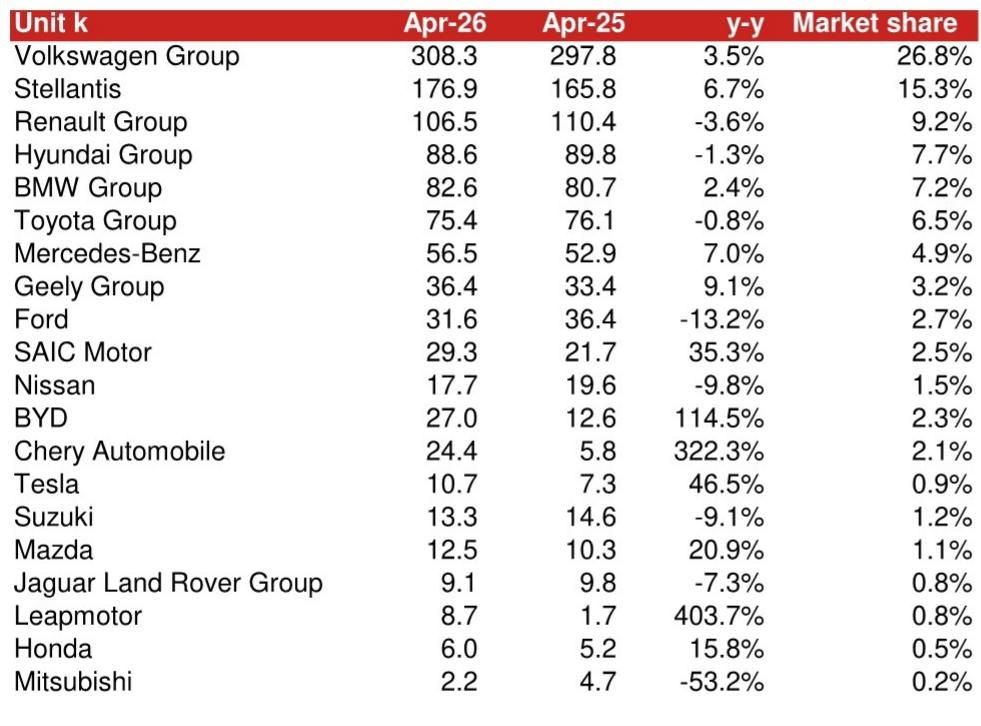
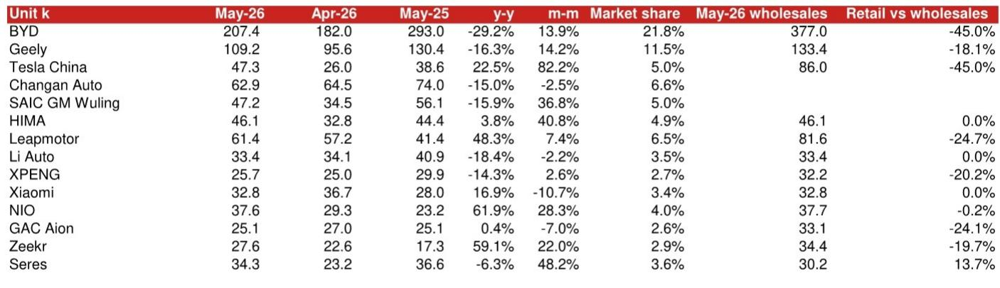
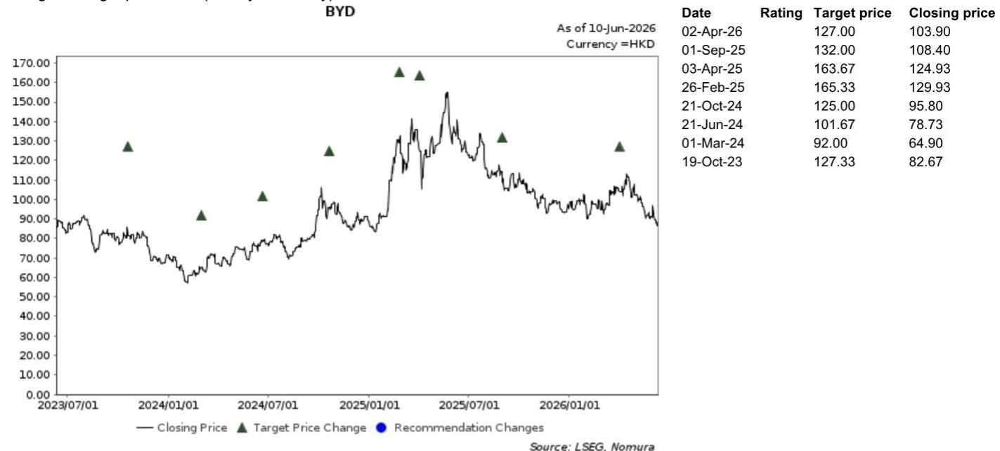

# NOM：中国汽车市场2026年可能首次出现国内需求双位数下滑

这份NOM研报的核心判断并不令人意外，但其警示的深度值得认真对待。5月数据公布后，市场普遍关注的是环比改善，而NOM选择将目光投向一个更根本的问题：国内汽车市场正在经历一个结构性转折点，2026年全年国内零售销量可能出现有史以来首次双位数同比下滑。这个判断如果成立，将从根本上改变对中国汽车产业链的定价逻辑。

报告发布时点恰逢国内车企密集推出新车型和技术升级的窗口期，但NOM的订单追踪显示，除了新车上市带来的短期脉冲，市场并未出现有意义的有机需求改善。这意味着，当前行业面临的问题不是供给端缺乏创新，而是需求端正在经历一个更深层次的收缩周期。对于投资者和产业决策者而言，理解这个收缩的性质和边界，远比关注月度环比数据更有价值。

## 1. 5月数据确认了国内需求的疲软并非短期扰动，而是趋势性下滑

5月中国乘用车零售销量（剔除微型客车）为150万辆，同比下降22.0%。虽然环比增长9.2%看起来是一个积极信号，但NOM明确指出，这种环比改善更多是季节性因素所致，而非需求回暖的标志。更值得关注的是，今年前5个月累计零售销量为710万辆，同比下降19.3%，这是自2020年疫情冲击以来的最低水平。

将这个数据放在更长的历史背景下看，2020年国内零售全年约为1920万辆，而2026年前5个月的运行节奏如果延续，全年零售可能落在1700-1800万辆区间。这意味着国内市场规模正在退回五年前的水平。NOM在报告中提出一个大胆但逻辑自洽的假设：如果当前趋势延续且没有增量刺激政策，2026年国内汽车销量可能出现历史上首次双位数同比下滑。

这个判断的意义不在于预测的精确度，而在于它揭示了一个关键变化：过去几年市场一直习惯于将销量下滑归因于短期因素（如补贴退坡、库存调整、疫情扰动），但2026年的情况可能不同。即便在大量新车投放和技术升级的背景下，需求依然没有起色，这说明问题可能出在消费者购买力或消费意愿的结构性变化上。

## 2. 新能源渗透率创新高背后，隐藏着市场结构的分化信号

5月新能源乘用车零售销量为95万辆，同比下降7.5%，环比增长12.0%。渗透率达到62.1%，同比提升9.9个百分点，环比提升1.5个百分点，创下历史新高。与此同时，燃油车零售销量为56.1万辆，同比下降38.4%。

渗透率的快速提升被市场广泛解读为利好，但NOM的数据揭示了一个更复杂的图景：新能源车销量本身也在下降，只是降幅远小于燃油车。这意味着渗透率的提升更多来自燃油车市场的加速萎缩，而非新能源市场本身的强劲扩张。这是一个重要的区别——如果新能源市场能够维持正增长，渗透率提升是健康的；但如果新能源市场也开始收缩，渗透率的继续提升可能只是分母效应。

从车型结构看，A00级微型电动车市场份额在4月已降至6%，NOM预计2026年全年这一比例将继续维持在个位数。国家补贴政策对大众市场车型越来越不利，这意味着新能源市场的增长重心正在向中高端转移。对于主打低价走量策略的车企而言，这个趋势意味着它们需要重新审视自己的产品定位和盈利模型。

## 3. 头部车企的零售数据揭示了一个竞争加剧但缺乏增量的市场

NOM对主要车企的零售数据拆解，提供了一个观察竞争格局变化的窗口。比亚迪5月零售20.74万辆，同比下降29.2%，市场份额21.8%，同比下降6.7个百分点。虽然环比有所恢复，但同比的大幅下滑说明，即便是行业龙头，在整体需求萎缩的环境下也难以独善其身。

吉利5月零售10.92万辆，同比下降16.3%，市场份额11.5%，同比下降1.2个百分点。零跑汽车是少数实现同比增长的车企之一，5月零售6.14万辆，同比增长48.3%，显示其在特定细分市场的产品定位获得了消费者认可。

值得注意的是，特斯拉中国5月零售4.73万辆，同比增长22.5%，环比大幅增长82.2%。这个环比跳跃可能与新车型交付节奏有关，但NOM并未展开分析。蔚来5月零售3.76万辆，同比增长61.9%，表现亮眼。理想汽车则同比下降18.4%，环比下降2.2%，显示其在激烈竞争中面临压力。

这些数据共同指向一个结论：在总量萎缩的市场中，竞争格局正在快速分化。少数车企能够通过产品力或品牌力实现增长，但多数车企面临销量和利润的双重压力。对于投资者而言，区分哪些车企拥有真正的结构性优势、哪些只是靠价格战维持份额，将成为核心课题。

## 4. 出口是2026年最大的亮点，但NOM对可持续性提出了关键疑问

5月中国乘用车出口80.9万辆，同比增长73.0%，前5个月累计出口350万辆，同比增长70%。这个增速在任何一个行业都是惊人的。NOM指出，中国车企在欧盟、巴西、澳大利亚等关键市场取得了实质性进展。

然而，NOM在这份报告中提出了两个需要认真思考的问题。第一是目标市场的容量问题。随着现有目标市场逐渐饱和，车企需要不断开拓新市场，而这会带来更多的不确定性和成本。第二是贸易摩擦风险。报告引用了彭博关于中欧贸易关系面临进一步压力的报道，并指出俄罗斯、巴西、墨西哥等多个国家已经提高了汽车相关关税。

NOM的判断是：中国电动车企在2026年至少仍将在海外市场享受强劲增长，但成为真正的全球玩家并不容易。这个判断的潜台词是，出口高速增长的可持续性需要打一个问号。如果贸易壁垒继续升级，出口增速可能会在2027年前后出现拐点。对于高度依赖出口来消化国内过剩产能的车企而言，这个风险不容忽视。

## 5. 报告没有完全回答的关键问题：内需收缩的根源到底是什么？

NOM的报告在数据和趋势分析上非常扎实，但有一个问题没有完全展开：国内需求持续疲软的深层原因是什么？是消费者信心不足、收入预期下降，还是汽车保有量已经接近饱和？抑或是房地产财富效应的消退对汽车消费产生了溢出效应？

从报告提供的数据看，2026年前5个月零售销量是2020年以来最低的，而2020年是疫情冲击最严重的年份。这意味着当前的需求水平已经低于疫情期间。这个事实本身值得深思。NOM提到了“缺乏增量刺激政策”作为背景，但并没有分析如果没有刺激政策，需求是否会自然触底。

另一个未充分讨论的问题是，新能源车渗透率达到62%之后，进一步上升的空间和节奏会如何变化。燃油车市场的快速萎缩不可能无限持续，一旦燃油车市场触底，渗透率的提升速度就会显著放缓。这个拐点何时到来，对车企的产品规划和产能布局至关重要。

这些未解问题恰恰是深入理解中国汽车市场长期趋势的关键。NOM的报告提供了一个坚实的数据基础和分析框架，但要形成完整的投资判断，还需要对这些深层问题做更深入的探讨。

## 6. 对决策者的观察框架：从关注总量到关注结构

基于这份报告的分析，我们可以提炼出一个简化的观察框架。第一，关注零售数据而非批发数据。批发数据受渠道库存影响，容易掩盖真实需求的变化。NOM在报告中多次强调零售数据的参考价值，这个原则值得投资者采纳。

第二，关注市场份额变化而非绝对销量。在总量萎缩的市场中，份额提升是判断企业竞争力的更可靠指标。NOM对主要车企市场份额的追踪，提供了一个很好的分析样本。

第三，关注出口的地域分布和贸易政策变化。出口是2026年最重要的增长引擎，但这个引擎的可持续性取决于地缘政治和贸易环境。投资者需要持续跟踪欧盟、巴西、美国等关键市场的政策动向。

第四，关注新能源渗透率的分母效应。渗透率的提升可能是好消息也可能是坏消息，关键在于新能源车本身的销量趋势。如果新能源车销量增速持续放缓甚至转负，渗透率的继续提升反而可能是一个警示信号。

NOM的这份报告提供了一个清醒的视角：中国汽车市场正在经历一个从高速增长到存量博弈的转折期。在这个阶段，传统的增长叙事需要被重新审视，而那些能够在这个环境下依然保持竞争力的企业，才真正值得长期关注。

报告中的许多图表和细节数据，包括各车企的批发与零售对比、不同车型和价格区间的销售结构、以及海外市场的具体表现，本文受篇幅所限未能一一展开。这些信息对于形成更完整的判断至关重要。欢迎来我们的星球和微信群中继续讨论，你可以获取完整的研报解读和原始数据图表，并与更多关注产业趋势的读者交流观点。

Personal reading notes and learning share only. Not investment advice.

