## Japan Equity Style Investing

Stay with AI Momentum, Hedge a Hawkish BOJ Hike with Value-Momentum

- Japanese equities strengthened in May as risk-on sentiment accelerated on the back of easing geopolitical risk and a further intensification of the global AI semiconductor boom. In line with record highs across major global equity markets, the Nikkei 225 rose sharply into early June, approaching the 68,000 level. While the rally was significantly supported by semiconductor-related names with large index weights, style performance also confirmed a broader pro-risk bias, with Beta, Momentum, and Size, particularly Large Cap, outperforming.  
- Global optimism toward AI semiconductors continued to support Japanese equities on a smoothed basis, despite intermittent pullbacks driven by short-term overextension. In Japan, not only core semiconductor and semiconductor production equipment names, but also AI infrastructure-related stocks posted notable gains. The earnings contribution from the global surge in semiconductor demand remains a key driver. As a result, even when mini-crashes in Momentum occur, fundamental investors have tended to buy the dips before selling pressure from speculative accounts becomes prolonged. This has helped limit downside pressure.

\- At the same time, while AI-related names continue to benefit from medium-term Momentum support, concerns are increasing over the excessive polarization that has developed in the market. With investors pricing in an additional BOJ rate hike in June, some have begun to question the persistent underperformance of Value stocks. Within Value, there are also a number of names that carry a reasonable degree of Momentum. As such, in a short-term rotation away from AI Momentum names, Value with Momentum characteristics could become an attractive destination for flows.

\- Our proprietary Japan QMI improved month-over-month in May and remained in Expansion territory by definition. Although higher commodity prices stemming from the Strait of Hormuz closure have affected parts of the domestic non-manufacturing sector, manufacturing has shown greater-than-expected resilience, led by AI-related demand. The global capex cycle also remains on an upswing, contributing to the improvement in Japan QMI. That said, the recent pace of improvement partly reflects one-off tailwinds such as special demand in memory, and statistically, maintaining the current pace of acceleration appears challenging. Looking into the summer, our base case remains that investors should keep potential cyclical deceleration in mind and remain alert to overheating in the Beta effect.

\- From June onward, we expect the AI semiconductor-led market structure to remain broadly intact, while periodic reversals are likely. However, investors should also prepare for two risks: insufficient pricing of a potentially more hawkish-than-expected BOJ rate hike, and a partial correction of the extreme polarization between winning and losing sectors. In that context, we would pay closer attention to the overlap between Value and Momentum, where laggards may become a recipient of hedging-related flows.

## Global Quantitative and Derivatives Strategy

Masanari Takada AC

(81-3) 6736-8636

masanari.takada@JPM.com

JPM Securities Japan Co., Ltd.

Tony SK Lee

(852) 2800-8857

tony.sk.lee@JPM.com

JPM Securities (Asia Pacific) Limited/ JPM Broking (Hong Kong) Limited

Robert Smith, PhD

(61-2) 9003-8808

robert.z.smith@JPM.com

JPM Securities Australia Limited

Khuram Chaudhry

(44-20) 7134-6297

khuram.chaudhry@JPM.com

JPM Securities plc

Dubravko Lakos-Bujas

(1-212) 622-3601

dubravko.lakos-bujas@JPM.com

JPM Securities LLC

Figure 1: Japan Equity Style Assessments for June  
Changes from the prior quarter (Q1 2026) are highlighted in red (there may be none)

<table><tr><td colspan="2">Styles</td><td>Value</td><td>Growth</td><td>Quality</td><td>Low Vol</td><td>High Beta</td><td>Size (L-Smid)</td><td>Momentum</td></tr><tr><td colspan="2">Overall Japan Views</td><td>OW</td><td>UW</td><td>OW on Mid caps</td><td>UW</td><td>N</td><td>OW on Mid caps</td><td>Selective OW</td></tr><tr><td>Cycle (QMI)</td><td>Exp -&gt;Slowing</td><td>EV/EBITDA</td><td>Earning Mom</td><td>Buy</td><td>UW</td><td>N</td><td>OW</td><td>Sticky</td></tr><tr><td>Position</td><td>Mild heavy</td><td>Mild-Heavy</td><td>Less Heavy</td><td>Less Heavy</td><td>Light</td><td>Heavy</td><td>Concentrated</td><td>Heavy</td></tr><tr><td>Themes</td><td>Themes affecting JPN</td><td>Inflation/ROIC&gt;WACC/BOJ Hike</td><td>Quality-competitions/AI</td><td>Takaichi&#x27;s Industrial Policy/AI</td><td>Defensive</td><td>Offensives</td><td>Concentration/Passive flows</td><td>Concentration on AI-related names</td></tr></table>

Source: JPM

Figure 2: Key Summary of Japan Style for May

<table><tr><td>Factor</td><td>May</td><td>Apr</td><td>Mar</td><td>Sharpe Last 12 Months</td></tr><tr><td>Momentum</td><td>6.4%</td><td>14.1%</td><td>-12.9%</td><td>0.44</td></tr><tr><td>Size (L-S)</td><td>6.3%</td><td>13.3%</td><td>-4.0%</td><td>0.68</td></tr><tr><td>Beta (High)</td><td>6.2%</td><td>25.9%</td><td>-8.6%</td><td>0.74</td></tr><tr><td>Earnings Growth</td><td>3.7%</td><td>13.7%</td><td>-5.9%</td><td>0.32</td></tr><tr><td>Price to Book</td><td>0.8%</td><td>-10.5%</td><td>4.5%</td><td>0.17</td></tr><tr><td>Earnings Yield</td><td>-2.3%</td><td>-18.7%</td><td>0.6%</td><td>0.00</td></tr><tr><td>Div Yield</td><td>-5.9%</td><td>-14.1%</td><td>9.9%</td><td>-0.03</td></tr><tr><td>ROE</td><td>-8.9%</td><td>5.5%</td><td>4.2%</td><td>-0.21</td></tr><tr><td>JPM Quality</td><td>-10.3%</td><td>5.0%</td><td>5.7%</td><td>-0.27</td></tr><tr><td>Q-Score</td><td>-10.5%</td><td>10.2%</td><td>-6.7%</td><td>0.37</td></tr><tr><td>Low Vol</td><td>-11.1%</td><td>-23.6%</td><td>9.9%</td><td>-0.50</td></tr></table>

Source: JPM

Figure 3: Key Chart - Value Performance Isn't Priced for a BoJ Rate Hike  
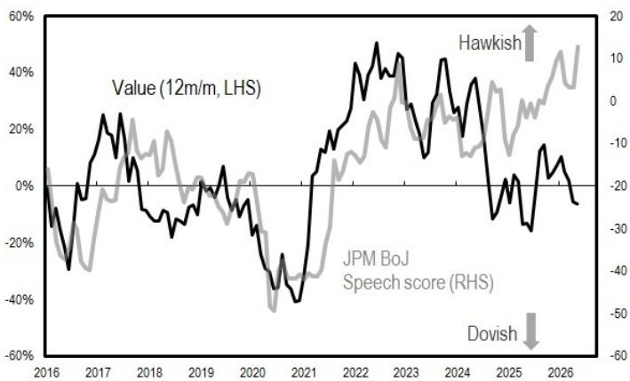

line chart

| Year | Value (12m/m, LHS) | JPM BoJ Speech score (RHS) |
|------|---------------------|-----------------------------|
| 2016 | ~0%                 | ~0%                         |
| 2017 | ~25%                | ~-30%                       |
| 2018 | ~-10%               | ~-40%                       |
| 2019 | ~-5%                | ~-30%                       |
| 2020 | ~-30%               | ~-45%                       |
| 2021 | ~-40%               | ~-35%                       |
| 2022 | ~45%                | ~-10%                       |
| 2023 | ~50%                | ~-5%                        |
| 2024 | ~35%                | ~-10%                       |
| 2025 | ~-15%               | ~-30%                       |
| 2026 | ~-5%                | ~-10%                       |

Source: JPM

Figure 4: Value stocks with moderate momentum (upside) effect as of 8 June  
1. Universe: MSXJP constituents. 2. Mechanically selected based on each name's factor loadings (as of last month-end). 3. We first select stocks in the top $50\%$ by Momentum factor loading (positive values only). From that subset, we choose the 30 names with the highest Value factor loading.

<table><tr><td>Code</td><td>Name</td><td>Sector(TSE33)</td><td>mkt cap (bn¥)</td><td>Price (¥)</td><td>3m Ret% (Absl)</td><td>12m Ret% (Absl)</td><td>3m Ret% (vs. TPX)</td><td>12m Ret% (vs. TPX)</td><td>Beta</td><td>P/E (12m fwd)</td><td>P/B (LTM)</td><td>ROE (LTM)</td><td>DivYld% (LTM)</td></tr><tr><td>9503</td><td>KANSAI ELEC PWR</td><td>Electric Power &amp; Gas</td><td>2,576</td><td>2,311</td><td>-10%</td><td>38%</td><td>-14%</td><td>1%</td><td>0.9</td><td>8.7</td><td>0.7</td><td>11.7</td><td>3.5</td></tr><tr><td>7259</td><td>AISIN CORP</td><td>Transportation Equipment</td><td>1,714</td><td>2,361</td><td>-3%</td><td>29%</td><td>-7%</td><td>-8%</td><td>1.1</td><td>9.8</td><td>0.8</td><td>8.2</td><td>3.2</td></tr><tr><td>5019</td><td>IDEMITSU KOSAN C</td><td>Oil &amp; Coal Products</td><td>1,650</td><td>1,349</td><td>-6%</td><td>51%</td><td>-10%</td><td>14%</td><td>0.8</td><td>10.3</td><td>0.9</td><td>9.4</td><td>2.7</td></tr><tr><td>8473</td><td>SBI HOLDINGS INC</td><td>Securities &amp; Commodity Futures</td><td>1,871</td><td>2,831</td><td>-6%</td><td>20%</td><td>-10%</td><td>-17%</td><td>1.3</td><td>8.7</td><td>1.0</td><td>28.0</td><td>3.4</td></tr><tr><td>7181</td><td>JAPAN POST INSUR</td><td>Insurance</td><td>1,623</td><td>1,455</td><td>-8%</td><td>33%</td><td>-12%</td><td>-5%</td><td>1.0</td><td>9.5</td><td>0.4</td><td>4.6</td><td>3.4</td></tr><tr><td>9502</td><td>CHUBU ELEC POWER</td><td>Electric Power &amp; Gas</td><td>2,028</td><td>2,675</td><td>6%</td><td>52%</td><td>1%</td><td>15%</td><td>0.6</td><td>11.2</td><td>0.6</td><td>7.7</td><td>2.6</td></tr><tr><td>9104</td><td>MITSUI OSK LINES</td><td>Marine Transportation</td><td>2,094</td><td>5,767</td><td>-8%</td><td>19%</td><td>-12%</td><td>-18%</td><td>0.8</td><td>10.7</td><td>0.7</td><td>7.7</td><td>3.6</td></tr><tr><td>8725</td><td>MS&amp;AD INSURANCE</td><td>Insurance</td><td>6,570</td><td>4,402</td><td>8%</td><td>35%</td><td>3%</td><td>-2%</td><td>1.2</td><td>9.2</td><td>1.3</td><td>18.0</td><td>3.2</td></tr><tr><td>8630</td><td>SOMPO HOLDINGS I</td><td>Insurance</td><td>5,598</td><td>5,992</td><td>1%</td><td>33%</td><td>-3%</td><td>-4%</td><td>1.2</td><td>10.0</td><td>1.0</td><td>13.7</td><td>3.3</td></tr><tr><td>5020</td><td>ENEOS HOLDINGS I</td><td>Oil &amp; Coal Products</td><td>3,383</td><td>1,250</td><td>-9%</td><td>70%</td><td>-13%</td><td>32%</td><td>1.1</td><td>9.9</td><td>1.0</td><td>8.0</td><td>2.7</td></tr><tr><td>8593</td><td>MITSUBISHI HC CA</td><td>Other Financing Business</td><td>1,905</td><td>1,299</td><td>-11%</td><td>24%</td><td>-15%</td><td>-14%</td><td>0.8</td><td>10.6</td><td>0.9</td><td>8.6</td><td>3.9</td></tr><tr><td>1605</td><td>INPEX CORP</td><td>Mining</td><td>4,585</td><td>3,641</td><td>-13%</td><td>69%</td><td>-17%</td><td>31%</td><td>0.8</td><td>9.0</td><td>0.9</td><td>7.9</td><td>3.0</td></tr><tr><td>9531</td><td>TOKYO GAS CO LTD</td><td>Electric Power &amp; Gas</td><td>2,114</td><td>6,311</td><td>-18%</td><td>30%</td><td>-22%</td><td>-7%</td><td>0.5</td><td>16.2</td><td>1.2</td><td>13.2</td><td>1.9</td></tr><tr><td>3003</td><td>HULIC CO LTD</td><td>Real Estate</td><td>1,288</td><td>1,677</td><td>-14%</td><td>13%</td><td>-19%</td><td>-24%</td><td>0.6</td><td>10.0</td><td>1.4</td><td>13.3</td><td>4.0</td></tr><tr><td>8750</td><td>DAIICHI LIFE GRO</td><td>Insurance</td><td>6,040</td><td>1,668</td><td>13%</td><td>52%</td><td>9%</td><td>15%</td><td>1.2</td><td>12.5</td><td>1.4</td><td>11.3</td><td>4.3</td></tr><tr><td>8601</td><td>DAIWA SECS GRP</td><td>Securities &amp; Commodity Futures</td><td>2,410</td><td>1,536</td><td>2%</td><td>51%</td><td>-2%</td><td>14%</td><td>1.2</td><td>12.4</td><td>1.2</td><td>10.3</td><td>4.2</td></tr><tr><td>8604</td><td>NOM HOLDINGS</td><td>Securities &amp; Commodity Futures</td><td>4,199</td><td>1,360</td><td>10%</td><td>48%</td><td>6%</td><td>11%</td><td>1.4</td><td>10.5</td><td>1.1</td><td>10.1</td><td>3.8</td></tr><tr><td>9107</td><td>KAWASAKI KISEN</td><td>Marine Transportation</td><td>1,728</td><td>2,703</td><td>0%</td><td>31%</td><td>-4%</td><td>-6%</td><td>1.0</td><td>15.4</td><td>0.9</td><td>7.7</td><td>4.4</td></tr><tr><td>6178</td><td>JAPAN POST HOLDI</td><td>Services</td><td>5,976</td><td>2,128</td><td>14%</td><td>58%</td><td>10%</td><td>21%</td><td>1.1</td><td>13.4</td><td>0.6</td><td>4.0</td><td>2.8</td></tr><tr><td>2503</td><td>KIRIN HOLDINGS C</td><td>Foods</td><td>2,155</td><td>2,642</td><td>0%</td><td>29%</td><td>-4%</td><td>-9%</td><td>0.4</td><td>12.2</td><td>1.6</td><td>12.4</td><td>2.9</td></tr><tr><td>9532</td><td>OSAKA GAS CO LTD</td><td>Electric Power &amp; Gas</td><td>2,195</td><td>5,516</td><td>-13%</td><td>48%</td><td>-17%</td><td>11%</td><td>0.6</td><td>14.4</td><td>1.2</td><td>8.7</td><td>2.4</td></tr><tr><td>5201</td><td>AGC INC</td><td>Glass &amp; Ceramics Products</td><td>1,569</td><td>7,214</td><td>20%</td><td>67%</td><td>16%</td><td>30%</td><td>0.9</td><td>17.0</td><td>1.0</td><td>6.0</td><td>2.9</td></tr><tr><td>3407</td><td>ASAHI KASEI CORP</td><td>Chemicals</td><td>2,385</td><td>1,746</td><td>2%</td><td>79%</td><td>-2%</td><td>42%</td><td>0.9</td><td>14.0</td><td>1.1</td><td>8.0</td><td>2.5</td></tr><tr><td>8309</td><td>SUMITOMO MITSUI</td><td>Banks</td><td>4,043</td><td>5,786</td><td>13%</td><td>51%</td><td>9%</td><td>14%</td><td>1.1</td><td>11.1</td><td>1.1</td><td>9.5</td><td>0.8</td></tr><tr><td>6326</td><td>KUBOTA CORP</td><td>Machinery</td><td>3,135</td><td>2,754</td><td>0%</td><td>71%</td><td>-5%</td><td>34%</td><td>1.0</td><td>13.5</td><td>1.2</td><td>8.6</td><td>1.9</td></tr><tr><td>4503</td><td>ASTELLAS PHARMA</td><td>Pharmaceutical</td><td>3,889</td><td>2,149</td><td>-13%</td><td>56%</td><td>-17%</td><td>19%</td><td>0.6</td><td>10.8</td><td>2.1</td><td>17.4</td><td>3.7</td></tr><tr><td>7912</td><td>DAI NIPPON PRINT</td><td>Other Products</td><td>1,155</td><td>2,628</td><td>-15%</td><td>22%</td><td>-19%</td><td>-15%</td><td>0.8</td><td>11.5</td><td>1.0</td><td>8.9</td><td>1.6</td></tr><tr><td>4188</td><td>MITSUBISHI CHEMI</td><td>Chemicals</td><td>1,490</td><td>1,034</td><td>7%</td><td>35%</td><td>2%</td><td>-2%</td><td>1.0</td><td>13.4</td><td>0.8</td><td>0.7</td><td>3.1</td></tr><tr><td>4507</td><td>SHIONOGI &amp; CO</td><td>Pharmaceutical</td><td>2,531</td><td>2,845</td><td>-18%</td><td>14%</td><td>-22%</td><td>-23%</td><td>0.6</td><td>10.5</td><td>1.4</td><td>13.5</td><td>2.7</td></tr><tr><td>1802</td><td>OBAYASHI CORP</td><td>Construction</td><td>2,125</td><td>3,071</td><td>-23%</td><td>37%</td><td>-28%</td><td>0%</td><td>0.9</td><td>13.1</td><td>1.7</td><td>14.4</td><td>3.1</td></tr></table>

Source: FactSet, JPM

## Market cycle (top down)

Japan QMI remained in Expansion territory in May. Against the backdrop of the global AI boom, real activity appears to have improved more than expected in sectors such as semiconductor production equipment and AI infrastructure. The negative impact of Middle East-related tensions, which we have been monitoring since March, has not yet appeared clearly in QMI.

Figure 5: Japan QMI since 2010  
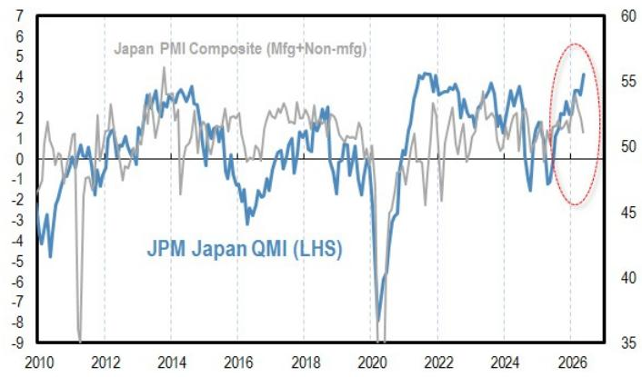

line chart

| Year | JPM Japan QMI (LHS) | Japan PMI Composite (Mfg+Non-mfg) |
|------|---------------------|-----------------------------------|
| 2010 | -4.0                | 1.0                               |
| 2012 | -1.0                | 2.0                               |
| 2014 | 3.0                 | 3.0                               |
| 2016 | -3.0                | 1.0                               |
| 2018 | 2.0                 | 2.0                               |
| 2020 | -8.0                | -1.0                              |
| 2022 | 4.0                 | 3.0                               |
| 2024 | 3.0                 | 2.0                               |
| 2026 | 5.0                 | 4.0                               |

Source: Bloomberg Finance L.P., MSCI Barra, JPM

Figure 6: Japan QMI State Positions for the Past 1 Year  
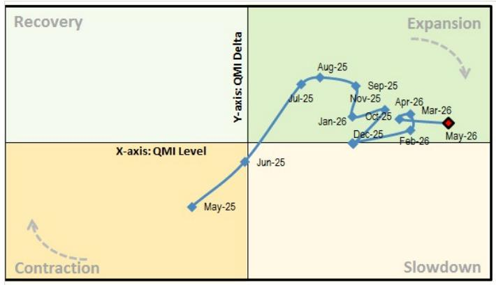

flowchart

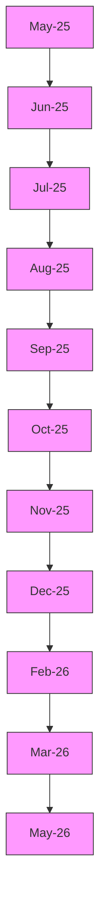

Source: Bloomberg Finance L.P., MSCI Barra, JPM

We track QMI across all global regions to determine where each country stands in its cycle. The relationship between Japan's QMI and Style factors is illustrated below.

In an Expansion phase, we favor cyclicals, value, and large caps. We also favor the long side of Momentum. However, given the extended duration of this phase, we note that Beta and Momentum are showing clear signs of overheating. At this stage, positioning for a Slowdown phase still appears to be a minority view.

Figure 7: JPM Style Investing – Phases of the Market Cycle with Favored Styles Based on backtesting from Jan 2000 to Dec 2024.

<table><tr><td>Recovery
OW: High Beta
OW: Discounted Value
OW: Stable Growth
UW: Expensive Growth
UW: 12m Momentum</td><td>Y-axis: QMI Delta</td><td>Expansion
OW: Beta+Value (High DY%)
OW: EPS Earning Momentum
OW: L/O Momentum
OW: Cyclical Large-caps
UW: Rich Quality</td></tr><tr><td>X-axis: QMI
OW: Growth Revision
OW: Defensive Value (DY%)
OW: Good Quality SMid
UW: Cyclical Value
UW: Short Momentum</td><td></td><td>OW: Deep Value (Cash Rich)
OW: SMid Value
OW: 1m Reversal
UW: High Idyo-Vols
UW: Analyst Revision Calls</td></tr><tr><td>Contraction</td><td></td><td>Slowdown</td></tr></table>

Source: JPM

The cyclical and high-beta-led rally in Japanese equities since last June can be explained by improving macro momentum, as measured by QMI, and the associated recovery in corporate earnings expectations. Since the beginning of the year, the global AI semiconductor boom has provided a powerful tailwind to corporate earnings. While the negative effects of the Strait of Hormuz closure have appeared in parts of the domestic non-manufacturing sector, the expansion of the global capex cycle has offset these pressures in manufacturing. As a result, the distinction between winners and losers in the Japanese equity market has become increasingly entrenched, and Momentum has gained further strength amid continued market polarization. From a technical perspective, however, more investors appear to be looking for opportunities to position for a partial correction of this excessive bifurcation.

The market has priced in an additional BOJ rate hike in June, and JGB yields remain elevated. Some market participants are concerned that the BOJ could be behind the curve, leaving the risk that the central bank may proceed with a hawkish rate hike focused on containing inflation. To date, AI semiconductor-related names have absorbed upward pressure from interest rates, supported by strong earnings improvement expectations. However, the risk of a hawkish BOJ hike does not appear to be fully priced. This could lead to a temporary cooling of excessive Momentum buying and a reassessment of lagging Value names. In June, we believe it is attractive to maintain a medium-term constructive view on AI Momentum while also focusing on a short-term rebalancing across sectors.

Figure 8: Japan QMI and EPS Revision index (MXJP)  
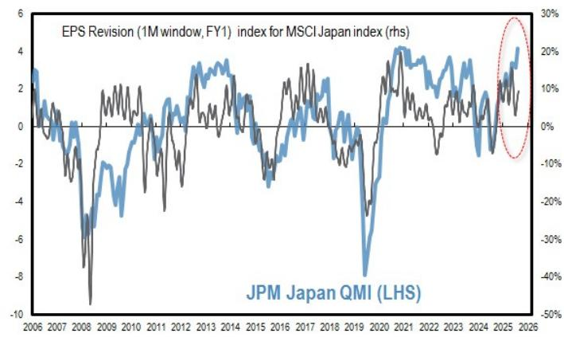

line chart

| Year | JPM Japan QMI (LHS) | EPS Revision (1M window, FY1) index for MSCI Japan index (rhs) |
|------|---------------------|---------------------------------------------------------------|
| 2006 | ~3.0                | ~3%                                                           |
| 2007 | ~-1.0               | ~0%                                                           |
| 2008 | ~-9.0               | ~-10%                                                         |
| 2009 | ~-4.0               | ~-5%                                                          |
| 2010 | ~-2.0               | ~-3%                                                          |
| 2011 | ~-1.0               | ~-1%                                                          |
| 2012 | ~3.0                | ~2%                                                           |
| 2013 | ~3.5                | ~3%                                                           |
| 2014 | ~2.5                | ~2%                                                           |
| 2015 | ~-3.0               | ~-1%                                                          |
| 2016 | ~-1.0               | ~-1%                                                          |
| 2017 | ~2.0                | ~2%                                                           |
| 2018 | ~-1.0               | ~-1%                                                          |
| 2019 | ~-8.0               | ~-40%                                                         |
| 2020 | ~4.0                | ~4%                                                           |
| 2021 | ~3.5                | ~3%                                                           |
| 2022 | ~3.0                | ~2%                                                           |
| 2023 | ~2.5                | ~1%                                                           |
| 2024 | ~3.0                | ~2%                                                           |
| 2025 | ~4.0                | ~3%                                                           |
| 2026 | ~4.5                | ~3%                                                           |

Source: Bloomberg Finance L.P., MSCI Barra, JPM

Figure 9: Japan QMI and US Capital Goods Shipments  
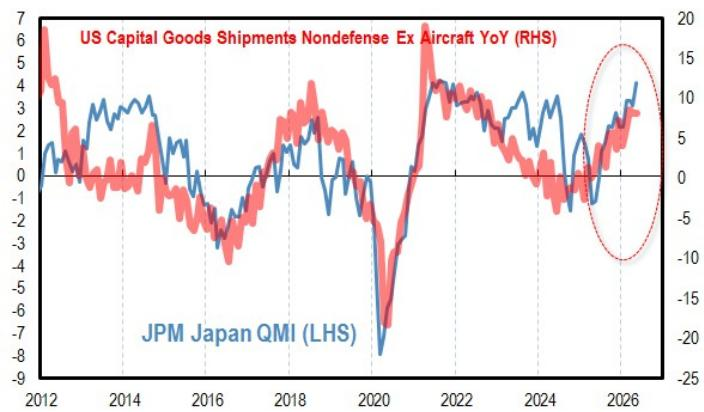

line chart

| Year | US Capital Goods Shipments Nondefense Ex Aircraft YoY (RHS) | JPM Japan QMI (LHS) |
|------|---------------------------------------------------------------|---------------------|
| 2012 | ~7                                                            | ~1                  |
| 2014 | ~3                                                            | ~3                  |
| 2016 | ~-3                                                           | ~-3                 |
| 2018 | ~4                                                            | ~2                  |
| 2020 | ~-8                                                           | ~-8                 |
| 2022 | ~15                                                           | ~4                  |
| 2024 | ~-5                                                           | ~-5                 |
| 2026 | ~15                                                           | ~4                  |

Source: Bloomberg Finance L.P., MSCI Barra, JPM

# Style performance and features

Below we summarize May's style performance landscape.

## Figure 10: Summary of the Japan Style Families – Performance and Spreads

We show the Long-Short monthly returns, then the averages. Vol is the monthly S.D. over 12 months. The spreads indicate how much more the style is exposed to PB or Beta relative to its 10-year average; Green PB Spread = Cheaper than usual. The universe is MSCI Japan (Decile, No Neutralized).

<table><tr><td>Factor</td><td>May</td><td>Apr</td><td>Mar</td><td>Last 3 Months Avg</td><td>Last 6 Months Avg</td><td>Last 12 Months Avg</td><td>Return Vol Last 12 Months</td><td>Sharpe Last 12 Months</td><td>PB Spread Premium</td><td>Beta Spread Premium</td><td>Momentum Spread Premium</td></tr><tr><td>Momentum</td><td>6.4%</td><td>14.1%</td><td>-12.9%</td><td>2.5%</td><td>7.0%</td><td>4.3%</td><td>9.9%</td><td>0.44</td><td>-0.22</td><td>2.18</td><td>0.50</td></tr><tr><td>Size (L-S)</td><td>6.3%</td><td>13.3%</td><td>-4.0%</td><td>5.2%</td><td>4.6%</td><td>4.2%</td><td>6.1%</td><td>0.68</td><td>-0.21</td><td>1.37</td><td>0.80</td></tr><tr><td>Beta (High)</td><td>6.2%</td><td>25.9%</td><td>-8.6%</td><td>7.8%</td><td>8.9%</td><td>8.3%</td><td>11.1%</td><td>0.74</td><td>-0.53</td><td>-0.02</td><td>2.49</td></tr><tr><td>Earnings Growth</td><td>3.7%</td><td>13.7%</td><td>-5.9%</td><td>3.8%</td><td>2.8%</td><td>1.5%</td><td>4.9%</td><td>0.32</td><td>-0.01</td><td>0.41</td><td>0.16</td></tr><tr><td>Price to Book</td><td>0.8%</td><td>-10.5%</td><td>4.5%</td><td>-1.7%</td><td>0.5%</td><td>1.3%</td><td>7.9%</td><td>0.17</td><td>-0.07</td><td>-0.84</td><td>-0.38</td></tr><tr><td>Earnings Yield</td><td>-2.3%</td><td>-18.7%</td><td>0.6%</td><td>-6.8%</td><td>-2.8%</td><td>0.0%</td><td>8.7%</td><td>0.00</td><td>0.15</td><td>-1.19</td><td>-1.21</td></tr><tr><td>Div Yield</td><td>-5.9%</td><td>-14.1%</td><td>9.9%</td><td>-3.4%</td><td>0.1%</td><td>-0.2%</td><td>7.8%</td><td>-0.03</td><td>0.01</td><td>-0.95</td><td>-0.57</td></tr><tr><td>ROE</td><td>-8.9%</td><td>5.5%</td><td>4.2%</td><td>0.3%</td><td>-2.5%</td><td>-1.4%</td><td>6.5%</td><td>-0.21</td><td>-0.27</td><td>-0.11</td><td>-0.17</td></tr><tr><td>JPM Quality</td><td>-10.3%</td><td>5.0%</td><td>5.7%</td><td>0.1%</td><td>-1.4%</td><td>-1.5%</td><td>5.6%</td><td>-0.27</td><td>-0.19</td><td>0.01</td><td>-0.42</td></tr><tr><td>Q-Score</td><td>-10.5%</td><td>10.2%</td><td>-6.7%</td><td>-2.3%</td><td>1.6%</td><td>2.3%</td><td>6.3%</td><td>0.37</td><td>-0.39</td><td>0.57</td><td>0.23</td></tr><tr><td>Low Vol</td><td>-11.1%</td><td>-23.6%</td><td>9.9%</td><td>-8.3%</td><td>-6.9%</td><td>-5.4%</td><td>10.8%</td><td>-0.50</td><td>0.45</td><td>-0.39</td><td>-2.01</td></tr></table>

Source: JPM

Figure 11: Top Performer Last Month – Momentum  
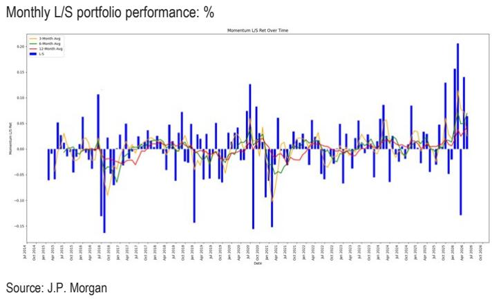

line chart

| Date       | 3-Month Avg | 6-Month Avg | 12-Month Avg | L/S    |
|------------|-------------|-------------|--------------|--------|
| Mar 2014   |             |             |              |        |
| Oct 2014   |             |             |              |        |
| Jan 2015   |             |             |              |        |
| Apr 2015   |             |             |              |        |
| May 2015   |             |             |              |        |
| Oct 2015   |             |             |              |        |
| Jan 2016   |             |             |              |        |
| Apr 2016   |             |             |              |        |
| May 2016   |             |             |              |        |
| Oct 2016   |             |             |              |        |
| Jan 2017   |             |             |              |        |
| Apr 2017   |             |             |              |        |
| May 2017   |             |             |              |        |
| Oct 2017   |             |             |              |        |
| Jan 2018   |             |             |              |        |
| Apr 2018   |             |             |              |        |
| May 2018   |             |             |              |        |
| Oct 2018   |             |             |              |        |
| Jan 2019   |             |             |              |        |
| Apr 2019   |             |             |              |        |
| May 2019   |             |             |              |        |
| Oct 2019   |             |             |              |        |
| Jan 2020   |             |             |              |        |
| Apr 2020   |             |             |              |        |
| May 2020   |             |             |              |        |
| Oct 2020   |             |             |              |        |
| Jan 2021   |             |             |              |        |
| Apr 2021   |             |             |              |        |
| May 2021   |             |             |              |        |
| Oct 2021   |             |             |              |        |
| Jan 2022   |             |             |              |        |
| Apr 2022   |             |             |              |        |
| May 2022   |             |             |              |        |
| Oct 2022   |             |             |              |        |
| Jan 2023   |             |             |              |        |
| Apr 2023   |             |             |              |        |
| May 2023   |             |             |              |        |
| Oct 2023   |             |             |              |        |
| Jan 2024   |             |             |              |        |
| Apr 2024   |             |             |              |        |
| May 2024   |             |             |              |        |
| Oct 2024   |             |             |              |        |
| Jan 2025   |             |             |              |        |
| Apr 2025   |             |             |              |        |
| May 2025   |             |             |              |        |
| Oct 2025   |             |             |              |        |
| Jan 2026   |             |             |              |        |
| Apr 2026   |             |             |              |        |
| May 2026   |             |             |              |        |
| Oct 2026   |             |             |              |        |
Source: JPM

Figure 13: Worst Performer Last Month –Low Vol (Low vs. High Volatility)  
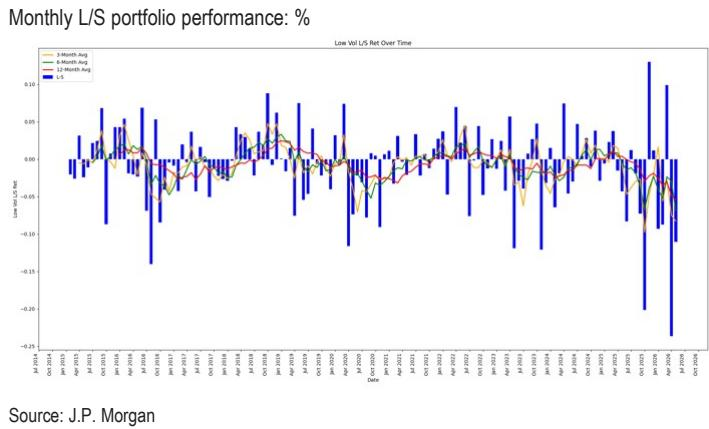

line chart

| Date | 5-Month Avg | 6-Month Avg | 12-Month Avg |
| --- | --- | --- | --- |
| Oct 2014 | 0.00 | 0.00 | 0.00 |
| Jan 2015 | 0.01 | 0.01 | 0.01 |
| Apr 2015 | 0.02 | 0.02 | 0.02 |
| Jul 2015 | 0.03 | 0.03 | 0.03 |
| Oct 2015 | 0.04 | 0.04 | 0.04 |
| Jan 2016 | 0.05 | 0.05 | 0.05 |
| Apr 2016 | 0.06 | 0.06 | 0.06 |
| Jul 2016 | 0.07 | 0.07 | 0.07 |
| Oct 2016 | 0.08 | 0.08 | 0.08 |
| Jan 2017 | 0.09 | 0.09 | 0.09 |
| Apr 2017 | 0.10 | 0.10 | 0.10 |
| Jul 2017 | 0.11 | 0.11 | 0.11 |
| Oct 2017 | 0.12 | 0.12 | 0.12 |
| Jan 2018 | 0.13 | 0.13 | 0.13 |
| Apr 2018 | 0.14 | 0.14 | 0.14 |
| Jul 2018 | 0.15 | 0.15 | 0.15 |
| Oct 2018 | 0.16 | 0.16 | 0.16 |
| Jan 2019 | 0.17 | 0.17 | 0.17 |
| Apr 2019 | 0.18 | 0.18 | 0.18 |
| Jul 2019 | 0.19 | 0.19 | 0.19 |
| Oct 2019 | 0.20 | 0.20 | 0.20 |
| Jan 2020 | 0.21 | 0.21 | 0.21 |
| Apr 2020 | 0.22 | 0.22 | 0.22 |
| Jul 2020 | 0.23 | 0.23 | 0.23 |
| Oct 2020 | 0.24 | 0.24 | 0.24 |
| Jan 2021 | 0.25 | 0.25 | 0.25 |
| Apr 2021 | 0.26 | 0.26 | 0.26 |
| Jul 2021 | 0.27 | 0.27 | 0.27 |
| Oct 2021 | 0.28 | 0.28 | 0.28 |
| Jan 2022 | 0.29 | 0.29 | 0.29 |
| Apr 2022 | 0.30 | 0.30 | 0.30 |
| Jul 2022 | 0.31 | 0.31 | 0.31 |
| Oct 2022 | 0.32 | 0.32 | 0.32 |
| Jan 2023 | 0.33 | 0.33 | 0.33 |
| Apr 2023 | 0.34 | 0.34 | 0.34 |
| Jul 2023 | 0.35 | 0.35 | 0.35 |
| Oct 2023 | 0.36 | 0.36 | 0.36 |
| Jan 2024 | 0.37 | 0.37 | 0.37 |
| Apr 2024 | 0.38 | 0.38 | 0.38 |
| Jul 2024 | 0.39 | 0.39 | 0.39 |
| Oct 2024 | 0.40 | 0.40 | 0.40 |
| Jan 2025 | 0.41 | 0.41 | 0.41 |
| Apr 2025 | 0.42 | 0.42 | 0.42 |
| Jul 2O15 | - | - | - |
| Oct-2O15 | - | - | - |
| Jan-2O16 | - | - | - |
| Apr-2O16 | - | - | - |
| Jul-2O16 | - | - | - |
| Oct-2O16 | - | - | - |
| Jan-2O17 | - | - | - |
| Apr-2O17 | - | - | - |
| Jul-2O17 | - | - | - |
| Oct-2O17 | - | - | - |
| Jan-2O18 | - | - | - |
| Apr-2O18 | - | - | - |
| Jul-2O18 | - | - | - |
| Oct-2O18 | - | - | - |
| Jan-2O19 | - | - | - |
| Apr-2O19 | - | - | - |
| Jul-2O19 | - | - | - |
| Oct-2O19 | - | - | - |
| Jan-2O2 | - | - | - |
| Apr-2O2 | - | - | - |
| Jul-2O2 | - | - | - |
| Oct-2O2 | - | - | - |

Figure 12: Second-best Performer Last Month –Size (L-S)  
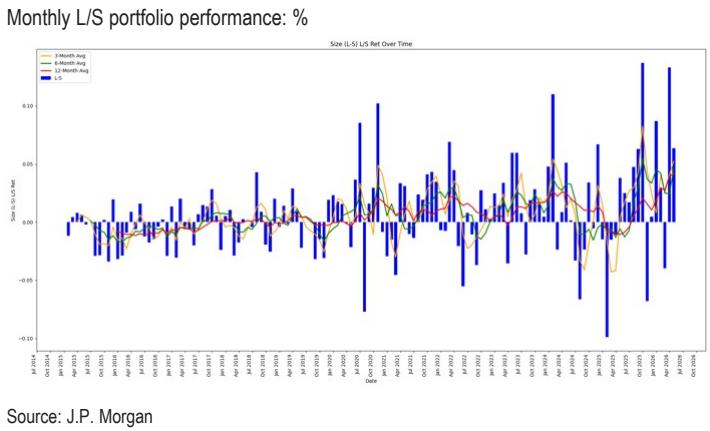

line chart

| Date       | 3-Month Avg | 6-Month Avg | 12-Month Avg | 1-Year |
|------------|-------------|-------------|--------------|--------|
| Oct-2014   | ~0.00       | ~0.00       | ~0.00        | ~0.00  |
| Jan-2015   | ~0.00       | ~0.00       | ~0.00        | ~0.00  |
| Apr-2015   | ~0.00       | ~0.00       | ~0.00        | ~0.00  |
| Jul-2015   | ~0.00       | ~0.00       | ~0.00        | ~0.00  |
| Oct-2015   | ~0.00       | ~0.00       | ~0.00        | ~0.00  |
| Jan-2016   | ~0.00       | ~0.00       | ~0.00        | ~0.00  |
| Apr-2016   | ~0.00       | ~0.00       | ~0.00        | ~0.00  |
| Jul-2016   | ~0.00       | ~0.00       | ~0.00        | ~0.00  |
| Oct-2016   | ~0.00       | ~0.00       | ~0.00        | ~0.00  |
| Jan-2017   | ~0.00       | ~0.00       | ~0.00        | ~0.00  |
| Apr-2017   | ~0.00       | ~0.00       | ~0.00        | ~0.00  |
| Jul-2017   | ~0.00       | ~0.00       | ~0.00        | ~0.00  |
| Oct-2017   | ~0.00       | ~0.00       | ~0.00        | ~0.00  |
| Jan-2018   | ~-0.15      | ~-0.15      | ~-0.15       | ~-0.15 |
| Apr-2018   | ~-1.5       | ~-1.5       | ~-1.5        | ~-1.5  |
| Jul-2018   | ~-1.5       | ~-1.5       | ~-1.5        | ~-1.5  |
| Oct-2018   | ~-1.5       | ~-1.5       | ~-1.5        | ~-1.5  |
| Jan-2019   | ~-1.5       | ~-1.5       | ~-1.5        | ~-1.5  |
| Apr-2019   | ~-1.5       | ~-1.5       | ~-1.5        | ~-1.5  |
| Jul-2019   | ~-1.5       | ~-1.5       | ~-1.5        | ~-1.5  |
| Oct-2019   | ~-1.5       | ~-1.5       | ~-1.5        | ~-1.5  |
| Jan-2020   | ~-1.5       | ~-1.5       | ~-1.5        | ~-1.5  |
| Apr-2020   | ~-1.5       | ~-1.5       | ~-1.5        | ~-1.5  |
| Jul-2020   | ~-1.5       | ~-1.5       | ~-1.5        | ~-1.5  |
| Oct-2020   | ~-1.5       | ~-1.5       | ~-1.5        | ~-1.5  |
| Jan-2021   | ~-1.5       | ~-1.5       | ~-1.5        | ~-1.5  |
| Apr-2021   | ~-1.5       | ~-1.5       | ~-1.5        | ~-1.5  |
| Jul-2021   | ~-1.5       | ~-1.5       | ~-1.5        | ~-1.5  |
| Oct-2021   | ~-1.5       | ~-1.5       | ~-1.5        | ~-1.5  |
| Jan-2022   | ~-1.5       | ~-1.5       | ~-1.5        | ~-1.5  |
| Apr-2022   | ~-1.5       | ~-1.5       | ~-1.5        | ~-1.5  |
| Jul-2022   | ~-1.5       | ~-1.5       | ~-1.5        | ~-1.5  |
| Oct-2022   | ~-1.5       | ~-1.5       | ~-1.5        | ~-1.5  |
| Jan-2023   | ~-1.5       | ~-1.5       | ~-1.5        | ~-1.5  |
| Apr-2023   | ~-1.5       | ~-1.5       | ~-1.5        | ~-1.5  |
| Jul-2023   | ~-1.5       | ~-1.5       | ~-1.5        | ~-1.5  |
| Oct-2023   | ~-1.5       | ~-1.5       | ~-1.5        | ~-1.5  |
| Jan-2024   | ~-1.5       | ~-1.5       | ~-1.5        | ~-1.5  |
| Apr-2024   | ~-1.5       | ~-1.5       | ~-1.5        | ~-1.5  |
| Jul-2024   | ~-1.5       | ~-1.5       | ~-1.5        | ~-1.5  |
| Oct-2024   | ~-1.5       | ~-1.5       | ~-1.5        | ~-1.5  |
| Jan-2025   | ~-1.5       | ~-1.5       | ~-1.5        | ~-1.5  |
| Apr-2025   | ~-1.5       | ~-1.5       | ~-1.5        | ~-1.5  |
| Jul-2025   | ~+3          | +3          | +3           | +3     |
| Oct-2    | +3          | +3          | +3           | +3     |
Source: JPM

Figure 14: Second-worst Performer Last Month –Q-scores(Multi-factor model)  
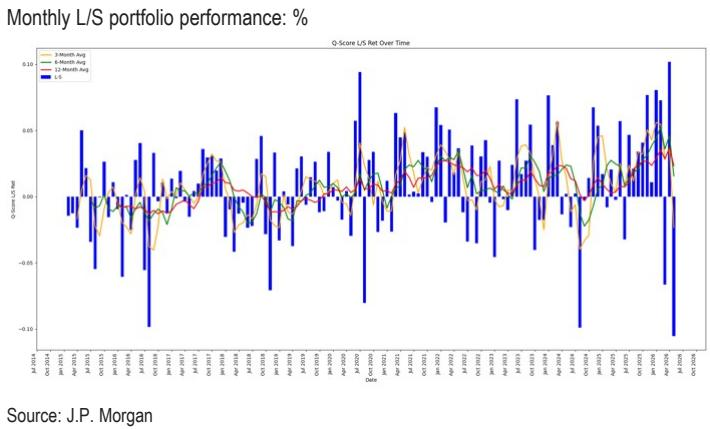

line chart

| Date       | 3-Month Avg | 6-Month Avg | 12-Month Avg | LS    |
|------------|-------------|-------------|--------------|-------|
| Oct 2014   | -           | -           | -            | -     |
| Jan 2015   | -           | -           | -            | -     |
| Apr 2015   | -           | -           | -            | -     |
| Jul 2015   | -           | -           | -            | -     |
| Oct 2015   | -           | -           | -            | -     |
| Jan 2016   | -           | -           | -            | -     |
| Apr 2016   | -           | -           | -            | -     |
| Jul 2016   | -           | -           | -            | -     |
| Oct 2016   | -           | -           | -            | -     |
| Jan 2017   | -           | -           | -            | -     |
| Apr 2017   | -           | -           | -            | -     |
| Jul 2017   | -           | -           | -            | -     |
| Oct 2017   | -           | -           | -            | -     |
| Jan 2018   | -           | -           | -            | -     |
| Apr 2018   | -           | -           | -            | -     |
| Jul 2018   | -           | -           | -            | -     |
| Oct 2018   | -           | -           | -            | -     |
| Jan 2019   | -           | -           | -            | -     |
| Apr 2019   | -           | -           | -            | -     |
| Jul 2019   | -           | -           | -            | -     |
| Oct 2019   | -           | -           | -            | -     |
| Jan 2020   | -           | -           | -            | -     |
| Apr 2020   | -           | -           | -            | -     |
| Jul 2020   | -           | -           | -            | -     |
| Oct 2020   | -           | -           | -            | -     |
| Jan 2021   | -           | -           | -            | -     |
| Apr 2021   | -           | -           | -            | -     |
| Jul 2021   | -           | -           | -            | -     |
| Oct 2021   | -           | -           | -            | -     |
| Jan 2022   | -           | -           | -            | -     |
| Apr 2022   | -           | -           | -            | -     |
| Jul 2022   | -           | -           | -            | -     |
| Oct 2022   | -           | -           | -            | -     |
| Jan 2023   | -           | -           | -            | -     |
| Apr 2023   | -           | -           | -            | -     |
| Jul 2023   | -           | -           | -            | -     |
| Oct 2023   | -           | -           | -            | -     |
| Jan 2024   | -           | -           | -            | -     |
| Apr 2024   | -           | -           | -            | -     |
| Jul 2024   | -           | -           | -            | -     |
| Oct 2024   | -           | -           | -            | -     |
| Jan 2025   | -           | -           | -            | -     |
| Apr 2025   | -           | -           | -            | -     |
| Jul 2025   | -           | -           | -            | -     |
| Oct 2025   | -           | -           | -            | -     |
| Jan 2026   | -           | -           | -            | ~-0.10% |
| Apr 2026   | ~-0.05%    | ~-0.05%     | ~-0.05%      | ~-0.15% |
| Jul 2026   | ~-0.15%    | ~-0.15%     | ~-0.15%      | ~-0.35% |
| Oct 2026   | ~-0.35%    | ~-0.35%     | ~-0.35%      | ~-0.65% |
Source: JPM

Momentum's valuation spread remained expensive. Since the beginning of the year, leadership has become increasingly entrenched, and the valuation premium of popular names appears to have continued to widen.

We examine the characteristics of the long-short portfolios for May's best-performing factors, Momentum and Size (L-S), as well as the worst-performing factors, Low Vol and Q-score, from two perspectives: valuation spread (P/B) and risk spread (Beta).

Figure 15: P/B Spread of Momentum (High vs. Low Return)  
The Y axis is P/B that is Z-Scored and flipped – the higher the Z-score, the cheaper the L/S portfolio is on P/B.  
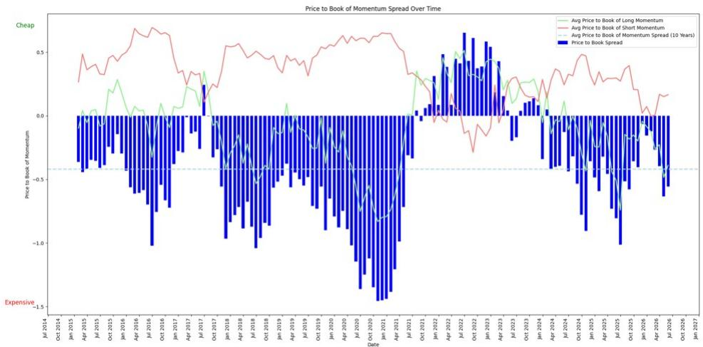

line chart

| Date | Avg Price to Book of Long Momentum | Avg Price to Book of Short Momentum | Avg Price to Book of Momentum Spread (10 Years) |
| --- | --- | --- | --- |
| Jul-2014 | ~0.0 | ~0.3 | ~-0.3 |
| Oct-2014 | ~0.0 | ~0.4 | ~-0.4 |
| Jan-2015 | ~0.0 | ~0.5 | ~-0.5 |
| Apr-2015 | ~0.0 | ~0.6 | ~-0.6 |
| Jul-2015 | ~0.0 | ~0.7 | ~-0.7 |
| Oct-2015 | ~0.0 | ~0.8 | ~-0.8 |
| Jan-2016 | ~0.0 | ~0.9 | ~-0.9 |
| Apr-2016 | ~0.0 | ~1.0 | ~-1.0 |
| Jul-2016 | ~0.0 | ~1.1 | ~-1.1 |
| Oct-2016 | ~0.0 | ~1.2 | ~-1.2 |
| Jan-2017 | ~0.0 | ~1.3 | ~-1.3 |
| Apr-2017 | ~0.0 | ~1.4 | ~-1.4 |
| Jul-2017 | ~0.0 | ~1.5 | ~-1.5 |
| Oct-2017 | ~0.0 | ~1.6 | ~-1.6 |
| Jan-2018 | ~0.0 | ~1.7 | ~-1.7 |
| Apr-2018 | ~0.0 | ~1.8 | ~-1.8 |
| Jul-2018 | ~0.0 | ~1.9 | ~-1.9 |
| Oct-2018 | ~0.0 | ~2.0 | ~-2.0 |
| Jan-2019 | ~0.0 | ~2.1 | ~-2.1 |
| Apr-2019 | ~0.0 | ~2.2 | ~-2.2 |
| Jul-2019 | ~0.0 | ~2.3 | ~-2.3 |
| Oct-2019 | ~0.0 | ~2.4 | ~-2.4 |
| Jan-2020 | ~0.0 | ~2.5 | ~-2.5 |
| Apr-2020 | ~0.0 | ~2.6 | ~-2.6 |
| Jul-2020 | ~0.0 | ~2.7 | ~-2.7 |
| Oct-2020 | ~0.0 | ~2.8 | ~-2.8 |
| Jan-2021 | ~0.0 | ~2.9 | ~-2.9 |
| Apr-2021 | ~0.0 | ~3.0 | ~-3.0 |
| Jul-2021 | ~0.0 | ~3.1 | ~-3.1 |
| Oct-2021 | ~0.0 | ~3.2 | ~-3.2 |
| Jan-2022 | ~0.0 | ~3.3 | ~-3.3 |
| Apr-2022 | ~0.0 | ~3.4 | ~-3.4 |
| Jul-2022 | ~0.0 | ~3.5 | ~-3.5 |
| Oct-2022 | ~0.0 | ~3.6 | ~-3.6 |
| Jan-2023 | ~0.0 | ~3.7 | ~-3.7 |
| Apr-2023 | ~0.0 | ~3.8 | ~-3.8 |
| Jul-2023 | ~0.0 | ~3.9 | ~-3.9 |
| Oct-2023 | ~0.0 | ~4.0 | ~-4.0 |
| Jan-2024 | ~0.0 | ~4.1 | ~-4.1 |
| Apr-2024 | ~0.0 | ~4.2 | ~-4.2 |
| Jul-2024 | ~0.0 | ~4.3 | ~-4.3 |
| Oct-2024 | ~0.0 | ~4.4 | ~-4.4 |
| Jan-2025 | ~0.0 | ~4.5 | ~-4.5 |
| Apr-2025 | ~0.0 | ~4.6 | ~-4.6 |
| Jul-2025 | ~0.0 | ~4.7 | ~-4.7 |
| Oct-2025 | ~0.0 | ~4.8 | ~-4.8 |
| Jan-2026 | ~0.0 | ~4.9 | ~-4.9 |
| Apr-2026 | ~0.0 | ~5.0 | ~-5.0 |
| Jul-2026 | ~0.0 | ~5.1 | ~-5.1 |
| Oct-2026 | ~0.0 | ~5.2 | ~-5.2 |
| Jan-2027 | ~0.0 | ~5.3 | ~-5.3 |
| Apr-2027 | ~0.0 | ~5.4 | ~-5.4 |
| Jul-2027 | ~0.0 | ~5.5 | ~-5.5 |
| Oct-2027 | ~0.0 | ~5.6 | ~-5.6 |
| Jan-2028 | ~0.0 | ~5.7 | ~-5.7 |
| Apr-2028 | ~0.0 | ~5.8 | ~-5.8 |
| Jul-2028 | ~0.0 | ~5.9 | ~-5.9 |
| Oct-2028 | ~0.0 | ~6.0 | ~-6.0 |
| Jan-2029 | ~0.0 | ~6.1 | ~-6.1 |
| Apr-2029 | ~0.0 | ~6.2 | ~-6.2 |
| Jul-2029 | ~0.0 | ~6.3 | ~-6.3 |
| Oct-2029 | ~0.0 | ~6.4 | ~-6.4 |
| Jan-2030 | ~0.0 | ~6.5 | ~-6.5 |
| Apr-2031 | ~0.0 | ~6.6 | ~-6.6 |
| Jul-2031 | ~0.0 | ~6.7 | ~-6.7 |
| Oct-2031 | ~0.0 | ~6.8 | ~-6.8 |
| Jan-2031* | ~0.0 | ~6.9 | (~7) |
| Apr-2031* | (~1) | (~7) | (~8) |
| Jul-2031* | (~1) | (~8) | (~9) |
| Oct-2031* | (~1) | (~9) | (~1) |
| Jan-2032* | (~1) | (~1) | (~1) |
| Apr-2032* | (~1) | (~1) | (~1) |
| Jul-2032* | (~1) | (~1) | (~1) |
| Oct-2032* | (~1) | (~1) | (~1) |
| Jan-2033* | (~1) | (~1) | (~1) |
| Apr-2033* | (~1) | (~1) | (~1) |
| Jul-2033* | (~1) | (~1) | (~1) |
| Oct-2033* | (~1) | (~1) | (~1) |
| Jan-2034* | (~1) | (~1) | (~1) |

Source: JPM

The valuation spread for Size (L-S) became more expensive, reaching its highest level since 2021. This suggests that investor preference remains concentrated in large-cap semiconductor-related names.

Figure 16: P/B Spread of Size (Large vs. SMid caps)  
The Y axis is P/B that is Z-Scored and flipped – the higher the Z-score, the cheaper the L/S portfolio is on P/B.  
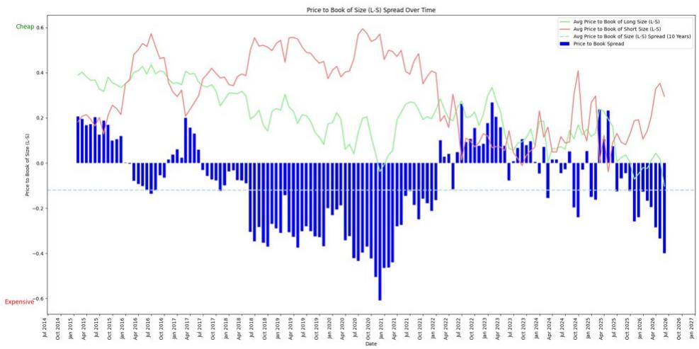

line chart

| Date | Price to Book of Size (L-S) | Avg Price to Book of Long Size (L-S) | Avg Price to Book of Short Size (L-S) | Avg Price to Book of Size (L-S) Spread (10 Years) | Price to Book Spread |
| --- | --- | --- | --- | --- | --- |
| Jul 2014 | ~0.4 | ~0.3 | ~0.2 | ~0.1 | ~0.2 |
| Oct 2014 | ~0.35 | ~0.35 | ~0.25 | ~0.15 | ~0.15 |
| Jan 2015 | ~0.3 | ~0.3 | ~0.2 | ~0.1 | ~0.1 |
| Apr 2015 | ~0.25 | ~0.35 | ~0.25 | ~0.15 | ~0.15 |
| Jul 2015 | ~0.2 | ~0.35 | ~0.25 | ~0.15 | ~0.15 |
| Oct 2015 | ~0.15 | ~0.35 | ~0.25 | ~0.15 | ~0.15 |
| Jan 2016 | ~0.1 | ~0.35 | ~0.25 | ~0.15 | ~0.15 |
| Apr 2016 | ~0.05 | ~0.35 | ~0.25 | ~0.15 | ~0.15 |
| Jul 2016 | ~0.0 | ~0.35 | ~0.25 | ~0.15 | ~0.15 |
| Oct 2016 | ~-0.05 | ~0.35 | ~0.25 | ~0.15 | ~0.15 |
| Jan 2017 | ~-0.1 | ~0.35 | ~0.25 | ~0.15 | ~0.15 |
| Apr 2017 | ~-0.15 | ~0.35 | ~0.25 | ~0.15 | ~0.15 |
| Jul 2017 | ~-0.2 | ~0.35 | ~0.25 | ~0.15 | ~0.15 |
| Oct 2017 | ~-0.25 | ~0.35 | ~0.25 | ~0.15 | ~0.15 |
| Jan 2018 | ~-0.3 | ~0.35 | ~0.25 | ~0.15 | ~0.15 |
| Apr 2018 | ~-0.35 | ~0.35 | ~0.25 | ~0.15 | ~0.15 |
| Jul 2018 | ~-0.4 | ~0.35 | ~0.25 | ~0.15 | ~0.15 |
| Oct 2018 | ~-0.45 | ~0.35 | ~0.25 | ~0.15 | ~0.15 |
| Jan 2019 | ~-0.5 | ~0.35 | ~0.25 | ~0.15 | ~0.15 |
| Apr 2019 | ~-0.55 | ~0.35 | ~0.25 | ~0.15 | ~0.15 |
| Jul 2019 | ~-0.6 | ~0.35 | ~0.25 | ~0.15 | ~0.15 |
| Oct 2019 | ~-0.6 | ~0.35 | ~0.25 | ~0.15 | ~0.15 |
| Jan 2020 | ~-0.6 | ~0.35 | ~0.25 | ~0.15 | ~0.15 |
| Apr 2020 | ~-0.6 | ~0.35 | ~0.25 | ~0.15 | ~0.15 |
| Jul 2020 | ~-0.6 | ~0.35 | ~0.25 | ~0.15 | ~0.15 |
| Oct 2020 | ~-0.6 | ~0.35 | ~0.25 | ~0.15 | ~0.15 |
| Jan 2021 | ~-0.6 | ~0.35 | ~0.25 | ~0.15 | ~-0.6 |
| Apr 2021 | ~-0.6 | ~0.35 | ~0.25 | ~0.15 | ~-0.6 |
| Jul 2021 | ~-0.6 | ~0.35 | ~0.25 | ~0.15 | ~-0.6 |
| Oct 2021 | ~-0.6 | ~0.35 | ~0.25 | ~0.15 | ~-0.6 |
| Jan 2022 | ~-0.6 | ~0.35 | ~0.25 | ~0.15 | ~-0.6 |
| Apr 2022 | ~-0.6 | ~0.35 | ~0.25 | ~0.15 | ~-0.6 |
| Jul 2022 | ~-0.6 | ~0.35 | ~0.25 | ~- | - |
| Oct 2022 | ~- | - | - | - | - |
| Jan 2023 | - | - | - | - | - |
| Apr 2023 | - | - | - | - | - |
| Jul 2023 | - | - | - | - | - |
| Oct 2023 | - | - | - | - | - |
| Jan 2024 | - | - | - | - | - |
| Apr 2024 | - | - | - | - | - |
| Jul 2024 | - | - | - | - | - |
| Oct 2024 | - | - | - | - | - |
| Jan 2025 | - | - | - | - | - |
| Apr 2025 | - | - | - | - | - |
| Jul 2025 | - | - | - | - | - |
| Oct 2025 | - | - | - | - | - |
| Jan 2026 | - | - | - | - | - |
| Apr 2026 | - | - | - | - | - |
| Jul 2026 | - | - | - | - | - |
| Oct 2026 | - | - | - | - | - |
| Jan 2027 | - | - | - | - | - |

Source: JPM

Low Vol's valuation spread became even cheaper relative to its 10-year average, as defensive names continued to underperform

Figure 17: P/B Spread of Low Vol (Low vs. High Volatility)  
The Y axis is P/B that is Z-Scored and flipped – the higher the Z-score, the cheaper the L/S portfolio is on P/B.  
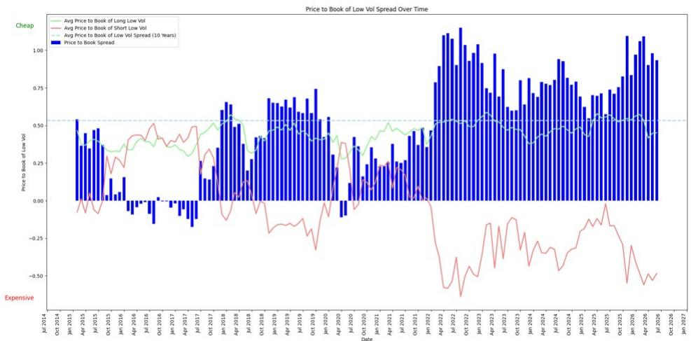

bar-line hybrid

Price to Book of Low Vol Spread Over Time
| Date | Price to Book of Long Low Vol | Price to Book of Short Low Vol | Price to Book of Low Vol Spread (10 Years) |
|---|---|---|---|
| Jul-2014 | 0.50 | 0.00 | 0.50 |
| Oct-2014 | 0.50 | 0.00 | 0.50 |
| Jan-2015 | 0.50 | 0.00 | 0.50 |
| Apr-2015 | 0.50 | 0.00 | 0.50 |
| Jul-2015 | 0.50 | 0.00 | 0.50 |
| Oct-2015 | 0.50 | 0.00 | 0.50 |
| Jan-2016 | 0.50 | 0.00 | 0.50 |
| Apr-2016 | 0.50 | 0.00 | 0.50 |
| Jul-2016 | 0.50 | 0.00 | 0.50 |
| Oct-2016 | 0.50 | 0.00 | 0.50 |
| Jan-2017 | 0.50 | 0.00 | 0.50 |
| Apr-2017 | 0.50 | 0.00 | 0.50 |
| Jul-2017 | 0.50 | 0.00 | 0.50 |
| Oct-2017 | 0.50 | 0.00 | 0.50 |
| Jan-2018 | 0.50 | 0.00 | 0.50 |
| Apr-2018 | 0.50 | 0.00 | 0.50 |
| Jul-2018 | 0.50 | 0.00 | 0.50 |
| Oct-2018 | 0.50 | 0.00 | 0.50 |
| Jan-2019 | 0.50 | 0.00 | 0.50 |
| Apr-2019 | 0.50 | 0.00 | 0.50 |
| Jul-2019 | 0.50 | 0.00 | 0.50 |
| Oct-2019 | 0.50 | 0.00 | 0.50 |
| Jan-2020 | 0.50 | 0.00 | 0.50 |
| Apr-2020 | 0.50 | 0.00 | 0.50 |
| Jul-2020 | 0.50 | 0.00 | 0.50 |
| Oct-2020 | 0.50 | 0.00 | 0.50 |
| Jan-2021 | 0.50 | 0.00 | 0.50 |
| Apr-2021 | 0.50 | 0.00 | 0.50 |
| Jul-2021 | 0.50 | 0.00 | 0.50 |
| Oct-2021 | 0.50 | 0.00 | 0.50 |
| Jan-2022 | 0.50 | 0.00 | 0.50 |
| Apr-2022 | 1.33 | -13.33 | -13.33 |
| Jul-23/22 | -13.33 | -44.44 | -44.44 |
| Oct-23/22 | -44.44 | -77.64 | -77.64 |
| Jan-23/23 | -77.64 | -118.84 | -118.84 |
| Apr-23/23 | -118.84 | -169.94 | -169.94 |
| Jul-23/23 | -169.94 | -231.14 | -231.14 |
| Oct-23/23 | -231.14 | -313.34 | -313.34 |
| Jan-23/24e<fcel>-313.34e<fcel>-436.64e<fcel>-436.64e |
| Apr-23/24e<fcel>-436.64e<fcel>-679.84e<fcel>-679.84e |
| Jul-23/24e<fcel>-679.84e<fcel>-933.14e<fcel>-933.14e |
| Oct-23/24e<fcel>-933.14e<fcel>-1267.34e<fcel>-1267.34e |
| Jan-23/25e<fcel>-1267.34e<fcel>-1699.64e<fcel>-1699.64e |
| Apr-23/25e<fcel>-1699.64e<fcel>-2319.84e<fcel>-2319.84e |
| Jul-23/25e<fcel>-2319.84e<fcel>-3179.14e<fcel>-3179.14e |
| Oct-23/25e<fcel>-2319.84e<fcel>-4169.34e<fcel>-4169.34e |
| Jan-23/26e<fcel>-2319.84e<fcel>-5989.64e<fcel>-5989.64e |
| Apr-23/26e<fcel>-2319.84e<fcel>-7999.84e<fcel>-7999.84e |
| Jul-23/26e<fcel>-2319.84e<fcel>-11899.14e<fcel>-11899.14e |
| Oct-23/26e<fcel>-2319.84e<fcel>-16999.34e<fcel>-16999.34e |
| Jan-23/27e<fcel>-2319.84e<fcel>-23199.64e<fcel>-23199.64e |
| Apr-23/27e<fcel>-2319.84e<fcel>-31799.84e<fcel>-31799.84e |
| Jul-23/27e<fcel>-2319.84e<fcel>-41699.14e<fcel>-41699.14e |
| Oct-23/27e<fcel>-2319.84e<fcel>-59899.34e<fcel>-59899.34e |
| Jan-23/28e<fcel>-2319.84e<fcel>-79999.64e<fcel>-79999.64e |
| Apr-23/28e<fcel>-2319.84e<fcel>-118999.84e<fcel>-118999.84e |
| Jul-23/28e<fcel>-2319.84e<fcel>-169999.14e<fcel>-169999.14e |
| Oct-23/28e<fcel>-2319.84e<fcel>-231999.34e<fcel>-231999.34e |
| Jan-23/29e<fcel>-2319.84e<fcel>-317999.64e<fcel>-317999.64e |
| Apr-23/29e<fcel>-2319.84e<fcel>-416999.84e<fcel>-416999.84e |
| Jul-23/29e<fcel>-2319.84e<fcel>-598999.14e<fcel>-598999.14e |
| Oct-23/29e<fcel>-2319.84e<fcel>-799999.34e<fcel>-799999.34e |
| Jan-23/3/3c e<fcel>-2319<ecel><ecel><nl>

Source: JPM

Q-score's valuation spread remained somewhat expensive. The underperformance of the multi-factor style was relatively unusual.

Figure 18: P/B Spread of Q-scores (Multi-factor model)  
The Y axis is P/B that is Z-Scored and flipped – the higher the Z-score, the cheaper the L/S portfolio is on P/B.  
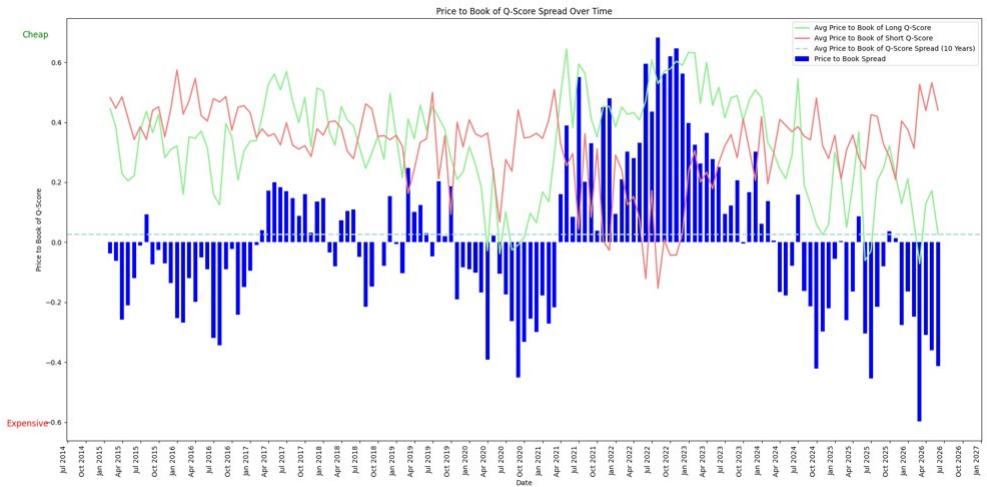

line chart

| Date | Price to Book of Q-Score (Long Q-Score) | Price to Book of Q-Score (Short Q-Score) | Price to Book of Q-Score (10 Years) |
| --- | --- | --- | --- |
| Jul 2014 | ~0.5 | ~0.4 | - |
| Jan 2015 | ~0.4 | ~0.3 | - |
| Apr 2015 | ~0.3 | ~0.2 | - |
| Jul 2015 | ~0.2 | ~0.1 | - |
| Oct 2015 | ~0.1 | ~0.0 | - |
| Jan 2016 | ~0.0 | ~0.1 | - |
| Apr 2016 | ~0.1 | ~0.2 | - |
| Jul 2016 | ~0.2 | ~0.3 | - |
| Oct 2016 | ~0.3 | ~0.4 | - |
| Jan 2017 | ~0.4 | ~0.5 | - |
| Apr 2017 | ~0.5 | ~0.6 | - |
| Jul 2017 | ~0.6 | ~0.7 | - |
| Oct 2017 | ~0.5 | ~0.6 | - |
| Jan 2018 | ~0.4 | ~0.5 | - |
| Apr 2018 | ~0.3 | ~0.4 | - |
| Jul 2018 | ~0.2 | ~0.3 | - |
| Oct 2018 | ~0.1 | ~0.2 | - |
| Jan 2019 | ~0.0 | ~0.1 | - |
| Apr 2019 | ~0.1 | ~0.2 | - |
| Jul 2019 | ~0.2 | ~0.3 | - |
| Oct 2019 | ~0.3 | ~0.4 | - |
| Jan 2020 | ~0.4 | ~0.5 | - |
| Apr 2020 | ~0.5 | ~0.6 | - |
| Jul 2020 | ~0.6 | ~0.7 | - |
| Oct 2020 | ~0.5 | ~0.6 | - |
| Jan 2021 | ~0.4 | ~0.5 | - |
| Apr 2021 | ~0.3 | ~0.4 | - |
| Jul 2021 | ~0.2 | ~0.3 | - |
| Oct 2021 | ~0.1 | ~0.2 | - |
| Jan 2022 | ~0.0 | ~0.1 | - |
| Apr 2022 | ~0.1 | ~0.2 | - |
| Jul 2022 | ~0.2 | ~0.3 | - |
| Oct 2022 | ~0.3 | ~0.4 | - |
| Jan 2023 | ~0.4 | ~0.5 | - |
| Apr 2023 | ~0.5 | ~0.6 | - |
| Jul 2023 | ~0.6 | ~0.7 | - |
| Oct 2023 | ~0.5 | ~0.6 | - |
| Jan 2024 | ~0.4 | ~0.5 | - |
| Apr 2024 | ~0.3 | ~0.4 | - |
| Jul 2024 | ~0.2 | ~0.3 | - |
| Oct 2024 | ~0.1 | ~0.2 | - |
| Jan 2025 | ~0.0 | ~0.1 | - |
| Apr 2025 | ~-0.1 | ~-0.1 | - |
| Jul 2025 | ~-0.2 | ~-0.2 | - |
| Oct 2025 | ~-0.3 | ~-0.3 | - |
| Jan 2026 | ~-0.4 | ~-0.4 | - |
| Apr 2026 | ~-0.5 | ~-0.5 | - |
| Jul 2026 | ~-0.6 | ~-0.6 | - |
| Oct 2026 | ~-0.5 | ~-0.5 | - |
| Jan 2027 | ~-0.4 | ~-0.4 | - |
| Apr 2027 | ~-0.3 | ~-0.3 | - |
| Jul 2027 | ~-0.2 | ~-0.2 | - |
| Oct 2027 | ~-0.1 | ~-0.1 | - |
| Jan 2028 | 0 | 0 | - |
| Apr 2028 | 1 | 1 | - |
| Jul 2028 | 2 | 2 | - |
| Oct 2028 | 3 | 3 | - |
| Jan 2029 | 4 | 4 | - |
| Apr 2029 | 5 | 5 | - |
| Jul 2029 | 6 | 6 | - |
| Oct 2029 | 7 | 7 | - |
| Jan 2030 | 8 | 8 | - |
| Apr 2030 | 9 | 9 | - |
| Jul 2030 | 10 | 10 | - |
| Oct 2030 | 11 | 11 | - |
| Jan 2031 | 12 | 12 | - |
| Apr 2031 | 13 | 13 | - |
| Jul 2031 | 14 | 14 | - |
| Oct 2031 | 15 | 15 | - |
| Jan 2032 | 16 | 16 | - |
| Apr 2032 | 17 | 17 | - |
| Jul 2032 | 18 | 18 | - |
| Oct 2032 | 19 | 19 | - |
| Jan 2033 | 20 | 20 | - |
| Apr 2033 | 21 | 21 | - |
| Jul 2033 | 22 | 22 | - |
| Oct 2033 | 23 | 23 | - |
| Jan 2034 | 24 | 24 | - |
| Apr 2034 | 25 | 25 | - |
| Jul 2034 | 26 | 26 | - |
| Oct 2034 | 27 | 27 | - |
| Jan 2035 | 28 | 28 | - |
| Apr 2035 | 29 | 29 | - |
| Jul 2035 | 30 | 30 | - |
| Oct 2035 | 31 | 31 | - |
| Jan 2036 | 32 | 32 | - |
| Apr 2036 | 33 | 33 | - |
| Jul 2036 | 34 | 34 | - |
| Oct 2036 | 35 | 35 | - |
| Jan 2037 | 36 | 36 | - |
| Apr 2037 | 37 | 37 | - |
| Jul 2037 | 38 | 38 | - |
| Oct 2037 | 39 | 39 | - |
| Jan 2038 | 40 | 40 | - |
| Apr 2038 | 41 | 41 | - |
| Jul 2038 | 42 | 42 | - |
| Oct 2038 | 43 | 43 | - |
| Jan 2039 | 44 | 44 | - |
| Apr 2039 | 45 | 45 | - |
| Jul 2039 | 46 | 46 | - |
| Oct 2039 | 47 | 47 | - |
| Jan 2040 | 48 | 48 | - |
| Apr 2040 | 49 | 49 | - |
| Jul 2040 | 50 | 50 | - |
| Oct 2040 | 51 | 51 | - |
| Jan 2041 | 52 | 52 | - |
| Apr 2041 | 53 | 53 | - |
| Jul 2041 | 54 | 54 | - |
| Oct 2041 | 55 | 55 | - |
| Jan 2042 | 56 | 56 | - |
| Apr 2042 | 57 | 57 | - |
| Jul 2042 | 58 | 58 | - |
| Oct 2042 | 59 | 59 | - |
| Jan 2043 | 60 | 60 | - |

Source: JPM

Momentum's risk spread reached a record tilt toward high beta. Low-beta names appear to have been increasingly shorted, while high-beta names were added on the long side.

Figure 19: Beta Spread of Momentum (High vs. Low Return)  
The Y axis is Beta that is Z-Scored – the higher the Z-score, the higher the L/S portfolio is on Beta.  
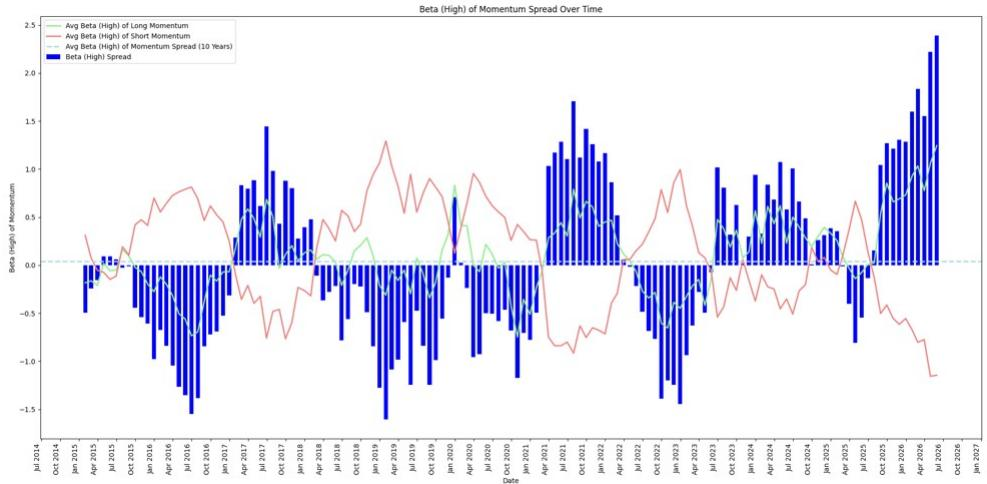

line chart

| Date | Avg Beta (High) of Long Momentum | Avg Beta (High) of Short Momentum | Avg Beta (High) of Momentum Spread (10 Years) |
| --- | --- | --- | --- |
| Jul 2014 | -0.5 | -0.3 | -0.8 |
| Oct 2014 | -0.2 | -0.1 | -0.6 |
| Jan 2015 | 0.1 | 0.2 | -0.4 |
| Apr 2015 | 0.3 | 0.4 | -0.2 |
| Jul 2015 | 0.5 | 0.6 | 0.0 |
| Oct 2015 | 0.7 | 0.8 | 0.2 |
| Jan 2016 | 0.9 | 1.0 | 0.4 |
| Apr 2016 | 1.1 | 1.2 | 0.6 |
| Jul 2016 | 1.3 | 1.4 | 0.8 |
| Oct 2016 | 1.5 | 1.6 | 1.0 |
| Jan 2017 | 1.7 | 1.8 | 1.2 |
| Apr 2017 | 1.9 | 2.0 | 1.4 |
| Jul 2017 | 2.1 | 2.2 | 1.6 |
| Oct 2017 | 2.3 | 2.4 | 1.8 |
| Jan 2018 | 2.5 | 2.6 | 2.0 |
| Apr 2018 | 2.7 | 2.8 | 2.2 |
| Jul 2018 | 2.9 | 3.0 | 2.4 |
| Oct 2018 | 3.1 | 3.2 | 2.6 |
| Jan 2019 | 3.3 | 3.4 | 2.8 |
| Apr 2019 | 3.5 | 3.6 | 3.0 |
| Jul 2019 | 3.7 | 3.8 | 3.2 |
| Oct 2019 | 3.9 | 4.0 | 3.4 |
| Jan 2020 | 4.1 | 4.2 | 3.6 |
| Apr 2020 | 4.3 | 4.4 | 3.8 |
| Jul 2020 | 4.5 | 4.6 | 4.0 |
| Oct 2020 | 4.7 | 4.8 | 4.2 |
| Jan 2021 | 4.9 | 5.0 | 4.4 |
| Apr 2021 | 5.1 | 5.2 | 4.6 |
| Jul 2021 | 5.3 | 5.4 | 4.8 |
| Oct 2021 | 5.5 | 5.6 | 5.0 |
| Jan 2022 | 5.7 | 5.8 | 5.2 |
| Apr 2022 | 5.9 | 6.0 | 5.4 |
| Jul 2022 | 6.1 | 6.2 | 5.6 |
| Oct 2022 | 6.3 | 6.4 | 5.8 |
| Jan 2023 | 6.5 | 6.6 | 6.0 |
| Apr 2023 | 6.7 | 6.8 | 6.2 |
| Jul 2023 | 6.9 | 7.0 | 6.4 |
| Oct 2023 | 7.1 | 7.2 | 6.6 |
| Jan 2024 | 7.3 | 7.4 | 6.8 |
| Apr 2024 | 7.5 | 7.6 | 7.0 |
| Jul 2024 | 7.7 | 7.8 | 7.2 |
| Oct 2024 | 7.9 | 8.0 | 7.4 |
| Jan 2025 | 8.1 | 8.2 | 7.6 |
| Apr 2025 | 8.3 | 8.4 | 7.8 |
| Jul 2025 | 8.5 | 8.6 | 8.0 |
| Oct 2025 | 8.7 | 8.8 | 8.2 |
| Jan 2026 | 8.9 | 9.0 | 8.4 |
| Apr 2026 | 9.1 | 9.2 | 8.6 |
| Jul 2026 | 9.3 | 9.4 | 8.8 |
| Oct 2026 | 9.5 | 9.6 | 9.0 |
| Jan 2027 | -1.5 | -1.3 | -1.1 |

Source: JPM

There was no particularly notable move in the risk spread for Size (L-S), although the factor remains visibly tilted toward high beta.

Figure 20: Beta Spread of Size (Large vs. SMid caps)  
The Y axis is Beta that is Z-Scored – the higher the Z-score, the higher the L/S portfolio is on Beta.  
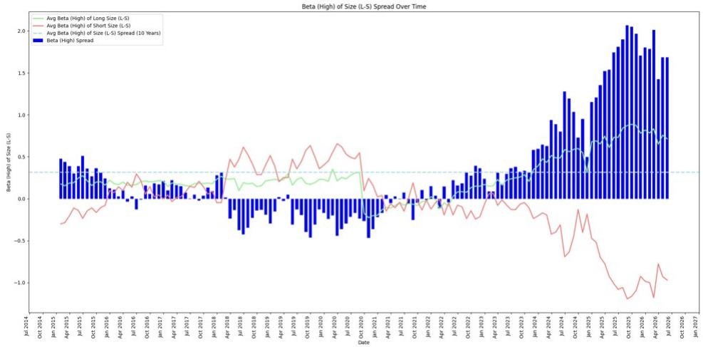

line chart

| Date | Avg Beta (High) of Long Size (L-SI) | Avg Beta (High) of Short Size (L-SI) | Avg Beta (High) of Size (L-SI) Spread (10 Years) | Beta (High) Spread |
| --- | --- | --- | --- | --- |
| Jul 2014 | - | - | - | - |
| Oct 2014 | - | - | - | - |
| Jan 2015 | - | - | - | - |
| Apr 2015 | - | - | - | - |
| Jul 2015 | - | - | - | - |
| Oct 2015 | - | - | - | - |
| Jan 2016 | - | - | - | - |
| Apr 2016 | - | - | - | - |
| Jul 2016 | - | - | - | - |
| Oct 2016 | - | - | - | - |
| Jan 2017 | - | - | - | - |
| Apr 2017 | - | - | - | - |
| Jul 2017 | - | - | - | - |
| Oct 2017 | - | - | - | - |
| Jan 2018 | - | - | - | - |
| Apr 2018 | - | - | - | - |
| Jul 2018 | - | - | - | - |
| Oct 2018 | - | - | - | - |
| Jan 2019 | - | - | - | - |
| Apr 2019 | - | - | - | - |
| Jul 2019 | - | - | - | - |
| Oct 2019 | - | - | - | - |
| Jan 2020 | - | - | - | - |
| Apr 2020 | - | - | - | - |
| Jul 2020 | - | - | - | - |
| Oct 2020 | - | - | - | - |
| Jan 2021 | - | - | - | - |
| Apr 2021 | - | - | - | - |
| Jul 2021 | - | - | - | - |
| Oct 2021 | - | - | - | - |
| Jan 2022 | - | - | - | - |
| Apr 2022 | - | - | - | - |
| Jul 2022 | - | - | - | - |
| Oct 2022 | - | - | - | - |
| Jan 2023 | - | - | - | - |
| Apr 2023 | - | - | - | - |
| Jul 2023 | - | - | - | - |
| Oct 2023 | - | - | - | - |
| Jan 2024 | - | - | - | ~0.5 |
| Apr 2024 | ~0.5 | ~-0.5 | ~-0.5 | ~-0.5 |
| Jul 2024 | ~1.0 | ~-1.0 | ~-1.0 | ~-1.0 |
| Oct 2024 | ~1.5 | ~-1.5 | ~-1.5 | ~-1.5 |
| Jan 2025 | ~1.8 | ~-1.8 | ~-1.8 | ~-1.8 |
| Apr 2025 | ~1.6 | ~-1.6 | ~-1.6 | ~-1.6 |
| Jul 2025 | ~1.4 | ~-1.4 | ~-1.4 | ~-1.4 |
| Oct 2025 | ~1.6 | ~-1.6 | ~-1.6 | ~-1.6 |
| Jan 2026 | ~1.8 | ~-1.8 | ~-1.8 | ~-1.8 |
| Apr 2026 | ~1.6 | ~-1.6 | ~-1.6 | ~-1.6 |
| Jul 2026 | ~1.4 | ~-1.4 | ~-1.4 | ~-1.4 |
| Oct 2026 | ~1.6 | ~-1.6 | ~-1.6 | ~-1.6 |
| Jan 2027 | ~1.8 | ~-1.8 | ~-1.8 | ~-1.8 |
| Apr 2027 | ~1.6 | ~-1.6 | ~-1.6 | ~-1.6 |
| Jul 2027 | ~1.4 | ~-1.4 | ~-1.4 | ~-1.4 |
| Oct 2027 | ~1.6 | ~-1.6 | ~-1.6 | ~-1.6 |
| Jan 2028 | ~1.8 | ~-1.8 | ~-1.8 | ~-1.8 |
| Apr 2028 | ~1.6 | ~-1.6 | ~-1.6 | ~-1.6 |
| Jul 2028 | ~1.4 | ~-1.4 | ~-1.4 | ~-1.4 |
| Oct 2028 | ~1.6 | ~-1.6 | ~-1.6 | ~-1.6 |
| Jan 2029 | ~1.8 | ~-1.8 | ~-1.8 | ~-1.8 |
| Apr 2029 | ~1.6 | ~-1.6 | ~-1.6 | ~-1.6 |
| Jul 2030 | ~1.4 | ~-1.4 | ~-1.4 | ~-1.4 |
| Oct 2030 | ~1.6 | ~-1.6 | ~-1.6 | ~-1.6 |
| Jan 2030* | ~1.8 | ~-1.8 | ~-1.8 | ~-1.8 |
| Apr 2030* | ~1.6 | ~-1.6 | ~-1.6 | ~-1.6 |
| Jul 2030* | ~1.4 | ~-1.4 | ~-1.4 | ~-1.4 |
| Oct 2030* | ~1.6 | ~-1.6 | ~-1.6 | ~-1.6 |
| Jan 2031* | ~1.8 | ~-1.8 | ~-1.8 | ~-1.8 |
| Apr 2031* | ~1.6 | ~-1.6 | ~-1.6 | ~-1.6 |
| Jul 2031* | ~1.4 | ~-1.4 | ~-1.4 | ~-1.4 |
| Oct 2031* | ~1.6 | ~-1.6 | ~-1.6 | ~-1.6 |
| Jan 2032* | ~1.8 | ~-1.8 | ~-1.8 | ~-1.8 |
| Apr 2032* | ~1.6 | ~-1.6 | ~-1.6 | ~-1.6 |
| Jul 2032* | ~1.4 | ~-1.4 | ~-1.4 | ~-1.4 |
| Oct 2032* | ~1.6 | ~-1.6 | ~-1.6 | ~-1.6 |
| Jan 2033* | ~1.8 | ~-1.8 | ~-1.8 | ~-1.8 |
| Apr 2033* | ~1.6 | ~-1.6 | ~-1.6 | ~-1.6 |
| Jul 2033* | ~1.4 | ~-1.4 | ~-1.4 | ~-1.4 |
| Oct 2033* | ~1.6 | ~-1.6 | ~-1.6 | ~-1.6 |
| Jan 2034* | ~1.8 | ~-1.8 | ~-1.8 | ~-1.8 |
| Apr 2034* | ~1.6 | ~-1.6 | ~-1.6 | ~-1.6 |
| Jul 2034* | ~1.4 | ~-1.4 | ~-1.4 | ~-1.4 |
| Oct 2034* | ~1.6 | ~-1.6 | ~-1.6 | ~-1.6 |
| Jan 2035* | ~1.8 | ~-1.8 | ~-1.8 | ~-1.8 |
| Apr 2035* | ~1.6 | ~-1.6 | ~-1.6 | ~-1.6 |
| Jul 2035* | ~1.4 | ~-1.4 | ~-1.4 | ~-1.4 |

Source: JPM

Low Vol's risk spread declined further relative to its 10-year average. Its tilt toward low beta is now around the strongest level in roughly two years.

Q-score's risk spread declined slightly relative to its 10-year average. On a smoothed basis, however, it remains somewhat tilted toward high beta.

Figure 21: Beta Spread of Low Vol (Low vs. High Volatility)  
The Y axis is Beta that is Z-Scored – the higher the Z-score, the higher the L/S portfolio is on Beta.  
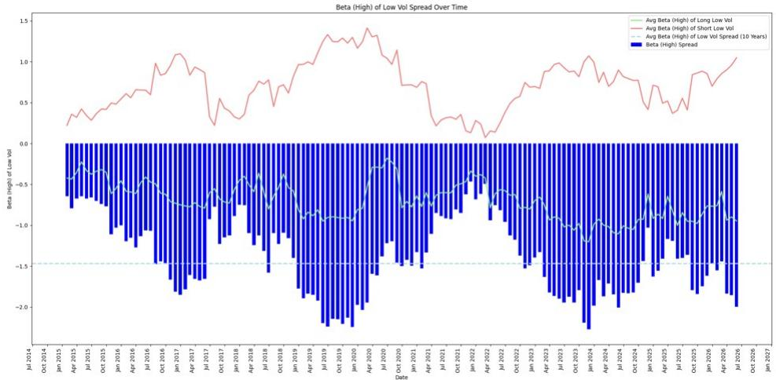  
Source: JPM

Figure 22: Beta Spread of Q-scores (Multi-factor model)  
The Y axis is Beta that is Z-Scored – the higher the Z-score, the higher the L/S portfolio is on Beta.  
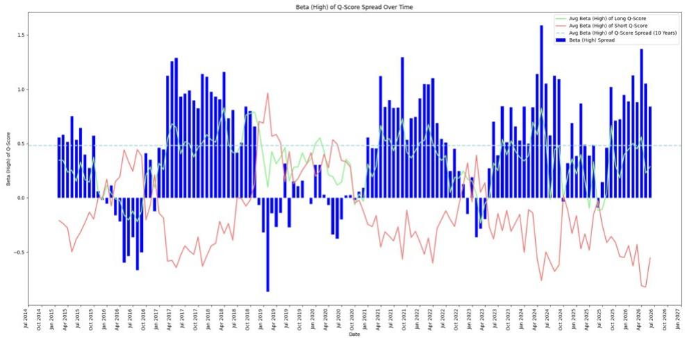

bar-line hybrid

Beta (High) of Q-Score Spread Over Time
| Date | Avg Beta (High) of Long Q-Score | Avg Beta (High) of Short Q-Score | Avg Beta (High) of Q-Score Spread (10 Years) |
|---|---|---|---|
| Jul-2014 | 0.5 | 0.5 | 0.5 |
| Oct-2014 | 0.6 | -0.3 | 0.6 |
| Jan-2015 | 0.7 | -0.4 | 0.7 |
| Apr-2015 | 0.6 | -0.2 | 0.8 |
| Jul-2015 | 0.5 | -0.1 | 0.6 |
| Oct-2015 | 0.4 | 0.1 | 0.5 |
| Jan-2016 | 0.3 | -0.1 | 0.4 |
| Apr-2016 | 0.2 | 0.2 | 0.3 |
| Jul-2016 | 0.1 | -0.3 | 0.2 |
| Oct-2016 | 0.3 | -0.2 | 0.4 |
| Jan-2017 | 0.4 | -0.1 | 0.5 |
| Apr-2017 | 0.7 | -0.4 | 1.3 |
| Jul-2017 | 0.8 | -0.3 | 1.2 |
| Oct-2017 | 0.9 | -0.2 | 1.1 |
| Jan-2018 | 1.0 | -0.3 | 1.2 |
| Apr-2018 | 1.1 | -0.2 | 1.3 |
| Jul-2018 | 1.2 | -0.1 | 1.4 |
| Oct-2018 | 1.3 | -0.2 | 1.5 |
| Jan-2019 | 1.4 | -0.3 | 1.6 |
| Apr-2019 | 1.5 | -0.4 | 1.7 |
| Jul-2019 | 1.6 | -0.5 | 1.8 |
| Oct-2019 | 1.7 | -0.6 | 1.9 |
| Jan-2020 | 1.8 | -0.7 | 2.0 |
| Apr-2020 | 1.9 | -0.8 | 2.1 |
| Jul-2020 | 2.0 | -0.9 | 2.2 |
| Oct-2020 | 2.1 | -1.0 | 2.3 |
| Jan-2021 | 2.2 | -1.1 | 2.4 |
| Apr-2021 | 2.3 | -1.2 | 2.5 |
| Jul-2021 | 2.4 | -1.3 | 2.6 |
| Oct-2021 | 2.5 | -1.4 | 2.7 |
| Jan-2022 | 2.6 | -1.5 | 2.8 |
| Apr-2022 | 2.7 | -1.6 | 2.9 |
| Jul-2022 | 2.8 | -1.7 | 3.0 |
| Oct-2022 | 2.9 | -1.8 | 3.1 |
| Jan-2023 | 3.0 | -1.9 | 3.2 |
| Apr-2023 | 3.1 | -2.0 | 3.3 |
| Jul-2023 | 3.2 | -2.1 | 3.4 |
| Oct-2023 | 3.3 | -2.2 | 3.5 |
| Jan-2024 | 3.4 | -2.3 | 3.6 |
| Apr-2024 | 3.5 | -2.4 | 3.7 |
| Jul-2024 | 3.6 | -2.5 | 3.8 |
| Oct-2024 | 3.7 | -2.6 | 3.9 |
| Jan-2025 | 3.8 | -2.7 | 4.0 |
| Apr-2025 | 3.9 | -2.8 | 4.1 |
| Jul-2025 | 4.0 | -2.9 | 4.2 |
| Oct-2025 | 4.1 | -3.0 | 4.3 |
| Jan-2026e<fcel>4.2e+(-)<fcel>-3.1e+(-)<fcel>4e+(-)<nl>

Source: JPM

## Sector-specific factor performance

Below we summarize major factor returns by sector in May.

At the overall market level, Momentum was the best-performing factor in May. By sector, Information Technology was the main driver, followed by Communication Services. These sectors included names that benefited from the AI boom. Size, which also outperformed, showed notable overlap with Momentum at the sector level.

On the other hand, Low Vol was the worst-performing factor across the market. Excluding Q-score, profitability-related styles such as ROE and Quality also performed poorly. Against a backdrop of inflation and rising JGB yields, defensive and high-valuation names continued to weigh on performance. Despite elevated long-term JGB yields, Value clearly lagged Momentum.

Figure 23: Sector-specific Factor Performance for Japan for May  
Deciles for MXJP, Quintiles for the Sectors. Monthly L/S portfolio performance: %

<table><tr><td>Factor</td><td>JP</td><td>Communication Services</td><td>Consumer Discretionary</td><td>Consumer Staples</td><td>Energy</td><td>Financials</td><td>Health Care</td><td>Industrials</td><td>Information Technology</td><td>Materials</td><td>Real Estate</td><td>Utilities</td></tr><tr><td>Momentum</td><td>6.4%</td><td>10.7%</td><td>4.1%</td><td>-1.0%</td><td>-16.9%</td><td>2.1%</td><td>-12.4%</td><td>-4.9%</td><td>19.6%</td><td>-0.7%</td><td>-7.8%</td><td>5.9%</td></tr><tr><td>Size (L-S)</td><td>6.3%</td><td>19.8%</td><td>7.4%</td><td>3.3%</td><td>-16.9%</td><td>6.7%</td><td>2.1%</td><td>-0.4%</td><td>20.5%</td><td>-14.7%</td><td>-10.7%</td><td>-14.3%</td></tr><tr><td>Beta (High)</td><td>6.2%</td><td>11.2%</td><td>7.6%</td><td>0.3%</td><td>12.0%</td><td>2.7%</td><td>-2.7%</td><td>7.3%</td><td>13.6%</td><td>-9.6%</td><td>-7.7%</td><td>5.3%</td></tr><tr><td>Earnings Growth</td><td>3.7%</td><td>-18.5%</td><td>1.3%</td><td>-5.9%</td><td>12.0%</td><td>5.9%</td><td>-3.9%</td><td>8.3%</td><td>6.7%</td><td>-12.1%</td><td>6.0%</td><td>9.0%</td></tr><tr><td>Price to Book</td><td>0.8%</td><td>10.7%</td><td>3.3%</td><td>-0.9%</td><td>4.8%</td><td>-3.3%</td><td>-0.5%</td><td>3.6%</td><td>4.4%</td><td>7.5%</td><td>1.4%</td><td>5.3%</td></tr><tr><td>Earnings Yield</td><td>-2.3%</td><td>-11.8%</td><td>-1.6%</td><td>6.9%</td><td>16.9%</td><td>-4.4%</td><td>11.4%</td><td>5.8%</td><td>-14.6%</td><td>3.6%</td><td>-2.0%</td><td>5.3%</td></tr><tr><td>Div Yield</td><td>-5.9%</td><td>-13.1%</td><td>-0.3%</td><td>6.9%</td><td>16.9%</td><td>-4.5%</td><td>-3.7%</td><td>2.5%</td><td>-4.6%</td><td>8.2%</td><td>10.4%</td><td>5.3%</td></tr><tr><td>ROE</td><td>-8.9%</td><td>-11.2%</td><td>-2.9%</td><td>7.7%</td><td>-12.0%</td><td>-0.8%</td><td>-3.8%</td><td>-2.9%</td><td>-33.5%</td><td>-6.8%</td><td>-2.0%</td><td>-14.9%</td></tr><tr><td>JPM Quality</td><td>-10.3%</td><td>-13.9%</td><td>-6.5%</td><td>7.1%</td><td>-16.9%</td><td>-0.3%</td><td>-3.1%</td><td>2.8%</td><td>-32.8%</td><td>1.1%</td><td>-2.0%</td><td>5.9%</td></tr><tr><td>Q-Score</td><td>-10.5%</td><td>-10.5%</td><td>2.9%</td><td>0.6%</td><td>-16.9%</td><td>-1.6%</td><td>-6.9%</td><td>-7.2%</td><td>-6.3%</td><td>-9.4%</td><td>5.3%</td><td>6.6%</td></tr><tr><td>Low Vol</td><td>-11.1%</td><td>-8.9%</td><td>-8.3%</td><td>6.1%</td><td>16.9%</td><td>-5.5%</td><td>6.4%</td><td>4.0%</td><td>-20.1%</td><td>-0.4%</td><td>2.0%</td><td>8.3%</td></tr></table>

Source: JPM

## A closer look at momentum

Finally, we review the details of the Momentum portfolio as of the end of May. Momentum has been particularly strong in the Japanese market. Given that this trend began around the end of last year, we believe the Momentum effect is anchored by two themes: the AI boom and expectations for the Takaichi administration's economic policy agenda. To assess the degree of divergence between expectations and fundamentals, it is useful to examine the risk characteristics of the Momentum portfolio.

In May, the Momentum portfolio became even more tilted toward Beta and Large Cap compared with one quarter earlier, at the end of February. Conversely, exposure to P/B Value and Low Vol declined. In the May AI trade, some defensive value names appear to have served as funding shorts, while large-cap and high-beta names became the main long exposures.

From a valuation spread perspective, Momentum remained expensive versus the prior month. In terms of size spread, Momentum's tilt toward large caps widened. The quality spread declined, indicating a tilt toward lower quality. The risk spread shows that the Momentum portfolio's Beta exposure remains elevated. As concentration in AI semiconductors continues, Momentum has increasingly converged toward the characteristics of these sectors.

Our base case remains that Momentum is overheated. However, given the strength of the ongoing AI boom, we tactically believe that maintaining a selective overweight remains appropriate for now.

Figure 24: Exposure Changes in Momentum Long/Short Portfolio Over the Past 3 Months  
Exposures of the long-short momentum for MSCI Japan (Decile, Sector Neutralized)  
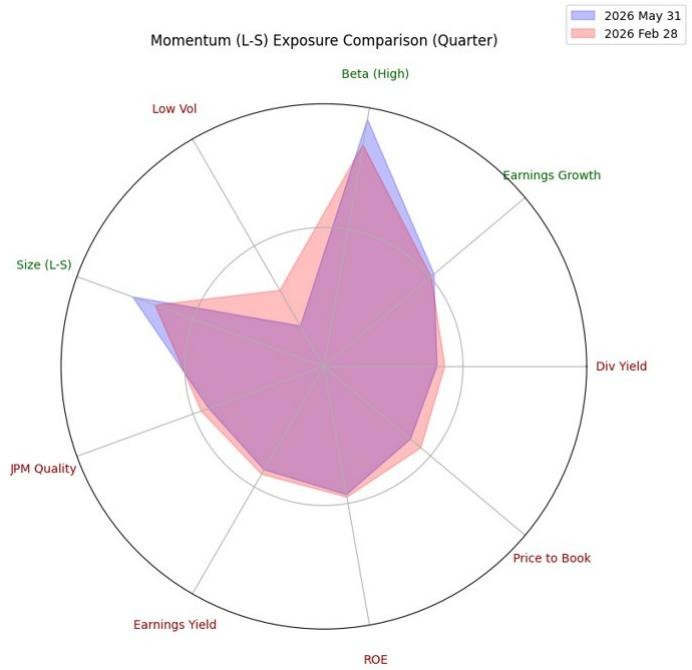

radar chart

| Metric          | 2026 Feb 28 | 2026 May 31 |
| --------------- | ----------- | ----------- |
| Beta (High)     | 0.75        | 0.85        |
| Earnings Growth | 0.45        | 0.55        |
| Div Yield       | 0.40        | 0.45        |
| Price to Book   | 0.45        | 0.50        |
| ROE             | 0.50        | 0.55        |
| Earnings Yield  | 0.45        | 0.50        |
| JPM Quality     | 0.40        | 0.45        |
| Size (L-S)      | 0.60        | 0.70        |
| Low Vol         | 0.30        | 0.35        |

Source: JPM

Figure 25: P/B Spread of Momentum  
The Y axis is P/B that is Z-Scored and flipped – the higher the Z-score, the cheaper the Momentum portfolio is on P/B.  
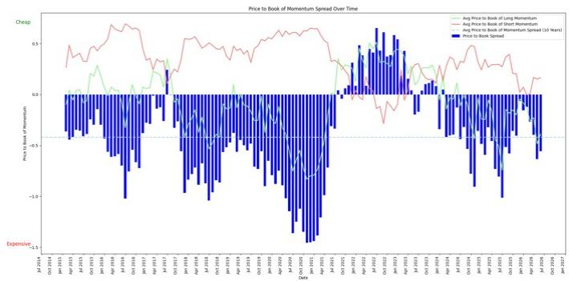

line chart

| Date       | Avg Price to Book of Long Momentum | Avg Price to Book of Short Momentum | Avg Price to Book of Momentum Spread (10 Years) |
|------------|--------------------------------------|---------------------------------------|--------------------------------------------------|
| Mar 2014   | ~0.3                                 | ~0.1                                  | ~0.0                                             |
| Apr 2014   | ~0.4                                 | ~0.2                                  | ~0.0                                             |
| May 2014   | ~0.5                                 | ~0.3                                  | ~0.0                                             |
| Jun 2014   | ~0.6                                 | ~0.4                                  | ~0.0                                             |
| Jul 2014   | ~0.7                                 | ~0.5                                  | ~0.0                                             |
| Aug 2014   | ~0.8                                 | ~0.6                                  | ~0.0                                             |
| Sep 2014   | ~0.9                                 | ~0.7                                  | ~0.0                                             |
| Oct 2014   | ~1.0                                 | ~0.8                                  | ~0.0                                             |
| Nov 2014   | ~1.1                                 | ~0.9                                  | ~0.0                                             |
| Dec 2014   | ~1.2                                 | ~1.0                                  | ~0.0                                             |
| Jan 2015   | ~1.3                                 | ~1.1                                  | ~0.0                                             |
| Feb 2015   | ~1.4                                 | ~1.2                                  | ~0.0                                             |
| Mar 2015   | ~1.5                                 | ~1.3                                  | ~0.0                                             |
| Apr 2015   | ~1.6                                 | ~1.4                                  | ~0.0                                             |
| May 2015   | ~1.7                                 | ~1.5                                  | ~0.0                                             |
| Jun 2015   | ~1.8                                 | ~1.6                                  | ~0.0                                             |
| Jul 2015   | ~1.9                                 | ~1.7                                  | ~0.0                                             |
| Aug 2015   | ~2.0                                 | ~1.8                                  | ~0.0                                             |
| Sep 2015   | ~2.1                                 | ~1.9                                  | ~0.0                                             |
| Oct 2015   | ~2.2                                 | ~2.0                                  | ~0.0                                             |
| Nov 2015   | ~2.3                                 | ~2.1                                  | ~0.0                                             |
| Dec 2015   | ~2.4                                 | ~2.2                                  | ~0.0                                             |
| Jan 2016   | ~2.5                                 | ~2.3                                  | ~0.0                                             |
| Feb 2016   | ~2.6                                 | ~2.4                                  | ~0.0                                             |
| Mar 2016   | ~2.7                                 | ~2.5                                  | ~0.0                                             |
| Apr 2016   | ~2.8                                 | ~2.6                                  | ~0.0                                             |
| May 2016   | ~2.9                                 | ~2.7                                  | ~0.0                                             |
| Jun 2016   | ~3.0                                 | ~2.8                                  | ~0.0                                             |
| Jul 2016   | ~3.1                                 | ~2.9                                  | ~0.0                                             |
| Aug 2016   | ~3.2                                 | ~3.0                                  | ~0.0                                             |
| Sep 2016   | ~3.3                                 | ~3.1                                  | ~0.0                                             |
| Oct 2016   | ~3.4                                 | ~3.2                                  | ~0.0                                             |
| Nov 2016   | ~3.5                                 | ~3.3                                  | ~0.0                                             |
| Dec 2016   | ~3.6                                 | ~3.4                                  | ~0.0                                             |
| Jan 2017   | ~3.7                                 | ~3.5                                  | ~0.0                                             |
| Feb 2017   | ~3.8                                 | ~3.6                                  | ~0.0                                             |
| Mar 2017   | ~3.9                                 | ~3.7                                  | ~0.0                                             |
| Apr 2017   | ~4.0                                 | ~3.8                                  | ~0.0                                             |
| May 2017   | ~4.1                                 | ~3.9                                  | ~0.0                                             |
| Jun 2017   | ~4.2                                 | ~4.0                                  | ~0.0                                             |
| Jul 2017   | ~4.3                                 | ~4.1                                  | ~0.0                                             |
| Aug 2017   | ~4.4                                 | ~4.2                                  | ~0.0                                             |
| Sep 2017   | ~4.5                                 | ~4.3                                  | ~0.0                                             |
| Oct 2017   | ~4.6                                 | ~4.4                                  | ~0.0                                             |
| Nov 2017   | ~4.7                                 | ~4.5                                  | ~0.0                                             |
| Dec 2017   | ~4.8                                 | ~4.6                                  | ~0.0                                             |
| Jan 2018   | ~4.9                                 | ~4.7                                  | ~-0.5                                            |
| Feb 2018   | ~5.0                                 | ~4.8                                  | ~-0.5                                            |
| Mar 2018   | ~5.1                                 | ~4.9                                  | ~-0.5                                            |
| Apr 2018   | ~5.2                                 | ~5.0                                  | ~-0.5                                            |
| May 2018   | ~5.3                                 | ~5.1                                  | ~-0.5                                            |
| Jun 2018   | ~5.4                                 | ~5.2                                  | ~-0.5                                            |
| Jul 2018   | ~5.5                                 | ~5.3                                  | ~-0.5                                            |
| Aug 2018   | ~5.6                                 | ~5.4                                  | ~-0.5                                            |
| Sep 2018   | ~5.7                                 | ~5.5                                  | (~-1)                                            |
| Oct 2018   | ~5.8                                 | ~5.6                                  | (~-1)                                            |
| Nov 2018   | ~5.9                                 | ~5.7                                  | (~-1)                                            |
| Dec 2018   | ~6.0                                 | ~5.8                                  | (~-1)                                            |
| Jan 2019   | ~6.1                                 | ~5.9                                  | (~-1)                                            |
| Feb 2019   | ~6.2                                 | ~6.0                                  | (~-1)                                            |
| Mar 2019   | ~6.3                                 | ~6.1                                  | (~-1)                                            |
| Apr 2019   | ~6.4                                 | ~6.2                                  | (~-1)                                            |
| May 2019   | ~6.5                                 | ~6.3                                  | (~-1)                                            |
| Jun 2019   | ~6.6                                 | ~6.4                                  | (~-1)                                            |
| Jul 2019   | ~6.7                                 | ~6.5                                  | (~-1)                                            |
| Aug 2019   | ~6.8                                 | ~6.6                                  | (~-1)                                            |
| Sep 2019   | ~6.9                                 | ~6.7                                  | (~-1)                                            |
| Oct 2019   | ~7.0                                 | ~6.8                                  | (~-1)                                            |
| Nov 2019   | ~7.1                                 | ~6.9                                  | (~-1)                                            |
| Dec 2019   | ~7.2                                 | ~7.0                                  | (~-1)                                            |
| Jan 2020   | ~7.3                                 | ~7.1                                  | (~-1)                                            |
| Feb 2020   | ~7.4                                 | ~7.2                                  | (~-1)                                            |
| Mar 2020   | ~7.5                                 | ~7.3                                  | (~-1)                                            |
| Apr 2020   | ~7.6                                 | ~7.4                                  | (~-1)                                            |
| May 2020   | ~7.7                                 | ~7.5                                  | (~-1)                                            |
| Jun 2020   | ~7.8                                 | ~7.6                                  | (~-1)                                            |
| Jul 2020   | ~7.9                                 | ~7.7                                  | (~-1)                                            |
| Aug 2020   | ~8.0                                 | ~7.8                                  | (~-1)                                            |
| Sep 2020   | ~8.1                                 | ~7.9                                  | (~-1)                                            |
| Oct 2020   | ~8.2                                 | ~8.0                                  | (~-1)                                            |
| Nov 2020   | ~8.3                                 | ~8.1                                  | (~-1)                                            |
| Dec 2020   | ~8.4                                 | ~8.2                                  | (~-1)                                            |
| Jan 2021   | -                      | -                                     | -                                                |
| Feb 2021   | -                      | -                                     | -                                                |
| Mar 2021   | -                      | -                                     | -                                                |
| Apr 2021   | -                      | -                                     | -                                                |
| May 2021   | -                      | -                                     | -                                                |
| Jun 2021   | -                      | -                                     | -                                                |
| Jul 2021   | -                      | -                                     | -                                                |
| Aug 2     )<fcel>~<fcel>~<fcel>~<nl>
<fcel>Sep 2      )<fcel>~<fcel>~<fcel>~<nl>

Source: JPM

Figure 27: Quality Spread of Momentum  
The Y axis is Quality that is Z-Scored – the higher the Z-score, the higher the Momentum portfolio is on Quality  
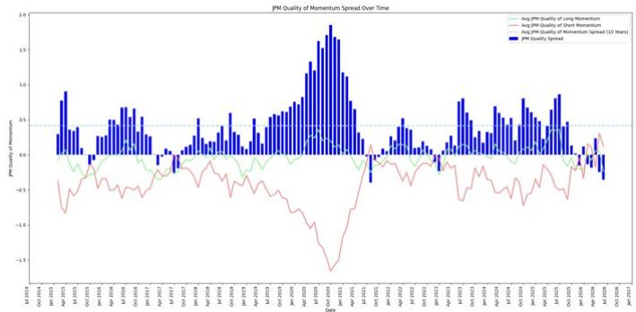

line chart

| Date | Avg JPM Quality of Long Momentum | Avg JPM Quality of Short Momentum | Avg JPM Quality of Momentum Spread (130 Years) | JPM Quality Spread |
| --- | --- | --- | --- | --- |
| Oct 2019 | -0.2 | -0.8 | -0.4 | 0.9 |
| Nov 2019 | -0.1 | -0.6 | -0.3 | 0.7 |
| Dec 2019 | 0.0 | -0.4 | -0.2 | 0.5 |
| Jan 2020 | 0.1 | -0.2 | -0.1 | 0.3 |
| Feb 2020 | 0.2 | 0.0 | 0.1 | 0.1 |
| Mar 2020 | 0.3 | 0.1 | 0.2 | 0.5 |
| Apr 2020 | 0.4 | 0.2 | 0.3 | 0.7 |
| May 2020 | 0.5 | 0.3 | 0.4 | 0.9 |
| Jun 2020 | 0.6 | 0.4 | 0.5 | 1.1 |
| Jul 2020 | 0.7 | 0.5 | 0.6 | 1.3 |
| Aug 2020 | 0.8 | 0.6 | 0.7 | 1.5 |
| Sep 2020 | 0.9 | 0.7 | 0.8 | 1.7 |
| Oct 2020 | 1.0 | 0.8 | 0.9 | 1.9 |
| Nov 2020 | 1.1 | 0.9 | 1.0 | 2.1 |
| Dec 2020 | 1.2 | 1.0 | 1.1 | 2.3 |
| Jan 2021 | 1.3 | 1.1 | 1.2 | 2.5 |
| Feb 2021 | 1.4 | 1.2 | 1.3 | 2.7 |
| Mar 2021 | 1.5 | 1.3 | 1.4 | 2.9 |
| Apr 2021 | 1.6 | 1.4 | 1.5 | 3.1 |
| May 2021 | 1.7 | 1.5 | 1.6 | 3.3 |
| Jun 2021 | 1.8 | 1.6 | 1.7 | 3.5 |
| Jul 2021 | 1.9 | 1.7 | 1.8 | 3.7 |
| Aug 2021 | 2.0 | 1.8 | 1.9 | 3.9 |
| Sep 2021 | -0.1 | -0.3 | -0.1 | -0.5 |
| Oct 2021 | -0.2 | -0.4 | -0.2 | -0.7 |
| Nov 2021 | -0.3 | -0.5 | -0.3 | -0.9 |
| Dec 2021 | -0.4 | -0.6 | -0.4 | -1.1 |
| Jan 2022 | -0.5 | -0.7 | -0.5 | -1.3 |
| Feb 2022 | -0.6 | -0.8 | -0.6 | -1.5 |
| Mar 2022 | -0.7 | -0.9 | -0.7 | -1.7 |
| Apr 2022 | -0.8 | -1.0 | -0.8 | -1.9 |
| May 2022 | -0.9 | -1.1 | -0.9 | -2.1 |
| Jun 2022 | -1.0 | -1.2 | -1.0 | -2.3 |
| Jul 2022 | -1.1 | -1.3 | -1.1 | -2.5 |
| Aug 2022 | -1.2 | -1.4 | -1.2 | -2.7 |
| Sep 2022 | -1.3 | -1.5 | -1.3 | -2.9 |
| Oct 2022 | -1.4 | -1.6 | -1.4 | -3.1 |
| Nov 2022 | -1.5 | -1.7 | -1.5 | -3.3 |
| Dec 2022 | -1.6 | -1.8 | -1.6 | -3.5 |
| Jan 2023 | -1.7 | -1.9 | -1.7 | -3.7 |
| Feb 2023 | -1.8 | -2.0 | -1.8 | -3.9 |
| Mar 2023 | -1.9 | -2.1 | -1.9 | -4.1 |
| Apr 2023 | -2.0 | -2.2 | -2.0 | -4.3 |
| May 2023 | -2.1 | -2.3 | -2.1 | -4.5 |
| Jun 2023 | -2.2 | -2.4 | -2.2 | -4.7 |
| Jul 2023 | -2.3 | -2.5 | -2.3 | -4.9 |
| Aug 2023 | -2.4 | -2.6 | -2.4 | -5.1 |
| Sep 2023 | -2.5 | -2.7 | -2.5 | -5.3 |
| Oct 2023 | -2.6 | -2.8 | -2.6 | -5.5 |
| Nov 2023 | -2.7 | -2.9 | -2.7 | -5.7 |
| Dec 2023 | -2.8 | -3.0 | -2.8 | -5.9 |
| Jan 2024 | -2.9 | -3.1 | -2.9 | -6.1 |
| Feb 2024 | -3.0 | -3.2 | -3.0 | -6.3 |
| Mar 2024 | -3.1 | -3.3 | -3.1 | -6.5 |
| Apr 2024 | -3.2 | -3.4 | -3.2 | -6.7 |
| May 2024 | -3.3 | -3.5 | -3.3 | -6.9 |
| Jun 2024 | -3.4 | -3.6 | -3.4 | -7.1 |
| Jul 2024 | -3.5 | -3.7 | -3.5 | -7.3 |
| Aug 2024 | -3.6 | -3.8 | -3.6 | -7.5 |
| Sep 2024 | -3.7 | -3.9 | -3.7 | -7.7 |
| Oct 2024 | -3.8 | -4.0 | -3.8 | -7.9 |
| Nov 2024 | -3.9 | -4.1 | -3.9 | -8.1 |
| Dec 2024 | -4.0 | -4.2 | -4.0 | -8.3 |
| Jan 2025 | -4.1 | -4.3 | -4.1 | -8.5 |
| Feb 2025 | -4.2 | -4.4 | -4.2 | -8.7 |
| Mar 2025 | -4.3 | -4.5 | -4.3 | -8.9 |
| Apr 2025 | -4.4 | -4.6 | -4.4 | -9.1 |
| May 2025 | -4.5 | -4.7 | -4.5 | -9.3 |
| Jun 2025 | -4.6 | -4.8 | -4.6 | -9.5 |
| Jul 2025 | -4.7 | -4.9 | -4.7 | -9.7 |
| Aug 2025 | -4.8 | -5.0 | -4.8 | -9.9 |
| Sep 2025 | -4.9 | -5.1 | -4.9 | -10 |

Source: JPM

Figure 26: Size Spread of Momentum  
The Y axis is Size (L-S) that is Z-Scored – the higher the Z-score, the higher the Momentum portfolio is on Size.  
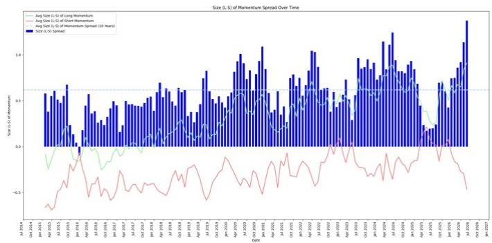

bar-line hybrid

| Date | Avg Size (L.S) of Long Momentum | Avg Size (L.S) of Short Momentum | Avg Size (L.S) of Momentum Spread (30 years) | Avg Size (L.S) Spread |
| --- | --- | --- | --- | --- |
| Mar 2014 | -0.15 | -0.18 | -0.05 | 0.6 |
| Apr 2014 | -0.12 | -0.15 | -0.07 | 0.55 |
| May 2014 | -0.18 | -0.12 | -0.09 | 0.65 |
| Jun 2014 | -0.14 | -0.16 | -0.06 | 0.58 |
| Jul 2014 | -0.16 | -0.13 | -0.08 | 0.62 |
| Aug 2014 | -0.13 | -0.17 | -0.07 | 0.57 |
| Sep 2014 | -0.17 | -0.14 | -0.09 | 0.63 |
| Oct 2014 | -0.15 | -0.16 | -0.08 | 0.59 |
| Nov 2014 | -0.18 | -0.13 | -0.07 | 0.61 |
| Dec 2014 | -0.14 | -0.17 | -0.09 | 0.56 |
| Jan 2015 | -0.16 | -0.15 | -0.08 | 0.64 |
| Feb 2015 | -0.13 | -0.18 | -0.07 | 0.58 |
| Mar 2015 | -0.17 | -0.14 | -0.09 | 0.62 |
| Apr 2015 | -0.15 | -0.16 | -0.08 | 0.57 |
| May 2015 | -0.18 | -0.13 | -0.09 | 0.63 |
| Jun 2015 | -0.14 | -0.17 | -0.07 | 0.59 |
| Jul 2015 | -0.16 | -0.15 | -0.08 | 0.61 |
| Aug 2015 | -0.13 | -0.18 | -0.09 | 0.56 |
| Sep 2015 | -0.17 | -0.14 | -0.07 | 0.64 |
| Oct 2015 | -0.15 | -0.16 | -0.08 | 0.59 |
| Nov 2015 | -0.18 | -0.13 | -0.09 | 0.62 |
| Dec 2015 | -0.14 | -0.17 | -0.07 | 0.56 |
| Jan 2016 | -0.16 | -0.15 | -0.08 | 0.63 |
| Feb 2016 | -0.13 | -0.18 | -0.09 | 0.58 |
| Mar 2016 | -0.17 | -0.14 | -0.07 | 0.61 |
| Apr 2016 | -0.15 | -0.16 | -0.08 | 0.57 |
| May 2016 | -0.18 | -0.13 | -0.09 | 0.64 |
| Jun 2016 | -0.14 | -0.17 | -0.07 | 0.59 |
| Jul 2016 | -0.16 | -0.15 | -0.08 | 0.62 |
| Aug 2016 | -0.13 | -0.18 | -0.09 | 0.56 |
| Sep 2016 | -0.17 | -0.14 | -0.07 | 0.63 |
| Oct 2016 | -0.15 | -0.16 | -0.08 | 0.59 |
| Nov 2016 | -0.18 | -0.13 | -0.09 | 0.62 |
| Dec 2016 | -0.14 | -0.17 | -0.07 | 0.56 |
| Jan 2017 | -0.16 | -0.15 | -0.08 | 0.63 |
| Feb 2017 | -0.13 | -0.18 | -0.09 | 0.58 |
| Mar 2017 | -0.17 | -0.14 | -0.07 | 0.61 |
| Apr 2017 | -0.15 | -0.16 | -0.08 | 0.57 |
| May 2017 | -0.18 | -0.13 | -0.09 | 0.64 |
| Jun 2017 | -0.14 | -0.17 | -0.07 | 0.59 |

Source: JPM

Figure 28: Beta Spread of Momentum  
The Y axis is Beta that is Z-Scored – the higher the Z-score, the higher the Momentum portfolio is on Beta  

line chart

| Date | Avg Beta (High) of Long Momentum | Avg Beta (High) of Short Momentum | Avg Beta (High) of Momentum Spread (130 Years) |
| --- | --- | --- | --- |
| 24/2019 | -0.1 | -0.1 | -0.1 |
| 25/2019 | -0.2 | -0.2 | -0.2 |
| 26/2019 | -0.3 | -0.3 | -0.3 |
| 27/2019 | -0.4 | -0.4 | -0.4 |
| 28/2019 | -0.5 | -0.5 | -0.5 |
| 29/2019 | -0.6 | -0.6 | -0.6 |
| 30/2019 | -0.7 | -0.7 | -0.7 |
| 31/2019 | -0.8 | -0.8 | -0.8 |
| 01/2020 | -0.9 | -0.9 | -0.9 |
| 02/2020 | -1.0 | -1.0 | -1.0 |
| 03/2020 | -1.1 | -1.1 | -1.1 |
| 04/2020 | -1.2 | -1.2 | -1.2 |
| 05/2020 | -1.3 | -1.3 | -1.3 |
| 06/2020 | -1.4 | -1.4 | -1.4 |
| 07/2020 | -1.5 | -1.5 | -1.5 |
| 08/2020 | -1.6 | -1.6 | -1.6 |
| 09/2020 | -1.7 | -1.7 | -1.7 |
| 10/2020 | -1.8 | -1.8 | -1.8 |
| 11/2020 | -1.9 | -1.9 | -1.9 |
| 12/2020 | -2.0 | -2.0 | -2.0 |
| 01/2021 | -2.1 | -2.1 | -2.1 |
| 02/2021 | -2.2 | -2.2 | -2.2 |
| 03/2021 | -2.3 | -2.3 | -2.3 |
| 04/2021 | -2.4 | -2.4 | -2.4 |
| 05/2021 | -2.5 | -2.5 | -2.5 |
| 06/2021 | -2.6 | -2.6 | -2.6 |
| 07/2021 | -2.7 | -2.7 | -2.7 |
| 08/2021 | -2.8 | -2.8 | -2.8 |
| 09/2021 | -2.9 | -2.9 | -2.9 |
| 10/2021 | -3.0 | -3.0 | -3.0 |
| 11/2021 | -3.1 | -3.1 | -3.1 |
| 12/2021 | -3.2 | -3.2 | -3.2 |
| 01/2022 | -3.3 | -3.3 | -3.3 |
| 02/2022 | -3.4 | -3.4 | -3.4 |
| 03/2022 | -3.5 | -3.5 | -3.5 |
| 04/2022 | -3.6 | -3.6 | -3.6 |
| 05/2022 | -3.7 | -3.7 | -3.7 |
| 06/2022 | -3.8 | -3.8 | -3.8 |
| 07/2022 | -3.9 | -3.9 | -3.9 |
| 08/2022 | -4.0 | -4.0 | -4.0 |
| 09/2022 | -4.1 | -4.1 | -4.1 |
| 10/2022 | -4.2 | -4.2 | -4.2 |
| 11/2022 | -4.3 | -4.3 | -4.3 |
| 12/2022 | -4.4 | -4.4 | -4.4 |
| 01/2023 | -4.5 | -4.5 | -4.5 |
| 02/2023 | -4.6 | -4.6 | -4.6 |
| 03/2023 | -4.7 | -4.7 | -4.7 |
| 04/2023 | -4.8 | -4.8 | -4.8 |
| 05/2023 | -4.9 | -4.9 | -4.9 |
| 06/2023 | -5.0 | -5.0 | -5.0 |
| 07/2023 | -5.1 | -5.1 | -5.1 |
| 08/2023 | -5.2 | -5.2 | -5.2 |
| 09/2023 | -5.3 | -5.3 | -5.3 |
| 10/2023 | -5.4 | -5.4 | -5.4 |
| 11/2023 | -5.5 | -5.5 | -5.5 |
| 12/2023 | -5.6 | -5.6 | -5.6 |
| 01/2024 | -5.7 | -5.7 | -5.7 |
| 02/2024 | -5.8 | -5.8 | -5.8 |
| 03/2024 | -5.9 | -5.9 | -5.9 |
| 04/2024 | -6.0 | -6.0 | -6.0 |
| 05/2024 | -6.1 | -6.1 | -6.1 |
| 06/2024 | -6.2 | -6.2 | -6.2 |
| 07/2024 | -6.3 | -6.3 | -6.3 |
| 08/2024 | -6.4 | -6.4 | -6.4 |
| 09/2024 | -6.5 | -6.5 | -6.5 |
| 10/2024 | -6.6 | -6.6 | -6.6 |
| 11/2024 | -6.7 | -6.7 | -6.7 |
| 12/2024 | -6.8 | -6.8 | -6.8 |
| 01/2025 | -6.9 | -6.9 | -6.9 |
| 02/2025 | -7.0 | -7.0 | -7.0 |
| 03/2025 | -7.1 | -7.1 | -7.1 |
| 04/2025 | -7.2 | -7.2 | -7.2 |
| 05/2025 | -7.3 | -7.3 | -7.3 |
| 06/2025 | -7.4 | -7.4 | -7.4 |
| 07/2025 | -7.5 | -7.5 | -7.5 |
| 08/2025 | -7.6 | -7.6 | -7.6 |
| 09/2025 | -7.7 | -7.7 | -7.7 |
| 10/2025 | -7.8 | -7.8 | -7.8 |
| 11/2025 | -7.9 | -7.9 | -7.9 |
| 12/2025 | -8.0 | -8.0 | -8.0 |
| 01/2026 | ~-8% | ~-8% | ~-8% |
| 02/2026 | ~-8% | ~-8% | ~-8% |
| 03/2026 | ~-8% | ~-8% | ~-8% |
| 04/2026 | ~-8% | ~-8% | ~-8% |
| 05/2026 | ~-8% | ~-8% | ~-8% |
| 06/2026 | ~-8% | ~-8% | ~-8% |

Source: JPM

Analyst Certification: The Research Analyst(s) denoted by an “AC” on the cover of this report certifies (or, where multiple Research Analysts are primarily responsible for this report, the Research Analyst denoted by an “AC” on the cover or within the document individually certifies, with respect to each security or issuer that the Research Analyst covers in this research) that: (1) all of the views expressed in this report accurately reflect the Research Analyst’s personal views about any and all of the subject securities or issuers; and (2) no part of any of the Research Analyst's compensation was, is, or will be directly or indirectly related to the specific recommendations or views expressed by the Research Analyst(s) in this report. For all Korea-based Research Analysts listed on the front cover, if applicable, they also certify, as per KOFIA requirements, that the Research Analyst’s analysis was made in good faith and that the views reflect the Research Analyst’s own opinion, without undue influence or intervention.

All authors named within this report are Research Analysts who produce independent research unless otherwise specified. In Europe, Sector Specialists (Sales and Trading) may be shown on this report as contacts but are not authors of the report or part of the Research Department.

## Important Disclosures

Company-Specific Disclosures: JPM does and seeks to do business with companies covered in its research reports. As a result, investors should be aware that the firm may have a conflict of interest that could affect the objectivity of this report. Investors should consider this report as only a single factor in making their investment decision. Important disclosures, including price charts and credit opinion history tables (if applicable), are available for compendium reports and all JPM-covered companies, and certain non-covered companies, by visiting https://www.jpmm.com/research/disclosures, calling 1-800-477-0406, or e-mailing research.disclosure.inquiries@JPM.com with your request.

## Explanation of Equity Research Ratings, Designations and Analyst(s) Coverage Universe:

JPM uses the following rating system: Overweight (over the duration of the price target indicated in this report, we expect this stock will outperform the average total return of the stocks in the Research Analyst's, or the Research Analyst's team's, coverage universe); Neutral (over the duration of the price target indicated in this report, we expect this stock will perform in line with the average total return of the stocks in the Research Analyst's, or the Research Analyst's team's, coverage universe); and Underweight (over the duration of the price target indicated in this report, we expect this stock will underperform the average total return of the stocks in the Research Analyst's, or the Research Analyst's team's, coverage universe. NR is Not Rated. In this case, JPM has removed the rating and, if applicable, the price target, for this stock because of either a lack of a sufficient fundamental basis or for legal, regulatory or policy reasons. The previous rating and, if applicable, the price target, no longer should be relied upon. An NR designation is not a recommendation or a rating. Some stocks under coverage have a rating but no price target; in these cases, we expect the stock will outperform/perform in line/underperform the average total return of the stocks in the Research Analyst's, or the Research Analyst's team's, coverage universe of the relevant duration of the region. In our Asia (ex-Australia and ex-India) and U.K. small- and mid-cap Equity Research, each stock's expected total return is compared to the expected total return of a benchmark country market index, not to those Research Analysts' coverage universe. If it does not appear in the Important Disclosures section of this report, the certifying Research Analyst's coverage universe can be found on JPM's Research website, https://www.JPMmarkets.com.

JPM Equity Research Ratings Distribution, as of April 04, 2026

<table><tr><td></td><td>Overweight (buy)</td><td>Neutral (hold)</td><td>Underweight (sell)</td></tr><tr><td>JPM Global Equity Research Coverage*</td><td>51%</td><td>37%</td><td>12%</td></tr><tr><td>IB clients**</td><td>83%</td><td>79%</td><td>74%</td></tr><tr><td>JPMS Equity Research Coverage*</td><td>49%</td><td>39%</td><td>13%</td></tr><tr><td>IB clients**</td><td>94%</td><td>93%</td><td>85%</td></tr></table>

\*Please note that the percentages may not add to 100% because of rounding.  
\*\*Percentage of subject companies within each of the "buy," "hold" and "sell" categories for which JPM has provided investment banking services within the previous 12 months.  
For purposes of FINRA ratings distribution rules only, our Overweight rating falls into a buy rating category; our Neutral rating falls into a hold rating category; and our Underweight rating falls into a sell rating category. Please note that stocks with an NR designation are not included in the table above. This information is current as of the end of the most recent calendar quarter.

Equity Valuation and Risks: For valuation methodology and risks associated with covered companies or price targets for covered companies, please see the most recent company-specific research report at http://www.JPMmarkets.com, contact the primary analyst or your JPM representative, or email research.disclosure.inquiries@JPM.com. For material information about the proprietary models used, please see the Summary of Financials in company-specific research reports and the Company Tearsheets, which are available to download on the company pages of our client website, http://www.JPMmarkets.com. This report also sets out within it the material underlying assumptions used.

## History of Investment Recommendations:

A history of JPM investment recommendations disseminated during the preceding 12 months can be accessed on the Research & Commentary page of http://www.JPMmarkets.com where you can also search by analyst name, sector or financial instrument.

Analysts' Compensation: The research analysts responsible for the preparation of this report receive compensation based upon various factors, including the quality and accuracy of research, client feedback, competitive factors, and overall firm revenues.

Registration of non-US Analysts: Unless otherwise noted, the non-US analysts listed on the front of this report are employees of non-US affiliates of JPM Securities LLC, may not be registered as research analysts under FINRA rules, may not be associated persons of JPM Securities LLC, and may not be subject to FINRA Rule 2241 or 2242 restrictions on communications with covered companies, public appearances, and trading securities held by a research analyst account.

## Other Disclosures

JPM is a marketing name for investment banking businesses of JPM Chase & Co. and its subsidiaries and affiliates worldwide.

UK MIFID FICC research unbundling exemption: UK clients should refer to UK MIFID Research Unbundling exemption for details of JPM's implementation of the FICC research exemption and guidance on relevant FICC research categorisation.

All research material made available to clients are simultaneously available on our client website, JPM Markets, unless specifically permitted by relevant laws. Not all research content is redistributed, e-mailed or made available to third-party aggregators. For all research material available on a particular stock, please contact your sales representative.

Any long form nomenclature for references to China; Hong Kong; Taiwan; and Macau within this research material are Mainland China; Hong Kong SAR (China); Taiwan (China); and Macau SAR (China).

JPM may, from time to time, write on issuers or securities targeted by economic or financial sanctions imposed or administered by the governmental authorities of the U.S., EU, UK or other relevant jurisdictions (Sanctioned Securities). Nothing in this report is intended to be read or construed as encouraging, facilitating, promoting or otherwise approving investment or dealing in such Sanctioned Securities. Clients should be aware of their own legal and compliance obligations when making investment decisions.

Any digital or crypto assets discussed in this research report are subject to a rapidly changing regulatory landscape. For relevant regulatory advisories on crypto assets, including bitcoin and ether, please see https://www.JPM.com/disclosures/cryptoasset-disclosure.

The author(s) of this research report may not be licensed to carry on regulated activities in your jurisdiction and, if not licensed, do not hold themselves out as being able to do so.

Exchange-Traded Funds (ETFs): JPM Securities LLC (“JPMS”) acts as authorized participant for substantially all U.S.-listed ETFs. To the extent that any ETFs are mentioned in this report, JPMS may earn commissions and transaction-based compensation in connection with the distribution of those ETF shares and may earn fees for performing other trade-related services, such as securities lending to short sellers of the ETF shares. JPMS may also perform services for the ETFs themselves, including acting as a broker or dealer to the ETFs. In addition, affiliates of JPMS may perform services for the ETFs, including trust, custodial, administration, lending, index calculation and/or maintenance and other services.

Options and Futures related research: If the information contained herein regards options- or futures-related research, such information is available only to persons who have received the proper options or futures risk disclosure documents. Please contact your JPM Representative or visit https://www.theocc.com/components/docs/riskstoc.pdf for a copy of the Option Clearing Corporation's Characteristics and Risks of Standardized Options or https://www.finra.org/sites/default/files/2020-08/Security\_Futures\_Risk\_Disclosure\_Statement\_2020.pdf for a copy of the Security Futures Risk Disclosure Statement.

Changes to Interbank Offered Rates (IBORs) and other benchmark rates: Certain interest rate benchmarks are, or may in the future become, subject to ongoing international, national and other regulatory guidance, reform and proposals for reform. For more information, please consult: https://www.JPM.com/global/disclosures/interbank\_offered\_rates

Notification for Credit Ratings: If this material includes credit ratings, such credit ratings provided by Japan Credit Rating Agency, Ltd. (JCR) and Rating and Investment Information, Inc. (R&I), are credit ratings provided by Registered Credit Rating Agencies (credit rating agencies registered under the Financial Instruments and Exchange Law of Japan (FIEL)). With respect to credit ratings that are provided by credit rating agencies other than JCR and R&I and have no stipulation that such credit ratings are provided by Registered Credit Rating Agencies, this means that such credit ratings are Non Registered Ratings (credit ratings provided by credit rating agencies not registered under the FIEL). Among the Non Registered Ratings, with respect to those credit ratings provided by S&P Global Ratings (S&P), Moody's Investors Service (Moody's), or Fitch Ratings (Fitch), prior to making investment decision based on such Non Registered Ratings, please carefully read the “Explanation Letter regarding Non Registered Ratings” for the corresponding credit rating agency, which we separately have sent or will send.

Private Bank Clients: Where you are receiving research as a client of the private banking businesses offered by JPM Chase & Co. and its subsidiaries (“JPM Private Bank”), research is provided to you by JPM Private Bank and not by any other division of JPM, including, but not limited to, the JPM Corporate and Investment Bank and its Global Research division.

Legal entity responsible for the production and distribution of research: The legal entity identified below the name of the Reg AC Research Analyst who authored this material is the legal entity responsible for the production of this research. Where multiple Reg AC Research Analysts authored this material with different legal entities identified below their names, these legal entities are jointly responsible for the production of this research. Where more than one legal entity is listed under an analyst's name, the first legal entity is responsible for the production unless stated otherwise. Research Analysts from various JPM affiliates may have contributed to the production of this material but may not be licensed to carry out regulated activities in your jurisdiction (and do not hold themselves out as being able to do so). Unless otherwise stated below in the legal entity disclosures, this material has been distributed by the legal entity responsible for production, or where more than one legal entity is listed under the analyst's name, the first legal entity will be responsible for distribution. If you have any queries, please contact the relevant Research Analyst in your jurisdiction or the entity in your jurisdiction that has distributed this research material.

## Legal Entities Disclosures and Country-/Region-Specific Disclosures:

Argentina: JPM Chase Bank N.A Sucursal Buenos Aires is regulated by Banco Central de la República Argentina (“BCRA”- Central Bank of Argentina) and Comisión Nacional de Valores (“CNV”- Argentinian Securities Commission - ALYC y AN Integral N°51).

Australia: JPM Securities Australia Limited (“JPMSAL”) (ABN 61 003 245 234/AFS Licence No: 238066) is regulated by the Australian Securities and Investments Commission and is a Market Participant of ASX Limited, a Clearing and Settlement Participant of ASX Clear Pty Limited and a Clearing Participant of ASX Clear (Futures) Pty Limited. This material is issued and distributed in Australia by or on behalf of JPMSAL only to "wholesale clients" (as defined in section 761G of the Corporations Act 2001). A list of all financial products covered can be found by visiting https://www.jpmm.com/research/disclosures. JPM seeks to cover companies of relevance to the domestic and international investor base across all Global Industry Classification Standard (GICS) sectors, as well as across a range of market capitalisation sizes. If applicable, in the course of conducting public side due diligence on the subject company(ies), the Research Analyst team may at times perform such diligence through corporate engagements such as site visits, discussions with company representatives, management presentations, etc. Research issued by JPMSAL has been prepared in accordance with JPM Australia’s Research Independence Policy which can be found at the following link: JPM Australia - Research Independence Policy.

Brazil: Banco JPM S.A. is regulated by the Comissao de Valores Mobiliarios (CVM) and by the Central Bank of Brazil. Ombudsman JPM: 0800-7700847 / 0800-7700810 (For Hearing Impaired) / ouvidoria.jp.morgan@jpmchase.com.

Canada: JPM Securities Canada Inc. is a registered investment dealer, regulated by the Canadian Investment Regulatory Organization and the Ontario Securities Commission and is the participating member on Canadian exchanges. This material is distributed in Canada by or on behalf of JPM Securities Canada Inc.

Chile: Inversiones JPM Limitada is an unregulated entity incorporated in Chile.

China: JPM Securities (China) Company Limited has been approved by CSRC to conduct the securities investment consultancy business.

Colombia: Banco JPM Colombia S.A. is supervised by the Superintendencia Financiera de Colombia (SFC). Any reference in this material to products or services offered abroad by entities other than the Bank in Colombia is included exclusively for descriptive purposes. Such references do not constitute, and should not be construed as, promotional activity or the provision of financial products or services within Colombian territory, as defined under applicable Colombian regulation.

Dubai International Financial Centre (DIFC): JPM Chase Bank, N.A., Dubai Branch is regulated by the Dubai Financial Services Authority (DFSA) and its registered address is Dubai International Financial Centre - The Gate, West Wing, Level 3 and 9 PO Box 506551, Dubai, UAE. This material has been distributed by JPM Chase Bank, N.A., Dubai Branch to persons regarded as professional clients or market counterparties as defined under the DFSA rules.

European Economic Area (EEA): Unless specified to the contrary, research is distributed in the EEA by JPM SE (“JPM SE”), which is authorised as a credit institution by the Federal Financial Supervisory Authority (Bundesanstalt für Finanzdienstleistungsaufsicht, BaFin) and jointly supervised by the BaFin, the German Central Bank (Deutsche Bundesbank) and the European Central Bank (ECB). JPM SE is a company headquartered in Frankfurt with registered address at TaunusTurm, Taunustor 1, Frankfurt am Main, 60310, Germany. The material has been distributed in the EEA to persons regarded as professional investors (or equivalent) pursuant to Art. 4 para. 1 no. 10 and Annex II of MiFID II and its respective implementation in their home jurisdictions (“EEA professional investors”). This material must not be acted on or relied on by persons who are not EEA professional investors. Any investment or investment activity to which this material relates is only available to EEA relevant persons and will be engaged in only with EEA relevant persons.

Hong Kong: JPM Securities (Asia Pacific) Limited (CE number AAJ321) is regulated by the Hong Kong Monetary Authority and the Securities and Futures Commission in Hong Kong, and JPM Broking (Hong Kong) Limited (CE number AAB027) is regulated by the Securities and Futures Commission in Hong Kong. JPM Chase Bank, N.A., Hong Kong Branch (CE Number AAL996) is regulated by the Hong Kong Monetary Authority and the Securities and Futures Commission, is organized under the laws of the United States with limited liability. Where the distribution of this material is a regulated activity in Hong Kong, the material is distributed in Hong Kong by or through JPM Securities (Asia Pacific) Limited and/or JPM Broking (Hong Kong) Limited.

India: JPM India Private Limited (Corporate Identity Number - U67120MH1992FTC068724), having its registered office at JPM Tower, Off. C.S.T. Road, Kalina, Santacruz - East, Mumbai – 400098, is registered with the Securities and Exchange Board of India (SEBI) as a 'Research Analyst' having registration number INH000001873. JPM India Private Limited is also registered with SEBI as a member of the National Stock Exchange of India Limited and the Bombay Stock Exchange Limited (SEBI Registration Number – INZ000239730) and as a Merchant Banker (SEBI Registration Number - MB/INM000002970). Telephone: 91-22-6157 3000, Facsimile: 91-22-6157 3990 and Website:

http://www.jpmipl.com. JPM Chase Bank, N.A. - Mumbai Branch is licensed by the Reserve Bank of India (RBI) (Licence No. 53/Licence No. BY.4/94; SEBI - IN/CUS/014/ CDSL : IN-DP-CDSL-444-2008/ IN-DP-NSDL-285-2008/ INBI00000984/ INE231311239) as a Scheduled Commercial Bank in India, which is its primary license allowing it to carry on Banking business in India and other activities, which a Bank branch in India are permitted to undertake. For non-local research material, this material is not distributed in India by JPM India Private Limited. Compliance Officer: Ashutosh Sharma; ashutosh.j.sharma@jpmchase.com; +912261575002. Grievance Officer: Ramprasadh K, jpmipl.research.feedback@JPM.com; +912261573000. Registration granted by SEBI and certification from NISM in no way guarantee performance of the intermediary or provide any assurance of returns to investors. Please visit Terms and Conditions and Most Important Terms and Conditions (MITC). The annual Compliance audit report is available at http://www.jpmipl.com/#research.

Indonesia: PT JPM Sekuritas Indonesia is a member of the Indonesia Stock Exchange and is registered and supervised by the Otoritas Jasa Keuangan (OJK).

Korea: JPM Securities (Far East) Limited, Seoul Branch, is a member of the Korea Exchange (KRX). JPM Chase Bank, N.A., Seoul Branch, is licensed as a branch office of foreign bank (JPM Chase Bank, N.A.) in Korea. Both entities are regulated by the Financial Services Commission (FSC) and the Financial Supervisory Service (FSS). For non-macro research material, the material is distributed in Korea by or through JPM Securities (Far East) Limited, Seoul Branch.

Japan: JPM Securities Japan Co., Ltd. and JPM Chase Bank, N.A., Tokyo Branch are regulated by the Financial Services Agency in Japan.

Malaysia: This material is issued and distributed in Malaysia by JPM Securities (Malaysia) Sdn Bhd (18146-X), which is a Participating Organization of Bursa Malaysia Berhad and holds a Capital Markets Services License issued by the Securities Commission in Malaysia.

Mexico: JPM Casa de Bolsa, S.A. de C.V., JPM Grupo Financiero is member of the Mexican Stock Exchange (“Bolsa Mexicana de Valores”) and the Institutional Stock Exchange (“Bolsa Institucional de Valores”), and it is authorized to act as a broker dealer by the National Banking and Securities Exchange Commission (“Comisión Nacional Bancaria y de Valores”).

New Zealand: This material is issued and distributed by JPMSAL in New Zealand only to "wholesale clients" (as defined in the Financial Markets Conduct Act 2013). JPMSAL is registered as a Financial Service Provider under the Financial Service providers (Registration and Dispute Resolution) Act of 2008.

Philippines: JPM Securities Philippines Inc. is a Trading Participant of the Philippine Stock Exchange and a member of the Securities Clearing Corporation of the Philippines and the Securities Investor Protection Fund. It is regulated by the Securities and Exchange Commission.

Singapore: This material is issued and distributed in Singapore by or through JPM Securities Singapore Private Limited (JPMSS) [MDDI (P) 057/08/2025 and Co. Reg. No.: 199405335R], which is a member of the Singapore Exchange Securities Trading Limited, and/or JPM Chase Bank, N.A., Singapore branch (JPMCB Singapore), both of which are regulated by the Monetary Authority of Singapore. This material is issued and distributed in Singapore only to accredited investors, expert investors and institutional investors, as defined in Section 4A of the Securities and Futures Act, Cap. 289 (SFA). This material is not intended to be issued or distributed to any retail investors or any other investors that do not fall into the classes of “accredited investors,” “expert investors” or “institutional investors,” as defined under Section 4A of the SFA. Recipients of this material in Singapore are to contact JPMSS or JPMCB Singapore in respect of any matters arising from, or in connection with, the material.

South Africa: JPM Equities South Africa Proprietary Limited and JPM Chase Bank, N.A., Johannesburg Branch are members of the Johannesburg Securities Exchange and are regulated by the Financial Services Conduct Authority (FSCA).

Taiwan: JPM Securities (Taiwan) Limited is a participant of the Taiwan Stock Exchange (company-type) and regulated by the Taiwan Securities and Futures Bureau. Material relating to equity securities is issued and distributed in Taiwan by JPM Securities (Taiwan) Limited, subject to the license scope and the applicable laws and the regulations in Taiwan. To the extent that JPM Securities (Taiwan) Limited produces research materials on securities not listed on the Taiwan Stock Exchange or Taipei Exchange (“Non-Taiwan Listed Securities”), these materials shall not constitute securities recommendations for the purpose of applicable Taiwan regulations, and, for the avoidance of doubt, JPM Securities (Taiwan) Limited does not act as broker for Non-Taiwan Listed Securities. According to Paragraph 2, Article 7-1 of Operational Regulations Governing Securities Firms Recommending Trades in Securities to Customers (as amended or supplemented) and/or other applicable laws or regulations, please note that the recipient of this material is not permitted to engage in any activities in connection with the material that may give rise to conflicts of interests, unless otherwise disclosed in the “Important Disclosures” in this material.

Thailand: This material is issued and distributed in Thailand by JPM Securities (Thailand) Ltd., which is a member of the Stock Exchange of Thailand and is regulated by the Ministry of Finance and the Securities and Exchange Commission. The registered address is 548 One City Center Building, 50th Floor, Ploenchit Road, Lymphini, Pathum Wan, Bangkok 10330.

UK: Research is produced in the UK by JPM Securities plc (“JPMS plc”) which is a member of the London Stock Exchange and is authorised by the Prudential Regulation Authority and regulated by the Financial Conduct Authority and the Prudential Regulation Authority or JPM Markets Limited (“JPMML Ltd”) which is authorised and regulated by the Financial Conduct Authority. Unless specified to the contrary, this material is distributed in the UK by JPMS plc and is directed in the UK only to: (a) persons having professional experience in matters relating to investments falling within article 19(5) of the Financial Services and Markets Act 2000 (Financial Promotion) (Order) 2005 (“the FPO”); (b) persons outlined in article 49 of the FPO (high net worth companies, unincorporated associations or partnerships, the trustees of high value trusts, etc.); or (c) any persons to whom this communication may otherwise lawfully be made; all such persons being referred to as "UK relevant persons". This material must not be acted on or relied on by persons who are not UK relevant persons. Any investment or investment activity to which this material relates is only available to UK relevant persons and will be engaged in only with UK relevant persons. A description of JPM EMEA's policy for prevention and avoidance of conflicts of interest related to the production of Research can be found at the following link: JPM EMEA - Research Independence Policy.

U.S.: JPM Securities LLC (“JPMS”) is a member of the NYSE, FINRA, SIPC, and the NFA. JPM Chase Bank, N.A. is a member of the FDIC. Material published by non-U.S. affiliates is distributed in the U.S. by JPMS who accepts responsibility for its content.

General: Additional information is available upon request. The information in this material has been obtained from sources believed to be reliable. While all reasonable care has been taken to ensure that the facts stated in this material are accurate and that the forecasts, opinions and expectations contained herein are fair and reasonable, JPM Chase & Co. or its affiliates and/or subsidiaries (collectively JPM) make no representations or warranties whatsoever to the completeness or accuracy of the material provided, except with respect to any disclosures relative to JPM and the Research Analyst's involvement with the issuer that is the subject of the material. Accordingly, no reliance should be placed on the accuracy, fairness or completeness of the information contained in this material. There may be certain discrepancies with data and/or limited content in this material as a result of calculations, adjustments, translations to different languages, and/or local regulatory restrictions, as applicable. These discrepancies should not impact the overall investment analysis, views and/or recommendations of the subject company(ies) that may be discussed in the material. Artificial intelligence tools may have been used in the preparation of this material, including assisting in data analysis, pattern recognition, and content drafting for research material. JPM accepts no liability whatsoever for any loss arising from any use of this material or its contents, and neither JPM nor any of its respective directors, officers or employees, shall be in any way responsible for the contents hereof, apart from the liabilities and responsibilities that may be imposed on them by the relevant regulatory authority in the jurisdiction in question, or the regulatory regime thereunder. Opinions, forecasts or projections contained in this material represent JPM's current opinions or judgment as of the date of the material only and are therefore subject to change without notice. Periodic updates may be provided on companies/industries based on company-specific developments or announcements, market conditions or any other publicly available information. There can be no assurance that future results or events will be consistent with any such opinions, forecasts or projections, which represent only one possible outcome. Furthermore, such opinions, forecasts or projections are subject to certain risks, uncertainties and assumptions that have not been verified, and future actual results or events could differ materially. The value of, or income from, any investments referred to in this material may fluctuate and/or be affected by changes in exchange rates. All pricing is indicative as of the close of market for the securities discussed, unless otherwise stated. Past performance is not indicative of future results. Accordingly, investors may receive back less than originally invested. This material is not intended as an offer or solicitation for the purchase or sale of any financial instrument. The opinions and recommendations herein do not take into account individual client circumstances, objectives, or needs and are not intended as recommendations of particular securities, financial instruments or strategies to particular clients. This material may include views on structured securities, options, futures and other derivatives. These are complex instruments, may involve a high degree of risk and may be appropriate investments only for sophisticated investors who are capable of understanding and assuming the risks involved. The recipients of this material must make their own independent decisions regarding any securities or financial instruments mentioned herein and should seek advice from such independent financial, legal, tax or other adviser as they deem necessary. JPM may trade as a principal on the basis of the Research Analysts' views and research, and it may also engage in transactions for its own account or for its clients' accounts in a manner inconsistent with the views taken in this material, and JPM is under no obligation to ensure that such other communication is brought to the attention of any recipient of this material. Others within JPM, including Strategists, Sales staff and other Research Analysts, may take views that are inconsistent with those taken in this material. Employees of JPM not involved in the preparation of this material may have investments in the securities (or derivatives of such securities) mentioned in this material and may trade them in ways different from those discussed in this material. This material is not an advertisement for or marketing of any issuer, its products or services, or its securities in any jurisdiction.

Confidentiality and Security Notice: This transmission may contain information that is privileged, confidential, legally privileged, and/or exempt from disclosure under applicable law. If you are not the intended recipient, you are hereby notified that any disclosure, copying, distribution, or use of the information contained herein (including any reliance thereon) is STRICTLY PROHIBITED. Although this transmission and any attachments are believed to be free of any virus or other defect that might affect any computer system into which it is received and opened, it is the responsibility of the recipient to ensure that it is virus free and no responsibility is accepted by JPM Chase & Co., its subsidiaries and affiliates, as applicable, for any loss or damage arising in any way from its use. If you received this transmission in error, please immediately contact the sender and destroy the material in its entirety, whether in electronic or hard copy format. This message is subject to electronic monitoring: https://www.JPM.com/disclosures/email

MSCI: Certain information herein (“Information”) is reproduced by permission of MSCI Inc., its affiliates and information providers (“MSCI”) ©2026. No reproduction or dissemination of the Information is permitted without an appropriate license. MSCI MAKES NO EXPRESS OR IMPLIED WARRANTIES (INCLUDING MERCHANTABILITY OR FITNESS) AS TO THE INFORMATION AND DISCLAIMS ALL LIABILITY TO THE EXTENT PERMITTED BY LAW. No Information constitutes investment advice, except for any applicable Information from MSCI ESG Research. Subject also to msci.com/disclaimer

Sustainalytics: Certain information, data, analyses and opinions contained herein are reproduced by permission of Sustainalytics and: (1) includes the proprietary information of Sustainalytics; (2) may not be copied or redistributed except as specifically authorized; (3) do not constitute investment advice nor an endorsement of any product or project; (4) are provided solely for informational purposes; and (5) are not warranted to be complete, accurate or timely. Sustainalytics is not responsible for any trading decisions, damages or other losses related to it or its use. The use of the data is subject to conditions available at https://www.sustainalytics.com/legal-disclaimers. ©2026 Sustainalytics. All

Rights Reserved.

"Other Disclosures" last revised May 16, 2026.

Copyright 2026 JPM Chase & Co. All rights reserved. This material or any portion hereof may not be reprinted, sold or redistributed without the written consent of JPM. It is strictly prohibited to use or share without prior written consent from JPM any research material received from JPM or an authorized third-party (“JPM Data”) in any third-party artificial intelligence (“AI”) systems or models when such JPM Data is accessible by a third-party.

Completed 09 Jun 2026 08:35 AM JST

Disseminated 09 Jun 2026 08:35 AM JST