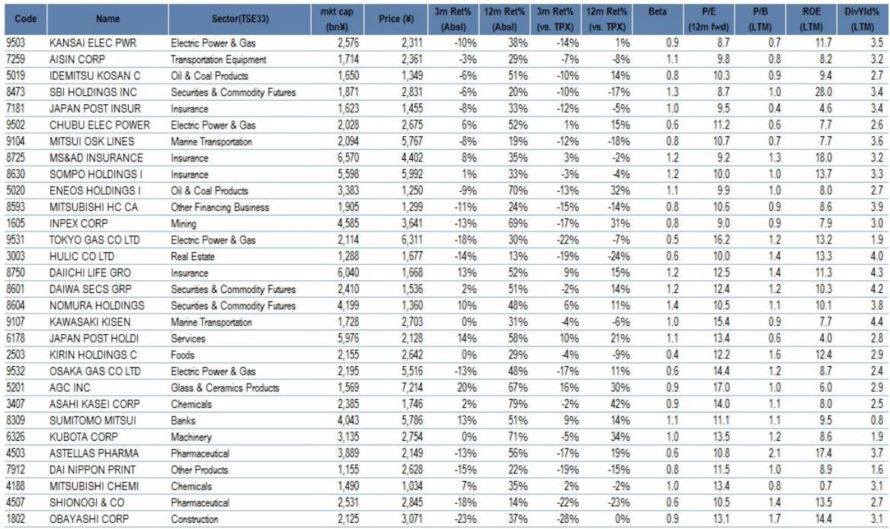
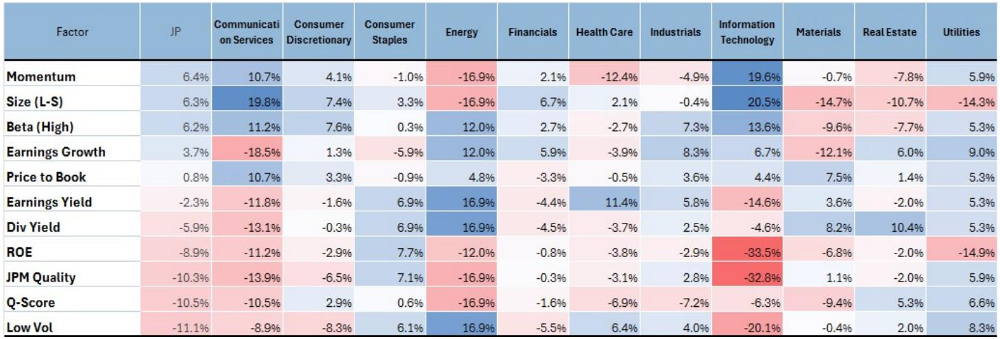
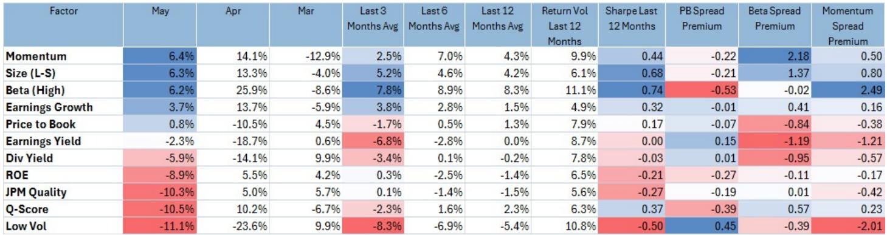

# JPM：日本股市真正的博弈不在AI，而在价值与动量的交叉点

JPM最新发布的日本权益风格投资报告，在看似延续“AI半导体引领市场”的共识背后，藏着一个更值得推敲的判断：当前日本股市最被低估的交易机会，并非追高动量股，而是那些同时具备价值特征和适度动量的股票。这个判断的逻辑链条并不复杂，但它的含义却可能被大多数投资者忽视。

这份报告发布的时间点值得注意。日经225指数在6月初逼近68000点，全球AI半导体热潮持续推高相关标的，动量因子在过去12个月录得0.44的夏普比率，Beta因子表现同样强劲。市场看起来气势如虹。但JPM的量化团队却在此时刻意提醒两个风险：市场对日本央行可能更为鹰派的加息路径定价不足，以及赢家与输家之间极端分化可能出现的部分修正。

换句话说，这份报告的核心主张是：在动量过热、价值被压抑的当下，投资者不应简单地在两个阵营之间做二选一，而应该寻找那个被忽略的交集地带。

## 1. 动量交易已经拥挤到需要重新审视风险回报比

JPM在报告中提供了一个关键数据点：动量因子在5月录得6.4%的月度回报，4月更是高达14.1%。但3月的数据是-12.9%。这种剧烈波动本身就说明，动量交易已经不再是低波动率的“躺赢”策略。当动量因子在三个月内从-12.9%跳到14.1%再回到6.4%，它本质上已经变成了一个高Beta、高换手率的博弈工具。

更值得关注的是持仓集中度。报告明确指出，动量因子的持仓已经高度集中在AI相关标的上。这不是一个分散化的动量组合，而是一个主题化的动量赌注。当市场出现任何对AI主题不利的信号——无论是地缘政治风险、利率预期变化，还是行业自身的周期性回调——这个拥挤的动量仓位都可能面临急剧的去杠杆压力。

JPM也承认，在动量出现“迷你崩盘”时，基本面投资者往往会逢低买入，这在一定程度上限制了下行空间。但问题在于，这种“基本面兜底”的逻辑依赖于一个关键假设：AI半导体的盈利增长预期不会出现系统性下修。如果宏观环境发生变化，这个假设就可能被动摇。

所以，动量交易的风险回报比已经不再像几个月前那样有吸引力。这不是说AI主题会消失，而是说在这个价位上，继续押注动量所承担的风险，可能已经超过了潜在的回报。

## 2. 价值因子的持续跑输并非基本面问题，而是定价问题

价值因子在5月的表现可以用“惨淡”来形容。根据报告中的数据，Price to Book因子5月仅上涨0.8%，Earnings Yield下跌2.3%，Div Yield下跌5.9%，ROE下跌8.9%，JPM Quality更是下跌10.3%。与此同时，动量因子上涨6.4%，Size因子上涨6.3%，Beta因子上涨6.2%。

这种极端的风格分化，很容易让人得出一个结论：价值投资在日本市场已经失效。但JPM提供了一个截然不同的视角。报告中的关键图表（Figure 3）展示了价值因子表现与JPM编制的日本央行讲话鹰鸽指数之间的关系。数据显示，当前价值因子的低迷表现，与日本央行鹰派言论的升温高度相关。

这意味着，价值因子的跑输不是因为它所代表的公司基本面出了问题，而是因为市场正在为日本央行加息定价。当利率上升预期增强时，那些对利率敏感的价值股——银行、保险、能源、公用事业——自然会承压。但这恰恰是问题的关键：如果市场对加息的定价已经过度，或者加息落地后利空出尽，那么当前被压制的价值股就可能迎来修复行情。

这里需要指出的是，JPM并没有断言加息预期已经见顶。相反，报告提到“一些市场参与者担心日本央行可能落后于曲线”，这意味着加息风险可能尚未完全释放。但这也正是价值股可能存在的机会窗口——如果市场最终发现加息幅度低于预期，或者企业盈利能够消化利率上升的影响，那么当前的价值股价格就提供了安全边际。

## 3. 价值与动量的交叉地带才是真正的结构性机会

JPM报告中最具操作性的洞察，并非对单一风格的推荐，而是对“Value with Momentum”这个交叉策略的系统性分析。报告专门用一张表格（Figure 4）列出了30只同时具备价值和动量特征的日本股票，涵盖电力、保险、证券、石油、航运等多个行业。

这个策略的逻辑是：在动量股已经过度拥挤、价值股又受到利率压制的情况下，那些被市场忽视的、同时具备价值属性和适度动量的股票，可能成为资金轮动的下一个目的地。这些股票既不像纯动量股那样脆弱，也不像纯价值股那样缺乏催化剂。

从Figure 4列出的具体标的来看，这些公司的共同特征包括：市盈率大多在8-15倍之间，市净率在0.5-1.5倍之间，股息率普遍在2.5%-4.5%之间。更重要的是，它们在过去12个月相对东证指数并没有显著的超额收益，有些甚至是负超额收益。这意味着它们还没有被动量资金充分挖掘。

JPM特别指出，在AI动量股出现短期轮动时，“Value with Momentum”特征的股票可能成为资金的避风港。这个判断隐含了一个重要假设：资金不会离开日本股市，只是从拥挤的动量交易转向相对低估的标的。如果这个假设成立，那么这种轮动对日本股市整体而言是健康的，但对那些押注纯动量策略的投资者来说，则意味着需要重新调整仓位。

## 4. 日本QMI的扩张可持续性存疑，周期转向风险被低估

报告中的日本QMI（量化宏观指标）在5月继续处于扩张区间，这是支撑当前风险偏好和动量交易的重要宏观背景。但JPM在报告中埋下了一个关键的伏笔：QMI改善的速度在一定程度上反映了“一次性利好”，比如内存领域的特殊需求。从统计上看，维持当前改善速度“具有挑战性”。

这个表述的潜台词是：当前的扩张可能已经接近周期顶部。报告中的Figure 5和Figure 6展示了QMI的历史走势和状态位置，虽然数据截至5月仍处于扩张区间，但JPM明确提醒投资者“应关注潜在的周期性减速，并对Beta效应的过热保持警惕”。

如果QMI在接下来几个月从扩张转向放缓或收缩，那么整个风格投资的框架都会发生变化。根据报告中的Figure 7，在扩张阶段，市场偏好高Beta、价值、大盘股和动量；但在放缓阶段，偏好会转向深度价值、中小盘价值和短期反转策略。这意味着，如果周期转向，当前最受欢迎的动量交易可能首当其冲。

这里需要强调的是，JPM并没有预测周期会立即转向，而是提醒投资者“为周期转向做准备”可能仍然是少数派观点。这个表述本身就说明，市场共识可能过于乐观了。

## 5. 报告尚未完全回答的关键问题：日本央行加息的二阶效应

尽管JPM对“Value with Momentum”策略做了详尽的分析，但报告仍然留下了一些未解的问题。其中最核心的一个是：日本央行加息对价值股的影响究竟是暂时的，还是结构性的？

报告指出，价值因子表现与日本央行讲话鹰鸽指数高度相关，这暗示了利率预期是拖累价值股的主要因素。但问题在于，加息对不同类型的价值股影响是不同的。对于银行和保险这类受益于利差扩大的公司，加息反而是利好；对于电力、燃气等公用事业，加息则意味着融资成本上升；对于石油、航运等周期性行业，加息的影响则取决于全球需求状况。

JPM在Figure 4中列出的30只“Value with Momentum”股票，涵盖了上述所有类型。这意味着，即使这个策略在风格层面是有效的，个股层面的分化仍然很大。投资者需要进一步拆解：哪些价值股在加息环境下反而受益？哪些只是被市场情绪误伤？

报告对此没有给出明确的筛选标准。这可能是整个分析框架中最需要投资者自行判断的部分。

## 6. 投资者的观察框架：从风格配置转向因子交叉验证

基于JPM的报告，投资者可以建立一个新的观察框架，而不是简单地在价值和动量之间做选择题。

第一步，关注日本央行动态与价值股表现之间的背离程度。如果日本央行加息预期继续升温，而价值股进一步下跌，这种背离可能反而提供了买入机会——前提是投资者相信市场对加息的定价已经过度。

第二步，验证“Value with Momentum”策略的可持续性。JPM列出的30只股票是一个很好的起点，但投资者需要自行验证这些公司的盈利是否能够抵御利率上升的影响，以及它们的动量是否具有基本面支撑，而不仅仅是技术性反弹。

第三步，监控QMI的边际变化。如果QMI在未来1-2个月出现减速迹象，那么整个风格配置框架都需要重新调整。届时，价值股可能不再是被动等待修复的标的，而是主动防御策略的一部分。

第四步，警惕动量交易的去杠杆风险。当前动量因子的持仓集中度和波动率都处于高位，任何意外的宏观事件——无论是日本央行意外加息、地缘政治升级，还是AI行业自身的调整——都可能触发连锁反应。

JPM这份报告的真正价值，不在于它给出了一个简单的买入或卖出建议，而在于它揭示了市场当前定价中的一个结构性矛盾：动量在过热，价值在承压，但两者之间的交叉地带可能才是真正的机会所在。这个判断是否成立，还需要时间和市场来验证。

但有一点是确定的：在日本股市逼近历史高点的当下，继续简单地追涨动量，或者固执地押注价值回归，都不是最优策略。真正的超额收益，可能来自那些被市场忽视的、同时具备多种因子特征的股票。

这份报告还包含JPM对日本各行业风格配置的详细评估、完整的因子表现数据，以及针对不同周期阶段的投资策略框架。这些内容在本文中无法一一展开，但它们是理解日本股市当前结构性机会的关键拼图。

欢迎来星球微信群里继续讨论：日本央行加息路径的不确定性如何影响价值股定价，以及“Value with Momentum”策略在当前市场环境下的具体执行细节。我们会在群内分享更多基于这份报告的深度分析。

Personal reading notes and learning share only. Not investment advice.

