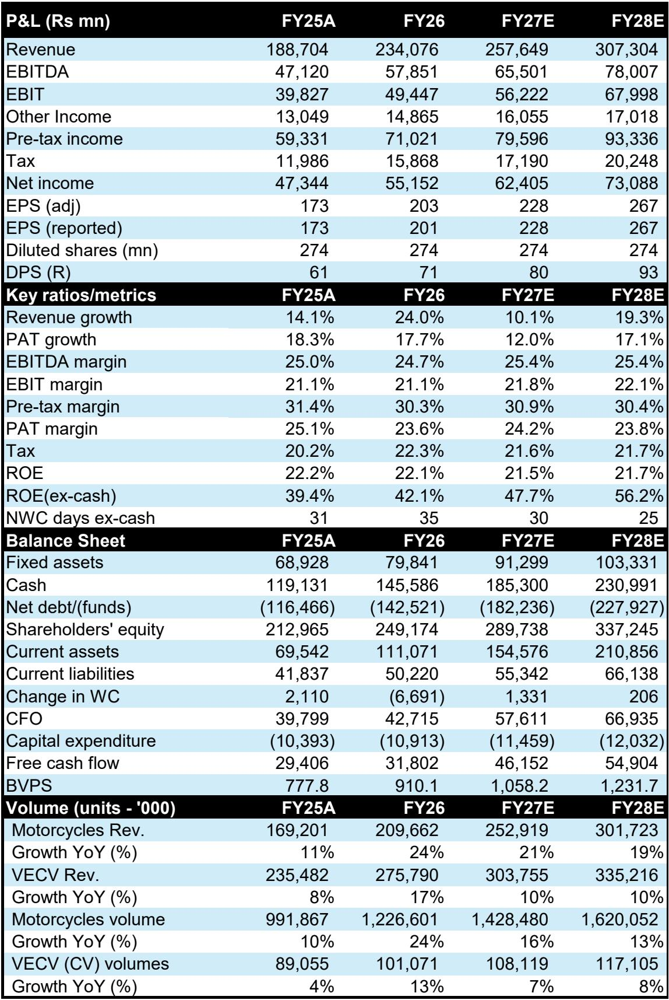
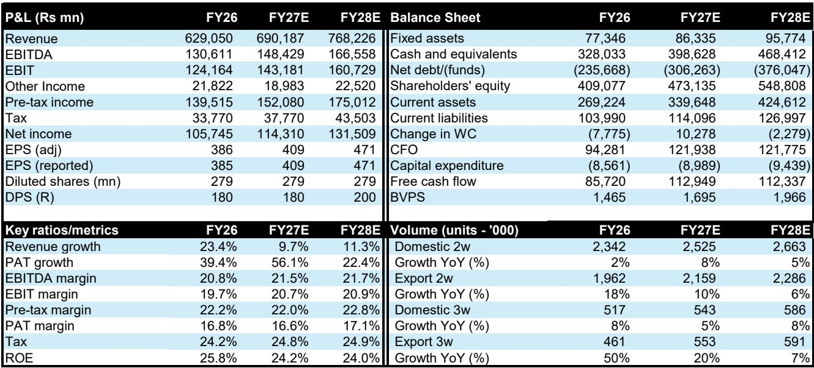
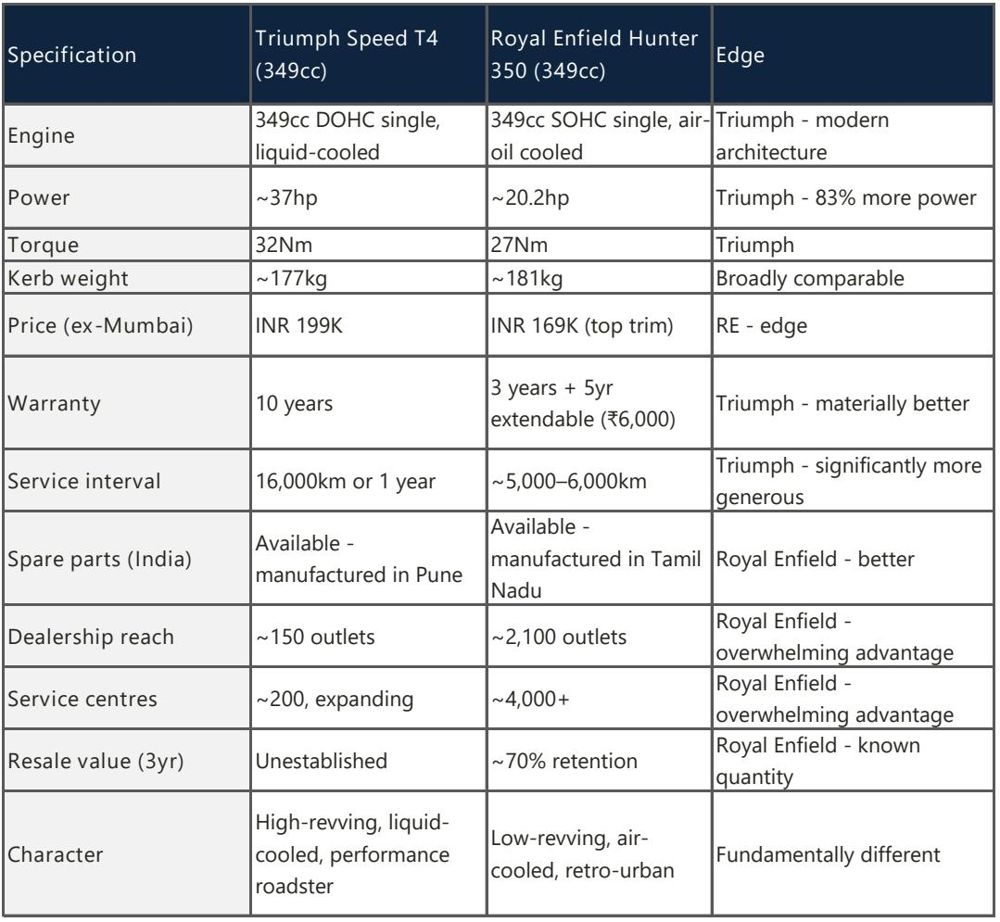

# Bernstein：印度350cc摩托车市场真正的较量，不是产品，是分销

印度摩托车市场正在经历一场罕见的正面交锋。Bajaj Auto与Triumph的合资品牌，在2026年4月完成了一次关键的产品线迁移——将旗下主力车型从398cc调整至349cc，正式进入Royal Enfield统治了数十年的350cc排量区间。表面上看，这是一场关于产品力的竞争：马力、保修、服务间隔。但Bernstein这份研报通过深入的经销商调研，给出了一个更克制的判断：市场尚未真正测试Royal Enfield的护城河，因为Triumph还没有让足够多的消费者做出“二选一”的决定。

这份报告的核心洞察在于：Triumph的挑战不是产品够不够好，而是它能否在Royal Enfield的“文化领地”上，建立起足以改变消费者决策路径的分销网络。这不是一个关于发动机排量的故事，而是一个关于“消费者从哪里获取信息、在哪里做决定、信任谁的服务网络”的故事。

以下是我们从Bernstein研报中提炼出的五个关键层次，它们共同指向一个尚未终结的竞争格局。

## 1. 税改没有创造机会，而是制造了必须行动的“义务”

2025年8月，印度政府对摩托车消费税进行了结构性调整：350cc及以下排量的税率从28%降至18%，而350cc以上排量的税率则从28-31%提升至40%。这意味着，一个22个百分点的税收悬崖，突然出现在Bajaj和Triumph的398cc产品线面前。

Bernstein的分析指出，这一变化被市场普遍解读为“Bajaj获得了进入350cc市场的战略机遇”，但更精确的表述是：它创造了一个无法回避的“义务”。在税改之前，Bajaj选择在398cc排量上竞争，是一个自由的商业决策；税改之后，维持这一排量意味着承受结构性价格劣势，而这不是任何品牌能够长期承担的。

工程上的解决方案并不复杂——将398cc单缸发动机的缸径缩小至349.13cc，保留冲程，性能几乎不受影响。2026年4月，Triumph的4-5款车型以349cc排量重新上市。Bajaj旗下的Pulsar NS400Z、Dominar 400和KTM 390 Duke也随后跟进。

但关键问题在于：价格差距并没有因为排量下调而显著缩小。Bernstein的对比数据显示，Speed 400与Classic 350的价格差仅从约3.4万卢比缩小至2.5万卢比；Speed T4与Hunter 350的价差从3.5万卢比收窄至3万卢比。换句话说，Triumph进入了相同的排量类别，但并未进入相同的价格区间。

这意味着什么？Triumph现在确实“在对话中”——消费者在考虑Royal Enfield时，会开始提及Triumph的名字。但“被提及”是获胜的必要条件，远非充分条件。

## 2. 经销商调研揭示了两个完全不同的“游戏”

Bernstein在孟买进行的经销商调研，是这份报告最具有现场感的章节。它呈现了两幅截然不同的画面。

在Royal Enfield的展厅，销售人员首先提到的不是产品，而是“等待期”。标准车型：3个月。定制化订单：45-60天，还需支付5000-6000卢比的溢价。销售人员提及等待期时，语气中没有任何歉意——这是一种“凭证”，证明品牌处于满负荷运转状态。展厅的设计语言是“目的地”而非“卖场”：暗色墙壁、琥珀色灯光、每款Classic 350之间有足够的间距。每一个表面都在传达同一个信息：这不是一笔交易，而是一场入会仪式。

在Triumph的展厅，黑色的内饰和琥珀色的灯光几乎如出一辙。但销售人员明显接受过更好的培训——对规格参数更熟悉，对比数据更流畅，应对Royal Enfield问题的技巧更娴熟。他的核心话术是：Triumph的产品在性能和工程上太强了，不应该直接与Royal Enfield的350cc车型比较。他提到Hunter的潜在客户也在询问Speed T4和Speed 400，每一次提及都带着克制的满意。

但关键数字是：Triumph的交车周期是48小时，没有等待期。展厅的客流、意向登记、试驾转化，都还没有形成可量化的竞争压力。Royal Enfield在管理需求，Triumph在建立需求。这两个游戏的性质完全不同。

## 3. Hunter买家才是真正的“战场”，但战场尚未开打

Bernstein将Royal Enfield的350cc买家拆分为四个画像，并逐一评估了Triumph的竞争威胁。

Bullet 350买家（占350cc销量的25%）：忠诚度高、重复购买、半农村背景，年龄35-55岁，驱动因素是“传承”和“社区地位”。没有Triumph车型能够触及这个群体。竞争威胁：可忽略。

Classic 350买家（占40%）：品牌忠诚度高，看重“突突”声、二手残值、社群认同。即将推出的Bonneville 350是第一个真正的测试，但价格溢价（2.5-4.5万卢比）和有限的分销网络，限制了实质性的影响。威胁：低至中等。

Meteor 350买家（占12%）：周末旅行者，注重巡航舒适性和长距离骑行。没有Triumph车型直接对应其使用场景。威胁：低。

Hunter 350买家（占23%）：首次购买高端摩托车的年轻人，年龄18-28岁，看重品牌、轻量化、现代感和价格。Speed T4与之直接竞争，价差已经缩小到0-1万卢比。威胁：高。

Hunter的23%销量占比，可能低估了它的战略重要性。它是Royal Enfield最年轻的车型，也是增长最快的车型之一，旨在将25岁以下的买家引入品牌。目前，Royal Enfield约30%的客户年龄在25岁以下，而五年前这一比例约为18-20%。这个人口结构的演进，是Royal Enfield最重要的长期资产——而它恰恰是Speed T4的靶心。

但Bernstein的经销商调研揭示了一个反直觉的结论：直觉上，年轻买家更看重性能，因此Triumph会赢得Hunter买家。但这一判断只在特定的城市年轻人群体中成立，在其他地方则远非如此。Hunter买家购买的是什么？是“品牌”和“现代感”，而不是马力。Triumph的品牌认知度在Tier-2城市几乎为零。这个问题，需要Bonneville 350的推出和分销网络的扩张来回答——而答案尚未出现。

## 4. 报告尚未完全回答的关键问题：分销网络的“二阶效应”

Bernstein的报告清晰地指出了Triumph面临的最大结构性障碍：分销网络。

Royal Enfield拥有约2100个销售网点，而Triumph目前只有约150个。Tier-2及以下城市贡献了Royal Enfield约40-45%的销量，而Triumph在这些地区几乎不存在。服务网络的焦虑在大城市已经得到缓解，但在其他地方仍然是一个重大障碍。二手市场薄弱且不透明。

但报告没有完全展开的一个问题是：分销网络的扩张，不仅仅是“增加网点数量”那么简单。它涉及一系列二阶效应。

第一，分销网络的密度决定了消费者的“决策路径”。在Tier-2城市，一个年轻人决定购买第一辆高端摩托车，他可能只去过一家Royal Enfield展厅。Triumph的展厅在另一个城市，他根本不会去。这不是一个“偏好”问题，而是一个“可得性”问题。

第二，服务网络的覆盖范围决定了二手残值。一个品牌如果只能在少数城市提供可靠服务，它的二手车在Tier-2城市的流动性就会很低，残值就会下降，从而进一步抑制新车的购买意愿。

第三，分销网络的扩张需要资本和管理层的长期承诺。Bajaj在印度摩托车分销上有丰富的经验，但Triumph品牌是否需要独立的销售渠道？还是可以借用Bajaj现有的Pro-biking网络？这涉及到品牌定位、经销商激励和客户体验的一致性——这些细节尚未被市场充分讨论。

报告提到，Triumph需要将分销网络从150个扩张到400个，这需要时间，也需要Bajaj的持续承诺。而Royal Enfield不会坐以待毙——它可能会通过加速渠道下沉、加强社区运营、推出更具竞争力的产品来回应。这场竞争，胜负远未分晓。

## 5. 投资者的观察框架：三个信号，而非一个结论

Bernstein对Bajaj Auto的评级是“跑赢大盘”，对Eicher Motors（Royal Enfield母公司）的评级是“与大盘持平”。这一评级背后的逻辑是：Triumph现在拥有一个全球知名的品牌、一个完全摊销的平台、以及一个首次进入Royal Enfield核心排量区间的产品线。但“拥有成功的要素”和“成功”之间，还有很长的路。

对于关注这场竞争的投资人，Bernstein的报告提供了一个三要素的观察框架。

第一个信号：Bonneville 350的推出和接受度。这是Triumph首次直接挑战Classic 350的“情感”维度。如果Bonneville 350能够在保留Triumph品牌基因的同时，打动那些看重“感觉”而非“规格”的买家，那么Royal Enfield的护城河就会出现裂缝。

第二个信号：分销网络的扩张速度和质量。Triumph能否在18个月内将网点数从150增加到300，并且确保服务体验的一致性？这需要Bajaj的渠道管理能力和资本投入。如果扩张速度低于预期，或者新网点的单店销量远低于Royal Enfield的成熟网点，那么Triumph的竞争威胁将被显著削弱。

第三个信号：二手市场的定价。如果Triumph的349cc车型在12个月后的二手残值能够接近Royal Enfield的同等车型，那就证明市场已经接受了这个品牌作为“主流选择”。如果残值差距仍然显著，那就说明消费者在购买决策中仍然将Triumph视为“有风险的选择”。

这三个信号，任何一个都还没有明确的答案。Bernstein的报告提供了一个清晰的框架，但结论需要时间来验证。

## 未解的问题，欢迎继续讨论

这份Bernstein研报的价值，在于它没有试图给出一个非黑即白的结论。它清楚地指出了Triumph在产品力上的优势，也毫不回避其在分销和品牌情感层面的巨大短板。它提出了一个关键问题：当两个品牌在同一个排量区间竞争时，胜出的关键究竟是产品规格，还是文化认同和可得性？

我们还没有看到答案。Bonneville 350的推出、分销网络的扩张速度、以及二手市场的定价，将是未来6-12个月需要密切关注的信号。如果你对印度摩托车市场的竞争格局、Bajaj与Eicher的估值逻辑、或者如何构建一个基于“二阶效应”的投资框架感兴趣，欢迎来星球微信群里继续讨论。我们会在群里分享更多来自Bernstein的独家图表和实地调研细节，以及我们对这些未解问题的持续追踪。

Personal reading notes and learning share only. Not investment advice.

