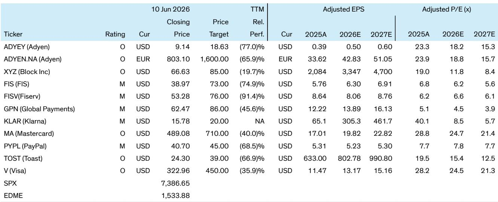

# Card Networks Are No Longer Just Payment Rails—They Are the Trust Infrastructure for the Agentic Economy

The announcement that Visa has partnered with OpenAI to enable agentic commerce is not merely a corporate press release. It is a strategic signal that the card networks have moved from being potential victims of the AI revolution to becoming essential infrastructure providers for the machine-to-machine economy. For investors who have spent the past year worrying that AI agents would disintermediate Visa and Mastercard, the news demands a fundamental reassessment. The networks are not facing obsolescence; they are stepping into a role that no other participant can credibly fill.

The core thesis is straightforward but profound. As commerce shifts from human-initiated transactions to autonomous agent workflows, the scarcity factor is not processing speed or data storage. It is trust. Agents will need to conduct transactions without human oversight, across millions of merchants, in real time, with fraud risks that are fundamentally different from today's human-centric commerce. The card networks, with their existing infrastructure of 7 billion credentials, 100 million merchant endpoints, and decades of building the world's most sophisticated trust and authentication systems, are uniquely positioned to become the operating system for agentic payments.

This partnership with OpenAI is the first major proof point that the thesis is real. It validates that the largest AI platform sees card infrastructure as the solution for secure, transparent, and user-controlled agentic transactions. The implications extend far beyond a single partnership. They reshape the investment narrative for the entire payments ecosystem.

## The Partnership with OpenAI Validates That Cards Are the Default Trust Layer for Agentic Commerce, Not an Afterthought

The Visa-OpenAI announcement addresses two specific areas: enabling seamless agentic commerce experiences today, and exploring future use cases including developer-focused autonomous agent experiences and conversational automated workflows. The language from OpenAI is instructive. Their commerce lead explicitly states that "commerce is going to happen in many more places and in many more ways than it does today" and that agents will help people complete tasks involving money. The key phrase is "secure, transparent, and user-controlled agentic transactions."

This is not a speculative experiment. It is a production-oriented partnership that builds on Visa's existing Intelligent Commerce platform and introduces new capabilities specifically designed for the agentic world. Visa announced Agent Score, which allows merchants to evaluate their websites for agentic commerce readiness. It announced an Agentic Directory to verify whether merchants or agents are legitimate. And it introduced a Large Transaction Model specifically for fraud detection in agent-initiated transactions.

Each of these services creates a new monetization vector. The token enhancements Visa announced simultaneously bring more data context to transactions, including information on transaction type, where the token is being used, and who is making the payment. This allows the network to generate a signal of trust behind each transaction using token history. In the agentic world, where a transaction might be initiated by an AI assistant booking a restaurant, a supply chain bot ordering inventory, or a personal finance agent paying bills, the ability to authenticate and score trust becomes more valuable, not less.

The strategic significance is that Visa and Mastercard are not waiting for the market to develop around them. They are actively building the infrastructure that will define how agentic commerce operates. Mastercard's simultaneous announcement of Agent Pay for Machines, a credentialed multi-rail service for permissioned machine payments, with partners including Adyen, Ant, Checkout, Coinbase, Lovable, and Stripe, shows this is an industry-wide shift, not a single company initiative.

## The Agentic Era Transforms Value-Added Services from a Growth Driver into a Structural Moat

One of the most underappreciated implications of the agentic commerce shift is what it means for the networks' value-added services businesses. Historically, VAS has been a growth engine for Visa and Mastercard, but it has always been somewhat ancillary to the core transaction processing business. Agentic commerce changes this equation fundamentally.

In a human-initiated transaction, the merchant and the cardholder have existing relationships and trust signals. The network's role is primarily authentication and settlement. In an agent-initiated transaction, neither the agent nor the merchant may have a prior relationship. The agent is acting on behalf of a human, but the human may not be directly involved in the transaction details. This creates an entirely new set of trust requirements.

Consider the services Visa announced alongside the OpenAI partnership. Agent Score is essentially a certification that a merchant's website can handle agentic commerce. This is not just a technical specification; it is a trust signal. Merchants who pass the Agent Score assessment will be more likely to be selected by agents for transactions. The Agentic Directory serves a similar function for identity verification. And the Large Transaction Model for fraud detection addresses a risk that is qualitatively different from human fraud—agents can execute thousands of transactions per second, creating patterns that traditional fraud models are not designed to detect.

Each of these services represents a recurring revenue stream that grows as agentic commerce scales. More importantly, they create a barrier to entry. A competitor would need to build not just a payment processing network, but a comprehensive trust infrastructure that includes identity verification, fraud detection, merchant certification, and token management. The networks have been building these capabilities for decades, and the agentic era makes them more valuable, not less.

## The Risk That Agentic Commerce Disintermediates Cards Is Fundamentally Misplaced

The prevailing narrative among some investors has been that AI agents would bypass traditional card networks, using stablecoins, direct bank transfers, or new blockchain-based payment rails. This view misunderstands both the nature of agentic commerce and the structural advantages of card infrastructure.

In the agentic world, trust will be the scarcest resource. When an AI agent is authorized to make payments on behalf of a human, the human needs to know that the transaction is secure, that the merchant is legitimate, and that there is recourse if something goes wrong. Card networks provide exactly this framework. They offer chargeback mechanisms, fraud liability protection, and a global merchant acceptance network that no alternative can match.

The scale argument is equally important. Visa and Mastercard have relationships with over 100 million merchants worldwide. An AI agent that needs to book a hotel, order supplies, or pay for compute resources can use card credentials at any of these merchants without needing to establish new payment relationships. For agentic commerce to scale, it needs ubiquity, and ubiquity is exactly what the card networks provide.

The commercial model is also adaptable. Critics have argued that card economics do not work for the microtransactions that agentic commerce might generate, such as paying for individual API calls or image generation tokens. But Visa and Mastercard have already solved this problem for transit and vending machine transactions, which have similarly small ticket sizes. The networks can adjust their commercial models to accommodate autonomous agent transactions, just as they have done historically.

Perhaps most importantly, the B2B use case for agentic commerce has the strongest product-market fit, and B2B is already a massive opportunity for the networks. Supply chain automation, procurement, and enterprise expense management are areas where agents can add significant value, and where card infrastructure is already deeply embedded.

## The Report Leaves a Critical Question Unanswered: How Does the Economics of Agentic Commerce Scale Across Different Transaction Types?

For all the strategic clarity the report provides, it leaves one question deliberately open, and it is the question that will determine the magnitude of the investment opportunity. The report acknowledges that agentic commerce is a five-year opportunity, not a two-year one. But within that timeframe, the economics will look very different depending on which use cases scale first and fastest.

The report identifies three broad categories of agentic transactions: consumer-facing commerce, where an agent books a restaurant or buys a product on behalf of a human; enterprise machine payments, where supply chain systems or ERP platforms initiate transactions autonomously; and microtransactions for compute or digital assets, where agents pay for individual API calls or token usage.

Each of these categories has a different revenue profile for the networks. Consumer-facing commerce looks most like existing card transactions, with similar interchange rates and volume-based economics. Enterprise machine payments could be higher value but lower volume, with different pricing models. Microtransactions require fundamentally different economics, potentially subscription-based or volume-tiered pricing.

The report does not specify which of these use cases the Visa-OpenAI partnership is primarily targeting, or how the revenue sharing will work. It also does not clarify how the new value-added services will be priced. Will Agent Score be a flat fee, a per-transaction charge, or a subscription? Will the Large Transaction Model for fraud detection be bundled with existing fraud services or sold separately?

These questions matter because they determine whether agentic commerce is a moderate growth driver for the networks or a transformative revenue opportunity. The report's thesis is compelling, but the details of economic scaling remain to be seen. Investors will need to track how these pricing models evolve as the partnerships move from announcement to production.

## A Decision Framework for Evaluating the Agentic Commerce Opportunity

For investors trying to assess which companies in the payments ecosystem are best positioned for the agentic shift, the report provides a clear framework. The analysis suggests that the key differentiator is not processing technology but trust infrastructure. Companies that own the trust layer—identity verification, fraud detection, merchant certification, and token management—will capture disproportionate value.

The first dimension to evaluate is network effects. Visa and Mastercard benefit from two-sided network effects that are nearly impossible to replicate. Every merchant that accepts card credentials makes the network more valuable for agents, and every agent that can use card credentials makes the network more valuable for merchants. This creates a self-reinforcing cycle that new entrants cannot match.

The second dimension is vertical integration of trust services. The report highlights that Visa's announcement includes multiple new services that extend beyond payment processing into merchant certification, agent verification, and fraud detection. Companies that can offer a comprehensive trust stack will be better positioned than those that rely on third-party providers for these capabilities.

The third dimension is adaptability of commercial models. The networks that can adjust their pricing to accommodate microtransactions, subscription models, and B2B workflows will capture more of the opportunity. The report notes that Visa and Mastercard have historically done this for transit and vending, suggesting they have the organizational capability to adapt.

The fourth dimension is partnership ecosystem. The Visa-OpenAI and Mastercard-Agent Pay announcements show that the networks are actively building relationships with the major AI platforms. Companies that are integrated into the agent ecosystem early will benefit from first-mover advantages in data, trust scoring, and merchant certification.

Applying this framework, the report's outperform ratings on Visa and Mastercard make strategic sense. But the framework also raises questions about other players. Payment processors and acquirers may need to invest significantly in agentic capabilities to remain relevant. Merchants will need to adopt new certification and verification services. And new entrants will face high barriers to building the trust infrastructure that the networks already have.

## The Full Report Contains the Data and Charts That Make These Arguments Actionable

This article has synthesized the strategic thesis from a comprehensive research report on the card networks' entry into agentic commerce. But the full report contains the detailed analysis, data, and charts that turn these insights into investment decisions. It includes the specific product roadmaps for Visa and Mastercard, the competitive positioning of other players in the ecosystem, and the revenue modeling that quantifies the opportunity across different scenarios.

The report also addresses the regulatory and competitive risks that this article has deliberately left open. How do stablecoins and CBDCs interact with the card networks' agentic strategy? What happens if major tech platforms build their own trust infrastructure? How do the networks manage the tension between enabling agentic commerce and ensuring consumer protection?

These are the questions that the full report explores in depth, with the data and analysis that serious investors need to make informed decisions. The charts alone provide a visual framework for understanding the scale of the opportunity and the competitive dynamics.

Join the community to read the full report and review the original charts.

*This article is for learning and discussion only and does not constitute investment advice.*

Personal reading notes and learning share only. Not investment advice.

