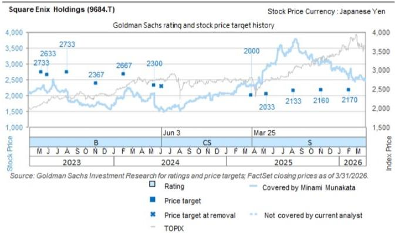
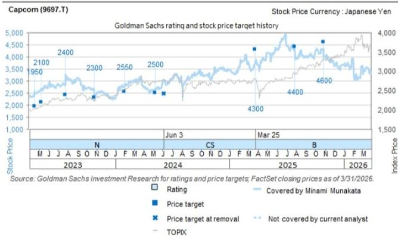
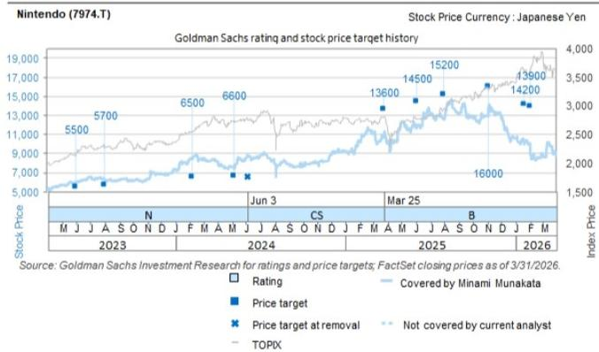
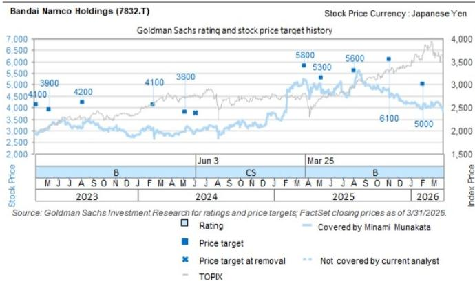

# Japan Games and Internet: Our views following new title announcement events: Reiterate Buy ratings on Sony and Capcom

A series of new console game announcement events were held from June 3 to June 9. Specifically, the official PlayStation broadcast “State of Play” was held at 6:00 AM on June 3, the large-scale game announcement event “Summer Game Fest 2026” at 6:00 AM on June 6, the official Xbox broadcast “Xbox Games Showcase 2026” at 2:00 AM on June 8, and the official Nintendo broadcast “Nintendo Direct 2026.6.9” at 11:00 PM on June 9 (all times JST). The major pipeline for 2026 onward, including content newly announced at these events, is shown in Exhibit 1. In 2026, partly because Grand Theft Auto VI, the latest installment in one of the gaming industry’s most iconic IP franchises, is scheduled for release in November 2026, our impression is that major title releases are concentrated in late September through October. In our view, the lineup of titles for PlayStation is strong, giving a positive impression for the Sony Group (Buy). Among publishers, we highlight the standout depth of Capcom’s (Buy) pipeline through 2027, with the announcement of the release of major DLC for Monster Hunter Wilds and Resident Evil Veronica in 2027, as well as the steady expansion of Square Enix’s (Sell) pipeline from a medium- to long-term perspective. As we discuss in detail below, we reiterate our Buy ratings on: Sony Group, which has a strong pipeline and multiple profit improvement drivers even amid a high-cost environment; and Capcom, whose shares look undervalued despite strong earnings and a robust pipeline. Our detailed views on each company are as follows:

## Platformers

■ Sony Group (Buy): In addition to Grand Theft Auto VI, the pipeline for FY2026 is strong for both first-party and third-party software. Moreover, amid rising costs, led by memory costs, the company has clearly stated its policy of balancing growth and profitability improvement in its business operations (see our report dated June 5). Furthermore, with the PlayStation 5 in the latter half of its cycle, Sony appears to be in a relatively good position to manage hardware profitability through adjustments to unit volumes and selling prices, and we see its positioning as favorable compared with Nintendo in that context. We reiterate our Buy rating.

Nintendo (Buy): While the game characteristics of upcoming first-party and third-party software are diverse, suggesting room to attract a broad range of users, the only major first-party title scheduled for release in 2026 is The Legend of Zelda: Ocarina of Time (remake), which is somewhat underwhelming

Minami Munakata

+81(3)4587-9830

minami.munakata@gs.com

GS Japan Co., Ltd.

Haruki Kubota

+81(3)4587-4059

haruki.kubota@gs.com

GS Japan Co., Ltd.

compared to market expectation before the event. In Japan, a price increase for the Nintendo Switch 2 console was implemented on May 25, with increases in the US and Europe scheduled for September 1. Based on the precedent of the PS5, which achieved penetration at a pace comparable to the PS4 despite multiple price increases, we believe that from a medium- to long-term perspective, the Nintendo Switch 2 will also achieve steady penetration as the pipeline expands. While it may take time, we believe the share price will gradually begin to recover once sell-through and other actual data confirm solid momentum for the Nintendo Switch 2.

## Publishers

\- Capcom (Buy): While the announcement of major DLC for Monster Hunter Wilds was in line with expectations, we view the announcement that Resident Evil Veronica will be released in 2027 as a positive. In addition to Onimusha: Way of the Sword, announced for release on September 25, the company has already released Pragmata on April 17. In the visual content space, the Street Fighter movie is scheduled for October, and a completely new Resident Evil film is scheduled for sequential release from September onward. We believe the FY3/27 pipeline and event calendar is more robust than those of peers. We reiterate our Buy rating, also considering the shares' attractive valuation (FY2 P/E is now close to sector median along with robust profit growth).

\- Square Enix (Sell): FINAL FANTASY VII REVELATION, the third installment of the FINAL FANTASY VII Remake trilogy, was announced for release in spring 2027, and the release of several other new titles was also announced, giving us the impression that preparations for new title launches are progressing steadily. In addition, while no release date was announced for Dragon Quest XII, which is currently in development, the company provided a long-awaited update, unveiling a significant overhaul of the game’s concept along with gameplay footage. The content suggests that the initiatives under the current medium-term plan, which the company has positioned as “a three-year reboot,” are bearing fruit, and our medium- to long-term impression is positive. However, the company remains in a structural reform execution phase in the near term, and we maintain our Sell rating given relatively stretched valuations (FY2 P/E of 26x is well above the global game sector’s median of 16x).

Bandai Namco (Sell): While release dates for major titles such as Ace Combat 8: Wings of Theve and ELDEN RING Tarnished Edition were announced, along with the announcement that GUNDAM ROGUE ORBIT, a completely new Mobile Suit Gundam action game, will be released in 2027, we cannot conclude at this point that the probability of achieving the company's 2H FY3/27 operating profit guidance for the digital business (which implies an $87\%$ yoy increase) has increased. Our view that the digital business guidance is somewhat optimistic remains unchanged. We maintain our Sell rating.

Exhibit 1: Schedule for the release of major game titles

<table><tr><td>Title</td><td>Publisher</td><td>Switch 2</td><td>PS5</td><td>Xbox X/S</td><td>Release date</td></tr><tr><td>Power-Pro 2026-2027</td><td>Konami</td><td>✓</td><td>✓</td><td></td><td>6/11/2026</td></tr><tr><td>The Adventures of Elliot: Millennium Tales</td><td>Square Enix</td><td>✓</td><td>✓</td><td>✓</td><td>6/18/2026</td></tr><tr><td>Devil May Cry 5: Devil Hunter Edition</td><td>Capcom</td><td>✓</td><td></td><td></td><td>6/23/2026</td></tr><tr><td>Star Fox</td><td>Nintendo</td><td>✓</td><td></td><td></td><td>6/25/2026</td></tr><tr><td>DEAD OR ALIVE 6 Last Round</td><td>Koei Tecmo</td><td></td><td>✓</td><td>✓</td><td>6/25/2026</td></tr><tr><td>Rhythm Heaven Groove</td><td>Nintendo</td><td>✓</td><td></td><td></td><td>7/2/2026</td></tr><tr><td>Echoes of Aincrad</td><td>Bandai Namco</td><td></td><td>✓</td><td>✓</td><td>7/9/2026</td></tr><tr><td>Digimon Story Time Stranger for Nintendo Switch 2</td><td>Bandai Namco</td><td>✓</td><td></td><td></td><td>7/9/2026</td></tr><tr><td>Assacin&#x27;s Creed Black Flag RE: Synchro</td><td>Ubisoft</td><td></td><td>✓</td><td>✓</td><td>7/9/2026</td></tr><tr><td>Palworld 1.0</td><td>Pocket Pair</td><td></td><td>✓</td><td>✓</td><td>7/10/2026</td></tr><tr><td>Pro Baseball Spirits 2026</td><td>Konami</td><td></td><td>✓</td><td></td><td>7/16/2026</td></tr><tr><td>Splatoon Raiders</td><td>Nintendo</td><td>✓</td><td></td><td></td><td>7/23/2026</td></tr><tr><td>Halo: Campaign Evolved</td><td>Xbox Game Studios</td><td></td><td>✓</td><td>✓</td><td>7/28/2026</td></tr><tr><td>Xenoblade 2: Nintendo Switch 2 Edition</td><td>Nintendo</td><td>✓</td><td></td><td></td><td>7/30/2026</td></tr><tr><td>Beast of Reincarnation</td><td>Game Freak</td><td></td><td>✓</td><td>✓</td><td>8/4/2026</td></tr><tr><td>MARVEL: Tōkon Fighting Souls</td><td>SIE</td><td></td><td>✓</td><td></td><td>8/7/2026</td></tr><tr><td>STAR WARS ZERO COMPANY</td><td>Electronic Arts</td><td></td><td>✓</td><td>✓</td><td>8/27/2026</td></tr><tr><td>METAL GEAR SOLID: MASTER COLLECTION Vol.2</td><td>Konami</td><td>✓</td><td>✓</td><td>✓</td><td>8/27/2026</td></tr><tr><td>BRIGANDINE ABYSS</td><td>Happinet</td><td>✓</td><td>✓</td><td>✓</td><td>8/27/2026</td></tr><tr><td>ELDEN RING Tarnished Edition</td><td>Bandai Namco</td><td>✓</td><td></td><td></td><td>8/28/2026</td></tr><tr><td>The Blood of Dawnwalker</td><td>Bandai Namco</td><td></td><td>✓</td><td>✓</td><td>9/3/2026</td></tr><tr><td>Marvel&#x27;s Wolverine</td><td>SIE</td><td></td><td>✓</td><td></td><td>9/15/2026</td></tr><tr><td>Fire Emblem: Fortune&#x27;s Weave</td><td>Nintendo</td><td>✓</td><td></td><td></td><td>9/17/2026</td></tr><tr><td>Control Resonant</td><td>Remedy Entertainment</td><td></td><td>✓</td><td>✓</td><td>9/24/2026</td></tr><tr><td>SILENT HILL: Townfall</td><td>Konami</td><td></td><td>✓</td><td></td><td>9/24/2026</td></tr><tr><td>ONIMUSHA: Way of the sword</td><td>Capcom</td><td>✓</td><td>✓</td><td>✓</td><td>9/25/2026</td></tr><tr><td>Minecraft Dungeons II</td><td>Xbox Game Studios</td><td>✓</td><td>✓</td><td>✓</td><td>9/29/2026</td></tr><tr><td>Rayman Legends Retold</td><td>Ubisoft</td><td>✓</td><td>✓</td><td>✓</td><td>10/1/2026</td></tr><tr><td>Dynasty Warriors 2 Remastered</td><td>Koei Tecmo</td><td>✓</td><td>✓</td><td>✓</td><td>10/1/2026</td></tr><tr><td>ACE COMBAT 8: WINGS OF THEVE</td><td>Bandai Namco</td><td></td><td>✓</td><td>✓</td><td>10/2/2026</td></tr><tr><td>Gears of War: E-Day</td><td>Xbox Game Studios</td><td></td><td></td><td>✓</td><td>10/6/2026</td></tr><tr><td>KINGDOM HEARTS Collection I~III</td><td>Square Enix</td><td>✓</td><td>✓</td><td>✓</td><td>10/8/2026</td></tr><tr><td>Dragon&#x27;s Dogma II: Dark Arisen</td><td>Capcom</td><td>✓</td><td>✓</td><td>✓</td><td>10/9/2026</td></tr><tr><td>Castlevania: Belmont&#x27;s Curse</td><td>Konami</td><td>✓</td><td>✓</td><td>✓</td><td>10/15/2026</td></tr><tr><td>Final Fantasy Resonance</td><td>Square Enix</td><td>✓</td><td>✓</td><td>✓</td><td>10/22/2026</td></tr><tr><td>Nintendo Switch Sports Resort</td><td>Nintendo</td><td>✓</td><td></td><td></td><td>10/22/2026</td></tr><tr><td>ONE PIECE: Grand Gourmet</td><td>Bandai Namco</td><td>✓</td><td></td><td></td><td>10/22/2026</td></tr><tr><td>Sanrio Party Land</td><td>Sanrio Games</td><td>✓</td><td></td><td></td><td>10/29/2026</td></tr><tr><td>Metaphor: ReFantazio (Nintendo Switch 2 ver.)</td><td>ATLUS</td><td>✓</td><td></td><td></td><td>11/12/2026</td></tr><tr><td>Grand Theft Auto VI</td><td>Rockstar Games</td><td></td><td>✓</td><td>✓</td><td>11/19/2026</td></tr><tr><td>Xenoblade 3: Nintendo Switch 2 Edition</td><td>Nintendo</td><td>✓</td><td></td><td></td><td>12/3/2026</td></tr><tr><td>DRAGON QUEST MONSTERS: The Withered World</td><td>Square Enix</td><td>✓</td><td>✓</td><td>✓</td><td>12/4/2026</td></tr><tr><td>The Legend of Zelda: Ocarina of Time</td><td>Nintendo</td><td>✓</td><td></td><td></td><td>2026</td></tr><tr><td>Professor Layton and the New World</td><td>LEVEL5</td><td>✓</td><td></td><td></td><td>2026</td></tr><tr><td>The Duskbloods</td><td>FromSoftware</td><td>✓</td><td></td><td></td><td>2026</td></tr><tr><td>ANANTA</td><td>NetEase Games</td><td></td><td>✓</td><td></td><td>2026</td></tr><tr><td>NOBUNAGA&#x27;S AMBITION: Hishou</td><td>Koei Tecmo</td><td>✓</td><td>✓</td><td></td><td>This Winter</td></tr><tr><td>Stranger than Heaven</td><td>SEGA</td><td></td><td>✓</td><td>✓</td><td>1/15/2027</td></tr><tr><td>Tomb Raider: Legacy of Atlantis</td><td>Amazon Games</td><td></td><td>✓</td><td>✓</td><td>2/12/2027</td></tr><tr><td>PERSONA 4 REVIVAL</td><td>ATLUS</td><td></td><td>✓</td><td>✓</td><td>2/18/2027</td></tr><tr><td>Fable</td><td>Xbox Game Studios</td><td></td><td></td><td>✓</td><td>2/23/2027</td></tr><tr><td>METRO 2039</td><td>Deep Silver</td><td></td><td>✓</td><td>✓</td><td>Feb 2027</td></tr><tr><td>Wo Long 2: Wings of Ember</td><td>Koei Tecmo</td><td>✓</td><td>✓</td><td>✓</td><td>Early 2027</td></tr><tr><td>Atelier Karia: The Night Kingdom &amp; the Guide of Memories</td><td>Koei Tecmo</td><td>✓</td><td>✓</td><td>✓</td><td>Early 2027</td></tr><tr><td>FINAL FANTASY VII REVELATION</td><td>Square Enix</td><td>✓</td><td>✓</td><td>✓</td><td>2027 Spring</td></tr><tr><td>Pokémon Winds &amp; Pokémon Waves</td><td>Nintendo</td><td>✓</td><td></td><td></td><td>2027</td></tr><tr><td>Xenoblade Genesis</td><td>Nintendo</td><td>✓</td><td></td><td></td><td>2027</td></tr><tr><td>Until Dawn 2</td><td>SIE</td><td></td><td>✓</td><td></td><td>2027</td></tr><tr><td>Monster Hunter Wilds: Ascendance</td><td>Capcom</td><td>✓</td><td>✓</td><td>✓</td><td>2027</td></tr><tr><td>Resident Evil Veronica</td><td>Capcom</td><td>✓</td><td>✓</td><td>✓</td><td>2027</td></tr><tr><td>Mega Man: Dual Override</td><td>Capcom</td><td>✓</td><td>✓</td><td>✓</td><td>2027</td></tr><tr><td>Dragonball Xenoverse 3</td><td>Bandai Namco</td><td></td><td>✓</td><td>✓</td><td>2027</td></tr><tr><td>Digimon Story Time Stranger: DLC</td><td>Bandai Namco</td><td>✓</td><td>✓</td><td>✓</td><td>2027</td></tr><tr><td>GUNDAM ROGUE ORBIT</td><td>Bandai Namco</td><td></td><td>✓</td><td>✓</td><td>2027</td></tr><tr><td>VIRTUA FIGHTER CROSSROADS</td><td>SEGA</td><td></td><td>TBD</td><td></td><td>2027</td></tr><tr><td>CRAZY TAXI World Tour</td><td>SEGA</td><td>✓</td><td>✓</td><td>✓</td><td>2027</td></tr><tr><td>GOD OF WAR LAWFEY</td><td>SIE</td><td></td><td>✓</td><td></td><td>TBD</td></tr></table>

Green highlight denotes titles released by overseas publishers  
Source: Company data

## Price Target Risks and Methodology - Sony Group

Our 12-month target price of ¥4,100 is based on a sum-of-the-parts (SOTP) valuation.

Our base year for the valuation is FY3/29E. Key downside risks to our target price include: (1) G&NS business; (i) Lower-than-expected PS5 hardware unit sales; (ii)

lower-than-expected revenue per console unit due to delays in the launch of new software, live service games, and downloadable content (DLC) from first and third parties, or weaker-than-expected performance of these offerings; and (iii) deterioration in hardware profitability due to higher promotion expenses or component costs. (2) Pictures business: Slower-than-expected growth in paying subscribers at anime streaming platform Crunchyroll, which we consider a key driver of earnings in this segment, or higher-than-expected promotion and marketing expenses. (3) I&SS business: Slower growth in the market for CMOS image sensors for mobile devices, ASP declines due to intensifying competition (particularly from Chinese companies), or deterioration in product yields due to increasing manufacturing difficulty accompanying performance improvements in CMOS image sensors.

## Price Target Risks and Methodology - Nintendo

Our 12-month target price of ¥10,500 is based on FY3/29E EV/NOPAT. Our target EV/NOPAT multiple is 20.1X. We base our applied multiple on the average FY3E EV/NOPAT over the past year. Key downside risks to our target price are (1) Nintendo Switch 2: Sales falling short of our forecasts. (2) Active console units: If the momentum of the existing Nintendo Switch slows more than expected due to the transition to the successor console, this could result in the number of active console units on the Nintendo Switch platform falling short of our forecasts. (3) Pipeline: The delayed release of major titles, mainly first-party titles, and lower-than-expected unit sales. (4) Hardware profitability: Profitability of hardware sales deteriorating more than we expect due to a greater-than-expected rise in component costs and delays in passing on prices.

## Price Target Risks and Methodology - Capcom

Our 12-month target price of ¥4,200 is based on FY3/28E EV/NOPAT. Our target EV/NOPAT multiple of 21.3X is a 25% premium to the FY27 median of 17.0X for the global games sector. Key downside risks to our target price are (1) Pipeline: If the release of major titles is delayed, this could introduce volatility to the annual pipeline and lead to downside risk to new title sales volume. (2) Impairment: If user preferences change, this could lead to the cancellation of content development and/or the booking of large impairment losses due to weak performance of new titles. (3) Erosion of IP Value: If the company excessively focuses on game software pricing strategies, this could lead to a steeper-than-expected decline in unit prices, particularly for old titles, eroding IP value.

## Price Target Risks and Methodology - Square Enix Holdings

Our 12-month target price of ¥2,100 is based on FY3/27E EV/NOPAT. Our target EV/NOPAT multiple of 13.5X is a 25% discount to the FY26 median of 18.0X for the global games sector. Key upside risks to our target price are: (1) HD game pipeline: We currently assume no major title launches that are likely to record annual shipments of more than 5 mn units in the short term, but new AAA titles could be announced and released, driving HD game earnings. (2) Mobile game performance: We assume that mobile game sales will continue on a downward trend. However, a major new title could be launched, and sales in this business could shift to an upward trend sooner than we expect. (3) Structural reforms: We expect meaningful benefits from structural reforms to start emerging from FY3/27, but margin improvement in the game business could occur earlier than we assume, and earnings could enter a period of significant expansion.

## Price Target Risks and Methodology - Bandai Namco Holdings

Our 12-month target price of ¥3,300 is based on SoTP: Toys and Hobby business: We use FY3/28 as the base year for our valuation. We apply the FY2E EV/NOPAT median of 11.4x of six global toy & hobby related companies. Other businesses including the Digital business: We apply the FY2E EV/NOPAT median of 15.8x for the seven Japanese games companies in our coverage.

Key upside risks are (1) Toys and Hobby business: Better-than-expected sales of high-target products centered on Gunpla and card games; stronger-than-expected momentum for the One Piece, Dragon Ball, and Mobile Suit Gundam IPs, mainly overseas; Lower-than-expected costs led by improvement in macroeconomic environment; (2) Mobile games: Higher-than-expected sales due to major new hit titles; better-than-expected margin improvement due to the spread of payments outside of app stores and optimization of operating costs; and (3) Console: Higher-than-expected sales due to major new hit titles and growth in repeat sales; better-than-expected profitability improvement from the company's focus on reviewing its development structure and rebuilding its title portfolio.

## Disclosure Appendix

## Reg AC

We, Minami Munakata and Haruki Kubota, hereby certify that all of the views expressed in this report accurately reflect our personal views about the subject company or companies and its or their securities. We also certify that no part of our compensation was, is or will be, directly or indirectly, related to the specific recommendations or views expressed in this report.

Unless otherwise stated, the individuals listed on the cover page of this report are analysts in GS' Global Investment Research division.

Contributing Authors: Minami Munakata GS Japan Co., Ltd., Haruki Kubota GS Japan Co., Ltd..

Unless otherwise stated, the individuals listed in the Contributing Authors disclosure of this report are analysts in GS' Global Investment Research division.

## GS Factor Profile

The GS Factor Profile provides investment context for a stock by comparing key attributes to the market (i.e. our universe of rated stocks) and its sector peers. The four key attributes depicted are: Growth, Financial Returns, Multiple (e.g. valuation) and Integrated (a composite of Growth, Financial Returns and Multiple). Growth, Financial Returns and Multiple are calculated by using normalized ranks for specific metrics for each stock. The normalized ranks for the metrics are then averaged and converted into percentiles for the relevant attribute. The precise calculation of each metric may vary depending on the fiscal year, industry and region, but the standard approach is as follows:

Growth is based on a stock's forward-looking sales growth, EBITDA growth and EPS growth (for financial stocks, only EPS and sales growth), with a higher percentile indicating a higher growth company. Financial Returns is based on a stock's forward-looking ROE, ROCE and CROCI (for financial stocks, only ROE), with a higher percentile indicating a company with higher financial returns. Multiple is based on a stock's forward-looking P/E, P/B, price/dividend (P/D), EV/EBITDA, EV/FCF and EV/Debt Adjusted Cash Flow (DACF) (for financial stocks, only P/E, P/B and P/D), with a higher percentile indicating a stock trading at a higher multiple. The Integrated percentile is calculated as the average of the Growth percentile, Financial Returns percentile and (100% - Multiple percentile).

Financial Returns and Multiple use the GS analyst forecasts at the fiscal year-end at least three quarters in the future. Growth uses inputs for the fiscal year at least seven quarters in the future compared with the year at least three quarters in the future (on a per-share basis for all metrics).

For a more detailed description of how we calculate the GS Factor Profile, please contact your GS representative.

## M&A Rank

Across our global coverage, we examine stocks using an M&A framework, considering both qualitative factors and quantitative factors (which may vary across sectors and regions) to incorporate the potential that certain companies could be acquired. We then assign a M&A rank as a means of scoring companies under our rated coverage from 1 to 3, with 1 representing high (30%-50%) probability of the company becoming an acquisition target, 2 representing medium (15%-30%) probability and 3 representing low (0%-15%) probability. For companies ranked 1 or 2, in line with our standard departmental guidelines we incorporate an M&A component into our target price. M&A rank of 3 is considered immaterial and therefore does not factor into our price target, and may or may not be discussed in research.

## Quantum

Quantum is GS' proprietary database providing access to detailed financial statement histories, forecasts and ratios. It can be used for in-depth analysis of a single company, or to make comparisons between companies in different sectors and markets.

## Disclosures

The rating(s) for Bandai Namco Holdings, Capcom, Nintendo, Sony Group and Square Enix Holdings is/are relative to the other companies in its/their coverage universe: Bandai Namco Holdings, Capcom, CyberAgent, Konami Group, LY Corp., Nexon, Nintendo, Oriental Land, Recruit Holdings, Sony Group, Square Enix Holdings

## Company-specific regulatory disclosures

The following disclosures relate to relationships between The GS Group, Inc. (with its affiliates, “GS”) and companies covered by GS Global Investment Research and referred to in this research.

GS beneficially owned 1% or more of common equity (excluding positions managed by affiliates and business units not required to be aggregated under US securities law) as of the month end preceding this report: Bandai Namco Holdings (¥3,656) and Square Enix Holdings (¥2,480)

GS has received compensation for investment banking services in the past 12 months: Sony (ADR) (\$20.76), Sony Group (¥3,385) and Square Enix Holdings (¥2,480)

GS expects to receive or intends to seek compensation for investment banking services in the next 3 months: Bandai Namco Holdings (¥3,656), Capcom (¥2,869), Nintendo (¥7,215), Sony (ADR) (\$20.76), Sony Group (¥3,385) and Square Enix Holdings (¥2,480)

GS had an investment banking services client relationship during the past 12 months with: Bandai Namco Holdings (¥3,656), Capcom (¥2,869), Nintendo (¥7,215), Sony (ADR) (\$20.76), Sony Group (¥3,385) and Square Enix Holdings (¥2,480)

GS had a non-investment banking securities-related services client relationship during the past 12 months with: Nintendo (¥7,215), Sony (ADR) (\$20.76), Sony Group (¥3,385) and Square Enix Holdings (¥2,480)

GS had a non-securities services client relationship during the past 12 months with: Capcom (¥2,869), Nintendo (¥7,215), Sony (ADR) (\$20.76) and Sony Group (¥3,385)

GS makes a market in the securities or derivatives thereof: Nintendo (¥7,215), Sony (ADR) (\$20.76) and Sony Group (¥3,385)

## Distribution of ratings/investment banking relationships

GS Investment Research global Equity coverage universe

<table><tr><td rowspan="2"></td><td colspan="3">Rating Distribution</td></tr><tr><td>Buy</td><td>Hold</td><td>Sell</td></tr><tr><td>Global</td><td>50%</td><td>34%</td><td>16%</td></tr></table>

<table><tr><td colspan="3">Investment Banking Relationships</td></tr><tr><td>Buy</td><td>Hold</td><td>Sell</td></tr><tr><td>65%</td><td>60%</td><td>45%</td></tr></table>

As of April 1, 2026, GS Global Investment Research had investment ratings on 3,074 equity securities. GS assigns stocks as Buys and Sells on various regional Investment Lists; stocks not so assigned are deemed Neutral. Such assignments equate to Buy, Hold and Sell for the purposes of the above disclosure required by the FINRA Rules. See ‘Ratings, Coverage universe and related definitions’ below. The Investment Banking Relationships chart reflects the percentage of subject companies within each rating category for whom GS has provided investment banking services within the previous twelve months.

Price target and rating history chart(s)  

line chart

| Date | Stock Price | Index Price | Rating | Price Target | Not Covered by Current Analyst |
| --- | --- | --- | --- | --- | --- |
| Jun 3 | 2733 | 2633 |  |  |  |
| Jun 3 | 2733 | 2733 |  |  |  |
| Jun 3 | 2367 | 2367 |  |  |  |
| Jun 3 | 2667 | 2667 |  |  |  |
| Jun 3 | 2300 | 2300 |  |  |  |
| Jun 3 | 2000 | 2000 |  |  |  |
| Jun 3 | 2033 | 2033 |  |  |  |
| Jun 3 | 2133 | 2133 |  |  |  |
| Jun 3 | 2160 | 2160 |  |  |  |
| Jun 3 | 2170 | 2170 |  |  |  |
| Jun 3 |  |  |  |  |  |
| Jun 3 |  |  |  |  |  |
| Jun 3 |  |  |  |  |  |
| Jun 3 |  |  |  |  |  |
| Jun 3 |  |  |  |  |  |
| Jun 3 |  |  |  |  |  |
| Jun 3 |  |  |  |  |  |
| Jun 3 |  |  |  |  |  |
| Jun 3 |  |  |  |  |  |
| Jun 3 |  |  |  |  |  |
| Jun 3 |  |  |  |  |  |
| Jun 3 |  |  |  |  |  |
| Jun 3 |  |  |  |  |  |

The price targets shown should be considered in the context of all prior published GS, which may or may not have included price targets, as well as developments relating to the company, its industry and financial markets.

line chart

| Date | Stock Price | Index Price | Rating | Price target | Not covered by current analyst |
| --- | --- | --- | --- | --- | --- |
| Jul 12 | 2700 | 2,500 | N |  |  |
| A | 3200 | 2,700 | B |  |  |
| S | 3340 | 2,800 |  |  |  |
| O | 3200 | 2,900 | N |  |  |
| D | 3180 | 3,000 | J |  |  |
| F | 3120 | 3,100 | M |  |  |
| M | 3180 | 3,200 | M |  |  |
| A | 3180 | 3,300 | M |  |  |
| M | 3180 | 3,400 | M |  |  |
| J | 3180 | 3,500 | M |  |  |
| J | 3180 | 3,600 | M |  |  |
| A | 3180 | 3,700 | M |  |  |
| S | 3180 | 3,800 | N |  |  |
| D | 3180 | 3,900 | N |  |  |
| F | 3180 | 4,000 | N |  |  |
| M | 3180 | 4,100 | N |  |  |
| A | 3180 | 4,200 | N |  |  |
| J | 3180 | 4,300 | N |  |  |
| A | 3180 | 4,400 | N |  |  |
| M | 3180 | 4,500 | N |  |  |
| A | 3180 | 4,600 | N |  |  |
| J | 3180 | 4,700 | N |  |  |
| A | 3180 | 4,800 | N |  |  |
| S | 3180 | 4,900 | N |  |  |
| O | 3180 | 5,000 | N |  |  |
| D | 3180 | 5,100 | N |  |  |
| J | 3180 | 5,200 | N |  |  |
| F | 3180 | 5,300 | N |  |  |
| M | 3180 | 5,400 | N |  |  |
| A | 3180 | 5,500 | N |  |  |
| J | 3180 | 5,600 | N |  |  |
| A | 3180 | 5,700 | N |  |  |
| S | 3180 | 5,800 | N |  |  |
| O | 3180 | 5,900 | N |  |  |
| D | 3180 | 6,000 | N |  |  |
| J | 3180 | 5,900 | N |  |  |
| F | 3180 | 5,800 | N |  |  |
| M | 3180 | 5,700 | N |  |  |
| A | 3180 | 5,600 | N |  |  |
| J | 3180 | 5,500 | N |  |  |
| A | 3180 | 5,400 | N |  |  |
| S | 3180 | 5,300 | N |  |  |
| O | 3180 | 5,200 | N |  |  |
| D | 3180 | 5,100 | N |  |  |
| J | 3180 | 5,000 | N |  |  |
| F | 3180 | 4,900 | N |  |  |
| M | 3180 | 4,800 | N |  |  |
| A | 3180 | 4,700 | N |  |  |
| J | 3180 | 4,600 | N |  |  |
| A | 3180 | 4,500 | N |  |  |
| S | 3180 | 4,400 | N |  |  |
| O | 3180 | 4,300 | N |  |  |
| D | 3180 | 4,200 | N |  |  |
| J | 3180 | 4,100 | N |  |  |
| F | 3180 | 4,000 | N |  |  |
| M | 3180 | 3,900 | N |  |  |
| A | 3180 | 3,800 | N |  |  |
| J | 3180 | 3,700 | N |  |  |
| A | 3180 | 3,600 | N |  |  |
| S | 3180 | 3,500 | N |  |  |
| O | 3180 | 3,400 | N |  |  |
| D | 3180 | 3,300 | N |  |  |
| J | 3180 | 3,200 | N |  |  |
| F | 3180 | 3,100 | N |  |  |
| M | 3180 | 3,000 | N |  |  |
| A | 3180 | 2,900 | N |  |  |

The price targets shown should be considered in the context of all prior published GS, which may or may not have included price targets, as well as developments relating to the company, its industry and financial markets.

line chart

| Date | Stock Price | Index Price | Rating | Price Target | Not Covered by Current Analyst |
| --- | --- | --- | --- | --- | --- |
| Jun 3 | 1,950 | 2,100 | N |  |  |
| Jun 3 | 2,400 | 2,300 |  |  |  |
| Jun 3 | 2,550 | 2,500 |  |  |  |
| Jun 3 | 2,500 | 2,400 |  |  |  |
| Jun 3 | 4,300 | 4,400 |  |  |  |
| Jun 3 | 4,600 | 4,600 |  |  |  |
| Mar 25 |  |  | B |  |  |
| Apr 25 |  |  |  |  |  |
| May 25 |  |  |  |  |  |
| Jun 25 |  |  |  |  |  |
| Jul 25 |  |  |  |  |  |
| Aug 25 |  |  |  |  |  |
| Sep 25 |  |  |  |  |  |
| Oct 25 |  |  |  |  |  |
| Nov 25 |  |  |  |  |  |
| Dec 25 |  |  |  |  |  |
| Jan 26 |  |  |  |  |  |
| Feb 26 |  |  |  |  |  |
| Mar 26 |  |  |  |  |  |
| Apr 26 |  |  |  |  |  |
| May 26 |  |  |  |  |  |
| Jun 26 |  |  |  |  |  |
| Jul 26 |  |  |  |  |  |
| Aug 26 |  |  |  |  |  |
| Sep 26 |  |  |  |  |  |
| Oct 26 |  |  |  |  |  |
| Nov 26 |  |  |  |  |  |
| Dec 26 |  |  |  |  |  |
| Jan 27 |  |  |  |  |  |
| Feb 27 |  |  |  |  |  |
| Mar 27 |  |  |  |  |  |
| Apr 27 |  |  |  |  |  |
| May 27 |  |  |  |  |  |
| Jun 27 |  |  |  |  |  |
| Jul 27 |  |  |  |  |  |
| Aug 27 |  |  |  |  |  |
| Sep 27 |  |  |  |  |  |
| Oct 27 |  |  |  |  |  |
| Nov 27 |  |  |  |  |  |
| Dec 27 |  |  |  |  |  |
| Jan 28 |  |  |  |  |  |
| Feb 28 |  |  |  |  |  |
| Mar 28 |  |  |  |  |  |
| Apr 28 |  |  |  |  |  |
| May 28 |  |  |  |  |  |
| Jun 28 |  |  |  |  |  |
| Jul 28 |  |  |  |  |  |
| Aug 28 |  |  |  |  |  |
| Sep 28 |  |  |  |  |  |
| Oct 28 |  |  |  |  |  |
| Nov 28 |  |  |  |  |  |
| Dec 28 |  |  |  |  |  |
| Jan 29 |  |  |  |  |  |
| Feb 29 |  |  |  |  |  |
| Mar 29 |  |  |  |  |  |
| Apr 29 |  |  |  |  |  |
| May 29 |  |  |  |  |  |
| Jun 29 |  |  |  |  |  |
| Jul 29 |  |  |  |  |  |
| Aug 29 |  |  |  |  |  |
| Sep 29 |  |  |  |  |  |
| Oct 29 |  |  |  |  |  |
| Nov 29 |  |  |  |  |  |
| Dec 29 |  |  |  |  |  |
| Jan 30 |  |  |  |  |  |

The price targets shown should be considered in the context of all prior published GS, which may or may not have included price targets, as well as developments relating to the company, its industry and financial markets.

line chart

| Date | Stock Price | Index Price | Rating | Price Target |
| --- | --- | --- | --- | --- |
| Jun 3 | 5500 | 1,500 | N |  |
| Jun 3 | 5700 | 1,500 | S |  |
| Jun 3 | 6500 | 1,500 | D |  |
| Jun 3 | 6600 | 1,500 | M |  |
| Jun 3 | 13600 | 1,500 | J |  |
| Jun 3 | 14500 | 1,500 | A |  |
| Jun 3 | 15200 | 1,500 | S |  |
| Jun 3 | 16000 | 1,500 | O |  |
| Jun 3 | 14200 | 1,500 | D |  |
| Jun 3 | 13900 | 1,500 | J |  |
| Jun 3 |  |  | F |  |
| Jun 3 |  |  | M |  |
| Jun 3 |  |  | A |  |
| Jun 3 |  |  | M |  |
| Jun 3 |  |  | N |  |
| Jun 3 |  |  | O |  |
| Jun 3 |  |  | N |  |
| Jun 3 |  |  | D |  |
| Jun 3 |  |  | M |  |
| Jun 3 |  |  | A |  |
| Jun 3 |  |  | M |  |
| Jun 3 |  |  | N |  |
| Jun 3 |  |  | O |  |
| Jun 3 |  |  | N |  |
| Jun 3 (CS) |  |  | M |  |
| Jun 3 (CS) |  |  | J |  |
| Jun 3 (CS) |  |  | A |  |
| Jun 3 (CS) |  |  | M |  |
| Jun 3 (CS) |  |  | N |  |
| Jun 3 (CS) |  |  | O |  |
| Jun 3 (CS) |  |  | N |  |
| Jun 3 (CS) |  |  | D |  |
| Jun 3 (CS) |  |  | M |  |
| Jun 3 (CS) |  |  | A |  |
| Jun 3 (CS) |  |  | N |  |
| Jun 3 (CS) |  |  | O |  |
| Jun 3 (CS) |  |  | N |  |
| Jun 3 (CS) |  |  | D |  |
| Jun 3 (CS) |  |  | M |  |
| Jun 3 - RS |  |  | M |  |
| Jun 3 - RS |  |  | J |  |
| Jun 3 - RS |  |  | A |  |
| Jun 3 - RS |  |  | M |  |
| Jun 3 - RS |  |  | J |  |
| Jun 3 - RS |  |  | A |  |
| Jun 3 - RS |  |  | N |  |
| Jun 3 - RS |  |  | O |  |
| Jun 3 - RS |  |  | N |  |
| Jun 3 - RS |  |  | D |  |
| Jun 3 - RS |  |  | M |  |
| Jun 3 - RS |  |  | A |  |
| Jun 3 - RS |  |  | N |  |
| Jun 3 - RS |  |  | O |  |
| Jun 3 - RS |  |  | N |  |
| Jun 3 - RS |  |  | D |  |
| Jun 3 (MS) |  |  | M |  |
| Jun 3 (MS) |  |  | J |  |
| Jun 3 (MS) |  |  | A |  |
| Jun 3 (MS) |  |  | M |  |
| Jun 3 (MS) |  |  | N |  |
| Jun 3 (MS) |  |  | O |  |
| Jun 3 (MS) |  |  | N |  |

The price targets shown should be considered in the context of all prior published GS, which may or may not have included price targets, as well as developments relating to the company, its industry and financial markets.

line chart

| Date | Stock Price | Index Price | Rating | Price Target |
| --- | --- | --- | --- | --- |
| Jun 3 | 4100 | 3900 |  |  |
| Dec 2023 |  |  |  |  |
| Dec 2024 |  |  |  |  |
| Mar 2025 |  |  |  |  |
| Mar 2026 |  |  |  |  |
| Jun 2026 |  |  |  |  |
| Jun 2026 |  |  |  |  |
| Jun 2026 |  |  |  |  |
| Jun 2026 |  |  |  |  |
| Jun 2026 |  |  |  |  |
| Jun 2026 |  |  |  |  |

The price targets shown should be considered in the context of all prior published GS, which may or may not have included price targets, as well as developments relating to the company, its industry and financial markets.

Target price history table(s)  
Sony Group (6758.T)

<table><tr><td>Date of report</td><td>Target price (¥)</td><td>Closing price (¥)</td></tr><tr><td>08-May-26</td><td>4,100</td><td>3,114</td></tr><tr><td>12-Apr-26</td><td>4,800</td><td>3,325</td></tr><tr><td>05-Feb-26</td><td>5,300</td><td>3,348</td></tr><tr><td>11-Nov-25</td><td>5,400</td><td>4,520</td></tr><tr><td>07-Aug-25</td><td>4,700</td><td>3,680</td></tr><tr><td>04-Jun-25</td><td>4,600</td><td>3,670</td></tr><tr><td>25-Mar-25</td><td>4,200</td><td>3,591</td></tr><tr><td>14-May-24</td><td>15,600</td><td>2,282</td></tr><tr><td>14-Feb-24</td><td>15,900</td><td>2,796</td></tr><tr><td>09-Nov-23</td><td>16,000</td><td>2,525</td></tr><tr><td>01-Sep-23</td><td>16,700</td><td>2,390</td></tr><tr><td>12-Jul-23</td><td>16,000</td><td>2,374</td></tr></table>

Nintendo (7974.T)

<table><tr><td>Date of report</td><td>Target price (¥)</td><td>Closing price (¥)</td></tr><tr><td>08-May-26</td><td>10,500</td><td>7,667</td></tr><tr><td>12-Apr-26</td><td>12,300</td><td>8,300</td></tr><tr><td>03-Feb-26</td><td>13,900</td><td>10,080</td></tr><tr><td>22-Jan-26</td><td>14,200</td><td>9,950</td></tr><tr><td>04-Nov-25</td><td>16,000</td><td>12,945</td></tr><tr><td>01-Aug-25</td><td>15,200</td><td>12,595</td></tr><tr><td>04-Jun-25</td><td>14,500</td><td>12,090</td></tr><tr><td>25-Mar-25</td><td>13,600</td><td>10,765</td></tr><tr><td>07-May-24</td><td>6,600</td><td>7,759</td></tr><tr><td>06-Feb-24</td><td>6,500</td><td>8,376</td></tr><tr><td>03-Aug-23</td><td>5,700</td><td>6,357</td></tr></table>

Bandai Namco Holdings (7832.T)

<table><tr><td>Date of report</td><td>Target price (¥)</td><td>Closing price (¥)</td></tr><tr><td>14-May-26</td><td>3,300</td><td>3,804</td></tr><tr><td>12-Apr-26</td><td>4,600</td><td>3,854</td></tr><tr><td>05-Feb-26</td><td>5,000</td><td>4,007</td></tr><tr><td>06-Nov-25</td><td>6,100</td><td>4,472</td></tr><tr><td>05-Aug-25</td><td>5,600</td><td>4,989</td></tr><tr><td>08-May-25</td><td>5,300</td><td>4,617</td></tr><tr><td>25-Mar-25</td><td>5,800</td><td>5,193</td></tr><tr><td>09-May-24</td><td>3,800</td><td>2,975</td></tr><tr><td>14-Feb-24</td><td>4,100</td><td>3,118</td></tr><tr><td>08-Aug-23</td><td>4,200</td><td>3,173</td></tr></table>

Capcom (9697.T)

<table><tr><td>Date of report</td><td>Target price (¥)</td><td>Closing price (¥)</td></tr><tr><td>12-Apr-26</td><td>4,200</td><td>3,319</td></tr><tr><td>29-Oct-25</td><td>4,600</td><td>4,325</td></tr><tr><td>30-Jul-25</td><td>4,400</td><td>4,283</td></tr><tr><td>25-Mar-25</td><td>4,300</td><td>3,764</td></tr><tr><td>09-May-24</td><td>2,500</td><td>2,646</td></tr><tr><td>31-Jan-24</td><td>5,100</td><td>2,823</td></tr><tr><td>26-Oct-23</td><td>4,600</td><td>2,642</td></tr><tr><td>26-Jul-23</td><td>4,800</td><td>2,832</td></tr></table>

Square Enix Holdings (9684.T)

<table><tr><td>Date of report</td><td>Target price (¥)</td><td>Closing price (¥)</td></tr><tr><td>14-May-26</td><td>2,100</td><td>2,476</td></tr><tr><td>12-Apr-26</td><td>2,030</td><td>2,535</td></tr><tr><td>05-Feb-26</td><td>2,170</td><td>2,555</td></tr><tr><td>06-Nov-25</td><td>2,160</td><td>3,022</td></tr><tr><td>08-Aug-25</td><td>6,400</td><td>3,685</td></tr><tr><td>14-May-25</td><td>6,100</td><td>2,885</td></tr><tr><td>25-Mar-25</td><td>6,000</td><td>2,291</td></tr><tr><td>13-May-24</td><td>6,900</td><td>2,089</td></tr><tr><td>05-Feb-24</td><td>8,000</td><td>1,970</td></tr><tr><td>07-Nov-23</td><td>7,100</td><td>1,695</td></tr><tr><td>04-Aug-23</td><td>8,200</td><td>2,122</td></tr></table>

Price targets shown in table(s) are unadjusted for corporate actions.

## Regulatory disclosures

## Disclosures required by United States laws and regulations

See company-specific regulatory disclosures above for any of the following disclosures required as to companies referred to in this report: manager or co-manager in a pending transaction; $1\%$ or other ownership; compensation for certain services; types of client relationships; managed/co-managed public offerings in prior periods; directorships; for equity securities, market making and/or specialist role. GS trades or may trade as a principal in debt securities (or in related derivatives) of issuers discussed in this report.

The following are additional required disclosures: Ownership and material conflicts of interest: GS policy prohibits its analysts, professionals reporting to analysts and members of their households from owning securities of any company in the analyst's area of coverage. Analyst compensation: Analysts are paid in part based on the profitability of GS, which includes investment banking revenues. Analyst as officer or director: GS policy generally prohibits its analysts, persons reporting to analysts or members of their households from serving as an officer, director or advisor of any company in the analyst's area of coverage. Non-U.S. Analysts: Non-U.S. analysts may not be associated persons of GS & Co. LLC and therefore may not be subject to FINRA Rule 2241 or FINRA Rule 2242 restrictions on communications with a subject company, public appearances and trading in securities covered by the analysts.

Distribution of ratings: See the distribution of ratings disclosure above. Price chart: See the price chart, with changes of ratings and price targets in prior periods, above, or, if electronic format or if with respect to multiple companies which are the subject of this report, on the GS website at https://www.gs.com/research/hedge.html.

## Additional disclosures required under the laws and regulations of jurisdictions other than the United States

The following disclosures are those required by the jurisdiction indicated, except to the extent already made above pursuant to United States laws and regulations. Australia: GS Australia Pty Ltd and its affiliates are not authorised deposit-taking institutions (as that term is defined in the Banking Act 1959 (Cth)) in Australia and do not provide banking services, nor carry on a banking business, in Australia. This research, and any access to it, is intended only for “wholesale clients” within the meaning of the Australian Corporations Act, unless otherwise agreed by GS. In producing research reports, members of Global Investment Research of GS Australia may attend site visits and other meetings hosted by the companies and other entities which are the subject of its research reports. In some instances the costs of such site visits or meetings may be met in part or in whole by the issuers concerned if GS Australia considers it is appropriate and reasonable in the specific circumstances relating to the site visit or meeting. To the extent that the contents of this document contains any financial product advice, it is general advice only and has been prepared by GS without taking into account a client’s objectives, financial situation or needs. A client should, before acting on any such advice, consider the appropriateness of the advice having regard to the client’s own objectives, financial situation and needs. A copy of certain GS Australia and New Zealand disclosure of interests and a copy of GS’ Australian Sell-Side Research Independence Policy Statement are available at: https://www.goldmansachs.com/disclosures/australia-new-zealand/index.html. Brazil: Disclosure information in relation to CVM Resolution n. 20 is available at https://www.gs.com/worldwide/brazil/area/gir/index.html. Where applicable, the Brazil-registered analyst primarily responsible for the content of this research report, as defined in Article 20 of CVM Resolution n. 20, is the first author named at the beginning of this report, unless indicated otherwise at the end of the text. Canada: This information is being provided to you for information purposes only and is not, and under no circumstances should be construed as, an advertisement, offering or solicitation by GS & Co. LLC for purchasers of securities in Canada to trade in any Canadian security. GS & Co. LLC is not registered as a dealer in any jurisdiction in Canada under applicable Canadian securities laws and generally is not permitted to trade in Canadian securities and may be prohibited from selling certain securities and products in certain jurisdictions in Canada. If you wish to trade in any Canadian securities or other products in Canada please contact GS Canada Inc., an affiliate of The GS Group Inc., or another registered Canadian dealer. Hong Kong: Further information on the securities of covered companies referred to in this research may be obtained on request from GS (Asia) L.L.C. India: Further information on the subject company or companies referred to in this research may be obtained from GS (India) Securities Private Limited, Research Analyst - SEBI Registration Number INH000001493, 10th Floor, Ascent-Worli, Sudam Kalu Ahire Marg, Worli, Mumbai-400 025, India, Corporate Identity Number U74140MH2006FTC160634, Phone +91 22 6616 9000, Fax +91 22 6616 9001. GS may beneficially own 1% or more of the securities (as such term is defined in clause 2 (h) the Indian Securities Contracts (Regulation) Act, 1956) of the subject company or companies referred to in this research report. Investment in securities market are subject to market risks. Read all the related documents carefully before investing. Registration granted by SEBI and certification from NISM in no way guarantee performance of the intermediary or provide any assurance of returns to investors. GS (India) Securities Private Limited compliance officer and investor grievance contact details can be found at: https://www.goldmansachs.com/worldwide/india/documents/Grievance-Redressal-and-Escalation-Matrix.pdf, and a copy of the annual audit compliance report can be found at this link: https://publishing.gs.com/content/site/india-annual-compliance-report.html. Japan: See below. Korea: This research, and any access to it, is intended only for “professional investors” within the meaning of the Financial Services and Capital Markets Act, unless otherwise agreed by GS. Further information on the subject company or companies referred to in this research may be obtained from GS (Asia) L.L.C., Seoul Branch. New Zealand: GS New Zealand Limited and its affiliates are neither “registered banks” nor “deposit takers” (as defined in the Reserve Bank of New Zealand Act 1989) in New Zealand. This research, and any access to it, is intended for “wholesale clients” (as defined in the Financial Advisers Act 2008) unless otherwise agreed by GS. A copy of certain GS Australia and New Zealand disclosure of interests is available at: https://www.goldmansachs.com/disclosures/australia-new-zealand/index.html. Russia: Research reports distributed in the Russian Federation are not advertising as defined in the Russian legislation, but are information and analysis not having product promotion as their main purpose and do not provide appraisal within the meaning of the Russian legislation on appraisal activity. Research reports do not constitute a personalized investment recommendation as defined in Russian laws and regulations, are not addressed to a specific client, and are prepared without analyzing the financial circumstances, investment profiles or risk profiles of clients. GS assumes no responsibility for any investment decisions that may be taken by a client or any other person based on this research report. Singapore: GS (Singapore) Pte. (Company Number: 198602165W), which is regulated by the Monetary Authority of Singapore, accepts legal responsibility for this research, and should be contacted with respect to any matters arising from, or in connection with, this research. Taiwan: This material is for reference only and must not be reprinted without permission. Investors should carefully consider their own investment risk. Investment results are the responsibility of the individual investor. United Kingdom: Persons who would be categorized as retail clients in the United Kingdom, as such term is defined in the rules of the Financial Conduct Authority, should read this research in conjunction with prior GS on the covered companies referred to herein and should refer to the risk warnings that have been sent to them by GS International. A copy of these risks warnings, and a glossary of certain financial terms used in this report, are available from GS International on request.

European Union and United Kingdom: Disclosure information in relation to Article 6 (2) of the European Commission Delegated Regulation (EU) (2016/958) supplementing Regulation (EU) No 596/2014 of the European Parliament and of the Council (including as that Delegated Regulation is implemented into United Kingdom domestic law and regulation following the United Kingdom's departure from the European Union and the European Economic Area) with regard to regulatory technical standards for the technical arrangements for objective presentation of investment recommendations or other information recommending or suggesting an investment strategy and for disclosure of particular interests or indications of conflicts of interest is available at https://www.gs.com/disclosures/europeanpolicy.html which states the European Policy for Managing Conflicts of Interest in Connection with Investment Research.

Japan: GS Japan Co., Ltd. is a Financial Instrument Dealer registered with the Kanto Financial Bureau under registration number Kinsho 69, and a member of Japan Securities Dealers Association, Financial Futures Association of Japan Type II Financial Instruments Firms Association, and Investment Management Association of Japan. Sales and purchase of equities are subject to commission pre-determined with clients plus consumption tax. See company-specific disclosures as to any applicable disclosures required by Japanese stock exchanges, the Japanese Securities Dealers Association or the Japanese Securities Finance Company.

## Ratings, coverage universe and related definitions

Buy (B), Neutral (N), Sell (S) Analysts recommend stocks as Buys or Sells for inclusion on various regional Investment Lists. Being assigned a Buy or Sell on an Investment List is determined by a stock's total return potential relative to its coverage universe. Any stock not assigned as a Buy or a Sell on an Investment List with an active rating (i.e., a stock that is not Rating Suspended, Not Rated, Early-Stage Biotech, Coverage Suspended or Not Covered), is deemed Neutral. Each region manages Regional Conviction Lists, which are selected from Buy rated stocks on the respective region's Investment Lists and represent investment recommendations focused on the size of the total return potential and/or the likelihood of the realization of the return across their respective areas of coverage. The addition or removal of stocks from such Conviction Lists are managed by the Investment Review Committee or other designated committee in each respective region and do not represent a change in the analysts' investment rating for such stocks.

Total return potential represents the upside or downside differential between the current share price and the price target, including all paid or anticipated dividends, expected during the time horizon associated with the price target. Price targets are required for all covered stocks. The total return potential, price target and associated time horizon are stated in each report adding or reiterating an Investment List membership.

Coverage Universe: A list of all stocks in each coverage universe is available by primary analyst, stock and coverage universe at https://www.gs.com/research/hedge.html.

Not Rated (NR). The investment rating, target price and earnings estimates (where relevant) are removed pursuant to GS policy when

GS is acting in an advisory capacity in a merger or in a strategic transaction involving this company, when there are legal, regulatory or policy constraints due to GS' involvement in a transaction, and in certain other circumstances. Early-Stage Biotech (ES). An investment rating and a target price are not assigned pursuant to GS policy when this company has neither a drug, treatment or medical device that has passed a Phase II clinical trial nor a license to distribute a post-Phase II drug, treatment or medical device. Rating Suspended (RS). GS has suspended the investment rating and price target for this stock, because there is not a sufficient fundamental basis for determining an investment rating or target price. The previous investment rating and target price, if any, are no longer in effect for this stock and should not be relied upon. Coverage Suspended (CS). GS has suspended coverage of this company. Not Covered (NC). GS does not cover this company.

## Global product; distributing entities

GS Global Investment Research produces and distributes research products for clients of GS on a global basis. Analysts based in GS offices around the world produce research on industries and companies, and research on macroeconomics, currencies, commodities and portfolio strategy. This research is disseminated in Australia by GS Australia Pty Ltd (ABN 21 006 797 897); in Brazil by GS do Brasil Corretora de Títulos e Valores Mobiliários S.A.; Public Communication Channel GS Brazil: 0800 727 5764 and / or contatogoldmanbrasil@gs.com. Available Weekdays (except holidays), from 9am to 6pm. Canal de Comunicação com o Público GS Brasil: 0800 727 5764 e/ou contatogoldmanbrasil@gs.com. Horário de funcionamento: segunda-feira à sexta-feira (exceto feriados), das 9h às 18h; in Canada by GS & Co. LLC; in Hong Kong by GS (Asia) L.L.C.; in India by GS (India) Securities Private Ltd.; in Japan by GS Japan Co., Ltd.; in the Republic of Korea by GS (Asia) L.L.C., Seoul Branch; in New Zealand by GS New Zealand Limited; in Russia by OOO GS; in Singapore by GS (Singapore) Pte. (Company Number: 198602165W); and in the United States of America by GS & Co. LLC. GS International has approved this research in connection with its distribution in the United Kingdom.

GS International (“GSI”), authorised by the Prudential Regulation Authority (“PRA”) and regulated by the Financial Conduct Authority (“FCA”) and the PRA, has approved this research in connection with its distribution in the United Kingdom.

European Economic Area: GS Bank Europe SE (“GSBE”) is a credit institution incorporated in Germany and, within the Single Supervisory Mechanism, subject to direct prudential supervision by the European Central Bank and in other respects supervised by German Federal Financial Supervisory Authority (Bundesanstalt für Finanzdienstleistungsaufsicht, BaFin) and Deutsche Bundesbank and disseminates research within the European Economic Area.

## General disclosures

This research is for our clients only. Other than disclosures relating to GS, this research is based on current public information that we consider reliable, but we do not represent it is accurate or complete, and it should not be relied on as such. The information, opinions, estimates and forecasts contained herein are as of the date hereof and are subject to change without prior notification. We seek to update our research as appropriate, but various regulations may prevent us from doing so. Other than certain industry reports published on a periodic basis, the large majority of reports are published at irregular intervals as appropriate in the analyst's judgment.

GS conducts a global full-service, integrated investment banking, investment management, and brokerage business. We have investment banking and other business relationships with a substantial percentage of the companies covered by Global Investment Research. GS & Co. LLC, the United States broker dealer, is a member of SIPC (https://www.sipc.org).

Our salespeople, traders, and other professionals may provide oral or written market commentary or trading strategies to our clients and principal trading desks that reflect opinions that are contrary to the opinions expressed in this research. Our asset management area, principal trading desks and investing businesses may make investment decisions that are inconsistent with the recommendations or views expressed in this research.

The analysts named in this report may have from time to time discussed with our clients, including GS salespersons and traders, or may discuss in this report, trading strategies that reference catalysts or events that may have a near-term impact on the market price of the equity securities discussed in this report, which impact may be directionally counter to the analyst's published price target expectations for such stocks. Any such trading strategies are distinct from and do not affect the analyst's fundamental equity rating for such stocks, which rating reflects a stock's return potential relative to its coverage universe as described herein.

We and our affiliates, officers, directors, and employees will from time to time have long or short positions in, act as principal in, and buy or sell, the securities or derivatives, if any, referred to in this research, unless otherwise prohibited by regulation or GS policy.

The views attributed to third party presenters at GS arranged conferences, including individuals from other parts of GS, do not necessarily reflect those of Global Investment Research and are not an official view of GS.

Any third party referenced herein, including any salespeople, traders and other professionals or members of their household, may have positions in the products mentioned that are inconsistent with the views expressed by analysts named in this report.

This research is not an offer to sell or the solicitation of an offer to buy any security in any jurisdiction where such an offer or solicitation would be illegal. It does not constitute a personal recommendation or take into account the particular investment objectives, financial situations, or needs of individual clients. Clients should consider whether any advice or recommendation in this research is suitable for their particular circumstances and, if appropriate, seek professional advice, including tax advice. The price and value of investments referred to in this research and the income from them may fluctuate. Past performance is not a guide to future performance, future returns are not guaranteed, and a loss of original capital may occur. Fluctuations in exchange rates could have adverse effects on the value or price of, or income derived from, certain investments.

Certain transactions, including those involving futures, options, and other derivatives, give rise to substantial risk and are not suitable for all investors. Investors should review current options and futures disclosure documents which are available from GS sales representatives or at https://www.theocc.com/about/publications/character-risks.jsp and https://www.goldmansachs.com/disclosures/cftc\_fcm\_disclosures. Transaction costs may be significant in option strategies calling for multiple purchase and sales of options such as spreads. Supporting documentation will be supplied upon request.

Differing Levels of Service provided by Global Investment Research: The level and types of services provided to you by GS Global Investment Research may vary as compared to that provided to internal and other external clients of GS, depending on various factors including your individual preferences as to the frequency and manner of receiving communication, your risk profile and investment focus and perspective (e.g., marketwide, sector specific, long term, short term), the size and scope of your overall client relationship with GS, and legal and regulatory constraints. As an example, certain clients may request to receive notifications when research on specific securities is published, and certain clients may request that specific data underlying analysts' fundamental analysis available on our internal client websites be delivered to them electronically through data feeds or otherwise. No change to an analyst's fundamental research views (e.g., ratings, price targets, or material changes to earnings estimates for equity securities), will be communicated to any client prior to inclusion of such information in a research report broadly disseminated through electronic publication to our internal client websites or through other means, as necessary, to all clients who are entitled to receive such reports.

All research reports are disseminated and available to all clients simultaneously through electronic publication to our internal client websites. Not all research content is redistributed to our clients or available to third-party aggregators, nor is GS responsible for the redistribution of our research by third party aggregators. For research, models or other data related to one or more securities, markets or asset classes (including related services) that may be available to you, please contact your GS representative or go to https://research.gs.com.

Disclosure information is also available at https://www.gs.com/research/hedge.html or from Research Compliance, 200 West Street, New York, NY 10282.

## © 2026 GS.

You are permitted to store, display, analyze, modify, reformat, and print the information made available to you via this service only for your own use. You may not resell or reverse engineer this information to calculate or develop any index for disclosure and/or marketing or create any other derivative works or commercial product(s), data or offering(s) without the express written consent of GS. You are not permitted to publish, transmit, or otherwise reproduce this information, in whole or in part, in any format to any third party without the express written consent of GS. This foregoing restriction includes, without limitation, using, extracting, downloading or retrieving this information, in whole or in part, to train or finetune a machine learning or artificial intelligence system, or to provide or reproduce this information, in whole or in part, as a prompt or input to any such system.