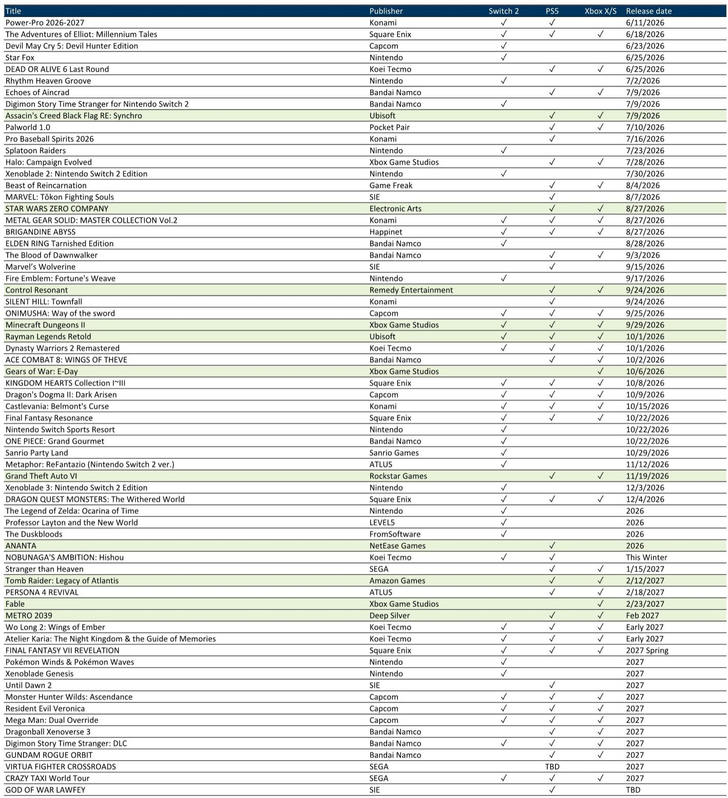
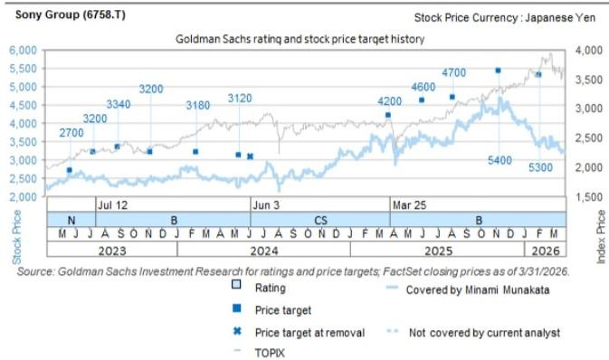

# The 2026 Console Game Pipeline Creates Clear Winners and Losers — But the Real Test Lies Beyond the Title Announcements

The annual cycle of summer game events has concluded, and the resulting pipeline for 2026 is now visible with unusual clarity. For investors, the pattern is not subtle: a concentrated cluster of major releases in late September through October, anchored by the arrival of Grand Theft Auto VI in November, creates a window of extraordinary revenue potential for platform holders and publishers alike. Yet the market's reaction to these announcements has been uneven, and the dispersion in valuations across the sector suggests that the current moment is less about celebrating the pipeline and more about identifying which companies are structurally positioned to convert pipeline strength into sustained profitability.

The core thesis emerging from the latest slate of announcements is straightforward but carries significant implications: Sony and Capcom are the clear beneficiaries of the 2026-2027 content cycle, while Nintendo faces a near-term perception gap that may take months of sell-through data to close. Square Enix and Bandai Namco, meanwhile, present a more complicated picture — one where medium-term strategic progress coexists with near-term valuation and execution risks that the market has not yet fully priced.

This is not a moment for passive sector exposure. The divergence in fundamentals, pipeline depth, and cost management capabilities across these five companies demands a selective approach. The question is not whether the gaming industry will grow in 2026 — it almost certainly will — but which companies will capture that growth in a way that translates into durable earnings power and, ultimately, share price appreciation.

## Sony's Pipeline Depth and Cost Discipline Create a Rare Combination of Growth and Margin Improvement

The PlayStation 5 is entering the latter half of its lifecycle, a phase that historically presents both opportunities and risks for platform holders. The opportunity lies in the installed base: a large, engaged user base that generates recurring revenue through software sales, subscriptions, and in-game transactions. The risk lies in hardware profitability, as component costs remain elevated and the pricing power for a mature console can be difficult to sustain.

Sony's position coming out of the summer events is unusually favorable on both fronts. The pipeline for fiscal year 2026 is robust across first-party and third-party software, with Grand Theft Auto VI serving as the most visible catalyst but by no means the only one. More importantly, Sony has articulated a clear policy of balancing growth with profitability improvement, even as memory costs and other input expenses remain high. This is not a trivial statement. In an industry where many companies have prioritized unit sales growth at the expense of margins, Sony's willingness to adjust hardware unit volumes and selling prices as needed suggests a disciplined approach to capital allocation that should support earnings quality.

The contrast with Nintendo is instructive. Both companies face the same underlying cost environment, but Sony's ability to manage hardware profitability through the latter part of the PS5 cycle — a period when component costs typically decline and manufacturing efficiencies improve — gives it a structural advantage. Nintendo, by contrast, is in the early stages of the Switch 2 lifecycle, a phase where hardware profitability is inherently more difficult to control. The recent price increase for the Switch 2 in Japan, with further increases planned in the US and Europe, reflects Nintendo's attempt to address this challenge. But the precedent of the PS5, which achieved penetration at a pace comparable to the PS4 despite multiple price increases, suggests that execution matters more than the pricing decision itself.

The implication for investors is clear: Sony's combination of pipeline strength, cost discipline, and lifecycle positioning creates a margin of safety that few other companies in the sector can match. The risk is not that the pipeline disappoints — it is that the market underestimates the durability of Sony's earnings improvement as the PS5 cycle matures.

## Capcom's Pipeline Through 2027 Is Deeper Than Any Peer, Yet the Stock Remains Undervalued Relative to Its Earnings Trajectory

Among pure-play publishers, Capcom stands apart. The announcement of major downloadable content for Monster Hunter Wilds was broadly expected, but the confirmation that Resident Evil Veronica will launch in 2027, alongside the already-released Pragmata and the September release of Onimusha: Way of the Sword, creates a pipeline that extends well beyond the current fiscal year. The Street Fighter movie release in October and a new Resident Evil film scheduled for sequential release from September onward add a visual content dimension that further monetizes Capcom's intellectual property.

The depth of this pipeline is not merely a matter of volume. It reflects a deliberate strategy of franchise management that few peers can replicate. Capcom has demonstrated an ability to maintain quality across multiple IPs simultaneously, releasing major titles without cannibalizing its own sales or diluting brand value. This is a rare capability in an industry where even the largest publishers often struggle to manage more than two or three major franchises at a time.

Yet the valuation tells a different story. Capcom's forward price-to-earnings ratio is now close to the sector median, despite profit growth that is robust by any measure. This disconnect suggests that the market is either discounting the sustainability of Capcom's earnings or failing to fully appreciate the revenue contribution from the 2027 pipeline. The risk is not that Capcom's pipeline disappoints — it is that the market continues to undervalue the company's earnings power until actual release dates and sell-through data force a revaluation.

The strategic question for investors is whether to wait for that revaluation or to act before the market consensus shifts. Given the visibility provided by the current pipeline, the argument for acting early is strong.

## Nintendo Faces a Perception Gap That Only Sell-Through Data Can Close

Nintendo's position is the most nuanced among the companies covered. The Switch 2 has a diverse lineup of first-party and third-party software, suggesting room to attract a broad user base. The Legend of Zelda: Ocarina of Time remake, while a significant title, is the only major first-party release scheduled for 2026, and that has created a perception of underwhelming near-term content relative to market expectations.

This perception may be unfair. Nintendo has historically managed its release schedule in a way that builds momentum gradually, with major titles often arriving in the second or third year of a console's lifecycle. The Switch 2 is still in its early stages, and the pipeline for 2027 — including Pokémon Winds and Pokémon Waves, Xenoblade Genesis, and other unannounced titles — is likely to be substantially stronger. But the market is not known for patience, and the current narrative around Nintendo is one of near-term disappointment.

The key variable to watch is sell-through data. The PS5 precedent demonstrates that price increases do not necessarily deter hardware adoption if the content pipeline is sufficiently compelling. Nintendo's challenge is to prove that the Switch 2 can achieve similar momentum despite a lighter 2026 lineup. This is not an impossible task, but it will take time. The share price, as the report suggests, is likely to begin recovering only once actual data confirms solid momentum.

For investors, this creates a timing dilemma. Nintendo's medium-term prospects remain attractive, but the near-term catalyst is absent. The decision to buy now requires a conviction that the perception gap will close within a reasonable timeframe, and that conviction can only be supported by patience and a willingness to look through the current cycle.

## The Structural Reform Story at Square Enix and the Guidance Risk at Bandai Namco Represent Two Different Kinds of Traps

Square Enix and Bandai Namco occupy opposite ends of the valuation spectrum, yet both present risks that the market may not be fully pricing.

Square Enix's medium-term trajectory is improving. The announcement of FINAL FANTASY VII REVELATION for spring 2027, along with updates on Dragon Quest XII, suggests that the company's "three-year reboot" strategy is bearing fruit. The initiatives under the current medium-term plan appear to be progressing, and the pipeline is steadily expanding. From a strategic perspective, this is positive.

But the near-term reality is different. Square Enix remains in a structural reform execution phase, and the benefits of those reforms will take time to materialize in the financial statements. The valuation, at 26 times forward earnings, is well above the global game sector median of 16 times. This premium implies that the market is already pricing in a successful turnaround, leaving little room for disappointment. The risk is not that Square Enix's strategy fails — it is that the strategy succeeds, but the timeline is longer than the market expects, and the stock de-rates as patience wears thin.

Bandai Namco presents a different kind of risk. The company has announced release dates for major titles, including Ace Combat 8 and ELDEN RING Tarnished Edition, along with a new Gundam action game for 2027. But the second-half fiscal year 2027 operating profit guidance for the digital business implies an 87% year-over-year increase — a level of growth that the current pipeline does not convincingly support. The report's view that this guidance is somewhat optimistic appears well-founded.

The trap here is not valuation — Bandai Namco's forward multiple is more reasonable — but rather the risk of a guidance downgrade. If the second-half profit target proves unattainable, the stock could face a sharp re-rating downward. The pipeline is solid, but it is not transformative, and the gap between guidance and reality may be wider than the market currently appreciates.

## What the Report Does Not Fully Answer: The Impact of GTA VI on the Broader Ecosystem and the Sustainability of Hardware Margins

The report provides a detailed assessment of individual company pipelines and valuations, but it leaves several important questions unresolved.

First, the impact of Grand Theft Auto VI on the broader ecosystem is treated as a positive catalyst for Sony, but the second-order effects are not fully explored. GTA VI is not just a title — it is a platform event that can drive hardware adoption, increase engagement across the PlayStation Network, and potentially lift software sales for other publishers through increased user activity. But it can also concentrate spending in a way that cannibalizes sales of other titles released in the same window. The net effect on the sector is unclear, and the report does not attempt to quantify the trade-off.

Second, the sustainability of hardware margins through the latter half of the PS5 cycle is assumed but not stress-tested. Component costs remain elevated, and the possibility of further price increases or aggressive promotional activity to maintain unit volumes could erode profitability. Sony's stated policy of balancing growth and profitability is reassuring, but the actual outcome will depend on factors — including macroeconomic conditions and competitive dynamics — that are difficult to predict.

Third, the report does not address the potential for consolidation or partnership activity in the sector. With valuations stretched for some companies and compressed for others, the possibility of M&A or strategic alliances could reshape the competitive landscape in ways that are not captured by a pipeline-driven analysis.

These open questions are not weaknesses in the report. They are the natural boundaries of any analytical framework that focuses on near-term catalysts. For investors seeking a more complete picture, the full report provides the data and context needed to form independent judgments.

## A Decision Framework for Investors: Three Questions to Determine Positioning

For investors trying to navigate the current environment, three questions can serve as a decision framework.

First, what is your time horizon? If you are investing with a 12-month view, the pipeline for 2026 is the dominant factor, and Sony and Capcom offer the clearest risk-reward profiles. If your horizon extends to 2027 or beyond, the calculus shifts: Nintendo's medium-term potential becomes more relevant, and Square Enix's turnaround story may begin to deliver.

Second, how do you weigh valuation versus pipeline depth? Capcom is the most compelling example of a company where pipeline depth is not reflected in the valuation. Square Enix is the opposite: the pipeline is improving, but the valuation already prices in success. Sony sits in the middle, with strong pipeline and reasonable valuation, but the margin of safety comes more from cost discipline than from valuation discount.

Third, what is your tolerance for guidance risk? Bandai Namco's guidance is the most aggressive in the sector, and the potential for a downgrade is real. If your portfolio can tolerate that risk in exchange for the upside if the guidance is met, Bandai Namco may be worth considering. If not, the safer path is to wait for actual results before committing.

These three questions will not produce a single answer that works for every investor. But they provide a structured way to think about the trade-offs inherent in the current environment.

## Join the Community to Read the Full Report and Review the Original Charts

The analysis above draws on the key insights from a detailed research report on the Japanese games and internet sector. The full report includes the complete title release schedule, detailed valuation methodologies, and risk assessments for each company. To access the original charts and data, and to join a community of investors who receive regular updates on the sector, we invite you to read the full report.

*This article is for learning and discussion only and does not constitute investment advice.*

Personal reading notes and learning share only. Not investment advice.

