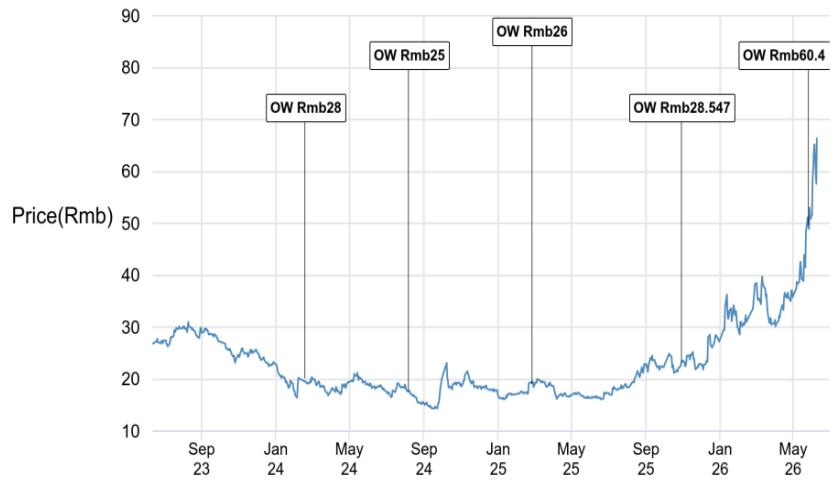
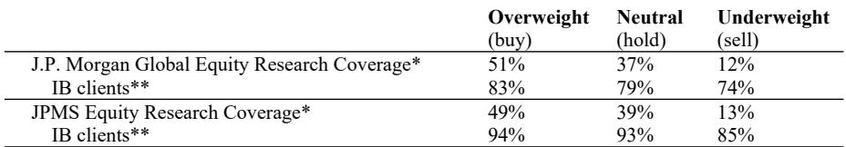
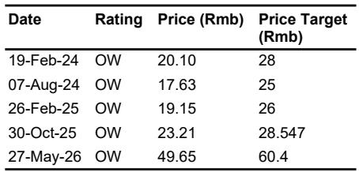

# The MLCC Powder Cycle Is Not Just Cyclical: Why Sinocera's Structural Ascent Demands a Rethink of the Specialty Materials Supply Chain

The first half of 2026 has delivered a surprise to the global multilayer ceramic capacitor (MLCC) powder market. Demand from AI servers and automotive electronics has surged far beyond expectations, pulling the entire upstream material ecosystem into a robust upward cycle. But the real story is not simply that the cycle has turned. It is that the cycle is being reshaped by structural forces—rare earth export controls, a multi-year capacity reallocation by global MLCC manufacturers, and a domestic Chinese supplier that has quietly built an 80% domestic market share while doubling down on high-end product lines that command gross margins north of 45%. The conventional narrative of a commodity materials supplier riding a wave of end-demand is insufficient. What is emerging is a case study in how a company can use a cyclical upswing to lock in structural advantages that persist even when the cycle turns down.

The momentum in 1H26 is not merely strong; it is, by the admission of the company's own management, stronger than either the market or the company itself had forecast. But the more important observation is that the company's full-year earnings growth target of over 20% is now described as "highly achievable." That is not the language of a company hoping for a tailwind. It is the language of a company that has already positioned capacity, pricing, and customer qualifications to convert cyclical demand into structural revenue. The question for investors is whether this performance is repeatable and, more critically, whether the structural drivers that underpin it are durable enough to withstand the inevitable normalization of demand.

This article is based on a recent fireside chat between Sinocera's senior management and a global investment bank. It distills the key strategic implications for anyone tracking the specialty chemicals, advanced materials, or electronic component supply chains.

## The High-End MLCC Powder Market Is Entering a Structural Expansion, Not Just a Cyclical Recovery

The distinction between cyclical and structural is not academic; it determines whether the current earnings trajectory should be valued at a premium or a discount. The evidence from Sinocera's operational data points strongly toward a structural shift. The company's capacity plan is unambiguous: a 2,000-ton high-end production line came online at the end of 2025, and a further 3,000-ton expansion will be completed by the end of 2026. That brings total capacity to 15,000 tons, with the company expecting to sell over 1,000 tons of high-end product in 2026 alone.

The pricing structure reveals why this matters. Conventional MLCC powder trades at RMB 60,000 to 70,000 per ton with gross margins above 33%. Automotive-grade product sells for RMB 80,000 to 90,000 per ton. AI server-grade powder exceeds RMB 100,000 per ton. And the high-end varieties deliver gross margins of 45% to 50%. The arithmetic is straightforward: as the product mix shifts toward high-end, each ton of capacity generates disproportionately more profit. The company's capacity plan is not a bet on volume; it is a bet on value per ton.

But the structural argument goes deeper. Global MLCC manufacturers are actively reallocating production capacity toward high-end products. This creates a capacity spillover effect: as overseas players focus on premium segments, the utilization rate of conventional MLCC powder lines at domestic suppliers like Sinocera rises. The company's consumer-grade line, which has a stable capacity of 10,000 tons, operated at over 70% utilization last year. That rate is now rising as overseas competitors vacate the lower end of the market.

The implication is that Sinocera benefits from both directions simultaneously: rising utilization in conventional lines provides cash flow and margin stability, while the high-end expansion drives incremental profitability. This is not a single-cycle trade. It is a multi-year repositioning of the global MLCC powder supply chain, and Sinocera is the primary domestic beneficiary.

## The Rare Earth Export Control Regime Creates a Structural Moat That Cannot Be Replicated Quickly

China controls between 80% and 95% of the global supply of rare earth resources essential for MLCC powder production. Japanese manufacturers, the primary competitors, currently hold strategic inventories covering one to two years of usage. That buffer provides near-term comfort, but it also creates a time bomb. Continuous strict export controls on rare earths, which have been tightening, will constrain overseas production capacity in the long term. The result is a sustained order transfer to domestic Chinese players.

This is not a hypothetical. Sinocera's premium products have already completed qualification at Samsung after a nearly one-year qualification process and will enter mass production in the third quarter of 2026. The qualification cycle for high-end MLCC powder is demanding: particle size requirements range from 100 to 150 nanometers for domestic AI clients and 200 nanometers for Samsung, with stringent demands on uniformity and dispersion. The yield rate for finished high-end powder may only reach 80%, compared to over 95% for conventional products. But once a supplier is qualified, the subsequent qualification cycles for additional products are greatly shortened.

The rare earth regime does two things. First, it raises the barrier to entry for any new overseas competitor, because the raw material supply is increasingly uncertain. Second, it accelerates the qualification timeline for domestic suppliers who already have access to rare earths. Sinocera's dominant domestic market share—over 80% in China and approximately 20% globally—is not just a reflection of past execution. It is a structural position that becomes more valuable as export controls tighten.

The question that remains unanswered is how quickly Japanese manufacturers can adapt. If they secure alternative rare earth sources or develop recycling technologies, the moat could narrow. But that process would take years, not quarters. In the meantime, the order flow is moving in one direction.

## The Company's Industrial Strategy Is a Deliberate Risk-Management Framework, Not an Opportunistic Expansion

One of the most frequently misunderstood aspects of Sinocera's business model is its approach to downstream integration. The company does not pursue vertical integration for its own sake. Instead, it follows a differentiated strategy that depends on the maturity of the downstream market.

For mature MLCC markets where global giants are already established, Sinocera focuses on upstream ceramic powder materials. This avoids direct competition with well-capitalized incumbents while capturing the value created by their growth. For high-end downstream sectors that are still in early stages domestically and are monopolized by overseas enterprises, the company may extend into finished products. This is a calculated approach: enter the downstream only where domestic substitution has room to run and where the risk of competing with entrenched players is manageable.

This strategy reduces operational risk and improves the probability of success. It also aligns with the company's development model, which combines in-house R&D with targeted M&A. Annual R&D investment accounts for roughly 7% of revenue, with no spending cap for key projects. Two-tier R&D teams handle long-term cutting-edge research and existing product upgrades separately. M&A is focused on medical and fine ceramic sectors that complement existing technological strengths.

The result is a portfolio of new material projects that are progressing on schedule. Spherical silicon will pass qualification at Taiwanese clients in the second half of 2026, generating tens of millions of RMB in revenue, with 2,000 tons of new capacity to be added by year-end. Low-orbit satellite ceramic casings are projected to achieve 30% to 40% annual growth. Ceramic substrates and thermoelectric cooler components are under client testing and will contribute revenue starting in 2027.

The critical insight here is that Sinocera is not placing a single bet. It is building a diversified portfolio of advanced material platforms, each with its own demand driver and qualification timeline. The MLCC powder business provides the cash flow and margin structure to fund these new initiatives. The new materials provide the growth optionality that extends the investment thesis beyond the MLCC cycle.

## What the Report Does Not Fully Answer: The Sustainability of the AI-Driven Demand Surge and the Margin Trajectory

No research report can answer every question, and this one leaves several important analytical gaps that readers should consider before making investment decisions.

The most significant open question is the durability of AI server demand for MLCCs. The current surge is driven by a specific phase of AI infrastructure buildout, where server manufacturers are stocking components aggressively. But MLCC consumption per server is not infinite. If AI server deployment stabilizes or if next-generation architectures reduce component counts, the demand growth rate could decelerate. The report does not model what happens to Sinocera's high-end capacity utilization if AI-related demand normalizes in 2027 or 2028.

A second question concerns the pricing trajectory for high-end MLCC powder. Current gross margins of 45% to 50% are attractive, but they are also likely to attract competition. Other domestic suppliers may attempt to replicate Sinocera's technical capabilities, and overseas players may invest in capacity outside China. The report acknowledges the technical threshold—particle size, uniformity, dispersion, yield rate—but does not quantify how long Sinocera's advantage will persist.

A third question involves the pace of new material revenue contribution. The spherical silicon, satellite ceramic casings, and ceramic substrate projects are promising, but they are still in validation or early production stages. The revenue contributions are measured in tens of millions of RMB initially, which is modest relative to the scale of the MLCC powder business. The timeline for these projects to become material profit contributors remains uncertain.

Finally, the report does not fully address the capital allocation trade-off. The company is investing heavily in capacity expansion, R&D, and M&A while also maintaining dividends and share repurchases. The proportion of overseas shareholders has fallen from a peak of 28% to 5% to 6%. This suggests a deliberate shift in the shareholder base, but the implications for the cost of capital and the company's ability to fund future growth are not explored.

## A Decision Framework for Evaluating Sinocera and Similar Specialty Materials Companies

For investors and analysts trying to assess whether Sinocera's current trajectory is sustainable, the following framework may be useful. It applies not only to this company but to any specialty materials supplier benefiting from a structural supply chain shift.

First, assess the durability of the demand driver. Is the current demand surge cyclical or structural? For Sinocera, the AI server and automotive demand has structural elements—electrification and compute density are long-term trends—but the rate of growth may moderate. The key is to distinguish between the level of demand and the growth rate of demand.

Second, evaluate the competitive moat. Sinocera's moat rests on three pillars: rare earth access, technical qualification at major customers like Samsung and Fenghua, and manufacturing scale. Each pillar has a different erosion timeline. Rare earth controls are policy-dependent. Technical qualifications are sticky but not permanent. Scale advantages can be matched if competitors invest. The investor must judge which pillar is most vulnerable.

Third, analyze the capital allocation discipline. Sinocera's dual model of R&D and M&A is sensible, but the execution risk lies in the M&A component. Acquisitions in medical and fine ceramics are outside the company's core competency in MLCC powders. The track record of integration and value creation in these adjacent sectors is not yet established.

Fourth, stress-test the margin structure. High-end gross margins of 45% to 50% are exceptional, but they are also a target for competition. The question is not whether margins will compress, but when and by how much. The company's ability to sustain margins will depend on its rate of innovation and its success in moving up the value chain faster than competitors.

Fifth, consider the shareholder base signal. The decline in overseas shareholder ownership from 28% to 5% to 6% could reflect a deliberate strategy to reduce exposure to foreign capital market volatility, or it could indicate that international investors have become less confident. The interpretation matters for the stock's valuation multiple and liquidity.

## Why This Moment Demands a Deeper Look

The MLCC powder cycle in 2026 is real. The revenue growth, margin expansion, and capacity additions are all confirmed by company guidance and customer qualification timelines. But the most interesting part of the story is not what has already happened. It is what has not yet been resolved: the sustainability of AI demand, the pace of new material commercialization, and the evolution of the competitive landscape in high-end powders.

These are not questions that can be answered by a single fireside chat or a quarterly earnings release. They require ongoing analysis of industry data, customer behavior, and policy developments. The full report from which this article is drawn contains the original charts, detailed capacity projections, and customer qualification timelines that are essential for making a informed judgment.

Join the community to read the full report and review the original charts.

*This article is for learning and discussion only and does not constitute investment advice.*

Personal reading notes and learning share only. Not investment advice.

