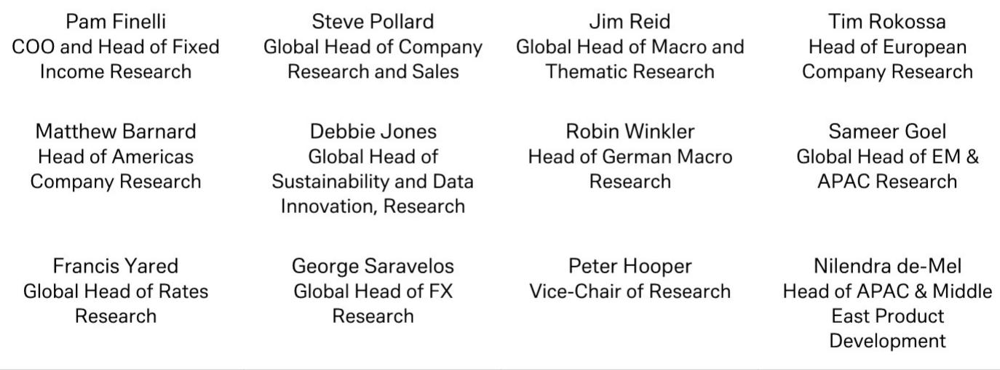
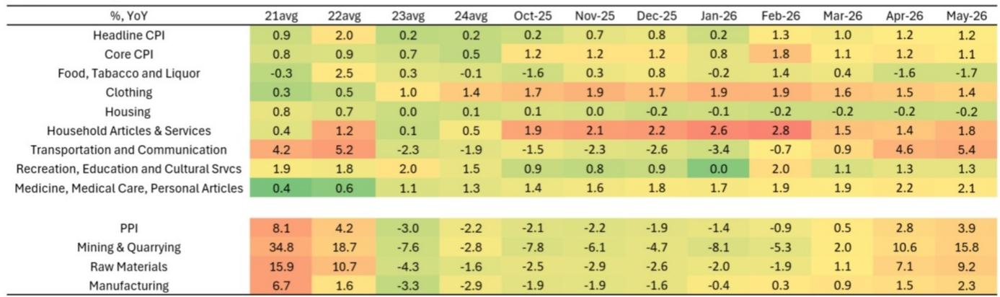

# China’s Inflation Divergence Is Not a Puzzle: It Is a Signal of Where Demand Is Real and Where It Is Not

The May 2026 inflation data from China tells a story that is far more revealing than the headline numbers suggest. Producer prices accelerated to 3.9 percent year-on-year, exceeding expectations and extending the reflation trend that began in the first quarter. Consumer prices, meanwhile, remained stuck at 1.2 percent year-on-year, with sequential inflation turning negative for the first time in months. This is not a contradiction. It is a structured divergence that maps directly onto the distinction between supply-driven cost pass-through and demand-driven consumption weakness. For investors and strategists, the key insight is not whether inflation is rising or falling, but where the pressure is accumulating and where it is absent. The PPI story is increasingly about the breadth of pass-through from energy into midstream and downstream sectors, alongside a distinct and growing AI-related demand pulse. The CPI story is about the limits of consumer resilience in an environment where trade-in subsidies are fading and household demand remains tepid. The two narratives coexist, and they point to very different implications for sector positioning, monetary policy, and the broader growth outlook.

The timing of this divergence matters. The global investment bank report that produced this analysis revised its full-year CPI forecast downward to 1.5 percent, while maintaining a PPI forecast of around 5 percent by year-end. That revision is not a minor adjustment. It signals that the bank sees the demand side of the economy softening more than previously expected, even as industrial pricing power continues to recover. The implication is that China is entering a phase where the inflation signal becomes less about aggregate demand and more about structural shifts in specific sectors. The energy pass-through is a lagged effect of earlier price shocks. The AI-driven demand is a genuine new force. But the consumer side is losing momentum. Understanding which of these forces will persist and which will fade is the central analytical challenge.

## The PPI Reflation Is Broadening, but Its Center of Gravity Is Shifting from Energy to Midstream and AI-Driven Demand

The headline PPI acceleration to 3.9 percent year-on-year in May is impressive, but the composition matters more than the aggregate. The sequential momentum moderated to 0.5 percent month-on-month, down from 1.7 percent in April, which suggests that the initial energy-driven spike is losing steam. International oil prices were broadly stable during the month, and oil-related sectors actually saw a small month-on-month decline. This is the first sign that the energy shock that dominated March and April is beginning to fade as a marginal driver.

What is replacing it is more interesting. The pass-through of earlier energy price increases to mid- and downstream sectors continued at a faster pace. Chemicals, ferrous metals, and textiles all registered accelerating sequential price gains. This is the classic pattern of cost-push inflation working its way through the industrial chain. But it is not uniform. The sectors that are showing the strongest price momentum are those that combine energy cost pass-through with other demand drivers. Ferrous metals, for example, benefit from both energy costs and infrastructure-related demand. Chemicals benefit from energy costs and from downstream demand in packaging, construction, and automotive.

More striking is the role of AI-related demand. The report explicitly identifies non-ferrous metals such as tin and copper, electrical machinery, optical fibers, wires and cables, and computers as sectors where AI demand is pushing up prices. This is not a marginal effect. These are sectors with significant weight in the industrial price index, and they are benefiting from a structural demand shift that is independent of the energy cycle. The AI-driven demand for copper and tin, in particular, is tied to data center construction, semiconductor fabrication, and advanced wiring infrastructure. This is a multi-year trend, not a cyclical blip. The fact that it is now showing up in PPI data suggests that the real economy is beginning to reflect the investment boom that has been visible in equity markets for some time.

The implication for the PPI outlook is that the forecast of 5 percent by year-end is achievable, but the composition of that inflation will look very different from what drove the first half of the year. Energy will be a smaller contributor. Midstream pass-through and AI-related demand will be larger. For investors, this means that the inflation signal is becoming more informative about structural trends and less informative about cyclical energy shocks. The sectors that show sustained pricing power from here are those that have genuine demand support, not just cost pass-through.

## Consumer Demand Is Softening Beneath a Stable Headline, and the Subsidy Boost Is Waning

The CPI data is where the concern lies. Headline inflation held steady at 1.2 percent year-on-year, but that stability is misleading. Sequential inflation turned negative at minus 0.1 percent month-on-month, compared with a 0.3 percent increase in April. Core CPI, which excludes food and energy, also slowed. The breakdown is instructive. Services prices declined month-on-month. Food prices declined. Household goods and autos all saw slower year-on-year inflation and month-on-month declines. Energy prices fell 0.1 percent month-on-month, a sharp reversal from the 5.7 percent rise in the previous month.

The pattern is clear: the consumer is not spending with conviction. The trade-in subsidy programs that boosted goods consumption in earlier months are losing their marginal impact. These programs, which encouraged consumers to trade in old appliances, vehicles, and electronics for new ones, provided a temporary lift to demand. But the effect is diminishing as the most motivated consumers have already participated and the remaining pool is less responsive to the incentive. The report explicitly acknowledges this dynamic and uses it to justify the downward revision to the full-year CPI forecast.

The one bright spot in the CPI data is the same as in the PPI data: AI-related demand. Mobile phone prices rose 1.6 percent month-on-month, and computer prices rose 1.1 percent. This is consistent with the AI-driven demand for computing hardware that is showing up in the industrial price data. But it is not enough to offset the broad-based weakness in services, food, and household goods. The arrival of summer supported clothing prices, but that is a seasonal effect, not a structural improvement.

The downward revision from 1.6 percent to 1.5 percent for the full year, and from 2.0 percent to 1.8 percent by year-end, is a meaningful signal. It implies that the bank expects the consumer softness to persist through the second half of the year. The implication for policymakers is that monetary and fiscal support may need to remain accommodative, but the nature of that support may need to shift from subsidy-driven consumption to income support or broader fiscal transfers. For investors, the message is that consumer-facing sectors are unlikely to see pricing power return quickly, and that the risk is tilted toward further downside in discretionary spending.

## The Report Does Not Fully Answer How Long the AI Demand Pulse Can Sustain Industrial Pricing Power

One of the most intriguing questions raised by the data is whether the AI-driven demand for industrial inputs is sustainable at current levels. The report identifies this as a key driver of non-ferrous metals prices and related sectors, but it does not provide a framework for assessing the durability of this demand. The reason is that the data is too new. The AI investment cycle in China is still in its early stages. Data center construction, semiconductor capacity expansion, and advanced manufacturing investment are all accelerating, but the lead times for these projects mean that the demand for copper, tin, and electrical machinery could persist for several years.

However, there are risks. The first is that the AI investment boom could be concentrated in a narrow set of sectors and geographies, meaning that the pricing power it generates may not spread broadly enough to offset weakness elsewhere. The second risk is that the demand is driven by policy incentives and government-directed investment, which could be subject to shifts in political priorities or budget constraints. The third risk is that the global demand for AI-related hardware could slow if the technology adoption cycle hits a plateau or if trade tensions disrupt supply chains.

The report does not resolve these questions, and it is not meant to. The data is too recent, and the trends are still emerging. But the questions are central to any investment thesis that relies on the AI-driven industrial demand story. Investors should watch for follow-up data on capital expenditure in the technology and manufacturing sectors, as well as any policy signals that indicate whether the government intends to sustain or moderate the pace of AI-related investment.

## A Decision Framework for Investors: Map the Inflation Signal to Sector Exposure and Policy Sensitivity

The divergence between PPI and CPI creates a clear framework for investment decisions. The first step is to identify which sectors are benefiting from the PPI pass-through and which are not. Sectors that combine energy cost pass-through with structural demand—such as chemicals, ferrous metals, and non-ferrous metals—are likely to maintain pricing power. Sectors that are purely cost-push, without demand support, may see margins squeezed as input costs rise but output prices cannot keep up.

The second step is to assess exposure to AI-related demand. The sectors that are directly benefiting—computers, electrical machinery, optical fibers, and non-ferrous metals—are likely to see sustained demand regardless of the broader consumer environment. The question is whether the valuation of these sectors already reflects this demand or whether there is still room for upward revision.

The third step is to evaluate consumer-facing sectors. The CPI data suggests that discretionary spending is weakening, and the subsidy boost is fading. Companies that rely on consumer demand for durable goods, services, and household items are likely to face headwinds. The exception may be in areas where AI-related demand intersects with consumer products, such as smartphones and computers, but even there, the pricing power is coming from the industrial side, not from consumer willingness to pay more.

The fourth step is to consider the policy response. The downward revision to CPI forecasts increases the likelihood that the government will maintain or expand accommodative monetary and fiscal policy. This could provide a floor for asset prices and support for certain sectors, particularly those tied to infrastructure and manufacturing investment. But it also means that the inflation signal alone is not enough to justify a bullish or bearish stance. The policy context matters, and the data suggests that policymakers will remain cautious about tightening.

## Join the Community to Read the Full Report and Review the Original Charts

The analysis presented here is based on the May 2026 inflation data and the accompanying research report. The original report contains detailed charts on PPI and CPI components, sector-level inflation momentum, and the historical context for the current divergence. These charts provide the granularity that is essential for making informed investment decisions. They show, for example, the exact trajectory of pass-through from upstream to midstream and downstream sectors, the month-by-month evolution of core CPI, and the breakdown of inflation contributions by category. For investors who want to see the data for themselves and draw their own conclusions, the full report and its charts are available. Join the community to read the full report and review the original charts.

*This article is for learning and discussion only and does not constitute investment advice.*

Personal reading notes and learning share only. Not investment advice.

