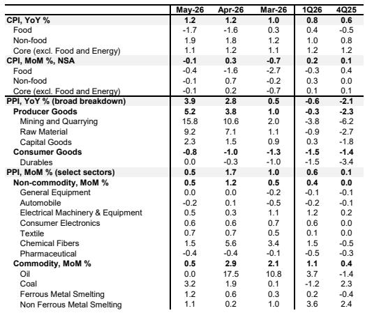
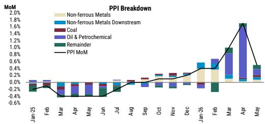

# 摩根斯坦利：市场低估了“再通胀退潮”的结构性含义

5月的通胀数据刚刚发布，PPI同比冲至3.9%，创下近四年新高。如果只看这个数字，很容易得出“通胀压力正在积聚”的判断。但摩根斯坦利这份最新报告揭示了一个完全不同的图景：通胀的驱动力正在快速切换，而真正重要的不是PPI同比有多高，而是环比动能在哪里减速。

报告的核心主张可以概括为一句话：**5月数据确认了中国正处于“再通胀退潮”的早期阶段，油价脉冲消退后，下游缺乏接力，核心CPI将进入温和下行通道。** 这不是一个短期波动，而是一个结构性信号——意味着企业定价权的分布正在发生根本性变化。

为什么现在需要认真对待这份报告？因为市场对通胀的讨论仍然停留在“油价涨了多少”“PPI同比会不会破4%”这些表层问题上。而摩根斯坦利把焦点拉到了更关键的层面：在油价推动消退之后，还有哪些力量能支撑价格？答案是，几乎没有。这种“单一引擎熄火”的格局，对资产定价、行业配置和宏观判断都有深远含义。

## 1. 5月PPI环比动能的骤降，暴露了“低基数幻觉”背后的真实疲弱

5月PPI同比从2.8%跳升至3.9%，表面上看非常强劲。但摩根斯坦利报告明确拆解了背后的结构：环比从4月的1.7%骤降至0.5%，降幅高达1.2个百分点。而环比才是衡量当前价格动能的真实指标。

这个环比减速几乎完全由油价驱动。4月油价对PPI环比的贡献高达1.7个百分点中的绝大部分，而5月全球油价趋于稳定后，石油相关的价格推升效应归零。换言之，4月的“通胀脉冲”本质上是油价的一次性冲击，而不是需求驱动的持续性上涨。

对于投资者来说，这意味着什么？如果你在4月PPI数据公布后认为“通胀上行趋势已经确立”，那么5月的数据就是一个重要的修正信号。PPI同比在未来两个月可能因为低基数继续走高至4%以上，但环比动能才是判断趋势的关键——而环比已经开始走弱。

## 2. 排除油价后，再通胀的“接力棒”只有零星选手

摩根斯坦利报告做了一个非常有价值的拆解：剔除石油和石化行业后，5月PPI环比仅微升至0.3%，相比4月的0.2%几乎没有加速。这意味着，油价熄火之后，其他行业没能形成有效的接力。

报告指出，少数几个行业确实有涨价迹象。煤炭价格环比上涨3.2%，主要受夏季用电高峰预期的季节性拉动。有色金属冶炼环比上涨1.1%，与铝相关的资本开支需求有关。但这些驱动因素要么是季节性的，要么是局部的，无法替代油价对整个工业品价格体系的广泛拉动。

更深层的问题是下游。尽管出口表现强劲，下游工厂出厂价格环比仅持平于0.2%，没有出现任何加速迹象。摩根斯坦利将原因归结为“普遍的产能过剩”——这是报告中最值得关注的判断之一。出口的扩张没有转化为定价权，因为供给端的竞争仍然激烈，企业缺乏提价的能力。

这意味着，即使宏观需求有所改善，利润向中下游传导的路径仍然受阻。对于制造业投资者而言，这是一个需要持续跟踪的信号：产能出清的速度决定了下一轮定价权回归的时间窗口。

## 3. 核心CPI的“AI需求脉冲”正在消退，消费疲弱才是底色

如果说PPI反映的是工业端的价格压力，那么CPI则更直接地反映了终端消费的冷暖。5月CPI同比持平于1.2%，看似稳定，但结构变化值得警惕。

报告特别指出，核心CPI剔除黄金后，经季节性调整的环比从4月的0.2%降至0%。这个“归零”背后有两个原因。第一，AI驱动的个人电子产品换机需求正在减弱——此前这一需求曾对核心CPI形成小幅提振，但脉冲正在消退。第二，也是更根本的，消费疲弱仍然在压制价格。就业市场疲软和房地产市场的持续调整，使得居民消费意愿和能力都受到抑制。

值得注意的是，报告提到“资本密集型出口的支撑有限”。这是一个容易被忽视的判断。出口强劲通常被认为会通过就业和收入渠道提振消费，但摩根斯坦利认为，资本密集型出口对普通劳动者收入的传导效应较弱，因此对消费的拉动作用有限。

对于宏观投资者而言，核心CPI的走势比PPI更具政策含义。如果核心CPI进入温和下行通道，意味着货币政策面临的“通胀约束”实际上在减弱，而非增强。这与市场对“通胀压力下政策难以宽松”的主流叙事形成了有趣的张力。

## 4. 报告没有完全回答的关键问题：油价尾部风险到底有多大？

摩根斯坦利报告在展望部分明确指出，未来最大的风险是“非线性的油价飙升”——如果地缘政治动荡导致更严重的供给短缺，油价可能再次冲击通胀。报告提到，该机构的石油策略师已经将2026年四季度和2027年上半年的油价预测上调了每桶5美元，理由是霍尔木兹海峡的通行恢复速度慢于预期。

但这个风险到底有多大？报告没有给出具体的概率评估，也没有讨论不同油价情景下对通胀的量化影响。这是一个关键的未解问题。如果油价再次大幅上涨，那么“再通胀退潮”的判断就需要修正。但如果油价维持在当前区间，那么核心CPI的温和下行将成为主导趋势。

对于读者来说，这意味着需要建立自己的情景分析框架：跟踪油价走势、地缘政治动态以及霍尔木兹海峡的通行数据，才能判断摩根斯坦利这份报告的核心判断是否仍然成立。

## 5. 对读者的观察框架：如何用这套逻辑判断后续趋势

基于摩根斯坦利报告的分析框架，我们可以提炼出三个核心观察维度，用于跟踪后续数据的含义。

第一，关注PPI环比而非同比。同比数据受基数效应干扰太大，未来两个月PPI同比可能继续走高，但这不意味着通胀压力在上升。环比是否能够企稳甚至回升，才是判断工业价格动能的真实指标。

第二，关注“排除油价后的PPI环比”。这是报告最值得借鉴的分析方法。只有剔除油价的一次性冲击，才能看清工业价格的底层趋势。如果排除油价后的环比持续低于0.3%，说明产能过剩的压力仍然主导市场。

第三，关注核心CPI环比而非同比。核心CPI同比目前仍在1.1%-1.2%之间，看似稳定，但环比已经归零。如果未来几个月环比持续为负，将确认消费疲弱正在加深，这可能对政策预期形成新的影响。

这三个维度合在一起，构成了一个比市场主流叙事更精细的判断框架。它们指向的结论是：当前中国的通胀格局不是一个“温和再通胀”的故事，而是一个“单一引擎熄火、缺乏接力”的结构性疲弱格局。

---

上述分析只是对摩根斯坦利这份报告的导读。报告原文还有更多细节，包括各细分行业的PPI环比拆解、不同油价情景下的通胀路径推演，以及摩根斯坦利对中国经济整体增长前景的判断。这些内容在本篇导读中无法一一展开。

如果你希望获取完整的报告解读和原始数据图表，欢迎加入我们的知识星球和微信群。我们会在社群中分享完整的研报PDF、更详细的行业拆解，以及与其他机构观点的交叉验证。社群讨论中，我们也会继续探讨“油价尾部风险”“产能出清节奏”“政策应对空间”等本篇导读未能完全回答的问题。

Personal reading notes and learning share only. Not investment advice.

