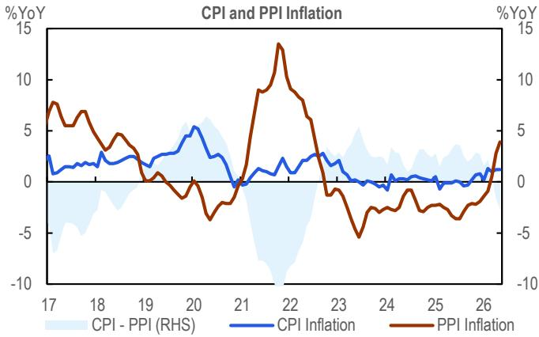
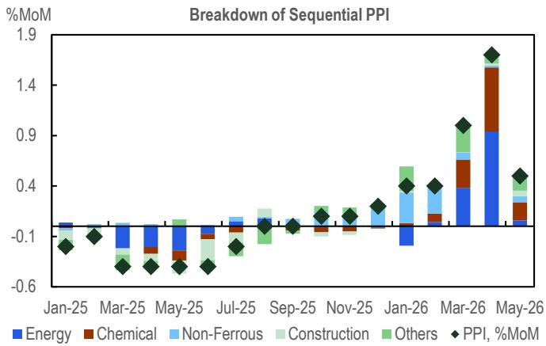

10 Jun 2026 01:52:47 ET | 10 pages

# China Economics

PPI Reflation Is More Than Just an Energy Shock

## CITI'S TAKE

Inflation readings came in mixed for May with a small miss in CPI and continued reflation of PPI. The energy impulse from the Mideast conflict retreated as expected. However, PPI shows tentative signs of investment stabilization. The AI supercycle is also emerging as an inflationary force, not only for tech PPI but also for telecom CPI. Consistent with the economy's K-shaped divergence, it's no surprise that downstream sectors remained mostly in deflation. Core CPI dipped as the holiday boost unwound, pointing to still-sluggish consumer demand that continues to cap upstream prices passthrough. We maintain our forecast for CPI and PPI at 1.0% YoY and 2.8% YoY, respectively, and see labor market conditions as a trigger for more policy adjustments.

Xinyu Ji AC

+852-2501-2792

xinyu.ji@citi.com

Xiangrong Yu AC

+852-2501-2754

xiangrong.yu@citi.com

Inflation came in mixed in May, with the peak impact from the Middle East conflict likely behind us. CPI posed a small miss at 1.2% YoY (Citi/Mkt: 1.5/1.3%, Prior: 1.2%), with a sequential change of -0.1% MoM, broadly in line with the three-year average for May. The energy price surge subsided alongside the seasonal travel boost, leaving underlying softness in core goods inflation more exposed.

- Food prices remained in a downcycle at -1.7%YoY (vs. -1.6%YoY in April), still a drag of \~0.3ppts to headline CPI (NBS, Jun 10 $^{th}$ ). The pork downcycle persisted at -16.1% YoY, though sequential contraction eased to -1.6%MoM (vs. -5.7%MoM). Other prices mostly tracked seasonality, with vegetable at -3.6%MoM, fruit at 0.6%MoM, while egg prices rising on tighter supply at 5.0%MoM.  
■ Energy price inflation retreated. Transportation fuel prices dropped -0.3%MoM (vs. +11.5%MoM), with its year-on-year change expanding to 21.1%YoY (vs. 17.4%YoY). The NBS estimated a 0.66ppts contribution from the 23.5%YoY increase of gasoline prices to headline CPI in May.  
■ Core inflation changed little at 1.1% YoY excluding food and energy. Its sequential change dipped to -0.1% MoM, with softness in both services and core goods.

- Services CPI dropped -0.1%MoM (vs. +0.5%MoM) amid lackluster Golden Week travel activities. The year-on-year change eased to 0.8%YoY from 0.9%YoY. Tourism prices moderated to 1.0%MoM (vs. 4.1%MoM), and the NBS noted contractions of -6.8%MoM and -6.3%MoM for vehicle rental and airfare in May, respectively (NBS, Jun 10 $^{th}$ ).  
- Core goods inflation eased to 1.5%YoY per our estimate, the lowest reading since last September. Jewelry prices could be partially responsible: gold jewelry prices pulled back to 39.0%YoY this May from the peak of 77.4%YoY in January. Momentum of durable goods diverged as the AI Supercycle unfolded: CPI for auto dropped -0.4%MoM, the third consecutive month of decline with sluggish domestic demand, while prices for telecom equipment rose 1.5%MoM, with its year-on-year change at 6.6%YoY, the second all-time high.

PPI continued to inch up, reaching 3.9%YoY (Citi/Mkt: 3.8/3.9%YoY). Its sequential change eased to 0.5%MoM from the high reading of 1.7%MoM driven by energy prices, while the improvement broadened.

■ Energy/Chemical: Middle East conflict spillovers faded. We estimated a combined contribution of 0.2ppts from energy/chemical prices to 0.5%MoM PPI, down from 1.6ppts in April. PPI for oil and gas extraction eased to -0.1%MoM from 18.5%MoM and turned muted at 0 for fuel processing. In contrast, PPI for coal extraction rose to 3.2%MoM, the fifth consecutive month of acceleration with its year-on-year change now at 10.0%YoY, the highest reading since energy crunch at end-2022. However, the level of coal prices hasn't recovered to the early-2025 level.  
■ Construction: A modest rebound emerged, with PPI at 3.3%YoY and 0.9%MoM for ferrous metal mining, and -3.4%YoY and 0.4%MoM for non-metallic mining. The combined contribution from construction-related items to PPI rose to 0.1ppts per our estimate, still small but the second-highest reading in a year. It was aligned with improving construction PMI, likely a tentative sign of investment stabilization.  
■ Downstream: Deflation persisted across most downstream sectors. AI-linked inflation was less prominent in sector breakdowns, with PPI for computer and

other electronics up 2.1% YoY and 0.6% MoM. The NBS also noted stronger price momentum of optical fiber manufacturing and cable manufacturing.

PPI reflation is more than just an energy shock. In fact, May saw a fading inflationary impulse from the Middle East conflict, but industrial reflation broadened. Tentative signs of investment stabilization are a bright spot. The AI supercycle is also emerging as an inflationary force, not only for tech PPI but also for telecom CPI. Consistent with the economy's K-shaped divergence, downstream sectors remained mostly in deflation. Core CPI dipped as the holiday boost unwound, pointing to still-sluggish consumer demand that continues to cap upstream prices passthrough. We maintain our forecasts at 1.0% YoY and 2.8% YoY for CPI and PPI, respectively. Policy actions could have started if construction stabilization follows through, and we continue to see labor market conditions as a trigger for more targeted easing.

Figure 1. CPI posed a small miss in May while PPI showed continued and broadening reflation  

line chart

| Year | CPI - PPI (RHS) | CPI Inflation | PPI Inflation |
|------|-----------------|---------------|---------------|
| 17   | ~0              | ~2            | ~8            |
| 18   | ~0              | ~3            | ~6            |
| 19   | ~0              | ~4            | ~4            |
| 20   | ~0              | ~5            | ~2            |
| 21   | ~0              | ~0            | ~-3           |
| 22   | ~-10            | ~3            | ~14           |
| 23   | ~0              | ~2            | ~-5           |
| 24   | ~0              | ~1            | ~-3           |
| 25   | ~0              | ~0            | ~-2           |
| 26   | ~0              | ~1            | ~4            |

© 2026 Citi Inc. No redistribution without Citi's written permission.  
Source: NBS, Wind, Citi

Figure 3. The AI supercycle is an inflation driving force now with telecom CPI at second all-time high  

line chart

| Year | Telecom Equipment | Auto |
|------|-------------------|------|
| 11   | -13.0             | -1.0 |
| 12   | -14.0             | -1.5 |
| 13   | -10.0             | -1.8 |
| 14   | -7.0              | -2.0 |
| 15   | -5.0              | -2.5 |
| 16   | -4.0              | -3.0 |
| 17   | -3.5              | -3.5 |
| 18   | -3.0              | -4.0 |
| 19   | -2.5              | -4.5 |
| 20   | -1.0              | -5.0 |
| 21   | 7.0               | -4.0 |
| 22   | 6.0               | 1.0  |
| 23   | -3.0              | -2.0 |
| 24   | -5.0              | -4.0 |
| 25   | 0.0               | -3.0 |
| 26   | 7.0               | -1.0 |

© 2026 Citi Inc. No redistribution without Citi's written permission.  
Source: NBS, Wind, Citi

Figure 2. Core CPI dipped on both services and core goods, another reminder of weak consumer demand  

line chart

| Year | Core | Estimated Core Goods | Services |
|------|------|----------------------|----------|
| 16   | 1.5  | 1.0                  | 2.0      |
| 17   | 2.0  | 1.5                  | 3.0      |
| 18   | 2.5  | 1.0                  | 3.5      |
| 19   | 2.0  | 1.5                  | 2.5      |
| 20   | 1.5  | 2.0                  | 1.5      |
| 21   | 0.5  | 0.5                  | -0.5     |
| 22   | 1.0  | 0.5                  | 1.5      |
| 23   | 0.5  | 0.0                  | 1.0      |
| 24   | 0.5  | -0.5                 | 2.0      |
| 25   | 0.5  | -0.5                 | 1.0      |
| 26   | 1.0  | 2.5                  | 1.5      |

© 2026 Citi Inc. No redistribution without Citi's written permission.  
Source: NBS, Wind, Citi Estimates

Figure 4. The small rebound in construction prices in May offers a bright spot  

bar chart

| Month   | Energy | Chemical | Non-Ferrous | Construction | Others | PPI, %MoM |
|---------|--------|----------|-------------|--------------|--------|-----------|
| Jan-25  | -0.05  | -0.05    | -0.05       | -0.05        | -0.05  | -0.1      |
| Mar-25  | -0.05  | -0.05    | -0.05       | -0.05        | -0.05  | -0.1      |
| May-25  | -0.05  | -0.05    | -0.05       | -0.05        | -0.05  | -0.1      |
| Jul-25  | -0.05  | -0.05    | -0.05       | -0.05        | -0.05  | -0.1      |
| Sep-25  | -0.05  | -0.05    | -0.05       | -0.05        | -0.05  | -0.1      |
| Nov-25  | -0.05  | -0.05    | -0.05       | -0.05        | -0.05  | -0.1      |
| Jan-26  | -0.1   | -0.1     | -0.1        | -0.1         | -0.1   | 0.4       |
| Mar-26  | 0.4    | 0.3      | 0.2         | 0.2          | 0.2    | 0.9       |
| May-26  | 1.4    | 1.3      | 1.2         | 1.2          | 1.2    | 1.4       |

© 2026 Citi Inc. No redistribution without Citi's written permission.  
Source: NBS, Wind, Citi Estimates

Figure 5. Downstream PPI sectors stayed mostly in deflation

<table><tr><td rowspan="2" colspan="3">Sector</td><td rowspan="2">Deflation easing sequentially?</td><td rowspan="2">Consecutive months of PPI deflation</td><td colspan="3">%YoY</td><td colspan="3">3M/3M Annualized</td></tr><tr><td>Mar</td><td>Apr</td><td>May</td><td>Feb</td><td>Mar</td><td>Apr</td></tr><tr><td>Up</td><td>煤炭开采和洗选业</td><td>Coal mining and washing</td><td></td><td>0</td><td>-2.2</td><td>3.1</td><td>10.0</td><td>-13.6</td><td>6.1</td><td>22.8</td></tr><tr><td>Up</td><td>石油和天然气开采业</td><td>Petroleum and natural gas extraction</td><td></td><td>0</td><td>5.2</td><td>28.6</td><td>35.7</td><td>100.7</td><td>332.6</td><td>253.2</td></tr><tr><td>Up</td><td>石油、煤炭及其他燃料加工业</td><td>Petroleum, coal and other fuel processing</td><td></td><td>0</td><td>-4.5</td><td>14.2</td><td>18.4</td><td>15.1</td><td>133.7</td><td>130.0</td></tr><tr><td>Up</td><td>黑色金属矿采选业</td><td>Ferrous metal mining</td><td></td><td>0</td><td>0.1</td><td>1.3</td><td>3.3</td><td>-5.1</td><td>-5.1</td><td>1.6</td></tr><tr><td>Up</td><td>有色金属矿采选业</td><td>Non-ferrous metal mining</td><td></td><td>0</td><td>36.4</td><td>38.9</td><td>36.5</td><td>102.7</td><td>82.8</td><td>31.3</td></tr><tr><td>Up</td><td>非金属矿采选业</td><td>Non-metallic mineral mining</td><td>Yes</td><td>18</td><td>-4.2</td><td>-4.1</td><td>-3.4</td><td>-1.2</td><td>-0.4</td><td>3.7</td></tr><tr><td>Middle</td><td>电力、热力的生产和供应业</td><td>Electricity and heat production/supply</td><td></td><td>30</td><td>-3.8</td><td>-4.2</td><td>-4.4</td><td>-9.5</td><td>-12.3</td><td>4.0</td></tr><tr><td>Middle</td><td>燃气生产和供应业</td><td>Gas production/supply</td><td>Yes</td><td>10</td><td>-2.4</td><td>-0.6</td><td>2.5</td><td>0.0</td><td>3.2</td><td>12.6</td></tr><tr><td>Middle</td><td>水的生产和供应业</td><td>Water production/supply</td><td></td><td>0</td><td>1.6</td><td>1.6</td><td>1.7</td><td>0.8</td><td>0.4</td><td>1.6</td></tr><tr><td>Middle</td><td>黑色金属冶炼及压延加工业</td><td>Ferrous metal smelting</td><td>Yes</td><td>48</td><td>-2.5</td><td>-1.1</td><td>1.0</td><td>2.4</td><td>4.1</td><td>8.7</td></tr><tr><td>Middle</td><td>有色金属冶炼及压延加工业</td><td>Non-ferrous metal smelting</td><td></td><td>0</td><td>22.4</td><td>22.5</td><td>24.0</td><td>52.6</td><td>25.6</td><td>9.6</td></tr><tr><td>Middle</td><td>金属制品业</td><td>Metal products</td><td></td><td>0</td><td>0.2</td><td>0.5</td><td>0.8</td><td>3.7</td><td>2.4</td><td>1.6</td></tr><tr><td>Middle</td><td>非金属矿物制品业</td><td>Non-metallic mineral products mfg</td><td>Yes</td><td>44</td><td>-4.9</td><td>-5.5</td><td>-5.1</td><td>-2.0</td><td>-3.5</td><td>-5.1</td></tr><tr><td>Middle</td><td>化学原料及化学制品制造业</td><td>Chemical</td><td></td><td>0</td><td>-0.3</td><td>8.9</td><td>12.7</td><td>24.2</td><td>66.9</td><td>71.5</td></tr><tr><td>Middle</td><td>纺织业</td><td>Textile</td><td></td><td>0</td><td>-0.8</td><td>0.2</td><td>1.1</td><td>1.2</td><td>4.9</td><td>7.9</td></tr><tr><td>Down</td><td>农副食品加工业</td><td>Agricultural products</td><td></td><td>36</td><td>-1.5</td><td>-1.3</td><td>-1.4</td><td>1.6</td><td>-1.2</td><td>-3.5</td></tr><tr><td>Down</td><td>食品制造业</td><td>Food mfg</td><td>Yes</td><td>37</td><td>-2.0</td><td>-1.6</td><td>-1.0</td><td>-1.6</td><td>0.4</td><td>3.2</td></tr><tr><td>Down</td><td>酒、饮料和精制茶制造业</td><td>Wine and beverage mfg</td><td>Yes</td><td>24</td><td>-2.1</td><td>-2.9</td><td>-1.9</td><td>-5.5</td><td>-2.8</td><td>1.2</td></tr><tr><td>Down</td><td>烟草制品业</td><td>Tobacco products</td><td></td><td>0</td><td>0.3</td><td>0.1</td><td>0.1</td><td>0.4</td><td>0.0</td><td>0.0</td></tr><tr><td>Down</td><td>纺织服装、服饰业</td><td>Textile and apparel mfg</td><td>Yes</td><td>15</td><td>-1.5</td><td>-1.5</td><td>-1.4</td><td>-5.1</td><td>-3.5</td><td>-0.4</td></tr><tr><td>Down</td><td>木材加工及木、竹、藤、棕、草制品业</td><td>Wood and wood products</td><td>Yes</td><td>42</td><td>-2.6</td><td>-2.3</td><td>-1.9</td><td>-0.8</td><td>-0.4</td><td>-0.8</td></tr><tr><td>Down</td><td>造纸及纸制品业</td><td>Paper and paper products</td><td>Yes</td><td>5</td><td>-2.2</td><td>-1.2</td><td>-0.7</td><td>-9.9</td><td>-3.9</td><td>-0.8</td></tr><tr><td>Down</td><td>印刷业和记录媒介的复制</td><td>Printing</td><td></td><td>40</td><td>-3.5</td><td>-2.7</td><td>-2.7</td><td>-2.4</td><td>-2.0</td><td>-1.2</td></tr><tr><td>Down</td><td>医药制造业</td><td>Pharmaceutical mfg</td><td>Yes</td><td>28</td><td>-4.6</td><td>-4.7</td><td>-4.5</td><td>-6.2</td><td>-4.3</td><td>-3.5</td></tr><tr><td>Down</td><td>化学纤维制造业</td><td>Chemical fiber mfg</td><td></td><td>0</td><td>-2.3</td><td>5.4</td><td>8.5</td><td>19.0</td><td>45.6</td><td>50.9</td></tr><tr><td>Down</td><td>橡胶和塑料制品业</td><td>Rubber and plastic products mfg</td><td>Yes</td><td>43</td><td>-3.4</td><td>-1.3</td><td>0.5</td><td>-0.8</td><td>8.3</td><td>16.3</td></tr><tr><td>Down</td><td>通用设备制造业</td><td>General machinery</td><td>Yes</td><td>40</td><td>-1.2</td><td>-1.0</td><td>-0.9</td><td>-1.2</td><td>-1.2</td><td>-0.8</td></tr><tr><td>Down</td><td>汽车制造业</td><td>Auto</td><td></td><td>44</td><td>-2.5</td><td>-2.0</td><td>-2.0</td><td>-2.8</td><td>-2.4</td><td>-2.4</td></tr><tr><td>Down</td><td>铁路、船舶、航空航天和其他运输设备制造</td><td>Railway and other transportation</td><td></td><td>11</td><td>-0.1</td><td>-0.3</td><td>-0.3</td><td>0.4</td><td>0.0</td><td>0.0</td></tr><tr><td>Down</td><td>计算机、通信和其他电子设备制造业</td><td>Computer and other electronics</td><td></td><td>0</td><td>0.4</td><td>1.5</td><td>2.1</td><td>7.4</td><td>7.9</td><td>7.9</td></tr></table>

© 2026 Citi Inc. No redistribution without Citi's written permission.  
Source: NBS, Wind, Citi

If you are visually impaired and would like to speak to a Citi representative regarding the details of the graphics in this document, please call USA 1-888-500-5008 (TTY: 711), from outside the US +1-210-677-3788

## Appendix A-1

## ANALYST CERTIFICATION

The research analysts primarily responsible for the preparation and content of this research report are either (i) designated by “AC” in the author block or (ii) listed in bold alongside content which is attributable to that analyst. If multiple AC analysts are designated in the author block, each analyst is certifying with respect to the entire research report other than (a) content attributable to another AC certifying analyst listed in bold alongside the content and (b) views expressed solely with respect to a specific issuer which are attributable to another AC certifying analyst identified in the price charts or rating history tables for that issuer shown below. Each of these analysts certify, with respect to the sections of the report for which they are responsible: (1) that the views expressed therein accurately reflect their personal views about each issuer and security referenced and were prepared in an independent manner, including with respect to Citi Global Markets Inc. and its affiliates; and (2) no part of the research analyst's compensation was, is, or will be, directly or indirectly, related to the specific recommendations or views expressed by that research analyst in this report.

## IMPORTANT DISCLOSURES

Analysts' compensation is determined by Citi management and Citi's senior management and is based upon activities and services intended to benefit the investor clients of Citi Global Markets Inc. and its affiliates (the “Firm”). Compensation is not linked to specific transactions or recommendations. Like all Firm employees, analysts receive compensation that is impacted by overall Firm profitability which includes investment banking, sales and trading, and principal trading revenues. One factor in equity research analyst compensation is arranging corporate access events between institutional clients and the management teams of covered companies. Typically, company management is more likely to participate when the analyst has a positive view of the company.

For financial instruments recommended in the Product in which the Firm is not a market maker, the Firm is a liquidity provider in such financial instruments (and any underlying instruments) and may act as principal in connection with transactions in such instruments. The Firm is a regular issuer of traded financial instruments linked to securities that may have been recommended in the Product. The Firm regularly trades in the securities of the issuer(s) discussed in the Product. The Firm may engage in securities transactions in a manner inconsistent with the Product and, with respect to securities covered by the Product, will buy or sell from customers on a principal basis.

Unless stated otherwise neither the Research Analyst nor any member of their team has viewed the material operations of the Companies for which an investment view has been provided within the past 12 months.

For important disclosures (including copies of historical disclosures) regarding the companies that are the subject of this Citi product ("the Product"), please contact Citi, 388 Greenwich Street, 6th Floor, New York, NY, 10013, Attention: Legal/Compliance [E6WYB6412478]. In addition, the same important disclosures, with the exception of the Valuation and Risk assessments and historical disclosures, are contained on the Firm's disclosure website at https://www.citivelocity.com/cvr/eppublic/citi\_research\_disclosures. Valuation and Risk assessments can be found in the text of the most recent research note/report regarding the subject company. Pursuant to the Market Abuse Regulation a history of all Citi recommendations published during the preceding 12-month period can be accessed via Citi Velocity (https://www.citivelocity.com/cv2) or your standard distribution portal. Historical disclosures (for up to the past three years) will be provided upon request.

## RESEARCH ANALYST AFFILIATIONS / NON-US RESEARCH ANALYST DISCLOSURES

The legal entities employing the authors of this report are listed below (and their regulators are listed further herein). Non-US research analysts who have prepared this report (i.e., all research analysts listed below other than those identified as employed by Citi Global Markets Inc.) are not registered/qualified as research analysts with FINRA. Such research analysts may not be associated persons of the member organization (but are employed by an affiliate of the member organization) and therefore may not be subject to the FINRA Rule 2241 restrictions on communications with a subject company, public appearances and trading securities held by a research analyst account.

Citi Global Markets Asia Limited

Xinyu Ji; Xiangrong Yu

## OTHER DISCLOSURES

Any price(s) of instruments mentioned in recommendations are as of the prior day's market close on the primary market for the instrument, unless otherwise stated.

The completion and first dissemination of any recommendations made within this research report are as of the Eastern date-time displayed at the top of the Product. If the Product references views of other analysts then please refer to the price chart or rating history table for the date/time of completion and first dissemination with respect to that view.

European regulations require that where a recommendation differs from any of the author's previous recommendations concerning the same financial instrument or issuer that has been published during the preceding 12-month period that the change(s) and the date of that previous recommendation are indicated. Please refer to the trade history in the published research or contact the research analyst.

Citi has implemented policies for identifying, considering and managing potential conflicts of interest arising as a result of publication or distribution of investment research. A description of these policies can be found at https://www.citivelocity.com/cvr/eppublic/citi\_research\_disclosures.

The proportion of all Citi recommendations that were the equivalent to "Buy", "Hold", "Sell" at the end of each quarter over the prior 12 months (with the % of these that had received investment firm services from Citi in the prior 12 months shown in brackets) is as follows; Q1 2026 Buy 33%(63%), Hold 44% (52%), Sell 23% (46%), RV 0.5% (89%): Q4 2025 Buy 33% (63%), Hold 44% (50%), Sell 23% (46%), RV 0.4% (91%); Q3 2025 Buy 33% (61%), Hold 44% (52%), Sell 23% (50%), RV 0.4% (80%); Q2 2025 Buy 33%(63%), Hold 44% (51%), Sell 23% (49%), RV 0.4% (86%). For the purposes of disclosing recommendations other than for equity (whose definitions can be found in the corresponding disclosure sections), "Buy" means a positive directional trade idea; "Sell" means a negative directional trade idea; and "Relative Value" means any trade idea which does not have a clear direction to the investment strategy.

European regulations require a 5 year price history when past performance of a security is referenced. CitiVelocity's Charting Tool (https://www.citivelocity.com/cv2/#go/CHARTING\_3\_Equities) provides the facility to create customisable price charts including a five year option. This tool can be found in the Data & Analytics section under any of the asset class menus in CitiVelocity (https://www.citivelocity.com/). For further information contact CitiVelocity support (https://www.citivelocity.com/cv2/go/CLIENT\_SUPPORT). The source for all referenced prices, unless otherwise stated, is DataCentral, which sources price information from LSEG Data & Analytics. Past performance is not a guarantee or reliable indicator of future results. Forecasts are not a guarantee or reliable indicator of future performance.

Investors should always consider the investment objectives, risks, and charges and expenses of an ETF carefully before investing. The applicable prospectus and key investor information document (as applicable) for an ETF should contain this and other information about such ETF. It is important to read carefully any such prospectus before investing. Clients may obtain prospectuses and key investor information documents for ETFs from the applicable distributor or authorized participant, the exchange upon which an ETF is listed and/or from the applicable website of the applicable ETF issuer. The value of the investments and any accruing income may fall or rise. Any past performance, prediction or forecast is not indicative of future or likely performance. Any information on ETFs contained herein is provided strictly for illustrative purposes and should not be deemed an offer to sell or a solicitation of an offer to purchase units of any ETF either explicitly or implicitly. The opinions expressed are those of the authors and do not necessarily reflect the views of ETF issuers, any of their agents or their affiliates.

Citi Global Markets India Private Limited and/or its affiliates may have, from time to time, actual or beneficial ownership of 1% or more in the debt securities of the subject issuer.

Please be advised that pursuant to Executive Order 13959 as amended (the “Order”), U.S. persons are prohibited from investing in securities of any company determined by the United States Government to be the subject of the Order. This research is not intended to be used or relied upon in any way that could result in a violation of the Order. Investors are encouraged to rely upon their own legal counsel for advice on compliance with the Order and other economic sanctions programs administered and enforced by the Office of Foreign Assets Control of the U.S. Treasury Department.

This communication is directed at persons who are "Eligible Clients" as such term is defined in the Israeli Regulation of Investment Advice, Investment Marketing and Investment Portfolio Management law, 1995 (the "Advisory Law"). Within Israel, this communication is not intended for retail clients and Citi will not make such products or transactions available to retail clients or to non-Eligible Clients. The presenter is not licensed as investment advisor or investment marketer by the Israeli Securities Authority ("ISA") and this communication does not constitute investment or marketing advice. The information contained herein may relate to matters that are not regulated by the ISA. Any securities which are the subject of this communication may not be offered or sold to any Israeli person except pursuant to a security offering exemption according to the Israeli Securities Law, 1968 and the public offering rules provided thereunder.

Citi broadly and simultaneously disseminates its research content to the Firm’s institutional and retail clients via the Firm’s proprietary electronic distribution platforms (e.g., Citi Velocity and various Global Wealth platforms). As a convenience, certain, but not all, research content may be distributed through third party aggregators. Clients may receive published research reports by email, on a discretionary basis, and only after such research content has been broadly disseminated. Certain research is made available only to institutional investors to satisfy regulatory requirements. The level and types of services provided by Citi analysts to clients may vary depending on various factors such as the client’s individual preferences as to the frequency and manner of receiving communications from analysts, the client’s risk profile and investment focus and perspective (e.g. market-wide, sector specific, long term, short-term etc.), the size and scope of the overall client relationship with the Firm and legal and regulatory constraints.

Pursuant to Comissão de Valores Mobiliários Resolução 20 and ASIC Regulatory Guide 264, Citi is required to disclose whether a Citi related company or business has a commercial relationship with the subject company. Considering that Citi operates multiple businesses in more than 100 countries around the world, it is likely that Citi has a commercial relationship with the subject company.

Securities recommended, offered, or sold by the Firm: (i) are not insured by the Federal Deposit Insurance Corporation; (ii) are not deposits or other obligations of any insured depository institution (including Citibank); and (iii) are subject to investment risks, including the possible loss of the principal amount invested. The Product is for informational purposes only and is not intended as an offer or solicitation for the purchase or sale of a security. Any decision to purchase securities mentioned in the Product must take into account existing public information on such security or any registered prospectus. Although information has been obtained from and is based upon sources that the Firm believes to be reliable, we do not guarantee its accuracy and it may be incomplete and condensed. Note, however, that the Firm has taken all reasonable steps to determine the accuracy and completeness of the disclosures made in the Important Disclosures section of the Product. The Firm's research department has received assistance from the subject company(ies) referred to in this Product including, but not limited to, discussions with management of the subject company(ies). Firm policy prohibits research analysts from sending draft research to subject companies. However, it should be presumed that the author of the Product has had discussions with the subject company to ensure factual accuracy prior to publication. Statements and views concerning ESG (environmental, social, governance) factors are typically based upon public statements made by the affected company or other public news, which the author may not have independently verified. ESG factors are one consideration that investors may choose to examine when making investment decisions. All opinions, projections and estimates constitute the judgment of the author as of the date of the Product and these, plus any other information contained in the Product, are subject to change without notice. Prices and availability of financial instruments also are subject to change without notice. Notwithstanding other departments within the Firm advising the companies discussed in this Product, information obtained in such role is not used in the preparation of the Product. Although Citi does not set a predetermined frequency for publication, if the Product is a fundamental equity or credit research report, it is the intention of Citi to provide research coverage of the covered issuers, including in response to news affecting the issuer. For non-fundamental research reports, Citi may not provide regular updates to the views, recommendations and facts included in the reports. Notwithstanding that Citi maintains coverage on, makes recommendations concerning or discusses issuers, Citi may be periodically restricted from referencing certain issuers due to legal or policy reasons. Where a component of a published trade idea is subject to a restriction, the trade idea will be removed from any list of open trade ideas included in the Product. Upon the lifting of the restriction, the trade idea will either be re-instated in the open trade ideas list if the analyst continues to support it or it will be officially closed. Citi may provide different research products and services to different classes of customers (for example, based upon long-term or short-term investment horizons) that may lead to differing conclusions or recommendations that could impact the price of a security contrary to the recommendations in the alternative research product, provided that each is consistent with the rating system for each respective product.

Investing in non-U.S. securities, including ADRs, may entail certain risks. The securities of non-U.S. issuers may not be registered with, nor be subject to the reporting requirements of the U.S. Securities and Exchange Commission. There may be limited information available on foreign securities. Foreign companies are generally not subject to uniform audit and reporting standards, practices and requirements comparable to those in the U.S. Securities of some foreign companies may be less liquid and their prices more volatile than securities of comparable U.S. companies. In addition, exchange rate movements may have an adverse effect on the value of an investment in a foreign stock and its corresponding dividend payment for U.S. investors. Net dividends to ADR investors are estimated, using withholding tax rates conventions, deemed accurate, but investors are urged to consult their tax advisor for exact dividend computations. Investors who have received the Product from the Firm may be prohibited in certain states or other jurisdictions from purchasing securities mentioned in the Product from the Firm. Please ask your Financial Consultant for additional details. Citi Global Markets Inc. takes responsibility for the Product in the United States. Any orders by US investors resulting from the information contained in the Product may be placed only through Citi Global Markets Inc.

## The Citi legal entity that takes responsibility for the production of the Product is the legal entity which the first named author is employed by.

The Product is made available in Australia through Citi Global Markets Australia Pty Limited. (ABN 64 003 114 832 and AFSL No. 240992), participant of the ASX Group and regulated by the Australian Securities & Investments Commission. Citi Centre, 2 Park Street, Sydney, NSW 2000. Citi Global Markets Australia Pty Limited is not an Authorised Deposit-Taking Institution under the Banking Act 1959, nor is it regulated by the Australian Prudential Regulation Authority.

The Product is made available in Brazil by Citi Global Markets Brasil - CCTVM SA, which is regulated by CVM - Comissão de Valores Mobiliários ("CVM"), BACEN - Brazilian Central Bank, APIMEC - Associação dos Analistas e Profissionais de Investimento do Mercado de Capitais and ANBIMA – Associação Brasileira das Entidades dos Mercados Financeiro e de Capitais. Av. Paulista, 1111 - 14º andar(parte) - CEP: 01311920 - São Paulo - SP.

This Product is available in Chile through Banchile Corredores de Bolsa S.A., an indirect subsidiary of Citi Inc., which is regulated by the Comisión Para El Mercado Financiero. Enrique Foster Sur, 20, piso 6, Las Condes, Santiago, Chile.

Disclosure for investors in the Republic of Colombia: This communication or message does not constitute a professional recommendation to make investment in the terms of article 2.40.1.1.2 of Decree 2555 de 2010 or the regulations that modify, substitute or complement it. Para la elaboración y distribución de informes de investigación y de comunicaciones generales de que trata este artículo no se requiere ser una entidad vigilada por la Superintendencia Financiera de Colombia.

The Product is made available in Germany by Citi Global Markets Europe AG ("CGME"), which is regulated by the European Central Bank and the German Federal Financial Supervisory Authority (Bundesanstalt für Finanzdienstleistungsaufsicht BaFin). Börsenplatz 9, 60313 Frankfurt am Main, Germany.

Unless otherwise specified, if the analyst who prepared this report is based in Hong Kong and it relates to “securities” (as defined in the Securities and Futures Ordinance (Cap.571 of the Laws of Hong Kong)), the report is issued in Hong Kong by Citi Global Markets Asia Limited. Citi Global Markets Asia Limited is regulated by Hong Kong Securities and Futures Commission. If the report is prepared by a non-Hong Kong based analyst, please note that such analyst (and the legal entity

that the analyst is employed by or accredited to) is not licensed/registered in Hong Kong and they do not hold themselves out as such. Please refer to the section “Research Analyst Affiliations / Non-US Research Analyst Disclosures” for the details of the employment entity of the analysts.

The Product is made available in India by Citi Global Markets India Private Limited (CGM), which is regulated by the Securities and Exchange Board of India (SEBI), as a Research Analyst (SEBI Registration No. INH000000438). CGM is also actively involved in the business of merchant banking (SEBI Registration No. INM000010718) and stock brokerage ((SEBI Registration No. INZ000263033) in India, and is registered with SEBI in this regard. Registration granted by SEBI, enlistment with Bombay Stock Exchange (BSE) and certification from National Institute of Securities Markets (NISM) in no way guarantee performance of the intermediary or provide any assurance of returns to investors. CGM's registered office is at 1202, 12th Floor, First International Financial Centre (FIFC), G Block, Bandra Kurla Complex, Bandra East, Mumbai – 400098 & registered Tel: +91 22 61759999. Citi maintains robust policies, procedures, controls, and training to ensure continued compliance with all applicable rules and regulations. All recommendations contained herein are made by duly qualified research analysts. CGM's Corporate Identity Number is U99999MH2000PTC126657, and its Compliance Officer [Vishal Bohra] contact details are: Tel: +91-022-61759994, Fax: +91-022-61759851, Email: cgmcompliance@citi.com. The Investor Charter in respect of Research Analysts, the Compliance Audit Report and Complaints information can be found at https://www.citivelocity.com/cvr/eppublic/citi\_research\_disclosures. The grievance officer [Niraj Mody] contact details are Tel: +91-22-42775002, Email: EMEA.CR.Complaints@citi.com. Investment in securities market are subject to market risks. Read all the related documents carefully before investing. SEBI prescribed Client Terms & Conditions can be found at https://www.citivelocity.com/rendition/authfilelinksvcs/eppublic/V1/file?paramData=ZmlsZU5hbWU9L1MzLOdETVMvcHViRGlzY2xvc3VyZUhObWxzL2dkbV9kaXNfc2ViaV9UZXJtc29mVXNILmhObWw

The Product is made available in Indonesia through PT Citi Sekuritas Indonesia. Citibank Tower 10/F, Pacific Century Place, SCBD lot 10, Jl. Jend Sudirman Kav 52-53, Jakarta 12190, Indonesia. Neither this Product nor any copy hereof may be distributed in Indonesia or to any Indonesian citizens wherever they are domiciled or to Indonesian residents except in compliance with applicable capital market laws and regulations. This Product is not an offer of securities in Indonesia. The securities referred to in this Product have not been registered with the Capital Market and Financial Services Authority (OJK) pursuant to relevant capital market laws and regulations, and may not be offered or sold within the territory of the Republic of Indonesia or to Indonesian citizens through a public offering or in circumstances which constitute an offer within the meaning of the Indonesian capital market laws and regulations.

The Product is made available in Japan by Citi Global Markets Japan Inc. ("CGMJ"), which is regulated by Financial Services Agency, Securities and Exchange Surveillance Commission, Japan Securities Dealers Association, Tokyo Stock Exchange and Osaka Securities Exchange. Otemachi Park Building, 1-1-1 Otemachi, Chiyoda-ku, Tokyo 100-8132 Japan. In the event that an error is found in an CGMJ research report, a revised version will be posted on the Firm's Citi Velocity website. If you have questions regarding Citi Velocity, please call (81 3) 6270-3019 for help.

The product is made available in the Kingdom of Saudi Arabia in accordance with Saudi laws through Citi Saudi Arabia, which is regulated by the Capital Market Authority (CMA) under CMA license (17184-31). 2239 Al Urubah Rd – Al Olaya Dist. Unit No. 18, Riyadh 12214 – 9597, Kingdom Of Saudi Arabia.

The Product is made available in Korea by Citi Global Markets Korea Securities Ltd. (CGMK), which is regulated by the Financial Services Commission, the Financial Supervisory Service and the Korea Financial Investment Association (KOFIA). The address of CGMK is Citibank Center, 50 Saemunan-ro, Jongno-gu, Seoul 03184, Korea. KOFIA makes available registration information of research analysts on its website. Please visit the following website if you wish to find KOFIA registration information on research analysts of CGMK. http://dis.kofia.or.kr/websquare/index.jsp?w2xPath=/wq/fundMgr/DISFundMgrAnalystList.xml&divisionId=MDISO3002002000000&serviceId=SDISO3002002000. The Product is made available in Korea by Citibank Korea Inc., which is regulated by the Financial Services Commission and the Financial Supervisory Service. Address is Citibank Center, 50 Saemunan-ro, Jongno-gu, Seoul 03184, Korea. This research report is intended to be provided only to Professional Investors as defined in the Financial Investment Services and Capital Market Act and its Enforcement Decree in Korea.

The Product is made available in Malaysia by Citi Global Markets Malaysia Sdn Bhd (Registration No. 199801004692 (460819-D)) (“CGMM”) to its clients and CGMM takes responsibility for its contents as regards CGMM’s clients. CGMM is regulated by the Securities Commission Malaysia. Please contact CGMM at Level 43 Menara Citibank, 165 Jalan Ampang, 50450 Kuala Lumpur, Malaysia in respect of any matters arising from, or in connection with, the Product.

The Product is made available in Mexico by Citi México Casa de Bolsa, S.A. de C.V., Grupo Financiero Citi México which is a wholly owned subsidiary of Citi Inc. and is regulated by Comision Nacional Bancaria y de Valores. Prolongación Reforma 1196, 24 floor, Colonia Santa Fe, Alcaldía Cuajimalpa de Morelos, C.P. 05348, Ciudad de México.

The Product is made available in Poland by Biuro Maklerskie Banku Handlowego (DMBH), separate department of Bank Handlowy w Warszawie S.A. a subsidiary of Citi Inc., which is regulated by Komisja Nadzoru Finansowego. Biuro Maklerskie Banku Handlowego (DMBH), ul.Senatorska 16, 00-923 Warszawa.

The Product is made available in Singapore through Citi Global Markets Singapore Pte. Ltd. (“CGMSPL”), a capital markets services and Exempt Financial Advisor license holder, and regulated by Monetary Authority of Singapore. Please contact CGMSPL at 8 Marina View, 21st Floor Asia Square Tower 1, Singapore 018960, in respect of any matters arising from, or in connection with, the analysis of this document. This Product is intended for recipients who are accredited, expert and institutional investors as defined under the Securities and Futures Act 2001. For Citi Private Bank, the Product is made available in Singapore by Citi Private Bank through Citibank, N.A., Singapore Branch. Citibank N.A., Singapore Branch is a

licensed bank in Singapore that is regulated by the Monetary Authority of Singapore. Please contact your Private Banker in Citibank N.A., Singapore Branch if you have any queries on or any matters arising from or in connection with this document. The Product is intended for recipients who are accredited, expert and institutional investors as defined under the Securities and Futures Act 2001. For Citibank Singapore Limited (“CSL”), the Product is distributed in Singapore by CSL to selected Citigold/Citigold Private Clients. CSL provides no independent research or analysis of the substance or in preparation of the Product. Please contact your Citigold//Citigold Private Client Relationship Manager in CSL if you have any queries on or any matters arising from or in connection with this document. The Product is intended for recipients who are accredited investors as defined under the Securities and Futures Act (Cap. 289).

Citi Global Markets (Pty) Ltd. is incorporated in the Republic of South Africa (company registration number 2000/025866/07) and its registered office is at 145 West Street, Sandton, 2196, Saxonwold. Citi Global Markets (Pty) Ltd. is regulated by JSE Securities Exchange South Africa, South African Reserve Bank and the Financial Services Board. The investments and services contained herein are not available to private customers in South Africa.

The Product is made available in the Republic of China (Taiwan) through Citi Global Markets Taiwan Securities Company Ltd. ("CGMTS"), 14F, 15F and 16F, No. 1, Songzhi Road, Taipei 110, Taiwan, subject to the license scope and the applicable laws and regulations in the Republic of China (Taiwan). CGMTS is regulated by the Securities and Futures Bureau of the Financial Supervisory Commission of Taiwan, the Republic of China (Taiwan). No portion of the Product may be reproduced or quoted in the Republic of China (Taiwan) by the press or any third parties [without the written authorization of CGMTS]. Pursuant to the applicable laws and regulations in the Republic of China (Taiwan), the recipient of the Product shall not take advantage of such Product to involve in any matters in which the recipient may have conflicts of interest. If the Product covers securities which are not allowed to be offered or traded in the Republic of China (Taiwan), neither the Product nor any information contained in the Product shall be considered as advertising the securities or making recommendation of the securities in the Republic of China (Taiwan). The Product is for informational purposes only and is not intended as an offer or solicitation for the purchase or sale of a security or financial products. Any decision to purchase securities or financial products mentioned in the Product must take into account existing public information on such security or the financial products or any registered prospectus.

The Product is made available in Thailand through Citicorp Securities (Thailand) Ltd., which is regulated by the Securities and Exchange Commission of Thailand. 399 Interchange 21 Building, 18th Floor, Sukhumvit Road, Klongtoey Nua, Wattana, Bangkok 10110, Thailand.

Disclosure for investors in the Republic of Turkey: The Product is made available in Turkey through Citibank AS which is regulated by Capital Markets Board. Tekfen Tower, Eski Buyukdere Caddesi # 209 Kat 2B, 23294 Levent, Istanbul, Turkey. Under Capital Markets Law of Turkey (Law No: 6362), the investment information, comments and recommendations stated here, are not within the scope of investment advisory activity. Comments and recommendations stated here rely on the individual opinions of the ones providing these comments and recommendations. These opinions may not fit to your financial status, risk and return preferences. For this reason, to make an investment decision by relying solely to this information stated here may not bring about outcomes that fit your expectations. Furthermore, Citi is a division of Citi Global Markets Inc. (the “Firm”), which does and seeks to do business with companies and/or trades on securities covered in this research reports. As a result, investors should be aware that the Firm may have a conflict of interest that could affect the objectivity of this report, however investors should also note that the Firm has in place organisational and administrative arrangements to manage potential conflicts of interest of this nature.

In the U.A.E, these materials (the "Materials") are communicated by Citi Global Markets Limited, DIFC branch ("CGML"), an entity registered in the Dubai International Financial Center ("DIFC") and licensed and regulated by the Dubai Financial Services Authority ("DFSA", license #CL0221) to Professional Clients and Market Counterparties, as defined in DFSA regulations, only and should not be relied upon or distributed to Retail Clients. Financial products and/or services to which the Materials relate will only be made available to Professional Clients and Market Counterparties. Citi Global Markets Limited DIFC Branch registered address is Level 3, Gate District Building 02, Dubai International Financial Centre and can be contacted on +971 4 509 97 90.

The Product is made available in United Kingdom by Citi Global Markets Limited, which is authorised by the Prudential Regulation Authority (“PRA”) and regulated by the Financial Conduct Authority (“FCA”) and the PRA. This material may relate to investments or services of a person outside of the UK or to other matters which are not authorised by the PRA nor regulated by the FCA and the PRA and further details as to where this may be the case are available upon request in respect of this material. Citi Centre, Canada Square, Canary Wharf, London, E14 5LB.

The Product is made available in United States and Canada by Citi Global Markets Inc., which is a member of FINRA and registered with the US Securities and Exchange Commission. 388 Greenwich Street, New York, NY 10013.

Unless specified to the contrary, within EU Member States, the Product is made available by Citi Global Markets Europe AG ("CGME"), which is regulated by the European Central Bank and the German Federal Financial Supervisory Authority (Bundesanstalt für Finanzdienstleistungsaufsicht-BaFin).

The Product is not to be construed as providing investment services in any jurisdiction where the provision of such services would not be permitted.

Subject to the nature and contents of the Product, the investments described therein are subject to fluctuations in price and/or value and investors may get back less than originally invested. Certain high-volatility investments can be subject to sudden and large falls in value that could equal or exceed the amount invested. The yield and average life of CMOs (collateralized mortgage obligations) referenced in this Product will fluctuate depending on the actual rate at which mortgage holders prepay the mortgages underlying the CMO and changes in current interest rates. Any government agency backing of the CMO applies only to the face value of the CMO and not to any premium paid. Certain investments contained in the Product may have tax implications for private customers whereby levels and basis of taxation may be subject to change. If in doubt, investors should seek advice from a tax adviser. The Product does not purport to identify the nature of the specific market or other risks associated with a particular transaction. Advice in the Product is general and should not be construed as personal advice given it has been prepared without taking account of the objectives, financial situation or needs of any particular investor. Accordingly, investors should, before acting on the advice, consider the appropriateness of the advice, having regard to their objectives, financial situation and needs. Prior to acquiring any financial product, it is the client's responsibility to obtain the relevant offer document for the product and consider it before making a decision as to whether to purchase the product.

Card Insights. Where this report references Card Insights data, Card Insights consists of selected data from a subset of Citi's proprietary credit card transactions. Such data has undergone rigorous security protocols to keep all customer information confidential and secure; the data is highly aggregated and anonymized so that all unique customer identifiable information is removed from the data prior to receipt by the report's author or distribution to external parties. This data should be considered in the context of other economic indicators and publicly available information. Further, the selected data represents only a subset of Citi's proprietary credit card transactions due to the selection methodology or other limitations and should not be considered as indicative or predictive of the past or future financial performance of Citi or its credit card business.

Citi product may source data from dataCentral. dataCentral is a Citi proprietary database, which includes the Firm's estimates, data from company reports and feeds from LSEG Data & Analytics. The source for all referenced prices, unless otherwise stated, is DataCentral. Past performance is not a guarantee or reliable indicator of future results. Forecasts are not a guarantee or reliable indicator of future performance. The printed and printable version of the research report may not include all the information <(e.g. certain financial summary information and comparable company data) that is linked to the online version available on the Firm's proprietary electronic distribution platforms.

Where included in this report, MSCI sourced information is the exclusive property of MS Capital International Inc. (MSCI). Without prior written permission of MSCI, this information and any other MSCI intellectual property may not be reproduced, redisseminated or used to create any financial products, including any indices. This information is provided on an "as is" basis. The user assumes the entire risk of any use made of this information. MSCI, its affiliates and any third party involved in, or related to, computing or compiling the information hereby expressly disclaim all warranties of originality, accuracy, completeness, merchantability or fitness for a particular purpose with respect to any of this information. Without limiting any of the foregoing, in no event shall MSCI, any of its affiliates or any third party involved in, or related to, computing or compiling the information have any liability for any damages of any kind. MSCI, MS Capital International and the MSCI indexes are services marks of MSCI and its affiliates. Where data is attributed to Morningstar that data is © 2026 Morningstar, Inc. All Rights Reserved. That information: (1) is proprietary to Morningstar and/or its content providers; (2) may not be copied or distributed; and (3) is not warranted to be accurate, complete or timely. Neither Morningstar nor its content providers are responsible for any damages or losses arising from any use of this information.

The Firm accepts no liability whatsoever for the actions of third parties. The Product may provide the addresses of, or contain hyperlinks to, websites. Except to the extent to which the Product refers to website material of the Firm, the Firm has not reviewed the linked site. Equally, except to the extent to which the Product refers to website material of the Firm, the Firm takes no responsibility for, and makes no representations or warranties whatsoever as to, the data and information contained therein. Such address or hyperlink (including addresses or hyperlinks to website material of the Firm) is provided solely for your convenience and information and the content of the linked site does not in any way form part of this document. Accessing such website or following such link through the Product or the website of the Firm shall be at your own risk and the Firm shall have no liability arising out of, or in connection with, any such referenced website.

© 2026 Citi Global Markets Inc. Citi is a division of Citi Global Markets Inc. Citi and Citi and Arc Design are trademarks and service marks of Citi Inc. and its affiliates and are used and registered throughout the world. All rights reserved. The research data in this report are not intended to be used for the purpose of (a) determining the price of or amounts due in respect of (or to value) one or more financial products or instruments and/or (b) measuring or comparing the performance of, or defining the asset allocation of a financial product, a portfolio of financial instruments, or a collective investment undertaking, and any such use is strictly prohibited without the prior written consent of Citi. Any unauthorized use, duplication, redistribution or disclosure of this report (the “Product”), including, but not limited to, redistribution of the Product by electronic mail, posting of the Product on a website or page, and/or providing to a third party a link to the Product, is prohibited by law and will result in prosecution. The information contained in the Product is intended solely for the recipient and may not be further distributed by the recipient to any third party.

ADDITIONAL INFORMATION IS AVAILABLE UPON REQUEST