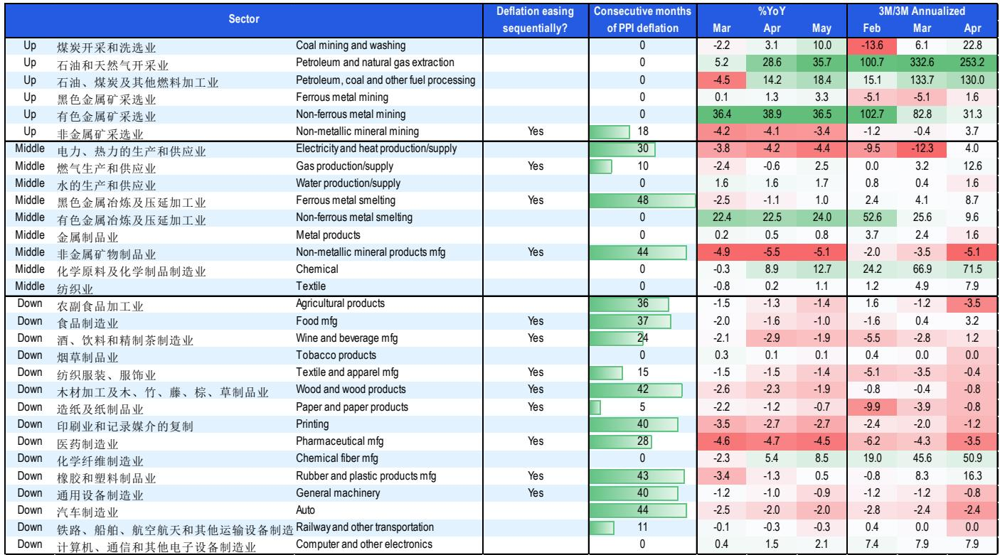
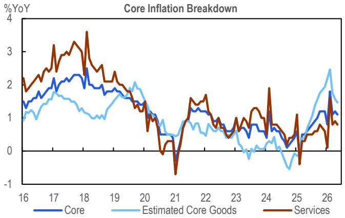
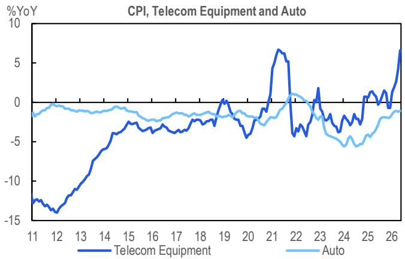

# Citi：PPI再通胀的真正含义不是能源，而是中国工业定价权的结构性拐点

五月通胀数据公布后，市场注意力几乎被CPI的小幅不及预期和能源价格回落所吸引。但这份Citi研报提出的核心判断值得认真对待：PPI再通胀正在从“能源脉冲”切换为“结构扩散”——这不是一次短暂的价格波动，而是中国工业部门定价逻辑正在发生改变的早期信号。

Citi维持CPI和PPI全年预测分别为1.0%和2.8%同比，这本身并不激进。真正有意思的是报告在数据细节中捕捉到的三个结构性变化：投资企稳的初步迹象、AI超周期开始显性化为价格力量、以及K型分化下下游通缩与上游通胀的持续拉锯。

这些事实合在一起，指向一个比市场共识更复杂的叙事：中国的价格信号正在从“总量问题”演变为“结构问题”。对于产业决策者和资产配置者来说，理解这种结构性分化，远比争论CPI是否见底更有价值。

## 1. 能源脉冲退潮后，PPI扩散才是关键信号

五月PPI同比3.9%，略高于Citi预期的3.8%，但环比增速从四月的1.7%大幅回落至0.5%。表面上看，这是中东冲突溢出的价格冲击正在消退——石油和天然气开采PPI环比从18.5%骤降至-0.1%，燃料加工PPI环比归零。

但报告明确指出，真正值得关注的不是能源的退潮，而是再通胀的“广度”在扩大。Citi估算，能源和化工对五月PPI环比的合计贡献仅为0.2个百分点，远低于四月的1.6个百分点。这意味着，即使剔除能源冲击，PPI仍然录得了0.3个百分点的环比正增长。

这个“剔除能源后的PPI”才是报告的核心洞察。它说明工业品价格上涨的动力正在从单一的地缘政治冲击，切换为更广泛的内生性因素——包括投资需求的边际改善、上游原材料成本的传导、以及部分行业供给侧的收紧。

对于投资者而言，这意味着不能再用“能源价格见顶”来简单判断PPI拐点。五月的数据表明，即使能源贡献消退，其他行业的价格动能仍在累积。PPI的韧性可能比市场预期的更持久。

## 2. 投资端出现“试探性企稳”，但规模尚不足以驱动政策转向

报告中最值得关注的信号来自建筑业相关价格。黑色金属矿采选PPI同比3.3%、环比0.9%；非金属矿采选PPI同比-3.4%，但环比已经转正为0.4%。Citi估算，建筑业相关项目对PPI环比的合计贡献升至0.1个百分点——虽然绝对值仍然很小，但这已经是过去一年中的第二高读数。

报告将此描述为“投资企稳的试探性信号”，并与建筑业PMI的改善相互印证。这个判断的谨慎之处在于“试探性”三个字：价格改善的幅度仍然有限，且主要集中在采矿环节，尚未向下游的冶炼和建材制造充分传导。

但从另一个角度看，这正是政策最有可能发力的领域。如果建筑业价格的改善能够持续，Citi认为“政策行动可能已经开始”。报告将劳动力市场状况视为进一步定向宽松的触发因素——这个判断隐含的逻辑是：投资企稳本身不足以解决需求问题，但如果投资改善能带动就业，政策的空间就会打开。

对于关注基建和地产周期的读者，这里有一个重要的观察框架：五月的数据可能只是起点，未来两到三个月的建筑业价格走势，将是判断“投资是否真正企稳”的关键验证窗口。

## 3. AI超周期正在改写中国通胀的部门结构

这是报告中一个容易被忽略但极具前瞻性的判断：AI超周期正在成为通胀的新驱动力，不仅影响科技PPI，也开始传导至电信CPI。

具体数据支持了这一论点。五月通信设备CPI环比上涨1.5%，同比达到6.6%，这是历史第二高读数。与此同时，计算机和其他电子设备PPI同比2.1%、环比0.6%，虽然涨幅不如上游能源，但趋势明确向上。报告还特别提到，光纤制造和电缆制造的价格动能也在增强。

与之形成鲜明对比的是汽车行业。汽车CPI环比下降0.4%，已是连续第三个月下滑，同比跌幅维持在-2.0%。Citi将这一分化归因于“AI超周期的展开”——需求结构正在从传统耐用消费品向科技硬件转移。

这个判断意味着什么？中国的通胀结构正在被技术周期重塑。过去市场习惯用“猪周期”和“能源价格”来理解通胀，但未来可能需要将“AI硬件价格”作为一个独立变量纳入分析框架。电信设备价格的高位运行，不仅反映了供给侧的技术升级，也暗示了需求端的结构性变化——企业和消费者正在为AI相关产品支付更高的价格。

对于资产定价而言，这意味着科技硬件相关板块的定价权可能正在增强，而传统耐用消费品（尤其是汽车）面临的价格压力短期内难以缓解。

## 4. 下游通缩的韧性与K型分化的固化

报告最诚实的部分在于，它没有回避经济的另一面。核心CPI环比下降0.1%，服务CPI环比下降0.1%，旅游价格在五一假期后显著回落——车辆租赁和机票价格分别环比下降6.8%和6.3%。

下游制造业的通缩更加顽固。报告整理的数据显示，在27个下游PPI行业中，有超过一半仍处于同比负增长状态。汽车制造业PPI已连续44个月处于通缩区间，非金属矿物制品业连续44个月，通用设备制造业连续40个月。这些数字本身就在讲述一个故事：中国制造业的产能过剩和需求不足，并非短期现象。

Citi将这种分化概括为“经济的K型分化”——上游受益于能源、资源和AI周期，下游则持续承受需求疲软的压力。这种分化在五月不仅没有收敛，反而有固化的趋势。上游价格向中下游的传导仍然受阻，核心CPI的走弱就是最直接的证据。

对于产业决策者而言，这意味着“成本传导”的假设需要被重新审视。不是所有行业都能将上游涨价转嫁给下游，那些缺乏定价权、产能过剩的行业，可能面临利润被持续挤压的风险。

## 5. 报告尚未完全回答的关键问题：需求端的拐点何时到来？

Citi的报告在识别结构性变化方面表现出色，但它也留下了一个未解的核心问题：如果投资企稳和AI周期是供给侧的力量，那么需求侧的拐点何时到来？

报告中提到的“劳动力市场状况是政策调整的触发因素”，实际上指向了这个问题的答案。但报告并没有展开讨论劳动力市场数据本身——例如就业率、工资增长、劳动参与率等指标的现状和趋势。这意味着，读者需要自己补上这块拼图。

另一个未完全展开的问题是：AI超周期对价格的推动，是可持续的结构性变化，还是阶段性的供给冲击？电信设备价格的历史高读数，部分可能来自于5G升级和AI服务器需求的叠加，但一旦这些需求被满足，价格是否就会回落？报告没有给出明确的判断。

这些不确定性，恰恰是研报最有价值的部分——它不是在给出确定的答案，而是在提供一套分析框架，让读者自己去跟踪和验证关键假设。

## 6. 一个值得持续跟踪的观察框架

基于Citi这份报告的逻辑，可以提炼出三个需要持续跟踪的指标：

第一，建筑业价格的持续性。五月非金属矿采选PPI的环比转正是一个积极信号，但需要未来两到三个月的数据确认。如果这一趋势能够延续，投资企稳的判断将从“试探性”升级为“确定性”，政策逻辑也将随之改变。

第二，AI硬件价格的传导深度。当前电信设备CPI的高位运行，是否能够扩散到更广泛的科技产业链？计算机PPI的温和上涨是否能加速？这将是判断AI超周期是否真正成为通胀结构性力量的关键。

第三，下游通缩的边际变化。报告数据显示，部分下游行业（如食品制造、纺织服装、木材加工）的通缩幅度正在逐月收窄。虽然绝对值仍为负，但边际改善的行业数量在增加。这可能是需求端最微弱的积极信号，但也是最容易被忽视的。

这三个指标的共同特点是：它们都不是“总量数据”，而是“结构数据”。在K型分化的环境下，总量指标（如CPI和PPI的总体读数）已经不足以指导决策。真正的洞察来自对行业层面价格动能的拆解和比较。

## 7. 顺着这些未解问题继续

Citi这份报告的价值，不在于它给出了多少确定的预测，而在于它提供了一个重新理解中国通胀的框架。PPI再通胀不再只是能源的故事，投资企稳正在试探性出现，AI周期正在改写价格结构——但这些变化都还处于早期阶段，关键假设尚未得到充分验证。

核心CPI的持续疲软和下游通缩的韧性，意味着需求端的修复仍然缓慢。政策是否会进一步加码，取决于劳动力市场和投资数据的后续演变。AI硬件价格的高位运行，是技术周期的短暂脉冲还是长期趋势，也需要更多数据来确认。

这些未解问题，恰恰是深入讨论的起点。如果你对中国的通胀结构、产业定价权的变迁、以及这些变化对资产配置的含义感兴趣，欢迎来我们的星球微信群里继续讨论。在那里，我们会分享完整报告的原始图表、更详细的行业拆解，以及对关键假设的持续跟踪和验证。

Personal reading notes and learning share only. Not investment advice.

