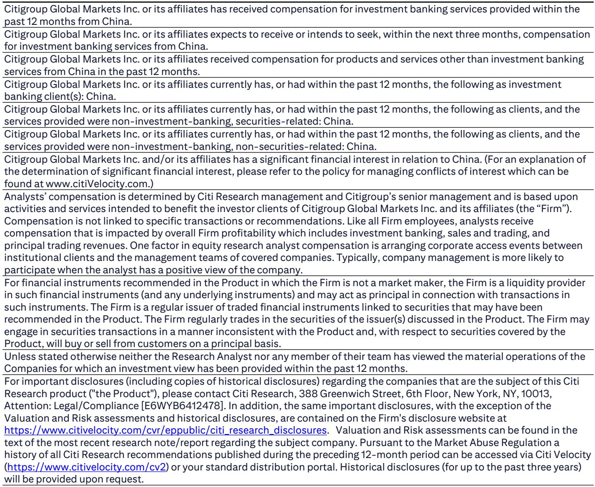
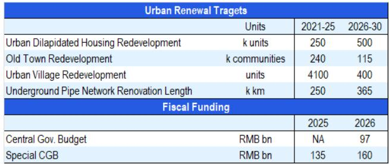
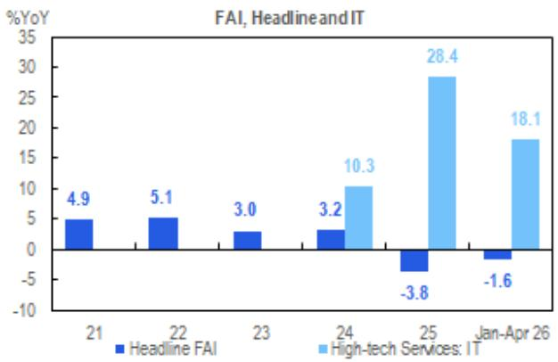

# China's "Six Networks" Strategy Is Not Just Infrastructure Spending—It Is the Blueprint for a K-Shaped Investment Recovery

The most consequential shift in China's investment landscape is not the size of the stimulus but its architecture. In early June 2026, Beijing launched a coordinated wave of mega-projects—a RMB77 billion Three Gorges waterway, a potential RMB2 trillion data center buildout, and binding urban renewal targets for the 15th Five-Year Plan—that collectively define the "Six Networks" initiative. These are not isolated spending programs. They represent a deliberate pivot from broad-based investment stabilization to a targeted, dual-economy strategy. The controlling insight is this: China is no longer trying to revive all fixed asset investment. It is building a K-shaped recovery, where new economy infrastructure leads and traditional sectors must find their own footing. For investors, this means the relevant question is not "when will investment turn around," but "which investment will turn around, and at what speed."

The urgency behind this policy push is unmistakable. April 2026 saw cumulative fixed asset investment growth turn negative for the first time in this cycle, a signal that jolted policymakers into action. Yet the response has not been a return to the broad stimulus of prior decades. Instead, the Six Networks framework—integrating data centers, power grids, water conservancy, transportation, urban renewal, and underground utilities—reveals a government that has internalized a hard lesson: spending alone is insufficient. The structure of spending determines the outcome. And the structure now favors sectors that can generate productivity gains, attract private capital, and align with the AI supercycle.

This article unpacks the strategic logic behind the Six Networks, examines the financing architecture that makes it credible, and identifies the analytical gaps that remain unresolved. It then translates the report's findings into a decision framework for investors navigating what is likely to be a prolonged, uneven recovery.

## The Six Networks Initiative Represents a Structural Shift from Stabilization to Strategic Prioritization

The conventional reading of China's latest infrastructure push is cyclical: investment is slowing, so the government is spending more. This interpretation misses the deeper story. The Six Networks initiative is not a blanket stimulus. It is a prioritization framework that explicitly channels capital toward sectors where China needs to build competitive advantage, while leaving traditional infrastructure to a slower, more measured pace.

Consider the contrast. The Three Gorges waterway project, at RMB77 billion over ten years, is large but incremental—it extends existing capacity in a mature sector. The data center buildout, by contrast, is reported at RMB2 trillion over five years, with potential expansion to RMB5 trillion when integrated with power grid upgrades. That is not incremental. It is transformational. The message is clear: the government is willing to spend at scale only where the investment creates assets that enable future economic activity, not just current employment.

This is a structural shift with profound implications. In previous cycles, infrastructure spending was a countercyclical tool—build roads and bridges to keep GDP afloat. The Six Networks treats infrastructure as a strategic asset: data centers enable AI, power grids enable electrification, underground pipes enable urbanization. Each investment is chosen not for its multiplier effect in the current quarter, but for its capacity to unlock productivity in the next decade.

The investment community has been slow to grasp this distinction. Many still track headline FAI growth as the key indicator. But headline FAI masks the divergence. IT-related fixed asset investment grew at 18.1% year-on-year in April 2026, even as headline FAI contracted by 1.6%. The K-shape is already visible. The Six Networks will accelerate it.

## Financing Is Credible Because It Combines Budgetary Discipline with Policy-Led Leverage

A common skepticism about China's infrastructure plans is that they are announced with fanfare but funded with ambiguity. The Six Networks initiative addresses this concern head-on by specifying a multi-layered financing architecture that is both transparent and scalable.

The first layer is the general budget. The central government has already allocated RMB97 billion for urban renewal in 2026, a line item that did not exist in previous years at this scale. This is direct fiscal commitment, not off-balance-sheet shadow spending. The second layer is special central government bonds for "two key projects," with RMB160 billion earmarked for underground pipe networks alone. The third layer is a new policy-financing tool that provides an initial RMB500 billion in 2025 and RMB800 billion in 2026. The fourth layer comprises government-guided funds that can crowd in private capital.

What makes this architecture credible is not the total number—over RMB7 trillion in pledged investment for the year—but the sequencing. The general budget provides the anchor. The special bonds provide the scale. The policy tool provides the flexibility. And the guided funds provide the leverage. Each layer serves a distinct purpose, and together they reduce the risk that political enthusiasm outruns fiscal capacity.

There is, however, a nuance that the report does not fully explore. The financing architecture assumes that local governments have both the willingness and the administrative capacity to execute. The urban renewal targets, for example, require coordination across multiple municipal agencies, land-use authorities, and state-owned enterprises. Past experience suggests that execution bottlenecks—not funding gaps—have been the primary constraint on infrastructure delivery. The Six Networks initiative may be fiscally sound, but it is administratively ambitious.

## The Recovery Will Be K-Shaped, and the Leading Edge Is Already Visible

The most actionable insight from the report is that the investment recovery has already started—but only for a subset of sectors. The construction PMI rebounded in May. Construction-related PPI deflation eased. Cement mill operating rates improved throughout the month. These are genuine green shoots, but they are concentrated in the sectors that the Six Networks directly supports.

This is not a broad-based recovery. Domestic credit demand remains low, and traditional real estate investment continues to weigh on headline numbers. The K-shape means that new economy sectors—data centers, power grids, AI-related hardware, and urban renewal—will see accelerating activity, while old economy sectors face a prolonged adjustment.

For investors, this has two implications. First, tracking aggregate FAI data will be misleading. The averages will look mediocre for quarters to come, but the dispersion will be extreme. Second, the sectors that lead the recovery will be those with explicit policy backing and clear financing channels. Data centers are the clearest example: they have government prioritization, dedicated funding, and a structural demand driver in AI. Urban renewal is a close second, with binding targets and proven fiscal support.

The report's data on urban renewal targets underscores this point. The 2026-2030 period calls for 500,000 units of dilapidated housing redevelopment, up from 250,000 in the previous five-year plan. Underground pipe network renovation jumps from 250,000 kilometers to 365,000 kilometers. These are not aspirational goals; they are backed by specific funding allocations. The execution risk remains, but the direction is unambiguous.

## What the Report Does Not Fully Answer: The Interaction Between Monetary Conditions and Investment Demand

For all its analytical rigor, the report leaves one critical question open: can the Six Networks initiative succeed if credit demand remains weak across the broader economy? The report notes that "a broad pickup in FAI growth may take longer amid low domestic credit demand," but it does not fully explore the mechanism through which weak credit conditions could spill over into even the prioritized sectors.

The concern is not that the Six Networks will lack funding. The concern is that the opportunity cost of capital will remain high for private sector participants, reducing the crowding-in effect that government-guided funds are meant to achieve. If banks are reluctant to lend to small and medium enterprises, and if corporate balance sheets remain stretched, the private capital that the government expects to leverage may not materialize at the scale required.

Furthermore, the report does not address the potential for interest rate dynamics to shift the calculus. If global rates remain elevated and the renminbi faces depreciation pressure, the cost of financing large-scale infrastructure projects could rise, even if the nominal budget is fixed. Local governments, already under fiscal strain, may find themselves paying more to service debt, reducing the effective resources available for new investment.

These are not reasons to dismiss the Six Networks thesis. They are reasons to monitor the transmission mechanism closely. The initiative's success depends not only on government spending but on the responsiveness of the broader financial system. Investors should watch credit aggregates, bank lending surveys, and local government financing costs as leading indicators of whether the K-shaped recovery will deepen or stall.

## A Decision Framework for Investors: Navigating the K-Shape

The report's analysis can be distilled into a practical framework for investment decisions over the next 12 to 18 months. This framework has three dimensions: sector exposure, signal selection, and scenario planning.

First, sector exposure. Investors should distinguish between sectors that are direct beneficiaries of the Six Networks and sectors that are cyclical laggards. Direct beneficiaries include data center construction and equipment, power grid infrastructure, urban renewal contractors, and underground utility providers. Cyclical laggards include traditional real estate, broad-based construction materials, and commodity-heavy infrastructure that lacks policy prioritization. The K-shape means that being in the right sector will matter more than being right about the aggregate economy.

Second, signal selection. Abandon headline FAI as a decision variable. Instead, track three leading indicators: construction PMI for momentum, cement operating rates for real-time activity, and special bond issuance for policy execution. When all three move in the same direction, the recovery is validated. When they diverge, the K-shape is widening.

Third, scenario planning. Consider three outcomes. In the base case, the Six Networks initiative executes as planned, new economy investment grows at 15-20% annually, and headline FAI stabilizes at 2-3% growth by mid-2027. In the upside case, private capital responds more strongly than expected, pushing IT-related FAI above 25% and pulling the broader economy along. In the downside case, execution bottlenecks and weak credit demand limit the initiative's impact, and headline FAI remains near zero or negative. Each scenario implies a different portfolio tilt: overweight new economy infrastructure in all cases, but with a defensive posture in the downside scenario.

The report does not prescribe which scenario is most likely. It provides the analytical tools to make that judgment independently. The key is to recognize that the old playbook—wait for aggregate data to improve, then rotate into cyclical exposure—no longer applies. The recovery is already here, but it is selective. The question is whether your portfolio is positioned for the shape of the recovery, not its timing.

Join the community to read the full report and review the original charts.

*This article is for learning and discussion only and does not constitute investment advice.*

Personal reading notes and learning share only. Not investment advice.

