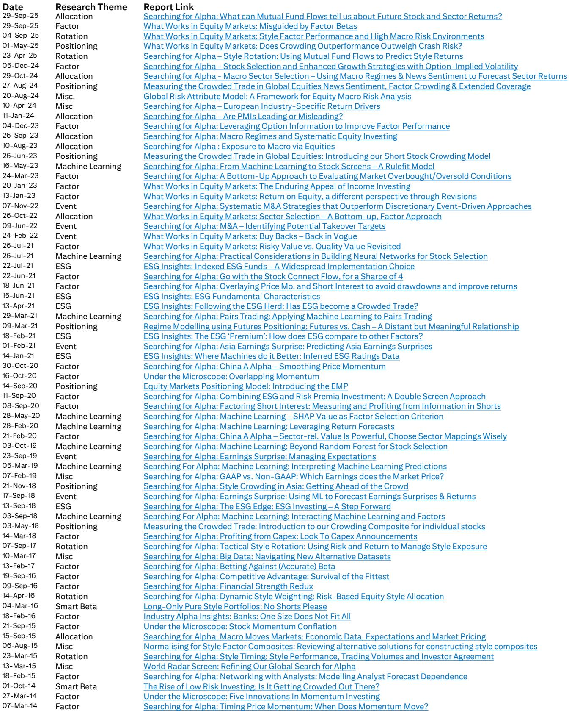
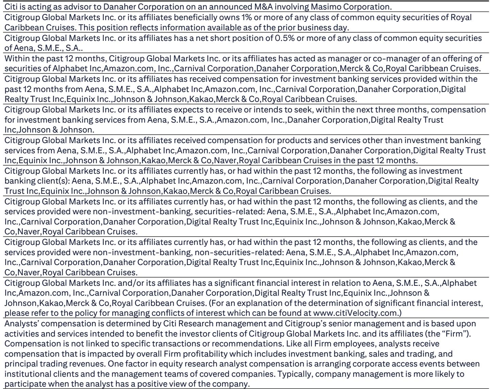
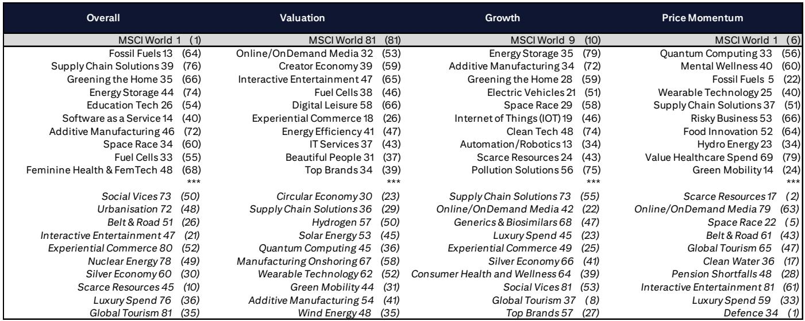

# The Market Is Rewarding Themes with Earnings Momentum, Not Just Price Momentum

The most important shift in thematic investing over the past month is not about which themes are popular. It is about why they are popular. A careful reading of the latest systematic theme ranking data reveals that the market is increasingly discriminating between themes that have genuine fundamental improvement and themes that merely benefit from rising tides. The top quintile of themes outperformed the bottom quintile by only 0.2 percentage points in the latest month, a narrow spread that masks a far more important structural divergence beneath the surface. The real story is about the factors driving rank changes, and that story has direct implications for how investors should position themselves for the remainder of 2026.

The data shows that the largest rank improvers—Cloud Computing, Wearable Technology, and Virtual Reality—all advanced primarily because of improved earnings momentum, not because of price momentum alone. Cloud Computing moved to rank 4 from rank 7, with earnings momentum holding at the second percentile while price momentum improved from the 44th to the 35th percentile. Wearable Technology jumped from rank 25 to rank 11, with earnings momentum surging from the 14th to the 4th percentile. Virtual Reality rose from rank 19 to rank 9, driven by an earnings momentum improvement from the 26th to the 6th percentile. These are not random fluctuations. They signal that the market is beginning to demand evidence of fundamental delivery from thematic exposures.

This shift matters because it changes the calculus for investors who have been riding thematic momentum without regard to underlying earnings trajectories. The themes that have persistently led the rankings—Risky Business, Pension Shortfalls, FinTech, and Artificial Intelligence Enablers—are not there by accident. They combine valuation support, quality characteristics, and improving earnings visibility. The themes that are falling, such as Luxury Spend, Global Tourism, and Solar Energy, are deteriorating because their price momentum is no longer backed by improving fundamentals. The market is sending a clear signal: themes without earnings reinforcement will not hold their rankings.

## The Narrow Performance Spread Conceals a Widening Fundamental Dispersion

At first glance, the model performance data might suggest that thematic investing is losing its edge. The top quintile of themes returned 3.6 percent in the latest month, only marginally ahead of the bottom quintile at 3.4 percent, and both lagged the MSCI World return of 4.6 percent. A casual observer might conclude that thematic differentiation is not working. That conclusion would be a mistake.

The narrow performance spread in any given month is consistent with the model's longer-term track record. The cumulative performance chart shows that top quintile themes have dramatically outperformed bottom quintile themes since 2013, with the gap widening significantly after 2020. The long-short portfolio has generated substantial alpha over more than a decade. What the monthly data reveals is not that thematic differentiation has broken down, but that the market is in a phase where broad-based strength is compressing short-term dispersion. The fundamental differences between themes, however, are actually widening.

Consider the factor-level data behind the rankings. When price momentum is excluded from the overall ranking, the picture changes materially. FinTech moves from rank 5 to rank 1, indicating that its fundamental profile is even stronger than its headline rank suggests. Pension Shortfalls drops from rank 3 to rank 14 when price momentum is removed, revealing that its high rank is partly dependent on technical factors. This kind of factor decomposition is precisely what investors need to understand when the market environment shifts. Themes that rely on price momentum alone are vulnerable to reversals. Themes with strong fundamentals are more durable.

The implication is clear: the current environment rewards investors who look beyond headline rankings and understand the factor composition driving each theme. The themes that will sustain their leadership through the next market rotation are those with earnings momentum, quality, and valuation support, not those riding a wave of price momentum that could reverse at any time.

## Earnings Momentum Is the New Differentiator in Thematic Rankings

The most striking pattern in the June rankings is the concentration of large rank improvements among themes with surging earnings momentum. Cloud Computing, Wearable Technology, and Virtual Reality are not just technology themes. They are themes where the underlying companies are delivering earnings improvements that the market is beginning to recognize.

Cloud Computing's earnings momentum rank of 2, combined with quality improving from the 13th to the 8th percentile, creates a powerful combination. The theme has strong growth characteristics—it ranks 3rd on growth overall—but what is changing is that the market is now rewarding it for earnings delivery, not just for being in the right sector. This is a maturation signal. Cloud Computing is moving from a narrative-driven theme to a fundamentals-driven theme, and that transition typically supports more sustainable performance.

Wearable Technology provides an even more dramatic example. Its earnings momentum rank improved from 14 to 4, and its price momentum improved from 40 to 25. But critically, its quality rank actually deteriorated from 11 to 23, and its low-risk rank fell from 52 to 53. This is not a theme that is improving across the board. It is a theme where earnings momentum is pulling the overall rank higher despite deterioration in other factors. That creates both opportunity and risk. If earnings momentum continues to improve, the theme could rise further. If earnings momentum stalls, the weakness in other factors could become more visible.

Virtual Reality shows a similar pattern. Earnings momentum improved from 26 to 6, while quality remained roughly stable and low-risk characteristics actually improved slightly. The improvement is concentrated in one factor, but that factor is the one that matters most in the current market environment. The question for investors is whether this earnings momentum is sustainable or whether it reflects a temporary boost that will revert.

The broader pattern is that the market is rotating toward themes where earnings delivery is visible and away from themes where it is not. Luxury Spend fell from rank 36 to rank 76, with earnings momentum collapsing from the 17th to the 76th percentile. Global Tourism fell from rank 35 to rank 81, with earnings momentum dropping from the 33rd to the 82nd percentile. Solar Energy fell from rank 62 to rank 79, with earnings momentum deteriorating from the 31st to the 80th percentile. These are not small moves. They are systematic repudiations of themes that cannot demonstrate fundamental improvement.

## The Persistent Leaders Reveal What Structural Thematic Investing Actually Requires

The themes that have held their positions at the top of the rankings over multiple months offer a blueprint for what durable thematic leadership looks like. Risky Business, Pension Shortfalls, FinTech, Artificial Intelligence Enablers, and Defence have all remained in the top 10 for at least the past three months. They share common characteristics that are worth examining.

Risky Business ranks 2nd overall and 3rd when price momentum is excluded. It has the 2nd best valuation rank in the entire universe, the 2nd best quality rank, and the best low-risk rank. This is not a theme that is winning on any single factor. It is winning because it scores well across multiple dimensions. The market is not buying Risky Business because it is exciting. It is buying it because it offers a combination of cheap valuations, high quality, and low risk that is rare in any market environment.

FinTech ranks 5th overall but 1st when price momentum is excluded. Its valuation rank of 8, growth rank of 11, and quality rank of 4 create a profile that is attractive regardless of the market environment. The fact that its price momentum rank is only 66 suggests that the market has not fully recognized the theme's fundamental strength. This is precisely the kind of disconnect that experienced thematic investors look for: a theme with strong fundamentals that is not yet fully reflected in price momentum.

Artificial Intelligence Enablers ranks 6th overall and 19th when price momentum is excluded. Its growth rank of 4 and earnings momentum rank of 5 are exceptional, but its valuation rank of 80 and quality rank of 25 suggest that the market is already pricing in significant expectations. The question for investors is whether the growth and earnings momentum can justify the valuation. The data does not answer that question definitively, but it does provide the framework for analyzing it.

The persistent leaders demonstrate that structural thematic investing requires more than identifying the right narrative. It requires understanding which factors are driving each theme's performance and whether those factors are likely to persist. Themes that score well on multiple factors are more resilient. Themes that rely on a single factor, even a powerful one like earnings momentum, are more vulnerable to factor reversals.

## What the Report Does Not Fully Answer: The Crowdedness Problem and Factor Regime Risk

The report provides extensive data on theme rankings, factor decomposition, and performance. But it leaves several critical questions unresolved. The most important is the question of crowdedness. The report mentions that it assesses theme crowdedness and macroeconomic sensitivities, but the publicly available data does not include detailed crowdedness metrics. This is a significant gap because crowdedness is often the mechanism through which thematic leadership reverses.

When too many investors pile into the same theme, the marginal return to new information declines, and the theme becomes vulnerable to sharp reversals when sentiment shifts. The report shows that Artificial Intelligence Enablers has a price momentum rank of 15, which is relatively strong, but does not tell us whether that momentum is being driven by fundamental buyers or by momentum chasers. If the latter, the theme could be more fragile than its overall rank suggests.

The second unresolved question is about factor regime risk. The current environment rewards earnings momentum, but factor regimes can shift quickly. If the market rotates toward value or toward low volatility, the themes that are currently leading could fall rapidly. The report provides the data to monitor factor exposures, but it does not offer a framework for predicting factor regime changes. Investors who rely solely on current rankings without considering the potential for factor rotation are taking on hidden risk.

The third unresolved question is about the interaction between themes. The report maps over 20,000 individual stock-theme linkages, but the publicly available data does not show how themes overlap at the stock level. For example, the table of stocks with high exposures to multiple themes shows that Gulf Development has exposure to both top 15 themes and bottom 15 themes. This creates a diversification puzzle that the report does not fully address. Investors who buy a stock for its exposure to a strong theme may inadvertently also be buying exposure to a weak theme.

These unresolved questions are not criticisms of the report. They are natural limitations of any systematic framework. The report provides the tools to analyze themes rigorously, but it cannot eliminate the need for judgment. The best investors will use the data to inform their judgment, not to replace it.

## A Decision Framework for Thematic Investors in the Current Environment

Given the patterns in the data, thematic investors should adopt a three-step decision framework for the current environment. This framework is designed to be actionable, not theoretical.

First, identify the factor drivers of each theme you are considering. Do not look at the overall rank alone. Look at the component factor ranks. A theme with strong earnings momentum and weak quality is different from a theme with strong quality and weak earnings momentum. The former is a momentum play. The latter is a structural holding. Each requires a different risk management approach. For momentum plays, set clear stop-loss levels and be prepared to exit quickly if earnings momentum deteriorates. For structural holdings, be more patient and focus on whether the fundamental thesis remains intact.

Second, assess whether the theme's factor profile is aligned with the current market regime. The data shows that earnings momentum is currently the most powerful differentiator. But that could change. Monitor factor performance trends to anticipate regime shifts. If low volatility factors begin to outperform, themes like Risky Business and Pension Shortfalls, which have strong low-risk characteristics, may benefit. If value factors strengthen, themes with poor valuation ranks like Cloud Computing and Artificial Intelligence Enablers may come under pressure.

Third, evaluate the crowdedness of each theme using available proxies. The report does not provide explicit crowdedness data, but investors can proxy for it by looking at price momentum ranks and analyst consensus. Themes with very high price momentum ranks and very high analyst conviction may be overcrowded. Themes with moderate price momentum and strong fundamental ranks may offer better risk-reward. The goal is not to avoid popular themes entirely, but to understand whether the popularity is justified by fundamentals or driven by herding.

This framework will not eliminate uncertainty, but it will help investors make more systematic decisions about which themes to overweight and which to underweight. The data in the report provides the raw material. The framework provides the structure for interpreting it.

## The Full Report Contains the Data to Execute This Framework

The analysis in this article is based on the publicly available summary data from the Global Theme Machine monthly update. But the full report contains substantially more detail, including the complete factor rankings for all 83 themes, the crowdedness metrics, the macroeconomic sensitivity analysis, and the full stock-theme mapping database. For investors who want to implement the decision framework described above, the full report is essential.

The report also includes the historical performance data that allows investors to stress-test their thematic portfolios across different market environments. The cumulative performance chart shows that the top quintile themes have generated significant alpha over time, but the monthly performance chart shows that this alpha is not consistent. Understanding the historical pattern of outperformance and underperformance is critical for setting realistic expectations and managing drawdown risk.

Join the community to read the full report and review the original charts.

*This article is for learning and discussion only and does not constitute investment advice.*

Personal reading notes and learning share only. Not investment advice.

