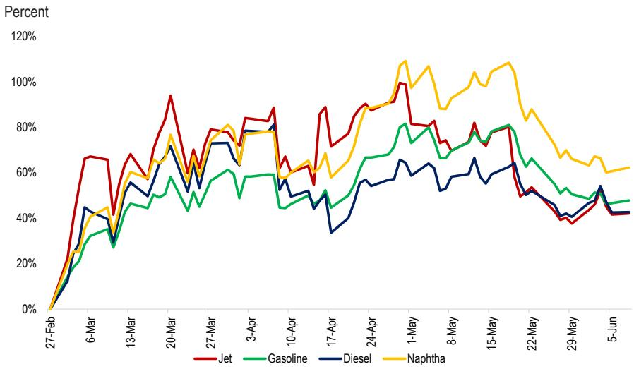
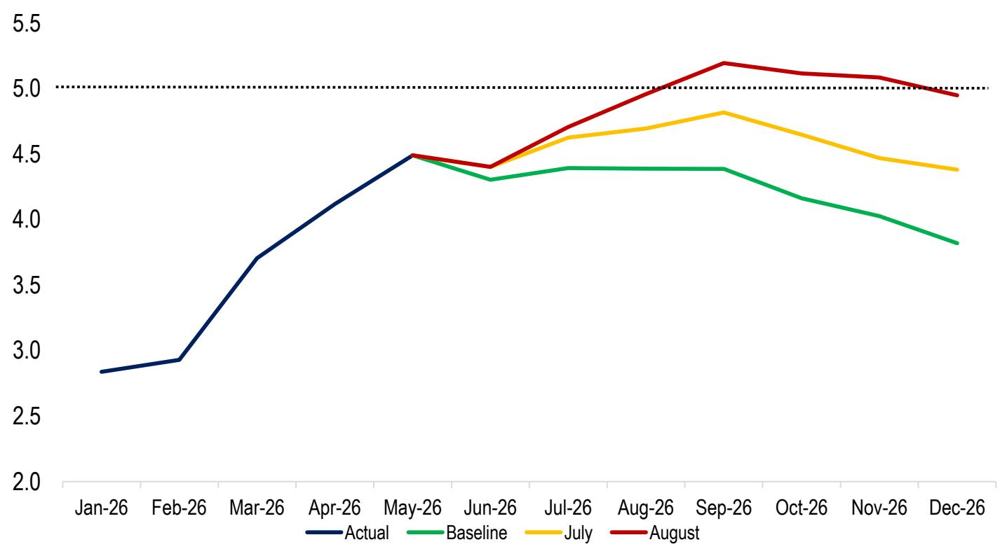
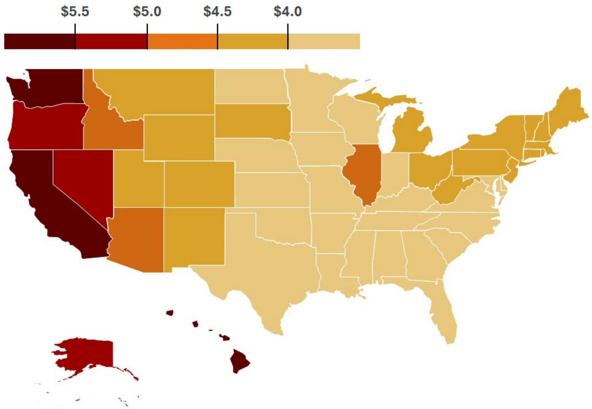
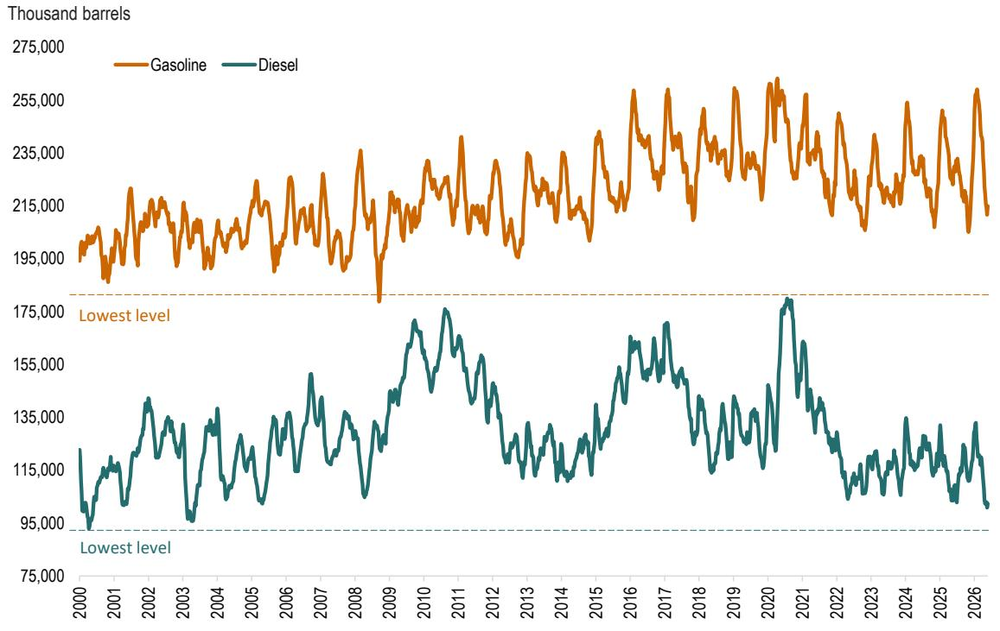
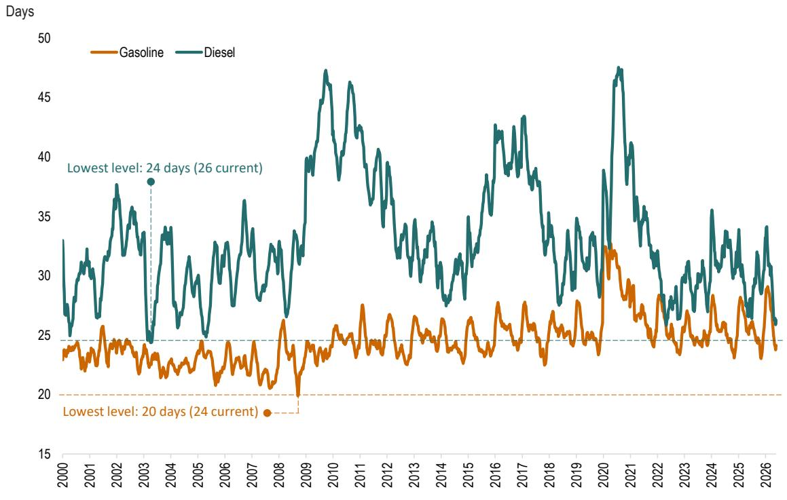
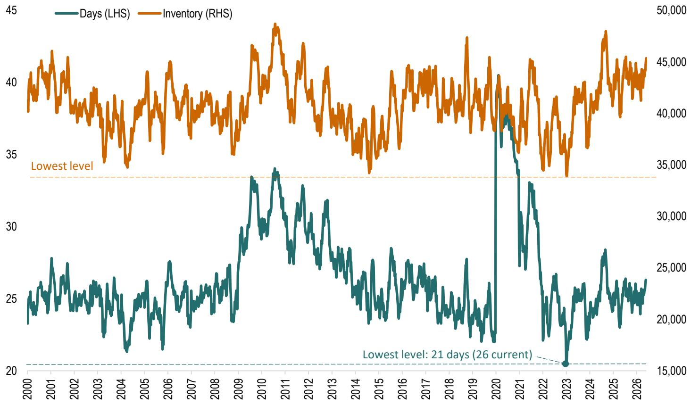

## Oil Markets Weekly

The first thousand miles

The largest supply disruption on record has produced a surprisingly unremarkable price chart. Since the start of the conflict, Brent has averaged just \$101, closely tracking the price path implied by our framework in early March.

At the time, we concluded that only two forces could plausibly explain such a restrained outcome. Either demand losses, alongside inventory drawdowns, could prove large enough to rebalance the market outright. Or the adjustment could move down the barrel, away from crude and into refined products (Down the barrel, 8 May 2026). Under that scenario, crude prices could hover near \$100/bbl while scarcity shows up instead in gasoline, diesel, and jet fuel prices. The shock would be expressed not through materially higher flat crude prices, but through widening product cracks and sharply higher refined product prices. In March, we viewed the latter as the more likely adjustment mechanism.

The first part of that framework proved correct. The second did not. Crude prices followed the expected path. Product markets did not. After an initial spike, gasoline, diesel, and jet fuel prices have reset lower, while refining margins have narrowed rather than widened (Figure 1).

Figure 1: US petroleum product price change from February 27 to June 8  


<details>
<summary>line chart</summary>

| Date     | Jet  | Gasoline | Diesel | Naphtha |
|----------|------|----------|--------|---------|
| 27-Feb   | 0%   | 0%       | 0%     | 0%      |
| 6-Mar    | 65%  | 30%      | 40%    | 45%     |
| 13-Mar   | 68%  | 45%      | 50%    | 60%     |
| 20-Mar   | 95%  | 55%      | 70%    | 75%     |
| 27-Mar   | 75%  | 60%      | 70%    | 80%     |
| 3-Apr    | 85%  | 65%      | 75%    | 78%     |
| 10-Apr   | 60%  | 50%      | 55%    | 65%     |
| 17-Apr   | 85%  | 45%      | 40%    | 70%     |
| 24-Apr   | 90%  | 60%      | 55%    | 85%     |
| 1-May    | 100% | 70%      | 60%    | 110%    |
| 8-May    | 80%  | 65%      | 55%    | 90%     |
| 15-May   | 80%  | 75%      | 60%    | 105%    |
| 22-May   | 50%  | 60%      | 50%    | 85%     |
| 29-May   | 40%  | 50%      | 45%    | 70%     |
| 5-Jun    | 45%  | 45%      | 40%    | 60%     |
</details>

Source: Bloomberg Finance L.P., JPM Commodities Research

## Global Commodities Research

## Natasha Kaneva

(1-212) 834-3175

natasha.kaneva@JPM.com

## Lyuba Savinova

(1-212) 270-3781

lyuba.savinova@jpmchase.com

## Artem Fakhretdinov

(1-212) 272-1839

artem.fakhretdinov@JPM.com

JPM Chase Bank NA

The most plausible explanation is that the market has absorbed much of the disruption through a combination of demand losses and large-scale inventory releases. Demand has weakened in the conflict zone itself. In parts of Asia, reduced physical oil availability has curtailed consumption directly. In China, consumers have substituted away from oil more readily than many expected. In Africa, higher prices have triggered more traditional forms of demand destruction. At the same time, governments and commercial operators have drawn heavily on both crude and refined product inventories. Together, these adjustments have reduced the burden on prices to do the balancing.

For US consumers, however, this does not mean that fuel markets have fully normalized. Our forecast still calls for Brent to average around \$100 through most of the remainder of 2026. On that view, we estimate that the US retail gasoline prices will remain near \$4 per gallon for much of the year (Figure 2). While far below the levels implied by a full-blown product shortage in more extreme scenarios, they remain elevated enough to keep energy firmly in focus for households and policymakers alike.

Figure 2: JPM US retail gasoline price forecast under alternative Strait of Hormuz reopening scenarios \$ per gallon  


<details>
<summary>line chart</summary>

| Month    | Actual | Baseline | July | August |
| -------- | ------ | -------- | ---- | ------ |
| Jan-26   | 2.8    | -        | -    | -      |
| Feb-26   | 2.9    | -        | -    | -      |
| Mar-26   | 3.7    | -        | -    | -      |
| Apr-26   | 4.1    | -        | -    | -      |
| May-26   | 4.5    | 4.5      | 4.5  | 4.5    |
| Jun-26   | -      | 4.3      | 4.4  | 4.4    |
| Jul-26   | -      | 4.4      | 4.6  | 4.7    |
| Aug-26   | -      | 4.4      | 4.7  | 5.0    |
| Sep-26   | -      | 4.4      | 4.8  | 5.2    |
| Oct-26   | -      | 4.2      | 4.6  | 5.1    |
| Nov-26   | -      | 4.0      | 4.5  | 5.1    |
| Dec-26   | -      | 3.8      | 4.4  | 5.0    |
</details>

Source: JPM Commodities Research

Importantly, national averages can obscure significant regional differences. Nowhere is this more evident than on the US West Coast, where fuel markets remain the tightest in the country. California is particularly exposed. A combination of unique state regulations—including high taxes and environmental mandates—and the closure of Valero’s Benicia refinery and Phillips 66’s Los Angeles refinery, which together account for 17% of California’s refining capacity, is expected to tighten fuel balances further in a market that already operates with limited flexibility.

Unlike most of the country, California cannot easily draw on supplies from neighboring states. Instead, the state relies heavily on CARB (California Air Resources Board)-compliant gasoline from Asian refiners, which account for nearly two-thirds of gasoline imports into California and roughly $20\%$ to $30\%$ of the state's total gasoline supply. Since March 1, however, many Asian refiners have been forced to reduce refined product exports as disruptions to crude flows from Hormuz have constrained feedstock availability.

The challenge is compounded by California's unique fuel specifications and the lack of major product pipelines linking the state to the rest of the country. More broadly, California's vulnerability reflects a longer-term shift. Once a major producer and exporter of oil and refined products, the state has become increasingly import-dependent as local production has steadily declined.

This structural tightness is evident at the pump. Even as crude oil prices have dipped below \$100 per barrel, pump prices have steadily declined. Today, the national average for a gallon of regular gasoline sits at roughly \$4.16, down more than 10% from a late-May peak near \$4.56. Prices nevertheless exceed \$5.0 in six states, with drivers in California paying an average of \$5.89 a gallon (Figure 3).

Diesel shows the same pattern. Nationwide, average diesel prices have eased to about \$5.32 per gallon. Yet, truckers filling up in California are still paying an average of \$7.16 at the pump.

This matters far beyond the region itself. Roughly one in five of all goods entering the United States arrives through West Coast gateways such as the Ports of Los Angeles and Long Beach. And before those imports ever reach warehouses, distribution centers, and consumers across the country, they often travel their first several hundred—or even thousand—miles powered by West Coast diesel and gasoline. In practice, this means that a meaningful share of America’s supply chain pays West Coast fuel prices. These prices influence freight costs, transportation margins, and ultimately the delivered cost of goods nationwide.

Figure 3: Average retail gasoline price by state  
\$/gallon  


<details>
<summary>choropleth map</summary>

| State       | Value  |
| ----------- | ------ |
| California  | $5.5   |
| Texas       | $5.0   |
| Florida     | $4.5   |
| New York    | $4.0   |
| Pennsylvania| $4.5   |
| Illinois    | $4.5   |
| Ohio        | $4.5   |
| Michigan    | $4.5   |
| Georgia     | $4.5   |
| North Carolina | $4.5  |
| Virginia    | $4.5   |
| Washington  | $4.5   |
| Arizona     | $4.5   |
| Massachusetts | $4.5  |
| Tennessee   | $4.5   |
| Indiana     | $4.5   |
| Maryland    | $4.5   |
| Missouri    | $4.5   |
| Colorado    | $4.5   |
| Minnesota   | $4.5   |
| Wisconsin   | $4.5   |
| Michigan    | $4.5   |
| Indiana     | $4.5   |
| Iowa        | $4.5   |
| Kansas      | $4.5   |
| Nebraska    | $4.5   |
| South Dakota | $4.5  |
| North Dakota| $4.5   |
| Montana     | $4.5   |
| Wyoming     | $4.5   |
| Utah        | $4.5   |
| Idaho       | $4.5   |
| Nevada      | $4.5   |
| New Hampshire | $4.5  |
| Rhode Island | $4.5  |
| Maine       | $4.5   |
| Vermont     | $4.5   |
| New Hampshire | $4.5  |
| Delaware    | $4.5   |
| Maryland    | $4.5   |
| Alaska      | $4.5   |
| Hawaii      | $4.5   |
| Maine       | $4.5   |
| Vermont     | $4.5   |
| New Hampshire | $4.5  |
| Rhode Island | $4.5  |
| Delaware    | $4.5   |
| Maine       | $4.5   |
| Vermont     | $4.5   |
| New Hampshire | $4.5  |
| Rhode Island | $4.5  |
| Delaware    | $4.5   |
| Maine       | $4.5   |
| Vermont     | $4.5   |
| New Hampshire | $4.5  |
| Rhode Island | $4.5  |
| Delaware     | $4.5   |
| Maine       | $4.5   |
| Vermont     | $4.5   |
| New Hampshire | $4.5  |
| Rhode Island | $4.5  |
| Delaware    | $4.5   |
| Maine       | $4.5   |
| Vermont     | $4.5   |
| New Hampshire | $4.5  |
| Rhode Island | $4.5  |
| Delaware```  | $4.0   |
</details>

Note: as of June 8 $^{th}$  
Source: AAA, JPM Commodity Research

Understanding where fuel prices go from here requires looking beyond crude oil to the underlying product markets.

US gasoline prices surged in May as the domestic balance tightened on both the supply and demand fronts. Inventories fell while refiners increasingly prioritized jet fuel, constraining gasoline output. At the same time, demand rebounded from the February-April lull, supported by strong Memorial Day travel and resilient consumer activity.

Higher gasoline prices have since begun to elicit a partial response: some refinery production has shifted back from jet fuel toward gasoline, and incremental imports from Canada and Northwest Europe have started to arrive, offering relief to the East Coast market. That said, this rebalancing may be short-lived. European gasoline markets remain tight, and as summer demand builds, incentives to keep barrels in-region are likely to strengthen. If so, US gasoline imports could slow later this summer, leaving domestic inventories at relatively low seasonal levels, though still comfortable overall in terms of days of demand (Figures 4 & 5).

Figure 4: US commercial inventories of gasoline and diesel  


<details>
<summary>line chart</summary>

| Year | Gasoline (Thousand barrels) | Diesel (Thousand barrels) |
|------|-----------------------------|---------------------------|
| 2000 | ~215,000                    | ~95,000                   |
| 2001 | ~218,000                    | ~115,000                  |
| 2002 | ~220,000                    | ~135,000                  |
| 2003 | ~215,000                    | ~95,000                   |
| 2004 | ~218,000                    | ~135,000                  |
| 2005 | ~220,000                    | ~115,000                  |
| 2006 | ~225,000                    | ~135,000                  |
| 2007 | ~230,000                    | ~145,000                  |
| 2008 | ~235,000                    | ~115,000                  |
| 2009 | ~185,000                    | ~135,000                  |
| 2010 | ~235,000                    | ~175,000                  |
| 2011 | ~245,000                    | ~175,000                  |
| 2012 | ~235,000                    | ~155,000                  |
| 2013 | ~235,000                    | ~135,000                  |
| 2014 | ~235,000                    | ~135,000                  |
| 2015 | ~245,000                    | ~145,000                  |
| 2016 | ~255,000                    | ~165,000                  |
| 2017 | ~265,000                    | ~175,000                  |
| 2018 | ~255,000                    | ~145,000                  |
| 2019 | ~265,000                    | ~135,000                  |
| 2020 | ~275,000                    | ~175,000                  |
| 2021 | ~265,000                    | ~145,000                  |
| 2022 | ~255,000                    | ~135,000                  |
| 2023 | ~245,000                    | ~135,000                  |
| 2024 | ~255,000                    | ~135,000                  |
| 2025 | ~245,000                    | ~135,000                  |
| 2026 | ~265,000                    | ~135,000                  |
</details>

Source: EIA, JPM Commodities Research

Figure 5: US commercial inventories of gasoline and diesel in days of demand coverage  


<details>
<summary>line chart</summary>

| Year | Gasoline Days | Diesel Days |
|------|---------------|-------------|
| 2003 | 24            | 38          |
| 2009 | 20            | 40          |
| 2020 | 32            | 47          |
| 2026 | 28            | 34          |
</details>

Source: EIA, JPM Commodities Research

Diesel, by contrast, is being pulled by both domestic needs and a widening global shortfall, with the US Gulf Coast increasingly acting as the marginal supplier. Diesel exports averaged 1.2 mbd in January and February, nearly 150 kbd higher than the same period last year, despite the closure of three US refineries since the start of 2025. Much of the increase appears tied to stronger demand from Brazil, where Russian diesel shipments have declined, and from Europe, where restrictions on products refined from Russian crude came into effect in January.

The closure of Hormuz has only amplified these dynamics. Since the start of the conflict, US diesel exports have risen further to 1.5 mbd, accelerating inventory draws and pushing stocks to a 23 year low, even as refinery utilization remains strong (Figures 4 & 5).

If gasoline illustrates regional tightness and diesel highlights global scarcity, jet fuel sits somewhere in between. US jet fuel inventories have remained relatively resilient despite strong domestic consumption and rising export demand as record refinery yields keep pace with demand, leaving inventories well supplied. Seasonal demand has continued to strengthen with the onset of summer travel and the approach of the World Cup, even as several airlines have already reduced flight schedules through the third quarter (Figure 6).

Figure 6: US commercial inventories of jet in days of demand coverage  
Days (LHS); Commercial inventory (RHS) in thousands of barrels  


<details>
<summary>line chart</summary>

| Year | Days (LHS) | Inventory (RHS) |
|------|------------|-----------------|
| 2023 | 21 days    | 15,000          |
</details>

Source: EIA, JPM Commodities Research

Table 1: JPM crude oil price forecasts (US\$/bbl)

<table><tr><td colspan="2"></td><td>2023</td><td>2024</td><td>1Q25</td><td>2Q25</td><td>3Q25</td><td>4Q25</td><td>2025</td><td>1Q26</td><td>2Q26</td><td>3Q26</td><td>4Q26</td><td>2026</td><td>1Q27</td><td>2Q27</td><td>3Q27</td><td>4Q27</td><td>2027</td></tr><tr><td rowspan="2">Brent</td><td>Avg</td><td>81</td><td>80</td><td>75</td><td>67</td><td>68</td><td>63</td><td>68</td><td>78</td><td>103</td><td>104</td><td>98</td><td>96</td><td>85</td><td>79</td><td>69</td><td>65</td><td>75</td></tr><tr><td>EoP</td><td>86</td><td>76</td><td>75</td><td>68</td><td>67</td><td>61</td><td>61</td><td>118</td><td>101</td><td>107</td><td>95</td><td>95</td><td>82</td><td>73</td><td>69</td><td>64</td><td>64</td></tr><tr><td rowspan="2">WTI</td><td>Avg</td><td>76</td><td>76</td><td>71</td><td>64</td><td>65</td><td>59</td><td>65</td><td>73</td><td>96</td><td>97</td><td>93</td><td>89</td><td>80</td><td>75</td><td>65</td><td>61</td><td>70</td></tr><tr><td>EoP</td><td>81</td><td>72</td><td>71</td><td>65</td><td>62</td><td>57</td><td>57</td><td>101</td><td>94</td><td>100</td><td>89</td><td>89</td><td>77</td><td>69</td><td>65</td><td>60</td><td>60</td></tr><tr><td>WTI - Brent Spread</td><td>Avg</td><td>-5</td><td>-4</td><td>4</td><td>3</td><td>3</td><td>4</td><td>4</td><td>6</td><td>8</td><td>7</td><td>6</td><td>6</td><td>5</td><td>4</td><td>4</td><td>4</td><td>4</td></tr><tr><td rowspan="2">Brent Forward Curve</td><td>Avg</td><td>82</td><td>80</td><td>75</td><td>67</td><td>68</td><td>63</td><td>68</td><td>78</td><td>104</td><td>94</td><td>87</td><td>91</td><td>83</td><td>80</td><td>79</td><td>78</td><td>80</td></tr><tr><td>EoP</td><td>77</td><td>73</td><td>75</td><td>68</td><td>67</td><td>61</td><td>61</td><td>118</td><td>102</td><td>91</td><td>85</td><td>85</td><td>82</td><td>80</td><td>79</td><td>78</td><td>78</td></tr><tr><td rowspan="2">WTI Forward Curve</td><td>Avg</td><td>78</td><td>76</td><td>71</td><td>64</td><td>65</td><td>59</td><td>65</td><td>73</td><td>96</td><td>87</td><td>80</td><td>84</td><td>77</td><td>75</td><td>74</td><td>73</td><td>74</td></tr><tr><td>EoP</td><td>72</td><td>71</td><td>71</td><td>65</td><td>62</td><td>57</td><td>57</td><td>101</td><td>94</td><td>84</td><td>79</td><td>79</td><td>76</td><td>74</td><td>73</td><td>72</td><td>72</td></tr></table>

Source: JPM Commodities Research, ICE, NYMEX, Bloomberg Finance L.P. Actuals till 2Q25. Forward curve for Brent from 3Q25 and WTI from 3Q25 onwards. Price forecasts last updated on April 14, 2025

Table 2: Global oil supply and demand balance, 2025

<table><tr><td rowspan="2">mbd</td><td colspan="12">2025F</td><td colspan="4">2025F</td><td>2025F</td></tr><tr><td>Jan</td><td>Feb</td><td>Mar</td><td>Apr</td><td>May</td><td>Jun</td><td>Jul</td><td>Aug</td><td>Sep</td><td>Oct</td><td>Nov</td><td>Dec</td><td>1Q</td><td>2Q</td><td>3Q</td><td>4Q</td><td></td></tr><tr><td>Total Oil Demand</td><td>103.4</td><td>104.6</td><td>103.4</td><td>104.5</td><td>104.2</td><td>106.5</td><td>107.6</td><td>106.6</td><td>107.0</td><td>106.2</td><td>105.6</td><td>106.5</td><td>103.8</td><td>105.0</td><td>107.0</td><td>106.1</td><td>105.5</td></tr><tr><td>Total Oil Supply</td><td>103.6</td><td>104.7</td><td>105.8</td><td>105.5</td><td>105.6</td><td>107.1</td><td>108.0</td><td>108.0</td><td>109.7</td><td>109.0</td><td>109.1</td><td>108.1</td><td>104.7</td><td>106.1</td><td>108.6</td><td>108.7</td><td>107.0</td></tr><tr><td>OPEC Crude</td><td>29.1</td><td>29.7</td><td>30.0</td><td>29.7</td><td>29.7</td><td>30.2</td><td>30.5</td><td>29.9</td><td>31.2</td><td>30.6</td><td>30.5</td><td>30.2</td><td>29.6</td><td>29.9</td><td>30.5</td><td>30.4</td><td>30.1</td></tr><tr><td>OPEC Other Liquids</td><td>6.5</td><td>6.5</td><td>6.5</td><td>6.5</td><td>6.5</td><td>6.6</td><td>6.6</td><td>6.7</td><td>6.8</td><td>6.8</td><td>6.9</td><td>6.9</td><td>6.5</td><td>6.5</td><td>6.7</td><td>6.9</td><td>6.6</td></tr><tr><td>Non-OPEC Crude + Other</td><td>65.8</td><td>66.2</td><td>67.2</td><td>67.1</td><td>67.2</td><td>67.9</td><td>68.6</td><td>69.1</td><td>69.3</td><td>69.4</td><td>69.5</td><td>68.6</td><td>66.4</td><td>67.4</td><td>69.0</td><td>69.2</td><td>68.0</td></tr><tr><td>Processing Gain</td><td>2.3</td><td>2.3</td><td>2.2</td><td>2.2</td><td>2.3</td><td>2.3</td><td>2.3</td><td>2.4</td><td>2.3</td><td>2.2</td><td>2.2</td><td>2.3</td><td>2.3</td><td>2.3</td><td>2.3</td><td>2.2</td><td>2.3</td></tr><tr><td>Stock Change To Balance</td><td>+0.2</td><td>+0.1</td><td>+2.5</td><td>+1.0</td><td>+1.5</td><td>+0.6</td><td>+0.5</td><td>+1.5</td><td>+2.7</td><td>+2.9</td><td>+3.5</td><td>+1.6</td><td>+0.9</td><td>+1.0</td><td>+1.5</td><td>+2.6</td><td>+1.5</td></tr><tr><td>Stock Change To Balance, mb</td><td>+6</td><td>+2</td><td>+76</td><td>+31</td><td>+46</td><td>+17</td><td>+15</td><td>+46</td><td>+80</td><td>+89</td><td>+104</td><td>+49</td><td>+84</td><td>+94</td><td>+141</td><td>+242</td><td>+560</td></tr><tr><td>Global SPR-CPR release, mbd</td><td>+0.5</td><td>-0.1</td><td>+0.2</td><td>-2.3</td><td>-0.6</td><td>-0.5</td><td>-1.3</td><td>+0.3</td><td>+0.1</td><td>-0.6</td><td>-0.4</td><td>-2.2</td><td>+0.2</td><td>-1.1</td><td>-0.3</td><td>-1.1</td><td>-0.6</td></tr><tr><td>Stock Change (Adjusted for SPR-CPR), mbd</td><td>+0.7</td><td>-0.1</td><td>+2.7</td><td>-1.2</td><td>+0.9</td><td>+0.1</td><td>-0.9</td><td>+1.8</td><td>+2.7</td><td>+2.2</td><td>+3.0</td><td>-0.7</td><td>+1.2</td><td>-0.1</td><td>+1.2</td><td>+1.5</td><td>+0.9</td></tr></table>

Source: JPM Commodities Research, IEA, EIA, Wood Mackenzie, Rystad, Genscape, FlightAware, MariTrace, Google, TomTom, US Department of Transportation

Table 3: Global oil supply and demand balance, 2026F

<table><tr><td rowspan="2">mbd</td><td colspan="12">2026F</td><td colspan="4">2026F</td><td>2026F</td></tr><tr><td>Jan</td><td>Feb</td><td>Mar</td><td>Apr</td><td>May</td><td>Jun</td><td>Jul</td><td>Aug</td><td>Sep</td><td>Oct</td><td>Nov</td><td>Dec</td><td>1Q</td><td>2Q</td><td>3Q</td><td>4Q</td><td></td></tr><tr><td>Total Oil Demand</td><td>104.6</td><td>106.2</td><td>101.5</td><td>101.5</td><td>99.9</td><td>102.4</td><td>105.7</td><td>106.5</td><td>107.4</td><td>107.1</td><td>106.2</td><td>107.4</td><td>104.0</td><td>101.3</td><td>106.6</td><td>106.9</td><td>104.7</td></tr><tr><td>Total Oil Supply</td><td>105.9</td><td>108.8</td><td>97.5</td><td>95.9</td><td>93.8</td><td>96.0</td><td>104.6</td><td>107.9</td><td>109.7</td><td>110.7</td><td>111.7</td><td>111.7</td><td>103.9</td><td>95.2</td><td>107.4</td><td>111.3</td><td>104.5</td></tr><tr><td>OPEC Crude</td><td>30.0</td><td>31.2</td><td>22.0</td><td>20.8</td><td>19.2</td><td>20.4</td><td>26.8</td><td>29.2</td><td>30.4</td><td>31.1</td><td>31.9</td><td>32.2</td><td>27.6</td><td>20.1</td><td>28.8</td><td>31.8</td><td>27.1</td></tr><tr><td>OPEC Other Liquids</td><td>6.6</td><td>6.8</td><td>5.8</td><td>5.5</td><td>5.4</td><td>5.3</td><td>6.0</td><td>6.2</td><td>6.5</td><td>6.6</td><td>6.7</td><td>6.7</td><td>6.4</td><td>5.4</td><td>6.2</td><td>6.6</td><td>6.2</td></tr><tr><td>Non-OPEC Crude + Other</td><td>67.0</td><td>68.5</td><td>67.4</td><td>67.4</td><td>66.9</td><td>67.9</td><td>69.5</td><td>70.1</td><td>70.5</td><td>70.7</td><td>70.7</td><td>70.4</td><td>67.6</td><td>67.4</td><td>70.0</td><td>70.6</td><td>68.9</td></tr><tr><td>Processing Gain</td><td>2.3</td><td>2.3</td><td>2.3</td><td>2.2</td><td>2.3</td><td>2.4</td><td>2.4</td><td>2.4</td><td>2.4</td><td>2.3</td><td>2.4</td><td>2.4</td><td>2.3</td><td>2.3</td><td>2.4</td><td>2.4</td><td>2.3</td></tr><tr><td>Stock Change To Balance</td><td>+1.3</td><td>+2.7</td><td>-4.0</td><td>-5.6</td><td>-6.1</td><td>-6.4</td><td>-1.1</td><td>+1.4</td><td>+2.3</td><td>+3.6</td><td>+5.4</td><td>+4.3</td><td>-0.1</td><td>-6.0</td><td>+0.8</td><td>+4.4</td><td>-0.2</td></tr><tr><td>Stock Change To Balance, mb</td><td>+42</td><td>+74</td><td>-123</td><td>-167</td><td>-190</td><td>-192</td><td>-35</td><td>+42</td><td>+70</td><td>+110</td><td>+163</td><td>+132</td><td>-8</td><td>-549</td><td>+77</td><td>+405</td><td>-74</td></tr><tr><td>Global SPR-CPR release, mbd</td><td>+0.6</td><td>+0.0</td><td>+0.5</td><td>+3.1</td><td>+3.4</td><td>+4.1</td><td>+1.7</td><td>+1.0</td><td>-0.1</td><td>-0.8</td><td>-0.8</td><td>-0.8</td><td>+0.4</td><td>+3.5</td><td>+0.9</td><td>-0.8</td><td>+1.0</td></tr><tr><td>Stock Change (Adjusted for SPR-CPR), mbd</td><td>+2.0</td><td>+2.7</td><td>-3.4</td><td>-2.4</td><td>-2.8</td><td>-2.3</td><td>+0.6</td><td>+2.4</td><td>+2.3</td><td>+2.8</td><td>+4.6</td><td>+3.5</td><td>+0.3</td><td>-2.5</td><td>+1.7</td><td>+3.6</td><td>+0.8</td></tr></table>

Source: JPM Commodities Research, IEA, EIA, Wood Mackenzie, Rystad, Genscape, FlightAware, MariTrace, Google, TomTom, US Department of Transportation

Table 4: Global oil supply and demand balance, 2027F  
2027

<table><tr><td rowspan="2">mbd</td><td colspan="12">2027F</td><td colspan="4">2027F</td><td>2027F</td></tr><tr><td>Jan</td><td>Feb</td><td>Mar</td><td>Apr</td><td>May</td><td>Jun</td><td>Jul</td><td>Aug</td><td>Sep</td><td>Oct</td><td>Nov</td><td>Dec</td><td>1Q</td><td>2Q</td><td>3Q</td><td>4Q</td><td></td></tr><tr><td>Total Oil Demand</td><td>105.2</td><td>107.0</td><td>105.9</td><td>106.4</td><td>106.5</td><td>108.9</td><td>109.5</td><td>108.9</td><td>109.2</td><td>108.4</td><td>107.5</td><td>108.7</td><td>106.0</td><td>107.3</td><td>109.2</td><td>108.2</td><td>107.7</td></tr><tr><td>Total Oil Supply</td><td>110.3</td><td>110.7</td><td>110.6</td><td>110.8</td><td>110.5</td><td>110.7</td><td>111.3</td><td>111.2</td><td>110.9</td><td>111.2</td><td>111.3</td><td>111.2</td><td>110.5</td><td>110.7</td><td>111.1</td><td>111.2</td><td>110.9</td></tr><tr><td>OPEC Crude</td><td>30.9</td><td>31.0</td><td>31.0</td><td>31.0</td><td>31.0</td><td>31.0</td><td>31.0</td><td>31.0</td><td>30.9</td><td>30.9</td><td>30.9</td><td>30.9</td><td>30.9</td><td>31.0</td><td>31.0</td><td>30.9</td><td>30.9</td></tr><tr><td>OPEC Other Liquids</td><td>6.7</td><td>6.7</td><td>6.7</td><td>6.6</td><td>6.6</td><td>6.6</td><td>6.6</td><td>6.6</td><td>6.6</td><td>6.6</td><td>6.7</td><td>6.8</td><td>6.7</td><td>6.6</td><td>6.6</td><td>6.7</td><td>6.7</td></tr><tr><td>Non-OPEC Crude + Other</td><td>70.4</td><td>70.7</td><td>70.6</td><td>70.8</td><td>70.6</td><td>70.7</td><td>71.3</td><td>71.2</td><td>70.9</td><td>71.3</td><td>71.2</td><td>71.0</td><td>70.5</td><td>70.7</td><td>71.1</td><td>71.2</td><td>70.9</td></tr><tr><td>Processing Gain</td><td>2.4</td><td>2.4</td><td>2.3</td><td>2.3</td><td>2.4</td><td>2.4</td><td>2.4</td><td>2.4</td><td>2.4</td><td>2.3</td><td>2.4</td><td>2.4</td><td>2.4</td><td>2.4</td><td>2.4</td><td>2.4</td><td>2.4</td></tr><tr><td>Stock Change To Balance</td><td>+5.1</td><td>+3.7</td><td>+4.7</td><td>+4.4</td><td>+4.0</td><td>+1.7</td><td>+1.8</td><td>+2.2</td><td>+1.7</td><td>+2.8</td><td>+3.8</td><td>+2.5</td><td>+4.5</td><td>+3.4</td><td>+1.9</td><td>+3.0</td><td>+3.2</td></tr><tr><td>Stock Change To Balance, mb</td><td>+158</td><td>+104</td><td>+145</td><td>+133</td><td>+125</td><td>+51</td><td>+55</td><td>+69</td><td>+51</td><td>+86</td><td>+113</td><td>+77</td><td>+406</td><td>+309</td><td>+175</td><td>+275</td><td>+340</td></tr><tr><td>Global SPR-CPR release, mbd</td><td>-0.9</td><td>-1.0</td><td>-0.9</td><td>-0.9</td><td>-0.9</td><td>-0.9</td><td>-0.9</td><td>-0.9</td><td>-0.9</td><td>-0.9</td><td>-0.9</td><td>-0.9</td><td>-0.9</td><td>-0.9</td><td>-0.9</td><td>-0.9</td><td>-0.9</td></tr><tr><td>Stock Change (Adjusted for SPR-CPR), mbd</td><td>+4.2</td><td>+2.7</td><td>+3.8</td><td>+3.5</td><td>+3.1</td><td>+0.8</td><td>+0.9</td><td>+1.3</td><td>+0.8</td><td>+1.9</td><td>+2.8</td><td>+1.6</td><td>+3.6</td><td>+2.5</td><td>+1.0</td><td>+2.1</td><td>+2.3</td></tr></table>

Source: JPM Commodities Research, IEA, EIA, Wood Mackenzie, Rystad, Genscape, FlightAware, MariTrace, Google, TomTom, US Department of Transportation

Table 5: Global crude oil and products balance, 2025

<table><tr><td rowspan="2">mbd</td><td colspan="12">2025F</td><td colspan="4">2025F</td><td>2025F</td></tr><tr><td>Jan</td><td>Feb</td><td>Mar</td><td>Apr</td><td>May</td><td>Jun</td><td>Jul</td><td>Aug</td><td>Sep</td><td>Oct</td><td>Nov</td><td>Dec</td><td>1Q</td><td>2Q</td><td>3Q</td><td>4Q</td><td></td></tr><tr><td>Crude and Condensate Production</td><td>84.6</td><td>85.4</td><td>86.4</td><td>85.8</td><td>85.3</td><td>86.5</td><td>87.1</td><td>86.9</td><td>88.3</td><td>88.0</td><td>88.0</td><td>87.5</td><td>85.5</td><td>85.9</td><td>87.4</td><td>87.8</td><td>86.7</td></tr><tr><td>Refinery Runs</td><td>83.7</td><td>82.7</td><td>82.8</td><td>82.3</td><td>82.5</td><td>85.2</td><td>85.6</td><td>85.9</td><td>85.0</td><td>82.3</td><td>84.1</td><td>86.2</td><td>83.1</td><td>83.3</td><td>85.5</td><td>84.2</td><td>84.0</td></tr><tr><td>Direct Crude Burn</td><td>0.8</td><td>0.9</td><td>0.9</td><td>0.9</td><td>1.1</td><td>1.3</td><td>1.3</td><td>1.3</td><td>1.1</td><td>0.9</td><td>0.9</td><td>0.8</td><td>0.9</td><td>1.1</td><td>1.2</td><td>0.8</td><td>1.0</td></tr><tr><td>Other Direct Crude Demand</td><td>0.0</td><td>0.0</td><td>0.0</td><td>0.0</td><td>0.0</td><td>0.0</td><td>0.0</td><td>0.0</td><td>0.0</td><td>0.0</td><td>0.0</td><td>0.0</td><td>0.0</td><td>0.0</td><td>0.0</td><td>0.0</td><td>0.0</td></tr><tr><td>Crude Oil Demand</td><td>84.5</td><td>83.5</td><td>83.7</td><td>83.2</td><td>83.6</td><td>86.6</td><td>86.9</td><td>87.1</td><td>86.0</td><td>83.2</td><td>85.0</td><td>86.9</td><td>83.9</td><td>84.5</td><td>86.7</td><td>85.0</td><td>85.0</td></tr><tr><td>Crude Balance Change</td><td>0.2</td><td>1.8</td><td>2.6</td><td>2.5</td><td>1.7</td><td>-0.1</td><td>0.2</td><td>-0.3</td><td>2.3</td><td>4.8</td><td>3.0</td><td>0.6</td><td>1.5</td><td>1.4</td><td>0.7</td><td>2.8</td><td>1.6</td></tr><tr><td>Crude Balance Change, mb*</td><td>5</td><td>52</td><td>82</td><td>76</td><td>53</td><td>-2</td><td>7</td><td>-8</td><td>69</td><td>150</td><td>91</td><td>17</td><td>138</td><td>127</td><td>68</td><td>258</td><td>591</td></tr><tr><td>Refinery Processing Gains</td><td>2.3</td><td>2.3</td><td>2.2</td><td>2.2</td><td>2.3</td><td>2.3</td><td>2.3</td><td>2.4</td><td>2.3</td><td>2.2</td><td>2.2</td><td>2.3</td><td>2.3</td><td>2.3</td><td>2.3</td><td>2.2</td><td>2.3</td></tr><tr><td>Refined Products Supply</td><td>85.9</td><td>84.9</td><td>85.0</td><td>84.5</td><td>84.8</td><td>87.6</td><td>88.0</td><td>88.3</td><td>87.3</td><td>84.4</td><td>86.4</td><td>88.5</td><td>85.3</td><td>85.6</td><td>87.8</td><td>86.4</td><td>86.3</td></tr><tr><td>Global NGLs and Non-conventional Oils</td><td>19.0</td><td>19.3</td><td>19.5</td><td>19.8</td><td>20.3</td><td>20.6</td><td>20.9</td><td>21.2</td><td>21.3</td><td>21.0</td><td>21.1</td><td>20.6</td><td>19.3</td><td>20.2</td><td>21.1</td><td>20.9</td><td>20.4</td></tr><tr><td>Global Products &amp; Liquids Supply</td><td>102.6</td><td>102.0</td><td>102.3</td><td>102.1</td><td>102.8</td><td>105.8</td><td>106.5</td><td>107.1</td><td>106.3</td><td>103.3</td><td>105.2</td><td>106.8</td><td>102.3</td><td>103.6</td><td>106.6</td><td>105.1</td><td>104.4</td></tr><tr><td>Global Oil Demand ex Direct Crude Use</td><td>102.6</td><td>103.8</td><td>102.5</td><td>103.6</td><td>103.1</td><td>105.2</td><td>106.3</td><td>105.3</td><td>105.9</td><td>105.2</td><td>104.8</td><td>105.7</td><td>102.9</td><td>103.9</td><td>105.8</td><td>105.3</td><td>104.5</td></tr><tr><td>Product Balance Change</td><td>0.0</td><td>-1.8</td><td>-0.2</td><td>-1.5</td><td>-0.3</td><td>0.6</td><td>0.2</td><td>1.7</td><td>0.4</td><td>-2.0</td><td>0.4</td><td>1.0</td><td>-0.6</td><td>-0.4</td><td>0.8</td><td>-0.2</td><td>-0.1</td></tr><tr><td>Product Balance Change, mb*</td><td>1</td><td>-50</td><td>-5</td><td>-45</td><td>-8</td><td>19</td><td>8</td><td>54</td><td>11</td><td>-61</td><td>13</td><td>31</td><td>-54</td><td>-33</td><td>73</td><td>-17</td><td>-31</td></tr><tr><td>Total Balance Change</td><td>0.2</td><td>0.1</td><td>2.5</td><td>1.0</td><td>1.5</td><td>0.6</td><td>0.5</td><td>1.5</td><td>2.7</td><td>2.9</td><td>3.5</td><td>1.6</td><td>0.9</td><td>1.0</td><td>1.5</td><td>2.6</td><td>1.5</td></tr><tr><td>Total Balance Change, mb*</td><td>6</td><td>2</td><td>76</td><td>31</td><td>46</td><td>17</td><td>15</td><td>46</td><td>80</td><td>89</td><td>104</td><td>49</td><td>84</td><td>94</td><td>141</td><td>242</td><td>560</td></tr></table>

Source: JPM Commodities Research, IEA, EIA, Wood Mackenzie, Rystad, Genscape, FlightAware, MariTrace, Google, TomTom, US Department of Transportation

Table 6: Global crude oil and products balance, 2026F

<table><tr><td rowspan="2">mbd</td><td colspan="12">2026F</td><td colspan="4">2026F</td><td>2026F</td></tr><tr><td>Jan</td><td>Feb</td><td>Mar</td><td>Apr</td><td>May</td><td>Jun</td><td>Jul</td><td>Aug</td><td>Sep</td><td>Oct</td><td>Nov</td><td>Dec</td><td>1Q</td><td>2Q</td><td>3Q</td><td>4Q</td><td></td></tr><tr><td>Crude and Condensate Production</td><td>86.3</td><td>88.5</td><td>78.0</td><td>76.3</td><td>74.2</td><td>76.3</td><td>84.1</td><td>87.0</td><td>88.6</td><td>89.6</td><td>90.6</td><td>90.8</td><td>84.1</td><td>75.6</td><td>86.5</td><td>90.3</td><td>84.2</td></tr><tr><td>Refinery Runs</td><td>85.2</td><td>85.4</td><td>79.7</td><td>77.9</td><td>78.3</td><td>80.4</td><td>83.1</td><td>84.4</td><td>83.5</td><td>84.5</td><td>85.4</td><td>86.2</td><td>83.4</td><td>78.9</td><td>83.7</td><td>85.4</td><td>82.8</td></tr><tr><td>Direct Crude Burn</td><td>0.8</td><td>0.8</td><td>0.8</td><td>0.9</td><td>1.0</td><td>1.2</td><td>1.2</td><td>1.3</td><td>1.0</td><td>0.8</td><td>0.8</td><td>0.8</td><td>0.8</td><td>1.1</td><td>1.2</td><td>0.8</td><td>1.0</td></tr><tr><td>Other Direct Crude Demand</td><td>0.0</td><td>0.0</td><td>0.0</td><td>0.0</td><td>0.0</td><td>0.0</td><td>0.0</td><td>0.0</td><td>0.0</td><td>0.0</td><td>0.0</td><td>0.0</td><td>0.0</td><td>0.0</td><td>0.0</td><td>0.0</td><td>0.0</td></tr><tr><td>Crude Oil Demand</td><td>86.0</td><td>86.2</td><td>80.5</td><td>78.8</td><td>79.3</td><td>81.7</td><td>84.4</td><td>85.7</td><td>84.5</td><td>85.4</td><td>86.3</td><td>87.0</td><td>84.2</td><td>79.9</td><td>84.9</td><td>86.2</td><td>83.8</td></tr><tr><td>Crude Balance Change</td><td>0.3</td><td>2.3</td><td>-2.5</td><td>-2.4</td><td>-5.1</td><td>-5.4</td><td>-0.3</td><td>1.3</td><td>4.0</td><td>4.2</td><td>4.3</td><td>3.8</td><td>0.0</td><td>-4.3</td><td>1.7</td><td>4.1</td><td>0.4</td></tr><tr><td>Crude Balance Change, mb*</td><td>8</td><td>65</td><td>-78</td><td>-73</td><td>-158</td><td>-161</td><td>-10</td><td>41</td><td>121</td><td>130</td><td>130</td><td>119</td><td>-4</td><td>-392</td><td>152</td><td>378</td><td>134</td></tr><tr><td>Refinery Processing Gains</td><td>2.3</td><td>2.3</td><td>2.3</td><td>2.2</td><td>2.3</td><td>2.4</td><td>2.4</td><td>2.4</td><td>2.4</td><td>2.3</td><td>2.4</td><td>2.4</td><td>2.3</td><td>2.3</td><td>2.4</td><td>2.4</td><td>2.3</td></tr><tr><td>Refined Products Supply</td><td>87.5</td><td>87.7</td><td>82.0</td><td>80.1</td><td>80.6</td><td>82.8</td><td>85.5</td><td>86.8</td><td>85.9</td><td>86.8</td><td>87.8</td><td>88.6</td><td>85.7</td><td>81.2</td><td>86.1</td><td>87.8</td><td>85.2</td></tr><tr><td>Global NGLs and Non-conventional Oils</td><td>19.7</td><td>20.3</td><td>19.5</td><td>19.6</td><td>19.6</td><td>19.7</td><td>20.5</td><td>20.9</td><td>21.2</td><td>21.1</td><td>21.1</td><td>20.8</td><td>19.8</td><td>19.6</td><td>20.9</td><td>21.0</td><td>20.3</td></tr><tr><td>Global Products &amp; Liquids Supply</td><td>104.9</td><td>105.7</td><td>99.2</td><td>97.5</td><td>97.9</td><td>100.2</td><td>103.7</td><td>105.3</td><td>104.7</td><td>105.7</td><td>106.5</td><td>107.1</td><td>103.2</td><td>98.5</td><td>104.6</td><td>106.4</td><td>103.2</td></tr><tr><td>Global Oil Demand ex Direct Crude Use</td><td>103.8</td><td>105.4</td><td>100.6</td><td>100.6</td><td>98.9</td><td>101.2</td><td>104.5</td><td>105.3</td><td>106.4</td><td>106.3</td><td>105.4</td><td>106.6</td><td>103.2</td><td>100.2</td><td>105.4</td><td>106.1</td><td>103.7</td></tr><tr><td>Product Balance Change</td><td>1.1</td><td>0.3</td><td>-1.5</td><td>-3.1</td><td>-1.0</td><td>-1.0</td><td>-0.8</td><td>0.1</td><td>-1.7</td><td>-0.6</td><td>1.1</td><td>0.4</td><td>0.0</td><td>-1.7</td><td>-0.8</td><td>0.3</td><td>-0.6</td></tr><tr><td>Product Balance Change, mb*</td><td>34</td><td>9</td><td>-46</td><td>-93</td><td>-32</td><td>-31</td><td>-25</td><td>2</td><td>-52</td><td>-19</td><td>33</td><td>13</td><td>-3</td><td>-157</td><td>-75</td><td>27</td><td>-208</td></tr><tr><td>Total Balance Change</td><td>1.3</td><td>2.7</td><td>-4.0</td><td>-5.6</td><td>-6.1</td><td>-6.4</td><td>-1.1</td><td>1.4</td><td>2.3</td><td>3.6</td><td>5.4</td><td>4.3</td><td>-0.1</td><td>-6.0</td><td>0.8</td><td>4.4</td><td>-0.2</td></tr><tr><td>Total Balance Change, mb*</td><td>42</td><td>74</td><td>-123</td><td>-167</td><td>-190</td><td>-192</td><td>-35</td><td>42</td><td>70</td><td>110</td><td>163</td><td>132</td><td>-8</td><td>-549</td><td>77</td><td>405</td><td>-74</td></tr></table>

Source: JPM Commodities Research, IEA, EIA, Wood Mackenzie, Rystad, Genscape, FlightAware, MariTrace, Google, TomTom, US Department of Transportation

Table 7: Global crude oil and products balance, 2027F

<table><tr><td rowspan="2">mbd</td><td colspan="12">2027F</td><td colspan="4">2027F</td><td>2027F</td></tr><tr><td>Jan</td><td>Feb</td><td>Mar</td><td>Apr</td><td>May</td><td>Jun</td><td>Jul</td><td>Aug</td><td>Sep</td><td>Oct</td><td>Nov</td><td>Dec</td><td>1Q</td><td>2Q</td><td>3Q</td><td>4Q</td><td></td></tr><tr><td>Crude and Condensate Production</td><td>89.4</td><td>89.7</td><td>89.6</td><td>89.4</td><td>89.2</td><td>89.2</td><td>89.6</td><td>89.5</td><td>89.3</td><td>89.7</td><td>89.7</td><td>89.8</td><td>89.6</td><td>89.3</td><td>89.5</td><td>89.7</td><td>89.5</td></tr><tr><td>Refinery Runs</td><td>84.0</td><td>85.0</td><td>83.3</td><td>83.1</td><td>83.5</td><td>85.5</td><td>86.1</td><td>85.6</td><td>84.7</td><td>83.8</td><td>85.8</td><td>87.1</td><td>84.1</td><td>84.0</td><td>85.5</td><td>85.6</td><td>84.8</td></tr><tr><td>Direct Crude Burn</td><td>0.8</td><td>0.8</td><td>0.8</td><td>0.9</td><td>1.0</td><td>1.2</td><td>1.2</td><td>1.2</td><td>1.0</td><td>0.8</td><td>0.8</td><td>0.8</td><td>0.8</td><td>1.0</td><td>1.1</td><td>0.8</td><td>0.9</td></tr><tr><td>Other Direct Crude Demand</td><td>0.0</td><td>0.0</td><td>0.0</td><td>0.0</td><td>0.0</td><td>0.0</td><td>0.0</td><td>0.0</td><td>0.0</td><td>0.0</td><td>0.0</td><td>0.0</td><td>0.0</td><td>0.0</td><td>0.0</td><td>0.0</td><td>0.0</td></tr><tr><td>Crude Oil Demand</td><td>84.8</td><td>85.8</td><td>84.1</td><td>83.9</td><td>84.5</td><td>86.7</td><td>87.4</td><td>86.8</td><td>85.7</td><td>84.6</td><td>86.6</td><td>87.8</td><td>84.8</td><td>85.0</td><td>86.6</td><td>86.3</td><td>85.7</td></tr><tr><td>Crude Balance Change</td><td>4.6</td><td>3.9</td><td>5.5</td><td>5.5</td><td>4.8</td><td>2.5</td><td>2.2</td><td>2.7</td><td>3.6</td><td>5.1</td><td>3.1</td><td>2.0</td><td>4.7</td><td>4.3</td><td>2.8</td><td>3.4</td><td>3.8</td></tr><tr><td>Crude Balance Change, mb*</td><td>143</td><td>110</td><td>171</td><td>165</td><td>148</td><td>75</td><td>69</td><td>84</td><td>109</td><td>157</td><td>93</td><td>62</td><td>425</td><td>388</td><td>262</td><td>312</td><td>1386</td></tr><tr><td>Refinery Processing Gains</td><td>2.4</td><td>2.4</td><td>2.3</td><td>2.3</td><td>2.4</td><td>2.4</td><td>2.4</td><td>2.4</td><td>2.4</td><td>2.3</td><td>2.4</td><td>2.4</td><td>2.4</td><td>2.4</td><td>2.4</td><td>2.4</td><td>2.4</td></tr><tr><td>Refined Products Supply</td><td>86.4</td><td>87.4</td><td>85.6</td><td>85.4</td><td>85.9</td><td>87.9</td><td>88.6</td><td>88.0</td><td>87.1</td><td>86.1</td><td>88.2</td><td>89.5</td><td>86.4</td><td>86.4</td><td>87.9</td><td>87.9</td><td>87.2</td></tr><tr><td>Global NGLs and Non-conventional Oils</td><td>20.9</td><td>21.0</td><td>20.9</td><td>21.4</td><td>21.3</td><td>21.4</td><td>21.7</td><td>21.7</td><td>21.6</td><td>21.5</td><td>21.6</td><td>21.4</td><td>20.9</td><td>21.4</td><td>21.6</td><td>21.5</td><td>21.4</td></tr><tr><td>Global Products &amp; Liquids Supply</td><td>104.9</td><td>106.0</td><td>104.2</td><td>104.4</td><td>104.8</td><td>106.9</td><td>107.8</td><td>107.3</td><td>106.3</td><td>105.3</td><td>107.4</td><td>108.4</td><td>105.0</td><td>105.4</td><td>107.1</td><td>107.0</td><td>106.2</td></tr><tr><td>Global Oil Demand ex Direct Crude Use</td><td>104.4</td><td>106.2</td><td>105.1</td><td>105.5</td><td>105.5</td><td>107.7</td><td>108.3</td><td>107.7</td><td>108.2</td><td>107.6</td><td>106.8</td><td>107.9</td><td>105.2</td><td>106.2</td><td>108.1</td><td>107.4</td><td>106.8</td></tr><tr><td>Product Balance Change</td><td>0.5</td><td>-0.2</td><td>-0.9</td><td>-1.1</td><td>-0.7</td><td>-0.8</td><td>-0.5</td><td>-0.5</td><td>-1.9</td><td>-2.3</td><td>0.7</td><td>0.5</td><td>-0.2</td><td>-0.9</td><td>-0.9</td><td>-0.4</td><td>-0.6</td></tr><tr><td>Product Balance Change, mb*</td><td>15</td><td>-6</td><td>-26</td><td>-33</td><td>-23</td><td>-24</td><td>-14</td><td>-15</td><td>-57</td><td>-71</td><td>20</td><td>15</td><td>-18</td><td>-79</td><td>-86</td><td>-36</td><td>-220</td></tr><tr><td>Total Balance Change</td><td>5.1</td><td>3.7</td><td>4.7</td><td>4.4</td><td>4.0</td><td>1.7</td><td>1.8</td><td>2.2</td><td>1.7</td><td>2.8</td><td>3.8</td><td>2.5</td><td>4.5</td><td>3.4</td><td>1.9</td><td>3.0</td><td>3.2</td></tr><tr><td>Total Balance Change, mb*</td><td>158</td><td>104</td><td>145</td><td>133</td><td>125</td><td>51</td><td>55</td><td>69</td><td>51</td><td>86</td><td>113</td><td>77</td><td>406</td><td>309</td><td>175</td><td>275</td><td>1166</td></tr></table>

Source: JPM Commodities Research, IEA, EIA, Wood Mackenzie, Rystad, Genscape, FlightAware, MariTrace, Google, TomTom, US Department of Transportation

Table 8: OPEC+ actual crude oil production, 2025

<table><tr><td rowspan="2">kbd</td><td colspan="12">2025F</td><td colspan="4">2025F</td><td>2025F</td></tr><tr><td>Jan</td><td>Feb</td><td>Mar</td><td>Apr</td><td>May</td><td>Jun</td><td>Jul</td><td>Aug</td><td>Sep</td><td>Oct</td><td>Nov</td><td>Dec</td><td>1Q</td><td>2Q</td><td>3Q</td><td>4Q</td><td></td></tr><tr><td>Algeria</td><td>975</td><td>1,000</td><td>1,000</td><td>1,025</td><td>1,000</td><td>990</td><td>990</td><td>980</td><td>960</td><td>965</td><td>971</td><td>967</td><td>992</td><td>1,005</td><td>977</td><td>968</td><td>985</td></tr><tr><td>Angola</td><td>1,024</td><td>1,050</td><td>1,019</td><td>1,049</td><td>1,001</td><td>941</td><td>1,069</td><td>1,034</td><td>1,073</td><td>999</td><td>1,148</td><td>1,096</td><td>1,031</td><td>997</td><td>1,059</td><td>1,081</td><td>1,042</td></tr><tr><td>Congo</td><td>270</td><td>260</td><td>260</td><td>266</td><td>268</td><td>263</td><td>271</td><td>239</td><td>264</td><td>268</td><td>234</td><td>268</td><td>263</td><td>266</td><td>258</td><td>257</td><td>261</td></tr><tr><td>Equatorial Guinea</td><td>60</td><td>60</td><td>53</td><td>48</td><td>45</td><td>46</td><td>48</td><td>40</td><td>70</td><td>47</td><td>48</td><td>47</td><td>58</td><td>46</td><td>53</td><td>47</td><td>51</td></tr><tr><td>Gabon</td><td>220</td><td>220</td><td>230</td><td>220</td><td>230</td><td>210</td><td>200</td><td>183</td><td>188</td><td>212</td><td>173</td><td>223</td><td>223</td><td>220</td><td>190</td><td>203</td><td>209</td></tr><tr><td>Iran</td><td>3,441</td><td>3,403</td><td>3,681</td><td>3,634</td><td>3,433</td><td>3,010</td><td>3,410</td><td>2,981</td><td>3,242</td><td>3,461</td><td>3,383</td><td>3,025</td><td>3,508</td><td>3,359</td><td>3,211</td><td>3,289</td><td>3,342</td></tr><tr><td>Iraq</td><td>4,495</td><td>4,536</td><td>4,567</td><td>4,554</td><td>4,486</td><td>4,621</td><td>4,490</td><td>4,566</td><td>4,595</td><td>4,617</td><td>4,472</td><td>4,459</td><td>4,533</td><td>4,554</td><td>4,550</td><td>4,516</td><td>4,538</td></tr><tr><td>Kuwait</td><td>2,575</td><td>2,563</td><td>2,613</td><td>2,638</td><td>2,588</td><td>2,700</td><td>2,600</td><td>2,588</td><td>2,725</td><td>2,525</td><td>2,725</td><td>2,713</td><td>2,583</td><td>2,642</td><td>2,638</td><td>2,654</td><td>2,629</td></tr><tr><td>Libya</td><td>1,150</td><td>1,200</td><td>1,200</td><td>1,100</td><td>1,250</td><td>1,200</td><td>1,250</td><td>1,150</td><td>1,225</td><td>1,125</td><td>1,100</td><td>1,250</td><td>1,183</td><td>1,183</td><td>1,208</td><td>1,158</td><td>1,183</td></tr><tr><td>Nigeria</td><td>1,495</td><td>1,620</td><td>1,562</td><td>1,599</td><td>1,604</td><td>1,664</td><td>1,672</td><td>1,619</td><td>1,593</td><td>1,574</td><td>1,522</td><td>1,498</td><td>1,559</td><td>1,622</td><td>1,628</td><td>1,531</td><td>1,585</td></tr><tr><td>Saudi Arabia</td><td>8,925</td><td>9,138</td><td>9,188</td><td>9,163</td><td>9,088</td><td>9,800</td><td>9,575</td><td>9,438</td><td>9,925</td><td>10,050</td><td>9,675</td><td>9,888</td><td>9,083</td><td>9,350</td><td>9,646</td><td>9,871</td><td>9,488</td></tr><tr><td>UAE</td><td>3,550</td><td>3,625</td><td>3,625</td><td>3,525</td><td>3,775</td><td>3,775</td><td>3,950</td><td>4,150</td><td>4,100</td><td>3,800</td><td>4,050</td><td>3,925</td><td>3,600</td><td>3,692</td><td>4,067</td><td>3,925</td><td>3,821</td></tr><tr><td>Venezuela</td><td>925</td><td>1,075</td><td>1,000</td><td>925</td><td>900</td><td>975</td><td>975</td><td>900</td><td>1,250</td><td>975</td><td>1,000</td><td>850</td><td>1,000</td><td>933</td><td>1,042</td><td>942</td><td>979</td></tr><tr><td>OPEC-9</td><td>22,566</td><td>23,021</td><td>23,097</td><td>23,037</td><td>23,083</td><td>24,069</td><td>23,797</td><td>23,802</td><td>24,420</td><td>24,058</td><td>23,870</td><td>23,987</td><td>22,895</td><td>23,396</td><td>24,006</td><td>23,972</td><td>23,567</td></tr><tr><td>OPEC-12</td><td>28,082</td><td>28,699</td><td>28,979</td><td>28,696</td><td>28,666</td><td>29,254</td><td>29,432</td><td>28,833</td><td>30,136</td><td>29,619</td><td>29,353</td><td>29,111</td><td>28,586</td><td>28,872</td><td>29,467</td><td>29,361</td><td>29,072</td></tr><tr><td>Azerbaijan</td><td>454</td><td>465</td><td>462</td><td>455</td><td>451</td><td>453</td><td>460</td><td>460</td><td>461</td><td>467</td><td>464</td><td>465</td><td>461</td><td>453</td><td>460</td><td>465</td><td>460</td></tr><tr><td>Bahrain</td><td>191</td><td>191</td><td>182</td><td>185</td><td>173</td><td>186</td><td>187</td><td>180</td><td>180</td><td>180</td><td>184</td><td>184</td><td>188</td><td>181</td><td>182</td><td>183</td><td>183</td></tr><tr><td>Brunei</td><td>90</td><td>91</td><td>86</td><td>88</td><td>88</td><td>88</td><td>88</td><td>83</td><td>83</td><td>91</td><td>91</td><td>91</td><td>89</td><td>88</td><td>84</td><td>91</td><td>88</td></tr><tr><td>Kazakhstan</td><td>1,620</td><td>1,867</td><td>1,880</td><td>1,855</td><td>1,741</td><td>1,872</td><td>1,836</td><td>1,880</td><td>1,880</td><td>1,690</td><td>1,700</td><td>1,570</td><td>1,789</td><td>1,823</td><td>1,865</td><td>1,653</td><td>1,783</td></tr><tr><td>Malaysia</td><td>327</td><td>360</td><td>349</td><td>341</td><td>333</td><td>334</td><td>331</td><td>331</td><td>339</td><td>329</td><td>329</td><td>330</td><td>346</td><td>336</td><td>334</td><td>329</td><td>336</td></tr><tr><td>Mexico</td><td>1,437</td><td>1,455</td><td>1,447</td><td>1,462</td><td>1,467</td><td>1,464</td><td>1,480</td><td>1,477</td><td>1,483</td><td>1,474</td><td>1,474</td><td>1,492</td><td>1,447</td><td>1,464</td><td>1,480</td><td>1,480</td><td>1,468</td></tr><tr><td>Oman</td><td>755</td><td>754</td><td>754</td><td>756</td><td>759</td><td>768</td><td>776</td><td>784</td><td>790</td><td>794</td><td>794</td><td>785</td><td>754</td><td>761</td><td>783</td><td>791</td><td>772</td></tr><tr><td>Russia</td><td>9,217</td><td>9,179</td><td>9,207</td><td>9,199</td><td>9,181</td><td>9,222</td><td>9,200</td><td>9,110</td><td>9,320</td><td>9,413</td><td>9,474</td><td>9,404</td><td>9,201</td><td>9,201</td><td>9,210</td><td>9,430</td><td>9,261</td></tr><tr><td>Sudan</td><td>14</td><td>14</td><td>13</td><td>13</td><td>21</td><td>20</td><td>22</td><td>21</td><td>20</td><td>19</td><td>19</td><td>15</td><td>14</td><td>18</td><td>21</td><td>18</td><td>18</td></tr><tr><td>South Sudan</td><td>110</td><td>70</td><td>75</td><td>60</td><td>160</td><td>180</td><td>110</td><td>210</td><td>135</td><td>175</td><td>150</td><td>130</td><td>85</td><td>133</td><td>152</td><td>152</td><td>130</td></tr><tr><td>Non-OPEC**</td><td>14,215</td><td>14,446</td><td>14,456</td><td>14,412</td><td>14,375</td><td>14,586</td><td>14,490</td><td>14,535</td><td>14,691</td><td>14,632</td><td>14,680</td><td>14,466</td><td>14,372</td><td>14,458</td><td>14,572</td><td>14,593</td><td>14,499</td></tr><tr><td>*OPEC+</td><td>36,781</td><td>37,467</td><td>37,553</td><td>37,449</td><td>37,458</td><td>38,655</td><td>38,287</td><td>38,337</td><td>39,110</td><td>38,690</td><td>38,550</td><td>38,453</td><td>37,267</td><td>37,854</td><td>38,578</td><td>38,564</td><td>38,066</td></tr><tr><td>MoM growth</td><td>-195</td><td>687</td><td>86</td><td>-104</td><td>9</td><td>1,197</td><td>-369</td><td>51</td><td>773</td><td>-420</td><td>-140</td><td>-97</td><td></td><td></td><td></td><td></td><td></td></tr></table>

\*ex. Libya, Iran, Venezuela, Mexico, Angola  
Source: JPM Commodities Research, S&P Global AltView.

Table 9: OPEC+ actual crude oil production, 2026F

<table><tr><td rowspan="2">kbd</td><td colspan="12">2026F</td><td colspan="4">2026F</td><td>2026F</td></tr><tr><td>Jan</td><td>Feb</td><td>Mar</td><td>Apr</td><td>May</td><td>Jun</td><td>Jul</td><td>Aug</td><td>Sep</td><td>Oct</td><td>Nov</td><td>Dec</td><td>1Q</td><td>2Q</td><td>3Q</td><td>4Q</td><td></td></tr><tr><td>Algeria</td><td>930</td><td>1,000</td><td>975</td><td>975</td><td>975</td><td>975</td><td>975</td><td>975</td><td>975</td><td>975</td><td>975</td><td>975</td><td>968</td><td>975</td><td>975</td><td>975</td><td>973</td></tr><tr><td>Angola</td><td>893</td><td>967</td><td>1,140</td><td>959</td><td>1,018</td><td>1,022</td><td>1,027</td><td>1,042</td><td>1,037</td><td>1,034</td><td>1,037</td><td>1,039</td><td>1,000</td><td>1,000</td><td>1,035</td><td>1,037</td><td>1,018</td></tr><tr><td>Congo</td><td>275</td><td>284</td><td>275</td><td>271</td><td>271</td><td>271</td><td>271</td><td>271</td><td>271</td><td>271</td><td>271</td><td>271</td><td>278</td><td>271</td><td>271</td><td>271</td><td>273</td></tr><tr><td>Equatorial Guinea</td><td>54</td><td>60</td><td>50</td><td>67</td><td>67</td><td>67</td><td>67</td><td>67</td><td>67</td><td>67</td><td>67</td><td>67</td><td>55</td><td>67</td><td>67</td><td>67</td><td>64</td></tr><tr><td>Gabon</td><td>173</td><td>195</td><td>179</td><td>217</td><td>217</td><td>217</td><td>217</td><td>217</td><td>217</td><td>217</td><td>217</td><td>217</td><td>182</td><td>217</td><td>217</td><td>217</td><td>208</td></tr><tr><td>Iran</td><td>3,161</td><td>3,587</td><td>3,476</td><td>3,405</td><td>2,410</td><td>2,665</td><td>3,157</td><td>3,228</td><td>3,300</td><td>3,408</td><td>3,444</td><td>3,479</td><td>3,408</td><td>2,827</td><td>3,228</td><td>3,444</td><td>3,227</td></tr><tr><td>Iraq</td><td>4,499</td><td>4,567</td><td>1,465</td><td>1,092</td><td>1,092</td><td>1,333</td><td>3,151</td><td>4,110</td><td>4,247</td><td>4,339</td><td>4,521</td><td>4,567</td><td>3,510</td><td>1,173</td><td>3,836</td><td>4,476</td><td>3,249</td></tr><tr><td>Kuwait</td><td>2,675</td><td>2,563</td><td>1,071</td><td>623</td><td>648</td><td>762</td><td>1,768</td><td>2,050</td><td>2,306</td><td>2,434</td><td>2,563</td><td>2,563</td><td>2,103</td><td>678</td><td>2,041</td><td>2,520</td><td>1,835</td></tr><tr><td>Libya</td><td>1,100</td><td>1,175</td><td>1,075</td><td>1,225</td><td>1,200</td><td>1,200</td><td>1,200</td><td>1,200</td><td>1,200</td><td>1,200</td><td>1,200</td><td>1,200</td><td>1,117</td><td>1,208</td><td>1,200</td><td>1,200</td><td>1,181</td></tr><tr><td>Nigeria</td><td>1,569</td><td>1,355</td><td>1,490</td><td>1,471</td><td>1,550</td><td>1,550</td><td>1,550</td><td>1,550</td><td>1,550</td><td>1,550</td><td>1,550</td><td>1,550</td><td>1,471</td><td>1,524</td><td>1,550</td><td>1,550</td><td>1,524</td></tr><tr><td>Saudi Arabia</td><td>10,100</td><td>10,388</td><td>7,200</td><td>6,475</td><td>6,283</td><td>6,626</td><td>9,141</td><td>9,660</td><td>10,076</td><td>10,388</td><td>10,803</td><td>10,907</td><td>9,229</td><td>6,461</td><td>9,626</td><td>10,699</td><td>9,004</td></tr><tr><td>UAE</td><td>3,650</td><td>4,150</td><td>2,425</td><td>2,725</td><td>2,277</td><td>2,554</td><td>3,113</td><td>3,611</td><td>3,943</td><td>4,067</td><td>4,067</td><td>4,109</td><td>3,408</td><td>2,519</td><td>3,555</td><td>4,081</td><td>3,391</td></tr><tr><td>Venezuela</td><td>965</td><td>940</td><td>1,175</td><td>1,300</td><td>1,200</td><td>1,200</td><td>1,150</td><td>1,200</td><td>1,200</td><td>1,200</td><td>1,220</td><td>1,240</td><td>1,027</td><td>1,233</td><td>1,183</td><td>1,220</td><td>1,166</td></tr><tr><td>OPEC-9</td><td>23,924</td><td>24,561</td><td>15,130</td><td>13,917</td><td>13,380</td><td>14,355</td><td>20,253</td><td>22,511</td><td>23,652</td><td>24,307</td><td>25,034</td><td>25,225</td><td>21,205</td><td>13,884</td><td>22,139</td><td>24,855</td><td>20,521</td></tr><tr><td>OPEC-12</td><td>29,150</td><td>30,263</td><td>20,856</td><td>19,847</td><td>18,191</td><td>19,420</td><td>25,759</td><td>28,139</td><td>29,352</td><td>30,115</td><td>30,897</td><td>31,144</td><td>26,756</td><td>19,153</td><td>27,750</td><td>30,719</td><td>26,095</td></tr><tr><td>Azerbaijan</td><td>442</td><td>455</td><td>452</td><td>442</td><td>442</td><td>442</td><td>442</td><td>442</td><td>442</td><td>442</td><td>442</td><td>442</td><td>450</td><td>442</td><td>442</td><td>442</td><td>444</td></tr><tr><td>Bahrain</td><td>180</td><td>193</td><td>52</td><td>50</td><td>42</td><td>50</td><td>77</td><td>97</td><td>145</td><td>154</td><td>164</td><td>174</td><td>142</td><td>47</td><td>106</td><td>164</td><td>115</td></tr><tr><td>Brunei</td><td>90</td><td>90</td><td>90</td><td>88</td><td>88</td><td>88</td><td>88</td><td>88</td><td>88</td><td>88</td><td>88</td><td>88</td><td>90</td><td>88</td><td>88</td><td>88</td><td>88</td></tr><tr><td>Kazakhstan</td><td>1,150</td><td>1,550</td><td>1,800</td><td>1,879</td><td>1,835</td><td>1,835</td><td>1,835</td><td>1,835</td><td>1,835</td><td>1,835</td><td>1,835</td><td>1,835</td><td>1,500</td><td>1,850</td><td>1,835</td><td>1,835</td><td>1,755</td></tr><tr><td>Malaysia</td><td>327</td><td>327</td><td>327</td><td>325</td><td>325</td><td>325</td><td>325</td><td>325</td><td>325</td><td>325</td><td>325</td><td>325</td><td>327</td><td>325</td><td>325</td><td>325</td><td>326</td></tr><tr><td>Mexico</td><td>1,494</td><td>1,488</td><td>1,502</td><td>1,478</td><td>1,478</td><td>1,478</td><td>1,479</td><td>1,484</td><td>1,485</td><td>1,486</td><td>1,488</td><td>1,492</td><td>1,495</td><td>1,478</td><td>1,483</td><td>1,488</td><td>1,486</td></tr><tr><td>Oman</td><td>785</td><td>785</td><td>785</td><td>785</td><td>790</td><td>790</td><td>790</td><td>790</td><td>790</td><td>790</td><td>790</td><td>790</td><td>785</td><td>788</td><td>790</td><td>790</td><td>788</td></tr><tr><td>Russia</td><td>9,291</td><td>9,316</td><td>9,183</td><td>8,919</td><td>8,704</td><td>8,900</td><td>9,300</td><td>9,300</td><td>9,300</td><td>9,300</td><td>9,300</td><td>9,300</td><td>9,263</td><td>8,841</td><td>9,300</td><td>9,300</td><td>9,176</td></tr><tr><td>Sudan</td><td>15</td><td>15</td><td>15</td><td>15</td><td>15</td><td>15</td><td>15</td><td>15</td><td>15</td><td>15</td><td>15</td><td>15</td><td>15</td><td>15</td><td>15</td><td>15</td><td>15</td></tr><tr><td>South Sudan</td><td>90</td><td>195</td><td>160</td><td>145</td><td>145</td><td>145</td><td>145</td><td>145</td><td>145</td><td>145</td><td>145</td><td>145</td><td>148</td><td>145</td><td>145</td><td>145</td><td>146</td></tr><tr><td>Non-OPEC**</td><td>13,863</td><td>14,413</td><td>14,365</td><td>14,125</td><td>13,864</td><td>14,068</td><td>14,496</td><td>14,520</td><td>14,570</td><td>14,580</td><td>14,591</td><td>14,605</td><td>14,214</td><td>14,019</td><td>14,529</td><td>14,592</td><td>14,338</td></tr><tr><td>*OPEC+</td><td>37,787</td><td>38,974</td><td>29,496</td><td>28,042</td><td>27,245</td><td>28,423</td><td>34,749</td><td>37,032</td><td>38,222</td><td>38,887</td><td>39,625</td><td>39,830</td><td>35,419</td><td>27,903</td><td>36,667</td><td>39,448</td><td>34,859</td></tr><tr><td>MoM growth</td><td>-666</td><td>1,187</td><td>-9,478</td><td>-1,454</td><td>-797</td><td>1,178</td><td>6,326</td><td>2,283</td><td>1,190</td><td>666</td><td>738</td><td>205</td><td></td><td></td><td></td><td></td><td></td></tr></table>

\*ex. Libya, Iran, Venezuela, Mexico, Angola  
Source: JPM Commodities Research, S&P Global AltView

Table 10: OPEC+ actual crude oil production, 2027F

<table><tr><td rowspan="2">kbd</td><td colspan="12">2027F</td><td colspan="4">2027F</td><td>2027F</td></tr><tr><td>Jan</td><td>Feb</td><td>Mar</td><td>Apr</td><td>May</td><td>Jun</td><td>Jul</td><td>Aug</td><td>Sep</td><td>Oct</td><td>Nov</td><td>Dec</td><td>1Q</td><td>2Q</td><td>3Q</td><td>4Q</td><td></td></tr><tr><td>Algeria</td><td>975</td><td>975</td><td>975</td><td>975</td><td>975</td><td>975</td><td>975</td><td>975</td><td>975</td><td>975</td><td>975</td><td>975</td><td>975</td><td>975</td><td>975</td><td>975</td><td>975</td></tr><tr><td>Angola</td><td>1,044</td><td>1,046</td><td>1,042</td><td>1,035</td><td>1,036</td><td>1,033</td><td>1,029</td><td>1,027</td><td>1,020</td><td>1,018</td><td>1,013</td><td>1,007</td><td>1,044</td><td>1,035</td><td>1,025</td><td>1,013</td><td>1,029</td></tr><tr><td>Congo</td><td>260</td><td>260</td><td>260</td><td>260</td><td>260</td><td>260</td><td>260</td><td>260</td><td>260</td><td>260</td><td>260</td><td>260</td><td>260</td><td>260</td><td>260</td><td>260</td><td>260</td></tr><tr><td>Equatorial Guinea</td><td>64</td><td>64</td><td>64</td><td>64</td><td>64</td><td>64</td><td>64</td><td>64</td><td>64</td><td>64</td><td>64</td><td>64</td><td>64</td><td>64</td><td>64</td><td>64</td><td>64</td></tr><tr><td>Gabon</td><td>210</td><td>210</td><td>210</td><td>210</td><td>210</td><td>210</td><td>210</td><td>210</td><td>210</td><td>210</td><td>210</td><td>210</td><td>210</td><td>210</td><td>210</td><td>210</td><td>210</td></tr><tr><td>Iran</td><td>3,500</td><td>3,500</td><td>3,500</td><td>3,500</td><td>3,500</td><td>3,500</td><td>3,500</td><td>3,500</td><td>3,500</td><td>3,500</td><td>3,500</td><td>3,500</td><td>3,500</td><td>3,500</td><td>3,500</td><td>3,500</td><td>3,500</td></tr><tr><td>Iraq</td><td>4,600</td><td>4,600</td><td>4,600</td><td>4,600</td><td>4,600</td><td>4,600</td><td>4,600</td><td>4,600</td><td>4,600</td><td>4,600</td><td>4,600</td><td>4,600</td><td>4,600</td><td>4,600</td><td>4,600</td><td>4,600</td><td>4,600</td></tr><tr><td>Kuwait</td><td>2,600</td><td>2,650</td><td>2,650</td><td>2,650</td><td>2,650</td><td>2,650</td><td>2,650</td><td>2,650</td><td>2,650</td><td>2,650</td><td>2,650</td><td>2,650</td><td>2,633</td><td>2,650</td><td>2,650</td><td>2,650</td><td>2,646</td></tr><tr><td>Libya</td><td>1,200</td><td>1,200</td><td>1,200</td><td>1,200</td><td>1,200</td><td>1,200</td><td>1,200</td><td>1,200</td><td>1,200</td><td>1,200</td><td>1,200</td><td>1,200</td><td>1,200</td><td>1,200</td><td>1,200</td><td>1,200</td><td>1,200</td></tr><tr><td>Nigeria</td><td>1,570</td><td>1,570</td><td>1,570</td><td>1,570</td><td>1,570</td><td>1,570</td><td>1,570</td><td>1,570</td><td>1,570</td><td>1,570</td><td>1,570</td><td>1,570</td><td>1,570</td><td>1,570</td><td>1,570</td><td>1,570</td><td>1,570</td></tr><tr><td>Saudi Arabia</td><td>9,500</td><td>9,500</td><td>9,500</td><td>9,500</td><td>9,500</td><td>9,500</td><td>9,500</td><td>9,500</td><td>9,500</td><td>9,500</td><td>9,500</td><td>9,500</td><td>9,500</td><td>9,500</td><td>9,500</td><td>9,500</td><td>9,500</td></tr><tr><td>UAE</td><td>4,100</td><td>4,100</td><td>4,100</td><td>4,100</td><td>4,100</td><td>4,100</td><td>4,100</td><td>4,100</td><td>4,100</td><td>4,100</td><td>4,100</td><td>4,100</td><td>4,100</td><td>4,100</td><td>4,100</td><td>4,100</td><td>4,100</td></tr><tr><td>Venezuela</td><td>1,260</td><td>1,280</td><td>1,300</td><td>1,300</td><td>1,300</td><td>1,300</td><td>1,300</td><td>1,300</td><td>1,300</td><td>1,300</td><td>1,300</td><td>1,300</td><td>1,280</td><td>1,300</td><td>1,300</td><td>1,300</td><td>1,295</td></tr><tr><td>OPEC-9</td><td>23,879</td><td>23,929</td><td>23,929</td><td>23,929</td><td>23,929</td><td>23,929</td><td>23,929</td><td>23,929</td><td>23,929</td><td>23,929</td><td>23,929</td><td>23,929</td><td>23,912</td><td>23,929</td><td>23,929</td><td>23,929</td><td>23,925</td></tr><tr><td>OPEC-12</td><td>29,839</td><td>29,909</td><td>29,929</td><td>29,929</td><td>29,929</td><td>29,929</td><td>29,929</td><td>29,929</td><td>29,929</td><td>29,929</td><td>29,929</td><td>29,929</td><td>29,892</td><td>29,929</td><td>29,929</td><td>29,929</td><td>29,920</td></tr><tr><td>Azerbaijan</td><td>433</td><td>433</td><td>433</td><td>433</td><td>433</td><td>433</td><td>433</td><td>433</td><td>433</td><td>433</td><td>433</td><td>433</td><td>433</td><td>433</td><td>433</td><td>433</td><td>433</td></tr><tr><td>Bahrain</td><td>170</td><td>180</td><td>180</td><td>180</td><td>180</td><td>180</td><td>180</td><td>180</td><td>180</td><td>180</td><td>180</td><td>180</td><td>177</td><td>180</td><td>180</td><td>180</td><td>179</td></tr><tr><td>Brunei</td><td>83</td><td>83</td><td>83</td><td>83</td><td>83</td><td>83</td><td>83</td><td>83</td><td>83</td><td>83</td><td>83</td><td>83</td><td>83</td><td>83</td><td>83</td><td>83</td><td>83</td></tr><tr><td>Kazakhstan</td><td>1,800</td><td>1,800</td><td>1,800</td><td>1,800</td><td>1,800</td><td>1,800</td><td>1,800</td><td>1,800</td><td>1,800</td><td>1,800</td><td>1,800</td><td>1,800</td><td>1,800</td><td>1,800</td><td>1,800</td><td>1,800</td><td>1,800</td></tr><tr><td>Malaysia</td><td>316</td><td>316</td><td>316</td><td>316</td><td>316</td><td>316</td><td>316</td><td>316</td><td>316</td><td>316</td><td>316</td><td>316</td><td>316</td><td>316</td><td>316</td><td>316</td><td>316</td></tr><tr><td>Mexico</td><td>1,487</td><td>1,481</td><td>1,493</td><td>1,468</td><td>1,467</td><td>1,465</td><td>1,469</td><td>1,475</td><td>1,476</td><td>1,477</td><td>1,479</td><td>1,483</td><td>1,487</td><td>1,467</td><td>1,474</td><td>1,480</td><td>1,477</td></tr><tr><td>Oman</td><td>760</td><td>760</td><td>760</td><td>760</td><td>760</td><td>760</td><td>760</td><td>760</td><td>760</td><td>760</td><td>760</td><td>760</td><td>760</td><td>760</td><td>760</td><td>760</td><td>760</td></tr><tr><td>Russia</td><td>9,300</td><td>9,300</td><td>9,300</td><td>9,300</td><td>9,300</td><td>9,300</td><td>9,300</td><td>9,300</td><td>9,300</td><td>9,300</td><td>9,300</td><td>9,300</td><td>9,300</td><td>9,300</td><td>9,300</td><td>9,300</td><td>9,300</td></tr><tr><td>Sudan</td><td>15</td><td>15</td><td>15</td><td>15</td><td>15</td><td>15</td><td>15</td><td>15</td><td>15</td><td>15</td><td>15</td><td>15</td><td>15</td><td>15</td><td>15</td><td>15</td><td>15</td></tr><tr><td>South Sudan</td><td>140</td><td>140</td><td>140</td><td>140</td><td>140</td><td>140</td><td>140</td><td>140</td><td>140</td><td>140</td><td>140</td><td>140</td><td>140</td><td>140</td><td>140</td><td>140</td><td>140</td></tr><tr><td>Non-OPEC**</td><td>14,504</td><td>14,508</td><td>14,520</td><td>14,495</td><td>14,494</td><td>14,491</td><td>14,496</td><td>14,502</td><td>14,503</td><td>14,503</td><td>14,505</td><td>14,510</td><td>14,510</td><td>14,494</td><td>14,500</td><td>14,506</td><td>14,503</td></tr><tr><td>*OPEC+</td><td>38,383</td><td>38,437</td><td>38,449</td><td>38,424</td><td>38,423</td><td>38,420</td><td>38,425</td><td>38,431</td><td>38,432</td><td>38,432</td><td>38,434</td><td>38,439</td><td>38,423</td><td>38,423</td><td>38,429</td><td>38,435</td><td>38,427</td></tr><tr><td>MoM growth</td><td>-1,448</td><td>54</td><td>12</td><td>-25</td><td>-1</td><td>-3</td><td>4</td><td>6</td><td>1</td><td>1</td><td>2</td><td>4</td><td></td><td></td><td></td><td></td><td></td></tr></table>

\*ex. Libya, Iran, Venezuela, Mexico, Angola  
Source: JPM Commodities Research, S&P Global AltView

Table 11: OPEC+ Required Production to meet Quota, Voluntary Pledges, and Compensation Plan, 2025-2026

<table><tr><td rowspan="2">kbd</td><td colspan="13">2025F</td><td colspan="13">2026F</td></tr><tr><td>Jan</td><td>Feb</td><td>Mar</td><td>Apr</td><td>May</td><td>Jun</td><td>Jul</td><td>Aug</td><td>Sep</td><td>Oct</td><td>Nov</td><td>Dec</td><td>Jan</td><td>Feb</td><td>Mar</td><td>Apr</td><td>May</td><td>Jun</td><td>Jul</td><td>Aug</td><td>Sep</td><td>Oct</td><td>Nov</td><td>Dec</td><td></td><td></td></tr><tr><td>Algeria</td><td>908</td><td>908</td><td>908</td><td>911</td><td>919</td><td>928</td><td>936</td><td>948</td><td>959</td><td>963</td><td>967</td><td>971</td><td>971</td><td>971</td><td>971</td><td>977</td><td>983</td><td>983</td><td>983</td><td>983</td><td>983</td><td>983</td><td>983</td><td>983</td><td></td><td></td></tr><tr><td>Angola</td><td></td><td></td><td></td><td></td><td></td><td></td><td></td><td></td><td></td><td></td><td></td><td></td><td></td><td></td><td></td><td></td><td></td><td></td><td></td><td></td><td></td><td></td><td></td><td></td><td></td><td></td></tr><tr><td>Congo</td><td>277</td><td>277</td><td>277</td><td>277</td><td>277</td><td>277</td><td>277</td><td>277</td><td>277</td><td>277</td><td>277</td><td>277</td><td>277</td><td>277</td><td>277</td><td>277</td><td>277</td><td>277</td><td>277</td><td>277</td><td>277</td><td>277</td><td>277</td><td>277</td><td></td><td></td></tr><tr><td>Equatorial Guinea</td><td>70</td><td>70</td><td>70</td><td>70</td><td>70</td><td>70</td><td>70</td><td>70</td><td>70</td><td>70</td><td>70</td><td>70</td><td>70</td><td>70</td><td>70</td><td>70</td><td>70</td><td>70</td><td>70</td><td>70</td><td>70</td><td>70</td><td>70</td><td>70</td><td></td><td></td></tr><tr><td>Gabon</td><td>177</td><td>177</td><td>177</td><td>177</td><td>177</td><td>177</td><td>177</td><td>177</td><td>177</td><td>177</td><td>177</td><td>177</td><td>177</td><td>177</td><td>177</td><td>177</td><td>177</td><td>177</td><td>177</td><td>177</td><td>177</td><td>177</td><td>177</td><td>177</td><td></td><td></td></tr><tr><td>Iran</td><td></td><td></td><td></td><td></td><td></td><td></td><td></td><td></td><td></td><td></td><td></td><td></td><td></td><td></td><td></td><td></td><td></td><td></td><td></td><td></td><td></td><td></td><td></td><td></td><td></td><td></td></tr><tr><td>Iraq</td><td>4,000</td><td>4,000</td><td>4,000</td><td>3,892</td><td>3,909</td><td>3,946</td><td>3,987</td><td>4,041</td><td>4,090</td><td>4,107</td><td>4,130</td><td>4,152</td><td>4,152</td><td>4,157</td><td>3,855</td><td>4,299</td><td>4,326</td><td>4,326</td><td>4,326</td><td>4,326</td><td>4,326</td><td>4,326</td><td>4,326</td><td>4,326</td><td></td><td></td></tr><tr><td>Kuwait</td><td>2,413</td><td>2,413</td><td>2,413</td><td>2,413</td><td>2,428</td><td>2,443</td><td>2,458</td><td>2,489</td><td>2,516</td><td>2,559</td><td>2,569</td><td>2,580</td><td>2,580</td><td>2,580</td><td>2,580</td><td>2,596</td><td>2,612</td><td>2,612</td><td>2,612</td><td>2,612</td><td>2,612</td><td>2,612</td><td>2,612</td><td>2,612</td><td></td><td></td></tr><tr><td>Libya</td><td></td><td></td><td></td><td></td><td></td><td></td><td></td><td></td><td></td><td></td><td></td><td></td><td></td><td></td><td></td><td></td><td></td><td></td><td></td><td></td><td></td><td></td><td></td><td></td><td></td><td></td></tr><tr><td>Nigeria</td><td>1,500</td><td>1,500</td><td>1,500</td><td>1,485</td><td>1,500</td><td>1,500</td><td>1,500</td><td>1,500</td><td>1,500</td><td>1,500</td><td>1,500</td><td>1,500</td><td>1,500</td><td>1,500</td><td>1,500</td><td>1,500</td><td>1,500</td><td>1,500</td><td>1,500</td><td>1,500</td><td>1,500</td><td>1, 500</td><td>1,500</td><td>1,500</td><td></td><td></td></tr><tr><td>Saudi Arabia</td><td>8,978</td><td>8,978</td><td>8,978</td><td>9,034</td><td>9,200</td><td>9,367</td><td>9,534</td><td>9,756</td><td>9,978</td><td>10,020</td><td>10,061</td><td>10,103</td><td>10,103</td><td>10,103</td><td>10,103</td><td>10,166</td><td>10,228</td><td>10,228</td><td>10,228</td><td>10,228</td><td>10,228</td><td>10,228</td><td>10,228</td><td>10,228</td><td></td><td></td></tr><tr><td>UAE</td><td>2,912</td><td>2,912</td><td>2,912</td><td>3,221</td><td>3,248</td><td>3,275</td><td>3,169</td><td>3,262</td><td>3,365</td><td>3,377</td><td>3,389</td><td>3,401</td><td>3,401</td><td>3,391</td><td>3,233</td><td>3,429</td><td></td><td></td><td></td><td></td><td></td><td></td><td></td><td></td><td></td><td></td></tr><tr><td>Venezuela</td><td></td><td></td><td></td><td></td><td></td><td></td><td></td><td></td><td></td><td></td><td></td><td></td><td></td><td></td><td></td><td></td><td></td><td></td><td></td><td></td><td></td><td></td><td></td><td></td><td></td><td></td></tr><tr><td>OPEC-9</td><td>21,235</td><td>21,235</td><td>21,235</td><td>21,480</td><td>21,728</td><td>21,983</td><td>22,108</td><td>22,520</td><td>22,932</td><td>23,050</td><td>23,140</td><td>23,231</td><td>23,231</td><td>23,226</td><td>22,766</td><td>23,490</td><td>20,172</td><td>20,172</td><td>20,172</td><td>20,172</td><td>20,172</td><td>20,172</td><td>20,172</td><td>20,172</td><td></td><td></td></tr><tr><td>Azerbaijan</td><td>551</td><td>551</td><td>551</td><td>551</td><td>551</td><td>551</td><td>551</td><td>551</td><td>551</td><td>551</td><td>551</td><td>551</td><td>551</td><td>551</td><td>551</td><td>551</td><td>551</td><td>551</td><td>551</td><td>551</td><td>551</td><td>551</td><td>551</td><td>551</td><td></td><td></td></tr><tr><td>Bahrain</td><td>196</td><td>196</td><td>196</td><td>196</td><td>196</td><td>196</td><td>196</td><td>196</td><td>196</td><td>196</td><td>196</td><td>196</td><td>196</td><td>196</td><td>196</td><td>196</td><td>196</td><td>196</td><td>196</td><td>196</td><td>196</td><td>196</td><td>196</td><td>196</td><td></td><td></td></tr><tr><td>Brunei</td><td>83</td><td>83</td><td>83</td><td>83</td><td>83</td><td>83</td><td>83</td><td>83</td><td>83</td><td>83</td><td>83</td><td>83</td><td>83</td><td>83</td><td>83</td><td>83</td><td>83</td><td>83</td><td>83</td><td>83</td><td>83</td><td>83</td><td>83</td><td>83</td><td></td><td></td></tr><tr><td>Kazakhstan</td><td>1,468</td><td>1,468</td><td>1,468</td><td>1,410</td><td>1,370</td><td>1,368</td><td>1,388</td><td>1,532</td><td>1,534</td><td>1,535</td><td>1,480</td><td>1,438</td><td>1,290</td><td>1,000</td><td>950</td><td>790</td><td>710</td><td>710</td><td>1,589</td><td>1,589</td><td>1,589</td><td>1,589</td><td>1,589</td><td>1,589</td><td></td><td></td></tr><tr><td>Malaysia</td><td>401</td><td>401</td><td>401</td><td>401</td><td>401</td><td>401</td><td>401</td><td>401</td><td>401</td><td>401</td><td>401</td><td>401</td><td>401</td><td>401</td><td>401</td><td>401</td><td>401</td><td>401</td><td>401</td><td>401</td><td>401</td><td>401</td><td>401</td><td>401</td><td></td><td></td></tr><tr><td>Mexico</td><td>1,753</td><td>1,753</td><td>1,753</td><td>1,753</td><td>1,753</td><td>1,753</td><td>1,753</td><td>1,753</td><td>1,753</td><td>1,753</td><td>1,753</td><td>1,753</td><td>1,753</td><td>1,753</td><td>1,753</td><td>1,753</td><td>1,753</td><td>1, 753</td><td>1,753</td><td>1,753</td><td>1,753</td><td>1,753</td><td>1,753</td><td>1,753</td><td></td><td></td></tr><tr><td>Oman</td><td>759</td><td>759</td><td>759</td><td>756</td><td>756</td><td>760</td><td>765</td><td>785</td><td>791</td><td>796</td><td>805</td><td>805</td><td>805</td><td>807</td><td>811</td><td>816</td><td>805</td><td>801</td><td>821</td><td>821</td><td>821</td><td>821</td><td>821</td><td>821</td><td></td><td></td></tr><tr><td>Russia</td><td>8,978</td><td>8,978</td><td>8,978</td><td>9,004</td><td>9,043</td><td>9,061</td><td>9,155</td><td>9,259</td><td>9,415</td><td>9,481</td><td>9,532</td><td>9,574</td><td>9,574</td><td>9,574</td><td>9,574</td><td>9,637</td><td>9,699</td><td>9,699</td><td>9,699</td><td>9,699</td><td>9,699</td><td>9,699</td><td>9,699</td><td>9,699</td><td></td><td></td></tr><tr><td>Sudan</td><td>64</td><td>64</td><td>64</td><td>64</td><td>64</td><td>64</td><td>64</td><td>64</td><td>64</td><td>64</td><td>64</td><td>64</td><td>64</td><td>64</td><td>64</td><td>64</td><td>64</td><td>64</td><td>64</td><td>64</td><td>64</td><td>64</td><td>64</td><td>64</td><td></td><td></td></tr><tr><td>South Sudan</td><td>124</td><td>124</td><td>124</td><td>124</td><td>124</td><td>124</td><td>124</td><td>124</td><td>124</td><td>124</td><td>124</td><td>124</td><td>124</td><td>124</td><td>124</td><td>124</td><td>124</td><td>124</td><td>124</td><td>124</td><td>124</td><td>124</td><td>124</td><td>124</td><td></td><td></td></tr><tr><td>Non-OPEC**</td><td>12,624</td><td>12,624</td><td>12,624</td><td>12,589</td><td>12,588</td><td>12,608</td><td>12,727</td><td>12,995</td><td>13,159</td><td>13,231</td><td>13,236</td><td>13,236</td><td>13,088</td><td>12,800</td><td>12,754</td><td>12,662</td><td>12,633</td><td>12,629</td><td>13,528</td><td>13,528</td><td>13,528</td><td>13,528</td><td>13,528</td><td>13,528</td><td></td><td></td></tr><tr><td>*OPEC+</td><td>33,859</td><td>33,859</td><td>33,859</td><td>34,069</td><td>34,316</td><td>34,591</td><td>34,835</td><td>35,515</td><td>36,091</td><td>36,281</td><td>36,376</td><td>36,467</td><td>36,319</td><td>36,026</td><td>35,520</td><td>36,151</td><td>32,805</td><td>32,801</td><td>33,700</td><td>33,700</td><td>33,700</td><td>33,700</td><td>33,700</td><td>33,700</td><td></td><td></td></tr><tr><td>MoM growth</td><td>8</td><td>0</td><td>0</td><td>210</td><td>247</td><td>275</td><td>244</td><td>680</td><td>576</td><td>190</td><td>95</td><td>91</td><td>-148</td><td>-293</td><td>-506</td><td>631</td><td>-3,347</td><td>-4</td><td>899</td><td>0</td><td>0</td><td>0</td><td>0</td><td>0</td><td></td><td></td></tr></table>

\*ex. Libya, Iran, Venezuela, Mexico, Angola, \*\*ex. Mexico  
Source: JPM Commodities Research, S&P Global AltView

Table 12: OPEC+ Required Production to meet Quota and Voluntary Pledges (ex. Compensation Plan), 2025-2026

<table><tr><td rowspan="2">kbd</td><td colspan="13">2025F</td><td colspan="13">2026F</td></tr><tr><td>Jan</td><td>Feb</td><td>Mar</td><td>Apr</td><td>May</td><td>Jun</td><td>Jul</td><td>Aug</td><td>Sep</td><td>Oct</td><td>Nov</td><td>Dec</td><td>Jan</td><td>Feb</td><td>Mar</td><td>Apr</td><td>May</td><td>Jun</td><td>Jul</td><td>Aug</td><td>Sep</td><td>Oct</td><td>Nov</td><td>Dec</td><td></td><td></td></tr><tr><td>Algeria</td><td>908</td><td>908</td><td>908</td><td>911</td><td>919</td><td>928</td><td>936</td><td>948</td><td>959</td><td>963</td><td>967</td><td>971</td><td>971</td><td>971</td><td>971</td><td>977</td><td>983</td><td>983</td><td>983</td><td>983</td><td>983</td><td>983</td><td>983</td><td>983</td><td></td><td></td></tr><tr><td>Angola</td><td></td><td></td><td></td><td></td><td></td><td></td><td></td><td></td><td></td><td></td><td></td><td></td><td></td><td></td><td></td><td></td><td></td><td></td><td></td><td></td><td></td><td></td><td></td><td></td><td></td><td></td></tr><tr><td>Congo</td><td>277</td><td>277</td><td>277</td><td>277</td><td>277</td><td>277</td><td>277</td><td>277</td><td>277</td><td>277</td><td>277</td><td>277</td><td>277</td><td>277</td><td>277</td><td>277</td><td>277</td><td>277</td><td>277</td><td>277</td><td>277</td><td>277</td><td>277</td><td>277</td><td></td><td></td></tr><tr><td>Equatorial Guinea</td><td>70</td><td>70</td><td>70</td><td>70</td><td>70</td><td>70</td><td>70</td><td>70</td><td>70</td><td>70</td><td>70</td><td>70</td><td>70</td><td>70</td><td>70</td><td>70</td><td>70</td><td>70</td><td>70</td><td>70</td><td>70</td><td>70</td><td>70</td><td>70</td><td></td><td></td></tr><tr><td>Gabon</td><td>177</td><td>177</td><td>177</td><td>177</td><td>177</td><td>177</td><td>177</td><td>177</td><td>177</td><td>177</td><td>177</td><td>177</td><td>177</td><td>177</td><td>177</td><td>177</td><td>177</td><td>177</td><td>177</td><td>177</td><td>177</td><td>177</td><td>177</td><td>177</td><td></td><td></td></tr><tr><td>Iran</td><td></td><td></td><td></td><td></td><td></td><td></td><td></td><td></td><td></td><td></td><td></td><td></td><td></td><td></td><td></td><td></td><td></td><td></td><td></td><td></td><td></td><td></td><td></td><td></td><td></td><td></td></tr><tr><td>Iraq</td><td>4,000</td><td>4,000</td><td>4,000</td><td>4,012</td><td>4,049</td><td>4,086</td><td>4,122</td><td>4,171</td><td>4,220</td><td>4,237</td><td>4,255</td><td>4,272</td><td>4,272</td><td>4,272</td><td>4,272</td><td>4,299</td><td>4,326</td><td>4,326</td><td>4,326</td><td>4,326</td><td>4,326</td><td>4,326</td><td>4,326</td><td>4,326</td><td></td><td></td></tr><tr><td>Kuwait</td><td>2,413</td><td>2,413</td><td>2,413</td><td>2,421</td><td>2,443</td><td>2,466</td><td>2,488</td><td>2,518</td><td>2,548</td><td>2,559</td><td>2,569</td><td>2,580</td><td>2,580</td><td>2,580</td><td>2,580</td><td>2,596</td><td>2,612</td><td>2,612</td><td>2,612</td><td>2,612</td><td>2,612</td><td>2,612</td><td>2,612</td><td>2,612</td><td></td><td></td></tr><tr><td>Libya</td><td></td><td></td><td></td><td></td><td></td><td></td><td></td><td></td><td></td><td></td><td></td><td></td><td></td><td></td><td></td><td></td><td></td><td></td><td></td><td></td><td></td><td></td><td></td><td></td><td></td><td></td></tr><tr><td>Nigeria</td><td>1,500</td><td>1,500</td><td>1,500</td><td>1,500</td><td>1,500</td><td>1,500</td><td>1,500</td><td>1,500</td><td>1,500</td><td>1,500</td><td>1,500</td><td>1,500</td><td>1,500</td><td>1,500</td><td>1,500</td><td>1,500</td><td>1,500</td><td>1, 500</td><td>1,500</td><td>1,500</td><td>1,500</td><td>1,500</td><td>1,500</td><td>1,500</td><td></td><td></td></tr><tr><td>Saudi Arabia</td><td>8,978</td><td>8,978</td><td>8,978</td><td>9,034</td><td>9,200</td><td>9,367</td><td>9,534</td><td>9,756</td><td>9,978</td><td>10,020</td><td>10,061</td><td>10,103</td><td>10,103</td><td>10,103</td><td>10,103</td><td>10,166</td><td>10,228</td><td>10,228</td><td>10,228</td><td>10,228</td><td>10,228</td><td>10,228</td><td>10,228</td><td>10,228</td><td></td><td></td></tr><tr><td>UAE</td><td>2,912</td><td>2,912</td><td>2,912</td><td>3,221</td><td>3,248</td><td>3,275</td><td>3,169</td><td>3,272</td><td>3,375</td><td>3,387</td><td>3,399</td><td>3,411</td><td>3,411</td><td>3,411</td><td>3,411</td><td>3,429</td><td></td><td></td><td></td><td></td><td></td><td></td><td></td><td></td><td></td><td></td></tr><tr><td>Venezuela</td><td></td><td></td><td></td><td></td><td></td><td></td><td></td><td></td><td></td><td></td><td></td><td></td><td></td><td></td><td></td><td></td><td></td><td></td><td></td><td></td><td></td><td></td><td></td><td></td><td></td><td></td></tr><tr><td>OPEC-9</td><td>21,235</td><td>21,235</td><td>21,235</td><td>21,623</td><td>21,883</td><td>22,146</td><td>22,273</td><td>22,689</td><td>23,104</td><td>23,190</td><td>23,275</td><td>23,361</td><td>23,361</td><td>23,361</td><td>23,361</td><td>23,490</td><td>20,172</td><td>20,172</td><td>20,172</td><td>20,172</td><td>20,172</td><td>20,172</td><td>20,172</td><td>20,172</td><td></td><td></td></tr><tr><td>Azerbaijan</td><td>551</td><td>551</td><td>551</td><td>551</td><td>551</td><td>551</td><td>551</td><td>551</td><td>551</td><td>551</td><td>551</td><td>551</td><td>551</td><td>551</td><td>551</td><td>551</td><td>551</td><td>551</td><td>551</td><td>551</td><td>551</td><td>551</td><td>551</td><td>551</td><td></td><td></td></tr><tr><td>Bahrain</td><td>196</td><td>196</td><td>196</td><td>196</td><td>196</td><td>196</td><td>196</td><td>196</td><td>196</td><td>196</td><td>196</td><td>196</td><td>196</td><td>196</td><td>196</td><td>196</td><td>196</td><td>196</td><td>196</td><td>196</td><td>196</td><td>196</td><td>196</td><td>196</td><td></td><td></td></tr><tr><td>Brunei</td><td>83</td><td>83</td><td>83</td><td>83</td><td>83</td><td>83</td><td>83</td><td>83</td><td>83</td><td>83</td><td>83</td><td>83</td><td>83</td><td>83</td><td>83</td><td>83</td><td>83</td><td>83</td><td>83</td><td>83</td><td>83</td><td>83</td><td>83</td><td>83</td><td></td><td></td></tr><tr><td>Kazakhstan</td><td>1,468</td><td>1,468</td><td>1,468</td><td>1,473</td><td>1,486</td><td>1,500</td><td>1,514</td><td>1,532</td><td>1,550</td><td>1,556</td><td>1,563</td><td>1,569</td><td>1,569</td><td>1,569</td><td>1,569</td><td>1,579</td><td>1,589</td><td>1,589</td><td>1,589</td><td>1,589</td><td>1,589</td><td>1,589</td><td>1,589</td><td>1,589</td><td></td><td></td></tr><tr><td>Malaysia</td><td>401</td><td>401</td><td>401</td><td>401</td><td>401</td><td>401</td><td>401</td><td>401</td><td>401</td><td>401</td><td>401</td><td>401</td><td>401</td><td>401</td><td>401</td><td>401</td><td>401</td><td>401</td><td>401</td><td>401</td><td>401</td><td>401</td><td>401</td><td>401</td><td></td><td></td></tr><tr><td>Mexico</td><td>1,753</td><td>1,753</td><td>1,753</td><td>1,753</td><td>1,753</td><td>1,753</td><td>1,753</td><td>1,753</td><td>1,753</td><td>1,753</td><td>1,753</td><td>1,753</td><td>1,753</td><td>1,753</td><td>1,753</td><td>1,753</td><td>1,753</td><td>1, 753</td><td>1,753</td><td>1,753</td><td>1,753</td><td>1,753</td><td>1,753</td><td>1,753</td><td></td><td></td></tr><tr><td>Oman</td><td>759</td><td>759</td><td>759</td><td>761</td><td>768</td><td>775</td><td>782</td><td>792</td><td>801</td><td>804</td><td>808</td><td>811</td><td>811</td><td>811</td><td>811</td><td>816</td><td>821</td><td>821</td><td>821</td><td>821</td><td>821</td><td>821</td><td>821</td><td>821</td><td></td><td></td></tr><tr><td>Russia</td><td>8,978</td><td>8,978</td><td>8,978</td><td>9,004</td><td>9,083</td><td>9,161</td><td>9,240</td><td>9,344</td><td>9,449</td><td>9,491</td><td>9,532</td><td>9,574</td><td>9,574</td><td>9,574</td><td>9,574</td><td>9,637</td><td>9,699</td><td>9,699</td><td>9,699</td><td>9,699</td><td>9,699</td><td>9,699</td><td>9,699</td><td>9,699</td><td></td><td></td></tr><tr><td>Sudan</td><td>64</td><td>64</td><td>64</td><td>64</td><td>64</td><td>64</td><td>64</td><td>64</td><td>64</td><td>64</td><td>64</td><td>64</td><td>64</td><td>64</td><td>64</td><td>64</td><td>64</td><td>64</td><td>64</td><td>64</td><td>64</td><td>64</td><td>64</td><td>64</td><td></td><td></td></tr><tr><td>South Sudan</td><td>124</td><td>124</td><td>124</td><td>124</td><td>124</td><td>124</td><td>124</td><td>124</td><td>124</td><td>124</td><td>124</td><td>124</td><td>124</td><td>124</td><td>124</td><td>124</td><td>124</td><td>124</td><td>124</td><td>124</td><td>124</td><td>124</td><td>124</td><td>124</td><td></td><td></td></tr><tr><td>Non-OPEC**</td><td>12,624</td><td>12,624</td><td>12,624</td><td>12,657</td><td>12,756</td><td>12,855</td><td>12,955</td><td>13,087</td><td>13,219</td><td>13,270</td><td>13,322</td><td>13,373</td><td>13,373</td><td>13,373</td><td>13,373</td><td>13,451</td><td>13,528</td><td>13,528</td><td>13,528</td><td>13,528</td><td>13,528</td><td>13,528</td><td>13,528</td><td>13,528</td><td></td><td></td></tr><tr><td>*OPEC+</td><td>33,859</td><td>33,859</td><td>33,859</td><td>34,280</td><td>34,639</td><td>35,001</td><td>35,228</td><td>35,776</td><td>36,323</td><td>36,460</td><td>36,597</td><td>36,734</td><td>36,734</td><td>36,734</td><td>36,734</td><td>36,940</td><td>33,700</td><td>33,700</td><td>33,700</td><td>33,700</td><td>33,700</td><td>33,700</td><td>33,700</td><td>33,700</td><td></td><td></td></tr><tr><td>MoM growth</td><td>8</td><td>0</td><td>0</td><td>421</td><td>359</td><td>362</td><td>227</td><td>548</td><td>547</td><td>137</td><td>137</td><td>137</td><td>0</td><td>0</td><td>0</td><td>206</td><td>-3,241</td><td>0</td><td>0</td><td>0</td><td>0</td><td>0</td><td>0</td><td>0</td><td></td><td></td></tr></table>

\*ex. Libya, Iran, Venezuela, Mexico, Angola, \*\*ex. Mexico  
Source: JPM Commodities Research, S&P Global AltView

Table 13: OPEC+ Overproduction relative to Quota, Voluntary Pledges, and Compensation Plan, 2025-2026

<table><tr><td colspan="14">kbd</td><td colspan="12">2026F</td></tr><tr><td></td><td>Jan</td><td>Feb</td><td>Mar</td><td>Apr</td><td>May</td><td>Jun</td><td>Jul</td><td>Aug</td><td>Sep</td><td>Oct</td><td>Nov</td><td>Dec</td><td>Jan</td><td>Feb</td><td>Mar</td><td>Apr</td><td>May</td><td>Jun</td><td>Jul</td><td>Aug</td><td>Sep</td><td>Oct</td><td>Nov</td><td>Dec</td><td></td></tr><tr><td>Algeria</td><td>67</td><td>92</td><td>92</td><td>114</td><td>81</td><td>62</td><td>54</td><td>32</td><td>1</td><td>2</td><td>4</td><td>-4</td><td>-41</td><td>29</td><td>4</td><td>-2</td><td>-8</td><td>-8</td><td>-8</td><td>-8</td><td>-8</td><td>-8</td><td>-8</td><td>-8</td><td></td></tr><tr><td>Angola</td><td></td><td></td><td></td><td></td><td></td><td></td><td></td><td></td><td></td><td></td><td></td><td></td><td></td><td></td><td></td><td></td><td></td><td></td><td></td><td></td><td></td><td></td><td></td><td></td><td></td></tr><tr><td>Congo</td><td>-7</td><td>-17</td><td>-17</td><td>-11</td><td>-9</td><td>-14</td><td>-6</td><td>-38</td><td>-13</td><td>-9</td><td>-43</td><td>-9</td><td>-2</td><td>7</td><td>-2</td><td>-6</td><td>-6</td><td>-6</td><td>-6</td><td>-6</td><td>-6</td><td>-6</td><td>-6</td><td>-6</td><td></td></tr><tr><td>Equatorial Guinea</td><td>-10</td><td>-10</td><td>-17</td><td>-22</td><td>-25</td><td>-24</td><td>-22</td><td>-30</td><td>0</td><td>-23</td><td>-22</td><td>-23</td><td>-16</td><td>-10</td><td>-20</td><td>-3</td><td>-3</td><td>-3</td><td>-3</td><td>-3</td><td>-3</td><td>-3</td><td>-3</td><td>-3</td><td></td></tr><tr><td>Gabon</td><td>43</td><td>43</td><td>53</td><td>43</td><td>53</td><td>33</td><td>23</td><td>6</td><td>11</td><td>35</td><td>-4</td><td>46</td><td>-4</td><td>18</td><td>2</td><td>40</td><td>40</td><td>40</td><td>40</td><td>40</td><td>40</td><td>40</td><td>40</td><td>40</td><td></td></tr><tr><td>Iran</td><td></td><td></td><td></td><td></td><td></td><td></td><td></td><td></td><td></td><td></td><td></td><td></td><td></td><td></td><td></td><td></td><td></td><td></td><td></td><td></td><td></td><td></td><td></td><td></td><td></td></tr><tr><td>Iraq</td><td>495</td><td>536</td><td>567</td><td>662</td><td>577</td><td>675</td><td>503</td><td>525</td><td>505</td><td>510</td><td>342</td><td>307</td><td>347</td><td>410</td><td>-2,390</td><td>-3,207</td><td>-3,234</td><td>-2,993</td><td>-1,175</td><td>-216</td><td>-79</td><td>13</td><td>195</td><td>241</td><td></td></tr><tr><td>Kuwait</td><td>162</td><td>150</td><td>200</td><td>225</td><td>160</td><td>257</td><td>142</td><td>99</td><td>209</td><td>-34</td><td>156</td><td>133</td><td>95</td><td>-18</td><td>-1,509</td><td>-1,973</td><td>-1,964</td><td>-1,850</td><td>-843</td><td>-562</td><td>-305</td><td>-177</td><td>-49</td><td>-49</td><td></td></tr><tr><td>Libya</td><td></td><td></td><td></td><td></td><td></td><td></td><td></td><td></td><td></td><td></td><td></td><td></td><td></td><td></td><td></td><td></td><td></td><td></td><td></td><td></td><td></td><td></td><td></td><td></td><td></td></tr><tr><td>Nigeria</td><td>-5</td><td>120</td><td>62</td><td>114</td><td>104</td><td>164</td><td>172</td><td>119</td><td>93</td><td>74</td><td>22</td><td>-2</td><td>69</td><td>-145</td><td>-10</td><td>-29</td><td>50</td><td>50</td><td>50</td><td>50</td><td>50</td><td>50</td><td>50</td><td>50</td><td></td></tr><tr><td>Saudi Arabia</td><td>-53</td><td>160</td><td>210</td><td>129</td><td>-113</td><td>433</td><td>41</td><td>-319</td><td>-53</td><td>30</td><td>-386</td><td>-216</td><td>-3</td><td>285</td><td>-2,903</td><td>-3,691</td><td>-3,945</td><td>-3,601</td><td>-1,087</td><td>-567</td><td>-152</td><td>160</td><td>576</td><td>679</td><td></td></tr><tr><td>UAE</td><td>638</td><td>713</td><td>713</td><td>304</td><td>527</td><td>500</td><td>781</td><td>888</td><td>735</td><td>423</td><td>661</td><td>524</td><td>249</td><td>759</td><td>-808</td><td>-704</td><td></td><td></td><td></td><td></td><td></td><td></td><td></td><td></td><td></td></tr><tr><td>Venezuela</td><td></td><td></td><td></td><td></td><td></td><td></td><td></td><td></td><td></td><td></td><td></td><td></td><td></td><td></td><td></td><td></td><td></td><td></td><td></td><td></td><td></td><td></td><td></td><td></td><td></td></tr><tr><td>OPEC-9</td><td>1,331</td><td>1,786</td><td>1,862</td><td>1,557</td><td>1,355</td><td>2,086</td><td>1,689</td><td>1,282</td><td>1,488</td><td>1,008</td><td>730</td><td>756</td><td>693</td><td>1,335</td><td>-7,636</td><td>-9,573</td><td>-9,069</td><td>-8,371</td><td>-3,032</td><td>-1,271</td><td>-463</td><td>68</td><td>795</td><td>944</td><td></td></tr><tr><td>Azerbaijan</td><td>-97</td><td>-86</td><td>-89</td><td>-96</td><td>-100</td><td>-98</td><td>-91</td><td>-91</td><td>-90</td><td>-84</td><td>-87</td><td>-86</td><td>-109</td><td>-96</td><td>-99</td><td>-109</td><td>-109</td><td>-109</td><td>-109</td><td>-109</td><td>-109</td><td>-109</td><td>-109</td><td>-109</td><td></td></tr><tr><td>Bahrain</td><td>-5</td><td>-5</td><td>-14</td><td>-11</td><td>-23</td><td>-10</td><td>-9</td><td>-16</td><td>-16</td><td>-16</td><td>-12</td><td>-12</td><td>-16</td><td>-3</td><td>-144</td><td>-146</td><td>-154</td><td>-146</td><td>-119</td><td>-100</td><td>-51</td><td>-42</td><td>-32</td><td>-22</td><td></td></tr><tr><td>Brunei</td><td>7</td><td>8</td><td>3</td><td>5</td><td>5</td><td>5</td><td>5</td><td>0</td><td>0</td><td>8</td><td>8</td><td>8</td><td>7</td><td>7</td><td>7</td><td>5</td><td>5</td><td>5</td><td>5</td><td>5</td><td>5</td><td>5</td><td>5</td><td>5</td><td></td></tr><tr><td>Kazakhstan</td><td>152</td><td>399</td><td>412</td><td>445</td><td>371</td><td>504</td><td>448</td><td>348</td><td>346</td><td>155</td><td>220</td><td>132</td><td>-140</td><td>550</td><td>850</td><td>1,089</td><td>1,125</td><td>1,125</td><td>246</td><td>246</td><td>246</td><td>246</td><td>246</td><td>246</td><td></td></tr><tr><td>Malaysia</td><td>-74</td><td>-41</td><td>-52</td><td>-60</td><td>-68</td><td>-67</td><td>-70</td><td>-70</td><td>-62</td><td>-72</td><td>-72</td><td>-71</td><td>-74</td><td>-74</td><td>-74</td><td>-76</td><td>-76</td><td>-76</td><td>-76</td><td>-76</td><td>-76</td><td>-76</td><td>-76</td><td>-76</td><td></td></tr><tr><td>Mexico</td><td>-316</td><td>-298</td><td>-306</td><td>-291</td><td>-286</td><td>-289</td><td>-273</td><td>-276</td><td>-270</td><td>-279</td><td>-279</td><td>-261</td><td>-259</td><td>-265</td><td>-251</td><td>-275</td><td>-275</td><td>-275</td><td>-274</td><td>-269</td><td>-268</td><td>-267</td><td>-265</td><td>-261</td><td></td></tr><tr><td>Oman</td><td>-4</td><td>-5</td><td>-5</td><td>0</td><td>3</td><td>8</td><td>11</td><td>-1</td><td>-1</td><td>-2</td><td>-11</td><td>-20</td><td>-20</td><td>-22</td><td>-26</td><td>-31</td><td>-15</td><td>-11</td><td>-31</td><td>-31</td><td>-31</td><td>-31</td><td>-31</td><td>-31</td><td></td></tr><tr><td>Russia</td><td>239</td><td>201</td><td>229</td><td>195</td><td>138</td><td>161</td><td>45</td><td>-149</td><td>-95</td><td>-68</td><td>-58</td><td>-170</td><td>-283</td><td>-258</td><td>-391</td><td>-718</td><td>-994</td><td>-799</td><td>-399</td><td>-399</td><td>-399</td><td>-399</td><td>-399</td><td>-399</td><td></td></tr><tr><td>Sudan</td><td>-50</td><td>-50</td><td>-51</td><td>-51</td><td>-43</td><td>-44</td><td>-42</td><td>-43</td><td>-44</td><td>-45</td><td>-45</td><td>-49</td><td>-49</td><td>-49</td><td>-49</td><td>-49</td><td>-49</td><td>-49</td><td>-49</td><td>-49</td><td>-49</td><td>-49</td><td>-49</td><td>-49</td><td></td></tr><tr><td>South Sudan</td><td>-14</td><td>-54</td><td>-49</td><td>-64</td><td>36</td><td>56</td><td>-14</td><td>86</td><td>11</td><td>51</td><td>26</td><td>6</td><td>-34</td><td>71</td><td>36</td><td>21</td><td>21</td><td>21</td><td>21</td><td>21</td><td>21</td><td>21</td><td>21</td><td>21</td><td></td></tr><tr><td>Non-OPEC**</td><td>154</td><td>367</td><td>384</td><td>361</td><td>320</td><td>514</td><td>283</td><td>63</td><td>48</td><td>-73</td><td>-31</td><td>-262</td><td>-718</td><td>125</td><td>109</td><td>-14</td><td>-247</td><td>-39</td><td>-511</td><td>-491</td><td>-443</td><td>-433</td><td>-424</td><td>-414</td><td></td></tr><tr><td>*OPEC+</td><td>1,484</td><td>2,153</td><td>2,246</td><td>1,918</td><td>1,675</td><td>2,600</td><td>1,971</td><td>1,345</td><td>1,536</td><td>935</td><td>700</td><td>494</td><td>-25</td><td>1,460</td><td>-7,526</td><td>-9,587</td><td>-9,315</td><td>-8,410</td><td>-3,542</td><td>-1,763</td><td>-906</td><td>-365</td><td>371</td><td>530</td><td></td></tr></table>

\*ex. Libya, Iran, Venezuela, Mexico, Angola, \*\*ex. Mexico  
Source: JPM Commodities Research, S&P Global AltView

Table 14: OPEC+ Compensation plan, 2025-2026

<table><tr><td rowspan="2">kbd</td><td colspan="12">2025F</td><td colspan="13">2026F</td></tr><tr><td>Jan</td><td>Feb</td><td>Mar</td><td>Apr</td><td>May</td><td>Jun</td><td>Jul</td><td>Aug</td><td>Sep</td><td>Oct</td><td>Nov</td><td>Dec</td><td>Jan</td><td>Feb</td><td>Mar</td><td>Apr</td><td>May</td><td>Jun</td><td>Jul</td><td>Aug</td><td>Sep</td><td>Oct</td><td>Nov</td><td>Dec</td><td></td></tr><tr><td>Algeria</td><td>0</td><td>0</td><td>0</td><td>0</td><td>0</td><td>0</td><td>0</td><td>0</td><td>0</td><td>0</td><td>0</td><td>0</td><td>0</td><td>0</td><td>0</td><td>0</td><td>0</td><td>0</td><td>0</td><td>0</td><td>0</td><td>0</td><td>0</td><td>0</td><td></td></tr><tr><td>Angola</td><td></td><td></td><td></td><td></td><td></td><td></td><td></td><td></td><td></td><td></td><td></td><td></td><td></td><td></td><td></td><td></td><td></td><td></td><td></td><td></td><td></td><td></td><td></td><td></td><td></td></tr><tr><td>Congo</td><td>0</td><td>0</td><td>0</td><td>0</td><td>0</td><td>0</td><td>0</td><td>0</td><td>0</td><td>0</td><td>0</td><td>0</td><td>0</td><td>0</td><td>0</td><td>0</td><td>0</td><td>0</td><td>0</td><td>0</td><td>0</td><td>0</td><td>0</td><td>0</td><td></td></tr><tr><td>Equatorial Guinea</td><td>0</td><td>0</td><td>0</td><td>0</td><td>0</td><td>0</td><td>0</td><td>0</td><td>0</td><td>0</td><td>0</td><td>0</td><td>0</td><td>0</td><td>0</td><td>0</td><td>0</td><td>0</td><td>0</td><td>0</td><td>0</td><td>0</td><td>0</td><td>0</td><td></td></tr><tr><td>Gabon</td><td>0</td><td>0</td><td>0</td><td>0</td><td>0</td><td>0</td><td>0</td><td>0</td><td>0</td><td>0</td><td>0</td><td>0</td><td>0</td><td>0</td><td>0</td><td>0</td><td>0</td><td>0</td><td>0</td><td>0</td><td>0</td><td>0</td><td>0</td><td>0</td><td></td></tr><tr><td>Iran</td><td>0</td><td>0</td><td>0</td><td>0</td><td>0</td><td>0</td><td>0</td><td>0</td><td>0</td><td>0</td><td>0</td><td>0</td><td>0</td><td>0</td><td>0</td><td>0</td><td>0</td><td>0</td><td>0</td><td>0</td><td>0</td><td>0</td><td>0</td><td>0</td><td></td></tr><tr><td>Iraq</td><td>0</td><td>0</td><td>0</td><td>120</td><td>140</td><td>140</td><td>135</td><td>130</td><td>130</td><td>130</td><td>125</td><td>120</td><td>120</td><td>115</td><td>417</td><td>0</td><td>0</td><td>0</td><td>0</td><td>0</td><td>0</td><td>0</td><td>0</td><td>0</td><td></td></tr><tr><td>Kuwait</td><td>0</td><td>0</td><td>0</td><td>8</td><td>15</td><td>23</td><td>30</td><td>29</td><td>32</td><td>0</td><td>0</td><td>0</td><td>0</td><td>0</td><td>0</td><td>0</td><td>0</td><td>0</td><td>0</td><td>0</td><td>0</td><td>0</td><td>0</td><td>0</td><td></td></tr><tr><td>Libya</td><td>0</td><td>0</td><td>0</td><td>0</td><td>0</td><td>0</td><td>0</td><td>0</td><td>0</td><td>0</td><td>0</td><td>0</td><td>0</td><td>0</td><td>0</td><td>0</td><td>0</td><td>0</td><td>0</td><td>0</td><td>0</td><td>0</td><td>0</td><td>0</td><td></td></tr><tr><td>Nigeria</td><td>0</td><td>0</td><td>0</td><td>15</td><td>0</td><td>0</td><td>0</td><td>0</td><td>0</td><td>0</td><td>0</td><td>0</td><td>0</td><td>0</td><td>0</td><td>0</td><td>0</td><td>0</td><td>0</td><td>0</td><td>0</td><td>0</td><td>0</td><td>0</td><td></td></tr><tr><td>Saudi Arabia</td><td>0</td><td>0</td><td>0</td><td>0</td><td>0</td><td>0</td><td>0</td><td>0</td><td>0</td><td>0</td><td>0</td><td>0</td><td>0</td><td>0</td><td>0</td><td>0</td><td>0</td><td>0</td><td>0</td><td>0</td><td>0</td><td>0</td><td>0</td><td>0</td><td></td></tr><tr><td>UAE</td><td>0</td><td>0</td><td>0</td><td>0</td><td>0</td><td>0</td><td>0</td><td>10</td><td>10</td><td>10</td><td>10</td><td>10</td><td>10</td><td>20</td><td>178</td><td>0</td><td></td><td></td><td></td><td></td><td></td><td></td><td></td><td></td><td></td></tr><tr><td>Venezuela</td><td>0</td><td>0</td><td>0</td><td>0</td><td>0</td><td>0</td><td>0</td><td>0</td><td>0</td><td>0</td><td>0</td><td>0</td><td>0</td><td>0</td><td>0</td><td>0</td><td>0</td><td>0</td><td>0</td><td>0</td><td>0</td><td>0</td><td>0</td><td>0</td><td></td></tr><tr><td>OPEC-9</td><td>0</td><td>0</td><td>0</td><td>143</td><td>155</td><td>163</td><td>165</td><td>169</td><td>172</td><td>140</td><td>135</td><td>130</td><td>130</td><td>135</td><td>595</td><td>0</td><td>0</td><td>0</td><td>0</td><td>0</td><td>0</td><td>0</td><td>0</td><td>0</td><td></td></tr><tr><td>Azerbaijan</td><td>0</td><td>0</td><td>0</td><td>0</td><td>0</td><td>0</td><td>0</td><td>0</td><td>0</td><td>0</td><td>0</td><td>0</td><td>0</td><td>0</td><td>0</td><td>0</td><td>0</td><td>0</td><td>0</td><td>0</td><td>0</td><td>0</td><td>0</td><td>0</td><td></td></tr><tr><td>Bahrain</td><td>0</td><td>0</td><td>0</td><td>0</td><td>0</td><td>0</td><td>0</td><td>0</td><td>0</td><td>0</td><td>0</td><td>0</td><td>0</td><td>0</td><td>0</td><td>0</td><td>0</td><td>0</td><td>0</td><td>0</td><td>0</td><td>0</td><td>0</td><td>0</td><td></td></tr><tr><td>Brunei</td><td>0</td><td>0</td><td>0</td><td>0</td><td>0</td><td>0</td><td>0</td><td>0</td><td>0</td><td>0</td><td>0</td><td>0</td><td>0</td><td>0</td><td>0</td><td>0</td><td>0</td><td>0</td><td>0</td><td>0</td><td>0</td><td>0</td><td>0</td><td>0</td><td></td></tr><tr><td>Kazakhstan</td><td>0</td><td>0</td><td>0</td><td>63</td><td>116</td><td>132</td><td>126</td><td>0</td><td>16</td><td>21</td><td>83</td><td>131</td><td>279</td><td>569</td><td>619</td><td>789</td><td>879</td><td>879</td><td>0</td><td>0</td><td>0</td><td>0</td><td>0</td><td>0</td><td></td></tr><tr><td>Malaysia</td><td>0</td><td>0</td><td>0</td><td>0</td><td>0</td><td>0</td><td>0</td><td>0</td><td>0</td><td>0</td><td>0</td><td>0</td><td>0</td><td>0</td><td>0</td><td>0</td><td>0</td><td>0</td><td>0</td><td>0</td><td>0</td><td>0</td><td>0</td><td>0</td><td></td></tr><tr><td>Mexico</td><td>0</td><td>0</td><td>0</td><td>0</td><td>0</td><td>0</td><td>0</td><td>0</td><td>0</td><td>0</td><td>0</td><td>0</td><td>0</td><td>0</td><td>0</td><td>0</td><td>0</td><td>0</td><td>0</td><td>0</td><td>0</td><td>0</td><td>0</td><td>0</td><td></td></tr><tr><td>Oman</td><td>0</td><td>0</td><td>0</td><td>5</td><td>12</td><td>15</td><td>17</td><td>7</td><td>10</td><td>8</td><td>3</td><td>6</td><td>6</td><td>4</td><td>0</td><td>0</td><td>16</td><td>20</td><td>0</td><td>0</td><td>0</td><td>0</td><td>0</td><td>0</td><td></td></tr><tr><td>Russia</td><td>0</td><td>0</td><td>0</td><td>0</td><td>40</td><td>100</td><td>85</td><td>85</td><td>34</td><td>10</td><td>0</td><td>0</td><td>0</td><td>0</td><td>0</td><td>0</td><td>0</td><td>0</td><td>0</td><td>0</td><td>0</td><td>0</td><td>0</td><td>0</td><td></td></tr><tr><td>Sudan</td><td>0</td><td>0</td><td>0</td><td>0</td><td>0</td><td>0</td><td>0</td><td>0</td><td>0</td><td>0</td><td>0</td><td>0</td><td>0</td><td>0</td><td>0</td><td>0</td><td>0</td><td>0</td><td>0</td><td>0</td><td>0</td><td>0</td><td>0</td><td>0</td><td></td></tr><tr><td>South Sudan</td><td>0</td><td>0</td><td>0</td><td>0</td><td>0</td><td>0</td><td>0</td><td>0</td><td>0</td><td>0</td><td>0</td><td>0</td><td>0</td><td>0</td><td>0</td><td>0</td><td>0</td><td>0</td><td>0</td><td>0</td><td>0</td><td>0</td><td>0</td><td>0</td><td></td></tr><tr><td>Non-OPEC**</td><td>0</td><td>0</td><td>0</td><td>68</td><td>168</td><td>247</td><td>228</td><td>92</td><td>60</td><td>39</td><td>86</td><td>137</td><td>285</td><td>573</td><td>619</td><td>789</td><td>895</td><td>899</td><td>0</td><td>0</td><td>0</td><td>0</td><td>0</td><td>0</td><td></td></tr><tr><td>*OPEC+</td><td>0</td><td>0</td><td>0</td><td>211</td><td>323</td><td>410</td><td>393</td><td>261</td><td>232</td><td>179</td><td>221</td><td>267</td><td>415</td><td>708</td><td>1,214</td><td>789</td><td>895</td><td>899</td><td>0</td><td>0</td><td>0</td><td>0</td><td>0</td><td>0</td><td></td></tr></table>

Source: JPM Commodities Research, S&P Global AltView

Table 15: Global crude oil supply, 2025

<table><tr><td rowspan="2">mbd</td><td colspan="12">2025F</td><td colspan="4">2025F</td><td>2025F</td></tr><tr><td>Jan</td><td>Feb</td><td>Mar</td><td>Apr</td><td>May</td><td>Jun</td><td>Jul</td><td>Aug</td><td>Sep</td><td>Oct</td><td>Nov</td><td>Dec</td><td>1Q</td><td>2Q</td><td>3Q</td><td>4Q</td><td></td></tr><tr><td>Global</td><td>76.5</td><td>77.3</td><td>78.2</td><td>77.6</td><td>77.2</td><td>78.5</td><td>79.1</td><td>78.8</td><td>80.3</td><td>79.8</td><td>79.9</td><td>79.4</td><td>77.3</td><td>77.8</td><td>79.4</td><td>79.7</td><td>78.6</td></tr><tr><td>North America</td><td>16.8</td><td>16.6</td><td>17.1</td><td>16.9</td><td>16.4</td><td>17.0</td><td>17.3</td><td>17.4</td><td>17.4</td><td>17.4</td><td>17.5</td><td>17.4</td><td>16.8</td><td>16.8</td><td>17.4</td><td>17.4</td><td>17.1</td></tr><tr><td>United States</td><td>12.0</td><td>12.0</td><td>12.2</td><td>12.2</td><td>12.2</td><td>12.3</td><td>12.4</td><td>12.5</td><td>12.5</td><td>12.6</td><td>12.5</td><td>12.4</td><td>12.1</td><td>12.2</td><td>12.5</td><td>12.5</td><td>12.3</td></tr><tr><td>Canada</td><td>4.8</td><td>4.6</td><td>4.9</td><td>4.7</td><td>4.2</td><td>4.7</td><td>4.9</td><td>4.9</td><td>4.8</td><td>4.8</td><td>5.0</td><td>5.0</td><td>4.8</td><td>4.5</td><td>4.9</td><td>5.0</td><td>4.8</td></tr><tr><td>Latin America</td><td>6.1</td><td>6.1</td><td>6.2</td><td>6.2</td><td>6.3</td><td>6.4</td><td>6.4</td><td>6.6</td><td>6.7</td><td>6.9</td><td>6.7</td><td>6.9</td><td>6.2</td><td>6.3</td><td>6.6</td><td>6.9</td><td>6.5</td></tr><tr><td>Brazil</td><td>3.4</td><td>3.4</td><td>3.5</td><td>3.6</td><td>3.6</td><td>3.7</td><td>3.9</td><td>3.8</td><td>3.8</td><td>3.9</td><td>3.7</td><td>3.9</td><td>3.4</td><td>3.6</td><td>3.8</td><td>3.8</td><td>3.7</td></tr><tr><td>Argentina</td><td>0.7</td><td>0.7</td><td>0.7</td><td>0.7</td><td>0.7</td><td>0.8</td><td>0.8</td><td>0.8</td><td>0.8</td><td>0.8</td><td>0.8</td><td>0.8</td><td>0.7</td><td>0.7</td><td>0.8</td><td>0.8</td><td>0.8</td></tr><tr><td>Colombia</td><td>0.8</td><td>0.7</td><td>0.7</td><td>0.7</td><td>0.7</td><td>0.7</td><td>0.7</td><td>0.7</td><td>0.7</td><td>0.7</td><td>0.7</td><td>0.7</td><td>0.7</td><td>0.7</td><td>0.7</td><td>0.7</td><td>0.7</td></tr><tr><td>Ecuador</td><td>0.5</td><td>0.5</td><td>0.4</td><td>0.5</td><td>0.5</td><td>0.5</td><td>0.1</td><td>0.5</td><td>0.5</td><td>0.5</td><td>0.5</td><td>0.5</td><td>0.5</td><td>0.5</td><td>0.4</td><td>0.5</td><td>0.4</td></tr><tr><td>Guyana</td><td>0.6</td><td>0.6</td><td>0.6</td><td>0.6</td><td>0.7</td><td>0.7</td><td>0.7</td><td>0.7</td><td>0.8</td><td>0.8</td><td>0.9</td><td>0.9</td><td>0.6</td><td>0.6</td><td>0.7</td><td>0.9</td><td>0.7</td></tr><tr><td>Asia</td><td>5.5</td><td>5.5</td><td>5.7</td><td>5.5</td><td>5.6</td><td>5.6</td><td>5.5</td><td>5.5</td><td>5.6</td><td>5.5</td><td>5.5</td><td>5.4</td><td>5.6</td><td>5.6</td><td>5.5</td><td>5.5</td><td>5.5</td></tr><tr><td>China</td><td>4.2</td><td>4.2</td><td>4.3</td><td>4.2</td><td>4.2</td><td>4.3</td><td>4.1</td><td>4.2</td><td>4.2</td><td>4.1</td><td>4.2</td><td>4.1</td><td>4.2</td><td>4.2</td><td>4.2</td><td>4.1</td><td>4.2</td></tr><tr><td>India</td><td>0.5</td><td>0.5</td><td>0.5</td><td>0.5</td><td>0.5</td><td>0.5</td><td>0.5</td><td>0.5</td><td>0.5</td><td>0.5</td><td>0.5</td><td>0.5</td><td>0.5</td><td>0.5</td><td>0.5</td><td>0.5</td><td>0.5</td></tr><tr><td>Indonesia</td><td>0.5</td><td>0.5</td><td>0.5</td><td>0.5</td><td>0.5</td><td>0.5</td><td>0.5</td><td>0.5</td><td>0.5</td><td>0.5</td><td>0.6</td><td>0.5</td><td>0.5</td><td>0.5</td><td>0.5</td><td>0.5</td><td>0.5</td></tr><tr><td>Europe</td><td>2.7</td><td>2.7</td><td>2.7</td><td>2.8</td><td>2.8</td><td>2.6</td><td>2.9</td><td>2.8</td><td>2.7</td><td>2.8</td><td>2.8</td><td>2.9</td><td>2.7</td><td>2.7</td><td>2.8</td><td>2.9</td><td>2.8</td></tr><tr><td>Norway</td><td>1.8</td><td>1.7</td><td>1.8</td><td>1.8</td><td>1.8</td><td>1.7</td><td>2.0</td><td>2.0</td><td>1.9</td><td>1.9</td><td>1.9</td><td>2.0</td><td>1.7</td><td>1.8</td><td>1.9</td><td>1.9</td><td>1.8</td></tr><tr><td>United Kingdom</td><td>0.5</td><td>0.5</td><td>0.5</td><td>0.5</td><td>0.5</td><td>0.5</td><td>0.5</td><td>0.4</td><td>0.4</td><td>0.5</td><td>0.5</td><td>0.5</td><td>0.5</td><td>0.5</td><td>0.4</td><td>0.5</td><td>0.5</td></tr><tr><td>Italy</td><td>0.1</td><td>0.1</td><td>0.1</td><td>0.1</td><td>0.1</td><td>0.1</td><td>0.1</td><td>0.1</td><td>0.1</td><td>0.1</td><td>0.1</td><td>0.1</td><td>0.1</td><td>0.1</td><td>0.1</td><td>0.1</td><td>0.1</td></tr><tr><td>Middle-East</td><td>0.7</td><td>0.7</td><td>0.7</td><td>0.7</td><td>0.7</td><td>0.8</td><td>0.8</td><td>0.8</td><td>0.8</td><td>0.8</td><td>0.8</td><td>0.8</td><td>0.7</td><td>0.7</td><td>0.8</td><td>0.8</td><td>0.8</td></tr><tr><td>Qatar</td><td>0.6</td><td>0.6</td><td>0.6</td><td>0.6</td><td>0.6</td><td>0.6</td><td>0.6</td><td>0.7</td><td>0.7</td><td>0.7</td><td>0.7</td><td>0.7</td><td>0.6</td><td>0.6</td><td>0.7</td><td>0.7</td><td>0.6</td></tr><tr><td>Africa</td><td>1.0</td><td>1.0</td><td>1.0</td><td>1.0</td><td>1.0</td><td>1.0</td><td>1.0</td><td>1.0</td><td>1.0</td><td>1.0</td><td>1.0</td><td>0.9</td><td>1.0</td><td>1.0</td><td>1.0</td><td>1.0</td><td>1.0</td></tr><tr><td>Egypt</td><td>0.4</td><td>0.4</td><td>0.4</td><td>0.4</td><td>0.4</td><td>0.4</td><td>0.4</td><td>0.4</td><td>0.4</td><td>0.4</td><td>0.4</td><td>0.4</td><td>0.4</td><td>0.4</td><td>0.4</td><td>0.4</td><td>0.4</td></tr><tr><td>Others outside of OPEC+</td><td>0.3</td><td>0.3</td><td>0.3</td><td>0.3</td><td>0.3</td><td>0.3</td><td>0.3</td><td>0.3</td><td>0.3</td><td>0.3</td><td>0.3</td><td>0.3</td><td>0.3</td><td>0.3</td><td>0.3</td><td>0.3</td><td>0.3</td></tr><tr><td>OPEC+*</td><td>43.3</td><td>44.2</td><td>44.5</td><td>44.2</td><td>44.0</td><td>44.8</td><td>45.0</td><td>44.4</td><td>45.9</td><td>45.3</td><td>45.2</td><td>44.7</td><td>44.0</td><td>44.3</td><td>45.1</td><td>45.0</td><td>44.6</td></tr></table>

\*incl. Libya, Iran, Venezuela, Mexico, Angola  
Source: JPM Commodities Research, S&P Global AltView, Rystad

Table 16: Global crude oil supply, 2026F

<table><tr><td rowspan="2">mbd</td><td colspan="12">2026F</td><td colspan="4">2026F</td><td>2026F</td></tr><tr><td>Jan</td><td>Feb</td><td>Mar</td><td>Apr</td><td>May</td><td>Jun</td><td>Jul</td><td>Aug</td><td>Sep</td><td>Oct</td><td>Nov</td><td>Dec</td><td>1Q</td><td>2Q</td><td>3Q</td><td>4Q</td><td></td></tr><tr><td>Global</td><td>78.3</td><td>80.4</td><td>70.8</td><td>69.2</td><td>67.2</td><td>69.1</td><td>76.5</td><td>79.3</td><td>80.6</td><td>81.6</td><td>82.5</td><td>82.8</td><td>76.5</td><td>68.5</td><td>78.8</td><td>82.3</td><td>76.5</td></tr><tr><td>North America</td><td>16.9</td><td>17.3</td><td>17.3</td><td>17.2</td><td>17.1</td><td>17.3</td><td>17.5</td><td>17.6</td><td>17.6</td><td>17.7</td><td>17.9</td><td>17.9</td><td>17.2</td><td>17.2</td><td>17.6</td><td>17.8</td><td>17.4</td></tr><tr><td>United States</td><td>12.1</td><td>12.4</td><td>12.4</td><td>12.4</td><td>12.4</td><td>12.5</td><td>12.6</td><td>12.6</td><td>12.7</td><td>12.8</td><td>12.8</td><td>12.9</td><td>12.3</td><td>12.5</td><td>12.6</td><td>12.8</td><td>12.5</td></tr><tr><td>Canada</td><td>4.9</td><td>4.9</td><td>4.9</td><td>4.8</td><td>4.6</td><td>4.8</td><td>5.0</td><td>5.0</td><td>4.9</td><td>5.0</td><td>5.1</td><td>5.0</td><td>4.9</td><td>4.7</td><td>5.0</td><td>5.0</td><td>4.9</td></tr><tr><td>Latin America</td><td>6.9</td><td>7.0</td><td>7.2</td><td>7.3</td><td>7.3</td><td>7.4</td><td>7.5</td><td>7.7</td><td>7.7</td><td>7.8</td><td>7.7</td><td>7.7</td><td>7.0</td><td>7.3</td><td>7.6</td><td>7.7</td><td>7.4</td></tr><tr><td>Brazil</td><td>3.8</td><td>4.0</td><td>4.1</td><td>4.3</td><td>4.2</td><td>4.3</td><td>4.3</td><td>4.3</td><td>4.3</td><td>4.4</td><td>4.3</td><td>4.3</td><td>4.0</td><td>4.3</td><td>4.3</td><td>4.3</td><td>4.2</td></tr><tr><td>Argentina</td><td>0.8</td><td>0.8</td><td>0.8</td><td>0.8</td><td>0.8</td><td>0.9</td><td>0.9</td><td>0.9</td><td>0.9</td><td>0.9</td><td>0.9</td><td>1.0</td><td>0.8</td><td>0.8</td><td>0.9</td><td>0.9</td><td>0.9</td></tr><tr><td>Colombia</td><td>0.7</td><td>0.7</td><td>0.7</td><td>0.7</td><td>0.7</td><td>0.7</td><td>0.8</td><td>0.8</td><td>0.8</td><td>0.8</td><td>0.8</td><td>0.8</td><td>0.7</td><td>0.7</td><td>0.8</td><td>0.8</td><td>0.8</td></tr><tr><td>Ecuador</td><td>0.5</td><td>0.5</td><td>0.5</td><td>0.5</td><td>0.5</td><td>0.5</td><td>0.5</td><td>0.5</td><td>0.5</td><td>0.5</td><td>0.5</td><td>0.5</td><td>0.5</td><td>0.5</td><td>0.5</td><td>0.5</td><td>0.5</td></tr><tr><td>Guyana</td><td>0.9</td><td>0.9</td><td>0.9</td><td>0.9</td><td>0.9</td><td>0.9</td><td>1.0</td><td>1.1</td><td>1.1</td><td>1.1</td><td>1.1</td><td>1.1</td><td>0.9</td><td>0.9</td><td>1.1</td><td>1.1</td><td>1.0</td></tr><tr><td>Asia</td><td>5.6</td><td>5.6</td><td>5.6</td><td>5.5</td><td>5.5</td><td>5.5</td><td>5.5</td><td>5.5</td><td>5.6</td><td>5.5</td><td>5.6</td><td>5.6</td><td>5.6</td><td>5.5</td><td>5.5</td><td>5.6</td><td>5.6</td></tr><tr><td>China</td><td>4.3</td><td>4.3</td><td>4.3</td><td>4.2</td><td>4.2</td><td>4.2</td><td>4.1</td><td>4.1</td><td>4.2</td><td>4.1</td><td>4.3</td><td>4.3</td><td>4.3</td><td>4.2</td><td>4.2</td><td>4.2</td><td>4.2</td></tr><tr><td>India</td><td>0.5</td><td>0.5</td><td>0.5</td><td>0.5</td><td>0.5</td><td>0.5</td><td>0.6</td><td>0.6</td><td>0.6</td><td>0.6</td><td>0.6</td><td>0.5</td><td>0.5</td><td>0.5</td><td>0.6</td><td>0.6</td><td>0.5</td></tr><tr><td>Indonesia</td><td>0.5</td><td>0.5</td><td>0.5</td><td>0.5</td><td>0.5</td><td>0.5</td><td>0.5</td><td>0.5</td><td>0.5</td><td>0.5</td><td>0.5</td><td>0.5</td><td>0.5</td><td>0.5</td><td>0.5</td><td>0.5</td><td>0.5</td></tr><tr><td>Europe</td><td>2.9</td><td>2.9</td><td>2.9</td><td>2.9</td><td>2.9</td><td>2.8</td><td>2.9</td><td>2.9</td><td>2.8</td><td>2.9</td><td>2.8</td><td>2.8</td><td>2.9</td><td>2.9</td><td>2.9</td><td>2.8</td><td>2.9</td></tr><tr><td>Norway</td><td>2.0</td><td>2.0</td><td>1.9</td><td>1.9</td><td>1.9</td><td>1.9</td><td>1.9</td><td>1.9</td><td>1.9</td><td>1.9</td><td>1.9</td><td>1.8</td><td>2.0</td><td>1.9</td><td>1.9</td><td>1.9</td><td>1.9</td></tr><tr><td>United Kingdom</td><td>0.5</td><td>0.5</td><td>0.5</td><td>0.5</td><td>0.5</td><td>0.5</td><td>0.5</td><td>0.5</td><td>0.5</td><td>0.5</td><td>0.5</td><td>0.5</td><td>0.5</td><td>0.5</td><td>0.5</td><td>0.5</td><td>0.5</td></tr><tr><td>Italy</td><td>0.1</td><td>0.1</td><td>0.1</td><td>0.1</td><td>0.1</td><td>0.1</td><td>0.1</td><td>0.1</td><td>0.1</td><td>0.1</td><td>0.1</td><td>0.1</td><td>0.1</td><td>0.1</td><td>0.1</td><td>0.1</td><td>0.1</td></tr><tr><td>Middle-East</td><td>0.8</td><td>0.8</td><td>0.2</td><td>0.2</td><td>0.2</td><td>0.3</td><td>0.5</td><td>0.6</td><td>0.7</td><td>0.7</td><td>0.7</td><td>0.7</td><td>0.6</td><td>0.2</td><td>0.6</td><td>0.7</td><td>0.5</td></tr><tr><td>Qatar</td><td>0.6</td><td>0.6</td><td>0.1</td><td>0.0</td><td>0.0</td><td>0.2</td><td>0.4</td><td>0.5</td><td>0.6</td><td>0.6</td><td>0.6</td><td>0.6</td><td>0.5</td><td>0.1</td><td>0.5</td><td>0.6</td><td>0.4</td></tr><tr><td>Africa</td><td>1.0</td><td>1.0</td><td>0.9</td><td>0.9</td><td>0.9</td><td>0.9</td><td>0.9</td><td>0.9</td><td>0.9</td><td>0.9</td><td>0.9</td><td>0.9</td><td>1.0</td><td>0.9</td><td>0.9</td><td>0.9</td><td>0.9</td></tr><tr><td>Egypt</td><td>0.4</td><td>0.4</td><td>0.4</td><td>0.4</td><td>0.4</td><td>0.4</td><td>0.4</td><td>0.4</td><td>0.4</td><td>0.4</td><td>0.4</td><td>0.4</td><td>0.4</td><td>0.4</td><td>0.4</td><td>0.4</td><td>0.4</td></tr><tr><td>Others outside of OPEC+</td><td>0.3</td><td>0.3</td><td>0.3</td><td>0.3</td><td>0.3</td><td>0.3</td><td>0.3</td><td>0.3</td><td>0.3</td><td>0.3</td><td>0.3</td><td>0.3</td><td>0.3</td><td>0.3</td><td>0.3</td><td>0.3</td><td>0.3</td></tr><tr><td>OPEC+*</td><td>43.9</td><td>45.6</td><td>36.4</td><td>34.9</td><td>33.1</td><td>34.5</td><td>41.3</td><td>43.7</td><td>45.0</td><td>45.7</td><td>46.5</td><td>46.8</td><td>42.0</td><td>34.2</td><td>43.3</td><td>46.3</td><td>41.5</td></tr></table>

\*incl. Libya, Iran, Venezuela, Mexico, Angola  
Source: JPM Commodities Research, S&P Global AltView, Rystad

Table 17: Global crude oil supply, 2027F

<table><tr><td rowspan="2">mbd</td><td colspan="12">2027F</td><td colspan="4">2027F</td><td>2027F</td></tr><tr><td>Jan</td><td>Feb</td><td>Mar</td><td>Apr</td><td>May</td><td>Jun</td><td>Jul</td><td>Aug</td><td>Sep</td><td>Oct</td><td>Nov</td><td>Dec</td><td>1Q</td><td>2Q</td><td>3Q</td><td>4Q</td><td></td></tr><tr><td>Global</td><td>81.4</td><td>81.7</td><td>81.6</td><td>81.5</td><td>81.3</td><td>81.3</td><td>81.6</td><td>81.6</td><td>81.4</td><td>81.7</td><td>81.7</td><td>81.8</td><td>81.6</td><td>81.3</td><td>81.5</td><td>81.7</td><td>81.5</td></tr><tr><td>North America</td><td>17.8</td><td>18.0</td><td>18.0</td><td>17.9</td><td>17.9</td><td>17.8</td><td>17.9</td><td>17.8</td><td>17.8</td><td>17.8</td><td>17.9</td><td>17.9</td><td>17.9</td><td>17.9</td><td>17.8</td><td>17.9</td><td>17.9</td></tr><tr><td>United States</td><td>12.8</td><td>12.9</td><td>13.0</td><td>12.9</td><td>12.9</td><td>12.9</td><td>12.8</td><td>12.8</td><td>12.8</td><td>12.8</td><td>12.9</td><td>12.9</td><td>12.9</td><td>12.9</td><td>12.8</td><td>12.9</td><td>12.9</td></tr><tr><td>Canada</td><td>5.0</td><td>5.0</td><td>5.0</td><td>5.0</td><td>5.0</td><td>5.0</td><td>5.0</td><td>5.0</td><td>5.0</td><td>5.0</td><td>5.0</td><td>5.0</td><td>5.0</td><td>5.0</td><td>5.0</td><td>5.0</td><td>5.0</td></tr><tr><td>Latin America</td><td>7.7</td><td>7.8</td><td>7.7</td><td>7.7</td><td>7.7</td><td>7.9</td><td>8.0</td><td>8.1</td><td>8.1</td><td>8.1</td><td>8.1</td><td>8.1</td><td>7.8</td><td>7.8</td><td>8.1</td><td>8.1</td><td>7.9</td></tr><tr><td>Brazil</td><td>4.3</td><td>4.4</td><td>4.3</td><td>4.3</td><td>4.3</td><td>4.4</td><td>4.4</td><td>4.4</td><td>4.4</td><td>4.5</td><td>4.4</td><td>4.5</td><td>4.3</td><td>4.3</td><td>4.4</td><td>4.5</td><td>4.4</td></tr><tr><td>Argentina</td><td>1.0</td><td>1.0</td><td>1.0</td><td>1.0</td><td>1.0</td><td>1.1</td><td>1.1</td><td>1.1</td><td>1.1</td><td>1.1</td><td>1.1</td><td>1.1</td><td>1.0</td><td>1.0</td><td>1.1</td><td>1.1</td><td>1.1</td></tr><tr><td>Colombia</td><td>0.7</td><td>0.7</td><td>0.7</td><td>0.7</td><td>0.7</td><td>0.7</td><td>0.7</td><td>0.7</td><td>0.7</td><td>0.7</td><td>0.7</td><td>0.7</td><td>0.7</td><td>0.7</td><td>0.7</td><td>0.7</td><td>0.7</td></tr><tr><td>Ecuador</td><td>0.5</td><td>0.4</td><td>0.4</td><td>0.4</td><td>0.4</td><td>0.4</td><td>0.4</td><td>0.4</td><td>0.4</td><td>0.4</td><td>0.4</td><td>0.4</td><td>0.5</td><td>0.4</td><td>0.4</td><td>0.4</td><td>0.4</td></tr><tr><td>Guyana</td><td>1.1</td><td>1.1</td><td>1.1</td><td>1.1</td><td>1.1</td><td>1.2</td><td>1.3</td><td>1.3</td><td>1.3</td><td>1.3</td><td>1.3</td><td>1.3</td><td>1.1</td><td>1.1</td><td>1.3</td><td>1.3</td><td>1.2</td></tr><tr><td>Asia</td><td>5.6</td><td>5.5</td><td>5.5</td><td>5.5</td><td>5.5</td><td>5.5</td><td>5.5</td><td>5.5</td><td>5.5</td><td>5.5</td><td>5.5</td><td>5.5</td><td>5.5</td><td>5.5</td><td>5.5</td><td>5.5</td><td>5.5</td></tr><tr><td>China</td><td>4.2</td><td>4.2</td><td>4.2</td><td>4.2</td><td>4.2</td><td>4.2</td><td>4.2</td><td>4.2</td><td>4.2</td><td>4.2</td><td>4.2</td><td>4.2</td><td>4.2</td><td>4.2</td><td>4.2</td><td>4.2</td><td>4.2</td></tr><tr><td>India</td><td>0.5</td><td>0.5</td><td>0.5</td><td>0.5</td><td>0.5</td><td>0.5</td><td>0.5</td><td>0.5</td><td>0.5</td><td>0.5</td><td>0.5</td><td>0.5</td><td>0.5</td><td>0.5</td><td>0.5</td><td>0.5</td><td>0.5</td></tr><tr><td>Indonesia</td><td>0.5</td><td>0.5</td><td>0.5</td><td>0.5</td><td>0.5</td><td>0.5</td><td>0.5</td><td>0.5</td><td>0.5</td><td>0.5</td><td>0.5</td><td>0.5</td><td>0.5</td><td>0.5</td><td>0.5</td><td>0.5</td><td>0.5</td></tr><tr><td>Europe</td><td>2.9</td><td>2.9</td><td>2.8</td><td>2.8</td><td>2.6</td><td>2.5</td><td>2.7</td><td>2.6</td><td>2.4</td><td>2.7</td><td>2.6</td><td>2.7</td><td>2.8</td><td>2.6</td><td>2.6</td><td>2.7</td><td>2.7</td></tr><tr><td>Norway</td><td>1.9</td><td>1.9</td><td>1.9</td><td>1.9</td><td>1.7</td><td>1.6</td><td>1.8</td><td>1.8</td><td>1.5</td><td>1.8</td><td>1.8</td><td>1.8</td><td>1.9</td><td>1.7</td><td>1.7</td><td>1.8</td><td>1.8</td></tr><tr><td>United Kingdom</td><td>0.5</td><td>0.5</td><td>0.5</td><td>0.5</td><td>0.4</td><td>0.4</td><td>0.4</td><td>0.4</td><td>0.4</td><td>0.4</td><td>0.4</td><td>0.4</td><td>0.5</td><td>0.5</td><td>0.4</td><td>0.4</td><td>0.4</td></tr><tr><td>Italy</td><td>0.1</td><td>0.1</td><td>0.1</td><td>0.1</td><td>0.1</td><td>0.1</td><td>0.1</td><td>0.1</td><td>0.1</td><td>0.1</td><td>0.1</td><td>0.1</td><td>0.1</td><td>0.1</td><td>0.1</td><td>0.1</td><td>0.1</td></tr><tr><td>Middle-East</td><td>0.8</td><td>0.8</td><td>0.9</td><td>0.9</td><td>0.9</td><td>0.9</td><td>0.9</td><td>0.9</td><td>0.9</td><td>0.9</td><td>0.9</td><td>0.9</td><td>0.8</td><td>0.9</td><td>0.9</td><td>0.9</td><td>0.9</td></tr><tr><td>Qatar</td><td>0.7</td><td>0.7</td><td>0.7</td><td>0.7</td><td>0.7</td><td>0.7</td><td>0.7</td><td>0.7</td><td>0.7</td><td>0.7</td><td>0.7</td><td>0.7</td><td>0.7</td><td>0.7</td><td>0.7</td><td>0.7</td><td>0.7</td></tr><tr><td>Africa</td><td>0.9</td><td>0.9</td><td>0.9</td><td>0.9</td><td>0.9</td><td>0.9</td><td>0.9</td><td>0.9</td><td>0.9</td><td>0.9</td><td>0.9</td><td>0.9</td><td>0.9</td><td>0.9</td><td>0.9</td><td>0.9</td><td>0.9</td></tr><tr><td>Egypt</td><td>0.4</td><td>0.4</td><td>0.4</td><td>0.3</td><td>0.3</td><td>0.3</td><td>0.4</td><td>0.4</td><td>0.4</td><td>0.3</td><td>0.3</td><td>0.3</td><td>0.4</td><td>0.3</td><td>0.4</td><td>0.3</td><td>0.4</td></tr><tr><td>Others outside of OPEC+</td><td>0.3</td><td>0.3</td><td>0.3</td><td>0.3</td><td>0.3</td><td>0.3</td><td>0.3</td><td>0.3</td><td>0.3</td><td>0.3</td><td>0.3</td><td>0.3</td><td>0.3</td><td>0.3</td><td>0.3</td><td>0.3</td><td>0.3</td></tr><tr><td>OPEC+*</td><td>45.4</td><td>45.5</td><td>45.5</td><td>45.5</td><td>45.5</td><td>45.5</td><td>45.5</td><td>45.5</td><td>45.5</td><td>45.5</td><td>45.4</td><td>45.4</td><td>45.4</td><td>45.5</td><td>45.5</td><td>45.4</td><td>45.5</td></tr></table>

\*incl. Libya, Iran, Venezuela, Mexico, Angola  
Source: JPM Commodities Research, S&P Global AltView, Rystad

Table 18: Global liquids supply, 2025

<table><tr><td rowspan="2">mbd</td><td colspan="12">2025F</td><td colspan="4">2025F</td><td>2025F</td></tr><tr><td>Jan</td><td>Feb</td><td>Mar</td><td>Apr</td><td>May</td><td>Jun</td><td>Jul</td><td>Aug</td><td>Sep</td><td>Oct</td><td>Nov</td><td>Dec</td><td>1Q</td><td>2Q</td><td>3Q</td><td>4Q</td><td></td></tr><tr><td>Global</td><td>103.6</td><td>104.7</td><td>105.8</td><td>105.5</td><td>105.6</td><td>107.1</td><td>108.0</td><td>108.0</td><td>109.7</td><td>109.0</td><td>109.1</td><td>108.1</td><td>104.7</td><td>106.1</td><td>108.6</td><td>108.7</td><td>107.0</td></tr><tr><td>North America</td><td>28.5</td><td>28.6</td><td>29.4</td><td>29.2</td><td>29.0</td><td>29.5</td><td>30.1</td><td>30.3</td><td>30.3</td><td>30.2</td><td>30.6</td><td>30.2</td><td>28.8</td><td>29.2</td><td>30.2</td><td>30.3</td><td>29.7</td></tr><tr><td>United States</td><td>22.2</td><td>22.6</td><td>23.1</td><td>23.2</td><td>23.4</td><td>23.6</td><td>23.8</td><td>24.0</td><td>24.1</td><td>24.0</td><td>24.0</td><td>23.7</td><td>22.6</td><td>23.4</td><td>24.0</td><td>23.9</td><td>23.5</td></tr><tr><td>Canada</td><td>6.3</td><td>6.0</td><td>6.3</td><td>6.1</td><td>5.6</td><td>6.0</td><td>6.3</td><td>6.3</td><td>6.2</td><td>6.2</td><td>6.5</td><td>6.5</td><td>6.2</td><td>5.9</td><td>6.3</td><td>6.4</td><td>6.2</td></tr><tr><td>Latin America</td><td>7.0</td><td>7.1</td><td>7.1</td><td>7.4</td><td>7.9</td><td>8.0</td><td>8.0</td><td>8.4</td><td>8.6</td><td>8.6</td><td>8.1</td><td>8.1</td><td>7.0</td><td>7.7</td><td>8.3</td><td>8.2</td><td>7.8</td></tr><tr><td>Brazil</td><td>3.8</td><td>3.9</td><td>4.0</td><td>4.3</td><td>4.7</td><td>4.8</td><td>5.1</td><td>5.1</td><td>5.2</td><td>5.1</td><td>4.6</td><td>4.6</td><td>3.9</td><td>4.6</td><td>5.1</td><td>4.8</td><td>4.6</td></tr><tr><td>Argentina</td><td>0.9</td><td>0.9</td><td>0.9</td><td>0.9</td><td>0.9</td><td>1.0</td><td>1.0</td><td>1.0</td><td>1.0</td><td>1.0</td><td>1.0</td><td>1.0</td><td>0.9</td><td>0.9</td><td>1.0</td><td>1.0</td><td>1.0</td></tr><tr><td>Colombia</td><td>0.8</td><td>0.8</td><td>0.8</td><td>0.7</td><td>0.8</td><td>0.8</td><td>0.8</td><td>0.8</td><td>0.8</td><td>0.8</td><td>0.8</td><td>0.8</td><td>0.8</td><td>0.8</td><td>0.8</td><td>0.8</td><td>0.8</td></tr><tr><td>Ecuador</td><td>0.5</td><td>0.5</td><td>0.5</td><td>0.5</td><td>0.5</td><td>0.5</td><td>0.1</td><td>0.5</td><td>0.5</td><td>0.5</td><td>0.5</td><td>0.5</td><td>0.5</td><td>0.5</td><td>0.4</td><td>0.5</td><td>0.4</td></tr><tr><td>Guyana</td><td>0.6</td><td>0.6</td><td>0.6</td><td>0.6</td><td>0.7</td><td>0.7</td><td>0.7</td><td>0.7</td><td>0.8</td><td>0.8</td><td>0.9</td><td>0.9</td><td>0.6</td><td>0.6</td><td>0.7</td><td>0.9</td><td>0.7</td></tr><tr><td>Asia</td><td>7.2</td><td>7.2</td><td>7.3</td><td>7.1</td><td>7.2</td><td>7.3</td><td>7.1</td><td>7.2</td><td>7.2</td><td>7.1</td><td>7.2</td><td>7.0</td><td>7.2</td><td>7.2</td><td>7.2</td><td>7.1</td><td>7.2</td></tr><tr><td>China</td><td>4.9</td><td>4.9</td><td>5.1</td><td>4.9</td><td>4.9</td><td>5.0</td><td>4.9</td><td>4.9</td><td>4.9</td><td>4.8</td><td>4.9</td><td>4.8</td><td>5.0</td><td>5.0</td><td>4.9</td><td>4.8</td><td>4.9</td></tr><tr><td>India</td><td>0.9</td><td>0.8</td><td>0.8</td><td>0.8</td><td>0.8</td><td>0.8</td><td>0.8</td><td>0.8</td><td>0.8</td><td>0.8</td><td>0.8</td><td>0.8</td><td>0.8</td><td>0.8</td><td>0.8</td><td>0.8</td><td>0.8</td></tr><tr><td>Indonesia</td><td>0.8</td><td>0.8</td><td>0.8</td><td>0.8</td><td>0.8</td><td>0.8</td><td>0.8</td><td>0.8</td><td>0.8</td><td>0.8</td><td>0.8</td><td>0.8</td><td>0.8</td><td>0.8</td><td>0.8</td><td>0.8</td><td>0.8</td></tr><tr><td>Europe</td><td>3.8</td><td>3.8</td><td>3.8</td><td>3.9</td><td>3.8</td><td>3.7</td><td>4.0</td><td>3.9</td><td>3.8</td><td>3.9</td><td>3.9</td><td>4.0</td><td>3.8</td><td>3.8</td><td>3.9</td><td>3.9</td><td>3.9</td></tr><tr><td>Norway</td><td>2.0</td><td>1.9</td><td>2.0</td><td>2.0</td><td>2.0</td><td>1.9</td><td>2.2</td><td>2.2</td><td>2.1</td><td>2.1</td><td>2.1</td><td>2.2</td><td>2.0</td><td>2.0</td><td>2.1</td><td>2.1</td><td>2.0</td></tr><tr><td>United Kingdom</td><td>0.8</td><td>0.8</td><td>0.8</td><td>0.8</td><td>0.7</td><td>0.7</td><td>0.7</td><td>0.6</td><td>0.6</td><td>0.7</td><td>0.7</td><td>0.7</td><td>0.8</td><td>0.7</td><td>0.6</td><td>0.7</td><td>0.7</td></tr><tr><td>Italy</td><td>0.1</td><td>0.1</td><td>0.1</td><td>0.1</td><td>0.1</td><td>0.1</td><td>0.1</td><td>0.1</td><td>0.1</td><td>0.1</td><td>0.1</td><td>0.1</td><td>0.1</td><td>0.1</td><td>0.1</td><td>0.1</td><td>0.1</td></tr><tr><td>Middle-East</td><td>2.2</td><td>2.2</td><td>2.2</td><td>2.2</td><td>2.2</td><td>2.2</td><td>2.3</td><td>2.3</td><td>2.3</td><td>2.3</td><td>2.2</td><td>2.2</td><td>2.2</td><td>2.2</td><td>2.3</td><td>2.2</td><td>2.2</td></tr><tr><td>Qatar</td><td>2.1</td><td>2.1</td><td>2.1</td><td>2.1</td><td>2.1</td><td>2.1</td><td>2.1</td><td>2.1</td><td>2.1</td><td>2.1</td><td>2.1</td><td>2.1</td><td>2.1</td><td>2.1</td><td>2.1</td><td>2.1</td><td>2.1</td></tr><tr><td>Africa</td><td>1.3</td><td>1.3</td><td>1.2</td><td>1.2</td><td>1.3</td><td>1.2</td><td>1.2</td><td>1.2</td><td>1.2</td><td>1.2</td><td>1.2</td><td>1.2</td><td>1.3</td><td>1.2</td><td>1.2</td><td>1.2</td><td>1.2</td></tr><tr><td>Egypt</td><td>0.5</td><td>0.5</td><td>0.5</td><td>0.5</td><td>0.5</td><td>0.5</td><td>0.5</td><td>0.5</td><td>0.5</td><td>0.5</td><td>0.5</td><td>0.5</td><td>0.5</td><td>0.5</td><td>0.5</td><td>0.5</td><td>0.5</td></tr><tr><td>Others outside of OPEC+</td><td>1.0</td><td>1.0</td><td>1.0</td><td>1.0</td><td>1.0</td><td>1.0</td><td>1.0</td><td>0.9</td><td>0.8</td><td>0.9</td><td>1.0</td><td>1.0</td><td>1.0</td><td>1.0</td><td>0.9</td><td>1.0</td><td>1.0</td></tr><tr><td>OPEC+*</td><td>52.7</td><td>53.6</td><td>53.8</td><td>53.5</td><td>53.4</td><td>54.2</td><td>54.3</td><td>53.9</td><td>55.5</td><td>54.9</td><td>54.9</td><td>54.4</td><td>53.4</td><td>53.7</td><td>54.6</td><td>54.7</td><td>54.1</td></tr></table>

\*incl. Libya, Iran, Venezuela, Mexico, Angola  
Source: JPM Commodities Research, S&P Global AltView, Rystad

Table 19: Global liquids supply, 2026F

<table><tr><td rowspan="2">mbd</td><td colspan="12">2026F</td><td colspan="4">2026F</td><td>2026F</td></tr><tr><td>Jan</td><td>Feb</td><td>Mar</td><td>Apr</td><td>May</td><td>Jun</td><td>Jul</td><td>Aug</td><td>Sep</td><td>Oct</td><td>Nov</td><td>Dec</td><td>1Q</td><td>2Q</td><td>3Q</td><td>4Q</td><td></td></tr><tr><td>Global</td><td>105.9</td><td>108.8</td><td>97.5</td><td>95.9</td><td>93.8</td><td>96.0</td><td>104.6</td><td>107.9</td><td>109.7</td><td>110.7</td><td>111.7</td><td>111.7</td><td>104.1</td><td>95.3</td><td>107.4</td><td>111.3</td><td>104.5</td></tr><tr><td>North America</td><td>29.2</td><td>30.1</td><td>30.4</td><td>30.2</td><td>30.1</td><td>30.4</td><td>30.7</td><td>30.8</td><td>30.7</td><td>31.0</td><td>31.4</td><td>31.4</td><td>29.9</td><td>30.2</td><td>30.8</td><td>31.3</td><td>30.5</td></tr><tr><td>United States</td><td>22.9</td><td>23.8</td><td>24.0</td><td>24.0</td><td>24.0</td><td>24.2</td><td>24.3</td><td>24.4</td><td>24.4</td><td>24.6</td><td>24.8</td><td>24.9</td><td>23.6</td><td>24.1</td><td>24.4</td><td>24.8</td><td>24.2</td></tr><tr><td>Canada</td><td>6.3</td><td>6.3</td><td>6.4</td><td>6.2</td><td>6.0</td><td>6.2</td><td>6.4</td><td>6.5</td><td>6.3</td><td>6.4</td><td>6.5</td><td>6.5</td><td>6.3</td><td>6.2</td><td>6.4</td><td>6.5</td><td>6.3</td></tr><tr><td>Latin America</td><td>7.9</td><td>8.0</td><td>8.3</td><td>8.9</td><td>8.9</td><td>9.0</td><td>9.3</td><td>9.5</td><td>9.6</td><td>9.5</td><td>9.2</td><td>8.9</td><td>8.1</td><td>8.9</td><td>9.5</td><td>9.2</td><td>8.9</td></tr><tr><td>Brazil</td><td>4.4</td><td>4.5</td><td>4.8</td><td>5.4</td><td>5.4</td><td>5.4</td><td>5.6</td><td>5.6</td><td>5.7</td><td>5.6</td><td>5.2</td><td>5.0</td><td>4.6</td><td>5.4</td><td>5.6</td><td>5.3</td><td>5.2</td></tr><tr><td>Argentina</td><td>1.0</td><td>1.0</td><td>1.0</td><td>1.1</td><td>1.1</td><td>1.1</td><td>1.1</td><td>1.2</td><td>1.2</td><td>1.2</td><td>1.2</td><td>1.2</td><td>1.0</td><td>1.1</td><td>1.2</td><td>1.2</td><td>1.1</td></tr><tr><td>Colombia</td><td>0.8</td><td>0.8</td><td>0.8</td><td>0.8</td><td>0.8</td><td>0.8</td><td>0.8</td><td>0.8</td><td>0.8</td><td>0.8</td><td>0.8</td><td>0.8</td><td>0.8</td><td>0.8</td><td>0.8</td><td>0.8</td><td>0.8</td></tr><tr><td>Ecuador</td><td>0.5</td><td>0.5</td><td>0.5</td><td>0.5</td><td>0.5</td><td>0.5</td><td>0.5</td><td>0.5</td><td>0.5</td><td>0.5</td><td>0.5</td><td>0.5</td><td>0.5</td><td>0.5</td><td>0.5</td><td>0.5</td><td>0.5</td></tr><tr><td>Guyana</td><td>0.9</td><td>0.9</td><td>0.9</td><td>0.9</td><td>0.9</td><td>0.9</td><td>1.0</td><td>1.1</td><td>1.1</td><td>1.1</td><td>1.1</td><td>1.1</td><td>0.9</td><td>0.9</td><td>1.1</td><td>1.1</td><td>1.0</td></tr><tr><td>Asia</td><td>7.2</td><td>7.2</td><td>7.3</td><td>7.1</td><td>7.1</td><td>7.2</td><td>7.1</td><td>7.2</td><td>7.2</td><td>7.2</td><td>7.3</td><td>7.2</td><td>7.2</td><td>7.1</td><td>7.2</td><td>7.2</td><td>7.2</td></tr><tr><td>China</td><td>5.0</td><td>5.1</td><td>5.1</td><td>4.9</td><td>5.0</td><td>5.0</td><td>4.9</td><td>4.9</td><td>5.0</td><td>4.9</td><td>5.0</td><td>5.0</td><td>5.1</td><td>5.0</td><td>4.9</td><td>5.0</td><td>5.0</td></tr><tr><td>India</td><td>0.8</td><td>0.8</td><td>0.8</td><td>0.8</td><td>0.8</td><td>0.8</td><td>0.8</td><td>0.9</td><td>0.9</td><td>0.9</td><td>0.9</td><td>0.8</td><td>0.8</td><td>0.8</td><td>0.9</td><td>0.9</td><td>0.8</td></tr><tr><td>Indonesia</td><td>0.7</td><td>0.8</td><td>0.8</td><td>0.8</td><td>0.8</td><td>0.8</td><td>0.8</td><td>0.8</td><td>0.8</td><td>0.8</td><td>0.8</td><td>0.8</td><td>0.8</td><td>0.8</td><td>0.8</td><td>0.8</td><td>0.8</td></tr><tr><td>Europe</td><td>4.0</td><td>4.0</td><td>4.0</td><td>3.9</td><td>3.9</td><td>3.9</td><td>3.9</td><td>3.9</td><td>3.9</td><td>3.9</td><td>3.9</td><td>3.8</td><td>4.0</td><td>3.9</td><td>3.9</td><td>3.9</td><td>3.9</td></tr><tr><td>Norway</td><td>2.2</td><td>2.2</td><td>2.1</td><td>2.1</td><td>2.0</td><td>2.0</td><td>2.1</td><td>2.0</td><td>2.0</td><td>2.0</td><td>2.0</td><td>2.0</td><td>2.2</td><td>2.0</td><td>2.0</td><td>2.0</td><td>2.1</td></tr><tr><td>United Kingdom</td><td>0.7</td><td>0.7</td><td>0.7</td><td>0.7</td><td>0.7</td><td>0.7</td><td>0.7</td><td>0.7</td><td>0.7</td><td>0.7</td><td>0.7</td><td>0.7</td><td>0.7</td><td>0.7</td><td>0.7</td><td>0.7</td><td>0.7</td></tr><tr><td>Italy</td><td>0.1</td><td>0.1</td><td>0.1</td><td>0.1</td><td>0.1</td><td>0.1</td><td>0.1</td><td>0.1</td><td>0.1</td><td>0.1</td><td>0.1</td><td>0.1</td><td>0.1</td><td>0.1</td><td>0.1</td><td>0.1</td><td>0.1</td></tr><tr><td>Middle-East</td><td>2.2</td><td>2.2</td><td>0.6</td><td>0.5</td><td>0.5</td><td>1.0</td><td>1.4</td><td>1.8</td><td>2.0</td><td>2.0</td><td>2.0</td><td>2.0</td><td>1.7</td><td>0.6</td><td>1.7</td><td>2.0</td><td>1.5</td></tr><tr><td>Qatar</td><td>2.1</td><td>2.1</td><td>0.5</td><td>0.3</td><td>0.4</td><td>0.8</td><td>1.3</td><td>1.6</td><td>1.8</td><td>1.8</td><td>1.8</td><td>1.8</td><td>1.5</td><td>0.5</td><td>1.6</td><td>1.8</td><td>1.4</td></tr><tr><td>Africa</td><td>1.2</td><td>1.2</td><td>1.2</td><td>1.2</td><td>1.2</td><td>1.2</td><td>1.2</td><td>1.2</td><td>1.2</td><td>1.2</td><td>1.2</td><td>1.2</td><td>1.2</td><td>1.2</td><td>1.2</td><td>1.2</td><td>1.2</td></tr><tr><td>Egypt</td><td>0.5</td><td>0.5</td><td>0.5</td><td>0.5</td><td>0.4</td><td>0.4</td><td>0.4</td><td>0.5</td><td>0.4</td><td>0.4</td><td>0.4</td><td>0.4</td><td>0.5</td><td>0.4</td><td>0.5</td><td>0.4</td><td>0.5</td></tr><tr><td>Others outside of OPEC+</td><td>0.9</td><td>0.9</td><td>0.9</td><td>0.9</td><td>0.9</td><td>0.9</td><td>0.9</td><td>0.8</td><td>0.9</td><td>0.9</td><td>0.9</td><td>0.9</td><td>0.9</td><td>0.9</td><td>0.9</td><td>0.9</td><td>0.9</td></tr><tr><td>OPEC+*</td><td>53.2</td><td>55.2</td><td>44.9</td><td>43.2</td><td>41.2</td><td>42.5</td><td>50.0</td><td>52.7</td><td>54.2</td><td>55.1</td><td>55.9</td><td>56.2</td><td>51.1</td><td>42.3</td><td>52.3</td><td>55.8</td><td>50.4</td></tr></table>

\*incl. Libya, Iran, Venezuela, Mexico, Angola  
Source: JPM Commodities Research, S&P Global AltView, Rystad

Table 20: Global liquids supply, 2027F

<table><tr><td rowspan="2">mbd</td><td colspan="12">2027F</td><td colspan="4">2027F</td><td>2027F</td></tr><tr><td>Jan</td><td>Feb</td><td>Mar</td><td>Apr</td><td>May</td><td>Jun</td><td>Jul</td><td>Aug</td><td>Sep</td><td>Oct</td><td>Nov</td><td>Dec</td><td>1Q</td><td>2Q</td><td>3Q</td><td>4Q</td><td></td></tr><tr><td>Global</td><td>110.3</td><td>110.7</td><td>110.6</td><td>110.8</td><td>110.5</td><td>110.7</td><td>111.3</td><td>111.2</td><td>110.9</td><td>111.2</td><td>111.3</td><td>111.2</td><td>110.5</td><td>110.7</td><td>111.1</td><td>111.2</td><td>110.9</td></tr><tr><td>North America</td><td>31.4</td><td>31.7</td><td>31.6</td><td>31.4</td><td>31.3</td><td>31.4</td><td>31.4</td><td>31.3</td><td>31.2</td><td>31.3</td><td>31.6</td><td>31.7</td><td>31.6</td><td>31.4</td><td>31.3</td><td>31.5</td><td>31.4</td></tr><tr><td>United States</td><td>24.9</td><td>25.2</td><td>25.1</td><td>25.1</td><td>25.0</td><td>25.1</td><td>25.0</td><td>25.0</td><td>24.9</td><td>24.9</td><td>25.1</td><td>25.2</td><td>25.1</td><td>25.0</td><td>25.0</td><td>25.1</td><td>25.0</td></tr><tr><td>Canada</td><td>6.5</td><td>6.5</td><td>6.5</td><td>6.4</td><td>6.3</td><td>6.3</td><td>6.4</td><td>6.3</td><td>6.3</td><td>6.4</td><td>6.5</td><td>6.5</td><td>6.5</td><td>6.3</td><td>6.3</td><td>6.5</td><td>6.4</td></tr><tr><td>Latin America</td><td>8.8</td><td>8.9</td><td>8.8</td><td>9.4</td><td>9.4</td><td>9.5</td><td>9.9</td><td>10.0</td><td>10.1</td><td>9.9</td><td>9.6</td><td>9.3</td><td>8.8</td><td>9.4</td><td>10.0</td><td>9.6</td><td>9.5</td></tr><tr><td>Brazil</td><td>4.9</td><td>5.0</td><td>4.9</td><td>5.5</td><td>5.5</td><td>5.6</td><td>5.8</td><td>5.8</td><td>5.9</td><td>5.8</td><td>5.4</td><td>5.2</td><td>4.9</td><td>5.5</td><td>5.8</td><td>5.5</td><td>5.4</td></tr><tr><td>Argentina</td><td>1.2</td><td>1.3</td><td>1.3</td><td>1.3</td><td>1.3</td><td>1.3</td><td>1.4</td><td>1.4</td><td>1.4</td><td>1.4</td><td>1.4</td><td>1.4</td><td>1.3</td><td>1.3</td><td>1.4</td><td>1.4</td><td>1.3</td></tr><tr><td>Colombia</td><td>0.8</td><td>0.8</td><td>0.8</td><td>0.8</td><td>0.7</td><td>0.7</td><td>0.7</td><td>0.7</td><td>0.7</td><td>0.7</td><td>0.7</td><td>0.7</td><td>0.8</td><td>0.7</td><td>0.7</td><td>0.7</td><td>0.7</td></tr><tr><td>Ecuador</td><td>0.5</td><td>0.5</td><td>0.4</td><td>0.4</td><td>0.4</td><td>0.4</td><td>0.4</td><td>0.4</td><td>0.4</td><td>0.4</td><td>0.4</td><td>0.4</td><td>0.5</td><td>0.4</td><td>0.4</td><td>0.4</td><td>0.4</td></tr><tr><td>Guyana</td><td>1.1</td><td>1.1</td><td>1.1</td><td>1.1</td><td>1.1</td><td>1.2</td><td>1.3</td><td>1.3</td><td>1.3</td><td>1.3</td><td>1.3</td><td>1.3</td><td>1.1</td><td>1.1</td><td>1.3</td><td>1.3</td><td>1.2</td></tr><tr><td>Asia</td><td>7.2</td><td>7.2</td><td>7.2</td><td>7.2</td><td>7.1</td><td>7.1</td><td>7.1</td><td>7.2</td><td>7.2</td><td>7.2</td><td>7.2</td><td>7.2</td><td>7.2</td><td>7.2</td><td>7.2</td><td>7.2</td><td>7.2</td></tr><tr><td>China</td><td>5.0</td><td>5.0</td><td>5.0</td><td>5.0</td><td>5.0</td><td>5.0</td><td>5.0</td><td>5.0</td><td>5.0</td><td>5.0</td><td>5.0</td><td>5.0</td><td>5.0</td><td>5.0</td><td>5.0</td><td>5.0</td><td>5.0</td></tr><tr><td>India</td><td>0.8</td><td>0.8</td><td>0.8</td><td>0.8</td><td>0.8</td><td>0.8</td><td>0.8</td><td>0.8</td><td>0.8</td><td>0.8</td><td>0.8</td><td>0.8</td><td>0.8</td><td>0.8</td><td>0.8</td><td>0.8</td><td>0.8</td></tr><tr><td>Indonesia</td><td>0.8</td><td>0.8</td><td>0.8</td><td>0.8</td><td>0.8</td><td>0.8</td><td>0.8</td><td>0.8</td><td>0.8</td><td>0.8</td><td>0.8</td><td>0.8</td><td>0.8</td><td>0.8</td><td>0.8</td><td>0.8</td><td>0.8</td></tr><tr><td>Europe</td><td>3.9</td><td>3.9</td><td>3.8</td><td>3.8</td><td>3.6</td><td>3.5</td><td>3.7</td><td>3.6</td><td>3.4</td><td>3.7</td><td>3.7</td><td>3.7</td><td>3.9</td><td>3.6</td><td>3.6</td><td>3.7</td><td>3.7</td></tr><tr><td>Norway</td><td>2.1</td><td>2.1</td><td>2.0</td><td>2.0</td><td>1.9</td><td>1.8</td><td>2.0</td><td>1.9</td><td>1.7</td><td>2.0</td><td>2.0</td><td>2.0</td><td>2.1</td><td>1.9</td><td>1.9</td><td>2.0</td><td>1.9</td></tr><tr><td>United Kingdom</td><td>0.7</td><td>0.7</td><td>0.7</td><td>0.7</td><td>0.6</td><td>0.6</td><td>0.6</td><td>0.6</td><td>0.6</td><td>0.6</td><td>0.6</td><td>0.6</td><td>0.7</td><td>0.6</td><td>0.6</td><td>0.6</td><td>0.6</td></tr><tr><td>Italy</td><td>0.1</td><td>0.1</td><td>0.1</td><td>0.1</td><td>0.1</td><td>0.1</td><td>0.1</td><td>0.1</td><td>0.1</td><td>0.1</td><td>0.1</td><td>0.1</td><td>0.1</td><td>0.1</td><td>0.1</td><td>0.1</td><td>0.1</td></tr><tr><td>Middle-East</td><td>2.1</td><td>2.1</td><td>2.1</td><td>2.1</td><td>2.2</td><td>2.2</td><td>2.3</td><td>2.3</td><td>2.3</td><td>2.3</td><td>2.3</td><td>2.2</td><td>2.1</td><td>2.2</td><td>2.3</td><td>2.3</td><td>2.2</td></tr><tr><td>Qatar</td><td>1.9</td><td>1.9</td><td>1.9</td><td>1.9</td><td>2.0</td><td>2.0</td><td>2.1</td><td>2.1</td><td>2.1</td><td>2.1</td><td>2.1</td><td>2.0</td><td>1.9</td><td>2.0</td><td>2.1</td><td>2.1</td><td>2.0</td></tr><tr><td>Africa</td><td>1.2</td><td>1.2</td><td>1.2</td><td>1.2</td><td>1.2</td><td>1.2</td><td>1.2</td><td>1.2</td><td>1.2</td><td>1.2</td><td>1.2</td><td>1.2</td><td>1.2</td><td>1.2</td><td>1.2</td><td>1.2</td><td>1.2</td></tr><tr><td>Egypt</td><td>0.4</td><td>0.4</td><td>0.4</td><td>0.4</td><td>0.4</td><td>0.4</td><td>0.4</td><td>0.4</td><td>0.4</td><td>0.4</td><td>0.4</td><td>0.4</td><td>0.4</td><td>0.4</td><td>0.4</td><td>0.4</td><td>0.4</td></tr><tr><td>Others outside of OPEC+</td><td>0.9</td><td>0.9</td><td>0.9</td><td>0.9</td><td>0.9</td><td>0.9</td><td>0.9</td><td>0.8</td><td>0.9</td><td>0.9</td><td>0.9</td><td>0.9</td><td>0.9</td><td>0.9</td><td>0.9</td><td>0.9</td><td>0.9</td></tr><tr><td>OPEC+*</td><td>54.8</td><td>54.9</td><td>54.9</td><td>54.8</td><td>54.8</td><td>54.8</td><td>54.8</td><td>54.8</td><td>54.8</td><td>54.8</td><td>54.9</td><td>55.0</td><td>54.9</td><td>54.8</td><td>54.8</td><td>54.9</td><td>54.9</td></tr></table>

\*incl. Libya, Iran, Venezuela, Mexico, Angola  
Source: JPM Commodities Research, S&P Global AltView, Rystad

Table 21: US crude and condensate production table, 2025

<table><tr><td rowspan="2"></td><td colspan="12">2025</td><td colspan="4">2025</td><td rowspan="2">2025</td></tr><tr><td>Jan</td><td>Feb</td><td>Mar</td><td>Apr</td><td>May</td><td>Jun</td><td>Jul</td><td>Aug</td><td>Sep</td><td>Oct</td><td>Nov</td><td>Dec</td><td>1Q</td><td>2Q</td><td>3Q</td><td>4Q</td></tr><tr><td>US crude and condensate production (kbd)</td><td>13,140</td><td>13,240</td><td>13,453</td><td>13,466</td><td>13,447</td><td>13,610</td><td>13,707</td><td>13,810</td><td>13,828</td><td>13,864</td><td>13,789</td><td>13,657</td><td>13,279</td><td>13,507</td><td>13,781</td><td>13,770</td><td>13,586</td></tr><tr><td>Offshore Gulf of Mexico</td><td>1,801</td><td>1,763</td><td>1,791</td><td>1,799</td><td>1,845</td><td>1,912</td><td>1,914</td><td>1,983</td><td>1,986</td><td>2,029</td><td>1,952</td><td>1,985</td><td>1,786</td><td>1,852</td><td>1,961</td><td>1,989</td><td>1,898</td></tr><tr><td>Alaska</td><td>441</td><td>438</td><td>434</td><td>433</td><td>434</td><td>422</td><td>357</td><td>387</td><td>418</td><td>428</td><td>428</td><td>433</td><td>438</td><td>430</td><td>387</td><td>430</td><td>421</td></tr><tr><td>US basin crude and condensate productior</td><td>9,415</td><td>9,549</td><td>9,798</td><td>9,711</td><td>9,693</td><td>9,765</td><td>9,845</td><td>9,870</td><td>9,859</td><td>9,938</td><td>9,838</td><td>9,706</td><td>9,589</td><td>9,723</td><td>9,858</td><td>9,827</td><td>9,750</td></tr><tr><td>Anadarko</td><td>399</td><td>380</td><td>406</td><td>406</td><td>407</td><td>403</td><td>395</td><td>400</td><td>414</td><td>418</td><td>417</td><td>416</td><td>396</td><td>405</td><td>403</td><td>417</td><td>405</td></tr><tr><td>Bakken</td><td>1,245</td><td>1,208</td><td>1,249</td><td>1,235</td><td>1,196</td><td>1,235</td><td>1,253</td><td>1,246</td><td>1,238</td><td>1,251</td><td>1,250</td><td>1,174</td><td>1,235</td><td>1,222</td><td>1,246</td><td>1,225</td><td>1,232</td></tr><tr><td>Eagle Ford</td><td>1,109</td><td>1,151</td><td>1,164</td><td>1,167</td><td>1,162</td><td>1,164</td><td>1,163</td><td>1,181</td><td>1,117</td><td>1,155</td><td>1,152</td><td>1,149</td><td>1,141</td><td>1,164</td><td>1,154</td><td>1,152</td><td>1,153</td></tr><tr><td>Niobrara</td><td>767</td><td>760</td><td>763</td><td>746</td><td>753</td><td>770</td><td>768</td><td>765</td><td>758</td><td>754</td><td>736</td><td>738</td><td>763</td><td>756</td><td>764</td><td>743</td><td>757</td></tr><tr><td>Permian Midland</td><td>2,723</td><td>2,731</td><td>2,779</td><td>2,767</td><td>2,781</td><td>2,802</td><td>2,784</td><td>2,785</td><td>2,805</td><td>2,811</td><td>2,821</td><td>2,792</td><td>2,745</td><td>2,783</td><td>2,791</td><td>2,808</td><td>2,782</td></tr><tr><td>Permian Delaware TX</td><td>1,388</td><td>1,407</td><td>1,445</td><td>1,462</td><td>1,458</td><td>1,438</td><td>1,440</td><td>1,439</td><td>1,475</td><td>1,469</td><td>1,416</td><td>1,459</td><td>1,414</td><td>1,453</td><td>1,451</td><td>1,448</td><td>1,442</td></tr><tr><td>Permian Delaware NM</td><td>1,984</td><td>2,082</td><td>2,187</td><td>2,116</td><td>2,116</td><td>2,138</td><td>2,205</td><td>2,218</td><td>2,237</td><td>2,266</td><td>2,242</td><td>2,176</td><td>2,084</td><td>2,124</td><td>2,220</td><td>2,228</td><td>2,164</td></tr><tr><td>Appalachia</td><td>169</td><td>180</td><td>181</td><td>188</td><td>197</td><td>190</td><td>203</td><td>208</td><td>202</td><td>203</td><td>193</td><td>191</td><td>177</td><td>192</td><td>204</td><td>196</td><td>192</td></tr><tr><td>Haynesville</td><td>31</td><td>31</td><td>30</td><td>30</td><td>29</td><td>28</td><td>28</td><td>27</td><td>27</td><td>28</td><td>28</td><td>28</td><td>30</td><td>29</td><td>27</td><td>28</td><td>29</td></tr><tr><td>US basin rig counts</td><td>520</td><td>528</td><td>529</td><td>524</td><td>513</td><td>498</td><td>484</td><td>480</td><td>483</td><td>481</td><td>478</td><td>477</td><td>526</td><td>512</td><td>482</td><td>478</td><td>499</td></tr><tr><td>Oil basin</td><td>456</td><td>462</td><td>463</td><td>453</td><td>442</td><td>423</td><td>407</td><td>399</td><td>400</td><td>399</td><td>395</td><td>390</td><td>460</td><td>439</td><td>402</td><td>395</td><td>424</td></tr><tr><td>Anadarko</td><td>45</td><td>47</td><td>51</td><td>52</td><td>52</td><td>48</td><td>43</td><td>43</td><td>42</td><td>41</td><td>40</td><td>40</td><td>47</td><td>51</td><td>43</td><td>40</td><td>45</td></tr><tr><td>Bakken</td><td>35</td><td>33</td><td>33</td><td>33</td><td>32</td><td>31</td><td>31</td><td>30</td><td>29</td><td>30</td><td>29</td><td>29</td><td>34</td><td>32</td><td>30</td><td>29</td><td>31</td></tr><tr><td>Eagle Ford</td><td>49</td><td>53</td><td>53</td><td>53</td><td>51</td><td>49</td><td>50</td><td>49</td><td>52</td><td>54</td><td>51</td><td>49</td><td>52</td><td>51</td><td>50</td><td>51</td><td>51</td></tr><tr><td>Niobrara</td><td>24</td><td>25</td><td>25</td><td>25</td><td>24</td><td>23</td><td>20</td><td>21</td><td>24</td><td>23</td><td>23</td><td>24</td><td>25</td><td>24</td><td>22</td><td>23</td><td>23</td></tr><tr><td>Permian Midland</td><td>128</td><td>131</td><td>129</td><td>119</td><td>117</td><td>113</td><td>108</td><td>109</td><td>105</td><td>104</td><td>107</td><td>108</td><td>129</td><td>116</td><td>107</td><td>106</td><td>115</td></tr><tr><td>Permian Delaware TX</td><td>74</td><td>71</td><td>72</td><td>74</td><td>74</td><td>73</td><td>69</td><td>59</td><td>62</td><td>54</td><td>49</td><td>43</td><td>72</td><td>73</td><td>63</td><td>49</td><td>64</td></tr><tr><td>Permian Delaware NM</td><td>100</td><td>103</td><td>100</td><td>97</td><td>92</td><td>87</td><td>86</td><td>88</td><td>87</td><td>93</td><td>97</td><td>97</td><td>101</td><td>92</td><td>87</td><td>96</td><td>94</td></tr><tr><td>Gas basin</td><td>65</td><td>67</td><td>66</td><td>71</td><td>72</td><td>75</td><td>77</td><td>81</td><td>83</td><td>82</td><td>83</td><td>87</td><td>66</td><td>72</td><td>80</td><td>84</td><td>76</td></tr><tr><td>Appalachia</td><td>34</td><td>35</td><td>35</td><td>37</td><td>36</td><td>36</td><td>35</td><td>36</td><td>37</td><td>37</td><td>38</td><td>39</td><td>35</td><td>36</td><td>36</td><td>38</td><td>36</td></tr><tr><td>Haynesville</td><td>31</td><td>32</td><td>31</td><td>34</td><td>36</td><td>39</td><td>42</td><td>45</td><td>46</td><td>45</td><td>45</td><td>48</td><td>31</td><td>36</td><td>44</td><td>46</td><td>39</td></tr><tr><td>US basin active frac counts</td><td>186</td><td>199</td><td>204</td><td>205</td><td>196</td><td>191</td><td>187</td><td>195</td><td>197</td><td>202</td><td>203</td><td>192</td><td>196</td><td>197</td><td>193</td><td>199</td><td>196</td></tr><tr><td>Oil basin</td><td>150</td><td>158</td><td>160</td><td>159</td><td>150</td><td>145</td><td>143</td><td>150</td><td>156</td><td>156</td><td>152</td><td>140</td><td>156</td><td>151</td><td>149</td><td>149</td><td>152</td></tr><tr><td>Anadarko</td><td>12</td><td>14</td><td>14</td><td>15</td><td>13</td><td>14</td><td>13</td><td>18</td><td>17</td><td>13</td><td>13</td><td>10</td><td>13</td><td>14</td><td>16</td><td>12</td><td>14</td></tr><tr><td>Bakken</td><td>9</td><td>10</td><td>10</td><td>14</td><td>11</td><td>11</td><td>11</td><td>11</td><td>15</td><td>14</td><td>10</td><td>11</td><td>9</td><td>12</td><td>12</td><td>12</td><td>11</td></tr><tr><td>Eagle Ford</td><td>23</td><td>23</td><td>24</td><td>25</td><td>23</td><td>21</td><td>18</td><td>15</td><td>18</td><td>18</td><td>16</td><td>21</td><td>23</td><td>23</td><td>17</td><td>18</td><td>20</td></tr><tr><td>Niobrara</td><td>12</td><td>13</td><td>15</td><td>18</td><td>19</td><td>14</td><td>14</td><td>16</td><td>17</td><td>21</td><td>22</td><td>21</td><td>13</td><td>17</td><td>16</td><td>21</td><td>17</td></tr><tr><td>Permian Midland</td><td>42</td><td>44</td><td>43</td><td>42</td><td>40</td><td>40</td><td>39</td><td>43</td><td>41</td><td>38</td><td>38</td><td>34</td><td>43</td><td>41</td><td>41</td><td>37</td><td>40</td></tr><tr><td>Permian Delaware TX</td><td>21</td><td>28</td><td>24</td><td>16</td><td>19</td><td>19</td><td>18</td><td>21</td><td>24</td><td>21</td><td>21</td><td>15</td><td>24</td><td>18</td><td>21</td><td>19</td><td>21</td></tr><tr><td>Permian Delaware NM</td><td>33</td><td>27</td><td>31</td><td>30</td><td>26</td><td>27</td><td>29</td><td>26</td><td>25</td><td>31</td><td>33</td><td>28</td><td>30</td><td>27</td><td>26</td><td>31</td><td>29</td></tr><tr><td>Gas basin</td><td>36</td><td>41</td><td>44</td><td>46</td><td>45</td><td>47</td><td>44</td><td>46</td><td>42</td><td>47</td><td>51</td><td>51</td><td>40</td><td>46</td><td>44</td><td>50</td><td>45</td></tr><tr><td>Appalachia</td><td>24</td><td>25</td><td>31</td><td>32</td><td>29</td><td>29</td><td>26</td><td>26</td><td>24</td><td>29</td><td>29</td><td>32</td><td>27</td><td>30</td><td>25</td><td>30</td><td>28</td></tr><tr><td>Haynesville</td><td>11</td><td>16</td><td>13</td><td>13</td><td>16</td><td>18</td><td>18</td><td>20</td><td>17</td><td>18</td><td>22</td><td>19</td><td>13</td><td>16</td><td>19</td><td>20</td><td>17</td></tr></table>

Source: JPM Commodities Research, Rystad, Baker Hughes, EIA

Table 22: US crude and condensate production table, 2026F

<table><tr><td rowspan="2"></td><td colspan="12">2026</td><td colspan="4">2026</td><td rowspan="2">2026</td></tr><tr><td>Jan</td><td>Feb</td><td>Mar</td><td>Apr</td><td>May</td><td>Jun</td><td>Jul</td><td>Aug</td><td>Sep</td><td>Oct</td><td>Nov</td><td>Dec</td><td>1Q</td><td>2Q</td><td>3Q</td><td>4Q</td></tr><tr><td>US crude and condensate production (kbd)</td><td>13,237</td><td>13,626</td><td>13,707</td><td>13,656</td><td>13,657</td><td>13,730</td><td>13,806</td><td>13,878</td><td>13,925</td><td>14,044</td><td>14,099</td><td>14,161</td><td>13,520</td><td>13,680</td><td>13,869</td><td>14,101</td><td>13,794</td></tr><tr><td>Offshore Gulf of Mexico</td><td>2,010</td><td>2,022</td><td>2,014</td><td>1,979</td><td>1,960</td><td>1,956</td><td>1,974</td><td>1,942</td><td>1,878</td><td>1,900</td><td>1,892</td><td>1,916</td><td>2,015</td><td>1,965</td><td>1,932</td><td>1,903</td><td>1,953</td></tr><tr><td>Alaska</td><td>428</td><td>424</td><td>429</td><td>442</td><td>437</td><td>434</td><td>401</td><td>412</td><td>436</td><td>465</td><td>473</td><td>468</td><td>427</td><td>437</td><td>416</td><td>469</td><td>437</td></tr><tr><td>US basin crude and condensate production (kbd)</td><td>9,425</td><td>9,768</td><td>9,873</td><td>9,849</td><td>9,876</td><td>9,955</td><td>10,046</td><td>10,137</td><td>10,223</td><td>10,289</td><td>10,344</td><td>10,385</td><td>9,686</td><td>9,893</td><td>10,134</td><td>10,340</td><td>10,015</td></tr><tr><td>Anadarko</td><td>376</td><td>392</td><td>392</td><td>389</td><td>388</td><td>390</td><td>393</td><td>395</td><td>398</td><td>401</td><td>403</td><td>405</td><td>386</td><td>389</td><td>395</td><td>403</td><td>393</td></tr><tr><td>Bakken</td><td>1,189</td><td>1,180</td><td>1,174</td><td>1,159</td><td>1,155</td><td>1,159</td><td>1,163</td><td>1,167</td><td>1,173</td><td>1,177</td><td>1,180</td><td>1,181</td><td>1,181</td><td>1,158</td><td>1,167</td><td>1,179</td><td>1,171</td></tr><tr><td>Eagle Ford</td><td>1,151</td><td>1,148</td><td>1,139</td><td>1,125</td><td>1,117</td><td>1,121</td><td>1,128</td><td>1,136</td><td>1,143</td><td>1,150</td><td>1,154</td><td>1,156</td><td>1,146</td><td>1,121</td><td>1,136</td><td>1,153</td><td>1,139</td></tr><tr><td>Niobrara</td><td>721</td><td>739</td><td>744</td><td>749</td><td>758</td><td>767</td><td>775</td><td>781</td><td>786</td><td>789</td><td>791</td><td>793</td><td>734</td><td>758</td><td>781</td><td>791</td><td>766</td></tr><tr><td>Permian Midland</td><td>2,716</td><td>2,794</td><td>2,842</td><td>2,839</td><td>2,845</td><td>2,866</td><td>2,892</td><td>2,920</td><td>2,947</td><td>2,968</td><td>2,986</td><td>3,000</td><td>2,784</td><td>2,850</td><td>2,919</td><td>2,985</td><td>2,885</td></tr><tr><td>Permian Delaware TX</td><td>1,402</td><td>1,455</td><td>1,516</td><td>1,519</td><td>1,523</td><td>1,527</td><td>1,530</td><td>1,534</td><td>1,537</td><td>1,539</td><td>1,540</td><td>1,542</td><td>1,458</td><td>1,523</td><td>1,534</td><td>1,540</td><td>1,514</td></tr><tr><td>Permian Delaware NM</td><td>2,036</td><td>2,226</td><td>2,227</td><td>2,232</td><td>2,253</td><td>2,289</td><td>2,328</td><td>2,365</td><td>2,400</td><td>2,427</td><td>2,450</td><td>2,469</td><td>2,161</td><td>2,258</td><td>2,364</td><td>2,449</td><td>2,309</td></tr><tr><td>Appalachia</td><td>184</td><td>199</td><td>202</td><td>199</td><td>198</td><td>200</td><td>203</td><td>207</td><td>211</td><td>214</td><td>217</td><td>219</td><td>195</td><td>199</td><td>207</td><td>217</td><td>204</td></tr><tr><td>Haynesville</td><td>26</td><td>27</td><td>27</td><td>27</td><td>27</td><td>27</td><td>27</td><td>27</td><td>27</td><td>26</td><td>26</td><td>26</td><td>27</td><td>27</td><td>27</td><td>26</td><td>27</td></tr><tr><td>US basin rig counts</td><td>473</td><td>480</td><td>482</td><td>483</td><td>497</td><td>504</td><td>510</td><td>514</td><td>511</td><td>505</td><td>501</td><td>493</td><td>478</td><td>495</td><td>512</td><td>499</td><td>496</td></tr><tr><td>Oil basin</td><td>387</td><td>386</td><td>387</td><td>388</td><td>400</td><td>405</td><td>411</td><td>415</td><td>411</td><td>405</td><td>402</td><td>401</td><td>387</td><td>398</td><td>412</td><td>402</td><td>400</td></tr><tr><td>Anadarko</td><td>42</td><td>43</td><td>43</td><td>43</td><td>45</td><td>46</td><td>47</td><td>48</td><td>48</td><td>48</td><td>47</td><td>46</td><td>43</td><td>44</td><td>48</td><td>47</td><td>46</td></tr><tr><td>Bakken</td><td>28</td><td>28</td><td>28</td><td>28</td><td>29</td><td>30</td><td>30</td><td>30</td><td>30</td><td>29</td><td>29</td><td>29</td><td>28</td><td>29</td><td>30</td><td>29</td><td>29</td></tr><tr><td>Eagle Ford</td><td>47</td><td>48</td><td>50</td><td>50</td><td>51</td><td>52</td><td>52</td><td>54</td><td>54</td><td>51</td><td>51</td><td>51</td><td>48</td><td>51</td><td>53</td><td>51</td><td>51</td></tr><tr><td>Niobrara</td><td>24</td><td>27</td><td>25</td><td>26</td><td>27</td><td>28</td><td>28</td><td>29</td><td>29</td><td>29</td><td>28</td><td>28</td><td>25</td><td>27</td><td>29</td><td>28</td><td>27</td></tr><tr><td>Permian Midland</td><td>106</td><td>103</td><td>104</td><td>98</td><td>101</td><td>103</td><td>105</td><td>106</td><td>105</td><td>103</td><td>102</td><td>102</td><td>104</td><td>101</td><td>105</td><td>102</td><td>103</td></tr><tr><td>Permian Delaware TX</td><td>42</td><td>40</td><td>42</td><td>49</td><td>50</td><td>50</td><td>51</td><td>51</td><td>49</td><td>49</td><td>49</td><td>49</td><td>41</td><td>49</td><td>50</td><td>49</td><td>47</td></tr><tr><td>Permian Delaware NM</td><td>96</td><td>97</td><td>96</td><td>96</td><td>96</td><td>96</td><td>98</td><td>98</td><td>96</td><td>96</td><td>96</td><td>96</td><td>96</td><td>96</td><td>97</td><td>96</td><td>96</td></tr><tr><td>Gas basin</td><td>86</td><td>95</td><td>95</td><td>95</td><td>98</td><td>99</td><td>99</td><td>99</td><td>100</td><td>100</td><td>99</td><td>92</td><td>92</td><td>97</td><td>99</td><td>97</td><td>96</td></tr><tr><td>Appalachia</td><td>39</td><td>40</td><td>39</td><td>37</td><td>38</td><td>38</td><td>38</td><td>39</td><td>39</td><td>39</td><td>38</td><td>38</td><td>39</td><td>38</td><td>39</td><td>38</td><td>38</td></tr><tr><td>Haynesville</td><td>47</td><td>55</td><td>56</td><td>58</td><td>60</td><td>61</td><td>61</td><td>61</td><td>62</td><td>62</td><td>61</td><td>54</td><td>53</td><td>59</td><td>61</td><td>59</td><td>58</td></tr><tr><td>US basin active frac counts</td><td>202</td><td>205</td><td>185</td><td>200</td><td>204</td><td>205</td><td>204</td><td>205</td><td>203</td><td>201</td><td>201</td><td>202</td><td>197</td><td>203</td><td>204</td><td>201</td><td>201</td></tr><tr><td>Oil basin</td><td>152</td><td>155</td><td>142</td><td>145</td><td>149</td><td>150</td><td>149</td><td>149</td><td>148</td><td>145</td><td>145</td><td>147</td><td>150</td><td>148</td><td>148</td><td>146</td><td>148</td></tr><tr><td>Anadarko</td><td>11</td><td>8</td><td>8</td><td>8</td><td>9</td><td>9</td><td>9</td><td>9</td><td>9</td><td>8</td><td>8</td><td>8</td><td>9</td><td>8</td><td>9</td><td>8</td><td>9</td></tr><tr><td>Bakken</td><td>11</td><td>14</td><td>12</td><td>13</td><td>13</td><td>13</td><td>13</td><td>14</td><td>14</td><td>13</td><td>13</td><td>13</td><td>13</td><td>13</td><td>14</td><td>13</td><td>13</td></tr><tr><td>Eagle Ford</td><td>24</td><td>22</td><td>18</td><td>20</td><td>21</td><td>21</td><td>21</td><td>21</td><td>21</td><td>21</td><td>21</td><td>21</td><td>21</td><td>21</td><td>21</td><td>21</td><td>21</td></tr><tr><td>Niobrara</td><td>19</td><td>22</td><td>19</td><td>18</td><td>19</td><td>19</td><td>17</td><td>18</td><td>18</td><td>17</td><td>17</td><td>17</td><td>20</td><td>19</td><td>17</td><td>17</td><td>18</td></tr><tr><td>Permian Midland</td><td>43</td><td>47</td><td>40</td><td>41</td><td>41</td><td>41</td><td>42</td><td>42</td><td>41</td><td>41</td><td>41</td><td>41</td><td>43</td><td>41</td><td>42</td><td>41</td><td>42</td></tr><tr><td>Permian Delaware TX</td><td></td><td>16</td><td>17</td><td>17</td><td>17</td><td>17</td><td>17</td><td>16</td><td>16</td><td>16</td><td>16</td><td>18</td><td>11</td><td>17</td><td>17</td><td>17</td><td>15</td></tr><tr><td>Permian Delaware NM</td><td>33</td><td>26</td><td>28</td><td>29</td><td>29</td><td>29</td><td>29</td><td>29</td><td>29</td><td>29</td><td>29</td><td>29</td><td>29</td><td>29</td><td>29</td><td>29</td><td>29</td></tr><tr><td>Gas basin</td><td>50</td><td>51</td><td>43</td><td>54</td><td>55</td><td>55</td><td>55</td><td>55</td><td>56</td><td>55</td><td>55</td><td>54</td><td>48</td><td>55</td><td>55</td><td>55</td><td>53</td></tr><tr><td>Appalachia</td><td>32</td><td>34</td><td>29</td><td>32</td><td>32</td><td>32</td><td>32</td><td>32</td><td>32</td><td>32</td><td>32</td><td>32</td><td>32</td><td>32</td><td>32</td><td>32</td><td>32</td></tr><tr><td>Haynesville</td><td>18</td><td>16</td><td>14</td><td>23</td><td>23</td><td>23</td><td>23</td><td>23</td><td>24</td><td>24</td><td>23</td><td>22</td><td>16</td><td>23</td><td>24</td><td>23</td><td>21</td></tr></table>

Source: JPM Commodities Research, Rystad, Baker Hughes, EIA

Table 23: US crude and condensate production table, 2027F

<table><tr><td rowspan="2"></td><td colspan="12">2027</td><td colspan="4">2027</td><td rowspan="2">2027</td></tr><tr><td>Jan</td><td>Feb</td><td>Mar</td><td>Apr</td><td>May</td><td>Jun</td><td>Jul</td><td>Aug</td><td>Sep</td><td>Oct</td><td>Nov</td><td>Dec</td><td>1Q</td><td>2Q</td><td>3Q</td><td>4Q</td></tr><tr><td>US crude and condensate production (kbd)</td><td>14,094</td><td>14,252</td><td>14,270</td><td>14,230</td><td>14,176</td><td>14,154</td><td>14,152</td><td>14,118</td><td>14,105</td><td>14,145</td><td>14,168</td><td>14,190</td><td>14,206</td><td>14,187</td><td>14,125</td><td>14,168</td><td>14,171</td></tr><tr><td>Offshore Gulf of Mexico</td><td>1,960</td><td>1,960</td><td>1,965</td><td>1,949</td><td>1,923</td><td>1,927</td><td>1,944</td><td>1,914</td><td>1,873</td><td>1,895</td><td>1,910</td><td>1,927</td><td>1,962</td><td>1,933</td><td>1,911</td><td>1,911</td><td>1,929</td></tr><tr><td>Alaska</td><td>467</td><td>466</td><td>462</td><td>459</td><td>454</td><td>437</td><td>423</td><td>417</td><td>435</td><td>446</td><td>445</td><td>444</td><td>465</td><td>450</td><td>425</td><td>445</td><td>446</td></tr><tr><td>US basin crude and condensate production (kbd)</td><td>10,276</td><td>10,435</td><td>10,454</td><td>10,436</td><td>10,417</td><td>10,411</td><td>10,408</td><td>10,413</td><td>10,426</td><td>10,435</td><td>10,445</td><td>10,453</td><td>10,389</td><td>10,421</td><td>10,416</td><td>10,444</td><td>10,418</td></tr><tr><td>Anadarko</td><td>407</td><td>408</td><td>408</td><td>406</td><td>404</td><td>402</td><td>400</td><td>399</td><td>398</td><td>397</td><td>397</td><td>397</td><td>407</td><td>404</td><td>399</td><td>397</td><td>402</td></tr><tr><td>Bakken</td><td>1,162</td><td>1,164</td><td>1,183</td><td>1,179</td><td>1,174</td><td>1,169</td><td>1,165</td><td>1,162</td><td>1,159</td><td>1,157</td><td>1,155</td><td>1,152</td><td>1,169</td><td>1,174</td><td>1,162</td><td>1,154</td><td>1,165</td></tr><tr><td>Eagle Ford</td><td>1,129</td><td>1,158</td><td>1,154</td><td>1,147</td><td>1,139</td><td>1,133</td><td>1,127</td><td>1,123</td><td>1,120</td><td>1,117</td><td>1,114</td><td>1,111</td><td>1,147</td><td>1,140</td><td>1,123</td><td>1,114</td><td>1,131</td></tr><tr><td>Niobrara</td><td>772</td><td>790</td><td>787</td><td>782</td><td>777</td><td>773</td><td>770</td><td>768</td><td>767</td><td>767</td><td>766</td><td>766</td><td>783</td><td>777</td><td>768</td><td>766</td><td>774</td></tr><tr><td>Permian Midland</td><td>2,962</td><td>3,024</td><td>3,021</td><td>3,014</td><td>3,006</td><td>3,002</td><td>3,000</td><td>2,999</td><td>3,001</td><td>3,002</td><td>3,004</td><td>3,005</td><td>3,003</td><td>3,007</td><td>3,000</td><td>3,004</td><td>3,003</td></tr><tr><td>Permian Delaware TX</td><td>1,547</td><td>1,556</td><td>1,563</td><td>1,568</td><td>1,573</td><td>1,579</td><td>1,584</td><td>1,590</td><td>1,596</td><td>1,601</td><td>1,606</td><td>1,610</td><td>1,555</td><td>1,573</td><td>1,590</td><td>1,605</td><td>1,581</td></tr><tr><td>Permian Delaware NM</td><td>2,468</td><td>2,503</td><td>2,505</td><td>2,502</td><td>2,501</td><td>2,504</td><td>2,509</td><td>2,516</td><td>2,525</td><td>2,532</td><td>2,540</td><td>2,547</td><td>2,492</td><td>2,502</td><td>2,517</td><td>2,540</td><td>2,513</td></tr><tr><td>Appalachia</td><td>211</td><td>214</td><td>217</td><td>219</td><td>222</td><td>225</td><td>227</td><td>230</td><td>232</td><td>234</td><td>236</td><td>238</td><td>214</td><td>222</td><td>230</td><td>236</td><td>225</td></tr><tr><td>Haynesville</td><td>26</td><td>26</td><td>26</td><td>26</td><td>25</td><td>25</td><td>25</td><td>25</td><td>25</td><td>25</td><td>25</td><td>25</td><td>26</td><td>25</td><td>25</td><td>25</td><td>25</td></tr><tr><td>US basin rig counts</td><td>493</td><td>477</td><td>460</td><td>452</td><td>449</td><td>449</td><td>449</td><td>449</td><td>449</td><td>449</td><td>449</td><td>449</td><td>477</td><td>450</td><td>449</td><td>449</td><td>456</td></tr><tr><td>Oil basin</td><td>401</td><td>385</td><td>368</td><td>361</td><td>358</td><td>358</td><td>358</td><td>358</td><td>358</td><td>358</td><td>358</td><td>358</td><td>385</td><td>359</td><td>358</td><td>358</td><td>365</td></tr><tr><td>Anadarko</td><td>46</td><td>46</td><td>45</td><td>43</td><td>41</td><td>41</td><td>41</td><td>41</td><td>41</td><td>41</td><td>41</td><td>41</td><td>46</td><td>42</td><td>41</td><td>41</td><td>42</td></tr><tr><td>Bakken</td><td>29</td><td>29</td><td>26</td><td>26</td><td>26</td><td>26</td><td>26</td><td>26</td><td>26</td><td>26</td><td>26</td><td>26</td><td>28</td><td>26</td><td>26</td><td>26</td><td>26</td></tr><tr><td>Eagle Ford</td><td>51</td><td>51</td><td>45</td><td>45</td><td>45</td><td>45</td><td>45</td><td>45</td><td>45</td><td>45</td><td>45</td><td>45</td><td>49</td><td>45</td><td>45</td><td>45</td><td>46</td></tr><tr><td>Niobrara</td><td>28</td><td>28</td><td>27</td><td>26</td><td>25</td><td>25</td><td>25</td><td>25</td><td>25</td><td>25</td><td>25</td><td>25</td><td>28</td><td>25</td><td>25</td><td>25</td><td>26</td></tr><tr><td>Permian Midland</td><td>102</td><td>98</td><td>93</td><td>89</td><td>89</td><td>89</td><td>89</td><td>89</td><td>89</td><td>89</td><td>89</td><td>89</td><td>98</td><td>89</td><td>89</td><td>89</td><td>91</td></tr><tr><td>Permian Delaware TX</td><td>49</td><td>42</td><td>42</td><td>42</td><td>42</td><td>42</td><td>42</td><td>42</td><td>42</td><td>42</td><td>42</td><td>42</td><td>44</td><td>42</td><td>42</td><td>42</td><td>43</td></tr><tr><td>Permian Delaware NM</td><td>96</td><td>90</td><td>90</td><td>90</td><td>90</td><td>90</td><td>90</td><td>90</td><td>90</td><td>90</td><td>90</td><td>90</td><td>92</td><td>90</td><td>90</td><td>90</td><td>91</td></tr><tr><td>Gas basin</td><td>92</td><td>92</td><td>92</td><td>91</td><td>91</td><td>91</td><td>91</td><td>91</td><td>91</td><td>91</td><td>91</td><td>91</td><td>92</td><td>91</td><td>91</td><td>91</td><td>91</td></tr><tr><td>Appalachia</td><td>38</td><td>38</td><td>38</td><td>37</td><td>37</td><td>37</td><td>37</td><td>37</td><td>37</td><td>37</td><td>37</td><td>37</td><td>38</td><td>37</td><td>37</td><td>37</td><td>37</td></tr><tr><td>Haynesville</td><td>54</td><td>54</td><td>54</td><td>54</td><td>54</td><td>54</td><td>54</td><td>54</td><td>54</td><td>54</td><td>54</td><td>54</td><td>54</td><td>54</td><td>54</td><td>54</td><td>54</td></tr><tr><td>US basin active frac counts</td><td>201</td><td>197</td><td>191</td><td>191</td><td>191</td><td>191</td><td>191</td><td>191</td><td>191</td><td>191</td><td>191</td><td>191</td><td>196</td><td>191</td><td>191</td><td>191</td><td>192</td></tr><tr><td>Oil basin</td><td>147</td><td>143</td><td>138</td><td>138</td><td>138</td><td>138</td><td>138</td><td>138</td><td>138</td><td>138</td><td>138</td><td>138</td><td>142</td><td>138</td><td>138</td><td>138</td><td>139</td></tr><tr><td>Anadarko</td><td>8</td><td>8</td><td>7</td><td>7</td><td>7</td><td>7</td><td>7</td><td>7</td><td>7</td><td>7</td><td>7</td><td>7</td><td>8</td><td>7</td><td>7</td><td>7</td><td>8</td></tr><tr><td>Bakken</td><td>13</td><td>13</td><td>12</td><td>12</td><td>12</td><td>12</td><td>12</td><td>12</td><td>12</td><td>12</td><td>12</td><td>12</td><td>13</td><td>12</td><td>12</td><td>12</td><td>12</td></tr><tr><td>Eagle Ford</td><td>21</td><td>21</td><td>19</td><td>19</td><td>19</td><td>19</td><td>19</td><td>19</td><td>19</td><td>19</td><td>19</td><td>19</td><td>20</td><td>19</td><td>19</td><td>19</td><td>19</td></tr><tr><td>Niobrara</td><td>17</td><td>17</td><td>16</td><td>16</td><td>16</td><td>16</td><td>16</td><td>16</td><td>16</td><td>16</td><td>16</td><td>16</td><td>17</td><td>16</td><td>16</td><td>16</td><td>16</td></tr><tr><td>Permian Midland</td><td>41</td><td>38</td><td>38</td><td>38</td><td>38</td><td>38</td><td>38</td><td>38</td><td>38</td><td>38</td><td>38</td><td>38</td><td>39</td><td>38</td><td>38</td><td>38</td><td>39</td></tr><tr><td>Permian Delaware TX</td><td></td><td></td><td></td><td></td><td></td><td></td><td></td><td></td><td></td><td></td><td></td><td></td><td>0</td><td>0</td><td>0</td><td>0</td><td>0</td></tr><tr><td>Permian Delaware NM</td><td>29</td><td>27</td><td>27</td><td>27</td><td>27</td><td>27</td><td>27</td><td>27</td><td>27</td><td>27</td><td>27</td><td>27</td><td>27</td><td>27</td><td>27</td><td>27</td><td>27</td></tr><tr><td>Gas basin</td><td>54</td><td>54</td><td>53</td><td>53</td><td>53</td><td>53</td><td>53</td><td>53</td><td>53</td><td>53</td><td>53</td><td>53</td><td>54</td><td>53</td><td>53</td><td>53</td><td>54</td></tr><tr><td>Appalachia</td><td>32</td><td>32</td><td>31</td><td>31</td><td>31</td><td>31</td><td>31</td><td>31</td><td>31</td><td>31</td><td>31</td><td>31</td><td>31</td><td>31</td><td>31</td><td>31</td><td>31</td></tr><tr><td>Haynesville</td><td>22</td><td>22</td><td>22</td><td>22</td><td>22</td><td>22</td><td>22</td><td>22</td><td>22</td><td>22</td><td>22</td><td>22</td><td>22</td><td>22</td><td>22</td><td>22</td><td>22</td></tr></table>

Source: JPM Commodities Research, Rystad, Baker Hughes, EIA

Table 24: Regional oil demand, 2025

<table><tr><td>mbd</td><td colspan="12">2025F</td><td colspan="4">2025F</td><td>2025F</td></tr><tr><td></td><td>Jan</td><td>Feb</td><td>Mar</td><td>Apr</td><td>May</td><td>Jun</td><td>Jul</td><td>Aug</td><td>Sep</td><td>Oct</td><td>Nov</td><td>Dec</td><td>1Q</td><td>2Q</td><td>3Q</td><td>4Q</td><td></td></tr><tr><td>North America</td><td>25.0</td><td>24.5</td><td>24.2</td><td>24.4</td><td>24.6</td><td>25.3</td><td>25.5</td><td>25.6</td><td>25.3</td><td>25.3</td><td>24.7</td><td>25.3</td><td>24.6</td><td>24.8</td><td>25.5</td><td>25.1</td><td>25.0</td></tr><tr><td>United States</td><td>20.9</td><td>20.4</td><td>20.1</td><td>20.3</td><td>20.5</td><td>21.1</td><td>21.1</td><td>21.3</td><td>20.8</td><td>21.0</td><td>20.4</td><td>21.0</td><td>20.4</td><td>20.6</td><td>21.1</td><td>20.8</td><td>20.7</td></tr><tr><td>Canada</td><td>2.4</td><td>2.3</td><td>2.3</td><td>2.2</td><td>2.2</td><td>2.3</td><td>2.4</td><td>2.4</td><td>2.6</td><td>2.4</td><td>2.5</td><td>2.5</td><td>2.3</td><td>2.2</td><td>2.5</td><td>2.5</td><td>2.4</td></tr><tr><td>Mexico</td><td>1.8</td><td>1.9</td><td>1.8</td><td>1.9</td><td>1.9</td><td>1.9</td><td>1.9</td><td>1.9</td><td>1.8</td><td>1.8</td><td>1.8</td><td>1.8</td><td>1.8</td><td>1.9</td><td>1.9</td><td>1.8</td><td>1.9</td></tr><tr><td>Latin America</td><td>6.8</td><td>6.8</td><td>6.9</td><td>7.0</td><td>6.9</td><td>6.9</td><td>7.1</td><td>6.9</td><td>6.9</td><td>7.1</td><td>7.0</td><td>7.0</td><td>6.8</td><td>6.9</td><td>7.0</td><td>7.0</td><td>6.9</td></tr><tr><td>Brazil</td><td>3.3</td><td>3.2</td><td>3.3</td><td>3.3</td><td>3.3</td><td>3.4</td><td>3.6</td><td>3.4</td><td>3.5</td><td>3.5</td><td>3.4</td><td>3.4</td><td>3.3</td><td>3.3</td><td>3.5</td><td>3.5</td><td>3.4</td></tr><tr><td>Other Latin America</td><td>3.6</td><td>3.6</td><td>3.6</td><td>3.6</td><td>3.6</td><td>3.6</td><td>3.5</td><td>3.5</td><td>3.4</td><td>3.6</td><td>3.5</td><td>3.6</td><td>3.6</td><td>3.6</td><td>3.5</td><td>3.6</td><td>3.6</td></tr><tr><td>Europe</td><td>13.1</td><td>14.0</td><td>13.7</td><td>14.4</td><td>14.1</td><td>14.8</td><td>14.8</td><td>14.2</td><td>14.8</td><td>14.6</td><td>13.7</td><td>14.1</td><td>13.6</td><td>14.4</td><td>14.6</td><td>14.1</td><td>14.2</td></tr><tr><td>FSU</td><td>4.6</td><td>4.7</td><td>4.8</td><td>4.7</td><td>4.8</td><td>5.0</td><td>5.4</td><td>5.5</td><td>5.3</td><td>5.2</td><td>5.1</td><td>4.8</td><td>4.7</td><td>4.8</td><td>5.4</td><td>5.0</td><td>5.0</td></tr><tr><td>Russia</td><td>3.3</td><td>3.3</td><td>3.4</td><td>3.2</td><td>3.2</td><td>3.5</td><td>3.7</td><td>3.8</td><td>3.7</td><td>3.6</td><td>3.5</td><td>3.3</td><td>3.3</td><td>3.3</td><td>3.7</td><td>3.5</td><td>3.4</td></tr><tr><td>Other FSU</td><td>1.3</td><td>1.4</td><td>1.4</td><td>1.5</td><td>1.5</td><td>1.6</td><td>1.6</td><td>1.7</td><td>1.6</td><td>1.6</td><td>1.6</td><td>1.5</td><td>1.4</td><td>1.5</td><td>1.7</td><td>1.6</td><td>1.5</td></tr><tr><td>Middle East</td><td>8.3</td><td>8.4</td><td>8.3</td><td>8.4</td><td>8.7</td><td>8.6</td><td>8.7</td><td>9.0</td><td>8.8</td><td>8.6</td><td>8.6</td><td>8.5</td><td>8.3</td><td>8.6</td><td>8.8</td><td>8.5</td><td>8.6</td></tr><tr><td>Africa</td><td>5.4</td><td>5.5</td><td>5.2</td><td>5.3</td><td>5.2</td><td>5.2</td><td>5.4</td><td>5.4</td><td>5.2</td><td>5.4</td><td>5.5</td><td>5.6</td><td>5.4</td><td>5.3</td><td>5.3</td><td>5.5</td><td>5.4</td></tr><tr><td>Asia Pacific</td><td>39.3</td><td>40.0</td><td>39.3</td><td>39.3</td><td>38.9</td><td>39.2</td><td>39.4</td><td>38.8</td><td>39.6</td><td>39.1</td><td>40.3</td><td>40.5</td><td>39.5</td><td>39.1</td><td>39.3</td><td>39.9</td><td>39.5</td></tr><tr><td>Australia</td><td>1.1</td><td>1.2</td><td>1.1</td><td>1.1</td><td>1.1</td><td>1.2</td><td>1.2</td><td>1.1</td><td>1.2</td><td>1.2</td><td>1.2</td><td>1.2</td><td>1.1</td><td>1.1</td><td>1.1</td><td>1.2</td><td>1.2</td></tr><tr><td>China</td><td>17.0</td><td>17.2</td><td>17.3</td><td>17.2</td><td>17.0</td><td>17.3</td><td>17.6</td><td>17.2</td><td>17.7</td><td>17.2</td><td>17.5</td><td>17.2</td><td>17.1</td><td>17.2</td><td>17.5</td><td>17.3</td><td>17.3</td></tr><tr><td>India</td><td>5.8</td><td>6.0</td><td>5.9</td><td>5.9</td><td>6.0</td><td>5.8</td><td>5.5</td><td>5.4</td><td>5.5</td><td>5.7</td><td>6.1</td><td>6.1</td><td>5.9</td><td>5.9</td><td>5.5</td><td>5.9</td><td>5.8</td></tr><tr><td>Japan</td><td>3.4</td><td>3.5</td><td>3.2</td><td>3.1</td><td>2.7</td><td>2.9</td><td>2.8</td><td>2.9</td><td>2.9</td><td>2.9</td><td>3.1</td><td>3.5</td><td>3.3</td><td>2.9</td><td>2.9</td><td>3.2</td><td>3.1</td></tr><tr><td>Korea</td><td>2.4</td><td>2.5</td><td>2.5</td><td>2.5</td><td>2.3</td><td>2.4</td><td>2.6</td><td>2.4</td><td>2.5</td><td>2.4</td><td>2.3</td><td>2.4</td><td>2.5</td><td>2.4</td><td>2.5</td><td>2.4</td><td>2.4</td></tr><tr><td>Other Asia Pacific</td><td>9.6</td><td>9.7</td><td>9.4</td><td>9.6</td><td>9.7</td><td>9.7</td><td>9.7</td><td>9.7</td><td>9.7</td><td>9.7</td><td>10.0</td><td>10.1</td><td>9.6</td><td>9.7</td><td>9.7</td><td>9.9</td><td>9.7</td></tr><tr><td>Crude burn</td><td>0.8</td><td>0.9</td><td>0.9</td><td>0.9</td><td>1.1</td><td>1.3</td><td>1.3</td><td>1.3</td><td>1.1</td><td>0.9</td><td>0.9</td><td>0.8</td><td>0.9</td><td>1.1</td><td>1.2</td><td>0.8</td><td>1.0</td></tr><tr><td>World oil demand</td><td>103.4</td><td>104.6</td><td>103.4</td><td>104.5</td><td>104.2</td><td>106.5</td><td>107.6</td><td>106.6</td><td>107.0</td><td>106.2</td><td>105.6</td><td>106.5</td><td>103.8</td><td>105.0</td><td>107.0</td><td>106.1</td><td>105.5</td></tr></table>

Source: JPM Commodities Research, Wood Mackenzie, IEA, FlightAware, EIA, MariTrace, Google, TomTom, US Department of Transportation, Various company reports and government statistics.

Table 25: Regional oil demand, 2026F

<table><tr><td>mbd</td><td colspan="12">2026F</td><td colspan="4">2026F</td><td>2026F</td></tr><tr><td></td><td>Jan</td><td>Feb</td><td>Mar</td><td>Apr</td><td>May</td><td>Jun</td><td>Jul</td><td>Aug</td><td>Sep</td><td>Oct</td><td>Nov</td><td>Dec</td><td>1Q</td><td>2Q</td><td>3Q</td><td>4Q</td><td></td></tr><tr><td>North America</td><td>25.1</td><td>25.5</td><td>24.7</td><td>24.8</td><td>24.4</td><td>25.1</td><td>25.4</td><td>25.7</td><td>25.4</td><td>25.4</td><td>24.9</td><td>25.5</td><td>25.1</td><td>24.7</td><td>25.5</td><td>25.3</td><td>25.2</td></tr><tr><td>United States</td><td>20.8</td><td>21.3</td><td>20.5</td><td>20.5</td><td>20.3</td><td>20.9</td><td>21.1</td><td>21.4</td><td>21.0</td><td>21.2</td><td>20.5</td><td>21.2</td><td>20.9</td><td>20.6</td><td>21.1</td><td>21.0</td><td>20.9</td></tr><tr><td>Canada</td><td>2.4</td><td>2.4</td><td>2.3</td><td>2.4</td><td>2.2</td><td>2.3</td><td>2.4</td><td>2.4</td><td>2.6</td><td>2.4</td><td>2.5</td><td>2.5</td><td>2.4</td><td>2.3</td><td>2.5</td><td>2.5</td><td>2.4</td></tr><tr><td>Mexico</td><td>1.8</td><td>1.9</td><td>1.8</td><td>1.9</td><td>1.9</td><td>1.9</td><td>1.9</td><td>1.9</td><td>1.8</td><td>1.8</td><td>1.8</td><td>1.9</td><td>1.8</td><td>1.9</td><td>1.9</td><td>1.8</td><td>1.9</td></tr><tr><td>Latin America</td><td>6.8</td><td>6.9</td><td>7.1</td><td>7.1</td><td>6.9</td><td>6.9</td><td>7.2</td><td>6.9</td><td>7.0</td><td>7.2</td><td>7.0</td><td>7.1</td><td>6.9</td><td>7.0</td><td>7.0</td><td>7.1</td><td>7.0</td></tr><tr><td>Brazil</td><td>3.2</td><td>3.5</td><td>3.4</td><td>3.4</td><td>3.3</td><td>3.4</td><td>3.7</td><td>3.4</td><td>3.6</td><td>3.6</td><td>3.5</td><td>3.5</td><td>3.3</td><td>3.4</td><td>3.6</td><td>3.6</td><td>3.5</td></tr><tr><td>Other Latin America</td><td>3.6</td><td>3.5</td><td>3.6</td><td>3.7</td><td>3.5</td><td>3.5</td><td>3.5</td><td>3.5</td><td>3.4</td><td>3.5</td><td>3.5</td><td>3.6</td><td>3.6</td><td>3.6</td><td>3.5</td><td>3.6</td><td>3.5</td></tr><tr><td>Europe</td><td>13.2</td><td>13.9</td><td>13.5</td><td>14.2</td><td>13.7</td><td>14.4</td><td>14.5</td><td>14.1</td><td>14.7</td><td>14.6</td><td>13.6</td><td>14.0</td><td>13.5</td><td>14.1</td><td>14.4</td><td>14.1</td><td>14.0</td></tr><tr><td>FSU</td><td>4.6</td><td>4.7</td><td>4.9</td><td>4.8</td><td>4.7</td><td>5.0</td><td>5.4</td><td>5.5</td><td>5.3</td><td>5.3</td><td>5.1</td><td>4.9</td><td>4.7</td><td>4.8</td><td>5.4</td><td>5.1</td><td>5.0</td></tr><tr><td>Russia</td><td>3.2</td><td>3.3</td><td>3.4</td><td>3.3</td><td>3.2</td><td>3.4</td><td>3.7</td><td>3.7</td><td>3.7</td><td>3.6</td><td>3.5</td><td>3.3</td><td>3.3</td><td>3.3</td><td>3.7</td><td>3.5</td><td>3.4</td></tr><tr><td>Other FSU</td><td>1.4</td><td>1.4</td><td>1.5</td><td>1.5</td><td>1.5</td><td>1.6</td><td>1.7</td><td>1.7</td><td>1.6</td><td>1.7</td><td>1.6</td><td>1.6</td><td>1.4</td><td>1.5</td><td>1.7</td><td>1.6</td><td>1.6</td></tr><tr><td>Middle East</td><td>8.4</td><td>7.3</td><td>6.9</td><td>6.7</td><td>7.2</td><td>7.5</td><td>8.3</td><td>8.8</td><td>8.8</td><td>8.7</td><td>8.6</td><td>8.6</td><td>7.5</td><td>7.1</td><td>8.6</td><td>8.6</td><td>8.0</td></tr><tr><td>Africa</td><td>5.6</td><td>5.6</td><td>5.1</td><td>5.2</td><td>5.0</td><td>4.9</td><td>5.3</td><td>5.4</td><td>5.3</td><td>5.5</td><td>5.6</td><td>5.7</td><td>5.4</td><td>5.0</td><td>5.3</td><td>5.6</td><td>5.3</td></tr><tr><td>Asia Pacific</td><td>40.3</td><td>41.3</td><td>38.4</td><td>37.7</td><td>37.0</td><td>37.5</td><td>38.5</td><td>38.9</td><td>40.0</td><td>39.7</td><td>40.5</td><td>40.8</td><td>40.0</td><td>37.4</td><td>39.1</td><td>40.3</td><td>39.2</td></tr><tr><td>Australia</td><td>1.1</td><td>1.2</td><td>1.1</td><td>1.1</td><td>1.1</td><td>1.1</td><td>1.1</td><td>1.1</td><td>1.2</td><td>1.2</td><td>1.2</td><td>1.2</td><td>1.1</td><td>1.1</td><td>1.1</td><td>1.2</td><td>1.1</td></tr><tr><td>China</td><td>17.1</td><td>17.9</td><td>16.8</td><td>16.5</td><td>16.0</td><td>16.2</td><td>16.7</td><td>17.1</td><td>17.8</td><td>17.4</td><td>17.4</td><td>17.1</td><td>17.3</td><td>16.2</td><td>17.2</td><td>17.3</td><td>17.0</td></tr><tr><td>India</td><td>5.9</td><td>6.3</td><td>5.9</td><td>5.7</td><td>5.8</td><td>5.7</td><td>5.6</td><td>5.6</td><td>5.6</td><td>5.8</td><td>6.2</td><td>6.4</td><td>6.0</td><td>5.7</td><td>5.6</td><td>6.1</td><td>5.9</td></tr><tr><td>Japan</td><td>3.4</td><td>3.4</td><td>3.0</td><td>2.8</td><td>2.4</td><td>2.6</td><td>2.7</td><td>2.8</td><td>2.9</td><td>2.9</td><td>3.0</td><td>3.5</td><td>3.2</td><td>2.6</td><td>2.8</td><td>3.1</td><td>2.9</td></tr><tr><td>Korea</td><td>2.7</td><td>2.5</td><td>2.3</td><td>2.2</td><td>2.1</td><td>2.2</td><td>2.6</td><td>2.5</td><td>2.6</td><td>2.5</td><td>2.4</td><td>2.4</td><td>2.5</td><td>2.2</td><td>2.6</td><td>2.5</td><td>2.4</td></tr><tr><td>Other Asia Pacific</td><td>10.1</td><td>10.2</td><td>9.3</td><td>9.4</td><td>9.6</td><td>9.6</td><td>9.7</td><td>9.9</td><td>9.9</td><td>9.9</td><td>10.2</td><td>10.3</td><td>9.8</td><td>9.5</td><td>9.8</td><td>10.1</td><td>9.8</td></tr><tr><td>Crude burn</td><td>0.8</td><td>0.8</td><td>0.8</td><td>0.9</td><td>1.0</td><td>1.2</td><td>1.2</td><td>1.3</td><td>1.0</td><td>0.8</td><td>0.8</td><td>0.8</td><td>0.8</td><td>1.1</td><td>1.2</td><td>0.8</td><td>1.0</td></tr><tr><td>World oil demand</td><td>104.6</td><td>106.2</td><td>101.5</td><td>101.5</td><td>99.9</td><td>102.4</td><td>105.7</td><td>106.5</td><td>107.4</td><td>107.1</td><td>106.2</td><td>107.4</td><td>104.0</td><td>101.3</td><td>106.6</td><td>106.9</td><td>104.7</td></tr></table>

Source: JPM Commodities Research, Wood Mackenzie, IEA, FlightAware, EIA, MariTrace, Google, TomTom, US Department of Transportation, Various company reports and government statistics.

Table 26: Regional oil demand, 2027F

<table><tr><td rowspan="2">mbd</td><td colspan="12">2027F</td><td colspan="4">2027F</td><td>2027F</td></tr><tr><td>Jan</td><td>Feb</td><td>Mar</td><td>Apr</td><td>May</td><td>Jun</td><td>Jul</td><td>Aug</td><td>Sep</td><td>Oct</td><td>Nov</td><td>Dec</td><td>1Q</td><td>2Q</td><td>3Q</td><td>4Q</td><td></td></tr><tr><td>North America</td><td>25.3</td><td>25.2</td><td>24.9</td><td>25.1</td><td>25.1</td><td>25.8</td><td>25.9</td><td>26.1</td><td>25.7</td><td>25.7</td><td>25.1</td><td>25.8</td><td>25.1</td><td>25.3</td><td>25.9</td><td>25.5</td><td>25.5</td></tr><tr><td>United States</td><td>21.0</td><td>21.0</td><td>20.6</td><td>20.8</td><td>20.9</td><td>21.5</td><td>21.5</td><td>21.7</td><td>21.2</td><td>21.4</td><td>20.7</td><td>21.4</td><td>20.9</td><td>21.1</td><td>21.5</td><td>21.2</td><td>21.1</td></tr><tr><td>Canada</td><td>2.4</td><td>2.4</td><td>2.4</td><td>2.4</td><td>2.3</td><td>2.3</td><td>2.5</td><td>2.4</td><td>2.6</td><td>2.4</td><td>2.5</td><td>2.5</td><td>2.4</td><td>2.3</td><td>2.5</td><td>2.5</td><td>2.4</td></tr><tr><td>Mexico</td><td>1.8</td><td>1.9</td><td>1.8</td><td>1.9</td><td>1.9</td><td>2.0</td><td>1.9</td><td>1.9</td><td>1.9</td><td>1.8</td><td>1.9</td><td>1.9</td><td>1.9</td><td>1.9</td><td>1.9</td><td>1.9</td><td>1.9</td></tr><tr><td>Latin America</td><td>6.9</td><td>6.9</td><td>7.0</td><td>7.2</td><td>7.0</td><td>7.1</td><td>7.3</td><td>7.0</td><td>7.1</td><td>7.2</td><td>7.1</td><td>7.2</td><td>7.0</td><td>7.1</td><td>7.1</td><td>7.2</td><td>7.1</td></tr><tr><td>Brazil</td><td>3.2</td><td>3.4</td><td>3.4</td><td>3.5</td><td>3.4</td><td>3.5</td><td>3.8</td><td>3.5</td><td>3.7</td><td>3.7</td><td>3.6</td><td>3.6</td><td>3.3</td><td>3.5</td><td>3.6</td><td>3.6</td><td>3.5</td></tr><tr><td>Other Latin America</td><td>3.7</td><td>3.6</td><td>3.6</td><td>3.7</td><td>3.6</td><td>3.6</td><td>3.5</td><td>3.5</td><td>3.4</td><td>3.6</td><td>3.5</td><td>3.6</td><td>3.6</td><td>3.6</td><td>3.5</td><td>3.6</td><td>3.6</td></tr><tr><td>Europe</td><td>13.1</td><td>14.0</td><td>13.9</td><td>14.3</td><td>14.0</td><td>14.7</td><td>14.6</td><td>14.1</td><td>14.7</td><td>14.5</td><td>13.6</td><td>13.9</td><td>13.6</td><td>14.3</td><td>14.5</td><td>14.0</td><td>14.1</td></tr><tr><td>FSU</td><td>4.7</td><td>5.0</td><td>5.1</td><td>4.9</td><td>4.8</td><td>5.2</td><td>5.5</td><td>5.6</td><td>5.4</td><td>5.4</td><td>5.2</td><td>5.0</td><td>4.9</td><td>5.0</td><td>5.5</td><td>5.2</td><td>5.2</td></tr><tr><td>Russia</td><td>3.3</td><td>3.5</td><td>3.5</td><td>3.3</td><td>3.2</td><td>3.5</td><td>3.8</td><td>3.8</td><td>3.7</td><td>3.6</td><td>3.5</td><td>3.4</td><td>3.4</td><td>3.4</td><td>3.8</td><td>3.5</td><td>3.5</td></tr><tr><td>Other FSU</td><td>1.4</td><td>1.6</td><td>1.6</td><td>1.6</td><td>1.6</td><td>1.6</td><td>1.7</td><td>1.8</td><td>1.7</td><td>1.7</td><td>1.6</td><td>1.6</td><td>1.5</td><td>1.6</td><td>1.7</td><td>1.7</td><td>1.6</td></tr><tr><td>Middle East</td><td>8.5</td><td>8.7</td><td>8.2</td><td>8.1</td><td>8.7</td><td>8.8</td><td>8.9</td><td>9.2</td><td>9.0</td><td>8.8</td><td>8.7</td><td>8.7</td><td>8.4</td><td>8.5</td><td>9.0</td><td>8.7</td><td>8.7</td></tr><tr><td>Africa</td><td>5.7</td><td>5.7</td><td>5.7</td><td>5.7</td><td>5.5</td><td>5.5</td><td>5.7</td><td>5.7</td><td>5.5</td><td>5.6</td><td>5.7</td><td>5.9</td><td>5.7</td><td>5.6</td><td>5.6</td><td>5.8</td><td>5.7</td></tr><tr><td>Asia Pacific</td><td>40.3</td><td>40.6</td><td>40.3</td><td>40.3</td><td>40.4</td><td>40.8</td><td>40.3</td><td>40.1</td><td>40.9</td><td>40.4</td><td>41.3</td><td>41.5</td><td>40.4</td><td>40.5</td><td>40.4</td><td>41.0</td><td>40.6</td></tr><tr><td>Australia</td><td>1.1</td><td>1.1</td><td>1.1</td><td>1.1</td><td>1.2</td><td>1.2</td><td>1.2</td><td>1.2</td><td>1.2</td><td>1.2</td><td>1.2</td><td>1.2</td><td>1.1</td><td>1.2</td><td>1.2</td><td>1.2</td><td>1.2</td></tr><tr><td>China</td><td>16.8</td><td>17.1</td><td>17.6</td><td>17.9</td><td>17.8</td><td>18.0</td><td>17.7</td><td>17.7</td><td>18.2</td><td>17.6</td><td>17.6</td><td>17.3</td><td>17.2</td><td>17.9</td><td>17.9</td><td>17.5</td><td>17.6</td></tr><tr><td>India</td><td>6.1</td><td>6.5</td><td>6.3</td><td>6.2</td><td>6.4</td><td>6.3</td><td>5.9</td><td>5.8</td><td>5.9</td><td>6.1</td><td>6.5</td><td>6.7</td><td>6.3</td><td>6.3</td><td>5.9</td><td>6.4</td><td>6.2</td></tr><tr><td>Japan</td><td>3.3</td><td>3.4</td><td>3.1</td><td>2.9</td><td>2.6</td><td>2.7</td><td>2.7</td><td>2.8</td><td>2.8</td><td>2.8</td><td>3.0</td><td>3.4</td><td>3.3</td><td>2.8</td><td>2.8</td><td>3.1</td><td>3.0</td></tr><tr><td>Korea</td><td>2.6</td><td>2.5</td><td>2.4</td><td>2.4</td><td>2.4</td><td>2.4</td><td>2.7</td><td>2.5</td><td>2.6</td><td>2.5</td><td>2.4</td><td>2.4</td><td>2.5</td><td>2.4</td><td>2.6</td><td>2.4</td><td>2.5</td></tr><tr><td>Other Asia Pacific</td><td>10.3</td><td>10.0</td><td>9.8</td><td>9.7</td><td>10.0</td><td>10.1</td><td>10.1</td><td>10.2</td><td>10.1</td><td>10.1</td><td>10.5</td><td>10.5</td><td>10.0</td><td>9.9</td><td>10.1</td><td>10.4</td><td>10.1</td></tr><tr><td>Crude burn</td><td>0.8</td><td>0.8</td><td>0.8</td><td>0.9</td><td>1.0</td><td>1.2</td><td>1.2</td><td>1.2</td><td>1.0</td><td>0.8</td><td>0.8</td><td>0.8</td><td>0.8</td><td>1.0</td><td>1.1</td><td>0.8</td><td>0.9</td></tr><tr><td>World oil demand</td><td>105.2</td><td>107.0</td><td>105.9</td><td>106.4</td><td>106.5</td><td>108.9</td><td>109.5</td><td>108.9</td><td>109.2</td><td>108.4</td><td>107.5</td><td>108.7</td><td>106.0</td><td>107.3</td><td>109.2</td><td>108.2</td><td>107.7</td></tr></table>

Source: JPM Commodities Research, Wood Mackenzie, IEA, FlightAware, EIA, MariTrace, Google, TomTom, US Department of Transportation, Various company reports and government statistics.

Table 27: Regional oil demand by product, 2025

<table><tr><td rowspan="2">mbd</td><td colspan="12">2025F</td><td colspan="4">2025F</td><td>2025F</td></tr><tr><td>Jan</td><td>Feb</td><td>Mar</td><td>Apr</td><td>May</td><td>Jun</td><td>Jul</td><td>Aug</td><td>Sep</td><td>Oct</td><td>Nov</td><td>Dec</td><td>1Q</td><td>2Q</td><td>3Q</td><td>4Q</td><td></td></tr><tr><td>United States</td><td>20.9</td><td>20.4</td><td>20.1</td><td>20.3</td><td>20.5</td><td>21.1</td><td>21.1</td><td>21.3</td><td>20.8</td><td>21.0</td><td>20.4</td><td>21.0</td><td>20.4</td><td>20.6</td><td>21.1</td><td>20.8</td><td>20.7</td></tr><tr><td>LPG</td><td>1.7</td><td>1.5</td><td>1.1</td><td>0.9</td><td>0.8</td><td>0.9</td><td>0.9</td><td>1.1</td><td>1.0</td><td>1.1</td><td>1.2</td><td>1.5</td><td>1.4</td><td>0.9</td><td>1.0</td><td>1.3</td><td>1.1</td></tr><tr><td>Naphtha</td><td>0.2</td><td>0.2</td><td>0.2</td><td>0.2</td><td>0.2</td><td>0.2</td><td>0.2</td><td>0.2</td><td>0.2</td><td>0.2</td><td>0.2</td><td>0.2</td><td>0.2</td><td>0.2</td><td>0.2</td><td>0.2</td><td>0.2</td></tr><tr><td>Gasoline</td><td>8.5</td><td>8.7</td><td>8.8</td><td>9.0</td><td>9.1</td><td>9.3</td><td>9.2</td><td>9.3</td><td>9.0</td><td>9.1</td><td>8.7</td><td>8.9</td><td>8.7</td><td>9.1</td><td>9.2</td><td>8.9</td><td>9.0</td></tr><tr><td>Jet and Kerosene</td><td>1.6</td><td>1.5</td><td>1.6</td><td>1.8</td><td>1.8</td><td>1.9</td><td>1.9</td><td>1.8</td><td>1.7</td><td>1.7</td><td>1.7</td><td>1.7</td><td>1.6</td><td>1.8</td><td>1.8</td><td>1.7</td><td>1.7</td></tr><tr><td>Diesel/Gasoil</td><td>4.1</td><td>4.0</td><td>3.9</td><td>3.9</td><td>3.8</td><td>4.0</td><td>3.8</td><td>3.8</td><td>3.9</td><td>4.2</td><td>3.8</td><td>3.8</td><td>4.0</td><td>3.9</td><td>3.8</td><td>3.9</td><td>3.9</td></tr><tr><td>Fuel Oil</td><td>0.4</td><td>0.4</td><td>0.3</td><td>0.3</td><td>0.2</td><td>0.3</td><td>0.4</td><td>0.3</td><td>0.4</td><td>0.3</td><td>0.4</td><td>0.4</td><td>0.4</td><td>0.3</td><td>0.4</td><td>0.4</td><td>0.4</td></tr><tr><td>Other Products</td><td>4.4</td><td>4.1</td><td>4.1</td><td>4.2</td><td>4.5</td><td>4.6</td><td>4.7</td><td>4.8</td><td>4.6</td><td>4.4</td><td>4.4</td><td>4.5</td><td>4.2</td><td>4.4</td><td>4.7</td><td>4.4</td><td>4.4</td></tr><tr><td>Europe</td><td>13.1</td><td>14.0</td><td>13.7</td><td>14.4</td><td>14.1</td><td>14.8</td><td>14.8</td><td>14.2</td><td>14.8</td><td>14.6</td><td>13.7</td><td>14.1</td><td>13.6</td><td>14.4</td><td>14.6</td><td>14.1</td><td>14.2</td></tr><tr><td>LPG</td><td>1.0</td><td>1.0</td><td>1.0</td><td>1.1</td><td>0.9</td><td>1.0</td><td>0.9</td><td>0.9</td><td>1.0</td><td>1.0</td><td>1.0</td><td>1.1</td><td>1.0</td><td>1.0</td><td>1.0</td><td>1.0</td><td>1.0</td></tr><tr><td>Naphtha</td><td>1.0</td><td>1.0</td><td>1.0</td><td>0.9</td><td>0.8</td><td>0.8</td><td>0.8</td><td>0.8</td><td>0.7</td><td>0.8</td><td>0.8</td><td>0.8</td><td>1.0</td><td>0.8</td><td>0.8</td><td>0.8</td><td>0.9</td></tr><tr><td>Gasoline</td><td>2.2</td><td>2.3</td><td>2.3</td><td>2.5</td><td>2.5</td><td>2.6</td><td>2.6</td><td>2.5</td><td>2.5</td><td>2.5</td><td>2.3</td><td>2.5</td><td>2.3</td><td>2.5</td><td>2.5</td><td>2.4</td><td>2.4</td></tr><tr><td>Jet and Kerosene</td><td>1.3</td><td>1.4</td><td>1.4</td><td>1.6</td><td>1.6</td><td>1.8</td><td>1.8</td><td>1.8</td><td>1.8</td><td>1.7</td><td>1.5</td><td>1.5</td><td>1.4</td><td>1.7</td><td>1.8</td><td>1.6</td><td>1.6</td></tr><tr><td>Diesel/Gasoil</td><td>5.7</td><td>6.3</td><td>6.1</td><td>6.4</td><td>6.3</td><td>6.5</td><td>6.5</td><td>6.1</td><td>6.6</td><td>6.7</td><td>6.1</td><td>6.3</td><td>6.0</td><td>6.4</td><td>6.4</td><td>6.4</td><td>6.3</td></tr><tr><td>Fuel Oil</td><td>0.7</td><td>0.7</td><td>0.7</td><td>0.7</td><td>0.7</td><td>0.6</td><td>0.7</td><td>0.7</td><td>0.7</td><td>0.6</td><td>0.7</td><td>0.6</td><td>0.7</td><td>0.7</td><td>0.7</td><td>0.6</td><td>0.7</td></tr><tr><td>Other Products</td><td>1.2</td><td>1.2</td><td>1.3</td><td>1.3</td><td>1.3</td><td>1.4</td><td>1.5</td><td>1.4</td><td>1.5</td><td>1.4</td><td>1.3</td><td>1.3</td><td>1.2</td><td>1.3</td><td>1.4</td><td>1.3</td><td>1.3</td></tr><tr><td>China</td><td>17.0</td><td>17.2</td><td>17.3</td><td>17.2</td><td>17.0</td><td>17.3</td><td>17.6</td><td>17.2</td><td>17.7</td><td>17.2</td><td>17.5</td><td>17.2</td><td>17.1</td><td>17.2</td><td>17.5</td><td>17.3</td><td>17.3</td></tr><tr><td>LPG</td><td>2.6</td><td>2.6</td><td>2.5</td><td>2.6</td><td>2.6</td><td>2.5</td><td>2.7</td><td>2.7</td><td>2.7</td><td>2.6</td><td>2.5</td><td>2.6</td><td>2.6</td><td>2.5</td><td>2.7</td><td>2.6</td><td>2.6</td></tr><tr><td>Naphtha</td><td>2.8</td><td>2.9</td><td>3.1</td><td>2.9</td><td>3.1</td><td>3.3</td><td>3.2</td><td>3.3</td><td>3.2</td><td>3.2</td><td>3.6</td><td>3.4</td><td>2.9</td><td>3.1</td><td>3.2</td><td>3.4</td><td>3.2</td></tr><tr><td>Gasoline</td><td>4.0</td><td>4.1</td><td>3.6</td><td>3.7</td><td>3.5</td><td>3.5</td><td>3.9</td><td>3.7</td><td>3.8</td><td>3.7</td><td>3.5</td><td>3.5</td><td>3.9</td><td>3.6</td><td>3.8</td><td>3.6</td><td>3.7</td></tr><tr><td>Jet and Kerosene</td><td>0.9</td><td>0.9</td><td>0.9</td><td>0.9</td><td>0.9</td><td>0.9</td><td>1.0</td><td>1.1</td><td>1.0</td><td>1.0</td><td>0.9</td><td>0.9</td><td>0.9</td><td>0.9</td><td>1.0</td><td>1.0</td><td>1.0</td></tr><tr><td>Diesel/Gasoil</td><td>3.8</td><td>3.6</td><td>4.1</td><td>4.0</td><td>4.0</td><td>3.9</td><td>4.0</td><td>4.0</td><td>4.3</td><td>4.1</td><td>4.4</td><td>4.1</td><td>3.9</td><td>3.9</td><td>4.1</td><td>4.2</td><td>4.0</td></tr><tr><td>Fuel Oil</td><td>1.2</td><td>1.3</td><td>1.1</td><td>1.2</td><td>1.0</td><td>1.1</td><td>1.1</td><td>1.1</td><td>1.2</td><td>1.1</td><td>1.2</td><td>1.2</td><td>1.2</td><td>1.1</td><td>1.1</td><td>1.2</td><td>1.2</td></tr><tr><td>Other Products</td><td>1.7</td><td>1.7</td><td>1.9</td><td>2.0</td><td>1.9</td><td>2.0</td><td>1.6</td><td>1.5</td><td>1.6</td><td>1.5</td><td>1.4</td><td>1.4</td><td>1.8</td><td>2.0</td><td>1.6</td><td>1.4</td><td>1.7</td></tr><tr><td>World</td><td>103.4</td><td>104.6</td><td>103.4</td><td>104.5</td><td>104.2</td><td>106.5</td><td>107.6</td><td>106.6</td><td>107.0</td><td>106.2</td><td>105.6</td><td>106.5</td><td>103.8</td><td>105.0</td><td>107.0</td><td>106.1</td><td>105.5</td></tr><tr><td>LPG</td><td>11.0</td><td>11.1</td><td>10.3</td><td>10.2</td><td>9.9</td><td>10.0</td><td>10.1</td><td>10.5</td><td>10.7</td><td>10.7</td><td>10.9</td><td>11.4</td><td>10.8</td><td>10.0</td><td>10.5</td><td>11.0</td><td>10.6</td></tr><tr><td>Naphtha</td><td>7.8</td><td>7.8</td><td>7.9</td><td>7.6</td><td>7.5</td><td>7.8</td><td>8.0</td><td>7.9</td><td>7.8</td><td>7.6</td><td>8.2</td><td>7.8</td><td>7.8</td><td>7.6</td><td>7.9</td><td>7.9</td><td>7.8</td></tr><tr><td>Gasoline</td><td>26.6</td><td>27.1</td><td>26.5</td><td>27.1</td><td>27.1</td><td>27.5</td><td>28.0</td><td>28.0</td><td>27.5</td><td>27.4</td><td>26.8</td><td>27.5</td><td>26.7</td><td>27.2</td><td>27.8</td><td>27.2</td><td>27.3</td></tr><tr><td>Jet and Kerosene</td><td>7.9</td><td>7.8</td><td>7.7</td><td>7.8</td><td>7.8</td><td>8.1</td><td>8.3</td><td>8.3</td><td>8.0</td><td>8.1</td><td>8.0</td><td>8.3</td><td>7.8</td><td>7.9</td><td>8.2</td><td>8.2</td><td>8.0</td></tr><tr><td>Diesel/Gasoil</td><td>28.5</td><td>29.1</td><td>29.2</td><td>29.7</td><td>29.5</td><td>29.8</td><td>29.9</td><td>29.0</td><td>30.3</td><td>30.7</td><td>30.3</td><td>30.0</td><td>28.9</td><td>29.7</td><td>29.7</td><td>30.3</td><td>29.7</td></tr><tr><td>Fuel Oil</td><td>7.1</td><td>7.0</td><td>6.8</td><td>7.0</td><td>7.1</td><td>7.2</td><td>7.2</td><td>7.2</td><td>7.3</td><td>7.0</td><td>7.1</td><td>7.1</td><td>7.0</td><td>7.1</td><td>7.3</td><td>7.1</td><td>7.1</td></tr><tr><td>Other Products</td><td>13.8</td><td>13.8</td><td>14.0</td><td>14.1</td><td>14.2</td><td>14.8</td><td>14.7</td><td>14.4</td><td>14.2</td><td>13.8</td><td>13.5</td><td>13.6</td><td>13.9</td><td>14.4</td><td>14.4</td><td>13.6</td><td>14.1</td></tr></table>

Source: JPM Commodities Research, Wood Mackenzie, IEA, FlightAware, EIA, MariTrace, Google, TomTom, US Department of Transportation, Various company reports and government statistics.

Table 28: Regional oil demand by product, 2026F

<table><tr><td rowspan="2">mbd</td><td colspan="12">2026F</td><td colspan="4">2026F</td><td>2026F</td></tr><tr><td>Jan</td><td>Feb</td><td>Mar</td><td>Apr</td><td>May</td><td>Jun</td><td>Jul</td><td>Aug</td><td>Sep</td><td>Oct</td><td>Nov</td><td>Dec</td><td>1Q</td><td>2Q</td><td>3Q</td><td>4Q</td><td></td></tr><tr><td>United States</td><td>20.8</td><td>21.3</td><td>20.5</td><td>20.5</td><td>20.3</td><td>20.9</td><td>21.1</td><td>21.4</td><td>21.0</td><td>21.2</td><td>20.5</td><td>21.2</td><td>20.9</td><td>20.6</td><td>21.1</td><td>21.0</td><td>20.9</td></tr><tr><td>LPG</td><td>1.8</td><td>1.6</td><td>0.9</td><td>1.0</td><td>0.9</td><td>1.0</td><td>1.0</td><td>1.2</td><td>1.1</td><td>1.2</td><td>1.2</td><td>1.5</td><td>1.4</td><td>0.9</td><td>1.1</td><td>1.3</td><td>1.2</td></tr><tr><td>Naphtha</td><td>0.2</td><td>0.2</td><td>0.2</td><td>0.2</td><td>0.2</td><td>0.2</td><td>0.2</td><td>0.2</td><td>0.2</td><td>0.2</td><td>0.2</td><td>0.2</td><td>0.2</td><td>0.2</td><td>0.2</td><td>0.2</td><td>0.2</td></tr><tr><td>Gasoline</td><td>8.3</td><td>8.6</td><td>8.9</td><td>8.8</td><td>8.9</td><td>9.1</td><td>9.0</td><td>9.2</td><td>9.0</td><td>9.1</td><td>8.7</td><td>8.8</td><td>8.6</td><td>8.9</td><td>9.1</td><td>8.9</td><td>8.9</td></tr><tr><td>Jet and Kerosene</td><td>1.7</td><td>1.6</td><td>1.7</td><td>1.9</td><td>1.9</td><td>1.9</td><td>1.9</td><td>1.9</td><td>1.7</td><td>1.7</td><td>1.7</td><td>1.8</td><td>1.7</td><td>1.9</td><td>1.8</td><td>1.7</td><td>1.8</td></tr><tr><td>Diesel/Gasoil</td><td>4.0</td><td>4.2</td><td>3.9</td><td>4.0</td><td>3.6</td><td>3.8</td><td>3.7</td><td>3.7</td><td>3.8</td><td>4.1</td><td>3.8</td><td>3.9</td><td>4.1</td><td>3.8</td><td>3.7</td><td>3.9</td><td>3.9</td></tr><tr><td>Fuel Oil</td><td>0.3</td><td>0.4</td><td>0.3</td><td>0.3</td><td>0.3</td><td>0.4</td><td>0.4</td><td>0.3</td><td>0.4</td><td>0.4</td><td>0.4</td><td>0.4</td><td>0.4</td><td>0.3</td><td>0.4</td><td>0.4</td><td>0.4</td></tr><tr><td>Other Products</td><td>4.4</td><td>4.5</td><td>4.6</td><td>4.3</td><td>4.6</td><td>4.7</td><td>4.9</td><td>5.0</td><td>4.8</td><td>4.6</td><td>4.5</td><td>4.6</td><td>4.5</td><td>4.5</td><td>4.9</td><td>4.6</td><td>4.6</td></tr><tr><td>Europe</td><td>13.2</td><td>13.9</td><td>13.5</td><td>14.2</td><td>13.7</td><td>14.4</td><td>14.5</td><td>14.1</td><td>14.7</td><td>14.6</td><td>13.6</td><td>14.0</td><td>13.5</td><td>14.1</td><td>14.4</td><td>14.1</td><td>14.0</td></tr><tr><td>LPG</td><td>1.0</td><td>1.0</td><td>1.0</td><td>1.0</td><td>0.9</td><td>1.0</td><td>0.9</td><td>0.9</td><td>1.0</td><td>1.0</td><td>1.0</td><td>1.1</td><td>1.0</td><td>1.0</td><td>0.9</td><td>1.0</td><td>1.0</td></tr><tr><td>Naphtha</td><td>0.9</td><td>0.9</td><td>0.8</td><td>0.8</td><td>0.7</td><td>0.8</td><td>0.8</td><td>0.8</td><td>0.8</td><td>0.8</td><td>0.8</td><td>0.8</td><td>0.9</td><td>0.8</td><td>0.8</td><td>0.8</td><td>0.8</td></tr><tr><td>Gasoline</td><td>2.2</td><td>2.3</td><td>2.4</td><td>2.5</td><td>2.5</td><td>2.6</td><td>2.6</td><td>2.6</td><td>2.5</td><td>2.5</td><td>2.4</td><td>2.5</td><td>2.3</td><td>2.5</td><td>2.6</td><td>2.5</td><td>2.5</td></tr><tr><td>Jet and Kerosene</td><td>1.4</td><td>1.5</td><td>1.4</td><td>1.7</td><td>1.6</td><td>1.7</td><td>1.8</td><td>1.8</td><td>1.9</td><td>1.8</td><td>1.5</td><td>1.6</td><td>1.4</td><td>1.7</td><td>1.8</td><td>1.6</td><td>1.6</td></tr><tr><td>Diesel/Gasoil</td><td>5.7</td><td>6.4</td><td>6.1</td><td>6.3</td><td>6.2</td><td>6.4</td><td>6.4</td><td>6.0</td><td>6.5</td><td>6.6</td><td>6.1</td><td>6.3</td><td>6.1</td><td>6.3</td><td>6.3</td><td>6.3</td><td>6.2</td></tr><tr><td>Fuel Oil</td><td>0.6</td><td>0.6</td><td>0.7</td><td>0.6</td><td>0.7</td><td>0.6</td><td>0.6</td><td>0.7</td><td>0.7</td><td>0.6</td><td>0.6</td><td>0.6</td><td>0.6</td><td>0.6</td><td>0.6</td><td>0.6</td><td>0.6</td></tr><tr><td>Other Products</td><td>1.3</td><td>1.2</td><td>1.2</td><td>1.2</td><td>1.2</td><td>1.3</td><td>1.4</td><td>1.3</td><td>1.4</td><td>1.3</td><td>1.2</td><td>1.2</td><td>1.2</td><td>1.2</td><td>1.3</td><td>1.2</td><td>1.3</td></tr><tr><td>China</td><td>17.1</td><td>17.9</td><td>16.8</td><td>16.5</td><td>16.0</td><td>16.2</td><td>16.7</td><td>17.1</td><td>17.8</td><td>17.4</td><td>17.4</td><td>17.1</td><td>17.3</td><td>16.2</td><td>17.2</td><td>17.3</td><td>17.0</td></tr><tr><td>LPG</td><td>2.4</td><td>2.5</td><td>2.4</td><td>2.3</td><td>2.4</td><td>2.3</td><td>2.7</td><td>2.7</td><td>2.7</td><td>2.7</td><td>2.6</td><td>2.7</td><td>2.4</td><td>2.3</td><td>2.7</td><td>2.7</td><td>2.5</td></tr><tr><td>Naphtha</td><td>3.2</td><td>3.3</td><td>3.0</td><td>2.7</td><td>2.9</td><td>3.3</td><td>3.4</td><td>3.5</td><td>3.4</td><td>3.4</td><td>3.8</td><td>3.6</td><td>3.2</td><td>3.0</td><td>3.4</td><td>3.6</td><td>3.3</td></tr><tr><td>Gasoline</td><td>3.9</td><td>4.2</td><td>3.8</td><td>3.5</td><td>3.4</td><td>3.4</td><td>3.5</td><td>3.5</td><td>3.6</td><td>3.6</td><td>3.3</td><td>3.3</td><td>4.0</td><td>3.4</td><td>3.5</td><td>3.4</td><td>3.6</td></tr><tr><td>Jet and Kerosene</td><td>0.9</td><td>1.1</td><td>1.0</td><td>0.9</td><td>0.9</td><td>0.9</td><td>1.0</td><td>1.1</td><td>1.0</td><td>1.0</td><td>1.0</td><td>1.0</td><td>1.0</td><td>0.9</td><td>1.0</td><td>1.0</td><td>1.0</td></tr><tr><td>Diesel/Gasoil</td><td>3.9</td><td>3.9</td><td>4.0</td><td>4.2</td><td>3.8</td><td>3.4</td><td>3.6</td><td>3.9</td><td>4.3</td><td>4.1</td><td>4.1</td><td>3.8</td><td>3.9</td><td>3.8</td><td>3.9</td><td>4.0</td><td>3.9</td></tr><tr><td>Fuel Oil</td><td>1.1</td><td>1.4</td><td>1.2</td><td>1.0</td><td>0.9</td><td>1.0</td><td>1.0</td><td>1.0</td><td>1.2</td><td>1.0</td><td>1.1</td><td>1.2</td><td>1.2</td><td>1.0</td><td>1.0</td><td>1.1</td><td>1.1</td></tr><tr><td>Other Products</td><td>1.8</td><td>1.5</td><td>1.4</td><td>1.9</td><td>1.8</td><td>2.0</td><td>1.6</td><td>1.6</td><td>1.6</td><td>1.5</td><td>1.4</td><td>1.4</td><td>1.6</td><td>1.9</td><td>1.6</td><td>1.5</td><td>1.6</td></tr><tr><td>World</td><td>104.6</td><td>106.2</td><td>101.5</td><td>101.5</td><td>99.9</td><td>102.4</td><td>105.7</td><td>106.5</td><td>107.4</td><td>107.1</td><td>106.2</td><td>107.4</td><td>104.0</td><td>101.3</td><td>106.6</td><td>106.9</td><td>104.7</td></tr><tr><td>LPG</td><td>11.4</td><td>11.3</td><td>9.7</td><td>9.9</td><td>9.6</td><td>9.8</td><td>10.2</td><td>10.6</td><td>10.9</td><td>10.8</td><td>11.0</td><td>11.7</td><td>10.8</td><td>9.7</td><td>10.6</td><td>11.2</td><td>10.6</td></tr><tr><td>Naphtha</td><td>8.1</td><td>8.3</td><td>7.2</td><td>6.8</td><td>6.6</td><td>7.2</td><td>8.1</td><td>8.1</td><td>8.2</td><td>7.9</td><td>8.5</td><td>8.1</td><td>7.8</td><td>6.9</td><td>8.1</td><td>8.2</td><td>7.7</td></tr><tr><td>Gasoline</td><td>26.5</td><td>27.4</td><td>26.8</td><td>26.8</td><td>26.6</td><td>26.9</td><td>27.4</td><td>27.8</td><td>27.5</td><td>27.5</td><td>26.9</td><td>27.5</td><td>26.9</td><td>26.8</td><td>27.6</td><td>27.3</td><td>27.1</td></tr><tr><td>Jet and Kerosene</td><td>8.1</td><td>8.0</td><td>7.5</td><td>7.8</td><td>7.6</td><td>7.8</td><td>8.3</td><td>8.5</td><td>8.2</td><td>8.4</td><td>8.3</td><td>8.6</td><td>7.9</td><td>7.8</td><td>8.3</td><td>8.4</td><td>8.1</td></tr><tr><td>Diesel/Gasoil</td><td>28.7</td><td>30.0</td><td>29.1</td><td>29.6</td><td>28.5</td><td>28.4</td><td>28.9</td><td>28.6</td><td>30.2</td><td>30.8</td><td>30.1</td><td>29.9</td><td>29.2</td><td>28.8</td><td>29.2</td><td>30.2</td><td>29.4</td></tr><tr><td>Fuel Oil</td><td>7.1</td><td>6.7</td><td>6.9</td><td>6.5</td><td>6.6</td><td>6.9</td><td>7.1</td><td>7.1</td><td>7.2</td><td>6.9</td><td>7.0</td><td>7.1</td><td>6.9</td><td>6.7</td><td>7.1</td><td>7.0</td><td>6.9</td></tr><tr><td>Other Products</td><td>13.9</td><td>13.8</td><td>13.4</td><td>13.1</td><td>13.4</td><td>14.2</td><td>14.6</td><td>14.5</td><td>14.4</td><td>14.0</td><td>13.6</td><td>13.8</td><td>13.7</td><td>13.6</td><td>14.5</td><td>13.8</td><td>13.9</td></tr></table>

Source: JPM Commodities Research, Wood Mackenzie, IEA, FlightAware, EIA, MariTrace, Google, TomTom, US Department of Transportation, Various company reports and government statistics.

Table 29: Regional oil demand by product, 2027F

<table><tr><td rowspan="2">mbd</td><td colspan="12">2027F</td><td colspan="4">2027F</td><td>2027F</td></tr><tr><td>Jan</td><td>Feb</td><td>Mar</td><td>Apr</td><td>May</td><td>Jun</td><td>Jul</td><td>Aug</td><td>Sep</td><td>Oct</td><td>Nov</td><td>Dec</td><td>1Q</td><td>2Q</td><td>3Q</td><td>4Q</td><td></td></tr><tr><td>United States</td><td>21.0</td><td>21.0</td><td>20.6</td><td>20.8</td><td>20.9</td><td>21.5</td><td>21.5</td><td>21.7</td><td>21.2</td><td>21.4</td><td>20.7</td><td>21.4</td><td>20.9</td><td>21.1</td><td>21.5</td><td>21.2</td><td>21.1</td></tr><tr><td>LPG</td><td>1.8</td><td>1.6</td><td>1.2</td><td>1.0</td><td>0.9</td><td>1.0</td><td>1.0</td><td>1.2</td><td>1.1</td><td>1.2</td><td>1.3</td><td>1.5</td><td>1.5</td><td>1.0</td><td>1.1</td><td>1.3</td><td>1.2</td></tr><tr><td>Naphtha</td><td>0.2</td><td>0.2</td><td>0.2</td><td>0.2</td><td>0.2</td><td>0.2</td><td>0.2</td><td>0.2</td><td>0.2</td><td>0.2</td><td>0.2</td><td>0.2</td><td>0.2</td><td>0.2</td><td>0.2</td><td>0.2</td><td>0.2</td></tr><tr><td>Gasoline</td><td>8.3</td><td>8.5</td><td>8.6</td><td>8.8</td><td>9.1</td><td>9.3</td><td>9.2</td><td>9.3</td><td>9.0</td><td>9.1</td><td>8.7</td><td>8.8</td><td>8.5</td><td>9.1</td><td>9.2</td><td>8.9</td><td>8.9</td></tr><tr><td>Jet and Kerosene</td><td>1.7</td><td>1.8</td><td>1.9</td><td>1.9</td><td>1.9</td><td>1.9</td><td>1.9</td><td>1.9</td><td>1.7</td><td>1.8</td><td>1.7</td><td>1.8</td><td>1.8</td><td>1.9</td><td>1.8</td><td>1.8</td><td>1.8</td></tr><tr><td>Diesel/Gasoil</td><td>4.1</td><td>4.3</td><td>4.0</td><td>4.0</td><td>3.8</td><td>3.9</td><td>3.8</td><td>3.8</td><td>3.9</td><td>4.1</td><td>3.8</td><td>3.9</td><td>4.1</td><td>3.9</td><td>3.8</td><td>3.9</td><td>3.9</td></tr><tr><td>Fuel Oil</td><td>0.4</td><td>0.4</td><td>0.4</td><td>0.4</td><td>0.3</td><td>0.4</td><td>0.4</td><td>0.3</td><td>0.4</td><td>0.4</td><td>0.4</td><td>0.4</td><td>0.4</td><td>0.3</td><td>0.4</td><td>0.4</td><td>0.4</td></tr><tr><td>Other Products</td><td>4.5</td><td>4.3</td><td>4.3</td><td>4.5</td><td>4.7</td><td>4.8</td><td>5.0</td><td>5.1</td><td>4.9</td><td>4.7</td><td>4.6</td><td>4.7</td><td>4.4</td><td>4.7</td><td>5.0</td><td>4.7</td><td>4.7</td></tr><tr><td>Europe</td><td>13.1</td><td>14.0</td><td>13.9</td><td>14.3</td><td>14.0</td><td>14.7</td><td>14.6</td><td>14.1</td><td>14.7</td><td>14.5</td><td>13.6</td><td>13.9</td><td>13.6</td><td>14.3</td><td>14.5</td><td>14.0</td><td>14.1</td></tr><tr><td>LPG</td><td>1.0</td><td>1.0</td><td>1.0</td><td>1.0</td><td>0.9</td><td>1.0</td><td>0.9</td><td>0.9</td><td>1.0</td><td>1.0</td><td>1.0</td><td>1.1</td><td>1.0</td><td>1.0</td><td>0.9</td><td>1.0</td><td>1.0</td></tr><tr><td>Naphtha</td><td>0.9</td><td>1.1</td><td>1.0</td><td>0.9</td><td>0.8</td><td>0.8</td><td>0.9</td><td>0.8</td><td>0.7</td><td>0.8</td><td>0.8</td><td>0.8</td><td>1.0</td><td>0.8</td><td>0.8</td><td>0.8</td><td>0.8</td></tr><tr><td>Gasoline</td><td>2.2</td><td>2.3</td><td>2.3</td><td>2.5</td><td>2.5</td><td>2.7</td><td>2.6</td><td>2.6</td><td>2.5</td><td>2.5</td><td>2.4</td><td>2.5</td><td>2.3</td><td>2.6</td><td>2.6</td><td>2.5</td><td>2.5</td></tr><tr><td>Jet and Kerosene</td><td>1.4</td><td>1.5</td><td>1.5</td><td>1.8</td><td>1.8</td><td>1.9</td><td>1.9</td><td>2.0</td><td>1.9</td><td>1.8</td><td>1.6</td><td>1.6</td><td>1.5</td><td>1.8</td><td>1.9</td><td>1.7</td><td>1.7</td></tr><tr><td>Diesel/Gasoil</td><td>5.7</td><td>6.3</td><td>6.4</td><td>6.2</td><td>6.2</td><td>6.4</td><td>6.4</td><td>6.0</td><td>6.5</td><td>6.5</td><td>6.0</td><td>6.2</td><td>6.1</td><td>6.3</td><td>6.3</td><td>6.3</td><td>6.2</td></tr><tr><td>Fuel Oil</td><td>0.6</td><td>0.7</td><td>0.6</td><td>0.6</td><td>0.7</td><td>0.6</td><td>0.6</td><td>0.7</td><td>0.7</td><td>0.6</td><td>0.6</td><td>0.6</td><td>0.6</td><td>0.6</td><td>0.6</td><td>0.6</td><td>0.6</td></tr><tr><td>Other Products</td><td>1.2</td><td>1.1</td><td>1.1</td><td>1.2</td><td>1.2</td><td>1.2</td><td>1.3</td><td>1.2</td><td>1.3</td><td>1.3</td><td>1.1</td><td>1.2</td><td>1.2</td><td>1.2</td><td>1.3</td><td>1.2</td><td>1.2</td></tr><tr><td>China</td><td>16.8</td><td>17.1</td><td>17.6</td><td>17.9</td><td>17.8</td><td>18.0</td><td>17.7</td><td>17.7</td><td>18.2</td><td>17.6</td><td>17.6</td><td>17.3</td><td>17.2</td><td>17.9</td><td>17.9</td><td>17.5</td><td>17.6</td></tr><tr><td>LPG</td><td>2.5</td><td>2.6</td><td>2.7</td><td>2.8</td><td>2.8</td><td>2.7</td><td>2.9</td><td>2.9</td><td>2.9</td><td>2.8</td><td>2.7</td><td>2.9</td><td>2.6</td><td>2.7</td><td>2.9</td><td>2.8</td><td>2.8</td></tr><tr><td>Naphtha</td><td>3.3</td><td>3.5</td><td>3.5</td><td>3.3</td><td>3.5</td><td>3.8</td><td>3.7</td><td>3.7</td><td>3.6</td><td>3.6</td><td>4.0</td><td>3.8</td><td>3.4</td><td>3.5</td><td>3.7</td><td>3.8</td><td>3.6</td></tr><tr><td>Gasoline</td><td>3.7</td><td>3.6</td><td>3.5</td><td>3.5</td><td>3.6</td><td>3.5</td><td>3.6</td><td>3.5</td><td>3.6</td><td>3.6</td><td>3.2</td><td>3.2</td><td>3.6</td><td>3.6</td><td>3.5</td><td>3.3</td><td>3.5</td></tr><tr><td>Jet and Kerosene</td><td>1.0</td><td>1.1</td><td>0.9</td><td>1.0</td><td>1.0</td><td>1.0</td><td>1.1</td><td>1.2</td><td>1.0</td><td>1.1</td><td>1.0</td><td>1.0</td><td>1.0</td><td>1.0</td><td>1.1</td><td>1.0</td><td>1.0</td></tr><tr><td>Diesel/Gasoil</td><td>3.4</td><td>3.4</td><td>3.9</td><td>4.2</td><td>4.0</td><td>3.9</td><td>3.8</td><td>4.0</td><td>4.3</td><td>4.1</td><td>4.1</td><td>3.8</td><td>3.6</td><td>4.0</td><td>4.0</td><td>4.0</td><td>3.9</td></tr><tr><td>Fuel Oil</td><td>1.0</td><td>1.3</td><td>1.0</td><td>1.1</td><td>0.9</td><td>1.0</td><td>1.0</td><td>0.9</td><td>1.1</td><td>1.0</td><td>1.1</td><td>1.1</td><td>1.1</td><td>1.0</td><td>1.0</td><td>1.1</td><td>1.0</td></tr><tr><td>Other Products</td><td>1.9</td><td>1.6</td><td>2.0</td><td>2.1</td><td>2.0</td><td>2.1</td><td>1.7</td><td>1.6</td><td>1.7</td><td>1.6</td><td>1.5</td><td>1.5</td><td>1.8</td><td>2.1</td><td>1.7</td><td>1.5</td><td>1.8</td></tr><tr><td>World</td><td>105.2</td><td>107.0</td><td>105.9</td><td>106.4</td><td>106.5</td><td>108.9</td><td>109.5</td><td>108.9</td><td>109.2</td><td>108.4</td><td>107.5</td><td>108.7</td><td>106.0</td><td>107.3</td><td>109.2</td><td>108.2</td><td>107.7</td></tr><tr><td>LPG</td><td>11.6</td><td>11.4</td><td>10.7</td><td>10.6</td><td>10.3</td><td>10.4</td><td>10.6</td><td>10.9</td><td>11.1</td><td>11.1</td><td>11.3</td><td>12.0</td><td>11.2</td><td>10.4</td><td>10.9</td><td>11.4</td><td>11.0</td></tr><tr><td>Naphtha</td><td>8.3</td><td>8.5</td><td>8.4</td><td>8.1</td><td>8.1</td><td>8.4</td><td>8.6</td><td>8.4</td><td>8.4</td><td>8.1</td><td>8.8</td><td>8.3</td><td>8.4</td><td>8.2</td><td>8.5</td><td>8.4</td><td>8.4</td></tr><tr><td>Gasoline</td><td>26.5</td><td>26.9</td><td>26.7</td><td>27.2</td><td>27.6</td><td>28.1</td><td>28.1</td><td>28.3</td><td>27.8</td><td>27.7</td><td>27.1</td><td>27.7</td><td>26.7</td><td>27.6</td><td>28.1</td><td>27.5</td><td>27.5</td></tr><tr><td>Jet and Kerosene</td><td>8.4</td><td>8.6</td><td>8.1</td><td>8.2</td><td>8.1</td><td>8.7</td><td>9.0</td><td>9.0</td><td>8.6</td><td>8.7</td><td>8.7</td><td>8.9</td><td>8.4</td><td>8.3</td><td>8.8</td><td>8.8</td><td>8.6</td></tr><tr><td>Diesel/Gasoil</td><td>28.4</td><td>29.7</td><td>30.0</td><td>30.0</td><td>29.8</td><td>30.0</td><td>29.9</td><td>29.2</td><td>30.5</td><td>30.8</td><td>30.2</td><td>29.9</td><td>29.4</td><td>29.9</td><td>29.8</td><td>30.3</td><td>29.9</td></tr><tr><td>Fuel Oil</td><td>7.0</td><td>7.1</td><td>6.7</td><td>6.9</td><td>7.0</td><td>7.1</td><td>7.1</td><td>7.1</td><td>7.1</td><td>6.9</td><td>6.9</td><td>7.1</td><td>6.9</td><td>7.0</td><td>7.1</td><td>7.0</td><td>7.0</td></tr><tr><td>Other Products</td><td>14.1</td><td>13.9</td><td>14.4</td><td>14.5</td><td>14.7</td><td>15.2</td><td>15.1</td><td>14.8</td><td>14.6</td><td>14.2</td><td>13.8</td><td>14.0</td><td>14.2</td><td>14.8</td><td>14.8</td><td>14.0</td><td>14.5</td></tr></table>

Source: JPM Commodities Research, Wood Mackenzie, IEA, FlightAware, EIA, MariTrace, Google, TomTom, US Department of Transportation, Various company reports and government statistics.

Table 30: Global refinery runs, 2025

<table><tr><td rowspan="2">mbd</td><td colspan="12">2025F</td><td colspan="4">2025F</td><td>2025F</td></tr><tr><td>Jan</td><td>Feb</td><td>Mar</td><td>Apr</td><td>May</td><td>Jun</td><td>Jul</td><td>Aug</td><td>Sep</td><td>Oct</td><td>Nov</td><td>Dec</td><td>1Q</td><td>2Q</td><td>3Q</td><td>4Q</td><td></td></tr><tr><td>North America</td><td>18.5</td><td>18.0</td><td>18.8</td><td>18.5</td><td>19.2</td><td>20.0</td><td>19.8</td><td>19.8</td><td>19.2</td><td>18.4</td><td>19.7</td><td>20.1</td><td>18.5</td><td>19.2</td><td>19.6</td><td>19.4</td><td>19.2</td></tr><tr><td>United States</td><td>15.7</td><td>15.4</td><td>15.8</td><td>16.1</td><td>16.7</td><td>17.1</td><td>17.0</td><td>16.9</td><td>16.5</td><td>15.5</td><td>16.6</td><td>17.0</td><td>15.7</td><td>16.6</td><td>16.8</td><td>16.4</td><td>16.4</td></tr><tr><td>Canada</td><td>1.9</td><td>1.8</td><td>1.8</td><td>1.5</td><td>1.5</td><td>1.8</td><td>1.8</td><td>1.8</td><td>1.8</td><td>1.8</td><td>1.9</td><td>1.9</td><td>1.8</td><td>1.6</td><td>1.8</td><td>1.9</td><td>1.8</td></tr><tr><td>Mexico</td><td>0.9</td><td>0.9</td><td>1.1</td><td>0.9</td><td>0.9</td><td>1.1</td><td>1.0</td><td>1.1</td><td>1.0</td><td>1.0</td><td>1.1</td><td>1.2</td><td>1.0</td><td>1.0</td><td>1.0</td><td>1.1</td><td>1.0</td></tr><tr><td>Latin America</td><td>3.7</td><td>3.7</td><td>3.6</td><td>3.6</td><td>3.6</td><td>3.7</td><td>3.8</td><td>3.9</td><td>3.9</td><td>3.7</td><td>3.8</td><td>3.8</td><td>3.7</td><td>3.6</td><td>3.9</td><td>3.8</td><td>3.7</td></tr><tr><td>Brazil</td><td>2.0</td><td>2.0</td><td>2.0</td><td>1.9</td><td>1.9</td><td>2.0</td><td>2.0</td><td>2.1</td><td>2.1</td><td>1.9</td><td>2.0</td><td>2.0</td><td>2.0</td><td>2.0</td><td>2.0</td><td>2.0</td><td>2.0</td></tr><tr><td>Other Latam</td><td>1.7</td><td>1.7</td><td>1.6</td><td>1.6</td><td>1.7</td><td>1.7</td><td>1.8</td><td>1.8</td><td>1.8</td><td>1.8</td><td>1.8</td><td>1.8</td><td>1.7</td><td>1.7</td><td>1.8</td><td>1.8</td><td>1.8</td></tr><tr><td>Europe</td><td>11.7</td><td>11.2</td><td>11.0</td><td>11.2</td><td>11.0</td><td>11.6</td><td>12.1</td><td>12.1</td><td>11.7</td><td>11.4</td><td>11.1</td><td>11.5</td><td>11.3</td><td>11.3</td><td>12.0</td><td>11.3</td><td>11.5</td></tr><tr><td>Eurasia</td><td>1.3</td><td>1.4</td><td>1.3</td><td>1.2</td><td>1.3</td><td>1.3</td><td>1.3</td><td>1.4</td><td>1.3</td><td>1.2</td><td>1.3</td><td>1.3</td><td>1.3</td><td>1.3</td><td>1.3</td><td>1.3</td><td>1.3</td></tr><tr><td>Russia</td><td>5.4</td><td>5.2</td><td>5.3</td><td>5.4</td><td>5.3</td><td>5.3</td><td>5.2</td><td>5.1</td><td>5.0</td><td>5.0</td><td>5.1</td><td>5.4</td><td>5.3</td><td>5.3</td><td>5.1</td><td>5.2</td><td>5.2</td></tr><tr><td>Middle East</td><td>9.5</td><td>9.5</td><td>9.8</td><td>9.7</td><td>9.8</td><td>9.4</td><td>9.7</td><td>9.8</td><td>10.1</td><td>9.5</td><td>9.4</td><td>9.9</td><td>9.6</td><td>9.6</td><td>9.9</td><td>9.6</td><td>9.7</td></tr><tr><td>Africa</td><td>2.4</td><td>2.2</td><td>2.3</td><td>2.3</td><td>2.2</td><td>2.4</td><td>2.4</td><td>2.4</td><td>2.4</td><td>2.3</td><td>2.3</td><td>2.3</td><td>2.3</td><td>2.3</td><td>2.4</td><td>2.3</td><td>2.3</td></tr><tr><td>Asia Pacific</td><td>31.2</td><td>31.5</td><td>30.9</td><td>30.4</td><td>30.1</td><td>31.5</td><td>31.3</td><td>31.4</td><td>31.4</td><td>30.8</td><td>31.3</td><td>31.8</td><td>31.2</td><td>30.7</td><td>31.4</td><td>31.3</td><td>31.1</td></tr><tr><td>Australia</td><td>0.3</td><td>0.3</td><td>0.3</td><td>0.3</td><td>0.2</td><td>0.3</td><td>0.2</td><td>0.2</td><td>0.3</td><td>0.3</td><td>0.3</td><td>0.3</td><td>0.3</td><td>0.3</td><td>0.2</td><td>0.3</td><td>0.3</td></tr><tr><td>China</td><td>14.7</td><td>14.9</td><td>14.9</td><td>14.2</td><td>14.0</td><td>15.2</td><td>14.9</td><td>15.0</td><td>15.3</td><td>15.0</td><td>14.8</td><td>14.7</td><td>14.8</td><td>14.4</td><td>15.1</td><td>14.9</td><td>14.8</td></tr><tr><td>India</td><td>5.6</td><td>5.7</td><td>5.5</td><td>5.4</td><td>5.5</td><td>5.5</td><td>5.5</td><td>5.3</td><td>5.2</td><td>5.4</td><td>5.5</td><td>5.7</td><td>5.6</td><td>5.5</td><td>5.3</td><td>5.5</td><td>5.5</td></tr><tr><td>Japan</td><td>2.6</td><td>2.4</td><td>2.4</td><td>2.6</td><td>2.2</td><td>2.1</td><td>2.2</td><td>2.4</td><td>2.3</td><td>2.4</td><td>2.4</td><td>2.4</td><td>2.4</td><td>2.3</td><td>2.3</td><td>2.4</td><td>2.4</td></tr><tr><td>Korea</td><td>2.8</td><td>2.8</td><td>2.5</td><td>2.8</td><td>2.9</td><td>2.9</td><td>3.0</td><td>2.9</td><td>2.8</td><td>2.8</td><td>2.9</td><td>3.0</td><td>2.7</td><td>2.9</td><td>2.9</td><td>2.9</td><td>2.8</td></tr><tr><td>Other APAC</td><td>5.3</td><td>5.5</td><td>5.4</td><td>5.2</td><td>5.3</td><td>5.6</td><td>5.5</td><td>5.6</td><td>5.5</td><td>5.1</td><td>5.4</td><td>5.7</td><td>5.4</td><td>5.4</td><td>5.5</td><td>5.4</td><td>5.4</td></tr><tr><td>World</td><td>83.7</td><td>82.7</td><td>82.8</td><td>82.3</td><td>82.5</td><td>85.2</td><td>85.6</td><td>85.9</td><td>85.0</td><td>82.3</td><td>84.1</td><td>86.2</td><td>83.1</td><td>83.3</td><td>85.5</td><td>84.2</td><td>84.0</td></tr></table>

Source: JPM Commodities Research, EIA, IEA, WoodMackenzie, IIR, PPAC, ANP, NBS, METI, Ministry of Economic Affairs Taiwan, KNOC, Thailand Ministry of Energy, Australian Government.

Table 31: Global refinery runs, 2026F

<table><tr><td rowspan="2">mbd</td><td colspan="12">2026F</td><td colspan="4">2026F</td><td>2026F</td></tr><tr><td>Jan</td><td>Feb</td><td>Mar</td><td>Apr</td><td>May</td><td>Jun</td><td>Jul</td><td>Aug</td><td>Sep</td><td>Oct</td><td>Nov</td><td>Dec</td><td>1Q</td><td>2Q</td><td>3Q</td><td>4Q</td><td></td></tr><tr><td>North America</td><td>19.2</td><td>18.9</td><td>19.2</td><td>18.8</td><td>19.2</td><td>19.6</td><td>19.7</td><td>19.7</td><td>18.8</td><td>19.1</td><td>19.3</td><td>19.7</td><td>19.1</td><td>19.2</td><td>19.4</td><td>19.4</td><td>19.3</td></tr><tr><td>United States</td><td>16.3</td><td>15.9</td><td>16.4</td><td>16.1</td><td>16.5</td><td>16.8</td><td>16.8</td><td>16.9</td><td>16.2</td><td>16.5</td><td>16.5</td><td>16.9</td><td>16.2</td><td>16.5</td><td>16.7</td><td>16.6</td><td>16.5</td></tr><tr><td>Canada</td><td>1.8</td><td>1.8</td><td>1.8</td><td>1.7</td><td>1.8</td><td>1.7</td><td>1.8</td><td>1.8</td><td>1.6</td><td>1.6</td><td>1.8</td><td>1.9</td><td>1.8</td><td>1.7</td><td>1.7</td><td>1.8</td><td>1.8</td></tr><tr><td>Mexico</td><td>1.1</td><td>1.2</td><td>1.0</td><td>1.0</td><td>0.9</td><td>1.0</td><td>1.0</td><td>1.0</td><td>1.0</td><td>1.0</td><td>1.0</td><td>1.0</td><td>1.1</td><td>1.0</td><td>1.0</td><td>1.0</td><td>1.0</td></tr><tr><td>Latin America</td><td>3.9</td><td>3.9</td><td>3.9</td><td>4.0</td><td>3.9</td><td>3.6</td><td>3.9</td><td>3.8</td><td>3.9</td><td>3.9</td><td>3.9</td><td>4.0</td><td>3.9</td><td>3.8</td><td>3.9</td><td>4.0</td><td>3.9</td></tr><tr><td>Brazil</td><td>1.9</td><td>2.0</td><td>2.0</td><td>2.0</td><td>2.0</td><td>2.0</td><td>2.1</td><td>2.0</td><td>2.1</td><td>2.1</td><td>2.1</td><td>2.1</td><td>2.0</td><td>2.0</td><td>2.1</td><td>2.1</td><td>2.0</td></tr><tr><td>Other Latam</td><td>1.9</td><td>2.0</td><td>1.9</td><td>1.9</td><td>1.9</td><td>1.7</td><td>1.8</td><td>1.8</td><td>1.8</td><td>1.8</td><td>1.9</td><td>1.9</td><td>1.9</td><td>1.8</td><td>1.8</td><td>1.9</td><td>1.9</td></tr><tr><td>Europe</td><td>11.6</td><td>11.3</td><td>10.4</td><td>11.3</td><td>11.2</td><td>11.7</td><td>12.0</td><td>11.9</td><td>11.5</td><td>11.4</td><td>11.4</td><td>11.7</td><td>11.1</td><td>11.4</td><td>11.8</td><td>11.5</td><td>11.4</td></tr><tr><td>Eurasia</td><td>1.3</td><td>1.4</td><td>1.3</td><td>1.2</td><td>1.3</td><td>1.3</td><td>1.3</td><td>1.3</td><td>1.3</td><td>1.2</td><td>1.2</td><td>1.3</td><td>1.3</td><td>1.2</td><td>1.3</td><td>1.2</td><td>1.3</td></tr><tr><td>Russia</td><td>5.3</td><td>5.1</td><td>5.2</td><td>4.8</td><td>4.6</td><td>5.0</td><td>5.2</td><td>5.3</td><td>5.1</td><td>5.3</td><td>5.4</td><td>5.4</td><td>5.2</td><td>4.8</td><td>5.2</td><td>5.4</td><td>5.1</td></tr><tr><td>Middle East</td><td>9.7</td><td>9.8</td><td>6.9</td><td>6.9</td><td>7.1</td><td>7.3</td><td>8.4</td><td>9.3</td><td>9.4</td><td>9.8</td><td>9.8</td><td>9.7</td><td>8.8</td><td>7.1</td><td>9.0</td><td>9.8</td><td>8.7</td></tr><tr><td>Africa</td><td>2.3</td><td>2.4</td><td>2.1</td><td>2.3</td><td>2.1</td><td>2.1</td><td>2.3</td><td>2.3</td><td>2.3</td><td>2.4</td><td>2.4</td><td>2.4</td><td>2.3</td><td>2.1</td><td>2.3</td><td>2.4</td><td>2.3</td></tr><tr><td>Asia Pacific</td><td>32.0</td><td>32.7</td><td>30.7</td><td>28.6</td><td>28.9</td><td>28.7</td><td>30.5</td><td>30.8</td><td>31.3</td><td>31.4</td><td>31.9</td><td>31.9</td><td>31.8</td><td>28.8</td><td>30.9</td><td>31.8</td><td>30.8</td></tr><tr><td>Australia</td><td>0.3</td><td>0.3</td><td>0.3</td><td>0.2</td><td>0.2</td><td>0.2</td><td>0.2</td><td>0.2</td><td>0.3</td><td>0.3</td><td>0.3</td><td>0.3</td><td>0.3</td><td>0.2</td><td>0.2</td><td>0.3</td><td>0.2</td></tr><tr><td>China</td><td>14.9</td><td>15.5</td><td>14.6</td><td>13.4</td><td>13.2</td><td>12.9</td><td>14.4</td><td>14.6</td><td>15.1</td><td>15.0</td><td>15.1</td><td>14.8</td><td>15.0</td><td>13.2</td><td>14.7</td><td>14.9</td><td>14.4</td></tr><tr><td>India</td><td>5.7</td><td>5.8</td><td>5.6</td><td>5.3</td><td>5.4</td><td>5.4</td><td>5.3</td><td>5.2</td><td>5.2</td><td>5.4</td><td>5.7</td><td>5.7</td><td>5.7</td><td>5.4</td><td>5.2</td><td>5.6</td><td>5.5</td></tr><tr><td>Japan</td><td>2.8</td><td>2.7</td><td>2.3</td><td>2.2</td><td>2.3</td><td>2.1</td><td>2.3</td><td>2.4</td><td>2.4</td><td>2.3</td><td>2.5</td><td>2.8</td><td>2.6</td><td>2.2</td><td>2.4</td><td>2.5</td><td>2.4</td></tr><tr><td>Korea</td><td>3.0</td><td>3.0</td><td>2.6</td><td>2.5</td><td>2.5</td><td>2.6</td><td>3.0</td><td>2.9</td><td>3.0</td><td>2.8</td><td>2.8</td><td>2.8</td><td>2.9</td><td>2.5</td><td>2.9</td><td>2.8</td><td>2.8</td></tr><tr><td>Other APAC</td><td>5.4</td><td>5.5</td><td>5.3</td><td>5.1</td><td>5.4</td><td>5.4</td><td>5.4</td><td>5.4</td><td>5.5</td><td>5.6</td><td>5.6</td><td>5.5</td><td>5.4</td><td>5.3</td><td>5.4</td><td>5.6</td><td>5.4</td></tr><tr><td>World</td><td>85.2</td><td>85.4</td><td>79.7</td><td>77.8</td><td>78.3</td><td>78.5</td><td>82.4</td><td>83.7</td><td>83.3</td><td>84.3</td><td>85.2</td><td>86.2</td><td>83.4</td><td>78.2</td><td>83.1</td><td>85.2</td><td>82.5</td></tr></table>

Source: JPM Commodities Research, EIA, IEA, WoodMackenzie, IIR, PPAC, ANP, NBS, METI, Ministry of Economic Affairs Taiwan, KNOC, Thailand Ministry of Energy, Australian Government.

Table 32: Global refinery runs 2027F

<table><tr><td rowspan="2">mbd</td><td colspan="12">2027F</td><td colspan="4">2027F</td><td>2027F</td></tr><tr><td>Jan</td><td>Feb</td><td>Mar</td><td>Apr</td><td>May</td><td>Jun</td><td>Jul</td><td>Aug</td><td>Sep</td><td>Oct</td><td>Nov</td><td>Dec</td><td>1Q</td><td>2Q</td><td>3Q</td><td>4Q</td><td></td></tr><tr><td>North America</td><td>18.9</td><td>19.0</td><td>18.6</td><td>19.1</td><td>19.4</td><td>19.9</td><td>19.9</td><td>19.8</td><td>18.6</td><td>18.2</td><td>19.4</td><td>19.8</td><td>18.8</td><td>19.5</td><td>19.4</td><td>19.1</td><td>19.2</td></tr><tr><td>United States</td><td>16.2</td><td>16.1</td><td>15.8</td><td>16.2</td><td>16.6</td><td>17.0</td><td>16.9</td><td>17.0</td><td>15.9</td><td>15.5</td><td>16.5</td><td>16.9</td><td>16.0</td><td>16.6</td><td>16.6</td><td>16.3</td><td>16.4</td></tr><tr><td>Canada</td><td>1.8</td><td>1.8</td><td>1.8</td><td>1.8</td><td>1.7</td><td>1.8</td><td>1.9</td><td>1.8</td><td>1.7</td><td>1.7</td><td>1.8</td><td>1.9</td><td>1.8</td><td>1.8</td><td>1.8</td><td>1.8</td><td>1.8</td></tr><tr><td>Mexico</td><td>0.9</td><td>1.0</td><td>1.0</td><td>1.1</td><td>1.1</td><td>1.1</td><td>1.1</td><td>1.0</td><td>1.0</td><td>1.0</td><td>1.0</td><td>1.1</td><td>1.0</td><td>1.1</td><td>1.0</td><td>1.0</td><td>1.0</td></tr><tr><td>Latin America</td><td>3.6</td><td>3.9</td><td>3.7</td><td>3.9</td><td>3.9</td><td>3.8</td><td>3.9</td><td>3.9</td><td>4.0</td><td>4.0</td><td>4.0</td><td>4.1</td><td>3.7</td><td>3.9</td><td>3.9</td><td>4.0</td><td>3.9</td></tr><tr><td>Brazil</td><td>1.8</td><td>2.0</td><td>1.9</td><td>2.0</td><td>2.0</td><td>1.9</td><td>2.1</td><td>2.0</td><td>2.2</td><td>2.2</td><td>2.1</td><td>2.1</td><td>1.9</td><td>1.9</td><td>2.1</td><td>2.1</td><td>2.0</td></tr><tr><td>Other Latam</td><td>1.8</td><td>1.9</td><td>1.7</td><td>2.0</td><td>1.9</td><td>1.8</td><td>1.8</td><td>1.9</td><td>1.8</td><td>1.9</td><td>1.9</td><td>1.9</td><td>1.8</td><td>1.9</td><td>1.8</td><td>1.9</td><td>1.9</td></tr><tr><td>Europe</td><td>11.0</td><td>11.2</td><td>11.1</td><td>11.1</td><td>10.8</td><td>11.7</td><td>12.0</td><td>11.9</td><td>12.1</td><td>11.7</td><td>11.3</td><td>11.7</td><td>11.1</td><td>11.2</td><td>12.0</td><td>11.6</td><td>11.5</td></tr><tr><td>Eurasia</td><td>1.3</td><td>1.3</td><td>1.3</td><td>1.2</td><td>1.3</td><td>1.3</td><td>1.3</td><td>1.3</td><td>1.3</td><td>1.3</td><td>1.3</td><td>1.3</td><td>1.3</td><td>1.3</td><td>1.3</td><td>1.3</td><td>1.3</td></tr><tr><td>Russia</td><td>5.4</td><td>5.4</td><td>5.3</td><td>5.2</td><td>5.2</td><td>5.4</td><td>5.3</td><td>5.4</td><td>5.2</td><td>5.2</td><td>5.4</td><td>5.4</td><td>5.4</td><td>5.3</td><td>5.3</td><td>5.3</td><td>5.3</td></tr><tr><td>Middle East</td><td>9.7</td><td>9.7</td><td>9.4</td><td>9.3</td><td>9.9</td><td>9.9</td><td>10.0</td><td>10.2</td><td>10.0</td><td>9.9</td><td>9.8</td><td>9.7</td><td>9.6</td><td>9.7</td><td>10.1</td><td>9.8</td><td>9.8</td></tr><tr><td>Africa</td><td>2.4</td><td>2.4</td><td>2.4</td><td>2.4</td><td>2.3</td><td>2.3</td><td>2.5</td><td>2.5</td><td>2.4</td><td>2.5</td><td>2.5</td><td>2.5</td><td>2.4</td><td>2.4</td><td>2.4</td><td>2.5</td><td>2.4</td></tr><tr><td>Asia Pacific</td><td>31.7</td><td>32.1</td><td>31.6</td><td>30.7</td><td>30.8</td><td>31.2</td><td>31.3</td><td>30.6</td><td>31.2</td><td>31.0</td><td>32.1</td><td>32.5</td><td>31.8</td><td>30.9</td><td>31.0</td><td>31.8</td><td>31.4</td></tr><tr><td>Australia</td><td>0.2</td><td>0.2</td><td>0.2</td><td>0.2</td><td>0.2</td><td>0.2</td><td>0.2</td><td>0.2</td><td>0.2</td><td>0.3</td><td>0.3</td><td>0.2</td><td>0.2</td><td>0.2</td><td>0.2</td><td>0.3</td><td>0.2</td></tr><tr><td>China</td><td>14.8</td><td>15.1</td><td>15.0</td><td>14.9</td><td>14.5</td><td>14.4</td><td>14.8</td><td>15.0</td><td>15.3</td><td>15.1</td><td>15.0</td><td>15.0</td><td>15.0</td><td>14.6</td><td>15.0</td><td>15.0</td><td>14.9</td></tr><tr><td>India</td><td>5.6</td><td>5.8</td><td>5.8</td><td>5.6</td><td>5.7</td><td>5.9</td><td>5.6</td><td>5.4</td><td>5.2</td><td>5.4</td><td>6.0</td><td>5.9</td><td>5.8</td><td>5.7</td><td>5.4</td><td>5.8</td><td>5.7</td></tr><tr><td>Japan</td><td>2.7</td><td>2.6</td><td>2.6</td><td>2.5</td><td>2.2</td><td>2.2</td><td>2.3</td><td>2.4</td><td>2.3</td><td>2.3</td><td>2.4</td><td>2.8</td><td>2.6</td><td>2.3</td><td>2.3</td><td>2.5</td><td>2.4</td></tr><tr><td>Korea</td><td>3.0</td><td>2.9</td><td>2.7</td><td>2.5</td><td>2.7</td><td>2.8</td><td>3.0</td><td>2.9</td><td>2.9</td><td>2.9</td><td>2.8</td><td>2.8</td><td>2.9</td><td>2.7</td><td>3.0</td><td>2.9</td><td>2.8</td></tr><tr><td>Other APAC</td><td>5.4</td><td>5.4</td><td>5.2</td><td>5.0</td><td>5.5</td><td>5.7</td><td>5.2</td><td>4.8</td><td>5.2</td><td>5.1</td><td>5.6</td><td>5.6</td><td>5.3</td><td>5.4</td><td>5.1</td><td>5.4</td><td>5.3</td></tr><tr><td>World</td><td>83.9</td><td>84.9</td><td>83.2</td><td>83.0</td><td>83.4</td><td>85.4</td><td>86.1</td><td>85.5</td><td>84.7</td><td>83.7</td><td>85.7</td><td>87.0</td><td>84.0</td><td>83.9</td><td>85.4</td><td>85.5</td><td>84.7</td></tr></table>

Source: JPM Commodities Research, EIA, IEA, WoodMackenzie, IIR, PPAC, ANP, NBS, METI, Ministry of Economic Affairs Taiwan, KNOC, Thailand Ministry of Energy, Australian Government.

## Disclosures

## History of Investment Recommendations:

A history of JPM investment recommendations disseminated during the preceding 12 months can be accessed on the Research & Commentary page of http://www.JPMmarkets.com where you can also search by analyst name, sector or financial instrument.

Analysts' Compensation: The research analysts responsible for the preparation of this report receive compensation based upon various factors, including the quality and accuracy of research, client feedback, competitive factors, and overall firm revenues.

Company-Specific Disclosures: Important disclosures, including price charts and credit opinion history tables (if applicable), are available for compendium reports and all JPM-covered companies, and certain non-covered companies, by visiting https://www.jpmm.com/research/disclosures, calling 1-800-477-0406, or e-mailing research.disclosure.inquiries@JPM.com with your request.

## Other Disclosures

JPM is a marketing name for investment banking businesses of JPM Chase & Co. and its subsidiaries and affiliates worldwide.

UK MIFID FICC research unbundling exemption: UK clients should refer to UK MIFID Research Unbundling exemption for details of JPM's implementation of the FICC research exemption and guidance on relevant FICC research categorisation.

JPM may, from time to time, write on issuers or securities targeted by economic or financial sanctions imposed or administered by the governmental authorities of the U.S., EU, UK or other relevant jurisdictions (Sanctioned Securities). Nothing in this report is intended to be read or construed as encouraging, facilitating, promoting or otherwise approving investment or dealing in such Sanctioned Securities. Clients should be aware of their own legal and compliance obligations when making investment decisions.

Any digital or crypto assets discussed in this research report are subject to a rapidly changing regulatory landscape. For relevant regulatory advisories on crypto assets, including bitcoin and ether, please see https://www.JPM.com/disclosures/cryptoasset-disclosure.

The author(s) of this research report may not be licensed to carry on regulated activities in your jurisdiction and, if not licensed, do not hold themselves out as being able to do so.

Exchange-Traded Funds (ETFs): JPM Securities LLC (“JPMS”) acts as authorized participant for substantially all U.S.-listed ETFs. To the extent that any ETFs are mentioned in this report, JPMS may earn commissions and transaction-based compensation in connection with the distribution of those ETF shares and may earn fees for performing other trade-related services, such as securities lending to short sellers of the ETF shares. JPMS may also perform services for the ETFs themselves, including acting as a broker or dealer to the ETFs. In addition, affiliates of JPMS may perform services for the ETFs, including trust, custodial, administration, lending, index calculation and/or maintenance and other services.

Options and Futures related research: If the information contained herein regards options- or futures-related research, such information is available only to persons who have received the proper options or futures risk disclosure documents. Please contact your JPM Representative or visit https://www.theocc.com/components/docs/riskstoc.pdf for a copy of the Option Clearing Corporation's Characteristics and Risks of Standardized Options or https://www.finra.org/sites/default/files/2020-08/Security\_Futures\_Risk\_Disclosure\_Statement\_2020.pdf for a copy of the Security Futures Risk Disclosure Statement.

Changes to Interbank Offered Rates (IBORs) and other benchmark rates: Certain interest rate benchmarks are, or may in the future become, subject to ongoing international, national and other regulatory guidance, reform and proposals for reform. For more information, please consult: https://www.JPM.com/global/disclosures/interbank\_offered\_rates

Private Bank Clients: Where you are receiving research as a client of the private banking businesses offered by JPM Chase & Co. and its subsidiaries (“JPM Private Bank”), research is provided to you by JPM Private Bank and not by any other division of JPM, including, but not limited to, the JPM Corporate and Investment Bank and its Global Research division.

Legal entity responsible for the production and distribution of research: The legal entity identified below the name of the Reg AC Research Analyst who authored this material is the legal entity responsible for the production of this research. Where multiple Reg AC Research Analysts authored this material with different legal entities identified below their names, these legal entities are jointly responsible for the production of this research. Where more than one legal entity is listed under an analyst's name, the first legal entity is responsible for the production unless stated otherwise. Research Analysts from various JPM affiliates may have contributed to the production of this material but may not be licensed to carry out regulated activities in your jurisdiction (and do not hold themselves out as being able to do so). Unless otherwise stated below in the legal entity disclosures, this material has been distributed by the legal entity responsible for production, or where more than one legal entity is listed under the analyst's name, the first legal entity will be responsible for distribution. If you have any queries, please contact the relevant Research Analyst in your jurisdiction or the entity in your jurisdiction that has distributed this research material.

Legal Entities Disclosures and Country-/Region-Specific Disclosures:

Argentina: JPM Chase Bank N.A Sucursal Buenos Aires is regulated by Banco Central de la República Argentina (“BCRA”- Central Bank of Argentina) and Comisión Nacional de Valores (“CNV”- Argentinian Securities Commission - ALYC y AN Integral N°51).

Australia: JPM Securities Australia Limited (“JPMSAL”) (ABN 61 003 245 234/AFS Licence No: 238066) is regulated by the Australian Securities and Investments Commission and is a Market Participant of ASX Limited, a Clearing and Settlement Participant of ASX Clear Pty Limited and a Clearing Participant of ASX Clear (Futures) Pty Limited. This material is issued and distributed in Australia by or on behalf of JPMSAL only to "wholesale clients" (as defined in section 761G of the Corporations Act 2001). A list of all financial products covered can be found by visiting https://www.jpmm.com/research/disclosures. JPM seeks to cover companies of relevance to the domestic and international investor base across all Global Industry Classification Standard (GICS) sectors, as well as across a range of market capitalisation sizes. If applicable, in the course of conducting public side due diligence on the subject company(ies), the Research Analyst team may at times perform such diligence through corporate engagements such as site visits, discussions with company representatives, management presentations, etc. Research issued by JPMSAL has been prepared in accordance with JPM Australia’s Research Independence Policy which can be found at the following link: JPM Australia - Research Independence Policy.

Brazil: Banco JPM S.A. is regulated by the Comissao de Valores Mobiliarios (CVM) and by the Central Bank of Brazil. Ombudsman JPM: 0800-7700847 / 0800-7700810 (For Hearing Impaired) / ouvidoria.jp.morgan@jpmchase.com.

Canada: JPM Securities Canada Inc. is a registered investment dealer, regulated by the Canadian Investment Regulatory Organization and the Ontario Securities Commission and is the participating member on Canadian exchanges. This material is distributed in Canada by or on behalf of JPM Securities Canada Inc.

Chile: Inversiones JPM Limitada is an unregulated entity incorporated in Chile.

China: JPM Securities (China) Company Limited has been approved by CSRC to conduct the securities investment consultancy business.

Colombia: Banco JPM Colombia S.A. is supervised by the Superintendencia Financiera de Colombia (SFC). Any reference in this material to products or services offered abroad by entities other than the Bank in Colombia is included exclusively for descriptive purposes. Such references do not constitute, and should not be construed as, promotional activity or the provision of financial products or services within Colombian territory, as defined under applicable Colombian regulation.

Dubai International Financial Centre (DIFC): JPM Chase Bank, N.A., Dubai Branch is regulated by the Dubai Financial Services Authority (DFSA) and its registered address is Dubai International Financial Centre - The Gate, West Wing, Level 3 and 9 PO Box 506551, Dubai, UAE. This material has been distributed by JPM Chase Bank, N.A., Dubai Branch to persons regarded as professional clients or market counterparties as defined under the DFSA rules.

European Economic Area (EEA): Unless specified to the contrary, research is distributed in the EEA by JPM SE (“JPM SE”), which is authorised as a credit institution by the Federal Financial Supervisory Authority (Bundesanstalt für Finanzdienstleistungsaufsicht, BaFin) and jointly supervised by the BaFin, the German Central Bank (Deutsche Bundesbank) and the European Central Bank (ECB). JPM SE is a company headquartered in Frankfurt with registered address at TaunusTurm, Taunustor 1, Frankfurt am Main, 60310, Germany. The material has been distributed in the EEA to persons regarded as professional investors (or equivalent) pursuant to Art. 4 para. 1 no. 10 and Annex II of MiFID II and its respective implementation in their home jurisdictions (“EEA professional investors”). This material must not be acted on or relied on by persons who are not EEA professional investors. Any investment or investment activity to which this material relates is only available to EEA relevant persons and will be engaged in only with EEA relevant persons.

Hong Kong: JPM Securities (Asia Pacific) Limited (CE number AAJ321) is regulated by the Hong Kong Monetary Authority and the Securities and Futures Commission in Hong Kong, and JPM Broking (Hong Kong) Limited (CE number AAB027) is regulated by the Securities and Futures Commission in Hong Kong. JPM Chase Bank, N.A., Hong Kong Branch (CE Number AAL996) is regulated by the Hong Kong Monetary Authority and the Securities and Futures Commission, is organized under the laws of the United States with limited liability. Where the distribution of this material is a regulated activity in Hong Kong, the material is distributed in Hong Kong by or through JPM Securities (Asia Pacific) Limited and/or JPM Broking (Hong Kong) Limited.

India: JPM India Private Limited (Corporate Identity Number - U67120MH1992FTC068724), having its registered office at JPM Tower, Off. C.S.T. Road, Kalina, Santacruz - East, Mumbai – 400098, is registered with the Securities and Exchange Board of India (SEBI) as a 'Research Analyst' having registration number INH000001873. JPM India Private Limited is also registered with SEBI as a member of the National Stock Exchange of India Limited and the Bombay Stock Exchange Limited (SEBI Registration Number – INZ000239730) and as a Merchant Banker (SEBI Registration Number - MB/INM000002970). Telephone: 91-22-6157 3000, Facsimile: 91-22-6157 3990 and Website: http://www.jpmipl.com. JPM Chase Bank, N.A. - Mumbai Branch is licensed by the Reserve Bank of India (RBI) (Licence No. 53/Licence No. BY.4/94; SEBI - IN/CUS/014/ CDSL : IN-DP-CDSL-444-2008/ IN-DP-NSDL-285-2008/ INBI00000984/ INE231311239) as a Scheduled Commercial Bank in India, which is its primary license allowing it to carry on Banking business in India and other activities, which a Bank branch in India are permitted to undertake. For non-local research material, this material is not distributed in India by JPM India Private Limited. Compliance Officer: Ashutosh Sharma; ashutosh.j.sharma@jpmchase.com; +912261575002. Grievance Officer: Ramprasadh K, jpmipl.research.feedback@JPM.com; +912261573000. Registration granted by SEBI and certification from NISM in no way guarantee performance of the intermediary or provide any assurance of returns to investors. Please visit Terms and Conditions and Most Important Terms and Conditions (MITC). The annual Compliance audit report is available at http://www.jpmipl.com/#research.

Indonesia: PT JPM Sekuritas Indonesia is a member of the Indonesia Stock Exchange and is registered and supervised by the Otoritas Jasa Keuangan (OJK).

Korea: JPM Securities (Far East) Limited, Seoul Branch, is a member of the Korea Exchange (KRX). JPM Chase Bank, N.A., Seoul Branch, is licensed as a branch office of foreign bank (JPM Chase Bank, N.A.) in Korea. Both entities are regulated by the Financial Services Commission (FSC) and the Financial Supervisory Service (FSS). For non-macro research material, the material is distributed in Korea by or through JPM Securities (Far East) Limited, Seoul Branch.

Japan: JPM Securities Japan Co., Ltd. and JPM Chase Bank, N.A., Tokyo Branch are regulated by the Financial Services Agency in Japan.

Malaysia: This material is issued and distributed in Malaysia by JPM Securities (Malaysia) Sdn Bhd (18146-X), which is a Participating Organization of Bursa Malaysia Berhad and holds a Capital Markets Services License issued by the Securities Commission in Malaysia.

Mexico: JPM Casa de Bolsa, S.A. de C.V., JPM Grupo Financiero is member of the Mexican Stock Exchange (“Bolsa Mexicana de Valores”) and the Institutional Stock Exchange (“Bolsa Institucional de Valores”), and it is authorized to act as a broker dealer by the National Banking and Securities Exchange Commission (“Comisión Nacional Bancaria y de Valores”).

New Zealand: This material is issued and distributed by JPMSAL in New Zealand only to "wholesale clients" (as defined in the Financial Markets Conduct Act 2013). JPMSAL is registered as a Financial Service Provider under the Financial Service providers (Registration and Dispute Resolution) Act of 2008.

Philippines: JPM Securities Philippines Inc. is a Trading Participant of the Philippine Stock Exchange and a member of the Securities Clearing Corporation of the Philippines and the Securities Investor Protection Fund. It is regulated by the Securities and Exchange Commission.

Singapore: This material is issued and distributed in Singapore by or through JPM Securities Singapore Private Limited (JPMSS) [MDDI (P) 057/08/2025 and Co. Reg. No.: 199405335R], which is a member of the Singapore Exchange Securities Trading Limited, and/or JPM Chase Bank, N.A., Singapore branch (JPMCB Singapore), both of which are regulated by the Monetary Authority of Singapore. This material is issued and distributed in Singapore only to accredited investors, expert investors and institutional investors, as defined in Section 4A of the Securities and Futures Act, Cap. 289 (SFA). This material is not intended to be issued or distributed to any retail investors or any other investors that do not fall into the classes of “accredited investors,” “expert investors” or “institutional investors,” as defined under Section 4A of the SFA. Recipients of this material in Singapore are to contact JPMSS or JPMCB Singapore in respect of any matters arising from, or in connection with, the material.

South Africa: JPM Equities South Africa Proprietary Limited and JPM Chase Bank, N.A., Johannesburg Branch are members of the Johannesburg Securities Exchange and are regulated by the Financial Services Conduct Authority (FSCA).

Taiwan: JPM Securities (Taiwan) Limited is a participant of the Taiwan Stock Exchange (company-type) and regulated by the Taiwan Securities and Futures Bureau. Material relating to equity securities is issued and distributed in Taiwan by JPM Securities (Taiwan) Limited, subject to the license scope and the applicable laws and the regulations in Taiwan. To the extent that JPM Securities (Taiwan) Limited produces research materials on securities not listed on the Taiwan Stock Exchange or Taipei Exchange (“Non-Taiwan Listed Securities”), these materials shall not constitute securities recommendations for the purpose of applicable Taiwan regulations, and, for the avoidance of doubt, JPM Securities (Taiwan) Limited does not act as broker for Non-Taiwan Listed Securities. According to Paragraph 2, Article 7-1 of Operational Regulations Governing Securities Firms Recommending Trades in Securities to Customers (as amended or supplemented) and/or other applicable laws or regulations, please note that the recipient of this material is not permitted to engage in any activities in connection with the material that may give rise to conflicts of interests, unless otherwise disclosed in the “Important Disclosures” in this material.

Thailand: This material is issued and distributed in Thailand by JPM Securities (Thailand) Ltd., which is a member of the Stock Exchange of Thailand and is regulated by the Ministry of Finance and the Securities and Exchange Commission. The registered address is 548 One City Center Building, 50th Floor, Ploenchit Road, Lymphini, Pathum Wan, Bangkok 10330.

UK: Research is produced in the UK by JPM Securities plc (“JPMS plc”) which is a member of the London Stock Exchange and is authorised by the Prudential Regulation Authority and regulated by the Financial Conduct Authority and the Prudential Regulation Authority or JPM Markets Limited (“JPMML Ltd”) which is authorised and regulated by the Financial Conduct Authority. Unless specified to the contrary, this material is distributed in the UK by JPMS plc and is directed in the UK only to: (a) persons having professional experience in matters relating to investments falling within article 19(5) of the Financial Services and Markets Act 2000 (Financial Promotion) (Order) 2005 (“the FPO”); (b) persons outlined in article 49 of the FPO (high net worth companies, unincorporated associations or partnerships, the trustees of high value trusts, etc.); or (c) any persons to whom this communication may otherwise lawfully be made; all such persons being referred to as "UK relevant persons". This material must not be acted on or relied on by persons who are not UK relevant persons. Any investment or investment activity to which this material relates is only available to UK relevant persons and will be engaged in only with UK relevant persons. A description of JPM EMEA’s policy for prevention and avoidance of conflicts of interest related to the production of Research can be found at the following link: JPM EMEA - Research Independence Policy.

U.S.: JPM Securities LLC (“JPMS”) is a member of the NYSE, FINRA, SIPC, and the NFA. JPM Chase Bank, N.A. is a member of the FDIC. Material published by non-U.S. affiliates is distributed in the U.S. by JPMS who accepts responsibility for its content.

General: Additional information is available upon request. The information in this material has been obtained from sources believed to be reliable. While all reasonable care has been taken to ensure that the facts stated in this material are accurate and that the forecasts, opinions and expectations contained herein are fair and reasonable, JPM Chase & Co. or its affiliates and/or subsidiaries (collectively JPM) make no representations or warranties whatsoever to the completeness or accuracy of the material provided, except with respect to any disclosures relative to JPM and the Research Analyst's involvement with the issuer that is the subject of the material. Accordingly, no reliance should be placed on the accuracy, fairness or completeness of the information contained in this material. There may be certain discrepancies with data and/or limited content in this material as a result of calculations, adjustments, translations to different languages, and/or local regulatory restrictions, as applicable. These discrepancies should not impact the overall investment analysis, views and/or recommendations of the subject company(ies) that may be discussed in the material. Artificial intelligence tools may have been used in the preparation of this material, including assisting in data analysis, pattern recognition, and content drafting for research material. JPM accepts no liability whatsoever for any loss arising from any use of this material or its contents, and neither JPM nor any of its respective directors, officers or employees, shall be in any way responsible for the contents hereof, apart from the liabilities and responsibilities that may be imposed on them by the relevant regulatory authority in the jurisdiction in question, or the regulatory regime thereunder. Opinions, forecasts or projections contained in this material represent JPM's current opinions or judgment as of the date of the material only and are therefore subject to change without notice. Periodic updates may be provided on companies/industries based on company-specific developments or announcements, market conditions or any other publicly available information. There can be no assurance that future results or events will be consistent with any such opinions, forecasts or projections, which represent only one possible outcome. Furthermore, such opinions, forecasts or projections are subject to certain risks, uncertainties and assumptions that have not been verified, and future actual results or events could differ materially. The value of, or income from, any investments referred to in this material may fluctuate and/or be affected by changes in exchange rates. All pricing is indicative as of the close of market for the securities discussed, unless otherwise stated. Past performance is not indicative of future results. Accordingly, investors may receive back less than originally invested. This material is not intended as an offer or solicitation for the purchase or sale of any financial instrument. The opinions and recommendations herein do not take into account individual client circumstances, objectives, or needs and are not intended as recommendations of particular securities, financial instruments or strategies to particular clients. This material may include views on structured securities, options, futures and other derivatives. These are complex instruments, may involve a high degree of risk and may be appropriate investments only for sophisticated investors who are capable of understanding and assuming the risks involved. The recipients of this material must make their own independent decisions regarding any securities or financial instruments mentioned herein and should seek advice from such independent financial, legal, tax or other adviser as they deem necessary. JPM may trade as a principal on the basis of the Research Analysts' views and research, and it may also engage in transactions for its own account or for its clients' accounts in a manner inconsistent with the views taken in this material, and JPM is under no obligation to ensure that such other communication is brought to the attention of any recipient of this material. Others within JPM, including Strategists, Sales staff and other Research Analysts, may take views that are inconsistent with those taken in this material. Employees of JPM not involved in the preparation of this material may have investments in the securities (or derivatives of such securities) mentioned in this material and may trade them in ways different from those discussed in this material. This material is not an advertisement for or marketing of any issuer, its products or services, or its securities in any jurisdiction.

Confidentiality and Security Notice: This transmission may contain information that is privileged, confidential, legally privileged, and/or exempt from disclosure under applicable law. If you are not the intended recipient, you are hereby notified that any disclosure, copying, distribution, or use of the information contained herein (including any reliance thereon) is STRICTLY PROHIBITED. Although this transmission and any attachments are believed to be free of any virus or other defect that might affect any computer system into which it is received and opened, it is the responsibility of the recipient to ensure that it is virus free and no responsibility is accepted by JPM Chase & Co., its subsidiaries and affiliates, as applicable, for any loss or damage arising in any way from its use. If you received this transmission in error, please immediately contact the sender and destroy the material in its entirety, whether in electronic or hard copy format. This message is subject to electronic monitoring: https://www.JPM.com/disclosures/email

MSCI: Certain information herein (“Information”) is reproduced by permission of MSCI Inc., its affiliates and information providers (“MSCI”) ©2026. No reproduction or dissemination of the Information is permitted without an appropriate license. MSCI MAKES NO EXPRESS OR IMPLIED WARRANTIES (INCLUDING MERCHANTABILITY OR FITNESS) AS TO THE INFORMATION AND DISCLAIMS ALL LIABILITY TO THE EXTENT PERMITTED BY LAW. No Information constitutes investment advice, except for any applicable Information from MSCI ESG Research. Subject also to msci.com/disclaimer

Sustainalytics: Certain information, data, analyses and opinions contained herein are reproduced by permission of Sustainalytics and: (1) includes the proprietary information of Sustainalytics; (2) may not be copied or redistributed except as specifically authorized; (3) do not constitute investment advice nor an endorsement of any product or project; (4) are provided solely for informational purposes; and (5) are not warranted to be complete, accurate or timely. Sustainalytics is not responsible for any trading decisions, damages or other losses related to it or its use. The use of the data is subject to conditions available at https://www.sustainalytics.com/legal-disclaimers. ©2026 Sustainalytics. All Rights Reserved.

"Other Disclosures" last revised May 16, 2026.

Copyright 2026 JPM Chase & Co. All rights reserved. This material or any portion hereof may not be reprinted, sold or redistributed without the written consent of JPM. It is strictly prohibited to use or share without prior written consent from JPM any research material received from JPM or an authorized third-party (“JPM Data”) in any third-party artificial intelligence (“AI”) systems or models when such JPM Data is accessible by a third-party.

Completed 09 Jun 2026 11:28 PM EDT

Disseminated 10 Jun 2026 07:00 AM EDT