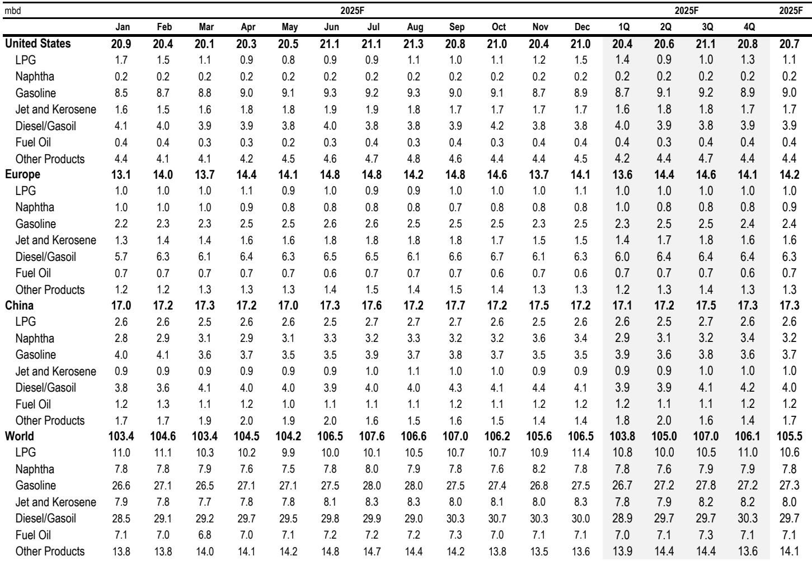
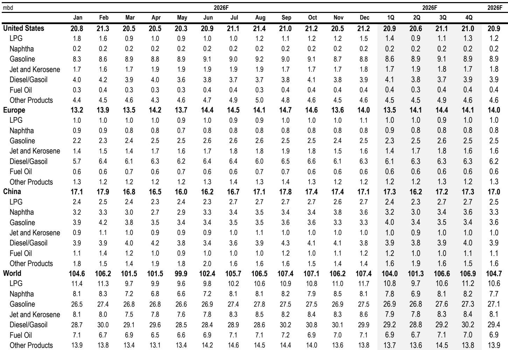
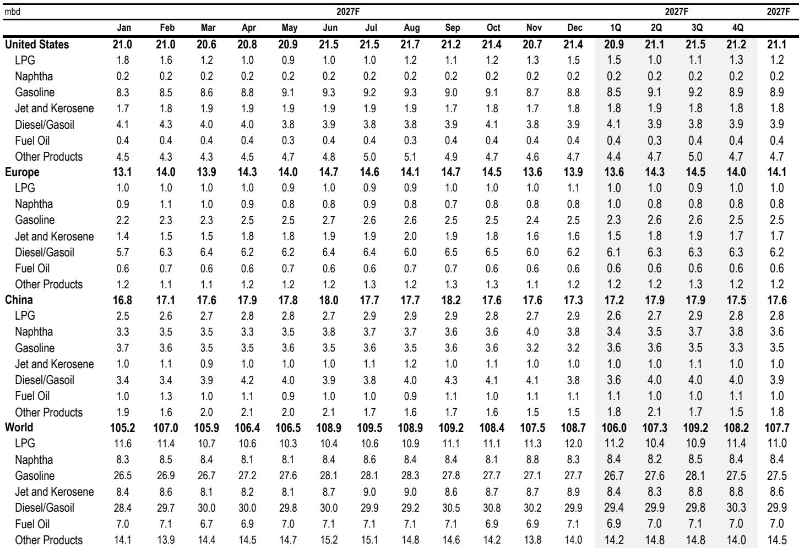

# JPM：市场低估的不是原油价格，而是美国西海岸成品油的结构性短缺

这份JPM最新发布的石油市场周报，标题意味深长——“The first thousand miles”（最初的一千英里）。它指向一个反直觉的事实：自冲突爆发以来，历史上最大的供应中断，却只带来了一个“平淡无奇”的价格图表。布伦特原油均价仅101美元，几乎完全贴合该行早在3月初就划定的价格路径。

市场普遍关注的是，为什么原油价格没有暴涨？但这份报告真正值得读的判断是：**市场已经通过需求损失和库存释放消化了供应冲击，但成品油市场的结构性紧张，尤其是美国西海岸，正在成为新的、更隐蔽的定价锚点。** 对于关注通胀、供应链和资产定价的决策者而言，真正需要跟踪的，不是布伦特能否站上120美元，而是加州每加仑5.89美元的汽油和7.16美元的柴油，如何通过物流成本传导至全美。

## 1. 报告自己推翻了3月的核心假设：成品油短缺并未发生，但“向下游转移”的逻辑失效了

3月初，JPM提出了一个精妙的框架：如果原油价格无法充分反映供应中断，那么调整一定会“向下游转移”——即原油价格维持100美元附近，但短缺会体现在汽油、柴油和航空煤油的裂解价差上。这个框架的第一部分（原油价格路径）被完美验证，但第二部分（成品油短缺）被证伪。

从2月27日至6月8日的数据来看，汽油、柴油和航空煤油价格在经历最初飙升后，已显著回落，炼油利润率不但没有扩大，反而收窄。这意味着，市场吸收冲击的机制比预想的更复杂：**需求损失（冲突区、亚洲、中国、非洲）和库存释放（政府和商业库存）共同作用，使得成品油市场并未出现极端短缺。** 这个“证伪”本身就是一个重要洞察：它告诉我们，全球石油市场的缓冲能力，至少在成品油层面，比许多模型假设的要强。

但这份报告紧接着揭示了一个更深层的结构性矛盾——全国平均数据掩盖了区域性的极端分化。

## 2. 美国西海岸的成品油市场，正在经历“独立于全球”的紧缩周期

当全国平均汽油价格约为4.16美元/加仑时，加州的价格是5.89美元，柴油价格更是达到7.16美元。这不是简单的运输成本差异，而是多重结构性因素叠加的结果。

首先，加州拥有全美最严格的环保法规（CARB标准），这意味着它无法轻易从相邻州获取成品油供应，必须依赖亚洲炼厂进口。但自3月1日以来，霍尔木兹海峡的供应中断导致许多亚洲炼厂被迫减少成品油出口。加州的汽油进口中，近三分之二来自亚洲，占全州汽油供应总量的20%至30%。这条供应链的断裂，直接推高了区域价格。

其次，加州本土炼油产能正在萎缩。Valero的Benicia炼厂和Phillips 66的洛杉矶炼厂相继关闭，合计占加州炼油产能的17%。在需求并未大幅下降的情况下，供给侧的收缩是刚性的。

**更深层的含义在于：美国西海岸不仅是加州的问题。** 全美约五分之一的进口货物通过洛杉矶港和长滩港进入。这些货物在运往全美各地仓库、配送中心和消费者之前，最初的数百甚至数千英里，都依赖西海岸的柴油和汽油。这意味着，美国供应链的“第一英里”成本，是由西海岸燃料价格决定的。加州7.16美元的柴油价格，会通过货运成本传导至全美商品价格。

## 3. 汽油和柴油面临截然不同的供需格局：一个靠进口缓解，一个因出口加剧

报告对汽油和柴油的细分分析，揭示了两种完全不同的定价逻辑。

汽油方面，5月的价格上涨已触发部分供给响应：部分炼厂从航空煤油转产汽油，加拿Daiwa西北欧的进口开始抵达东海岸。但这种再平衡可能只是暂时的。欧洲汽油市场本身紧张，随着夏季需求高峰到来，欧洲炼厂保留本地桶油的意愿会增强。如果美国汽油进口放缓，国内库存将维持在较低的季节性水平。

柴油的处境则更为严峻。美国柴油出口在1-2月平均为120万桶/日，比去年同期高出15万桶/日。冲突爆发后，出口进一步升至150万桶/日。背后的驱动因素包括：巴西对俄罗斯柴油的替代需求、欧洲对俄罗斯原油炼制品禁令的生效。结果是，美国柴油库存已降至23年来的最低点。**柴油不再是区域性市场，而是全球性短缺的“最后供应商”。**

航空煤油则处于中间状态。尽管需求强劲（夏季旅行、世界杯），但炼厂对航空煤油的高收率使得库存相对充裕。不过，报告也提示，多家航空公司已削减了第三季度的航班计划，这意味着需求端可能已经出现主动调整。

## 4. 报告尚未完全回答的关键问题：库存释放的可持续性与需求损失的规模

这份报告留下了一个悬而未决的核心问题：当前的市场平衡是可持续的吗？还是说，它依赖于一次性的库存释放和尚未被充分量化的需求损失？

报告指出，政府库存释放和商业库存消耗是吸收冲击的关键。但库存是有限的。如果霍尔木兹海峡的局势持续，库存释放的节奏能否维持？需求损失（尤其是亚洲和非洲）是永久性的结构变化，还是暂时性的价格响应？如果是后者，当价格回落时，需求可能迅速反弹，重新暴露供给缺口。

此外，报告对“中国消费者比预期更快地替代石油”这一判断，并没有展开具体分析。这种替代是电动汽车渗透率提升的结果，还是短期行为？如果是前者，它对全球石油需求的影响将是长期的。

## 5. 对决策者的观察框架：从跟踪原油价格转向跟踪成品油裂解价差和区域价差

基于这份报告的逻辑，我们认为投资者和企业决策者应该调整自己的观察框架。

第一，**放弃对布伦特原油绝对价格的过度关注**。JPM的预测显示，2026年余下时间布伦特原油均价将在100美元附近波动。但真正影响通胀预期和企业成本的，是成品油价格，尤其是柴油和汽油的裂解价差。

第二，**建立区域性价差追踪体系**。加州的汽油价格与全国平均价差、西海岸柴油与墨西哥湾沿岸柴油的价差，这些指标比原油期货更能反映供应链的真实压力。报告明确提到，加州的价格会通过物流成本传导至全美。

第三，**关注美国柴油出口的变化**。如果柴油库存继续下降至历史低位，而出口需求不减，那么柴油价格的飙升将成为下一个通胀风险点。报告中的图表显示，美国柴油库存已处于23年低点，而炼厂利用率仍然高企，这意味着供给弹性已经非常有限。

第四，**警惕“第一英里”成本对全美供应链的传导**。报告中的“最初一千英里”概念值得反复琢磨。西海岸的燃料成本，不仅仅是加州居民的问题，而是每个通过西海岸进口货物的企业都需要关注的风险。

## 6. 尚未被充分讨论的“二阶效应”：炼厂关闭的长期影响与政策应对的复杂性

报告提到了加州两家炼厂的关闭，但并未深入讨论这一趋势的长期影响。美国炼厂产能的净减少，叠加环保法规对新建产能的制约，意味着成品油供给的刚性正在增强。如果全球需求在未来几年出现周期性复苏，供给侧的瓶颈可能比市场预期的更严重。

另一个未被充分展开的话题是政策应对。加州政府是否会调整环保法规以缓解供应压力？联邦政府是否会动用战略石油储备中的成品油？这些政策选择将直接影响价格路径，但报告并未给出明确的预测。

这些未解问题，恰恰是深入理解当前石油市场定价逻辑的关键。我们将在社群中继续围绕这些议题展开讨论，包括对库存释放可持续性的量化分析、对全球炼厂产能动态的追踪，以及对区域价差与通胀传导的实证研究。

欢迎对能源市场、通胀和供应链有深入兴趣的读者，来我们的星球微信群继续讨论这些未解问题。

Personal reading notes and learning share only. Not investment advice.

