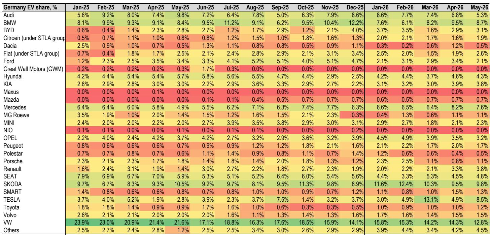
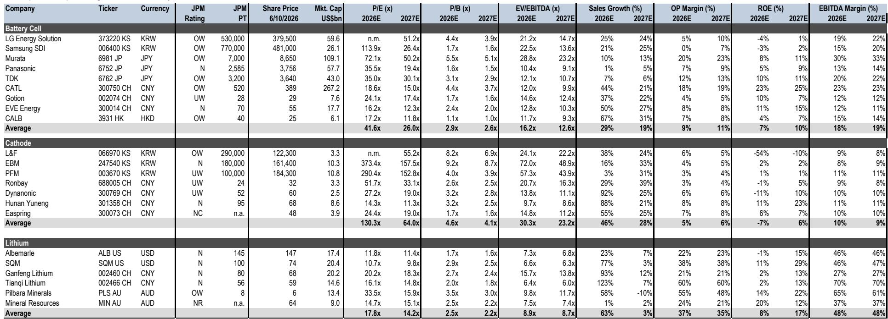
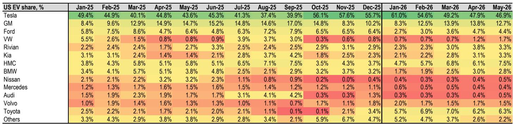

# The Global EV Market Is No Longer a Single Story: Three Diverging Trajectories Demand Three Distinct Strategies

The global electric vehicle market has entered a phase of structural divergence that renders any single-bet strategy obsolete. As of May 2026, EV and PHEV penetration across the three major markets tells three fundamentally different stories: Europe is accelerating on policy and product momentum, China is weathering a broader auto downturn with rising mix, and the United States is actively retreating. Meanwhile, energy storage systems have emerged as the clearest bright spot, with global shipments more than doubling year-over-year in the first four months of 2026. For investors and strategists, the implication is clear: the old framework of a uniform global EV adoption curve no longer applies. The new reality demands a region-specific, technology-selective, and vertically-aware portfolio approach.

This is not a cyclical pause. It is a structural realignment. The data from May 2026 reveals that combined EV and PHEV sales across the EU-5, the United States, and China reached 1.3 million units, down 2% year-over-year but up 10% month-over-month, with aggregate penetration at 35%. The headline number masks the real story. Europe's penetration surged to 32%, up 8 percentage points year-over-year, driven by every major market. China's penetration hit 63%, up 10 percentage points, even as total passenger vehicle sales collapsed 22% year-over-year. The United States, by contrast, saw penetration fall to 7%, down 2 percentage points, with EV sales declining 18% year-over-year. These are not temporary divergences. They reflect deep differences in policy, consumer preference, OEM strategy, and infrastructure readiness.

The strategic question is no longer whether electrification is happening. It is happening, but at different speeds and through different powertrain mixes in different regions. The winning portfolios will be those that align their exposure with these regional realities rather than betting on a uniform global trend.

## European Policy Momentum and Affordable Mass-Market EVs Are Creating a Self-Reinforcing Adoption Cycle That Is Unmatched in Other Regions

Europe's EV acceleration in May 2026 is not a one-off data point. It is the result of a confluence of structural forces that are likely to persist. Every EU-5 market recorded penetration gains year-over-year, with France leading at a 13-percentage-point increase, followed by Italy at 9 points, Germany at 8 points, the United Kingdom at 7 points, and Spain at 4 points. This broad-based strength is supported by two reinforcing factors: country-level subsidy schemes and the increasing availability of affordable mass-market EVs.

The policy environment is also becoming more supportive at the supranational level. The European Union recently introduced a 1.5 billion Euro Battery Booster Facility to support EV battery production within the European Economic Area, with first awards expected before the end of 2026. This is a direct signal that European policymakers are treating battery supply chain independence as a strategic priority, not just an environmental one. The implication for investors is that European battery supply chain stocks, particularly those with local production capacity, may benefit from a policy tailwind that is absent in other regions.

The second-order effect is equally important. As European EV penetration rises, the charging infrastructure becomes more economically viable, which in turn reduces range anxiety and further accelerates adoption. This creates a positive feedback loop that is difficult to disrupt. The question for investors is whether this momentum can be sustained if subsidy schemes are eventually phased out, but for now, the trajectory is clear and positive.

## China's EV Mix Is Rising Despite a Broader Auto Collapse, But the Earnings Driver Is Shifting From Volume to Mix and Overseas Exposure

China's May 2026 data presents a paradox that demands careful interpretation. Total passenger vehicle sales fell 22% year-over-year to 1.51 million units, yet new energy vehicle retail sales reached 0.95 million units, pushing NEV penetration to 63%. This is a 10-percentage-point increase year-over-year and a 1-percentage-point increase month-over-month. The absolute volume of NEV sales declined 7% year-over-year, but the mix gain is so dramatic that it tells a fundamentally different story from the headline volume number.

The key insight is that the Chinese auto market is undergoing a structural contraction in internal combustion engine vehicle demand, while NEV demand is holding up relatively better. This is not a sign of EV strength in absolute terms, but it is a sign of EV resilience in relative terms. The report notes that the China auto team has turned more cautious on domestic demand, revising 2026 retail forecasts from a 4% decline to a 15% decline year-over-year. However, the same team raised overseas sales forecasts for leading Chinese OEMs by approximately 15% to 30% after visiting Europe.

This divergence between domestic weakness and overseas strength is the critical strategic insight. Chinese OEMs are no longer just exporting cheap EVs. The report highlights that their overseas strategy has evolved beyond a single-powertrain, low-cost narrative into balanced powertrain portfolios, brand ladders, and technology stories. Chinese OEM market share in European NEV has reached 18%, tripling year-over-year, driven by retail execution moats and strong feature content bundled as standard. Localization is accelerating to mitigate tariff and regulatory risks.

For investors, the implication is that Chinese EV supply chain exposure should be evaluated not on domestic volume growth, but on the ability of individual companies to capture overseas market share and manage the mix shift. The earnings driver is moving from headline industry growth to NEV mix and overseas exposure. Companies that can execute on this dual strategy will outperform those that remain dependent on the domestic volume cycle.

## The United States Is Actively Retreating From EV Adoption, and the Structural Causes Are Not Likely to Reverse Quickly

The US EV market in May 2026 is not just weak; it is actively deteriorating. EV and PHEV sales volume fell 21% year-over-year, with penetration at 7%, down 2 percentage points year-over-year and flat month-over-month. EV demand alone declined 18% year-over-year, with penetration at approximately 6%. The report attributes this to fewer consumer choices as OEMs cancel new EV launches and pull back marketing.

This is a structural problem, not a cyclical one. US OEMs are responding to weak demand by reducing supply, which in turn further depresses demand by limiting consumer choice. This creates a negative feedback loop that is difficult to break without a significant policy or product catalyst. The current regulatory environment, including the ongoing effect of the OBBBA regulations, is also contributing to supply chain disruption. US-bound battery shipments are shifting from China to Korean and Japanese battery makers, which increases costs and complexity for US OEMs.

The strategic implication for investors is that US EV exposure should be treated with caution. The market is not at an inflection point; it is in a period of active contraction. Until there is clear evidence of a policy shift, a new wave of compelling product launches, or a significant improvement in charging infrastructure, the US EV market is likely to remain a drag on global EV growth. This has direct implications for battery supply chain stocks that are heavily exposed to US OEMs, as well as for lithium demand forecasts that assume US adoption will eventually catch up.

## Energy Storage Systems Are the Clear Structural Bright Spot, But the Market Is Misreading the Timing of Demand Inflection

The most underappreciated opportunity in the global battery market is energy storage systems. Global ESS shipments more than doubled year-over-year in the first four months of 2026, driven by China domestic demand and robust exports to regions outside the United States. This is not a niche story. It is a massive demand driver that is still in its early stages.

The report highlights a critical development: Siemens has partnered with NVIDIA and Fluence Energy to develop a reference power-and-controls architecture for AI data centers. Fluence has signed Master Supply Agreements with two hyperscalers, with first orders expected in the third quarter of 2026. These developments should alleviate market concerns about whether AI data centers need energy storage. The answer is increasingly clear: they do.

However, the market may be misreading the timing. Adoption appears slow on the surface, but the report argues that this is due to construction sequencing rather than a lack of demand. ESS installation occurs in the later stages of AI data center builds, and most large-scale projects are still in early construction phases. This means that the demand inflection for ESS is likely to occur in 2026 through 2027, not immediately. Investors who are waiting for visible demand acceleration may miss the window to position ahead of the curve.

An important distinction is that AI data center ESS is a distinct product category from utility-scale ESS. It requires rapid response, high power density, and frequent micro-cycling. This favors leading players with strong product quality and technical capabilities. The report favors CATL as the largest global ESS battery maker, and LGES and SDI as key beneficiaries of growing US ESS opportunities, given the ongoing sourcing shift away from Chinese suppliers for US-bound projects.

## What the Report Does Not Fully Answer: The Lithium Price Puzzle and the Sustainability of Chinese Overseas Margins

Despite the depth of the analysis, the report leaves several meaningful open questions that investors must grapple with. The most pressing is the lithium price outlook. The report downgrades SQM to Neutral, citing limited upside to lithium prices from current spot levels. The global lithium supply-demand balance still points to a deficit over the next couple of years, but several near-term headwinds are emerging, including a rebound in Chinese lithium inventories, pushback from battery players on elevated price levels, and a more cautious stance on Chinese EV sales.

The puzzle is this: if ESS demand remains strong and some lithium project delays in China are keeping the market tight, why is the upside limited? The report suggests that these factors are not enough to drive meaningful price appreciation, but does not fully explain the threshold at which the supply-demand balance would tip into a sustained price rally. Investors need to develop their own framework for assessing the sensitivity of lithium prices to ESS demand acceleration, Chinese EV sales trajectory, and project development timelines.

Another unresolved question is the sustainability of Chinese OEM margins in overseas markets. The report highlights that Chinese OEM market share in European NEV has tripled year-over-year to 18%, driven by retail execution and feature content. However, as localization accelerates to mitigate tariff and regulatory risks, the cost structure of Chinese OEMs in Europe will change. Will they be able to maintain their margin advantage as they shift from exporting to local production? The report does not provide a clear answer, and this will be a critical determinant of long-term profitability for Chinese EV supply chain stocks.

## A Decision Framework for Portfolio Positioning Across the Three Diverging Markets

For investors seeking to translate this analysis into actionable portfolio decisions, a three-dimensional framework is useful. The first dimension is regional exposure. Europe should be overweighted given its accelerating adoption cycle and supportive policy environment. China should be selectively overweighted, focusing on companies with strong overseas exposure and mix improvement rather than domestic volume growth. The United States should be underweighted until there is clear evidence of a structural turnaround.

The second dimension is subsector positioning within the battery supply chain. The report's stock performance data shows that cathodes have lagged the most, followed by anodes, separators, cell makers, and battery foil, while electrolytes have relatively outperformed. This suggests that the market is pricing in margin compression in the more commoditized segments of the supply chain. Investors should favor battery makers over materials producers, reflecting relative bargaining power and execution capability. Within materials, the preference should be for companies with differentiated technology and strong customer relationships.

The third dimension is the powertrain mix. The report makes clear that the global market is not moving uniformly toward pure battery electric vehicles. PHEV penetration is rising in Europe and remains significant in China. Korean auto OEMs are benefiting from increasing HEV mix. This means that investors should not assume that pure EV exposure is the only winning strategy. Companies with balanced powertrain portfolios, including hybrids and plug-in hybrids, may offer more resilient earnings in the current environment.

The framework can be summarized as follows: overweight Europe and selective China exposure, underweight the United States; favor battery makers over materials producers; and prefer companies with diversified powertrain exposure over pure EV plays. This is a framework that can be adjusted as the three regional trajectories evolve, but it provides a clear starting point for portfolio construction.

Join the community to read the full report and review the original charts.

*This article is for learning and discussion only and does not constitute investment advice.*

Personal reading notes and learning share only. Not investment advice.

