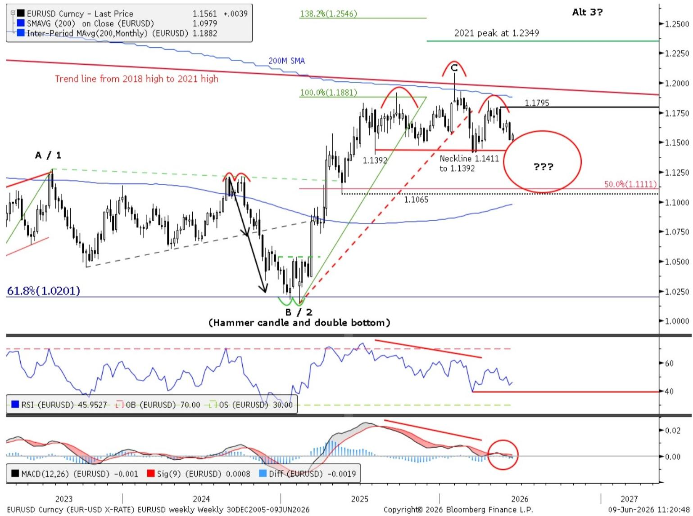
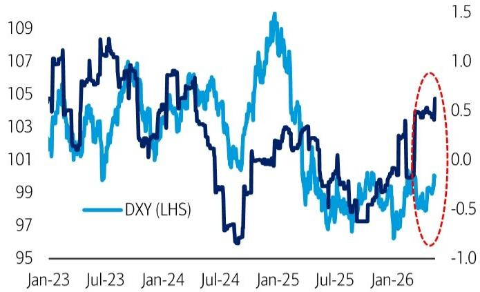
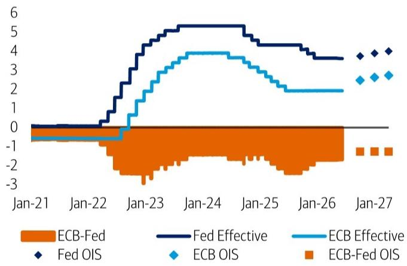
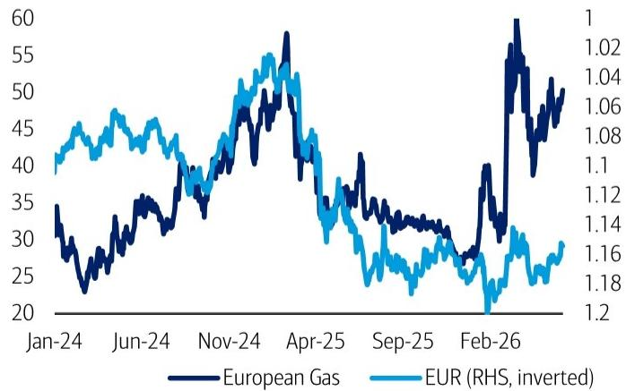
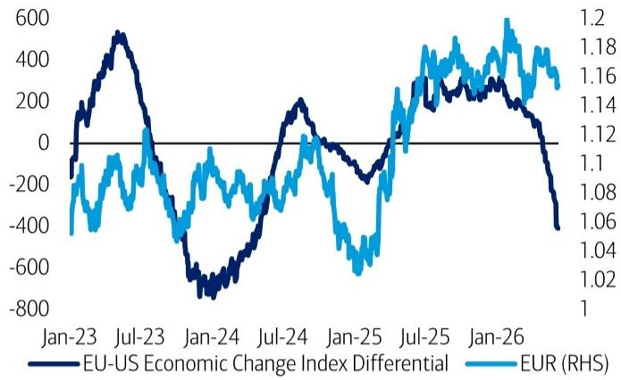
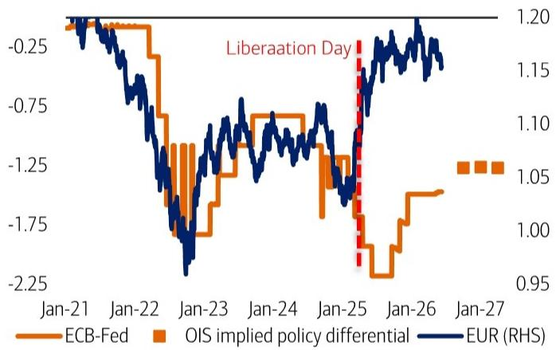
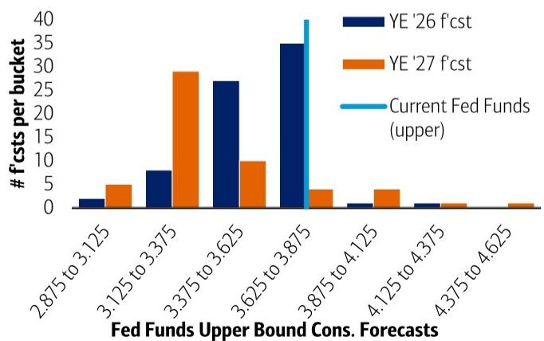

## Key takeaways

- On 20 May we went short euro via a 1.15-1.13 put spread. We remain short into summer: techs + fundamentals point to downside.  
- Technicals: Post NFP, euro broke trend line support. A head and shoulders top is still forming. And 2018 is still repeating.  
- Fundamentals: Relative data flow underpriced, amid growing risk to USD-supportive monetary policy repricing.

## View: Keep EURUSD shorts this summer

On May 20, we recommended positioning for euro weakness into summer via a EURUSD 1.15/1.13 3m put spread (spot 1.1610, vols 6.22%/6.72%) at a cost of 0.3591% (current: 0.47%). We remain short. See report: Six reasons to short euro 20 May 2026

## Technicals: Euro broke support, bias is to fade bounces

One immediate market response to the latest US payrolls release was a decline in euro, which broke an uptrend line and reinforced our bearish view. On June 8, euro tested the psychological 1.15 support level and has begun to bounce. We prefer to fade rebounds and continue to look for renewed downside. On the weekly chart, euro continues to form the right shoulder of a head and shoulders top, with neckline support at 1.1411–1.1392. A decisive break below this zone would materially increase downside risk.

Finally, DXY behaviour during President Trump's second term continues to track his first. In 2018, the second year of term one, DXY bottomed in the first half and rallied in the second. DXY is now attempting to base, with a daily close above 100.51 needed to confirm a renewed uptrend and continuing repeating 2018.

## Fundamentals: relative data vs. geopolitical wish-casting

There is a case to be made for EUR/USD to potentially trade through our Q2 forecast of 1.14, which is also just below its 12-month lows. The growth divergence between the US and EA is notable and arguably being underpriced by rates markets.

But hope for a peace agreement in the Middle East has prevented larger themes from taking hold. Even as there has been some associated reprieve in energy markets, upside risks points to downside risks to the EUR (from a terms-of-trade perspective). This suggests a real possibility of further USD supportive Fed repricing, while ECB hikes could prove counter-productive for the EUR.

In the meantime, the market will likely be in a more of a holding pattern as these next two weeks bring the May CPI report (this Wed) and the first FOMC under Chair Warsh (next Wed). Any hint of further upside pressure from the data, or a less assertive dovish tone from Chair Warsh could serve as the next (non-Iran related) catalyst for a USD rally.

Trading ideas and investment strategies discussed herein may give rise to significant risk and are not suitable for all investors. Investors should have experience in relevant markets and the financial resources to absorb any losses arising from applying these ideas or strategies.

BofA does and seeks to do business with issuers covered in its research reports. As a result, investors should be aware that the firm may have a conflict of interest that could affect the objectivity of this report. Investors should consider this report as only a single factor in making their investment decision.

Refer to important disclosures on page 8 to 10. Analyst Certification on page 7. 12982831

## 10 June 2026

G10 FX Strategy Global

## Alex Cohen, CFA

FX Strategist

BofAS

alex.cohen2@bofa.com

## Paul Ciana, CMT

Technical Strategist

BofAS

paul.ciana@bofa.com

## Michalis Rousakis

FX Strategist

MLI (UK)

michalis.rousakis@bofa.com

## Adarsh Sinha

FX and Rates Strategist

MLI (UK)

adarsh.sinha@bofa.com

For a list of open trade recommendations and trade recommendations closed in the last 12 months, please see the Global FX Weekly: A game of two halves report.

## Keep EUR shorts on this summer

## EURUSD: Bearish trend line breakdown

## Post strong US payroll data, euro broke trend line support

Following stronger-than-expected US payrolls data on June 5, EURUSD sold off sharply, breaking below trendline support and falling to its lowest level since early April. This breakdown reinforces our bearish bias.

On June 8, EURUSD tested 1.15 and has since started to bounce. In the near term, we view former support as resistance, beginning at 1.1576 (May 21 low) and extending up to the broken trendline near 1.16.

We continue to favor selling EUR into rallies, including the current bounce. Ideally, EURUSD does not post a daily close above the prior range resistances, which include the 50-day SMA, 200-day SMA, and downtrend line in the 1.1671–1.1685 area.

Chart 4: EURUSD bearish trend line breakdown, test of psychological support at 1.15, bounce to resistance should be faded.

Daily candles, 50d SMA, 200d SMA, Ichimoku Cloud RSI, MACD, Fibonacci levels

  
Source: BofA Global Research, Bloomberg  
BofA GLOBAL RESEARCH

## EURUSD: Head-and-shoulders top still forming

## Right shoulder of a head and shoulders top continues to form

Price action continues to suggest the right shoulder of a potential head-and-shoulders top is developing, leaving EURUSD vulnerable to a deeper pullback.

If this structure persists, EURUSD should retest the neckline at 1.1411–1.1392. A decisive break below this zone would confirm the topping pattern and open downside toward 1.11 and the rising 200-week moving average near 1.0980.

While the neckline has yet to break, we view the weeks of May 15 and June 5 as key bearish impulses contributing to the topping process. A subsequent, comparably strong bullish impulse in the coming weeks would reduce conviction in the head-and-shoulders scenario.

Chart 4: EURUSD still looks at risk of forming a head and shoulders top.  
Weekly candles, 50d SMA, 200d SMA, Ichimoku Cloud RSI, MACD, Fibonacci levels  

line chart

| Date       | EURUSD Curncy - Last Price | SMAVG (200) on Close (EURUSD) | Inter-Period MA Avg (200, Monthly) (EURUSD) |
|------------|---------------------------|-------------------------------|---------------------------------------------|
| 2023       | ~1.1561                   | +0.0039                       | ~1.1882                                     |
| 2024       | ~1.1392                   | ~1.0979                       | ~1.1882                                     |
| 2025       | ~1.1795                   | ~1.1881                       | ~1.1882                                     |
| 2026       | ~1.1411 to 1.1392         | ~1.1392                       | ~1.1882                                     |
| 2027       | ~1.1795                   | ~1.1392                       | ~1.1882                                     |
| 2021 peak   | 1.2349                    | —                             | —                                           |
| 61.8%      | —                         | —                             | —                                           |
| (Hammer candle and double bottom) | —                     | —                             | —                                           |
| RSI        | 45.9527                   | —                             | —                                           |
| OB         | 70.00                     | —                             | —                                           |
| OS         | 30.00                     | —                             | —                                           |
| Diff       | -0.0019                   | —                             | —                                           |
| MACD       | -0.001                    | —                             | —                                           |
| Sig(9)     | 0.0008                    | —                             | —                                           |
| Difference | -0.0019                   | —                             | —                                           |

Source: BofA Global Research, Bloomberg

BofA GLOBAL RESEARCH

## DXY in 2024-2026 has been repeating 2016-2018

## If the DXY continues to repeat Trump's term 1 trend, the DXY rallies in 2H26.

DXY price action continues to closely mirror the 2016–2018 post-election cycle, suggesting further upside risk if the pattern holds. We're on watch for a daily close above 100.51 to confirm a repeat bottom rhyming with 2018 and further upside. This would be the highest daily close since May 2025, eclipsing that of March 30, 2026.

Following the November 2016 election, DXY broke out of a multi-year range and rallied \~6.4%, before forming a head-and-shoulders top and declining through 2017. The index then bottomed in 1Q18, broke higher in late April, and went on to rally a further \~6.6% into August 2018.

A similar sequence has unfolded after the November 2024 election, DXY broke out and rallied \~6.3%, then formed a top and declined through 2025. In 1Q26, DXY established a key low and has begun to base.

If this analogue continues to hold, a confirmed breakout from the current base would point to a renewed USD uptrend, with potential for DXY to rally toward 103–105 in the coming months.

Chart 5: Below we compare the DXY trend in 2016 through 2018 vs 2024 through today. They are tracking closely and, if they continue to, the DXY will soon bottom and rally this summer and euro will decline.

Daily line chart of closing prices. Top panel is 2016-2018, bottom is 2024-2026.

line chart

| Election Day | ~94.000 | - | 50.0% |
| --- | --- | --- | --- |
| Election Day | ~94.000 | - | 50.0% |
| Election Day | ~94.000 | - | 50.0% |
| Election Day | ~94.000 | - | 50.0% |
| Election Day (Dec 12/31/16) | ~111.000 | +6.32% | - |
| Election Day (Dec 12/31/17) | ~111.000 | 61.8% | - |
| Election Day (Dec 12/31/18) | ~111.000 | 50.0% | - |
| Election Day (Dec 12/31/19) | ~111.000 | - | - |
| Election Day (Dec 12/31/25) | ~111.000 | - | - |
| Election Day (Dec 12/31/26) | ~111.000 | - | - |
| Election Day (Dec 12/31/27) | ~111.000 | - | - |
| Election Day (Dec 12/31/28) | ~111.000 | - | - |
| Election Day (Dec 12/31/29) | ~111.000 | - | - |
| Election Day (Dec 12/31/3) | ~111.000 | - | - |
| Election Day (Dec 12/31/31) | ~111.000 | - | - |
| Election Day (Dec 12/31/32) | ~111.000 | - | - |
| Election Day (Dec 12/31/33) | ~111.000 | - | - |
| Election Day (Dec 12/31/34) | ~111.000 | - | - |
| Election Day (Dec 12/31/35) | ~111.000 | - | - |
| Election Day (Dec 12/31/36) | ~111.000 | - | - |
| Election Day (Dec 12/31/37) | ~111.000 | - | - |
| Election Day (Dec 12/31/38) | ~111.000 | - | - |
| Election Day (Dec 12/31/39) | ~111.000 | - | - |
| Election Day (Dec 12/31/4) | ~111.000 | - | - |
| Election Day (Dec 12/31/42) | ~111.000 | - | - |
| Election Day (Dec 12/31/43) | ~111.000 | - | - |
| Election Day (Dec 12/31/44) | ~111.000 | - | - |
| Election Day (Dec 12/31/45) | ~111.000 | - | - |
| Election Day (Dec 12/31/46) | ~111.000 | - | - |
| Election Day (Dec 12/31/47) | ~111.000 | - | - |
| Election Day (Dec 12/31/48) | ~111.000 | - | - |
| Election Day (Dec 12/31/49) | ~111.000 | - | - |
| Election Day (Dec 12/31/5) | ~97.676 | +6.57% | 67% |
| Election Day (Dec 12/31/52) | ~97.676 | +6.57% | 67% |
| Election Day (Dec 12/31/53) | ~97.676 | +6.57% | 67% |
| Election Day (Dec 12/31/54) | ~97.676 | +6.57% | 67% |
| Election Day (Dec 12/31/55) | ~97.676 | +6.57% | 67% |
| Election Day (Dec 12/31/56) | ~97.676 | +6.57% | 67% |
| Election Day (Dec 12/31/57) | ~97.676 | +6.57% | 67% |
| Election Day (Dec 12/31/58) | ~97.676 | +6.57% | 67% |
| Election Day (Dec 12/31/59) | ~97.676 | +6.57% | 67% |
| Election Day (Dec 12/31/6) | ~97.676 | +6.57% | 67% |
| Election Day (Dec 12/31/62) | ~97.676 | +6.57% | 67% |
| Election Day (Dec 12/31/63) | ~97.676 | +6.57% | 67% |
| Election Day (Dec 12/31/64) | ~97.676 | +6.57% | 67% |
| Election Day (Dec 12/31/65) | ~97.676 | +6.57% | 67% |
| Election Day (Dec 12/31/66) | ~97.676 | +6.57% | 67% |
| Election Day (Dec 12/31/67) | ~97.676 | +6.57% | 67% |
| Election Day (Dec 12/31/68) | ~97.676 | +6.57% | 67% |

Source: BofA Global Research, Bloomberg  
BofA GLOBAL RESEARCH

## Fundamentals: Relative data vs. geopolitical wish-casting

As the EUR/USD's mostly narrow 12-month range has endured even though the start of the Iran war, relative economic data performance has continued to shift in the USD's favor (Exhibit 2). This was reinforced last Friday, by the US employment report, which served as the latest example of a resilient (if not strengthening) labor market, serving to push the pair towards the post-April ceasefire lows (Exhibit 1, see report: Rates & FX: World Cup, labor, markets 08 June 2026).

Still, this comes against a backdrop of continued hope for an eventual peace agreement, which has prevented the market from more materially trading off growth and/or rate differentials. And even as anticipations mount for an eventual resolution to the Iran war, the Strait of Hormuz remains closed, keeping energy prices elevated (albeit well past peak for now). Energy inventory issues will likely persist well after any hypothetical agreement is reached. In Europe, the rise in gas prices – while quite small compared to that of 2022 – remains a source of stagflationary concern. (Exhibit 5)

## Talk of Fed hikes getting louder, while durability of ECB hikes in question

At the onset of the war, the market was quick to price the ECB (and several other G10 central banks) for eventual hikes to address the global inflation shock. At the same time, entrenched expectations for a more structurally dovish Fed prevented such an assertive adjustment in the US rates. Data flow on both sides of the Fed's mandate has started to change this.

Yet the market remains priced for even more hikes by the ECB, which for now has also mitigated a correction lower in the pair. (Exhibit 3; Exhibit 4) But given a more anemic growth backdrop, this isn't necessarily a bullish sign for the EUR, as eventual ECB tightening could be short-lived, and/or risk a policy mistake (see report: Global FX weekly: A game of two halves 05 June 2026).

At the same time, even if the market is right to expect Chair Warsh to resist hikes, the Fed's hand could easily be forced by a combination of ongoing inflationary pressure, further labor improvement and broader easing of financial conditions (ie. resilient equities). While markets reflect some likelihood of a hike this year, the vast majority of Fed forecasters (in Bloomberg) have yet to call for any (Exhibit 6).

## (Fundamental) bottom line

Fundamentally, there is a case to be made for the EUR/USD pair to at least trade through our Q2 forecast of 1.14, which is also just below its 12-month lows. The growth divergence between the US and EA is notable, and arguably being underpriced by rates markets.

But hope for a peace agreement in the Middle East has prevented larger themes from taking hold. Even as there has been some associated reprieve in energy markets, upside risks point to downside risks to the EUR (from a terms-of-trade perspective). This suggests a real possibility of further USD supportive Fed repricing, while ECB hikes could prove counter-productive for the EUR.

In the meantime, the market will likely be in a more of a holding pattern as the next two weeks bring the May CPI report (this Wed) and the first FOMC under Chair Warsh (next Wed). Any hint of further upside pressure from the data, or a less assertive dovish tone from Chair Warsh could serve as the next (non-Iran related) catalyst for a dollar rally.

Exhibit 1: USD still trading within its previous 12m range, while labor surprise measures reach fresh multi-year highs  
DXY & Bloomberg US Labor Surprise Index  

line chart

| Date   | DXY (LHS) |
|--------|-----------|
| Jan-23 | 107       |
| Jul-23 | 108       |
| Jan-24 | 106       |
| Jul-24 | 105       |
| Jan-25 | 109       |
| Jul-25 | 103       |
| Jan-26 | 104       |

Source: Bloomberg; BofA Global Research  
BofA GLOBAL RESEARCH

Exhibit 3: Policy differentials now priced for modest but steady narrowing (towards EUR)...  
Fed & ECB policy rate  

line chart

| Date   | ECB-Fed | Fed Effective | ECB Effective | ECB-OIS | ECB-OIS | ECB-Fed OIS |
|--------|---------|---------------|---------------|---------|---------|-------------|
| Jan-21 | -1.0    | 0.0           | 0.0           | 0.0     | 0.0     | 0.0         |
| Jan-22 | -1.0    | 0.0           | 0.0           | 0.0     | 0.0     | 0.0         |
| Jan-23 | -2.0    | 4.0           | 2.0           | 0.0     | 0.0     | 0.0         |
| Jan-24 | -1.5    | 5.5           | 4.0           | 0.0     | 0.0     | 0.0         |
| Jan-25 | -1.5    | 5.5           | 3.5           | 0.0     | 0.0     | 0.0         |
| Jan-26 | -1.5    | 4.5           | 2.0           | 3.5     | 2.5     | 0.0         |
| Jan-27 | -1.5    | 3.5           | 2.0           | 4.0     | 3.0     | 1.0         |

Source: Bloomberg; BofA Global Research  
BofA GLOBAL RESEARCH

Exhibit 5: Since the closure of the Strait of Hormuz, the EUR has remained resilient relative to the upward pressure on gas prices  
European Gas (TZT) & EUR (inverted)  

line chart

| Date    | European Gas | EUR (RHS, inverted) |
|---------|--------------|---------------------|
| Jan-24  | 35           | 40                  |
| Jun-24  | 30           | 45                  |
| Nov-24  | 40           | 50                  |
| Apr-25  | 55           | 55                  |
| Sep-25  | 30           | 25                  |
| Feb-26  | 40           | 1.0                 |

Source: Bloomberg; BofA Global Research  
BofA GLOBAL RESEARCH

Exhibit 2: Relative US vs. Euro area data trends have been stark, suggesting further space for the EUR to depreciate further  
Economic Change Indices: EA - USA  

line chart

| Date   | EU-US Economic Change Index Differential | EUR (RHS) |
|--------|------------------------------------------|-----------|
| Jan-23 | -200                                     | 1.0       |
| Jul-23 | 500                                      | 1.1       |
| Jan-24 | -700                                     | 1.08      |
| Jul-24 | 200                                      | 1.14      |
| Jan-25 | -200                                     | 1.06      |
| Jul-25 | 300                                      | 1.16      |
| Jan-26 | -400                                     | 1.2       |

Source: Bloomberg; BofA Global Research  
BofA GLOBAL RESEARCH

Exhibit 4: ... Yet post-“Liberation Day” structural break between FX and policy rates has continued  
ECB-Fed policy differential (and OIS Implied) vs. EUR  

line chart

| Date    | ECB-Fed | OIS implied policy differential | EUR (RHS) |
|---------|---------|----------------------------------|-----------|
| Jan-21  | -0.25   | -0.25                            | -0.25     |
| Jan-22  | -0.75   | -0.75                            | -0.75     |
| Jan-23  | -1.25   | -1.25                            | -1.25     |
| Jan-24  | -1.75   | -1.75                            | -1.75     |
| Jan-25  | -2.25   | -2.25                            | -2.25     |
| Jan-26  | -0.75   | -0.75                            | -0.75     |
| Jan-27  | 1.00    | 1.00                             | 1.00      |

Source: Bloomberg; BofA Global Research  
BofA GLOBAL RESEARCH

Exhibit 6: Vast majority of Fed forecasters have still been reluctant to call for hikes in 2026 or 2027  
Histogram of YE '26 and YE '27 Fed funds forecasts  

bar chart

Fed Funds Upper Bound Cons. Forecasts
| Forecast | YE '26 f'cst | YE '27 f'cst | Current Fed Funds (upper) |
| :--- | :--- | :--- | :--- |
| 2.875 to 3.125 | 1.5 | 4.5 | |
| 3.125 to 3.375 | 7.5 | 29.0 | |
| 3.375 to 3.625 | 26.5 | 9.5 | |
| 3.625 to 3.875 | 35.0 | 3.5 | 40.0 |
| 3.875 to 4.125 | 0.8 | 3.5 | |
| 4.125 to 4.375 | 0.8 | 0.8 | |
| 4.375 to 4.625 | 0.0 | 0.8 | |

Source: Bloomberg; BofA Global Research  
BofA GLOBAL RESEARCH

## Options Risk Statement

Potential Risk at Expiry & Options Limited Duration Risk

Unlike owning or shorting a stock, employing any listed options strategy is by definition governed by a finite duration. The most severe risks associated with general options trading are total loss of capital invested and delivery/assignment risk... all of which can occur in a short period.

## Investor suitability

The use of standardized options and other related derivatives instruments are considered unsuitable for many investors. Investors considering such strategies are encouraged to become familiar with the "Characteristics and Risks of Standardized Options" (an OCC authored white paper on options risks). U.S. investors should consult with a FINRA Registered Options Principal.

For detailed information regarding the risks involved with investing in listed options, see the Options Clearing Corporation's Characteristics and Risks of Standardized Options website.

## Analyst Certification

I, Paul Ciana, CMT, hereby certify that the views expressed in this research report accurately reflect my personal views about the subject securities and issuers. I also certify that no part of my compensation was, is, or will be, directly or indirectly, related to the specific recommendations or view expressed in this research report.

## Disclosures

## Important Disclosures

Due to the nature of the market for derivative securities, the issuers or securities recommended or discussed in this report are not continuously followed. Accordingly, investors must regard this report as providing stand-alone analysis and should not expect continuing analysis or additional reports relating to such issuers and/or securities.

Due to the nature of strategic analysis, the issuers or securities recommended or discussed in this report are not continuously followed. Accordingly, investors must regard this report as providing stand-alone analysis and should not expect continuing analysis or additional reports relating to such issuers and/or securities.

Due to the nature of technical analysis, the issuers or securities recommended or discussed in this report are not continuously followed. Accordingly, investors must regard this report as providing stand-alone analysis and should not expect continuing analysis or additional reports relating to such issuers and/or securities.

BofA Global Research personnel (including the analyst(s) responsible for this report) receive compensation based upon, among other factors, the overall profitability of BofA Corporation, including profits derived from investment banking. The analyst(s) responsible for this report may also receive compensation based upon, among other factors, the overall profitability of the Bank's sales and trading businesses relating to the class of securities or financial instruments for which such analyst is responsible.

BofA fixed income analysts regularly interact with sales and trading desk personnel in connection with their research, including to ascertain pricing and liquidity in the fixed income markets.

## Other Important Disclosures

Prices are indicative and for information purposes only. Except as otherwise stated in the report, for any recommendation in relation to an equity security, the price referenced is the publicly traded price of the security as of close of business on the day prior to the date of the report or, if the report is published during intraday trading, the price referenced is indicative of the traded price as of the date and time of the report and in relation to a debt security (including equity preferred and CDS), prices are indicative as of the date and time of the report and are from various sources including BofA trading desks.

The date and time of completion of the production of any recommendation in this report shall be the date and time of dissemination of this report as recorded in the report timestamp.

Recipients who are not institutional investors or market professionals should seek the advice of their independent financial advisor before considering information in this report in connection with any investment decision, or for a necessary explanation of its contents.

Officers of BofAS or one or more of its affiliates (other than research analysts) may have a financial interest in securities of the issuer(s) or in related investments.

Refer to BofA Global Research policies relating to conflicts of interest.

"BofA" includes BofA, Inc. ("BofAS") and its affiliates. Investors should contact their BofA representative or Merrill Global Wealth Management financial advisor if they have questions concerning this report or concerning the appropriateness of any investment idea described herein for such investor. "BofA" is a global brand for BofA Global Research.

Information relating to Non-US affiliates of BofA and Distribution of Affiliate Research Reports:

BofAS and/or BofA, Pierce, Fenner & Smith Incorporated ("MLPF&S") may in the future distribute, information of the following non-US affiliates in the US (short name: legal name, regulator): BofA (South Africa): BofA South Africa (Pty) Ltd., regulated by the Financial Sector Conduct Authority; MLI (UK): BofA International, regulated by the Financial Conduct Authority (FCA) and the Prudential Regulation Authority (PRA); BofASE (France): BofA Europe SA is authorized by the Autorité de Contrôle Prudentiel et de Résolution (ACPR) and regulated by the ACPR and the Autorité des Marchés Financiers (AMF). BofA Europe SA ("BofASE") with registered address at 51, rue La Boétie, 75008 Paris is registered under no 842 602 690 RCS Paris. In accordance with the provisions of French Code Monétaire et Financier (Monetary and Financial Code), BofASE is an établissement de crédit et d'investissement (credit and investment institution) that is authorised and supervised by the European Central Bank and the Autorité de Contrôle Prudentiel et de Résolution (ACPR) and regulated by the ACPR and the Autorité des Marchés Financiers. BofASE's share capital can be found at www.bofaml.com/BofASDisclaimer; BofA Europe (Milan): BofA Europe Designated Activity Company, Milan Branch, regulated by the Bank of Italy, the European Central Bank (ECB) and the Central Bank of Ireland (CBI); BofA Europe (Frankfurt): BofA Europe Designated Activity Company, Frankfurt Branch regulated by BaFin, the ECB and the CBI; BofA Europe (Zurich): BofA Europe Designated Activity Company, Zurich Branch, regulated by the Swiss Financial Market Supervisory Authority FINMA, the ECB and CBI; BofA Europe (Madrid): BofA Europe Designated Activity Company, Sucursal en España, regulated by the Bank of Spain, the ECB and the CBI; BofA (Australia): BofA Equities (Australia) Limited, regulated by the Australian Securities and Investments Commission; BofA (Hong Kong): BofA (Asia Pacific) Limited, regulated by the Hong Kong Securities and Futures Commission (HKSFC); BofA (Singapore): BofA (Singapore) Pte Ltd, regulated by the Monetary Authority of Singapore (MAS); BofA (Canada): BofA Canada Inc, regulated by the Canadian Investment Regulatory Organization; BofA (Mexico): BofA Mexico, SA de CV, Casa de Bolsa, regulated by the Comisión Nacional Bancaria y de Valores; BofAS Japan: BofA Japan Co., Ltd., regulated by the Financial Services Agency; BofA (Seoul): BofA International, LLC Seoul Branch, regulated by the Financial Supervisory Service; BofA (Taiwan): BofA (Taiwan) Ltd., regulated by the Securities and Futures Bureau; BofAS India: BofA India Limited, regulated by the Securities and Exchange Board of India (SEBI); BofA (Israel): BofA Israel Limited, regulated by Israel Securities Authority; BofA (DIFC): BofA International (DIFC Branch), regulated by the Dubai Financial Services Authority (DFSA); BofA (Brazil): BofA S.A. Corretora de Títulos e Valores Mobiliários, regulated by Comissão de Valores Mobiliários; BofA KSA Company: BofA Kingdom of Saudi Arabia Company, regulated by the Capital Market Authority. This information: has been approved for publication and is distributed in the United Kingdom (UK) to professional clients and eligible counterparties (as each is defined in the rules of the FCA and the PRA) by MLI (UK), which is authorized by the PRA and regulated by the FCA and the PRA - details about the extent of our regulation by the FCA and PRA are available from us on request; has been approved for publication and is distributed in the European Economic Area (EEA) by BofASE (France), which is authorized by the ACPR and regulated by the ACPR and the AMF; has been considered and distributed in Japan by BofAS Japan, a registered securities dealer under the Financial Instruments and Exchange Act in Japan, or its permitted affiliates; is issued and distributed in Hong Kong by BofA (Hong Kong) which is regulated by HKSFC; is issued and distributed in Taiwan by BofA (Taiwan); is issued and distributed in India by BofAS India; and is issued and distributed in Singapore to institutional investors and/or accredited investors (each as defined under the Financial Advisers Regulations) by BofA (Singapore) (Company Registration No 198602883D). BofA (Singapore) is regulated by MAS. BofA Equities (Australia) Limited (ABN 65 006 276 795), AFS License 235132 (MLEA) distributes this information in Australia only to 'Wholesale' clients as defined by s.761G of the Corporations Act 2001. With the exception of BofA N.A., Australia Branch, neither MLEA nor any of its affiliates involved in preparing this information is an Authorised Deposit-Taking Institution under the Banking Act 1959 nor regulated by the Australian Prudential Regulation Authority. No approval is required for publication or distribution of this information in Brazil and its local distribution is by BofA (Brazil) in accordance with applicable regulations. BofA (DIFC) is authorized and regulated by the DFSA. Information prepared and issued by BofA (DIFC) is done so in accordance with the requirements of the DFSA conduct of business rules. BofA Europe (Frankfurt) distributes this information in Germany and is regulated by BaFin, the ECB and the CBI. BofA entities, including BofA Europe and BofASE (France), may outsource/delegate the marketing and/or provision of certain research services or aspects of research services to other branches or members of the BofA group. You may be contacted by a different BofA entity acting for and on behalf of your service provider where permitted by applicable law. This does not change your service provider. Please refer to the Electronic Communications Disclaimers for further information.

This information has been prepared and issued by BofAS and/or one or more of its non-US affiliates. The author(s) of this information may not be licensed to carry on regulated activities in your jurisdiction and, if not licensed, do not hold themselves out as being able to do so. BofAS and/or MLPF&S is the distributor of this information in the US and accepts full responsibility for information distributed to BofAS and/or MLPF&S clients in the US by its non-US affiliates. Any US person receiving this information and wishing to effect any transaction in any security discussed herein should do so through BofAS and/or MLPF&S and not such foreign affiliates. Hong Kong recipients of this information should contact BofA (Asia Pacific) Limited in respect of any matters relating to dealing in securities or provision of specific advice on securities or any other matters arising from, or in connection with, this information. Singapore recipients of this information should contact BofA (Singapore) Pte Ltd in respect of any matters arising from, or in connection with, this information. For clients that are not accredited investors, expert investors or institutional investors BofA (Singapore) Pte Ltd accepts full responsibility for the contents of this information distributed to such clients in Singapore.

## General Investment Related Disclosures:

Taiwan Readers: Neither the information nor any opinion expressed herein constitutes an offer or a solicitation of an offer to transact in any securities or other financial instrument. No part of this report may be used or reproduced or quoted in any manner whatsoever in Taiwan by the press or any other person without the express written consent of BofA.

This document provides general information only, and has been prepared for, and is intended for general distribution to, BofA clients. Neither the information nor any opinion expressed constitutes an offer or an invitation to make an offer, to buy or sell any securities or other financial instrument or any derivative related to such securities or instruments (e.g., options, futures, warrants, and contracts for differences). This document is not intended to provide personal investment advice and it does not take into account the specific investment objectives, financial situation and the particular needs of, and is not directed to, any specific person(s). This document and its content do not constitute, and should not be considered to constitute, investment advice for purposes of ERISA, the US tax code, the Investment Advisers Act or otherwise. Investors should seek financial advice regarding the appropriateness of investing in financial instruments and implementing investment strategies discussed or recommended in this document and should understand that statements regarding future prospects may not be realized. Any decision to purchase or subscribe for securities in any offering must be based solely on existing public information on such security or the information in the prospectus or other offering document issued in connection with such offering, and not on this document.

Securities and other financial instruments referred to herein, or recommended, offered or sold by BofA, are not insured by the Federal Deposit Insurance Corporation and are not deposits or other obligations of any insured depository institution (including, BofA, N.A.). Investments in general and, derivatives, in particular, involve numerous risks, including, among others, market risk, counterparty default risk and liquidity risk. No security, financial instrument or derivative is suitable for all investors. Digital assets are extremely speculative, volatile and are largely unregulated. In some cases, securities and other financial instruments may be difficult to value or sell and reliable information about the value or risks related to the security or financial instrument may be difficult to obtain. Investors should note that income from such securities and other financial instruments, if any, may fluctuate and that price or value of such securities and instruments may rise or fall and, in some cases, investors may lose their entire principal investment. Past performance is not necessarily a guide to future performance. Levels and basis for taxation may change.

Futures and options are not appropriate for all investors. Such financial instruments may expire worthless. Before investing in futures or options, clients must receive the appropriate risk disclosure documents. Investment strategies explained in this report may not be appropriate at all times. Costs of such strategies do not include commission or margin expenses.

BofA is aware that the implementation of the ideas expressed in this report may depend upon an investor's ability to "short" securities or other financial instruments and that such action may be limited by regulations prohibiting or restricting "shortselling" in many jurisdictions. Investors are urged to seek advice regarding the applicability of such regulations prior to executing any short idea contained in this report.

Foreign currency rates of exchange may adversely affect the value, price or income of any security or financial instrument mentioned in this report. Investors in such securities and instruments effectively assume currency risk.

BofAS or one of its affiliates is a regular issuer of traded financial instruments linked to securities that may have been recommended in this report. BofAS or one of its affiliates may, at any time, hold a trading position (long or short) in the securities and financial instruments discussed in this report.

BofA, through business units other than BofA Global Research, may have issued and may in the future issue trading ideas or recommendations that are inconsistent with, and reach different conclusions from, the information presented herein. Such ideas or recommendations may reflect different time frames, assumptions, views and analytical methods of the persons who prepared them, and BofA is under no obligation to ensure that such other trading ideas or recommendations are brought to the attention of any recipient of this information. In the event that the recipient received this information pursuant to a contract between the recipient and BofAS for the provision of research services for a separate fee, and in connection therewith BofAS may be deemed to be acting as an investment adviser, such status relates, if at all, solely to the person with whom BofAS has contracted directly and does not extend beyond the delivery of this report (unless otherwise agreed specifically in writing by BofAS). If such recipient uses the services of BofAS in connection with the sale or purchase of a security referred to herein, BofAS may act as principal for its own account or as agent for another person. BofAS is and continues to act solely as a broker-dealer in connection with the execution of any transactions, including transactions in any securities referred to herein.

## Copyright and General Information:

Copyright 2026 BofA Corporation. All rights reserved. iQdatabase® is a registered service mark of BofA Corporation. This information is prepared for the use of BofA clients and may not be redistributed, retransmitted or disclosed, in whole or in part, or in any form or manner, without the express written consent of BofA. This document and its content is provided solely for informational purposes and cannot be used for training or developing artificial intelligence (AI) models or as an input in any AI application (collectively, an AI tool). Any attempt to utilize this document or any of its content in connection with an AI tool without explicit written permission from BofA Global Research is strictly prohibited. BofA Global Research utilizes AI, including machine learning and other technologies, to enhance the services we provide to our clients. These technologies assist our analysts in various aspects of their work, including but not limited to data analysis, content extraction, content creation, data aggregation and summarization and identifying relevant information from diverse sources. All AI-driven processes are subject to review by BofA Global Research employees. BofA Global Research information is distributed simultaneously to internal and client websites and other portals by BofA and is not publicly-available material. Any unauthorized use or disclosure is prohibited. Receipt and review of this information constitutes your agreement not to redistribute, retransmit, or disclose to others the contents, opinions, conclusion, or information contained herein (including any investment recommendations, estimates or price targets) without first obtaining express permission from an authorized officer of BofA.

Materials prepared by BofA Global Research personnel are based on public information. Facts and views presented in this material have not been reviewed by, and may not reflect information known to, professionals in other business areas of BofA, including investment banking personnel. BofA has established information barriers between BofA Global Research and certain business groups. As a result, BofA does not disclose certain client relationships with, or compensation received from, such issuers. To the extent this material discusses any legal proceeding or issues, it has not been prepared as nor is it intended to express any legal conclusion, opinion or advice. Investors should consult their own legal advisers as to issues of law relating to the subject matter of this material. BofA Global Research personnel's knowledge of legal proceedings in which any BofA entity and/or its directors, officers and employees may be plaintiffs, defendants, co-defendants or co-plaintiffs with or involving issuers mentioned in this material is based on public information. Facts and views presented in this material that relate to any such proceedings have not been reviewed by, discussed with, and may not reflect information known to, professionals in other business areas of BofA in connection with the legal proceedings or matters relevant to such proceedings.

This information has been prepared independently of any issuer of securities mentioned herein and not in connection with any proposed offering of securities or as agent of any issuer of any securities. None of BofAS any of its affiliates or their research analysts has any authority whatsoever to make any representation or warranty on behalf of the issuer(s). BofA Global Research policy prohibits research personnel from disclosing a recommendation, investment rating, or investment thesis for review by an issuer prior to the publication of a research report containing such rating, recommendation or investment thesis.

Any information relating to sustainability in this material is limited as discussed herein and is not intended to provide a comprehensive view on any sustainability claim with respect to any issuer or security.

Any information relating to the tax status of financial instruments discussed herein is not intended to provide tax advice or to be used by anyone to provide tax advice. Investors are urged to seek tax advice based on their particular circumstances from an independent tax professional.

The information herein (other than disclosure information relating to BofA and its affiliates) was obtained from various sources and we do not guarantee its accuracy. This information may contain links to third-party websites. BofA is not responsible for the content of any third-party website or any linked content contained in a third-party website. Content contained on such third-party websites is not part of this information and is not incorporated by reference. The inclusion of a link does not imply any endorsement by or any affiliation with BofA. Access to any third-party website is at your own risk, and you should always review the terms and privacy policies at third-party websites before submitting any personal information to them. BofA is not responsible for such terms and privacy policies and expressly disclaims any liability for them.

All opinions, projections and estimates constitute the judgment of the author as of the date of publication and are subject to change without notice. Prices also are subject to change without notice. BofA is under no obligation to update this information and BofA ability to publish information on the subject issuer(s) in the future is subject to applicable quiet periods. You should therefore assume that BofA will not update any fact, circumstance or opinion contained herein.

Certain outstanding reports or investment opinions relating to securities, financial instruments and/or issuers may no longer be current. Always refer to the most recent research report relating to an issuer prior to making an investment decision.

In some cases, an issuer may be classified as Restricted or may be Under Review or Extended Review. In each case, investors should consider any investment opinion relating to such issuer (or its security and/or financial instruments) to be suspended or withdrawn and should not rely on the analyses and investment opinion(s) pertaining to such issuer (or its securities and/or financial instruments) nor should the analyses or opinion(s) be considered a solicitation of any kind. Sales persons and financial advisors affiliated with BofAS or any of its affiliates may not solicit purchases of securities or financial instruments that are Restricted or Under Review and may only solicit securities under Extended Review in accordance with firm policies.

Neither BofA nor any officer or employee of BofA accepts any liability whatsoever for any direct, indirect or consequential damages or losses arising from any use of this information.