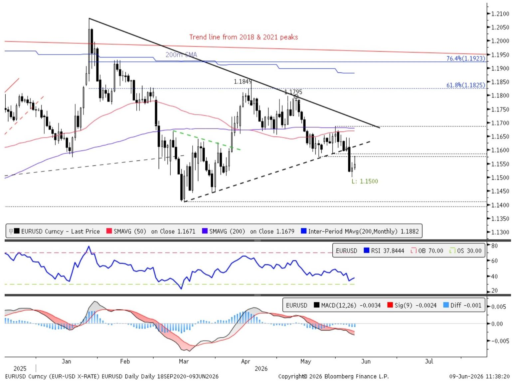
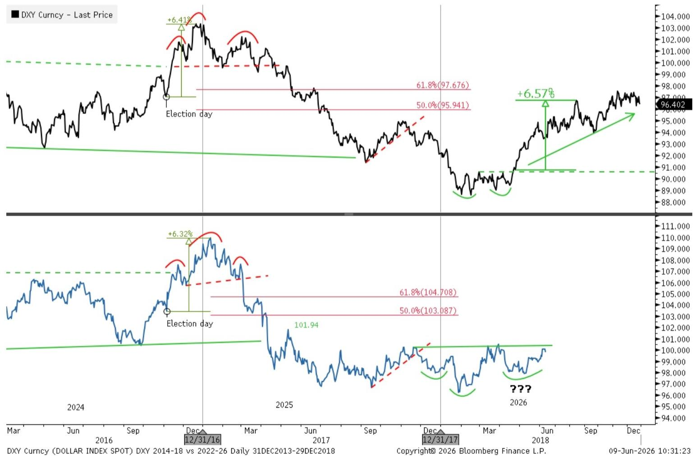

# The Euro Has Further to Fall: Why Holding EURUSD Shorts Through Summer Remains the Right Trade

The case for euro weakness is not a forecast. It is a structural observation that has been repeatedly validated by price action and is now gaining fundamental confirmation. On May 20, we recommended positioning for euro weakness via a EURUSD 1.15/1.13 three-month put spread at a cost of 0.36% of notional. The trade is now showing a modest profit at 0.47%, but the real opportunity lies ahead. The euro has broken trendline support, a head-and-shoulders top continues to form on weekly charts, and the dollar is repeating the pattern that drove its 2018 rally. The fundamentals are aligning in the same direction, yet the market remains distracted by geopolitical narratives that obscure the underlying data reality.

The controlling insight is simple: the euro is vulnerable not because of a single catalyst, but because of a convergence of technical breakdown, cyclical dollar strength, and fundamental divergence that is being underpriced by rates markets. The next two weeks will be critical, with the May CPI report and the first Federal Open Market Committee meeting under Chair Warsh. But the trade does not depend on a specific outcome from either event. It depends on the recognition that the euro's resilience has been an artifact of hope, not of economic reality.

The question every investor should be asking is not whether the euro can bounce from current levels. It can, and it will. The question is whether those bounces should be bought or sold. The evidence strongly suggests they should be sold.

## The Technical Picture Is Clear: The Euro Has Broken Support and the Pattern Points Lower

The most immediate technical development is the breakdown of the uptrend line that had supported the euro through the early part of 2026. Following the stronger-than-expected US payrolls data on June 5, the euro sold off sharply, breaking below this trendline and falling to its lowest level since early April. This is not a minor technical event. It is a structural shift in the price dynamics that had previously contained the euro's decline.

When a currency breaks a multi-month trendline, the market's assessment of fair value changes. The trendline represented the collective view of buyers and sellers over an extended period. Its violation means that the marginal buyer is no longer willing to pay the same price. The euro has since tested the psychological 1.15 level on June 8 and has begun to bounce. This bounce should be viewed with suspicion. Former support at 1.1576, the May 21 low, now becomes resistance, extending up to the broken trendline near 1.16. The ideal outcome for a bearish position is that the euro fails to reclaim these levels and resumes its decline.

The weekly chart adds further weight to the bearish thesis. The euro continues to form the right shoulder of a potential head-and-shoulders top, with neckline support at 1.1411 to 1.1392. This is the critical zone. A decisive break below this area would confirm the topping pattern and open the door to a move toward 1.11 and the rising 200-week moving average near 1.0980. The weeks of May 15 and June 5 have already provided two key bearish impulses that contribute to the topping process. What would reduce conviction in this pattern is a comparably strong bullish impulse in the coming weeks, but that would require a fundamental catalyst that is not currently visible.

The significance of the head-and-shoulders pattern should not be underestimated. It is one of the most reliable reversal patterns in technical analysis, and when it forms on a weekly chart for a major currency pair, it carries substantial weight. The pattern has been developing for months, and the right shoulder is still in formation. This means the trade is not yet crowded. The market has not fully priced in the breakdown.

## The Dollar Is Repeating Its 2018 Playbook, and That Points to Further Upside

Perhaps the most compelling technical argument for euro weakness is the behavior of the dollar index. The DXY price action since the November 2024 election has been tracking the 2016-2018 cycle with remarkable precision. Following the 2016 election, the dollar broke out of a multi-year range and rallied approximately 6.4 percent. It then formed a head-and-shoulders top and declined through 2017. The index bottomed in the first quarter of 2018, broke higher in late April, and rallied a further 6.6 percent into August of that year.

The parallel to the current cycle is striking. After the November 2024 election, the dollar broke out and rallied approximately 6.3 percent. It then formed a top and declined through 2025. In the first quarter of 2026, the dollar established a key low and has begun to base. If the analogue continues to hold, a confirmed breakout from the current base would point to a renewed uptrend, with potential for the dollar to rally toward 103 to 105 in the coming months.

The critical level to watch is a daily close above 100.51. This would be the highest daily close since May 2025 and would confirm that the dollar has completed its basing process and is ready to rally. The implications for the euro are direct and negative. If the dollar rallies to 103 to 105, the euro would need to fall substantially from current levels to maintain any semblance of equilibrium.

Critics will argue that historical analogues are unreliable and that the current environment is fundamentally different due to the Iran conflict and its impact on energy markets. This argument has merit, but it also cuts both ways. The 2018 analogue worked because the underlying economic dynamics were similar: a US economy that was outperforming its peers, a Federal Reserve that was tightening, and a global environment that favored dollar strength. The current environment shares all of these features, with the added complication of elevated energy prices that disproportionately hurt the euro area.

## The Fundamental Divergence Is Wider Than the Market Prices

The technical picture would be less compelling if the fundamentals were supportive of the euro. They are not. The growth divergence between the United States and the euro area is notable and, in the view of the report, is being underpriced by rates markets. The US economy has continued to show resilience, with the labor market strengthening rather than weakening. The latest payrolls report was the most recent example of a trend that has been building for months.

The euro area, by contrast, faces a more challenging outlook. The closure of the Strait of Hormuz has kept energy prices elevated, and while they have receded from their peaks, the level remains a source of stagflationary concern. European gas prices, while small compared to the 2022 spike, are still elevated enough to weigh on growth and keep inflation above target. The terms-of-trade shock for Europe is negative, and this directly translates into euro weakness.

The market has been distracted by hope for a peace agreement in the Middle East. This hope has prevented larger themes from taking hold. But hope is not a strategy. Even if a peace agreement were reached tomorrow, the energy inventory issues would persist for months. The structural damage to the euro area economy from elevated energy costs does not reverse overnight.

The rates market adds another layer of complexity. At the onset of the war, the market quickly priced the European Central Bank for eventual hikes to address the global inflation shock. At the same time, entrenched expectations for a more structurally dovish Federal Reserve prevented a similar adjustment in US rates. This dynamic has begun to shift. Data flow on both sides of the Fed's mandate has started to change the narrative. The market is now pricing for more ECB hikes, but this is not necessarily bullish for the euro. Given the more anemic growth backdrop in Europe, eventual ECB tightening could be short-lived or risk a policy mistake. The durability of ECB hikes is in question, and if the market begins to doubt them, the euro would lose a key source of support.

The Fed's hand could also be forced. Even if Chair Warsh resists hikes, ongoing inflationary pressure, further labor improvement, and broader easing of financial conditions could push the Fed toward tightening. While markets reflect some likelihood of a hike this year, the vast majority of Fed forecasters have yet to call for any. This asymmetry represents upside risk for the dollar and downside risk for the euro.

## What the Report Does Not Fully Answer: The Geopolitical Wild Card and the Limits of Historical Analogues

The report makes a compelling case for euro weakness, but it leaves several important questions unresolved. The most obvious is the role of geopolitics. The Iran conflict and the closure of the Strait of Hormuz are unprecedented in the modern era, and their resolution or escalation could fundamentally alter the trajectory of the euro. The report acknowledges this uncertainty but does not fully model its implications.

If a peace agreement were reached and the Strait of Hormuz reopened, energy prices would likely fall sharply. This would provide immediate relief to the euro area and could trigger a rally in the euro. The report's bearish thesis depends on the conflict persisting or its resolution being slow and incomplete. But what if a comprehensive agreement is reached in the coming weeks? The euro could rally sharply, breaking the technical patterns and invalidating the trade.

Conversely, an escalation of the conflict could send energy prices much higher, crushing the euro area economy and sending the euro to levels well below the report's targets. The report does not fully explore this tail risk, and investors need to consider it.

The second unresolved question is the reliability of the 2018 analogue. Historical patterns are useful guides, but they are not guarantees. The current environment differs from 2018 in several important respects, including the level of global debt, the structure of the energy market, and the geopolitical backdrop. The analogue could break, and if it does, the dollar could weaken rather than strengthen.

The third question is the timing. The report argues for euro weakness through the summer, but the exact timing of the move is uncertain. The market could remain range-bound for weeks or even months before breaking lower. Investors need to have the patience and risk tolerance to hold the position through periods of noise.

## A Decision Framework for Investors: How to Think About the Euro Trade

For investors considering a position in the euro, the decision framework should be based on three factors: the technical setup, the fundamental divergence, and the geopolitical risk premium.

The technical setup is the most straightforward. The euro has broken trendline support, a head-and-shoulders top is forming, and the dollar is repeating its 2018 pattern. The bias is to sell rallies, with the key level to watch being the neckline at 1.1411 to 1.1392. A break below this level would confirm the pattern and open the door to a move toward 1.11 or lower. The risk to the trade is a daily close above the 50-day and 200-day moving averages in the 1.1671 to 1.1685 area, which would invalidate the bearish setup.

The fundamental divergence is the second factor. The US economy is outperforming the euro area, and this is being underpriced by rates markets. The May CPI report and the FOMC meeting will provide important data points, but the trend is already clear. Investors should focus on the relative data flow rather than the absolute level of either economy.

The geopolitical risk premium is the third and most uncertain factor. The market is pricing in hope for a peace agreement, but the reality is that the Strait of Hormuz remains closed and energy prices remain elevated. Any resolution is likely to be gradual, and the structural damage to the euro area economy will take time to repair. Investors should be prepared for volatility but should not let short-term noise distract from the underlying trend.

The appropriate position for most investors is a put spread, which limits downside risk while providing exposure to the bearish thesis. The report's recommended structure, a 1.15 to 1.13 three-month put spread, remains valid. The cost has increased from 0.36 percent to 0.47 percent, but the trade still offers attractive risk-reward.

## The Next Two Weeks Will Be Critical, but the Trade Does Not Depend on Them

The next two weeks bring the May CPI report and the first FOMC meeting under Chair Warsh. These events will generate significant volatility, and the euro could move sharply in either direction. But the trade does not depend on a specific outcome from either event. The trade depends on the recognition that the euro's resilience has been an artifact of hope, not of economic reality.

A higher CPI print or a less dovish tone from Chair Warsh would provide an immediate catalyst for a dollar rally. But even if the data is benign and the Fed remains dovish, the underlying technical and fundamental picture remains bearish for the euro. The trade is about the trend, not the catalyst.

The report has laid out a clear and compelling case for euro weakness. The technical patterns are aligned, the fundamental divergence is widening, and the dollar is repeating a historical pattern that points to further strength. The market is distracted by geopolitical narratives that obscure the underlying data reality. Investors who can look through the noise and focus on the structural dynamics will be well positioned.

Join the community to read the full report and review the original charts.

*This article is for learning and discussion only and does not constitute investment advice.*

Personal reading notes and learning share only. Not investment advice.

