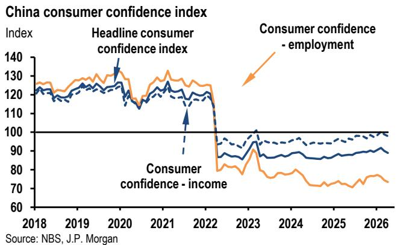

# JPM：市场真正低估的不是通胀读数，而是AI成本传导正在重塑中国的价格结构

中国5月通胀数据“大致符合预期”——这是JPM最新研报的开场判断。CPI同比1.2%，PPI同比3.9%，与市场共识几乎一致。如果只看这个表面数字，你可能会认为这是一份平淡无奇的月度数据更新。

但这份报告真正值得关注的，不是数字本身，而是数字背后的结构性变化。JPM在看似温和的通胀读数中，捕捉到了一个正在加速的趋势：**AI驱动的成本传导已经从半导体上游蔓延到消费电子终端，并在中国的工业升级周期中找到了独特的放大机制。**

这不是一次性的价格脉冲。这是中国价格体系正在经历的一次供给侧再定价。

## 1. PPI上行中隐藏着一个比能源冲击更持久的驱动力：AI成本传导正在拓宽

5月PPI环比上涨0.8%（季调后），同比加速至3.9%。乍看之下，这似乎延续了过去两个月由能源价格和季节性需求推动的上行趋势。但JPM的分析揭示了一个更重要的细节：推动PPI上行的力量正在切换。

报告明确指出，本月的价格支撑来自“工业升级和AI驱动的计算需求”，具体体现在金属、电气机械和电子设备价格上。国家统计局重点提及了锡冶炼环比上涨4.8%、铜冶炼上涨3.1%，以及集成电路封装测试和外部存储设备分别上涨2.9%和1.9%。

这些数据点共同指向一个判断：**AI相关的内存紧张正在从数据中心建设端向消费电子终端传导。** 手机和平板电脑价格环比上涨1.6%和1.1%，通信工具价格环比跳升1.5%（JPM估算季调后为1.8%），这是AI成本传导进入终端消费品的明确信号。

与能源冲击不同——中东局势缓和后油价可能回落——AI驱动的通胀脉冲“可能更具持久性”。全球科技上行周期仍然完整，而中国的工业升级和AI+战略是多年规划。

这意味着什么？对于关注中国PPI走势的投资者而言，需要重新评估驱动因素的权重。过去两年主导PPI的能源和原材料周期正在让位于结构性更强的技术升级周期。这不是一个季度内会消退的力量。

## 2. CPI的温和掩盖了一个结构性缺口：消费端仍然缺乏定价权

与PPI的活跃形成鲜明对比，CPI保持温和。5月环比仅微涨0.1%（季调后），核心CPI同比回落至1.1%，服务CPI进一步放缓至0.8%。

报告揭示了CPI疲软的两个结构性原因：

第一，食品通缩持续。鲜菜和猪肉价格继续下跌，这不仅是季节性因素。猪肉价格在经历了前几年的剧烈波动后，产能调整尚未完成，价格仍在寻底。食品项对CPI的拖累短期内难以消除。

第二，消费品PPI仍然处于通缩区间。5月消费品PPI同比为-0.8%，尽管环比微涨0.2%，但“需求疲弱和传导受限”的格局没有改变。这意味着上游PPI的上涨尚未有效传导至下游消费品价格。

更值得关注的是，JPM的数据显示，消费者信心指数中的收入和就业分项仍然处于低位。2025-2026年的数据点显示，消费者信心甚至低于2024年水平。在信心修复之前，消费端很难获得定价权。

**CPI和PPI的分化本质上是一个分配问题：上游涨价能否传导到下游，取决于终端需求能否承接。** 当前的数据表明，中国经济的价格传导机制仍然存在明显的断裂。

## 3. GDP平减指数即将转正，但这不意味着通缩担忧已经解除

报告中的一个关键判断值得单独讨论：GDP平减指数可能在二季度转正，结束持续三年的通缩周期。一季度平减指数为-0.06%，二季度有望转为正值。

这对市场意味着什么？平减指数转正将被视为价格复苏的宏观信号，可能支撑再通胀预期，也为央行的价格回升目标提供了数据支持。

但JPM同时给出了一个重要的限定条件：核心CPI仍然在1%左右的低位徘徊，能源冲击对近期经济活动构成压力，关税不确定性重新浮现，美联储偏鹰派。在这些因素叠加下，央行短期内可能按兵不动。

**平减指数转正是一个技术性信号，不是趋势性拐点。** 它更多反映了PPI上行的拉动效应，而非消费端的全面复苏。如果下半年经济增长下行风险持续，降息可能重新回到政策选项之中。

这里的关键问题在于：市场是否过度解读了平减指数转正的含义？如果投资者将这一信号视为通胀回归的证据而调整资产定价，但实际消费端通胀仍然疲弱，那么资产价格可能面临重新校准的风险。

## 4. 报告尚未完全回答的关键问题：AI成本传导的可持续性和广度

JPM提出了一个重要的前瞻性判断：AI相关的通胀脉冲可能比能源冲击更具持久性。但这个判断本身包含几个尚未被充分验证的假设。

第一，全球半导体供应链的紧张程度能否持续。报告提到“超大规模云服务商的资本支出正在从数据中心建设扩展到上游赋能者和较小规模的参与者”，这推动了全球半导体供应进一步收紧。但半导体供应链的紧张是周期性的还是结构性的？如果全球芯片产能投资在下半年开始释放，AI相关的价格压力可能边际减弱。

第二，中国的AI+战略能否转化为持续的终端需求。中国的工业升级和AI+计划是多年蓝图，但具体到价格传导路径，需要区分“政府投资驱动的采购”和“市场化需求驱动的消费”。前者可能带来阶段性价格脉冲，后者才能支撑持续的价格上升。

第三，消费品通缩的底部在哪里。消费品PPI仍然在-0.8%的同比负增长区间，报告认为“产能过剩和需求疲弱限制了传导”。但产能过剩的程度、需求修复的时点，报告没有给出明确的量化判断。

这些未解问题决定了AI成本传导的实际影响。如果上述假设被验证为正确，那么中国PPI可能在更长时间内维持高于市场预期的水平，而CPI则可能滞后但最终跟随。如果假设不成立，那么当前PPI的上行可能只是能源和季节性因素叠加的短期现象。

## 5. 投资者的观察框架：从“通胀读数”转向“价格传导效率”

基于JPM这份研报的分析，投资者需要建立一个新的观察框架来跟踪中国价格体系的变化。

第一个观察维度：上游涨价的传导效率。关注PPI中生产资料和消费品之间的价差变化。当前生产资料PPI同比5.2%，消费品PPI同比-0.8%，价差超过6个百分点。这个价差如果开始收窄，意味着上游涨价正在向终端传导；如果持续扩大，则意味着消费端仍然是价格洼地。

第二个观察维度：AI相关价格的扩散路径。报告提到了从内存到通信工具、从IC封装测试到消费电子的传导链条。投资者可以追踪这些细分领域的月度价格变化，判断AI成本传导是否在加速或减速。特别是手机、平板电脑等终端产品的价格变化，它们是AI需求最直接的价格信号。

第三个观察维度：央行的政策反应函数。报告指出，当前核心CPI低位、能源冲击和关税不确定性意味着央行可能按兵不动。但如果下半年增长下行风险显现，降息可能重回议程。投资者需要关注央行对价格数据的解读，特别是GDP平减指数转正后央行的表态——是将其视为积极信号还是认为仍需观察。

这个框架的核心逻辑是：**与其猜测CPI和PPI的绝对水平，不如追踪价格传导机制是否在改善。** 传导效率的提升比单一读数更能反映中国经济的定价能力变化。

---

这份JPM研报的价值不在于给出了一个确定的通胀预测，而在于提供了一个分析中国价格体系变化的框架。它提醒我们，在看似温和的通胀数据背后，AI驱动的结构性力量正在重塑价格传导路径。但同样重要的是，消费端的定价权缺失和产能过剩问题仍然存在，这意味着价格复苏可能是一个渐进且不均衡的过程。

报告中还有更多关于中东局势对能源价格的影响、黄金价格与杂项CPI的关系、以及PPI细分行业的详细拆解，这些内容由于篇幅限制无法一一展开。如果你对“AI成本传导的具体量化测算”或“消费品通缩的拐点判断”感兴趣，欢迎来星球微信群里继续讨论。我们会在社群中分享这份研报的完整解读和原始图表，并围绕这些未解问题展开更深入的交流。

Personal reading notes and learning share only. Not investment advice.

