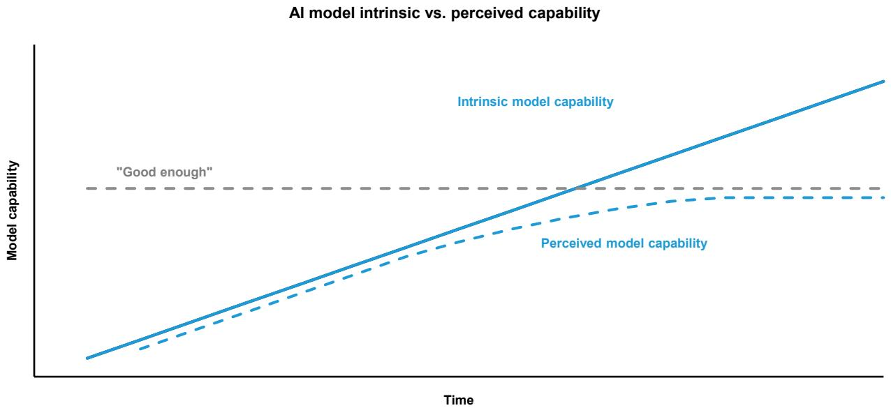
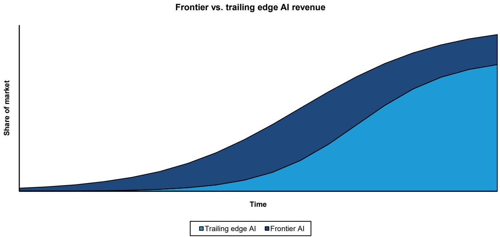
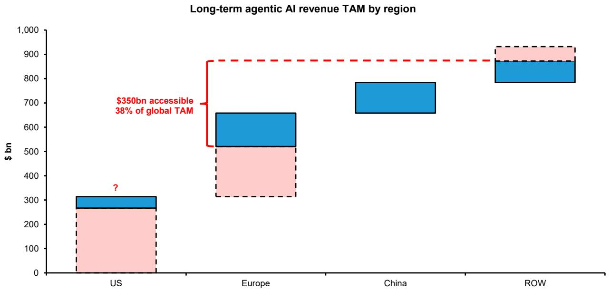
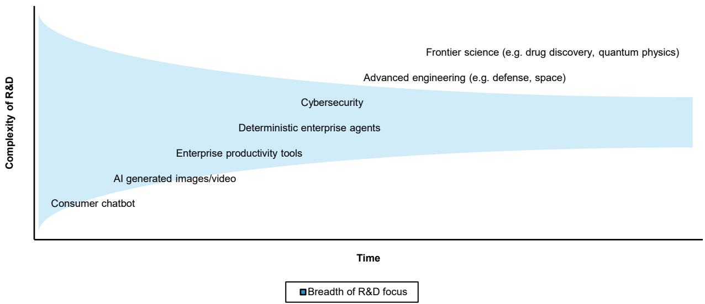
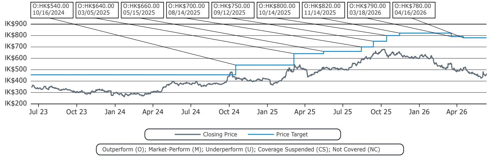
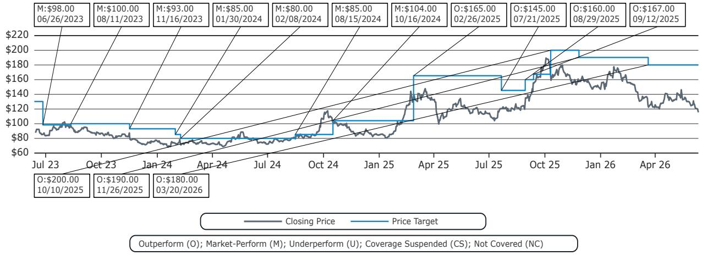
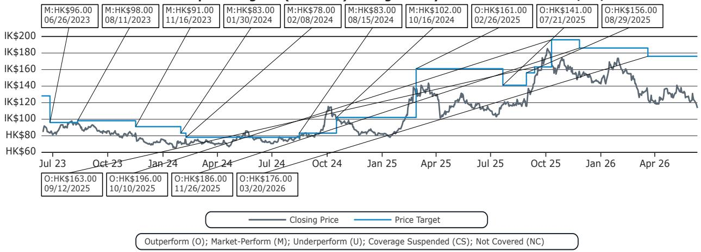

## Global Internet

# Global Internet: A framework for AI model commoditisation, and market segmentation

  
Robin Zhu

+852 2123 2659

robin.zhu@bernsteinsg.com

  
Mark Shmulik

+1 917 344 8508

mark.shmulik@bernsteinsg.com

  
Charles Gou

+852 2123 2618

charles.gou@bernsteinsg.com

  
Min-Joo Kang

+852 2123 2644

minjoo.kang@bernsteinsg.com

  
Hyrum Caesar

+81 3 6777 6979

hyrum.caesar@bernsteinsg.com

  
Wenhuan Chang

+1 917 344 8546

wenhuan.chang@bernsteinsg.com

  
Deeksha Pandey

+1 917 344 8447

deeksha.pandey@bernsteinsg.com

A shift in the AI zeitgeist? We're long-term AI bulls, and have increasingly built agentic AI into our day-to-day workflows. That said, several recent events strike us as being noteworthy as far as AI competition and ROI is concerned. The high cost of Anthropic's Claude Fable 5 pricing causing devs to ration usage feels like a notable development. See also headlines pointing to OpenAI potentially cutting prices to win share, and large AI users (e.g. Tencent, Microsoft) doing a double-take on the costs of token-maxxing.

An alternative mental model for AI model commoditisation. Rather than model intelligence necessarily converging, we increasingly think AI model commoditisation will be driven by human user perception across various end uses, and the timeline on which competing models become “good enough”, and reliable at scale. We’ve long argued that consumer-focused AI (ordering bubble tea, booking hotel rooms) will commoditise relatively quickly. Enterprise use cases like coding and Excel work are more complex, and will take longer to solve. Solving frontier science (e.g. defence, healthcare, nuclear fusion, space travel) likely merits the use of frontier AI more or less ad infinitum.

## The implications for AI market segmentation... and competition. Once the

AI supporting a given use case becomes “good enough”, we’d expect the arbiter of competition and market share to shift from reasoning capabilities to availability and price. Our base case is the US frontier labs continue to unlock new model capabilities that command a rising price premium among increasingly specialised customers. Data security concerns and global geopolitics likely prevent some US and European enterprises from deploying Chinese models. But elsewhere we’d expect the Chinese AI labs to take share, serving “good enough” reasoning capabilities at significantly lower prices.

Chinese open source models as the value option. Hardware advancements will make it cheaper for the US frontier labs to serve tokens, and drive Jevon's Paradox. Nonetheless, it would surprise us if trailing edge AI didn't become another sector where Chinese competition takes market share, in part thanks to a willingness to accept lower prices and margins. The ability to follow global SOTA as a lighthouse for R&D direction means the Chinese AI labs need to do less exploratory research. Our market segmentation suggests they should be able to access 35-40% of the global AI TAM - even taking geopolitical constraints into consideration, and assuming minimal US traction.

Stepping off the exponential - and the path to AI lab profits. If we're right about AI commoditisation being driven by task completion and user perception, the implications for AI lab economics might actually be reasonably hopeful. Once a use case becomes “solved” the return on doing incremental R&D on the same topic diminishes, meaning R&D effort can be redirected elsewhere along the frontier. Over time, we'd expect the envelope of use cases worth spending exponentially higher amounts to solve will narrow... meaning aggregate model training costs rise more slowly, making it easier for the AI labs to show operating leverage.

BERNSTEIN TICKER TABLE

<table><tr><td rowspan="2">Ticker</td><td rowspan="2">Rating</td><td colspan="3">11 Jun 2026</td><td colspan="2">TTMRel.</td><td colspan="4">Adjusted EPS</td><td colspan="3">Adjusted P/E (x)</td></tr><tr><td>Cur</td><td>Closing Price</td><td>Price Target</td><td>Cur</td><td>Perf.</td><td>Cur</td><td>2025A</td><td>2026E</td><td>2027E</td><td>2025A</td><td>2026E</td><td>2027E</td></tr><tr><td>700.HK (Tencent)</td><td>O</td><td>HKD</td><td>457.20</td><td>780.00</td><td>(47.3)%</td><td>CNY</td><td>28.09</td><td>30.00</td><td>34.91</td><td>14.1</td><td>13.2</td><td>11.3</td><td></td></tr><tr><td>BABA (Alibaba )</td><td>O</td><td>USD</td><td>115.38</td><td>180.00</td><td>(23.7)%</td><td>CNY</td><td>65.41</td><td>26.82</td><td>46.57</td><td>12.0</td><td>29.1</td><td>16.8</td><td></td></tr><tr><td>9988.HK (Alibaba)</td><td>O</td><td>HKD</td><td>107.40</td><td>176.00</td><td>(44.8)%</td><td>HKD</td><td>8.82</td><td>3.69</td><td>6.68</td><td>10.5</td><td>25.2</td><td>13.9</td><td></td></tr><tr><td>ASIAX</td><td></td><td></td><td>1,920.52</td><td></td><td></td><td></td><td></td><td></td><td></td><td></td><td></td><td></td><td></td></tr><tr><td>SPX</td><td></td><td></td><td>7,266.99</td><td></td><td></td><td></td><td></td><td></td><td></td><td></td><td></td><td></td><td></td></tr></table>

O - Outperform, M - Market-Perform, U - Underperform, NR - Not Rated, CS - Coverage Suspended  
Source: Bloomberg, Bernstein estimates and analysis.

## INVESTMENT IMPLICATIONS

We're AI bulls at a high level, but think events in the past week are worthy of attention. The high cost of Claude Fable 5 tokens making token-maxxing uneconomic wasn't necessarily on our list of high-likelihood events for the year, but likely accelerates the timeline on which AI devs and users start to examine AI ROI more closely. The idea that AI users will select across a range of models to match the marginal cost of tokens to the marginal benefit of task completion (with considerations perhaps given to quality-of-life aspects like response times and model “personality”) makes sense to us.

To take things one step further, our mental framework for AI model commoditisation focuses on whether task completion becomes reliable at scale as perceived by human users, as opposed to some academic measure of underlying convergence. Once agentic AI “solves” various vertical use cases, we’d expect the arbiter of competition to shift from reasoning capabilities and task completion to more mundane variables like cost per task, reliability, and developer trust. The debate on whether the top Chinese AI models are 6 or 12 months behind US SOTA is intellectually interesting, but probably almost meaningless commercially except in the case of specialised use cases.

Longer term, we think it's logical to assume a two-tier market split across (1) the US SOTA labs serving the frontier, where the workloads become increasingly specialised and novel, while a narrower field of customers exhibits high willingness to pay; and (2) a market for trailing edge AI that serves more mundane enterprise and consumer end uses, where the availability and cost of reasoning drives adoption - and share shifts. Consumer-oriented AI should be one of the first end uses where a wide range of players achieve “good enough” status, for example.

## VALUATION COMPS TABLE

EXHIBIT 1: Asia Internet: valuation summary

<table><tr><td></td><td>Rating</td><td>Price target</td><td>Last price</td><td>Crncy</td><td>Market cap (US$mn)</td><td>2026E</td><td>PE 2027E</td><td>2028E</td><td>2026E</td><td>EV/sales 2027E</td><td>2028E</td></tr><tr><td colspan="12">China Internet coverage</td></tr><tr><td>Tencent</td><td>O</td><td>780</td><td>465.60</td><td>HKD</td><td>534,208</td><td>13.5x</td><td>11.6x</td><td>10.1x</td><td>4.5x</td><td>3.9x</td><td>3.4x</td></tr><tr><td>PDD</td><td>M</td><td>110</td><td>81.82</td><td>USD</td><td>116,462</td><td>7.5x</td><td>6.8x</td><td>6.0x</td><td>0.6x</td><td>0.4x</td><td>0.1x</td></tr><tr><td>Meituan</td><td>M</td><td>85</td><td>79.00</td><td>HKD</td><td>62,014</td><td>176.3x</td><td>16.3x</td><td>9.5x</td><td>0.8x</td><td>0.7x</td><td>0.6x</td></tr><tr><td>NetEase</td><td>O</td><td>150</td><td>125.52</td><td>USD</td><td>80,098</td><td>13.8x</td><td>12.8x</td><td>12.2x</td><td>3.3x</td><td>3.0x</td><td>2.8x</td></tr><tr><td>Boss Zhipin</td><td>O</td><td>18</td><td>13.24</td><td>USD</td><td>6,402</td><td>10.7x</td><td>8.9x</td><td>7.9x</td><td>2.4x</td><td>1.6x</td><td>1.1x</td></tr><tr><td>JD</td><td>O</td><td>40</td><td>28.45</td><td>USD</td><td>38,858</td><td>9.2x</td><td>6.7x</td><td>5.1x</td><td>0.2x</td><td>0.2x</td><td>0.2x</td></tr><tr><td>Alibaba</td><td>O</td><td>180</td><td>115.38</td><td>USD</td><td>276,812</td><td>28.9x</td><td>16.9x</td><td>14.4x</td><td>1.9x</td><td>1.7x</td><td>1.6x</td></tr><tr><td colspan="12">China Internet other</td></tr><tr><td>Kuaishou</td><td></td><td></td><td>46.02</td><td>HKD</td><td>25,219</td><td>10.4x</td><td>9.1x</td><td>8.1x</td><td>1.0x</td><td>0.9x</td><td>0.9x</td></tr><tr><td>Bilibili</td><td></td><td></td><td>18.08</td><td>USD</td><td>7,685</td><td>18.2x</td><td>13.9x</td><td>10.8x</td><td>1.1x</td><td>1.0x</td><td>0.9x</td></tr><tr><td>TME</td><td></td><td></td><td>9.21</td><td>USD</td><td>15,303</td><td>9.5x</td><td>8.6x</td><td>7.8x</td><td>2.0x</td><td>1.8x</td><td>1.7x</td></tr><tr><td>Baidu</td><td></td><td></td><td>117.48</td><td>USD</td><td>39,973</td><td>15.0x</td><td>13.4x</td><td>10.8x</td><td>1.2x</td><td>1.1x</td><td>1.0x</td></tr><tr><td>VIPshop</td><td></td><td></td><td>13.71</td><td>USD</td><td>6,585</td><td>5.4x</td><td>5.2x</td><td>4.9x</td><td>0.2x</td><td>0.2x</td><td>0.2x</td></tr><tr><td>Tencent Music</td><td></td><td></td><td>9.21</td><td>USD</td><td>15,303</td><td>9.5x</td><td>8.6x</td><td>7.8x</td><td>2.0x</td><td>1.8x</td><td>1.7x</td></tr><tr><td>Trip.com</td><td></td><td></td><td>47.97</td><td>USD</td><td>30,207</td><td>11.7x</td><td>10.3x</td><td>9.1x</td><td>2.4x</td><td>2.1x</td><td>1.9x</td></tr><tr><td>KE Holdings</td><td></td><td></td><td>16.00</td><td>USD</td><td>18,517</td><td>18.3x</td><td>15.7x</td><td>15.7x</td><td>1.1x</td><td>1.0x</td><td>1.0x</td></tr><tr><td colspan="12">Asian Internet</td></tr><tr><td>Naver</td><td>O</td><td>330,000</td><td>220,500</td><td>KRW</td><td>22,910</td><td>15.9x</td><td>14.4x</td><td>12.8x</td><td>1.7x</td><td>1.4x</td><td>1.2x</td></tr><tr><td>Kakao</td><td>O</td><td>80,000</td><td>37,650</td><td>KRW</td><td>11,268</td><td>21.9x</td><td>19.3x</td><td>15.9x</td><td>1.2x</td><td>0.9x</td><td>0.7x</td></tr><tr><td>Hybe</td><td>O</td><td>400,000</td><td>201,000</td><td>KRW</td><td>6,153</td><td>20.0x</td><td>19.8x</td><td>16.1x</td><td>1.3x</td><td>1.4x</td><td>1.2x</td></tr><tr><td>Coupang</td><td>U</td><td>12</td><td>15.12</td><td>USD</td><td>27,141</td><td>-41.2x</td><td>65.0x</td><td>32.7x</td><td>0.6x</td><td>0.6x</td><td>0.5x</td></tr><tr><td>Sea Ltd.</td><td></td><td></td><td>82.44</td><td>USD</td><td>50,493</td><td>22.1x</td><td>16.1x</td><td>12.8x</td><td>1.4x</td><td>1.2x</td><td>1.0x</td></tr><tr><td>Grab</td><td></td><td></td><td>3.27</td><td>USD</td><td>13,409</td><td>31.7x</td><td>21.2x</td><td>15.8x</td><td>2.2x</td><td>1.8x</td><td>1.6x</td></tr><tr><td colspan="12">US Internet</td></tr><tr><td>Amazon</td><td></td><td></td><td>238.00</td><td>USD</td><td>2,560,192</td><td>23.1x</td><td>20.5x</td><td>16.7x</td><td>3.2x</td><td>2.8x</td><td>2.6x</td></tr><tr><td>Alphabet</td><td></td><td></td><td>356.38</td><td>USD</td><td>4,320,705</td><td>24.9x</td><td>23.3x</td><td>19.4x</td><td>10.2x</td><td>8.4x</td><td>7.1x</td></tr><tr><td>Meta</td><td></td><td></td><td>570.98</td><td>USD</td><td>1,449,389</td><td>16.1x</td><td>14.8x</td><td>12.3x</td><td>5.8x</td><td>4.8x</td><td>4.1x</td></tr><tr><td>Netflix</td><td></td><td></td><td>82.00</td><td>USD</td><td>345,285</td><td>23.0x</td><td>21.2x</td><td>17.9x</td><td>6.8x</td><td>6.1x</td><td>5.5x</td></tr><tr><td>Uber</td><td></td><td></td><td>68.61</td><td>USD</td><td>139,662</td><td>21.1x</td><td>15.3x</td><td>12.5x</td><td>2.5x</td><td>2.2x</td><td>1.9x</td></tr><tr><td>Spotify</td><td></td><td></td><td>503.10</td><td>USD</td><td>103,554</td><td>34.0x</td><td>27.6x</td><td>22.6x</td><td>4.1x</td><td>3.6x</td><td>3.2x</td></tr><tr><td>DoorDash</td><td></td><td></td><td>151.00</td><td>USD</td><td>65,794</td><td>31.7x</td><td>21.6x</td><td>17.0x</td><td>3.6x</td><td>3.0x</td><td>2.5x</td></tr></table>

Pricing date June 3, 2026. The valuation multiples of our China and Asian Internet coverage are based on Bernstein estimates; the other companies shown reflect Bloomberg consensus estimates.  
Source: Corporate reports, Bloomberg, Bernstein estimates and analysis.

## DETAILS

## A MENTAL MODEL FOR AI MODEL SEGMENTATION AND COMMODITISATION

The debate over whether AI models can remain differentiated or are doomed to commoditise in the long run remains a key one when it comes to the economic value associated with frontier intelligence, and the valuations of market bellwethers like OpenAI and Anthropic. Our own views on this topic have meandered over time. But we increasingly think a generalisable framework for AI model evolution, market competition, and how the AI industry as a collective “step off the exponential” hinges on end user perceptions of intelligence, and when task completion becomes “good enough” for various verticals, and reliable at scale… regardless of whether the underlying tech necessarily converges fully in a strict academic sense (see Exhibit 2).

As AI model performance continues to improve, and agentic task completion horizons lengthen, we'd expect a broadening range of tasks to become possible to an acceptable degree of accuracy, and then deployable at scale. This is especially true if we assume guardrails like user confirmation of transactions are embedded in the workflow, which helps to ring-fence the downside to reasoning errors. As of June 2026, AI-generated images and videos are already increasingly difficult to distinguish versus the real thing. Tencent's Weixin agentic AI announcement - and Alibaba's efforts within its Qwen app - suggest that purchases of bubble tea, flight tickets, or T-shirts will soon become ready for commercial deployment. Once task completion becomes reliable at scale, the return to doing more R&D on these end uses drops dramatically... which should mean the AI labs turn their energy towards more complex tasks.

On a relative basis, we'd expect most consumer use cases for agentic AI to become “solved” relatively quickly, followed by more deterministic enterprise workloads (e.g. Excel work, imagine looking for hallucinations in several hundred lines of modelling), more complex strategic planning, and fields like cybersecurity (e.g. Project Glasswing), advanced engineering (e.g. Gen 7 fighter jets supported by autonomous drone swarms), and frontier science (drug discovery, nuclear fusion, space exploration).

## Do AI models commoditise... when human users stop being able to tell them apart?

At the market level, our latest thinking is that there will be a “bell curve” of differentiation between the closed SOTA labs, and open source, where differences in capabilities diverge periodically, driven by access to compute and frontier R&D unlocking new capabilities. It feels plausible to us for example that the US frontier labs moving from Blackwell to Rubin and subsequent generations of chips will at least momentarily cause the gap between US and China SOTA to widen. But contrary to the “typical” theory we’ve heard of model convergence, where model intelligence somehow asymptotes, our view is that the perceived gap in intelligence almost certainly then re-converges over time, as technology diffusion takes place. 6-12 months is an eternity on the AI frontier, but a relatively short period in the real world, when compared against things like sticky consumer habits, and the often slow-moving gears of enterprise bureaucracy.

In practical terms, we'd expect AI models to commoditise at different speeds in different vertical use cases. Consumer use cases likely commoditise first, followed by generalist business use cases depending on the level of deterministic accuracy required in the output, e.g. brainstorming marketing ideas versus complex financial modeling. In fields like video gaming there's no doubt that advancing AI capabilities will revolutionise development, though game success will still be influenced by IP strength and the fuzzy nature of creative quality. But we've been very surprised by the speed at which AI-generated music has proliferated. The last verticals of AI use to be considered commodity will probably centre around frontier science, like drug discovery, nuclear fusion, or space exploration, where highly specialised (and likely increasingly sovereign) end users have effectively unlimited willingness to pay.

EXHIBIT 2: Our perception of AI model quality increasing centres around differentiable quality as perceived by humans, as opposed to underlying reasoning capabilities necessarily converging in a strict academic sense  

line chart

| Time | Intrinsic model capability | Perceived model capability |
|------|----------------------------|----------------------------|
| t1   | Low                        | Low                        |
| t2   | Medium                     | Medium                     |
| t3   | High                       | High                       |

Source: Bernstein analysis.

## ON MARKET SEGMENTATION... AND GLOBAL COMPETITION

Once agentic AI “solves” various vertical use cases, we’d expect the arbiter of competition to shift from task completion to more mundane variables like cost per task, reliability, and developer trust. Similar to how we’ve triaged our own AI use (having consumed something like 2bn tokens in the past month), offloading simpler tasks to cheaper flash models, there’s very little logic in paying for Claude Fable 5 tokens to order bubble tea or T-shirts. Our own use of agentic AI setups like Hermes (2bn tokens consumed in the last couple of months) has been elucidating, and added to our conviction that AI users will select across a range of AI models to match the marginal cost of tokens to the marginal benefit of task completion. The high reasoning capabilities and cost of frontier models means they are most likely used to address the most valuable and mission-critical use case, while simpler tasks are handed off to cheaper “good enough” models (see Exhibit 3).

If we're right on the above progression, the implications for the division of the global AI profit pool are also striking. Our base case is US leaders remain the global SOTA, and advancing agentic AI capabilities unlock new, more complex use cases which command higher pricing from highly-motivated payers globally. In addition, we expect the realities of global geopolitics and issues like data security concerns to mean a meaningful cohort of enterprise customers (say some percentage of the Fortune 500, and large enterprises in other developed markets) find the idea of using a Chinese model unpalatable, leaving these customers the domain of OpenAI, Anthropic, Google, et al.

## The accessible TAM for China AI

Outside this perimeter however, for a growing envelope of lagging edge workloads, especially outside the US, we'd expect the Chinese AI labs' much lower token costs to prove attractive, and help them win share.

Exhibit 4 shows directionally how we mentally break down the global agentic AI TAM by region and by end use - the latter broken down into sovereign/public sector workloads, large enterprises, and SMEs and hobbyists. We've assumed the US market is mostly off limits to Chinese AI labs in the very long run, and the market is left to US peers (recent news flow suggests US customers are paying prolifically for DeepSeek, but we're happy to be overly conservative here). In Europe, we've assumed greater enterprise and hobbyist appetite for adoption, but excluded the sovereign/public sector markets. In the rest of the world ex. China, we've assumed generally higher levels of appetite for adoption.

Exhibit 5 shows how we think the AI revenue TAM accessible to the China labs breaks down within the broader \$1tn or so of global TAM. Collectively, the blue accessible markets total \$320bn of revenue TAM, or around 35-40% of the global total.

EXHIBIT 3: It feels notable that the cost of Claude Fable 5 tokens has driven a rethink of AI model usage by intelligence and cost... over time we expect trailing edge AI models to become “good enough” for most tasks  

area chart

| Time | Trailing edge AI | Frontier AI |
| ---- | ---------------- | ----------- |
| 0    | 0                | 0           |
| 1    | 0.5              | 0.3         |
| 2    | 1.0              | 0.6         |
| 3    | 1.5              | 0.9         |
| 4    | 2.0              | 1.2         |
| 5    | 2.5              | 1.5         |
| 6    | 3.0              | 1.8         |
| 7    | 3.5              | 2.0         |
| 8    | 4.0              | 2.2         |
| 9    | 4.5              | 2.4         |
| 10   | 5.0              | 2.6         |
| 11   | 5.5              | 2.8         |
| 12   | 6.0              | 3.0         |
| 13   | 6.5              | 3.2         |
| 14   | 7.0              | 3.4         |
| 15   | 7.5              | 3.6         |
| 16   | 8.0              | 3.8         |
| 17   | 8.5              | 4.0         |
| 18   | 9.0              | 4.2         |
| 19   | 9.5              | 4.4         |
| 20   | 10.0             | 4.6         |

Source: Corporate reports and Bernstein analysis.

EXHIBIT 4: We expect the Chinese AI labs to win share on the basis of their much cheaper tokens, but the accessibility of the overseas market will vary by region

<table><tr><td>Region</td><td>Customer type</td><td>Accessibility</td><td>Comments</td></tr><tr><td rowspan="4">US</td><td>Government</td><td>Nil</td><td>Assumed inaccessible for obvious geopolitical reasons</td></tr><tr><td>Large enterprise</td><td>Low</td><td>Likely reputational and data security concerns associated with use of Chinese AI modelAirbnb on record as having used Qwen model</td></tr><tr><td>Private sector / start-ups</td><td>Moderate</td><td>Some access is likely possible, discounted for conservatismMinimax counts Canva, Twitter/X among its overseas customers</td></tr><tr><td>Pro-sumers / hobbyists</td><td>High</td><td>Widespread use of Chinese AI models due to lower token prices</td></tr><tr><td rowspan="4">Europe</td><td>Government</td><td>Nil</td><td>Assumed inaccessible for geopolitical reasons</td></tr><tr><td>Large enterprise</td><td>Moderate</td><td>Likely reputational and data security concerns associated with use of Chinese AI model, though perhaps not to the same extent as the US</td></tr><tr><td>Private sector / start-ups</td><td>Moderate</td><td>Some access is likely possible</td></tr><tr><td>Pro-sumers / hobbyists</td><td>High</td><td>Ongoing use of Chinese AI models due to lower token prices</td></tr><tr><td rowspan="4">Rest of world</td><td>Government</td><td>Moderate</td><td>Likely greater appetite for engagement with Chinese AI labsZ.ai supporting sovereign AI projects in Malaysia, expanding to Middle East</td></tr><tr><td>Large enterprise</td><td>Moderate</td><td>Assumed lower risk of geopolitical headwinds to adoption, greater sensitivity to lower AI token prices</td></tr><tr><td>Private sector / start-ups</td><td>High</td><td>Ongoing use of Chinese AI models due to lower token prices</td></tr><tr><td>Pro-sumers / hobbyists</td><td>High</td><td>Ongoing use of Chinese AI models due to lower token prices</td></tr></table>

Source: Corporate reports and Bernstein analysis.

EXHIBIT 5: We think at least 35-40% of the long-term global TAM for AI will be accessible to the Chinese AI labs, even if we assume meaningful access constraints in the US and broader developed markets  

bar chart

| Region | Blue Segment ($ bn) | Pink Segment ($ bn) | Total Revenue ($ bn) |
|--------|---------------------|---------------------|----------------------|
| US     | 270                 | 100                 | 310                  |
| Europe | 520                 | 240                 | 650                  |
| China  | 780                 | 0                   | 780                  |
| ROW    | 870                 | 240                 | 920                  |

Source: Corporate reports and Bernstein analysis.

## STEPPING OFF THE EXPONENTIAL R&D TREADMILL?

If we're right about the trajectory of AI commoditisation, the implications for long-term AI lab economics might actually be reasonably hopeful. The variable economics of AI model inference are generally respectable to very strong. In the foreseeable future we expect R&D spend among China's top AI labs to continue to rise rapidly - 50% CAGR for five years was described as “unsurprising” when we floated the idea with Z.ai and Minimax.

Over time though, we're hopeful the ability of these companies to focus their model training budgets across a narrower set of model modalities and end uses should mean R&D expense growth levels off over time (see Exhibit 6). Mechanically, the absolute dollars spent will likely continue to trail US peers by a wide margin, reflecting a combination of (1) lower developer costs per hour; (2) the second mover advantage of being able to follow global SOTA as a lighthouse for R&D direction; to a lesser extent (3) the smart use of clusters of lagging edge chips.

Looking at the rest of the AI lab P&L, inference margins are a product of compute costs and model efficiency, and are respectable to strong for most AI labs. Operating expenses ex. R&D should remain relatively lean: marketing spend for example should remain relatively modest in an environment where superior reasoning capability more or less sells itself.

EXHIBIT 6: Over time we expect a wider range of AI end uses to become “good enough” and therefore no longer worthy of incremental R&D, allowing the AI labs to move on to more frontier end uses  
Evolution of AI R&D focus  

area chart

| Category                          | Complexity of R&D |
| --------------------------------- | ----------------- |
| Consumer chatbot                  | Low               |
| AI generated images/video         | Medium            |
| Enterprise productivity tools     | Medium            |
| Deterministic enterprise agents   | Medium            |
| Cybersecurity                      | Medium            |
| Advanced engineering             | Medium            |
| Frontier science                  | High              |

Source: Bernstein analysis.

## I. REQUIRED DISCLOSURES

References to "Bernstein" or the "Firm" in these disclosures relate to the following entities: Bernstein Institutional Services LLC (April 1, 2024 onwards), Bernstein & Co., LLC (pre April 1, 2024), Bernstein Autonomous LLP, BSG France S.A. (April 1, 2024 onwards), Bernstein (Hong Kong) Limited 盛博香港有限公司, Bernstein (Canada) Limited, Bernstein (India) Private Limited (SEBI registration no. INH000006378), Bernstein (Singapore) Private Limited, Bernstein Japan KK (サンフォード・C・バーンスタイン株式会社) and analysts employed by SG Africa Technologies & Services to produce Bernstein under a Global Services Agreement in place between Bernstein and SG.

Bernstein is part of a joint venture between SG (SG) and AllianceBernstein, L.P. (AB). Unless specifically noted otherwise, for purposes of these disclosures, references to Bernstein's “affiliates” relate to both SG and AB and their respective affiliates.

## VALUATION METHODOLOGY

## Tencent Holdings Ltd

We value Tencent at HK\$780 per share, on a 20x FY+1 (i.e. Quarters 5-8) PE multiple.

## Alibaba Group Holding Ltd

We value Alibaba at US\$180/HK\$176 per share, based on our SOTP valuation for FY+1 revenues and profits in its core e-commerce and Cloud businesses.

## RISKS

## Tencent Holdings Ltd

The main downside risks associated with Tencent include macroeconomic risks (e.g. credit, retail consumption), fluctuations in user engagement with its platforms, gaming and advertising demand competition with rival internet platforms, and regulatory risks – for example related to China's anti-monopoly regulations.

## Alibaba Group Holding Ltd

The main downside risks associated with our price target for Alibaba include macroeconomic risks (e.g. credit, retail consumption), fluctuations in user engagement with Taobao, Tmall, and other platforms, competition with rival internet platforms, regulatory risks – for example related to China's anti-monopoly regulations, and losses in the company's innovation initiatives & others segment.

## RATINGS DEFINITIONS, BENCHMARKS AND DISTRIBUTION

## EQUITY RATINGS DEFINITIONS

## Bernstein brand

The Bernstein brand rates stocks based on forecasts of relative performance for the next 12 months versus the S&P 500 for stocks listed on the U.S. and Canadian exchanges, versus the Bloomberg Europe Developed Markets Large and Mid Cap Price Return Index EUR (EDME) for stocks listed on the European exchanges and emerging markets exchanges outside of the Asia Pacific region, versus the Bloomberg Japan Large and Mid Cap Price Return Index USD (JPL) for stocks listed on the Japanese exchanges, and versus the Bloomberg Asia ex-Japan Large and Mid Cap Price Return Index (ASIAX) for stocks listed on the Asian (ex-Japan) exchanges -unless otherwise specified.

The Bernstein brand has three categories of ratings:

- Outperform: Stock will outpace the market index by more than 15 pp  
• Market-Perform: Stock will perform in line with the market index to within +/-15 pp  
• Underperform: Stock will trail the performance of the market index by more than 15 pp

Coverage Suspended: Coverage of a company under the Bernstein brand has been suspended. Ratings and price targets are suspended temporarily, are no longer current, and should therefore not be relied upon.

Not Rated: A rating assigned when the stock cannot be accurately valued, or the performance of the company accurately predicted, at the present time. The covering analyst may continue to publish research reports on the company to update investors on events and developments.

Not Covered (NC) denotes companies that are not under coverage.

Bernstein brand stock ratings are based on a 12-month time horizon.

## Autonomous brand – common stocks

The Autonomous brand rates common stocks as indicated below. As our benchmarks we use the Bloomberg Europe 500 Banks And Financial Services Index (BEBANKS) and Bloomberg Europe Dev Mkt Financials Large and Mid Cap Price Ret Index EUR (EDMFI) index for developed European banks and Payments, the Bloomberg Europe 500 Insurance Index (BEINSUR) for European insurers, the S&P 500 and S&P Financials for US banks and Payments coverage, S5LIFE for US Insurance, the S&P Insurance Select Industry (SPSIINS) for US Non-Life Insurers coverage, and the Bloomberg Emerging Markets Financials Large, Mid and Small Cap Price Return Index (EMLSF) for emerging market banks and insurers and Payments. Ratings are stated relative to the sector (not the market).

The Autonomous brand has three categories of common stock ratings:

- Outperform (OP): Stock will outpace the relevant index by more than 10 pp  
- Neutral (N): Stock will perform in line with the market index to within +/-10 pp  
• Underperform (UP): Stock will trail the performance of the relevant index by more than 10 pp

Coverage Suspended: Coverage of a company under the Autonomous research brand has been suspended. Ratings and price targets are suspended temporarily, are no longer current, and should therefore not be relied upon.

Not Rated: A rating assigned when the stock cannot be accurately valued, or the performance of the company accurately predicted, at the present time. The covering analyst may continue to publish research reports on the company to update investors on events and developments.

Those denoted as ‘Feature’ (e.g., Feature Outperform FOP, Feature Under Outperform FUP) are our core ideas.

Not Covered (NC) denotes companies that are not under coverage.

Autonomous brand common stock ratings are based on a 12-month time horizon.

## Autonomous brand – preferred stocks

The Autonomous brand has three categories of preferred stock ratings:

- Outperform (OP): The total return of the preferred instrument is expected to outperform preferred securities of other issuers operating in similar sectors or rating categories over the next six months.  
- Neutral (N): The total return of the preferred instrument is expected to perform in line with preferred securities of other issuers operating in similar sectors or rating categories over the next six months.  
- Underperform (UP): The total return of the preferred instrument is expected to underperform preferred securities of other issuers operating in similar sectors or rating categories over the next six months.

Autonomous preferred stock ratings are based on a 6-month time horizon.

## AUTONOMOUS CREDIT RESEARCH

Where this report contains investment recommendations for credit instruments, as defined in article 3(1)(35) of the Market Abuse Regulation, the information below is presented to comply with its disclosure requirements.

The report may also include reference(s) to published opinions by other Autonomous or Bernstein analysts covering the equity securities of the issuer(s) referenced herein. Please note an investment recommendation for credit instruments published by the author(s) of this report may differ from the published view of the analyst covering equity securities for the issuer(s) contained in this report and vice versa.

## CREDIT RATINGS DEFINITIONS

The Autonomous brand has three categories of credit ratings:

- Credit Outperform (C-OP): The total return of the Reference Credit Instrument is expected to outperform the credit spread of bonds of other issuers operating in similar sectors or rating categories over the next six months.  
- Credit Neutral (C-N): The total return of the Reference Credit Instrument is expected to perform in line with the credit spread of bonds of other issuers operating in similar sectors or rating categories over the next six months.  
- Credit Underperform (C-UP): The total return of the Reference Credit Instrument is expected to underperform the credit spread of bonds of other issuers operating in similar sectors or rating categories over the next six months.

Autonomous credit ratings are based on a 6-month time horizon.

A list of all investment recommendations produced by the author(s) of this report alongside credit ratings history are available upon request.

It is at the sole discretion of the Firm as to when to initiate, update and cease research coverage. The Firm has established, maintains and relies on information barriers to control the flow of information contained in one or more areas (i.e. the private side) within the Firm, and into other areas, units, groups or affiliates (i.e. public side) of the Firm

DISTRIBUTION OF EQUITY RATINGS/INVESTMENT BANKING SERVICES

<table><tr><td>Equity Rating</td><td>Market Abuse Regulation (MAR) and FINRA Rating Category</td><td>Global Rating Distribution</td><td>Investment Banking Relationships*</td></tr><tr><td>Outperform</td><td>BUY</td><td>51.1%</td><td>16.5%</td></tr><tr><td>Market-Perform (Bernstein Brand) Neutral (Autonomous Brand)</td><td>HOLD</td><td>36.3%</td><td>17.8%</td></tr><tr><td>Underperform</td><td>SELL</td><td>12.6%</td><td>14.9%</td></tr></table>

\* These figures represent the percentage of companies within each equity rating category for which affiliates of Bernstein have provided investment banking services within the previous 12 months.
As of March 31, 2026. All figures are updated quarterly.

## PRICE CHARTS / RATINGS AND PRICE TARGET HISTORY

Tencent Holdings Ltd (700.HK) Rating History for Bernstein as of 06/10/2026  

line chart

| Date       | Closing Price | Price Target |
| ---------- | ------------- | ------------ |
| 10/16/2024 | $540.00       | $540.00      |
| 03/05/2025 | $640.00       | $640.00      |
| 05/15/2025 | $660.00       | $660.00      |
| 08/14/2025 | $700.00       | $700.00      |
| 09/12/2025 | $750.00       | $750.00      |
| 10/14/2025 | $800.00       | $800.00      |
| 11/14/2025 | $820.00       | $820.00      |
| 03/18/2026 | $790.00       | $790.00      |
| 04/16/2026 | $780.00       | $780.00      |

Alibaba Group Holding Ltd (BABA) Rating History for Bernstein as of 06/10/2026  

line chart

| Date       | Closing Price | Price Target |
|------------|---------------|--------------|
| 06/26/2023 | $98.00        |              |
| 08/11/2023 | $100.00       |              |
| 11/16/2023 | $93.00        |              |
| 01/30/2024 | $85.00        |              |
| 02/08/2024 | $80.00        |              |
| 08/15/2024 | $85.00        |              |
| 10/16/2024 | $104.00       |              |
| 02/26/2025 |               | $165.00      |
| 07/21/2025 |               | $145.00      |
| 08/29/2025 |               | $160.00      |
| 09/12/2025 |               | $167.00      |
| 10/10/2025 |               | $200.00      |
| 11/26/2025 |               | $190.00      |
| 03/20/2026 |               | $180.00      |

Alibaba Group Holding Ltd (9988.HK) Rating History for Bernstein as of 06/10/2026  

line chart

| Date       | Closing Price | Price Target |
|------------|---------------|--------------|
| 06/26/2023 | $96.00        | $96.00       |
| 08/11/2023 | $98.00        | $98.00       |
| 11/16/2023 | $91.00        | $91.00       |
| 01/30/2024 | $83.00        | $83.00       |
| 02/08/2024 | $78.00        | $78.00       |
| 08/15/2024 | $83.00        | $83.00       |
| 10/16/2024 | $102.00       | $102.00      |
| 02/26/2025 | $161.00       | $161.00      |
| 07/21/2025 | $141.00       | $141.00      |
| 08/29/2025 | $156.00       | $156.00      |
| 09/12/2025 | $163.00       | $163.00      |
| 10/10/2025 | $196.00       | $196.00      |
| 11/26/2025 | $186.00       | $186.00      |
| 03/20/2026 | $176.00       | $176.00      |

All price target and closing price data in the chart(s) above are denominated in the currency noted in the Ticker Table of this report.

## CONFLICTS OF INTEREST

Bernstein has received compensation for non-investment banking securities-related products or services in the previous twelve months from the following clients: Tencent Holdings Ltd.

An affiliate of Bernstein has received compensation for non-investment banking securities-related products or services in the previous twelve months from the following clients: Tencent Holdings Ltd.

Bernstein and/or affiliates have received compensation for non-investment banking securities-related products or services in the previous twelve months from the following clients: Tencent Holdings Ltd.

Certain affiliates of Bernstein act as market maker or liquidity provider in the debt securities of: Tencent Holdings Ltd and Alibaba Group Holding Ltd.

## OTHER MATTERS

The legal entity(ies) employing the analyst(s) listed in this report, and their location, can be determined by the country code of their phone number, as follows:

+1 Bernstein Institutional Services LLC; New York, New York, USA  
+44 Bernstein Autonomous LLP; London UK  
+212 SG Africa Technologies & Services; Casablanca, Morocco  
+33 BSG France S.A.; Paris, France  
+34 BSG France S.A.; Madrid, Spain  
+41 Bernstein Autonomous LLP; Geneva, Switzerland  
+49 BSG France S.A.; Frankfurt, Germany  
+91 Bernstein (India) Private Limited; Mumbai, India  
+852 Bernstein (Hong Kong) Limited 盛博香港有限公司; Hong Kong, China  
+65 Bernstein (Singapore) Private Limited; Singapore  
+81 Bernstein Japan KK; Tokyo, Japan

Where this report has been prepared by research analyst(s) employed by a non-US affiliate, such analyst(s), is/are (unless otherwise expressly noted below) not registered as associated persons of Bernstein Institutional Services LLC or any other SEC-registered broker-dealer and are not licensed or qualified as research analysts with FINRA. Accordingly, such analyst(s) may not be subject to FINRA's restrictions regarding (among other things) communications by research analysts with a subject company, interactions between research analysts and investment banking personnel, participation by research analysts in solicitation and marketing activities relating to investment banking transactions, public appearances by research analysts, and trading securities held by a research analyst account.

Where this report has been prepared by research analyst(s) employed by SG Africa Technologies & Services (part of the SG group of companies), it has been prepared on behalf of a Bernstein company under a Global Services Agreement in place between Bernstein and SG.

## CERTIFICATION

Each research analyst listed in this report, who is primarily responsible for the preparation of the content of this report, certifies that all of the views expressed in this publication accurately reflect that analyst's personal views about any and all of the subject securities or issuers and that no part of that analyst's compensation was, is, or will be, directly or indirectly, related to the specific recommendations or views in this publication.

## II. ADDITIONAL GLOBAL CONFLICT DISCLOSURES

It is at the sole discretion of the Firm as to when to initiate, update and cease research coverage. The Firm has established, maintains and relies on information barriers to control the flow of information contained in one or more areas (i.e., the private side) within the Firm, and into other areas, units, groups or affiliates (i.e., public side) of the Firm.

## III. OTHER IMPORTANT INFORMATION AND DISCLOSURES

Separate branding is maintained for “Bernstein” and “Autonomous” research products.

- Bernstein produces a number of different types of research products including, among others, fundamental analysis and quantitative analysis under both the “Autonomous” and “Bernstein” brands. Recommendations contained within one type of research product may differ from recommendations contained within other types of research products, whether as a result of differing time horizons, methodologies or otherwise. Furthermore, views or recommendations within a research product issued under one brand may differ from views or recommendations under the same type of research product issued under the other brand. The Research Ratings System for the two brands and other information related to those Rating Systems are included in the previous section.  
- Autonomous operates as a separate business unit within the following entities: Bernstein Institutional Services LLC, Bernstein Autonomous LLP, Bernstein (Hong Kong) Limited 盛博香港有限公司 and Bernstein (India) Private Limited. For information relating to “Autonomous” branded products (including certain Sales materials) please visit: www.autonomous.com. For information relating to Bernstein branded products please visit: www.bernsteinresearch.com.

Analysts are compensated based on aggregate contributions to the research franchise as measured by account penetration, productivity and proactivity of investment ideas. No analysts are compensated based on performance in, or contributions to, generating investment banking revenues.

This report has been produced by an independent analyst as defined in Article 3 (1)(34)(i) of EU 596/2014 Market Abuse Regulation (“MAR”) and the same article of MAR as it forms part of United Kingdom domestic law by virtue of the European Union (Withdrawal) Act 2018.

To our readers in the United States: Bernstein Institutional Services LLC, a broker-dealer registered with the U.S. Securities and Exchange Commission (“SEC”) and a member of the U.S. Financial Industry Regulatory Authority, Inc. (“FINRA”) is distributing this publication in the United States and accepts responsibility for its contents. Where this material contains an analysis of debt product(s), such material is intended only for institutional investors and is not subject to the US independence and disclosure standards applicable to debt research prepared for retail investors.

Bernstein Institutional Services LLC may act as principal for its own account or as agent for another person (including an affiliate) in sales or purchases of any security which is a subject of this report. This report does not purport to meet the objectives or needs of any specific individuals, entities or accounts.

To our readers in Canada: If this publication pertains to a Canadian domiciled company, it is being distributed in Canada by Bernstein (Canada) Limited, which is licensed and regulated by the Canadian Investment Regulatory Organization. If the publication pertains to a non-Canadian domiciled company, it is being distributed by Bernstein Institutional Services LLC, which is licensed and regulated by both the SEC and FINRA, into Canada under the International Dealers Exemption.

This document may not be passed onto any person in Canada unless that person qualifies as "permitted client" as defined in Section 1.1 of NI 31-103.

To our readers in Brazil: This report has been prepared by Bernstein Institutional Services LLC, and Banco BTG Pactual S.A. ("BTG") is responsible for the distribution of this report in Brazil.

To readers in the United Kingdom: This publication has been issued or approved for issue in the United Kingdom by Bernstein Autonomous LLP, authorised and regulated by the Financial Conduct Authority and located at 60 London Wall, London EC2M 5SH, +44 (0)20-7170-5000. Registered in England & Wales No OC343985.

This document is for distribution only to persons who (i) have professional experience in matters relating to investments falling within Article 19(5) of the Financial Services and Markets Act 2000 (Financial Promotion) Order 2005 (as amended, the “Financial Promotion Order”), (ii) are persons falling within Article 49(2)(a) to (d) (“high net worth companies, unincorporated associations, etc.”) of the Financial Promotion Order, (iii) are outside the United Kingdom, or (iv) are persons to whom an invitation or inducement to engage in investment activity (within the meaning of section 21 of the FSMA) in connection with the issue or sale of any securities may otherwise lawfully be communicated or caused to be communicated (all such persons together being referred to as “relevant persons”). This document is directed only at relevant persons and must not be acted on or relied on by persons who are not relevant persons. Any investment or investment activity to which this document relates is available only to relevant persons and will be engaged in only with relevant persons.

To our readers in the member states of the EEA: This publication is being distributed by BSG France SA, which is authorised and regulated by the Autorité de Contrôle Prudentiel et de Résolution (ACPR) and Autorité des Marchés Financiers (AMF).

To our readers in Hong Kong: This publication is being distributed in Hong Kong by Bernstein (Hong Kong) Limited 盛博香港有限公司, which is licensed and regulated by the Hong Kong Securities and Futures Commission (Central Entity No. AXC846) to carry out Type 4 (Advising on Securities) regulated activities and subject to the licensing conditions mentioned in the SFC Public Register (https://www.sfc.hk/publicregWeb/corp/AXC846/details)). This publication is solely for professional investors, as defined in the Securities and Futures Ordinance (Cap. 571). The purpose of this report is solely to provide an analysis of the issuers referred to in this report and is not intended for any purpose contrary to the laws of Hong Kong.

To our readers in Singapore: This publication is being distributed in Singapore by Bernstein (Singapore) Private Limited, only to accredited investors or institutional investors, as defined in the Securities and Futures Act 2001 of Singapore ("SFA"). Recipients in Singapore should contact Bernstein (Singapore) Private Limited in respect of matters arising from, or in connection with, this publication. Bernstein (Singapore) Private Limited is regulated by the Monetary Authority of Singapore and licensed under the SFA as a capital markets services licence holder for dealing in capital markets products that are securities and collective investment schemes and an exempt financial adviser for advising on, issuing and promulgating analyses and reports on securities. Bernstein (Singapore) Private Limited is registered in Singapore with Company Registration No. 20213710W and located at 8 Marina Boulevard, #12-01, Marina Bay Financial Centre, Singapore 018981, +65-6326-7000.

To our readers in the People's Republic of China: The securities referred to in this document are not being offered or sold and may not be offered or sold, directly or indirectly, in the People's Republic of China (for such purposes, not including the Hong Kong and Macau Special Administrative Regions or Taiwan, the "PRC") in contravention of any applicable laws of the PRC.

This document does not constitute an offer to sell or the solicitation of an offer to buy any securities in the PRC to any person to whom it is unlawful to make the offer or solicitation in the PRC.

We do not represent that this document may be lawfully distributed, or that any securities may be lawfully offered, in compliance with any applicable registration or other requirements in the PRC, or pursuant to an exemption available thereunder, or assume any responsibility for facilitating any such distribution or offering. In particular, no action has been taken by us which would permit a public offering of any securities or distribution of this document in the PRC. Accordingly, the securities are not being offered or sold within the PRC by means of this document or any other document. Neither this document nor any advertisement or other offering material may be distributed or published in the PRC, except under circumstances that will result in compliance with any applicable laws and regulations.

To our readers in Japan: This publication is being distributed in Japan by Bernstein Japan KK (サンフォード・C・バーンスタイン株式会社), which is registered in Japan as a Financial Instruments Business Operator with the Kanto Local Finance Bureau (registration number: The Director-General of Kanto Local Finance Bureau (FIBO) No.3387) and regulated by the Financial Services Agency. It is also a member of Investment Management Association of Japan. This publication is solely for qualified institutional investors in Japan only, as defined in Article 2, paragraph (3), items (i) of the Financial Instruments and Exchange Act.

For the institutional client readers in Japan who have been granted access to the Bernstein website by Daiwa Group Inc. ("Daiwa"), your access to this document should not be construed as meaning that Bernstein is providing you with investment advice for any purposes. Whilst Bernstein has prepared this document, your relationship is, and will remain with, Daiwa, and Bernstein has neither any contractual relationship with you nor any obligations towards you.

To our readers in Australia: Bernstein (Hong Kong) Limited 盛博香港有限公司 is responsible for distributing research in Australia. It is regulated by the Securities and Exchange Commission under U.S. laws, by the Financial Conduct Authority under U.K. laws, which differs from Australian laws. Bernstein (Hong Kong) Limited 盛博香港有限公司 is exempt from the requirement to hold an Australian financial services license under the Corporations Act 2001 in respect of the provision of the following financial services to wholesale clients:

• providing financial product advice;  
• dealing in a financial product;  
• making a market for a financial product; and  
• providing a custodial or depository service.

To our readers in India: This publication is being distributed in India by Bernstein (India) Private Limited (SCB India) which is licensed and regulated by Securities and Exchange Board of India ("SEBI") as a research analyst entity under the SEBI (Research Analyst) Regulations, 2014, having registration no. INH000006378 and as a stock broker having registration no.

INZ000213537. SCB India is currently engaged in the business of providing research and stock broking services. Please refer to www.bernsteinresearch.in for more information.

- SCB India is a Private limited company incorporated under the Companies Act, 2013, on April 12, 2017 bearing corporate identification number U65999MH2017FTC293762, and registered office at Level 3A, 4th Floor, First International Financial Centre, Plot Nos C-54 and C-55, G Block, Near CBI Office, Bandra Kurla Complex, Bandra (East), Mumbai 400098, Maharashtra, India (Phone No: +91-22-68421401).  
- For details of Associates (i.e., affiliates/group companies) of SCB India, kindly email MUM-BERNSTEIN-InCompliance@bernsteinsg.com.  
• SCB India does not have any disciplinary history as on the date of this report.  
- Except as noted above, SCB India and/or its Associates (i.e., affiliates/group companies), the Research Analysts authoring this report, and their relatives

• do not have any financial interest in the subject company  
• do not have actual/beneficial ownership of one percent or more in securities of the subject company;  
• is not engaged in any investment banking activities for Indian companies, as such;  
• have not managed or co-managed a public offering in the past twelve months for any Indian companies;  
- have not received any compensation for investment banking services or merchant banking services from the subject company in the past 12 months;  
• have not received compensation for brokerage services from the subject company in the past twelve months;  
- have not received any compensation or other benefits from the subject company or third party related to the specific recommendations or views in this report; and  
- do not currently, but may in the future, act as a market maker in the financial instruments of the companies covered in the report.  
• do not have any conflict of interest in the subject company as of the date of this report.

- Except as noted above, the subject company has not been a client of SCB India during twelve months preceding the date of distribution of this research report. Neither SCB India nor its Associates (i.e., affiliates/group companies) have received compensation for products or services other than investment banking, merchant banking or brokerage services from the subject company in the past twelve months.  
- The principal research analyst(s) who prepared this report, members of the analysts' team, and members of their households are not an officer, director, employee or advisory board member of the companies covered in the report.  
- Our Compliance officer / Grievance officer is Ms. Rupal Talati, who can be reached at +91-22-68421451, or MUM-BERNSTEIN-InCompliance@bernsteinsg.com / Scbin-investorgrievance@bernsteinsg.com  
- The Research investor charter and Terms & Conditions of SCB India are available on its website and may be accessed at Bernstein (India) Private Limited (https://bernsteinresearch.in/) for your reference.  
- Disclaimer: Registration granted by SEBI, and certification from NISM, is in no way a guarantee of performance of the intermediary or provide any assurance of returns to investors. Investments in securities market are subject to market risks. Read all the related documents carefully before investing.

To our readers in Switzerland: This document is provided in Switzerland by or through Bernstein Autonomous LLP, and is provided only to qualified investors as defined in article 10 of the Swiss Collective Investment Scheme Act (“CISA”) and related provisions of the Collective Investment Scheme Ordinance and in strict compliance with applicable Swiss law and regulations. The products mentioned in this document may not be suitable for all types of investors. This document is based on the Directives on the Independence of Financial Research issued by the Swiss Bankers Association (SBA) in January 2008.

To our readers in the Middle East: Bernstein Autonomous LLP, DIFC branch has its principal office at Gate Village 06, DIFC, Dubai, UAE. Bernstein Autonomous LLP, DIFC branch is regulated by the Dubai Financial Services Authority (DFSA) with the registration number CL10040 and is provisioned for Arranging Deals in Investments and Advising on Financial Products. All communications and services are directed at Professional Clients and Market Counterparties only (as defined in the DFSA rulebook). Persons other than Professional Clients and Market Counterparties, such as Retail Clients, are not the intended recipients of our communications or services.

## LEGAL

All research publications are disseminated to our clients through posting on the firm's password protected websites, bernsteinresearch.com and autonomous.com. Certain, but not all, research publications are also made available to clients through third-party vendors or redistributed to clients through alternate electronic means as a convenience.

This publication has been published and distributed in accordance with the Firm's policy for management of conflicts of interest in investment research, a copy of which is available from Bernstein Institutional Services LLC, Director of Compliance, 245 Park Avenue, New York, NY 10167. Additional disclosures and information regarding Bernstein's business are available on our website www.bernsteinresearch.com.

The securities described herein may not be eligible for sale in all jurisdictions or to certain categories of investors where that permission profile is not consistent with the licenses held by the entities noted herein. This document is for distribution only as may be permitted by law. This publication is not directed to, or intended for distribution to or use by, any person or entity who is a citizen or resident of, or located in any locality, state, country or other jurisdiction where such distribution, publication, availability or use would be contrary to law or regulation or which would subject any of the entities referenced herein or any of their subsidiaries or affiliates to any registration or licensing requirement within such jurisdiction. This publication is based upon public sources we believe to be reliable, but no representation is made by us that the publication is accurate or complete. We do not undertake to advise you of any change in the reported information or in the opinions herein. This publication was prepared and issued by entity referred to herein for distribution to eligible counterparties or professional clients. This publication is not an offer to buy or sell any security, and it does not constitute investment, legal or tax advice. The investments referred to herein may not be suitable for you. Investors must make their own investment decisions in consultation with their professional advisors in light of their specific circumstances. The value of investments may fluctuate, and investments that are denominated in foreign currencies may fluctuate in value as a result of exposure to exchange rate movements. Information about past performance of an investment is not necessarily a guide to, indicator of, or assurance of, future performance.

This report is directed to and intended only for our clients who are “eligible counterparties”, “professional clients”, “institutional investors” and/or “professional investors” as defined by the aforementioned regulators, and must not be redistributed to retail clients as defined by the aforementioned regulators. Retail clients who receive this report should note that the services of the entities noted herein are not available to them and should not rely on the material herein to make an investment decision. The result of such act will not hold the entities noted herein liable for any loss thus incurred as the entities noted herein are not registered/authorised/licensed to deal with retail clients and will not enter into any contractual agreement/arrangement with retail clients. This report is provided subject to the terms and conditions of any agreement that the clients may have entered into with the entities noted herein. All research reports are disseminated on a simultaneous basis to eligible clients through electronic publication to our client portal.

The information in this report was prepared by Bernstein solely for the internal business use of our clients. Clients may store, display, analyze, reformat and print the information in this report for this limited use only. Clients may not copy, alter, create derivative works, resell, reverse engineer, commercially exploit, share or distribute any part of the information contained herein for any purpose without Bernstein's express written consent. These restrictions include extracting data or using the content to develop indices or other products. Further, you may not use this report, or any portion of this report, to train or finetune any third-party machine learning or artificial intelligence system, or as a prompt or input into any such system. You also may not, without Bernstein's express written consent, do any of the foregoing in connection with your own internal machine learning or artificial intelligence system.

Bernstein may use artificial intelligence tools in the preparation of its materials. Any such materials are reviewed by Bernstein's research analysts prior to publication.

This report has been prepared for information purposes only and is based on current public information that we consider reliable, but the entities noted herein do not warrant or represent (express or implied) as to the sources of information or data contained herein are accurate, complete, not misleading or as to its fitness for the purpose intended even though the entities noted herein rely on reputable or trustworthy data providers, it should not be relied upon as such. Opinions expressed are the author(s)' current opinions as of the date appearing on the material only and we do not undertake to advise you of any change in the reported

information or in the opinions herein.

Any references to SG herein are purely factual, based upon publicly available information, and included for comparative purposes only. They do not constitute an opinion or recommendation with respect to the securities of SG.

This publication was prepared and issued by the entity referred to herein for distribution to eligible counterparties or professional clients. The information in this report is intended for general circulation and does not constitute an offer to buy or sell any security, investment, legal or tax advice nor a personal recommendation, as defined by any of the aforementioned regulators. It does not take into account the particular investment objectives, financial situations, or needs of individual investors. The report has not been reviewed by any of the aforementioned regulators and does not represent any official recommendation from the aforementioned regulators. The investments referred to herein may not be suitable for you. Investors must make their own investment decisions in consultation with advice sought from a financial adviser regarding the suitability of the investment product, taking into account the specific investment objectives, financial situation or particular needs of any recipient of the recommendation, before the recipient makes a commitment to purchase the investment product.

The analysis contained herein is based on numerous assumptions. Different assumptions could result in materially different results. The information in this report does not constitute, or form part of, any offer to sell or issue, or any offer to purchase or subscribe for shares, or to induce engagement in any other investment activity. The value of any securities or financial instruments mentioned in this report may fluctuate subject to market conditions. Information about past performance of an investment is not necessarily a guide to, indicative of, or assurance of future performance. Estimates of future performance mentioned by the research analyst in this report are based on assumptions that may not be realized due to unforeseen factors like market volatility/fluctuation. In relation to securities or financial instruments denominated in a foreign currency other than the clients' home currency, movements in exchange rates will have an effect on the value, either favorable or unfavorable. Before acting on any recommendations in this report, recipients should consider the appropriateness of investing in the subject securities or financial instruments mentioned in this report and, if necessary, seek independent professional advice.

The securities described herein may not be eligible for sale in all jurisdictions or to certain categories of investors where that permission profile is not consistent with the licenses held by the entities noted herein. This document is for distribution only as may be permitted by law. It is not directed to, or intended for distribution to or use by, any person or entity who is a citizen or resident of or located in any locality, state, country or other jurisdiction where such distribution, publication, availability or use would be contrary to law or regulation or would subject the entities noted herein to any regulation or licensing requirement within such jurisdiction.

Source: Bloomberg Index Services Limited. BLOOMBERG® is a trademark and service mark of Bloomberg Finance L.P. and its affiliates (collectively “Bloomberg”). Bloomberg or Bloomberg’s licensors own all proprietary rights in the Bloomberg Indices. Neither Bloomberg nor Bloomberg’s licensors approves or endorses this material, or guarantees the accuracy or completeness of any information herein, or makes any warranty, express or implied, as to the results to be obtained therefrom and, to the maximum extent allowed by law, neither shall have any liability or responsibility for injury or damages arising in connection therewith.

No part of this material may be reproduced, distributed or transmitted or otherwise made available without prior consent of the entities noted herein. Copyright Bernstein Institutional Services LLC Bernstein Autonomous LLP, BSG France S.A., Bernstein (Hong Kong) Limited 盛博香港有限公司, Bernstein (Canada) Limited, Bernstein (India) Private Limited (SEBI registration no. INH000006378), Bernstein (Singapore) Private Limited and Bernstein Japan KK (サンフォード・C・バーンスタイン株式会社). All rights reserved. The trademarks and service marks contained herein are the property of their respective owners. Any unauthorized use or disclosure is strictly prohibited. The entities noted herein may pursue legal action if the unauthorized use results in any defamation and/or reputational risk to the entities noted herein and research published under the Bernstein and Autonomous brands.