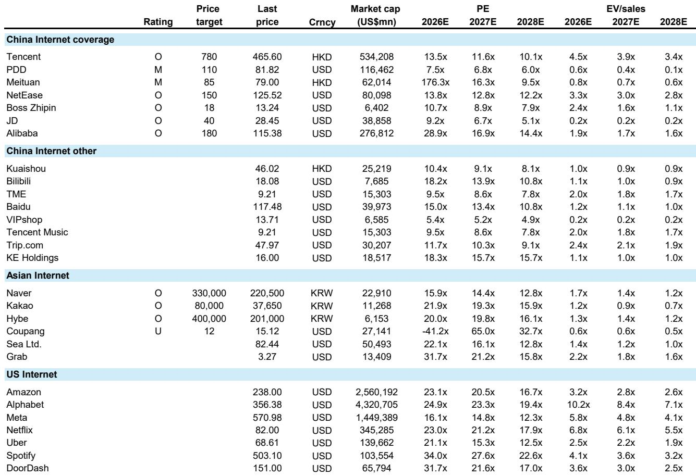
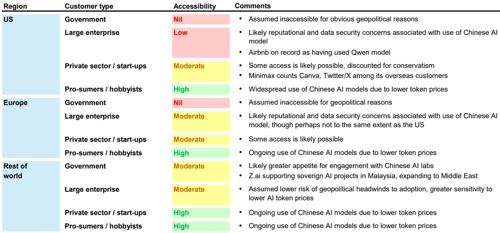

# The AI Commoditisation Debate Is Misguided: The Real Battle Will Be Won by User Perception, Not Model Intelligence

The prevailing narrative in artificial intelligence investing is that models are either racing toward a singularity of intelligence or collapsing into a commodity wasteland. Both camps are wrong. The most important dynamic shaping the AI industry over the next three to five years is not whether models converge in their underlying reasoning capabilities, but when human users decide a given model is "good enough" for a specific task. That perceptual threshold, not any academic benchmark, will determine market share, pricing power, and the ultimate profitability of the frontier labs.

This is not a semantic distinction. It has direct implications for how investors should think about the competitive landscape, the economic viability of the leading AI companies, and the geographic distribution of value creation. A global investment bank report published in mid-2026 provides the analytical scaffolding for this argument, and its framework deserves close attention from anyone trying to position a portfolio for the next phase of the AI cycle.

Several recent events have made this question urgent. The high cost of frontier model tokens has caused developers to ration usage, a notable shift from the era of uncapped experimentation. Headlines suggest that some leading AI companies are cutting prices to win share, while large enterprise users are conducting a double-take on the costs of token-maxxing. These are not isolated anecdotes. They are early signals that the market is moving from a phase of capability demonstration to a phase of economic optimisation. The winners will be those who understand that the commoditisation timeline varies dramatically by use case, and that the arbiter of competition changes once a task is considered "solved."

## The Critical Insight: AI Model Commoditisation Will Be Driven by Human Perception of "Good Enough," Not by Academic Convergence of Intelligence

The most common argument for AI commoditisation is that model intelligence will asymptote, meaning all serious competitors will eventually offer roughly equivalent capabilities. The counterargument is that frontier labs will continue to push the envelope, maintaining a durable differentiation premium. Both arguments miss the point. The real driver of commoditisation is the user's perception of whether a model can reliably complete a task at scale, not whether the model's underlying intelligence has converged with a competitor's.

Consider the analogy of cloud computing. Amazon Web Services did not become dominant because its infrastructure was infinitely superior to competitors. It became dominant because it became "good enough" for a wide range of workloads, and then the competition shifted to price, reliability, and ecosystem lock-in. The same dynamic is now unfolding in AI. Once a use case becomes reliably solvable, the return on incremental R&D for that specific task drops dramatically. The AI labs will naturally redirect their energy toward more complex problems, leaving the "solved" territory to be contested on cost and availability.

This perceptual framework has a powerful corollary: commoditisation will not happen uniformly. Consumer-oriented use cases, such as ordering bubble tea or booking a hotel room, will commoditise quickly because the tolerance for error is low and the number of competing models that can handle the task is high. Enterprise use cases like financial modelling or code generation will take longer, because the stakes are higher and the required reliability threshold is stricter. Frontier science applications, including drug discovery, nuclear fusion, and space exploration, will likely never fully commoditise, because the willingness to pay for marginal improvements in capability is effectively unlimited.

## Once a Use Case Becomes "Solved," the Competitive Battle Shifts from Capability to Cost and Availability, Reshaping the Economics of the Entire Industry

This is the most consequential insight in the report. When a task is not yet reliably solvable, the only thing that matters is capability. The model that can complete the task wins, regardless of price. But once multiple models can complete the task to an acceptable degree of accuracy, the competitive dynamic flips. The market share battle shifts to variables that look more like traditional infrastructure competition: cost per task, response time, reliability, developer trust, and ecosystem integration.

The implications for the frontier labs are profound. If they are correct that a broad range of consumer and enterprise use cases will become "solved" over the next few years, then the pricing power of the leading models for those use cases will erode. The report's authors note that they have personally consumed roughly two billion tokens in a month, and they have already begun offloading simpler tasks to cheaper flash models. This is the behaviour of a rational economic actor, and it will become the norm.

The banks' base case is that the US frontier labs will continue to unlock new capabilities that command a rising price premium among increasingly specialised customers. That is a plausible scenario for the highest-end use cases. But for the vast middle of the market, the competitive outcome will be determined by cost efficiency. The Chinese AI labs, which have demonstrated the ability to produce models that are six to twelve months behind US state-of-the-art but at a fraction of the cost, are well positioned to capture this segment. The report estimates that Chinese models could access 35 to 40 percent of the global AI total addressable market, even after accounting for geopolitical constraints that prevent some US and European enterprises from deploying Chinese models.

## The Path to AI Lab Profitability Runs Through R&D Reallocation, Not Unlimited Scaling

One of the most persistent concerns about the AI industry is that the frontier labs are trapped on an exponential cost curve, spending ever-larger sums on training runs with no clear path to profitability. The report offers a counterintuitive but hopeful perspective on this question. If commoditisation is driven by task completion and user perception, then the return on doing incremental R&D on a "solved" topic diminishes rapidly. The labs will be able to redirect their research budgets toward the shrinking envelope of use cases that still warrant frontier-level investment.

This dynamic creates a natural brake on aggregate training costs. The report argues that over time, the envelope of use cases worth spending exponentially higher amounts to solve will narrow. That means model training costs will rise more slowly than the current trajectory suggests, making it easier for the AI labs to show operating leverage. The path to profitability does not require infinite demand for frontier intelligence. It requires that the frontier labs focus their most expensive efforts on the problems that genuinely require frontier intelligence, while allowing the rest of the market to be served by cheaper, "good enough" models.

This is not a prediction of easy profits. It is a structural argument about how the industry's cost dynamics will evolve. The labs that survive will be those that can manage the transition from a capability-first mindset to an economic optimisation mindset. The labs that fail will be those that continue to burn capital on marginal improvements to already-solved problems.

## What the Report Does Not Fully Answer: The Timing and Shape of the Transition, and the Role of Sovereign AI

For all its analytical rigour, the report leaves several critical questions unresolved. The most important is timing. The report acknowledges that six to twelve months is an eternity on the AI frontier but a relatively short period in the real world, given sticky consumer habits and slow-moving enterprise bureaucracy. The gap between "technically possible" and "commercially deployed at scale" can be years, and the report does not provide a clear framework for predicting when specific use cases will cross the threshold.

A second unresolved question is the role of sovereign AI. The report notes that data security concerns and global geopolitics will prevent some US and European enterprises from deploying Chinese models. But it does not fully explore the implications of a world in which multiple sovereign AI ecosystems coexist, each with its own frontier labs, its own regulatory constraints, and its own definition of "good enough." The competitive dynamics within each ecosystem may look very different from the global picture.

A third open question is the impact of agentic AI on the commoditisation timeline. The report assumes that agentic AI will extend the range of tasks that can be solved, but it does not model the second-order effects of agents that can themselves select and orchestrate multiple models. If agents become the primary interface for AI consumption, the competitive battle may shift from individual model capability to the quality of the orchestration layer. The report's framework is useful, but it may need to be extended to account for this possibility.

## A Decision Framework for Investors: How to Map the Report's Insights to Portfolio Positioning

For investors trying to apply this analysis, the report suggests a three-part decision framework. The first question is which use cases are closest to the "good enough" threshold. Consumer-oriented agentic AI, including tasks like ordering products, booking travel, and generating content, is likely the first to commoditise. Investors should be sceptical of companies whose valuation depends on sustained pricing power in these segments.

The second question is which companies are best positioned to compete on cost and availability once commoditisation occurs. The Chinese AI labs are the obvious candidates, but the report also suggests that large platform companies with existing distribution and infrastructure, such as Tencent and Alibaba, could become significant beneficiaries. The ability to offer AI capabilities as a low-margin, high-volume service within an existing ecosystem is a powerful competitive advantage.

The third question is which companies have exposure to the frontier use cases that are unlikely to commoditise. Defence, healthcare, and frontier science are the most obvious candidates. Investors should look for companies that are building specialised AI capabilities for these sectors, or that have proprietary data or regulatory advantages that create barriers to entry. The willingness to pay for frontier intelligence in these sectors is effectively unlimited, which means the pricing power of the leading models could remain strong for years.

The report's framework also suggests a cautionary note for investors in the US frontier labs. The base case is that these labs will continue to command a premium for the highest-end use cases, but the middle of the market will be contested on cost. If the Chinese labs can capture 35 to 40 percent of the global TAM, the US labs' addressable market may be smaller than the current valuation multiples imply. The path to profitability exists, but it requires disciplined capital allocation and a clear-eyed assessment of which use cases are worth fighting for.

## Join the community to read the full report and review the original charts.

The report from Bernstein provides the analytical foundation, but the charts and data tables contain the granular detail that investors need to make specific portfolio decisions. The valuation comps table alone, covering more than twenty internet companies across the US, China, and Asia, offers a rich dataset for understanding how the market is currently pricing AI exposure. The original exhibits also include the visual framework for the perception-driven commoditisation model, which is worth studying in detail.

*This article is for learning and discussion only and does not constitute investment advice.*

Personal reading notes and learning share only. Not investment advice.

