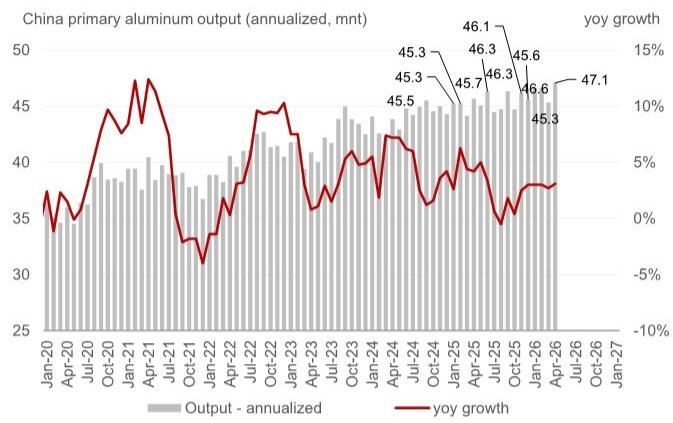
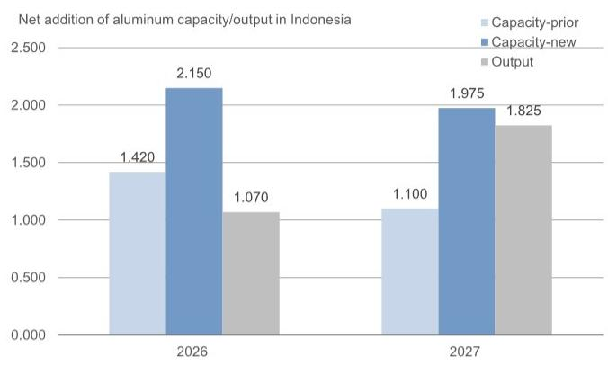
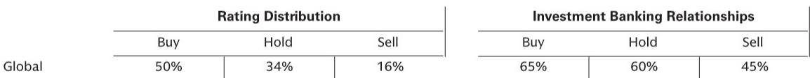

# GS：铝市场真正超预期的不是中国产量，而是海外供给的加速释放

全球铝市场正在经历一个被多数投资者低估的结构性变化。多数市场参与者仍在争论中国4500万吨产能红线能否守住，但GS最新一场专家电话会揭示了一个更关键的信号：海外铝冶炼产能的扩张速度正在显著加快，其体量和节奏远超此前的市场预期。

这份报告的核心判断是：未来三年全球铝市场面临的主要矛盾，将从“中国供给约束”转向“海外产能加速释放”。印尼和中亚正在成为中国铝企海外扩张的核心战场，2026年至2028年间，仅这两个地区的铝产能增量就可能达到近600万吨。这一数字意味着什么？它相当于全球铝市场规模的5%以上，足以改写未来几年的供需平衡表。

为什么这个判断现在重要？因为市场对铝的定价逻辑仍停留在“中国减产-供给偏紧”的旧框架中。但GS专家在实地调研后的结论是：中国产量已持续超过4500万吨，而海外产能的扩张正在形成新的供给曲线。如果投资者只盯着中国的环保督察和产能置换，可能会错过更大的结构性变量。

## 1. 印尼正在成为全球铝供给的新变量，产能释放节奏远超年初预期

GS专家在近期访问印尼后指出，印尼铝冶炼产能的扩张条件正在显著改善。最核心的变化是电力瓶颈的解除。在青山工业园，部分暂停的镍冶炼产能被重新调配给铝冶炼使用，释放了大量电力资源。与此同时，当地电厂建设的进度好于预期，包括710MW超临界火电机组的顺利出口，都为铝冶炼提供了稳定的能源保障。

基于实地调研，专家将印尼2026年的铝产能增量预期从年初的142万吨大幅上调至215万吨，2027年进一步上调至197.5万吨。这意味着仅印尼一地，两年内的产能增量就将超过400万吨。更重要的是，这些项目的投产节奏将从2026年四季度开始明显加速。

具体来看，几个关键项目的进展值得关注：项目B的一期400kt产能已于2026年5月投产，二期65kt也已启动，三期扩建正在等待电力配套；项目D的一期500kt预计2027年下半年投产；项目C的800kt产能计划在2026年底投产。这些项目不再是纸面规划，而是已经进入实质建设阶段。

这里的关键含义是：印尼铝产能的扩张不再是“可能”或“预期”，而是正在发生的现实。对于全球铝的定价者而言，这意味着未来两年的供给曲线需要被重新绘制。

## 2. 中亚正在成为第二个海外产能聚集地，中国企业的布局比想象中更大

如果说印尼是中国铝企海外扩张的第一站，那么中亚正在迅速成为第二极。GS专家观察到，中国生产商在哈萨克斯坦的铝产能建设正在加速推进，规划总产能达到540万吨。

两个项目构成了这一轮扩张的主体。项目G规划了三期共240万吨产能，一期80万吨预计2028年投产，目前已完成选址并开始打桩。项目H的规划更为宏大，总产能300万吨，同样分三期建设，一期100万吨也计划在2028年投产。这两个项目合计，仅2028年就有180万吨产能计划落地，相当于全球市场规模的2.4%。

值得思考的是，为什么是中国企业选择在哈萨克斯坦大规模投建铝产能？答案可能在于能源成本和地缘优势。中亚地区拥有丰富的天然气和煤炭资源，电力成本具有竞争力，同时地理位置靠近欧洲和亚洲两大消费市场。对于中国企业而言，在海外布局产能不仅能规避国内的产能天花板，还能更灵活地服务全球客户。

但这里有一个需要验证的问题：这些项目的建设周期是否可靠？从当前进度看，项目G已进入实质性施工阶段，但项目H仍处于早期规划。报告并未完全展开这些项目面临的融资、政策和技术风险。投资者需要持续跟踪项目进展，而不是简单线性外推。

## 3. 中国实际产量已持续高于4500万吨，环保督察并未改变这一趋势

市场一直在争论中国4500万吨的产能红线是否会被打破。GS专家的判断是：这一红线实质上已经被突破。根据专家的估算，2026年中国原铝产量将达到4550万吨，同比增长约100万吨，且这一数字可能仍偏保守。

产量超预期的来源并非新增合规产能，而是三类“灰色产能”：一是未经授权的超产行为，二是产能置换中本应关停的旧产能仍在运行，三是短期强化电解槽运行（即提高电流强度以增加产量，但这会损害电解槽寿命）。专家估计，这类灰色产能的规模在100-120万吨之间。

对于近期市场关注的环保督察，专家的判断是：这只是常规性检查，并非专门针对铝行业的调控。这意味着，在现有政策框架下，中国铝产量维持在当前高位甚至进一步增长的可能性是存在的。

这个判断对市场定价的含义是什么？如果中国产量持续高于4500万吨，那么全球铝市场的供给过剩压力将比预期更大。投资者需要重新评估“中国供给约束”这一长期叙事是否仍然成立。

## 4. 出口订单的强劲增长正在改变国内库存节奏，但可持续性存疑

GS专家注意到，2026年4-5月以来，中国铝产品出口订单出现了显著增长，尤其集中在未锻轧铝、铝合金、铝板带和铝型材等产品。这一变化将推动中国铝出口实现两位数增长，并可能从6月开始带动国内社会库存的去化。

出口订单的强劲增长，背后是海外市场对中国铝产品的旺盛需求。在全球铝价高企的背景下，中国铝产品的价格竞争力凸显，出口套利空间持续存在。但这里有一个关键问题：这种出口动能能否持续？

报告没有完全展开的是，海外铝产能加速释放后，中国铝出口的高增长可能面临挑战。当印尼和哈萨克斯坦的新产能逐步投产，这些地区的铝产品可能优先满足当地和周边市场需求，从而挤压中国产品的出口空间。此外，贸易摩擦和关税政策的变化也是不确定因素。

对于投资者而言，短期出口订单的强劲是利好，但中期来看，海外产能的释放可能改变中国铝企的出口竞争格局。这一逻辑的演绎需要结合全球铝贸易流的变化来持续跟踪。

## 5. 报告尚未完全回答的关键问题：海外产能的成本曲线和需求承接能力

尽管GS这份报告提供了极具价值的供给端信息，但它也留下了一些关键问题没有完全展开。

第一个问题是成本曲线。报告提到印尼铝冶炼的生产成本与中国相当，约为15000-16000元/吨，但青山工业园的电力成本（约0.46元/千瓦时）已高于中国平均水平（0.41元/千瓦时）。这意味着，随着更多项目投产，印尼铝冶炼的成本曲线可能高于市场预期。如果全球铝价下行，这些新产能的经济性将面临考验。

第二个问题是需求端的承接能力。600万吨的产能增量听起来很大，但全球铝需求也在增长。电动车、光伏、电网投资等结构性需求仍在扩张。问题是，这些新需求的增速能否跟上供给释放的节奏？如果供需失衡，铝价的下行风险将显著上升。

第三个问题是地缘政治风险。印尼和哈萨克斯坦的铝产能扩张高度依赖中国企业，但当地政策变化、资源民族主义抬头、以及大国博弈都可能影响项目进度。报告提到了印尼对采矿活动的管控在收紧，但并未深入分析政策风险的具体情景。

这些未解问题构成了我们持续跟踪这一主题的核心框架。它们也正是完整报告里图表和敏感性分析试图回答的部分。

## 6. 投资者需要建立的新观察框架：从中国单一变量到全球供给全景

基于以上分析，投资者对铝市场的分析框架需要做出调整。过去几年，市场习惯于将中国产量和环保政策作为核心变量。但未来，一个更全面的观察框架应该包含三个维度：

第一，中国产量弹性。4500万吨红线已被突破，但灰色产能的可持续性和政策容忍度仍需观察。建议关注月度产量数据、电解铝开工率以及环保督察的实质影响。

第二，海外产能兑现率。印尼和中亚的项目规划很大，但实际投产节奏可能受到电力配套、基础设施建设、以及企业融资能力的制约。建议建立项目级的跟踪数据库，区分“已投产”、“在建”、“规划中”三个层次，而不是简单加总规划数字。

第三，全球铝贸易流重构。随着海外产能释放，中国从“净供给者”到“竞争参与者”的角色转变可能加速。铝产品的贸易流向、价差结构、以及套利空间都将发生变化。这是定价逻辑中最容易被忽视的变量。

对于产业决策者和高净值投资者而言，当前铝市场正处于一个关键转折期。旧的叙事正在被打破，新的平衡尚未建立。在这个窗口期，信息的颗粒度和前瞻性比任何时候都重要。

这份GS报告的价值不仅在于它提供了印尼和中亚项目的具体数据，更在于它揭示了市场定价中尚未充分反映的结构性变化。当然，报告中的许多假设仍需验证——海外项目的建设进度、成本曲线、以及需求端的承接能力，都将在未来12-18个月接受市场的检验。

欢迎来星球微信群里继续讨论，我们将持续跟踪这些项目的实际进展，并在关键节点分享更新后的判断和敏感性分析。对于希望深入理解铝市场结构性变化的读者，完整报告中的图表和敏感性分析提供了更细致的视角。

Personal reading notes and learning share only. Not investment advice.

