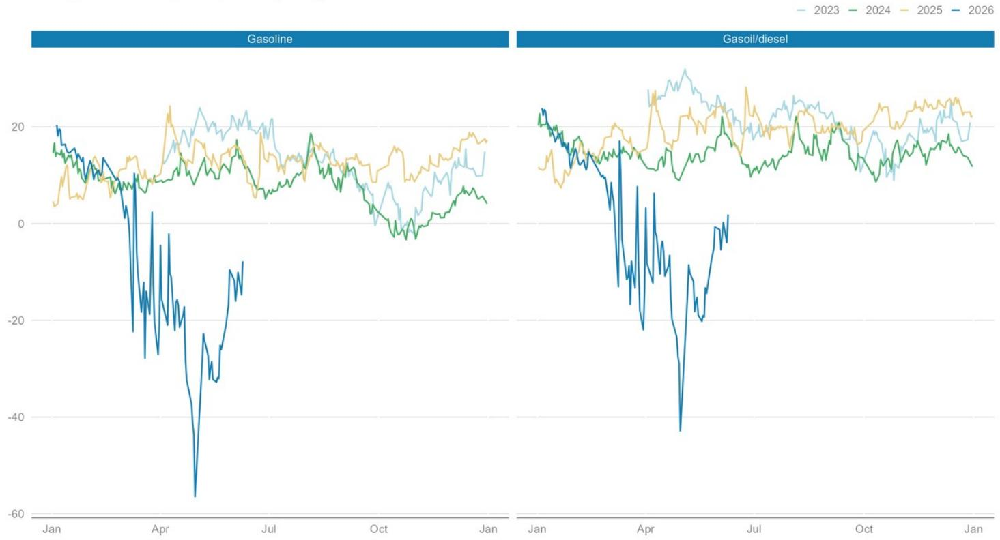
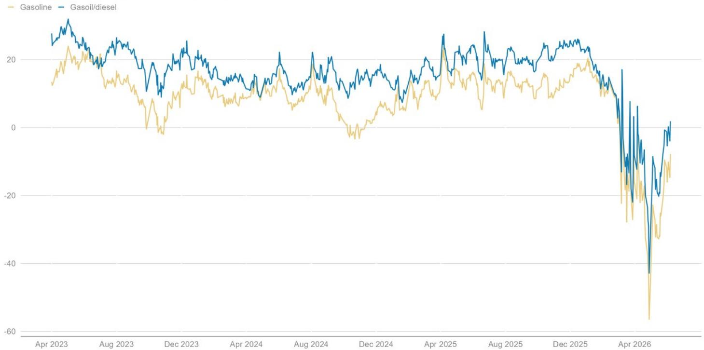
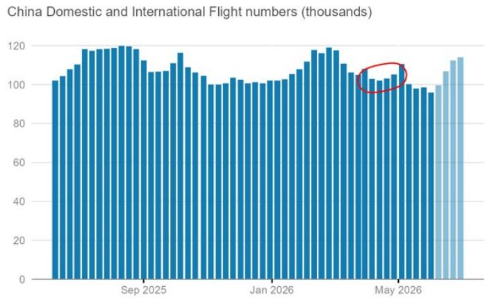

# 摩根斯坦利：中国原油进口的骤降并非需求崩塌，而是库存周期的主动调节

当全球市场都在关注霍尔木兹海峡的供应冲击时，一个关键变量正在被误读。中国在3月至5月期间，将原油进口量从2月的约12.8百万桶/日骤降至5月的约7.8百万桶/日，降幅接近500万桶/日。这一数字足以让任何大宗商品分析师警觉：全球最大的原油进口国是否正在经历需求端的断崖式下跌？

摩根斯坦利在最新发布的《石油数据摘要：欧洲》专题报告中，给出了一个反直觉但逻辑严密的判断。该机构大宗商品策略师Charlotte Firkins与Martijn Rats通过拆解中国的原油贸易、炼厂运行以及终端需求数据，揭示了一个被市场普遍忽略的事实：中国进口的锐减，并非因为经济突然失速或需求崩溃，而是在一个持续了数月的库存过剩周期中，主动进行的调节性收缩。

这份报告的价值不在于它告诉市场中国需求在下降——这已经是共识——而在于它精确地刻画了下降的性质、结构以及背后的驱动力。对于试图理解全球油市再平衡路径的投资者而言，这组数据提供了远比“需求疲软”四个字更丰富的分析框架。

## 1. 进口暴跌与库存反增的悖论，指向的是此前的过度进口而非当前的需求坍塌

市场最容易犯的错误，是将进口量的变化直接等同于消费量的变化。摩根斯坦利的数据清晰地展示了这一逻辑陷阱。5月中国原油进口降至约7.8百万桶/日，同比下降3.2百万桶/日，较2月危机前水平更是低了近500万桶/日。单看这个数字，很容易得出“中国需求大幅萎缩”的结论。

但报告提供了一个关键的反证：根据Vortexa的可观测原油库存数据，中国的商业和战略原油库存在3月和4月竟然还在持续累积，平均建库速度约为1.1百万桶/日。直到5月，库存才开始转为去化，平均速度约为75万桶/日。

进口大幅下降的同时库存仍在增加，这一悖论只有一个解释：在冲突爆发前的2025年大部分时间以及2026年初，中国一直在超额进口原油，大规模建立商业和战略库存。报告明确指出，在2026年2月，中国的原油平衡表已经处于约2.7百万桶/日的过剩状态，因为进口量远超炼厂需求。

因此，3月至5月的进口削减，是在一个已经严重过剩的库存背景下发生的。这不是需求端的主动收缩，而是供给端的被动调整。4月的完整政府数据进一步印证了这一点：当月国内产量（4.4百万桶/日）加上净进口（9.3百万桶/日），仍然略微超过了炼厂需求（13.4百万桶/日）。库存微增的数据与这一计算方向一致。

这意味着，市场如果仅凭进口数据就下调对中国需求的预期，很可能高估了实际需求的降幅。中国正在消化的是此前积累的库存，而非需求已经永久性失速。

## 2. 炼厂利润深度转负是进口削减的直接推手，国有企业与独立炼厂的行为出现结构性分化

如果说库存过剩是进口削减的背景，那么炼厂利润的崩塌则是直接触发机制。摩根斯坦利的报告揭示了这一传导链条的清晰逻辑。

到4月，中国炼厂的综合利润已经全面转负。原因有三重叠加：高昂的原油采购成本、政府对成品油出口的限制，以及国内成品油价格调整机制未能完全传导成本上涨。这三股力量共同挤压，使得炼厂每加工一桶原油都在亏损。

面对亏损，两类炼厂做出了截然不同的反应。国有企业（State-owned refiners）选择了激进地削减开工率。4月中国炼厂总开工量较2月下降了1.8百万桶/日，同比下降0.8百万桶/日。国有炼厂是此次减产的主力。它们有更强的财务纪律和更少的政治压力，能够迅速根据利润信号调整运营。

而独立炼厂（Independent refiners）则扮演了截然不同的角色。报告指出，这些炼厂被政府要求不得削减开工率，因此承担了更多供应国内市场的责任。这一结构性分化意味着，中国的原油进口削减并非均匀分布。独立炼厂由于被强制维持生产，其原料需求（尤其是燃料油等替代原料）反而相对坚挺，而国有炼厂的进口需求则大幅萎缩。

这一观察对理解后续市场演变至关重要。一旦炼厂利润得到修复——无论是通过原油价格回落、成品油出口政策松绑，还是国内定价机制的调整——国有炼厂的开工率将快速回升，从而带动进口需求反弹。目前的关键变量在于，这些利润修复的条件何时能够触发。

## 3. 终端需求并未崩塌，但结构性替代正在以前所未有的速度重塑汽柴油消费

摩根斯坦利对终端需求的评估，是这份报告中最具洞察力的部分。该机构计算的中国“表观需求”（Apparent Demand）显示，4月总需求同比下降1.2百万桶/日，降幅为8%。但这一数字需要仔细拆解。

需求下降的主要驱动力来自LPG和燃料油，这两项贡献了约70%的同比降幅。这背后的逻辑是清晰的：石化装置（petchem facilities）削减了开工率，而独立炼厂则减少了对燃料油作为原料的使用。这是工业端的调整，而非消费端的萎缩。

真正值得关注的是运输燃料市场。报告提供了两个看似矛盾的数据点：一方面，中国的出行活动数据（如百度拥堵指数和航班数量）依然强劲，甚至同比略有增长；另一方面，柴油和汽油的表观需求却呈现疲软态势。

答案在于替代效应的加速。报告引用了Argus的估算数据：2026年一季度，新能源和LNG重卡对柴油的替代量同比增加了23万桶/日。LNG重卡在4月的销售渗透率已达到26%，而电动重卡的销售在5月同比增长超过90%，渗透率从1月的约30%跃升至5月的约40%。在乘用车领域，新能源汽车渗透率在3月达到51%，4月进一步攀升至61%，而传统燃油车销量同比萎缩了37%。

五一假期的数据是这一趋势的缩影。尽管跨区域出行人次同比增长3.5%至创纪录的15.2亿人次，但高速公路上的新能源车充电量同比暴增53%，部分加油站报告假期销量同比下降10%至30%，在东部和南部发达地区降幅甚至达到50%。

这组数据指向一个重要的结论：中国的石油需求峰值可能已经或正在到来，但其驱动因素并非经济放缓，而是能源转型的加速。这一结构性变化意味着，即使宏观经济增长保持稳定，汽油和柴油的需求也将在未来几年内持续承压。对于全球油市而言，中国需求增长的引擎正在从“量”的增长转向“质”的替代。

## 4. 报告尚未完全回答的关键问题：利润修复路径与政策变量的二阶影响

尽管摩根斯坦利的分析框架已经相当完整，但仍有几个关键问题留待进一步验证，而这些恰恰是判断后续市场走势的核心。

第一个问题是炼厂利润修复的具体路径。报告指出国有炼厂因亏损而减产，独立炼厂因政策指令而维持生产。但这一格局能持续多久？如果原油价格维持高位，而国内成品油价格调整机制继续滞后，国有炼厂的亏损将持续累积，进一步削减开工率。反之，如果原油价格回落或政府允许更大幅度的成品油涨价，炼厂利润将快速修复，进口需求也将随之反弹。目前来看，政策层面存在较大的不确定性。

第二个问题是独立炼厂的生产持续性。它们被要求不得减产，但长期亏损运营显然不可持续。如果独立炼厂的财务状况恶化到一定程度，是否会出现非政策性的被动减产？这一风险目前尚未被市场充分定价。

第三个问题是石化端需求的恢复节奏。LPG和燃料油需求的下降是当前表观需求下滑的主要拖累。这部分需求与宏观经济活动和化工品价格密切相关。如果全球化工品需求复苏，或者中国石化装置的利润改善，这部分需求有望回升，从而部分抵消运输燃料的结构性下滑。

这些问题意味着，当前市场对中国需求的悲观情绪，可能在方向上正确，但在幅度上存在偏差。摩根斯坦利的报告提供了一个更精细的坐标系，但最终的答案仍需等待更多数据的验证。

## 5. 投资者的观察框架：从总量判断转向结构拆解与政策信号追踪

基于这份报告的洞见，投资者需要建立一个新的分析框架来追踪中国石油市场的变化。

第一，关注库存周期的拐点。中国的商业和战略库存水平是判断进口需求何时反弹的关键先行指标。一旦库存去化接近尾声，进口量将不再受制于库存调整，而是回归到反映真实需求的水平。当前5月的库存去化速度（约75万桶/日）仍然温和，意味着库存调整尚未结束。

第二，追踪炼厂利润的边际变化。这是连接上游原油采购与下游成品油市场的核心变量。建议关注中国国内成品油批发价格的走势、政府是否调整出口配额，以及国内零售价格调整机制的触发频率。任何有利于炼厂利润修复的信号，都应被视为中国进口需求回暖的前兆。

第三，区分结构性替代与周期性需求。能源转型对汽柴油需求的侵蚀是结构性的，不可逆的。但LPG、燃料油以及部分化工原料的需求波动是周期性的，与经济活动和利润周期相关。投资者不应将周期性下滑与结构性萎缩混为一谈，从而高估中国需求的长期降幅。

第四，关注PMI与制造业活动的边际变化。报告指出，尽管PMI在4月和5月连续下滑，但仍处于扩张区间，且同比高于2025年同期。制造业活动的韧性是支撑柴油需求的关键。如果后续PMI数据重新回升，将意味着工业端的石油需求可能比市场预期的更具弹性。

这份报告的价值在于，它帮助读者从“中国需求在下降”这一笼统的叙事中走出来，看到一个更复杂、更分层的图景。进口的下降是库存调节的结果，而非需求的崩溃；需求的下滑是结构性的替代与周期性的疲软共同作用的结果，而非单一因素的驱动。

对于试图把握全球油市再平衡节奏的投资者而言，理解这些差异，比知道一个总量数字要重要得多。

---

这份报告还有更多关于炼厂利润拆解、石化端需求演变以及独立炼厂运营状态的详细图表和数据分析，由于篇幅限制未能完全展开。这些内容对于判断后续市场拐点具有重要参考价值。

欢迎来我们的星球微信群里继续讨论。我们将定期组织对这类深度研报的拆解与交流，帮助订阅者在信息过载的市场中，建立属于自己的分析框架。

Personal reading notes and learning share only. Not investment advice.

